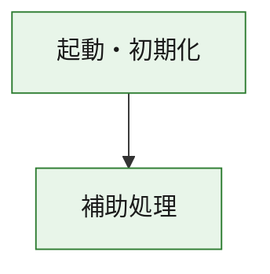
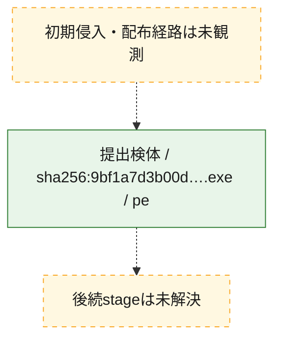
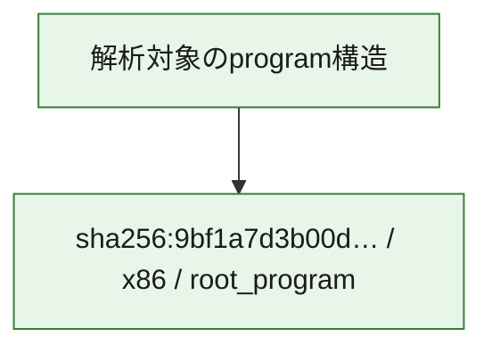

# 全体ロジック：9bf1a7d3b00d0045ee92c2464681b094706b8222a0e2b4f5e67c89b447490c30

代表関数の静的証跡から、起動・初期化の処理群を確認しました。

## 読み方

- phaseの掲載順は解析上の整理順です。observed_call_edgesがない段階間の実行順を断定しません。
- 図の実線は静的に観測した関係、点線と黄色のノードは未観測・未解決の関係を示します。
- 図は静的な要約であり、動的実行を再現するものではありません。
- 詳細な関数解説とfingerprintは[STATIC-LOGIC.md](STATIC-LOGIC.md)を参照してください。

## 静的可視化

### 実行フロー

### 感染チェーン

### モジュール関係

## 処理段階

### 1. 起動・初期化

entry pointから初期化と後続処理への移行を確認します。
確度: `confirmed_static_function_evidence`

- `9bf1a7d3b00d0045ee92c2464681b094706b8222a0e2b4f5e67c89b447490c30:ghidra:180001010` — 初期化と主要処理への分岐を行う入口関数です。 状態: `succeeded`、選定理由: `entry_point`, `meaningful_symbol_name`, `reviewed_call_centrality:22`, `role:entrypoint`, `small_program_complete_context`

### 2. 補助処理

主要処理を支える一般内部関数またはlibrary処理を確認します。
確度: `confirmed_static_function_evidence`

- `9bf1a7d3b00d0045ee92c2464681b094706b8222a0e2b4f5e67c89b447490c30:ghidra:180001240` — 検体内部の一般処理を実装する関数です。 状態: `succeeded`、選定理由: `context_representative`, `reviewed_call_centrality:2`, `small_program_complete_context`
- `9bf1a7d3b00d0045ee92c2464681b094706b8222a0e2b4f5e67c89b447490c30:ghidra:180001350` — 検体内部の一般処理を実装する関数です。 状態: `succeeded`、選定理由: `context_representative`, `reviewed_call_centrality:25`, `small_program_complete_context`
- `9bf1a7d3b00d0045ee92c2464681b094706b8222a0e2b4f5e67c89b447490c30:ghidra:180003780` — 検体内部の一般処理を実装する関数です。 状態: `succeeded`、選定理由: `context_representative`, `reviewed_call_centrality:2`, `small_program_complete_context`
- `9bf1a7d3b00d0045ee92c2464681b094706b8222a0e2b4f5e67c89b447490c30:ghidra:1800038e0` — 検体内部の一般処理を実装する関数です。 状態: `succeeded`、選定理由: `context_representative`, `reviewed_call_centrality:2`, `small_program_complete_context`

## 観測したcall関係

- `9bf1a7d3b00d0045ee92c2464681b094706b8222a0e2b4f5e67c89b447490c30:ghidra:180001010` → `9bf1a7d3b00d0045ee92c2464681b094706b8222a0e2b4f5e67c89b447490c30:ghidra:180001240` （`startup` → `support`）
- `9bf1a7d3b00d0045ee92c2464681b094706b8222a0e2b4f5e67c89b447490c30:ghidra:180001010` → `9bf1a7d3b00d0045ee92c2464681b094706b8222a0e2b4f5e67c89b447490c30:ghidra:180001350` （`startup` → `support`）
- `9bf1a7d3b00d0045ee92c2464681b094706b8222a0e2b4f5e67c89b447490c30:ghidra:180001350` → `9bf1a7d3b00d0045ee92c2464681b094706b8222a0e2b4f5e67c89b447490c30:ghidra:180001240` （`support` → `support`）
- `9bf1a7d3b00d0045ee92c2464681b094706b8222a0e2b4f5e67c89b447490c30:ghidra:180001350` → `9bf1a7d3b00d0045ee92c2464681b094706b8222a0e2b4f5e67c89b447490c30:ghidra:180003780` （`support` → `support`）
- `9bf1a7d3b00d0045ee92c2464681b094706b8222a0e2b4f5e67c89b447490c30:ghidra:180001350` → `9bf1a7d3b00d0045ee92c2464681b094706b8222a0e2b4f5e67c89b447490c30:ghidra:1800038e0` （`support` → `support`）
- `9bf1a7d3b00d0045ee92c2464681b094706b8222a0e2b4f5e67c89b447490c30:ghidra:180003780` → `9bf1a7d3b00d0045ee92c2464681b094706b8222a0e2b4f5e67c89b447490c30:ghidra:1800038e0` （`support` → `support`）
- `ghidra-function:2a8686a7a8c726f5604c0500` → `ghidra-external:0b931a4cefd4447fff6732d9` （`unclassified` → `unclassified`）
- `ghidra-function:2a8686a7a8c726f5604c0500` → `ghidra-external:0da9397af010e5ec5b693382` （`unclassified` → `unclassified`）
- `ghidra-function:2a8686a7a8c726f5604c0500` → `ghidra-external:1c7fb99f7f06d35b58ac91a3` （`unclassified` → `unclassified`）
- `ghidra-function:2a8686a7a8c726f5604c0500` → `ghidra-external:33e776cc732ad83c0b33bb7b` （`unclassified` → `unclassified`）
- `ghidra-function:2a8686a7a8c726f5604c0500` → `ghidra-external:43b803125335fa1a13460fa3` （`unclassified` → `unclassified`）
- `ghidra-function:2a8686a7a8c726f5604c0500` → `ghidra-external:45f4aff0fea29aa4c613f43a` （`unclassified` → `unclassified`）
- `ghidra-function:2a8686a7a8c726f5604c0500` → `ghidra-external:4ebfa8994291eb51d47951fa` （`unclassified` → `unclassified`）
- `ghidra-function:2a8686a7a8c726f5604c0500` → `ghidra-external:8130784083834885f8d5190c` （`unclassified` → `unclassified`）
- `ghidra-function:2a8686a7a8c726f5604c0500` → `ghidra-external:8a4560a8d4bad4e494c4b708` （`unclassified` → `unclassified`）
- `ghidra-function:2a8686a7a8c726f5604c0500` → `ghidra-external:9b5eecee42d79f73001b2974` （`unclassified` → `unclassified`）
- `ghidra-function:2a8686a7a8c726f5604c0500` → `ghidra-external:ab2a2a9299244e2b5c7efb2a` （`unclassified` → `unclassified`）
- `ghidra-function:2a8686a7a8c726f5604c0500` → `ghidra-external:ac7b164b7de0a7531f471d0c` （`unclassified` → `unclassified`）
- `ghidra-function:2a8686a7a8c726f5604c0500` → `ghidra-external:b53ebea2d690c1477b25e21e` （`unclassified` → `unclassified`）
- `ghidra-function:2a8686a7a8c726f5604c0500` → `ghidra-external:b7cd2b9aa1f24a9353ff2e5f` （`unclassified` → `unclassified`）
- `ghidra-function:2a8686a7a8c726f5604c0500` → `ghidra-external:bb0e5e876673ed48419bb76b` （`unclassified` → `unclassified`）
- `ghidra-function:2a8686a7a8c726f5604c0500` → `ghidra-external:bd5b644cc8e19815c581cd7a` （`unclassified` → `unclassified`）
- `ghidra-function:2a8686a7a8c726f5604c0500` → `ghidra-external:d4d09914ba9598ecf19c0d00` （`unclassified` → `unclassified`）
- `ghidra-function:2a8686a7a8c726f5604c0500` → `ghidra-external:ea313c9bea4381a7d60f01b9` （`unclassified` → `unclassified`）
- `ghidra-function:2a8686a7a8c726f5604c0500` → `ghidra-external:f603fdb07a12429daa7ac1cc` （`unclassified` → `unclassified`）
- `ghidra-function:2a8686a7a8c726f5604c0500` → `ghidra-external:fb9cf5b3f3563cfda470bb2f` （`unclassified` → `unclassified`）
- `ghidra-function:2a8686a7a8c726f5604c0500` → `ghidra-external:fbc006dd671dc071b4e37906` （`unclassified` → `unclassified`）
- `ghidra-function:2a8686a7a8c726f5604c0500` → `ghidra-function:57666e93f1cf89200c296267` （`unclassified` → `unclassified`）
- `ghidra-function:2a8686a7a8c726f5604c0500` → `ghidra-function:9c72f3681b7e8aeb1bca698d` （`unclassified` → `unclassified`）
- `ghidra-function:2a8686a7a8c726f5604c0500` → `ghidra-function:eec29ef0dad8c0a8d37d3059` （`unclassified` → `unclassified`）
- `ghidra-function:57666e93f1cf89200c296267` → `ghidra-function:eec29ef0dad8c0a8d37d3059` （`unclassified` → `unclassified`）
- `ghidra-function:ef197d88444b6449e64693f7` → `ghidra-function:0475c14a4f7806c45e1e7f20` （`unclassified` → `unclassified`）
- `ghidra-function:ef197d88444b6449e64693f7` → `ghidra-function:052295e15403532e43aacc7f` （`unclassified` → `unclassified`）
- `ghidra-function:ef197d88444b6449e64693f7` → `ghidra-function:2a8686a7a8c726f5604c0500` （`unclassified` → `unclassified`）
- `ghidra-function:ef197d88444b6449e64693f7` → `ghidra-function:3ae28bc5a0c85590158e3420` （`unclassified` → `unclassified`）
- `ghidra-function:ef197d88444b6449e64693f7` → `ghidra-function:6d7c5d5af4206702afa74996` （`unclassified` → `unclassified`）
- `ghidra-function:ef197d88444b6449e64693f7` → `ghidra-function:8d2b85955264cbc032fcf7a8` （`unclassified` → `unclassified`）
- `ghidra-function:ef197d88444b6449e64693f7` → `ghidra-function:9c72f3681b7e8aeb1bca698d` （`unclassified` → `unclassified`）
- `ghidra-function:ef197d88444b6449e64693f7` → `ghidra-function:d63b930f1b36375e3d8aab99` （`unclassified` → `unclassified`）
- `ghidra-function:ef197d88444b6449e64693f7` → `ghidra-function:de1f0498b20a358d601f53ee` （`unclassified` → `unclassified`）
- `ghidra-function:ef197d88444b6449e64693f7` → `ghidra-function:e0317b6a5998c690196cb29d` （`unclassified` → `unclassified`）
- `ghidra-function:ef197d88444b6449e64693f7` → `ghidra-function:ed61fecf890c5b438ea36227` （`unclassified` → `unclassified`）
- `ghidra-function:ef197d88444b6449e64693f7` → `ghidra-function:eee1bef3471c4bed9426ab10` （`unclassified` → `unclassified`）

## 解析範囲と制約

- 選定外関数は全体inventoryへ残しますが、関数本体の個別解説対象にはしていません。
- indirect call、難読化、packer、VM、壊れたcontrol flowによりcall関係が欠落する場合があります。
- 文書は静的解析に基づき、検体実行や外部通信による動的確認は行っていません。
