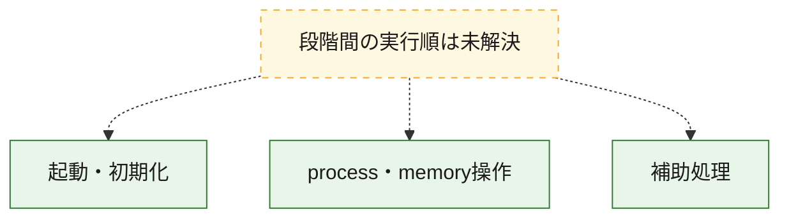
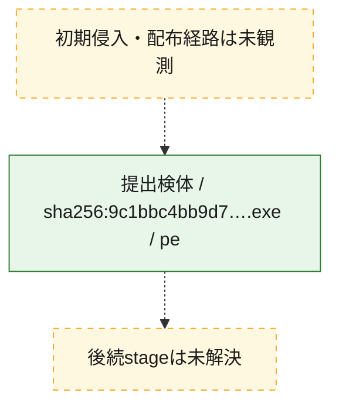
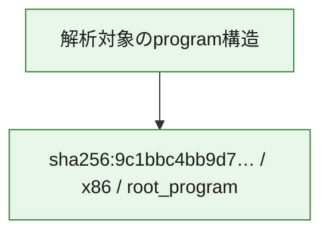

# 全体ロジック：9c1bbc4bb9d79ae679a2c6fdb37bd51ce539e7b5419f4eda3bd75e46e6f37b71

代表関数の静的証跡から、起動・初期化、process・memory操作の処理群を確認しました。

## 読み方

- phaseの掲載順は解析上の整理順です。observed_call_edgesがない段階間の実行順を断定しません。
- 図の実線は静的に観測した関係、点線と黄色のノードは未観測・未解決の関係を示します。
- 図は静的な要約であり、動的実行を再現するものではありません。
- 詳細な関数解説とfingerprintは[STATIC-LOGIC.md](STATIC-LOGIC.md)を参照してください。

## 静的可視化

### 実行フロー

### 感染チェーン

### モジュール関係

## 処理段階

### 1. 起動・初期化

entry pointから初期化と後続処理への移行を確認します。
確度: `confirmed_static_function_evidence_with_limits`

- `9c1bbc4bb9d79ae679a2c6fdb37bd51ce539e7b5419f4eda3bd75e46e6f37b71:ghidra:140017210` — 初期化と主要処理への分岐を行う入口関数です。 状態: `limited_bad_instruction_or_flow`、選定理由: `entry_point`, `meaningful_symbol_name`, `reviewed_call_centrality:2`, `role:entrypoint`

### 2. process・memory操作

process、thread、module、memory操作と実行移行を確認します。
確度: `confirmed_static_function_evidence`

- `9c1bbc4bb9d79ae679a2c6fdb37bd51ce539e7b5419f4eda3bd75e46e6f37b71:ghidra:1400015f0` — process、thread、module、またはmemory操作に関係する関数です。 状態: `succeeded`、選定理由: `context_representative`, `reviewed_call_centrality:9`, `role:process_or_memory_operation`
- `9c1bbc4bb9d79ae679a2c6fdb37bd51ce539e7b5419f4eda3bd75e46e6f37b71:ghidra:140001810` — process、thread、module、またはmemory操作に関係する関数です。 状態: `succeeded`、選定理由: `context_representative`, `reviewed_call_centrality:26`, `role:process_or_memory_operation`

### 3. 補助処理

主要処理を支える一般内部関数またはlibrary処理を確認します。
確度: `confirmed_static_function_evidence`

- `9c1bbc4bb9d79ae679a2c6fdb37bd51ce539e7b5419f4eda3bd75e46e6f37b71:ghidra:140001000` — 検体内部の一般処理を実装する関数です。 状態: `succeeded`、選定理由: `context_representative`, `reviewed_call_centrality:14`
- `9c1bbc4bb9d79ae679a2c6fdb37bd51ce539e7b5419f4eda3bd75e46e6f37b71:ghidra:140001110` — 検体内部の一般処理を実装する関数です。 状態: `succeeded`、選定理由: `context_representative`, `reviewed_call_centrality:2`
- `9c1bbc4bb9d79ae679a2c6fdb37bd51ce539e7b5419f4eda3bd75e46e6f37b71:ghidra:140001170` — 検体内部の一般処理を実装する関数です。 状態: `succeeded`、選定理由: `context_representative`, `reviewed_call_centrality:2`
- `9c1bbc4bb9d79ae679a2c6fdb37bd51ce539e7b5419f4eda3bd75e46e6f37b71:ghidra:1400011d0` — 検体内部の一般処理を実装する関数です。 状態: `succeeded`、選定理由: `context_representative`, `reviewed_call_centrality:2`
- `9c1bbc4bb9d79ae679a2c6fdb37bd51ce539e7b5419f4eda3bd75e46e6f37b71:ghidra:140001230` — 検体内部の一般処理を実装する関数です。 状態: `succeeded`、選定理由: `context_representative`, `reviewed_call_centrality:2`
- `9c1bbc4bb9d79ae679a2c6fdb37bd51ce539e7b5419f4eda3bd75e46e6f37b71:ghidra:140001290` — 検体内部の一般処理を実装する関数です。 状態: `succeeded`、選定理由: `context_representative`, `reviewed_call_centrality:2`
- `9c1bbc4bb9d79ae679a2c6fdb37bd51ce539e7b5419f4eda3bd75e46e6f37b71:ghidra:1400012f0` — 検体内部の一般処理を実装する関数です。 状態: `succeeded`、選定理由: `context_representative`, `reviewed_call_centrality:2`
- `9c1bbc4bb9d79ae679a2c6fdb37bd51ce539e7b5419f4eda3bd75e46e6f37b71:ghidra:140001350` — 検体内部の一般処理を実装する関数です。 状態: `succeeded`、選定理由: `context_representative`, `reviewed_call_centrality:2`
- `9c1bbc4bb9d79ae679a2c6fdb37bd51ce539e7b5419f4eda3bd75e46e6f37b71:ghidra:1400013b0` — 検体内部の一般処理を実装する関数です。 状態: `succeeded`、選定理由: `context_representative`, `reviewed_call_centrality:2`
- `9c1bbc4bb9d79ae679a2c6fdb37bd51ce539e7b5419f4eda3bd75e46e6f37b71:ghidra:140001410` — 検体内部の一般処理を実装する関数です。 状態: `succeeded`、選定理由: `context_representative`, `reviewed_call_centrality:2`
- `9c1bbc4bb9d79ae679a2c6fdb37bd51ce539e7b5419f4eda3bd75e46e6f37b71:ghidra:140001470` — 検体内部の一般処理を実装する関数です。 状態: `succeeded`、選定理由: `context_representative`, `reviewed_call_centrality:2`
- `9c1bbc4bb9d79ae679a2c6fdb37bd51ce539e7b5419f4eda3bd75e46e6f37b71:ghidra:1400014d0` — 検体内部の一般処理を実装する関数です。 状態: `succeeded`、選定理由: `context_representative`, `reviewed_call_centrality:2`
- `9c1bbc4bb9d79ae679a2c6fdb37bd51ce539e7b5419f4eda3bd75e46e6f37b71:ghidra:140001530` — 検体内部の一般処理を実装する関数です。 状態: `succeeded`、選定理由: `context_representative`, `reviewed_call_centrality:2`
- `9c1bbc4bb9d79ae679a2c6fdb37bd51ce539e7b5419f4eda3bd75e46e6f37b71:ghidra:140001590` — 検体内部の一般処理を実装する関数です。 状態: `succeeded`、選定理由: `context_representative`, `reviewed_call_centrality:2`
- `9c1bbc4bb9d79ae679a2c6fdb37bd51ce539e7b5419f4eda3bd75e46e6f37b71:ghidra:140001750` — 検体内部の一般処理を実装する関数です。 状態: `succeeded`、選定理由: `context_representative`, `reviewed_call_centrality:2`
- `9c1bbc4bb9d79ae679a2c6fdb37bd51ce539e7b5419f4eda3bd75e46e6f37b71:ghidra:1400017b0` — 検体内部の一般処理を実装する関数です。 状態: `succeeded`、選定理由: `context_representative`, `reviewed_call_centrality:2`
- `9c1bbc4bb9d79ae679a2c6fdb37bd51ce539e7b5419f4eda3bd75e46e6f37b71:ghidra:140001a30` — 検体内部の一般処理を実装する関数です。 状態: `succeeded`、選定理由: `context_representative`, `reviewed_call_centrality:2`
- `9c1bbc4bb9d79ae679a2c6fdb37bd51ce539e7b5419f4eda3bd75e46e6f37b71:ghidra:140001a90` — 検体内部の一般処理を実装する関数です。 状態: `succeeded`、選定理由: `context_representative`, `reviewed_call_centrality:2`
- `9c1bbc4bb9d79ae679a2c6fdb37bd51ce539e7b5419f4eda3bd75e46e6f37b71:ghidra:140001af0` — 検体内部の一般処理を実装する関数です。 状態: `succeeded`、選定理由: `context_representative`, `reviewed_call_centrality:2`
- `9c1bbc4bb9d79ae679a2c6fdb37bd51ce539e7b5419f4eda3bd75e46e6f37b71:ghidra:140001b50` — 検体内部の一般処理を実装する関数です。 状態: `succeeded`、選定理由: `context_representative`, `reviewed_call_centrality:2`
- `9c1bbc4bb9d79ae679a2c6fdb37bd51ce539e7b5419f4eda3bd75e46e6f37b71:ghidra:140001bb0` — 検体内部の一般処理を実装する関数です。 状態: `succeeded`、選定理由: `context_representative`, `reviewed_call_centrality:2`
- `9c1bbc4bb9d79ae679a2c6fdb37bd51ce539e7b5419f4eda3bd75e46e6f37b71:ghidra:140001c10` — 検体内部の一般処理を実装する関数です。 状態: `succeeded`、選定理由: `context_representative`, `reviewed_call_centrality:2`
- `9c1bbc4bb9d79ae679a2c6fdb37bd51ce539e7b5419f4eda3bd75e46e6f37b71:ghidra:140001c70` — 検体内部の一般処理を実装する関数です。 状態: `succeeded`、選定理由: `context_representative`, `reviewed_call_centrality:2`
- `9c1bbc4bb9d79ae679a2c6fdb37bd51ce539e7b5419f4eda3bd75e46e6f37b71:ghidra:140001cd0` — 検体内部の一般処理を実装する関数です。 状態: `succeeded`、選定理由: `context_representative`, `reviewed_call_centrality:2`
- `9c1bbc4bb9d79ae679a2c6fdb37bd51ce539e7b5419f4eda3bd75e46e6f37b71:ghidra:140001d30` — 検体内部の一般処理を実装する関数です。 状態: `succeeded`、選定理由: `context_representative`, `reviewed_call_centrality:2`
- `9c1bbc4bb9d79ae679a2c6fdb37bd51ce539e7b5419f4eda3bd75e46e6f37b71:ghidra:140001d90` — 検体内部の一般処理を実装する関数です。 状態: `succeeded`、選定理由: `context_representative`, `reviewed_call_centrality:2`
- `9c1bbc4bb9d79ae679a2c6fdb37bd51ce539e7b5419f4eda3bd75e46e6f37b71:ghidra:140001df0` — 検体内部の一般処理を実装する関数です。 状態: `succeeded`、選定理由: `context_representative`, `reviewed_call_centrality:2`
- `9c1bbc4bb9d79ae679a2c6fdb37bd51ce539e7b5419f4eda3bd75e46e6f37b71:ghidra:140001e50` — 検体内部の一般処理を実装する関数です。 状態: `succeeded`、選定理由: `context_representative`, `reviewed_call_centrality:2`
- `9c1bbc4bb9d79ae679a2c6fdb37bd51ce539e7b5419f4eda3bd75e46e6f37b71:ghidra:140001eb0` — 検体内部の一般処理を実装する関数です。 状態: `succeeded`、選定理由: `context_representative`, `reviewed_call_centrality:2`

## 観測したcall関係

- 代表関数間で直接解決できた呼出関係はありません。

## 解析範囲と制約

- 選定外関数は全体inventoryへ残しますが、関数本体の個別解説対象にはしていません。
- indirect call、難読化、packer、VM、壊れたcontrol flowによりcall関係が欠落する場合があります。
- 文書は静的解析に基づき、検体実行や外部通信による動的確認は行っていません。
