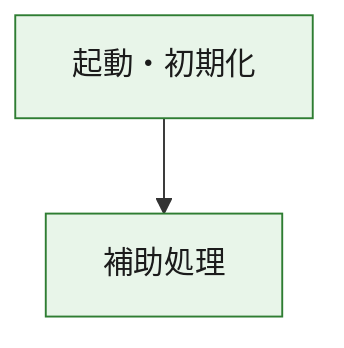
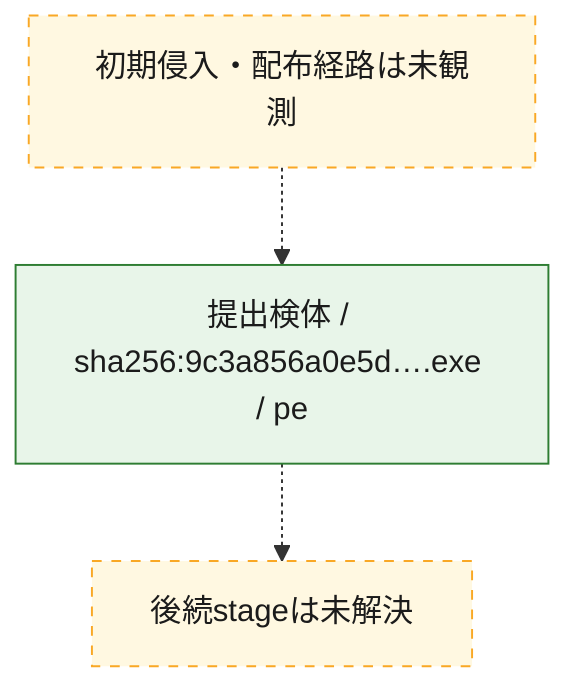
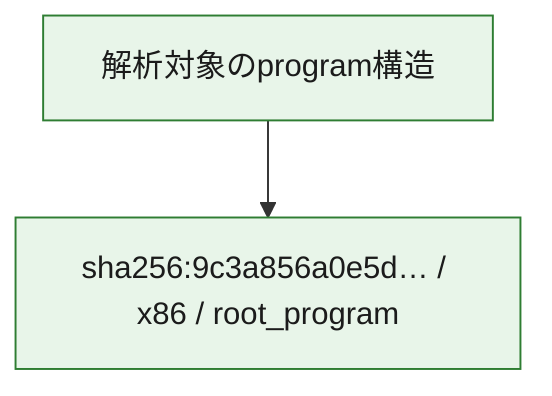

# 全体ロジック：9c3a856a0e5d258a8552097df5e4ecaf2ff7feeb07ce18eecfd0fa9bfaff3a30

代表関数の静的証跡から、起動・初期化の処理群を確認しました。

## 読み方

- phaseの掲載順は解析上の整理順です。observed_call_edgesがない段階間の実行順を断定しません。
- 図の実線は静的に観測した関係、点線と黄色のノードは未観測・未解決の関係を示します。
- 図は静的な要約であり、動的実行を再現するものではありません。
- 詳細な関数解説とfingerprintは[STATIC-LOGIC.md](STATIC-LOGIC.md)を参照してください。

## 静的可視化

### 実行フロー

### 感染チェーン

### モジュール関係

## 処理段階

### 1. 起動・初期化

entry pointから初期化と後続処理への移行を確認します。
確度: `confirmed_static_function_evidence`

- `9c3a856a0e5d258a8552097df5e4ecaf2ff7feeb07ce18eecfd0fa9bfaff3a30:ghidra:180001010` — 初期化と主要処理への分岐を行う入口関数です。 状態: `succeeded`、選定理由: `entry_point`, `meaningful_symbol_name`, `reviewed_call_centrality:22`, `role:entrypoint`, `small_program_complete_context`

### 2. 補助処理

主要処理を支える一般内部関数またはlibrary処理を確認します。
確度: `confirmed_static_function_evidence`

- `9c3a856a0e5d258a8552097df5e4ecaf2ff7feeb07ce18eecfd0fa9bfaff3a30:ghidra:180001240` — 検体内部の一般処理を実装する関数です。 状態: `succeeded`、選定理由: `context_representative`, `reviewed_call_centrality:2`, `small_program_complete_context`
- `9c3a856a0e5d258a8552097df5e4ecaf2ff7feeb07ce18eecfd0fa9bfaff3a30:ghidra:180001350` — 検体内部の一般処理を実装する関数です。 状態: `succeeded`、選定理由: `context_representative`, `reviewed_call_centrality:25`, `small_program_complete_context`
- `9c3a856a0e5d258a8552097df5e4ecaf2ff7feeb07ce18eecfd0fa9bfaff3a30:ghidra:180003780` — 検体内部の一般処理を実装する関数です。 状態: `succeeded`、選定理由: `context_representative`, `reviewed_call_centrality:2`, `small_program_complete_context`
- `9c3a856a0e5d258a8552097df5e4ecaf2ff7feeb07ce18eecfd0fa9bfaff3a30:ghidra:1800038e0` — 検体内部の一般処理を実装する関数です。 状態: `succeeded`、選定理由: `context_representative`, `reviewed_call_centrality:2`, `small_program_complete_context`

## 観測したcall関係

- `9c3a856a0e5d258a8552097df5e4ecaf2ff7feeb07ce18eecfd0fa9bfaff3a30:ghidra:180001010` → `9c3a856a0e5d258a8552097df5e4ecaf2ff7feeb07ce18eecfd0fa9bfaff3a30:ghidra:180001240` （`startup` → `support`）
- `9c3a856a0e5d258a8552097df5e4ecaf2ff7feeb07ce18eecfd0fa9bfaff3a30:ghidra:180001010` → `9c3a856a0e5d258a8552097df5e4ecaf2ff7feeb07ce18eecfd0fa9bfaff3a30:ghidra:180001350` （`startup` → `support`）
- `9c3a856a0e5d258a8552097df5e4ecaf2ff7feeb07ce18eecfd0fa9bfaff3a30:ghidra:180001350` → `9c3a856a0e5d258a8552097df5e4ecaf2ff7feeb07ce18eecfd0fa9bfaff3a30:ghidra:180001240` （`support` → `support`）
- `9c3a856a0e5d258a8552097df5e4ecaf2ff7feeb07ce18eecfd0fa9bfaff3a30:ghidra:180001350` → `9c3a856a0e5d258a8552097df5e4ecaf2ff7feeb07ce18eecfd0fa9bfaff3a30:ghidra:180003780` （`support` → `support`）
- `9c3a856a0e5d258a8552097df5e4ecaf2ff7feeb07ce18eecfd0fa9bfaff3a30:ghidra:180001350` → `9c3a856a0e5d258a8552097df5e4ecaf2ff7feeb07ce18eecfd0fa9bfaff3a30:ghidra:1800038e0` （`support` → `support`）
- `9c3a856a0e5d258a8552097df5e4ecaf2ff7feeb07ce18eecfd0fa9bfaff3a30:ghidra:180003780` → `9c3a856a0e5d258a8552097df5e4ecaf2ff7feeb07ce18eecfd0fa9bfaff3a30:ghidra:1800038e0` （`support` → `support`）
- `ghidra-function:51173f37953b3c6b9483f5c5` → `ghidra-function:0a50d236db51612881a3dab0` （`unclassified` → `unclassified`）
- `ghidra-function:51173f37953b3c6b9483f5c5` → `ghidra-function:2ded7f587d427b32c3694711` （`unclassified` → `unclassified`）
- `ghidra-function:51173f37953b3c6b9483f5c5` → `ghidra-function:320bb4750e8f2b425640f86e` （`unclassified` → `unclassified`）
- `ghidra-function:51173f37953b3c6b9483f5c5` → `ghidra-function:4a13dd19aa6ac4dcc371b135` （`unclassified` → `unclassified`）
- `ghidra-function:51173f37953b3c6b9483f5c5` → `ghidra-function:74a9514817b5a5e941e19a15` （`unclassified` → `unclassified`）
- `ghidra-function:51173f37953b3c6b9483f5c5` → `ghidra-function:76511f8ae5b714f85109c858` （`unclassified` → `unclassified`）
- `ghidra-function:51173f37953b3c6b9483f5c5` → `ghidra-function:7b016c812532cc57b1b3dcd2` （`unclassified` → `unclassified`）
- `ghidra-function:51173f37953b3c6b9483f5c5` → `ghidra-function:965a1d4768dd12e8e6fa6712` （`unclassified` → `unclassified`）
- `ghidra-function:51173f37953b3c6b9483f5c5` → `ghidra-function:b48b99b5cb2defa52bc2e1a3` （`unclassified` → `unclassified`）
- `ghidra-function:51173f37953b3c6b9483f5c5` → `ghidra-function:bdd75b3772fdfa6e3a6f7d9b` （`unclassified` → `unclassified`）
- `ghidra-function:51173f37953b3c6b9483f5c5` → `ghidra-function:ca5bc2166d154b66060d8591` （`unclassified` → `unclassified`）
- `ghidra-function:51173f37953b3c6b9483f5c5` → `ghidra-function:eaeccaede6c68df1ca12c995` （`unclassified` → `unclassified`）
- `ghidra-function:7a009ecb39e42fdc39afbe16` → `ghidra-function:1a1cfb09c6d2c14a886fdb5f` （`unclassified` → `unclassified`）
- `ghidra-function:bdd75b3772fdfa6e3a6f7d9b` → `ghidra-external:0351e0c2f90f710aab8f57ec` （`unclassified` → `unclassified`）
- `ghidra-function:bdd75b3772fdfa6e3a6f7d9b` → `ghidra-external:04a2ae559c4043b42dc21e2d` （`unclassified` → `unclassified`）
- `ghidra-function:bdd75b3772fdfa6e3a6f7d9b` → `ghidra-external:1b9cf5e324ad9ad01bf96561` （`unclassified` → `unclassified`）
- `ghidra-function:bdd75b3772fdfa6e3a6f7d9b` → `ghidra-external:28e798d5073bf3b6d0ea24ba` （`unclassified` → `unclassified`）
- `ghidra-function:bdd75b3772fdfa6e3a6f7d9b` → `ghidra-external:2def0f1a2840c8367d1de8b3` （`unclassified` → `unclassified`）
- `ghidra-function:bdd75b3772fdfa6e3a6f7d9b` → `ghidra-external:2f61e47cd2000ae16e13b6bb` （`unclassified` → `unclassified`）
- `ghidra-function:bdd75b3772fdfa6e3a6f7d9b` → `ghidra-external:322dccaab415a09744a39879` （`unclassified` → `unclassified`）
- `ghidra-function:bdd75b3772fdfa6e3a6f7d9b` → `ghidra-external:406603a1a0bc1191d95334f0` （`unclassified` → `unclassified`）
- `ghidra-function:bdd75b3772fdfa6e3a6f7d9b` → `ghidra-external:5eb0e5fd41c3f1cbd4cd566a` （`unclassified` → `unclassified`）
- `ghidra-function:bdd75b3772fdfa6e3a6f7d9b` → `ghidra-external:85708df5aedf65ce46c28f93` （`unclassified` → `unclassified`）
- `ghidra-function:bdd75b3772fdfa6e3a6f7d9b` → `ghidra-external:86f5b0ac9aa3ec6813083e92` （`unclassified` → `unclassified`）
- `ghidra-function:bdd75b3772fdfa6e3a6f7d9b` → `ghidra-external:adfbf09319a9ee1c19a4d559` （`unclassified` → `unclassified`）
- `ghidra-function:bdd75b3772fdfa6e3a6f7d9b` → `ghidra-external:b2f9d0efbbd453d05208f772` （`unclassified` → `unclassified`）
- `ghidra-function:bdd75b3772fdfa6e3a6f7d9b` → `ghidra-external:ba5534f81bcee2659438bbd4` （`unclassified` → `unclassified`）
- `ghidra-function:bdd75b3772fdfa6e3a6f7d9b` → `ghidra-external:c11300f374173cd2dfc20dac` （`unclassified` → `unclassified`）
- `ghidra-function:bdd75b3772fdfa6e3a6f7d9b` → `ghidra-external:cd979e0f0846a390e9469bdf` （`unclassified` → `unclassified`）
- `ghidra-function:bdd75b3772fdfa6e3a6f7d9b` → `ghidra-external:e30b21261078e3b3e7566c8f` （`unclassified` → `unclassified`）
- `ghidra-function:bdd75b3772fdfa6e3a6f7d9b` → `ghidra-external:ede32875da7d2d752db3b1bd` （`unclassified` → `unclassified`）
- `ghidra-function:bdd75b3772fdfa6e3a6f7d9b` → `ghidra-external:f0ccc50539dd7f281413d06f` （`unclassified` → `unclassified`）
- `ghidra-function:bdd75b3772fdfa6e3a6f7d9b` → `ghidra-external:f61651a24cb20ae07efd1d69` （`unclassified` → `unclassified`）
- `ghidra-function:bdd75b3772fdfa6e3a6f7d9b` → `ghidra-external:fc18f5ddd46b7f34e20332a9` （`unclassified` → `unclassified`）
- `ghidra-function:bdd75b3772fdfa6e3a6f7d9b` → `ghidra-function:1a1cfb09c6d2c14a886fdb5f` （`unclassified` → `unclassified`）
- `ghidra-function:bdd75b3772fdfa6e3a6f7d9b` → `ghidra-function:4a13dd19aa6ac4dcc371b135` （`unclassified` → `unclassified`）
- `ghidra-function:bdd75b3772fdfa6e3a6f7d9b` → `ghidra-function:7a009ecb39e42fdc39afbe16` （`unclassified` → `unclassified`）

## 解析範囲と制約

- 選定外関数は全体inventoryへ残しますが、関数本体の個別解説対象にはしていません。
- indirect call、難読化、packer、VM、壊れたcontrol flowによりcall関係が欠落する場合があります。
- 文書は静的解析に基づき、検体実行や外部通信による動的確認は行っていません。
