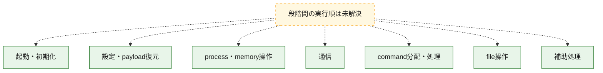
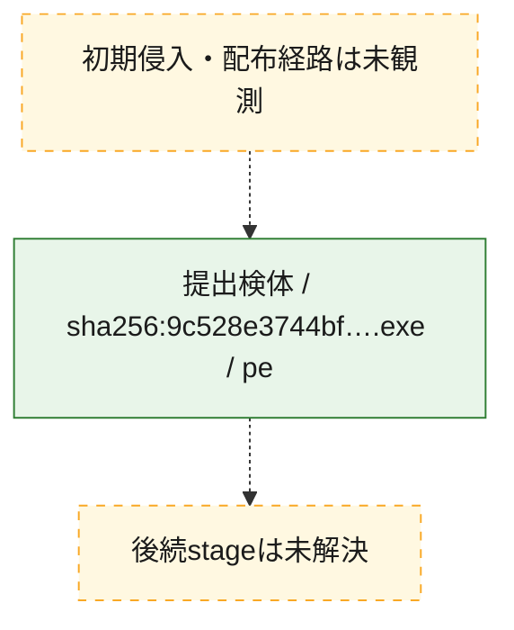
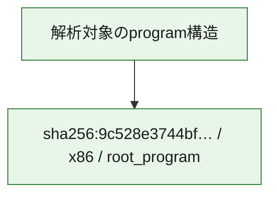

# 全体ロジック：9c528e3744bfbf2d78b47796b13b9a5f5b0a3c5a6c6e933ed55350a97997d029

代表関数の静的証跡から、起動・初期化、設定・payload復元、process・memory操作、通信、command分配・処理、file操作の処理群を確認しました。

## 読み方

- phaseの掲載順は解析上の整理順です。observed_call_edgesがない段階間の実行順を断定しません。
- 図の実線は静的に観測した関係、点線と黄色のノードは未観測・未解決の関係を示します。
- 図は静的な要約であり、動的実行を再現するものではありません。
- 詳細な関数解説とfingerprintは[STATIC-LOGIC.md](STATIC-LOGIC.md)を参照してください。

## 静的可視化

### 実行フロー

### 感染チェーン

### モジュール関係

## 処理段階

### 1. 起動・初期化

entry pointから初期化と後続処理への移行を確認します。
確度: `confirmed_static_function_evidence_with_limits`

- `9c528e3744bfbf2d78b47796b13b9a5f5b0a3c5a6c6e933ed55350a97997d029:ghidra:004a1760` — 初期化と主要処理への分岐を行う入口関数です。 状態: `succeeded`、選定理由: `entry_point`, `meaningful_symbol_name`, `probable_go_main_user_code`, `reviewed_call_centrality:3`, `role:entrypoint`
- `9c528e3744bfbf2d78b47796b13b9a5f5b0a3c5a6c6e933ed55350a97997d029:ghidra:004a1a80` — 初期化と主要処理への分岐を行う入口関数です。 状態: `failed`、選定理由: `entry_point`, `meaningful_symbol_name`, `probable_go_main_user_code`, `role:entrypoint`
- `9c528e3744bfbf2d78b47796b13b9a5f5b0a3c5a6c6e933ed55350a97997d029:ghidra:004ac7a0` — 初期化と主要処理への分岐を行う入口関数です。 状態: `succeeded`、選定理由: `entry_point`, `meaningful_symbol_name`, `probable_go_main_user_code`, `reviewed_call_centrality:25`, `role:entrypoint`
- `9c528e3744bfbf2d78b47796b13b9a5f5b0a3c5a6c6e933ed55350a97997d029:ghidra:004b0140` — 初期化と主要処理への分岐を行う入口関数です。 状態: `succeeded`、選定理由: `entry_point`, `meaningful_symbol_name`, `probable_go_main_user_code`, `reviewed_call_centrality:26`, `role:entrypoint`
- `9c528e3744bfbf2d78b47796b13b9a5f5b0a3c5a6c6e933ed55350a97997d029:ghidra:004b2740` — 初期化と主要処理への分岐を行う入口関数です。 状態: `succeeded`、選定理由: `entry_point`, `meaningful_symbol_name`, `probable_go_main_user_code`, `reviewed_call_centrality:31`, `role:entrypoint`
- `9c528e3744bfbf2d78b47796b13b9a5f5b0a3c5a6c6e933ed55350a97997d029:ghidra:004b7380` — 初期化と主要処理への分岐を行う入口関数です。 状態: `failed`、選定理由: `entry_point`, `meaningful_symbol_name`, `probable_go_main_user_code`, `role:entrypoint`
- `9c528e3744bfbf2d78b47796b13b9a5f5b0a3c5a6c6e933ed55350a97997d029:ghidra:004bbfe0` — 初期化と主要処理への分岐を行う入口関数です。 状態: `succeeded`、選定理由: `entry_point`, `meaningful_symbol_name`, `probable_go_main_user_code`, `reviewed_call_centrality:26`, `role:entrypoint`
- `9c528e3744bfbf2d78b47796b13b9a5f5b0a3c5a6c6e933ed55350a97997d029:ghidra:004be640` — 初期化と主要処理への分岐を行う入口関数です。 状態: `failed`、選定理由: `entry_point`, `meaningful_symbol_name`, `probable_go_main_user_code`, `role:entrypoint`
- `9c528e3744bfbf2d78b47796b13b9a5f5b0a3c5a6c6e933ed55350a97997d029:ghidra:004cf420` — 初期化と主要処理への分岐を行う入口関数です。 状態: `failed`、選定理由: `entry_point`, `meaningful_symbol_name`, `probable_go_main_user_code`, `role:entrypoint`
- `9c528e3744bfbf2d78b47796b13b9a5f5b0a3c5a6c6e933ed55350a97997d029:ghidra:004db480` — 初期化と主要処理への分岐を行う入口関数です。 状態: `succeeded`、選定理由: `entry_point`, `meaningful_symbol_name`, `probable_go_main_user_code`, `reviewed_call_centrality:27`, `role:entrypoint`
- `9c528e3744bfbf2d78b47796b13b9a5f5b0a3c5a6c6e933ed55350a97997d029:ghidra:004dc800` — 初期化と主要処理への分岐を行う入口関数です。 状態: `failed`、選定理由: `entry_point`, `meaningful_symbol_name`, `probable_go_main_user_code`, `role:entrypoint`
- `9c528e3744bfbf2d78b47796b13b9a5f5b0a3c5a6c6e933ed55350a97997d029:ghidra:004f3100` — 初期化と主要処理への分岐を行う入口関数です。 状態: `failed`、選定理由: `entry_point`, `meaningful_symbol_name`, `probable_go_main_user_code`, `role:entrypoint`
- `9c528e3744bfbf2d78b47796b13b9a5f5b0a3c5a6c6e933ed55350a97997d029:ghidra:0050fb00` — 初期化と主要処理への分岐を行う入口関数です。 状態: `failed`、選定理由: `entry_point`, `meaningful_symbol_name`, `probable_go_main_user_code`, `role:entrypoint`
- `9c528e3744bfbf2d78b47796b13b9a5f5b0a3c5a6c6e933ed55350a97997d029:ghidra:0051a640` — 初期化と主要処理への分岐を行う入口関数です。 状態: `failed`、選定理由: `entry_point`, `meaningful_symbol_name`, `probable_go_main_user_code`, `role:entrypoint`
- `9c528e3744bfbf2d78b47796b13b9a5f5b0a3c5a6c6e933ed55350a97997d029:ghidra:00551320` — 初期化と主要処理への分岐を行う入口関数です。 状態: `failed`、選定理由: `entry_point`, `meaningful_symbol_name`, `probable_go_main_user_code`, `role:entrypoint`
- `9c528e3744bfbf2d78b47796b13b9a5f5b0a3c5a6c6e933ed55350a97997d029:ghidra:00557200` — 初期化と主要処理への分岐を行う入口関数です。 状態: `succeeded`、選定理由: `entry_point`, `meaningful_symbol_name`, `probable_go_main_user_code`, `reviewed_call_centrality:27`, `role:entrypoint`
- `9c528e3744bfbf2d78b47796b13b9a5f5b0a3c5a6c6e933ed55350a97997d029:ghidra:0055bdc0` — 初期化と主要処理への分岐を行う入口関数です。 状態: `failed`、選定理由: `entry_point`, `meaningful_symbol_name`, `probable_go_main_user_code`, `role:entrypoint`
- `9c528e3744bfbf2d78b47796b13b9a5f5b0a3c5a6c6e933ed55350a97997d029:ghidra:005642e0` — 初期化と主要処理への分岐を行う入口関数です。 状態: `succeeded`、選定理由: `entry_point`, `meaningful_symbol_name`, `probable_go_main_user_code`, `reviewed_call_centrality:25`, `role:entrypoint`
- `9c528e3744bfbf2d78b47796b13b9a5f5b0a3c5a6c6e933ed55350a97997d029:ghidra:00568ea0` — 初期化と主要処理への分岐を行う入口関数です。 状態: `succeeded`、選定理由: `entry_point`, `meaningful_symbol_name`, `probable_go_main_user_code`, `reviewed_call_centrality:25`, `role:entrypoint`
- `9c528e3744bfbf2d78b47796b13b9a5f5b0a3c5a6c6e933ed55350a97997d029:ghidra:0056da80` — 初期化と主要処理への分岐を行う入口関数です。 状態: `failed`、選定理由: `entry_point`, `meaningful_symbol_name`, `probable_go_main_user_code`, `role:entrypoint`
- `9c528e3744bfbf2d78b47796b13b9a5f5b0a3c5a6c6e933ed55350a97997d029:ghidra:00575fe0` — 初期化と主要処理への分岐を行う入口関数です。 状態: `failed`、選定理由: `entry_point`, `meaningful_symbol_name`, `probable_go_main_user_code`, `role:entrypoint`
- `9c528e3744bfbf2d78b47796b13b9a5f5b0a3c5a6c6e933ed55350a97997d029:ghidra:0057e460` — 初期化と主要処理への分岐を行う入口関数です。 状態: `failed`、選定理由: `entry_point`, `meaningful_symbol_name`, `probable_go_main_user_code`, `role:entrypoint`
- `9c528e3744bfbf2d78b47796b13b9a5f5b0a3c5a6c6e933ed55350a97997d029:ghidra:00585600` — 初期化と主要処理への分岐を行う入口関数です。 状態: `succeeded`、選定理由: `entry_point`, `meaningful_symbol_name`, `probable_go_main_user_code`, `reviewed_call_centrality:26`, `role:entrypoint`
- `9c528e3744bfbf2d78b47796b13b9a5f5b0a3c5a6c6e933ed55350a97997d029:ghidra:0058a1c0` — 初期化と主要処理への分岐を行う入口関数です。 状態: `failed`、選定理由: `entry_point`, `meaningful_symbol_name`, `probable_go_main_user_code`, `role:entrypoint`

### 2. 設定・payload復元

設定、resource、payload、暗号化データの復元・変換を確認します。
確度: `confirmed_static_function_evidence`

- `9c528e3744bfbf2d78b47796b13b9a5f5b0a3c5a6c6e933ed55350a97997d029:ghidra:0046bb80` — 設定、resource、payloadなどの解析・変換を行う関数です。 状態: `succeeded`、選定理由: `meaningful_symbol_name`, `reviewed_call_centrality:4`, `role:config_or_data_transform`
- `9c528e3744bfbf2d78b47796b13b9a5f5b0a3c5a6c6e933ed55350a97997d029:ghidra:004788a0` — 暗号、hash、encoding、または復号処理に関係する関数です。 状態: `succeeded`、選定理由: `meaningful_symbol_name`, `reviewed_call_centrality:6`, `role:cryptographic_transform`

### 3. process・memory操作

process、thread、module、memory操作と実行移行を確認します。
確度: `confirmed_static_function_evidence`

- `9c528e3744bfbf2d78b47796b13b9a5f5b0a3c5a6c6e933ed55350a97997d029:ghidra:004680a0` — process、thread、module、またはmemory操作に関係する関数です。 状態: `succeeded`、選定理由: `meaningful_symbol_name`, `reviewed_call_centrality:2`, `role:process_or_memory_operation`

### 4. 通信

通信初期化、endpoint処理、送受信の役割を確認します。
確度: `confirmed_static_function_evidence`

- `9c528e3744bfbf2d78b47796b13b9a5f5b0a3c5a6c6e933ed55350a97997d029:ghidra:00482cc0` — 通信初期化、送受信、またはendpoint処理に関係する関数です。 状態: `succeeded`、選定理由: `meaningful_symbol_name`, `reviewed_call_centrality:6`, `role:network_communication`

### 5. command分配・処理

受信commandやtaskの解釈、分配、個別handlerへの移行を確認します。
確度: `confirmed_static_function_evidence`

- `9c528e3744bfbf2d78b47796b13b9a5f5b0a3c5a6c6e933ed55350a97997d029:ghidra:00481580` — commandの解釈、分配、または個別処理を担当する関数です。 状態: `succeeded`、選定理由: `meaningful_symbol_name`, `reviewed_call_centrality:5`, `role:command_dispatch_or_handler`

### 6. file操作

fileやdirectoryの作成、読書き、削除を確認します。
確度: `confirmed_static_function_evidence`

- `9c528e3744bfbf2d78b47796b13b9a5f5b0a3c5a6c6e933ed55350a97997d029:ghidra:00480320` — fileまたはdirectoryの読書き・管理に関係する関数です。 状態: `succeeded`、選定理由: `meaningful_symbol_name`, `reviewed_call_centrality:7`, `role:file_operation`

### 7. 補助処理

主要処理を支える一般内部関数またはlibrary処理を確認します。
確度: `confirmed_static_function_evidence`

- `9c528e3744bfbf2d78b47796b13b9a5f5b0a3c5a6c6e933ed55350a97997d029:ghidra:00401080` — compiler生成処理または汎用library処理とみられる関数です。 状態: `succeeded`、選定理由: `meaningful_symbol_name`, `reviewed_call_centrality:4`
- `9c528e3744bfbf2d78b47796b13b9a5f5b0a3c5a6c6e933ed55350a97997d029:ghidra:0045e0a0` — 検体内部の一般処理を実装する関数です。 状態: `succeeded`、選定理由: `meaningful_symbol_name`, `reviewed_call_centrality:4`

## 観測したcall関係

- `ghidra-function:09a3c4c4abad69f6d6ff0ed1` → `ghidra-external:0965271f432ff81ed62b9162` （`unclassified` → `unclassified`）
- `ghidra-function:09a3c4c4abad69f6d6ff0ed1` → `ghidra-external:249d4ad945bf1b683bcaf447` （`unclassified` → `unclassified`）
- `ghidra-function:09a3c4c4abad69f6d6ff0ed1` → `ghidra-external:329c1d4f18ac74a8d053036e` （`unclassified` → `unclassified`）
- `ghidra-function:09a3c4c4abad69f6d6ff0ed1` → `ghidra-external:44c17c83f7d655460469c3cb` （`unclassified` → `unclassified`）
- `ghidra-function:09a3c4c4abad69f6d6ff0ed1` → `ghidra-external:4dd51fe0488f96cc9022a5ba` （`unclassified` → `unclassified`）
- `ghidra-function:09a3c4c4abad69f6d6ff0ed1` → `ghidra-external:56fbdb5c95dd56d1b99ac8e7` （`unclassified` → `unclassified`）
- `ghidra-function:09a3c4c4abad69f6d6ff0ed1` → `ghidra-external:5ec30d8b1537334f48f09848` （`unclassified` → `unclassified`）
- `ghidra-function:09a3c4c4abad69f6d6ff0ed1` → `ghidra-external:70df02e3570d1e7d5e089a85` （`unclassified` → `unclassified`）
- `ghidra-function:09a3c4c4abad69f6d6ff0ed1` → `ghidra-external:74597c85322c4ffd718483ab` （`unclassified` → `unclassified`）
- `ghidra-function:09a3c4c4abad69f6d6ff0ed1` → `ghidra-external:7655019b837d62854c9e415f` （`unclassified` → `unclassified`）
- `ghidra-function:09a3c4c4abad69f6d6ff0ed1` → `ghidra-external:83c198bd97718793bd4760a2` （`unclassified` → `unclassified`）
- `ghidra-function:09a3c4c4abad69f6d6ff0ed1` → `ghidra-external:8e1699a80e897d652d4cc4e6` （`unclassified` → `unclassified`）
- `ghidra-function:09a3c4c4abad69f6d6ff0ed1` → `ghidra-external:93005a7a328cd281818d68ee` （`unclassified` → `unclassified`）
- `ghidra-function:09a3c4c4abad69f6d6ff0ed1` → `ghidra-external:950259a7fa07fb2c2211adc5` （`unclassified` → `unclassified`）
- `ghidra-function:09a3c4c4abad69f6d6ff0ed1` → `ghidra-external:a4b18bc9dc86d71d378ffa71` （`unclassified` → `unclassified`）
- `ghidra-function:09a3c4c4abad69f6d6ff0ed1` → `ghidra-external:aba72fec1ad1069abb7ba74e` （`unclassified` → `unclassified`）
- `ghidra-function:09a3c4c4abad69f6d6ff0ed1` → `ghidra-external:b1dad9cf0356cb9eedae73c0` （`unclassified` → `unclassified`）
- `ghidra-function:09a3c4c4abad69f6d6ff0ed1` → `ghidra-external:c2b86abea0131d65d93577ad` （`unclassified` → `unclassified`）
- `ghidra-function:09a3c4c4abad69f6d6ff0ed1` → `ghidra-external:c87f28fe80e8f5bf2e1c608c` （`unclassified` → `unclassified`）
- `ghidra-function:09a3c4c4abad69f6d6ff0ed1` → `ghidra-external:d2a423a0f0429d283bc43a4a` （`unclassified` → `unclassified`）
- `ghidra-function:09a3c4c4abad69f6d6ff0ed1` → `ghidra-external:d2e0a193d8b1162585680c88` （`unclassified` → `unclassified`）
- `ghidra-function:09a3c4c4abad69f6d6ff0ed1` → `ghidra-external:d417b340ad33a7ced40f3ff4` （`unclassified` → `unclassified`）
- `ghidra-function:09a3c4c4abad69f6d6ff0ed1` → `ghidra-external:d7c899a3be8264bb7a61729b` （`unclassified` → `unclassified`）
- `ghidra-function:09a3c4c4abad69f6d6ff0ed1` → `ghidra-external:e0b84c0ee7ac82414061d482` （`unclassified` → `unclassified`）
- `ghidra-function:09a3c4c4abad69f6d6ff0ed1` → `ghidra-external:e856fa684233bf182c5ff0ad` （`unclassified` → `unclassified`）
- `ghidra-function:09a3c4c4abad69f6d6ff0ed1` → `ghidra-external:f9d8610042cbeb1bdd007662` （`unclassified` → `unclassified`）
- `ghidra-function:0d9f7d39ec2ab7b76344725e` → `ghidra-external:75f0242c433eee7debec3562` （`unclassified` → `unclassified`）
- `ghidra-function:0d9f7d39ec2ab7b76344725e` → `ghidra-external:8de72343ea9c7392639378f5` （`unclassified` → `unclassified`）
- `ghidra-function:0d9f7d39ec2ab7b76344725e` → `ghidra-external:9b5281a7d05ef0fe6a8e3d94` （`unclassified` → `unclassified`）
- `ghidra-function:0d9f7d39ec2ab7b76344725e` → `ghidra-external:f18e60efd15718c1524014f4` （`unclassified` → `unclassified`）
- `ghidra-function:147fe43b1a21e54196b521a1` → `ghidra-external:0965271f432ff81ed62b9162` （`unclassified` → `unclassified`）
- `ghidra-function:147fe43b1a21e54196b521a1` → `ghidra-external:249d4ad945bf1b683bcaf447` （`unclassified` → `unclassified`）
- `ghidra-function:147fe43b1a21e54196b521a1` → `ghidra-external:329c1d4f18ac74a8d053036e` （`unclassified` → `unclassified`）
- `ghidra-function:147fe43b1a21e54196b521a1` → `ghidra-external:44c17c83f7d655460469c3cb` （`unclassified` → `unclassified`）
- `ghidra-function:147fe43b1a21e54196b521a1` → `ghidra-external:4dd51fe0488f96cc9022a5ba` （`unclassified` → `unclassified`）
- `ghidra-function:147fe43b1a21e54196b521a1` → `ghidra-external:56fbdb5c95dd56d1b99ac8e7` （`unclassified` → `unclassified`）
- `ghidra-function:147fe43b1a21e54196b521a1` → `ghidra-external:654b0044c022274e41ca6f4a` （`unclassified` → `unclassified`）
- `ghidra-function:147fe43b1a21e54196b521a1` → `ghidra-external:70df02e3570d1e7d5e089a85` （`unclassified` → `unclassified`）
- `ghidra-function:147fe43b1a21e54196b521a1` → `ghidra-external:74597c85322c4ffd718483ab` （`unclassified` → `unclassified`）
- `ghidra-function:147fe43b1a21e54196b521a1` → `ghidra-external:7655019b837d62854c9e415f` （`unclassified` → `unclassified`）
- `ghidra-function:147fe43b1a21e54196b521a1` → `ghidra-external:83c198bd97718793bd4760a2` （`unclassified` → `unclassified`）
- `ghidra-function:147fe43b1a21e54196b521a1` → `ghidra-external:8e1699a80e897d652d4cc4e6` （`unclassified` → `unclassified`）
- `ghidra-function:147fe43b1a21e54196b521a1` → `ghidra-external:93005a7a328cd281818d68ee` （`unclassified` → `unclassified`）
- `ghidra-function:147fe43b1a21e54196b521a1` → `ghidra-external:950259a7fa07fb2c2211adc5` （`unclassified` → `unclassified`）
- `ghidra-function:147fe43b1a21e54196b521a1` → `ghidra-external:a4b18bc9dc86d71d378ffa71` （`unclassified` → `unclassified`）
- `ghidra-function:147fe43b1a21e54196b521a1` → `ghidra-external:aba72fec1ad1069abb7ba74e` （`unclassified` → `unclassified`）
- `ghidra-function:147fe43b1a21e54196b521a1` → `ghidra-external:b1dad9cf0356cb9eedae73c0` （`unclassified` → `unclassified`）
- `ghidra-function:147fe43b1a21e54196b521a1` → `ghidra-external:c2b86abea0131d65d93577ad` （`unclassified` → `unclassified`）
- `ghidra-function:147fe43b1a21e54196b521a1` → `ghidra-external:c87f28fe80e8f5bf2e1c608c` （`unclassified` → `unclassified`）
- `ghidra-function:147fe43b1a21e54196b521a1` → `ghidra-external:d2a423a0f0429d283bc43a4a` （`unclassified` → `unclassified`）
- `ghidra-function:147fe43b1a21e54196b521a1` → `ghidra-external:d2e0a193d8b1162585680c88` （`unclassified` → `unclassified`）
- `ghidra-function:147fe43b1a21e54196b521a1` → `ghidra-external:d417b340ad33a7ced40f3ff4` （`unclassified` → `unclassified`）
- `ghidra-function:147fe43b1a21e54196b521a1` → `ghidra-external:d7c899a3be8264bb7a61729b` （`unclassified` → `unclassified`）
- `ghidra-function:147fe43b1a21e54196b521a1` → `ghidra-external:e856fa684233bf182c5ff0ad` （`unclassified` → `unclassified`）
- `ghidra-function:147fe43b1a21e54196b521a1` → `ghidra-external:f9d8610042cbeb1bdd007662` （`unclassified` → `unclassified`）
- `ghidra-function:1d8fff5307904ae170b06029` → `ghidra-external:0965271f432ff81ed62b9162` （`unclassified` → `unclassified`）
- `ghidra-function:1d8fff5307904ae170b06029` → `ghidra-external:249d4ad945bf1b683bcaf447` （`unclassified` → `unclassified`）
- `ghidra-function:1d8fff5307904ae170b06029` → `ghidra-external:329c1d4f18ac74a8d053036e` （`unclassified` → `unclassified`）
- `ghidra-function:1d8fff5307904ae170b06029` → `ghidra-external:44c17c83f7d655460469c3cb` （`unclassified` → `unclassified`）
- `ghidra-function:1d8fff5307904ae170b06029` → `ghidra-external:4dd51fe0488f96cc9022a5ba` （`unclassified` → `unclassified`）
- `ghidra-function:1d8fff5307904ae170b06029` → `ghidra-external:56fbdb5c95dd56d1b99ac8e7` （`unclassified` → `unclassified`）
- `ghidra-function:1d8fff5307904ae170b06029` → `ghidra-external:5e2c4eba3d41c467f75e9b5f` （`unclassified` → `unclassified`）
- `ghidra-function:1d8fff5307904ae170b06029` → `ghidra-external:70df02e3570d1e7d5e089a85` （`unclassified` → `unclassified`）
- `ghidra-function:1d8fff5307904ae170b06029` → `ghidra-external:74597c85322c4ffd718483ab` （`unclassified` → `unclassified`）
- `ghidra-function:1d8fff5307904ae170b06029` → `ghidra-external:7655019b837d62854c9e415f` （`unclassified` → `unclassified`）
- `ghidra-function:1d8fff5307904ae170b06029` → `ghidra-external:83c198bd97718793bd4760a2` （`unclassified` → `unclassified`）
- `ghidra-function:1d8fff5307904ae170b06029` → `ghidra-external:8e1699a80e897d652d4cc4e6` （`unclassified` → `unclassified`）
- `ghidra-function:1d8fff5307904ae170b06029` → `ghidra-external:93005a7a328cd281818d68ee` （`unclassified` → `unclassified`）
- `ghidra-function:1d8fff5307904ae170b06029` → `ghidra-external:950259a7fa07fb2c2211adc5` （`unclassified` → `unclassified`）
- `ghidra-function:1d8fff5307904ae170b06029` → `ghidra-external:a4b18bc9dc86d71d378ffa71` （`unclassified` → `unclassified`）
- `ghidra-function:1d8fff5307904ae170b06029` → `ghidra-external:aba72fec1ad1069abb7ba74e` （`unclassified` → `unclassified`）
- `ghidra-function:1d8fff5307904ae170b06029` → `ghidra-external:b1dad9cf0356cb9eedae73c0` （`unclassified` → `unclassified`）
- `ghidra-function:1d8fff5307904ae170b06029` → `ghidra-external:c2b86abea0131d65d93577ad` （`unclassified` → `unclassified`）
- `ghidra-function:1d8fff5307904ae170b06029` → `ghidra-external:c87f28fe80e8f5bf2e1c608c` （`unclassified` → `unclassified`）
- `ghidra-function:1d8fff5307904ae170b06029` → `ghidra-external:d2a423a0f0429d283bc43a4a` （`unclassified` → `unclassified`）
- `ghidra-function:1d8fff5307904ae170b06029` → `ghidra-external:d2e0a193d8b1162585680c88` （`unclassified` → `unclassified`）
- `ghidra-function:1d8fff5307904ae170b06029` → `ghidra-external:d417b340ad33a7ced40f3ff4` （`unclassified` → `unclassified`）
- `ghidra-function:1d8fff5307904ae170b06029` → `ghidra-external:d7c899a3be8264bb7a61729b` （`unclassified` → `unclassified`）
- `ghidra-function:1d8fff5307904ae170b06029` → `ghidra-external:e856fa684233bf182c5ff0ad` （`unclassified` → `unclassified`）
- `ghidra-function:1d8fff5307904ae170b06029` → `ghidra-external:f9d8610042cbeb1bdd007662` （`unclassified` → `unclassified`）
- `ghidra-function:31ed69c1c9e9c071f1536e73` → `ghidra-external:9fc5b28afa71541e4774bf97` （`unclassified` → `unclassified`）
- `ghidra-function:31ed69c1c9e9c071f1536e73` → `ghidra-external:a1917d624978cae72b60b4f2` （`unclassified` → `unclassified`）
- `ghidra-function:31ed69c1c9e9c071f1536e73` → `ghidra-external:d2e0a193d8b1162585680c88` （`unclassified` → `unclassified`）
- `ghidra-function:31ed69c1c9e9c071f1536e73` → `ghidra-external:e4088d934fcc83d25c63e908` （`unclassified` → `unclassified`）
- `ghidra-function:33e7085df96dd42e0e371d0f` → `ghidra-external:04e1678d2161d0ff10374d62` （`unclassified` → `unclassified`）
- `ghidra-function:33e7085df96dd42e0e371d0f` → `ghidra-external:0965271f432ff81ed62b9162` （`unclassified` → `unclassified`）
- `ghidra-function:33e7085df96dd42e0e371d0f` → `ghidra-external:17fe5398312a59daabb1f138` （`unclassified` → `unclassified`）
- `ghidra-function:33e7085df96dd42e0e371d0f` → `ghidra-external:249d4ad945bf1b683bcaf447` （`unclassified` → `unclassified`）
- `ghidra-function:33e7085df96dd42e0e371d0f` → `ghidra-external:329c1d4f18ac74a8d053036e` （`unclassified` → `unclassified`）
- `ghidra-function:33e7085df96dd42e0e371d0f` → `ghidra-external:44c17c83f7d655460469c3cb` （`unclassified` → `unclassified`）
- `ghidra-function:33e7085df96dd42e0e371d0f` → `ghidra-external:4dd51fe0488f96cc9022a5ba` （`unclassified` → `unclassified`）
- `ghidra-function:33e7085df96dd42e0e371d0f` → `ghidra-external:56fbdb5c95dd56d1b99ac8e7` （`unclassified` → `unclassified`）
- `ghidra-function:33e7085df96dd42e0e371d0f` → `ghidra-external:70df02e3570d1e7d5e089a85` （`unclassified` → `unclassified`）
- `ghidra-function:33e7085df96dd42e0e371d0f` → `ghidra-external:74597c85322c4ffd718483ab` （`unclassified` → `unclassified`）
- `ghidra-function:33e7085df96dd42e0e371d0f` → `ghidra-external:7655019b837d62854c9e415f` （`unclassified` → `unclassified`）
- `ghidra-function:33e7085df96dd42e0e371d0f` → `ghidra-external:83c198bd97718793bd4760a2` （`unclassified` → `unclassified`）
- `ghidra-function:33e7085df96dd42e0e371d0f` → `ghidra-external:8e1699a80e897d652d4cc4e6` （`unclassified` → `unclassified`）
- `ghidra-function:33e7085df96dd42e0e371d0f` → `ghidra-external:93005a7a328cd281818d68ee` （`unclassified` → `unclassified`）
- `ghidra-function:33e7085df96dd42e0e371d0f` → `ghidra-external:950259a7fa07fb2c2211adc5` （`unclassified` → `unclassified`）
- `ghidra-function:33e7085df96dd42e0e371d0f` → `ghidra-external:a4b18bc9dc86d71d378ffa71` （`unclassified` → `unclassified`）
- `ghidra-function:33e7085df96dd42e0e371d0f` → `ghidra-external:aba72fec1ad1069abb7ba74e` （`unclassified` → `unclassified`）
- `ghidra-function:33e7085df96dd42e0e371d0f` → `ghidra-external:b1dad9cf0356cb9eedae73c0` （`unclassified` → `unclassified`）
- `ghidra-function:33e7085df96dd42e0e371d0f` → `ghidra-external:c2b86abea0131d65d93577ad` （`unclassified` → `unclassified`）
- `ghidra-function:33e7085df96dd42e0e371d0f` → `ghidra-external:c87f28fe80e8f5bf2e1c608c` （`unclassified` → `unclassified`）
- `ghidra-function:33e7085df96dd42e0e371d0f` → `ghidra-external:d2a423a0f0429d283bc43a4a` （`unclassified` → `unclassified`）
- `ghidra-function:33e7085df96dd42e0e371d0f` → `ghidra-external:d2e0a193d8b1162585680c88` （`unclassified` → `unclassified`）
- `ghidra-function:33e7085df96dd42e0e371d0f` → `ghidra-external:d417b340ad33a7ced40f3ff4` （`unclassified` → `unclassified`）
- `ghidra-function:33e7085df96dd42e0e371d0f` → `ghidra-external:d7c899a3be8264bb7a61729b` （`unclassified` → `unclassified`）
- `ghidra-function:33e7085df96dd42e0e371d0f` → `ghidra-external:e856fa684233bf182c5ff0ad` （`unclassified` → `unclassified`）
- `ghidra-function:33e7085df96dd42e0e371d0f` → `ghidra-external:f9d8610042cbeb1bdd007662` （`unclassified` → `unclassified`）
- `ghidra-function:3659e8356fcf929b1c03bd46` → `ghidra-external:0965271f432ff81ed62b9162` （`unclassified` → `unclassified`）
- `ghidra-function:3659e8356fcf929b1c03bd46` → `ghidra-external:56fbdb5c95dd56d1b99ac8e7` （`unclassified` → `unclassified`）
- `ghidra-function:3659e8356fcf929b1c03bd46` → `ghidra-external:9f89d372c6745f5d367033cf` （`unclassified` → `unclassified`）
- `ghidra-function:3659e8356fcf929b1c03bd46` → `ghidra-external:a1917d624978cae72b60b4f2` （`unclassified` → `unclassified`）
- `ghidra-function:3659e8356fcf929b1c03bd46` → `ghidra-external:c33917862423f1f4b87e1744` （`unclassified` → `unclassified`）
- `ghidra-function:3659e8356fcf929b1c03bd46` → `ghidra-external:d2e0a193d8b1162585680c88` （`unclassified` → `unclassified`）
- `ghidra-function:43e6de70db500ae868767a45` → `ghidra-external:1f732f8c1e2598cbc647d0b3` （`unclassified` → `unclassified`）
- `ghidra-function:43e6de70db500ae868767a45` → `ghidra-external:254e95383b008d14d6718fd8` （`unclassified` → `unclassified`）
- `ghidra-function:43e6de70db500ae868767a45` → `ghidra-external:3c2b8aeef92c61b890ca55c3` （`unclassified` → `unclassified`）
- `ghidra-function:43e6de70db500ae868767a45` → `ghidra-external:9c08a2855d64db189a65670a` （`unclassified` → `unclassified`）
- `ghidra-function:43e6de70db500ae868767a45` → `ghidra-external:c87f28fe80e8f5bf2e1c608c` （`unclassified` → `unclassified`）
- `ghidra-function:59b9358411c379462d5507cd` → `ghidra-external:0965271f432ff81ed62b9162` （`unclassified` → `unclassified`）
- `ghidra-function:59b9358411c379462d5507cd` → `ghidra-external:17260a776245207ca26b6700` （`unclassified` → `unclassified`）
- `ghidra-function:59b9358411c379462d5507cd` → `ghidra-external:1c4fb7db937ea68ca84ad919` （`unclassified` → `unclassified`）
- `ghidra-function:59b9358411c379462d5507cd` → `ghidra-external:249d4ad945bf1b683bcaf447` （`unclassified` → `unclassified`）
- `ghidra-function:59b9358411c379462d5507cd` → `ghidra-external:2d6a0d8bbf79c26ab1f86931` （`unclassified` → `unclassified`）
- `ghidra-function:59b9358411c379462d5507cd` → `ghidra-external:329c1d4f18ac74a8d053036e` （`unclassified` → `unclassified`）
- `ghidra-function:59b9358411c379462d5507cd` → `ghidra-external:44c17c83f7d655460469c3cb` （`unclassified` → `unclassified`）
- `ghidra-function:59b9358411c379462d5507cd` → `ghidra-external:4dd51fe0488f96cc9022a5ba` （`unclassified` → `unclassified`）
- `ghidra-function:59b9358411c379462d5507cd` → `ghidra-external:56fbdb5c95dd56d1b99ac8e7` （`unclassified` → `unclassified`）
- `ghidra-function:59b9358411c379462d5507cd` → `ghidra-external:70df02e3570d1e7d5e089a85` （`unclassified` → `unclassified`）
- `ghidra-function:59b9358411c379462d5507cd` → `ghidra-external:74597c85322c4ffd718483ab` （`unclassified` → `unclassified`）
- `ghidra-function:59b9358411c379462d5507cd` → `ghidra-external:7655019b837d62854c9e415f` （`unclassified` → `unclassified`）
- `ghidra-function:59b9358411c379462d5507cd` → `ghidra-external:83c198bd97718793bd4760a2` （`unclassified` → `unclassified`）
- `ghidra-function:59b9358411c379462d5507cd` → `ghidra-external:8e1699a80e897d652d4cc4e6` （`unclassified` → `unclassified`）
- `ghidra-function:59b9358411c379462d5507cd` → `ghidra-external:93005a7a328cd281818d68ee` （`unclassified` → `unclassified`）
- `ghidra-function:59b9358411c379462d5507cd` → `ghidra-external:950259a7fa07fb2c2211adc5` （`unclassified` → `unclassified`）
- `ghidra-function:59b9358411c379462d5507cd` → `ghidra-external:955af2d1d087100a4ed3cf83` （`unclassified` → `unclassified`）
- `ghidra-function:59b9358411c379462d5507cd` → `ghidra-external:a4b18bc9dc86d71d378ffa71` （`unclassified` → `unclassified`）
- `ghidra-function:59b9358411c379462d5507cd` → `ghidra-external:aba72fec1ad1069abb7ba74e` （`unclassified` → `unclassified`）
- `ghidra-function:59b9358411c379462d5507cd` → `ghidra-external:b1dad9cf0356cb9eedae73c0` （`unclassified` → `unclassified`）
- `ghidra-function:59b9358411c379462d5507cd` → `ghidra-external:c2b86abea0131d65d93577ad` （`unclassified` → `unclassified`）
- `ghidra-function:59b9358411c379462d5507cd` → `ghidra-external:c4973164b30635e7410cc604` （`unclassified` → `unclassified`）
- `ghidra-function:59b9358411c379462d5507cd` → `ghidra-external:c87f28fe80e8f5bf2e1c608c` （`unclassified` → `unclassified`）
- `ghidra-function:59b9358411c379462d5507cd` → `ghidra-external:d2a423a0f0429d283bc43a4a` （`unclassified` → `unclassified`）
- `ghidra-function:59b9358411c379462d5507cd` → `ghidra-external:d2e0a193d8b1162585680c88` （`unclassified` → `unclassified`）
- `ghidra-function:59b9358411c379462d5507cd` → `ghidra-external:d399057031efd6adb3248ecf` （`unclassified` → `unclassified`）
- `ghidra-function:59b9358411c379462d5507cd` → `ghidra-external:d403aa6adf21724220828f77` （`unclassified` → `unclassified`）
- `ghidra-function:59b9358411c379462d5507cd` → `ghidra-external:d417b340ad33a7ced40f3ff4` （`unclassified` → `unclassified`）
- `ghidra-function:59b9358411c379462d5507cd` → `ghidra-external:d7c899a3be8264bb7a61729b` （`unclassified` → `unclassified`）
- `ghidra-function:59b9358411c379462d5507cd` → `ghidra-external:e856fa684233bf182c5ff0ad` （`unclassified` → `unclassified`）
- `ghidra-function:59b9358411c379462d5507cd` → `ghidra-external:f9d8610042cbeb1bdd007662` （`unclassified` → `unclassified`）
- `ghidra-function:62f8718549de7c03d7219650` → `ghidra-external:092064e0806a917248b59cd6` （`unclassified` → `unclassified`）
- `ghidra-function:62f8718549de7c03d7219650` → `ghidra-external:0965271f432ff81ed62b9162` （`unclassified` → `unclassified`）
- `ghidra-function:62f8718549de7c03d7219650` → `ghidra-external:249d4ad945bf1b683bcaf447` （`unclassified` → `unclassified`）
- `ghidra-function:62f8718549de7c03d7219650` → `ghidra-external:329c1d4f18ac74a8d053036e` （`unclassified` → `unclassified`）
- `ghidra-function:62f8718549de7c03d7219650` → `ghidra-external:44c17c83f7d655460469c3cb` （`unclassified` → `unclassified`）
- `ghidra-function:62f8718549de7c03d7219650` → `ghidra-external:4dd51fe0488f96cc9022a5ba` （`unclassified` → `unclassified`）
- `ghidra-function:62f8718549de7c03d7219650` → `ghidra-external:56fbdb5c95dd56d1b99ac8e7` （`unclassified` → `unclassified`）
- `ghidra-function:62f8718549de7c03d7219650` → `ghidra-external:70df02e3570d1e7d5e089a85` （`unclassified` → `unclassified`）
- `ghidra-function:62f8718549de7c03d7219650` → `ghidra-external:74597c85322c4ffd718483ab` （`unclassified` → `unclassified`）
- `ghidra-function:62f8718549de7c03d7219650` → `ghidra-external:7655019b837d62854c9e415f` （`unclassified` → `unclassified`）
- `ghidra-function:62f8718549de7c03d7219650` → `ghidra-external:83c198bd97718793bd4760a2` （`unclassified` → `unclassified`）
- `ghidra-function:62f8718549de7c03d7219650` → `ghidra-external:8e1699a80e897d652d4cc4e6` （`unclassified` → `unclassified`）
- `ghidra-function:62f8718549de7c03d7219650` → `ghidra-external:93005a7a328cd281818d68ee` （`unclassified` → `unclassified`）
- `ghidra-function:62f8718549de7c03d7219650` → `ghidra-external:950259a7fa07fb2c2211adc5` （`unclassified` → `unclassified`）
- `ghidra-function:62f8718549de7c03d7219650` → `ghidra-external:a4b18bc9dc86d71d378ffa71` （`unclassified` → `unclassified`）
- `ghidra-function:62f8718549de7c03d7219650` → `ghidra-external:aba72fec1ad1069abb7ba74e` （`unclassified` → `unclassified`）
- `ghidra-function:62f8718549de7c03d7219650` → `ghidra-external:b1dad9cf0356cb9eedae73c0` （`unclassified` → `unclassified`）
- `ghidra-function:62f8718549de7c03d7219650` → `ghidra-external:c2b86abea0131d65d93577ad` （`unclassified` → `unclassified`）
- `ghidra-function:62f8718549de7c03d7219650` → `ghidra-external:c87f28fe80e8f5bf2e1c608c` （`unclassified` → `unclassified`）
- `ghidra-function:62f8718549de7c03d7219650` → `ghidra-external:cac7bae0f88b93237d9df839` （`unclassified` → `unclassified`）
- `ghidra-function:62f8718549de7c03d7219650` → `ghidra-external:d2a423a0f0429d283bc43a4a` （`unclassified` → `unclassified`）
- `ghidra-function:62f8718549de7c03d7219650` → `ghidra-external:d2e0a193d8b1162585680c88` （`unclassified` → `unclassified`）
- `ghidra-function:62f8718549de7c03d7219650` → `ghidra-external:d417b340ad33a7ced40f3ff4` （`unclassified` → `unclassified`）
- `ghidra-function:62f8718549de7c03d7219650` → `ghidra-external:d61a8a1388c223bf45871b38` （`unclassified` → `unclassified`）
- `ghidra-function:62f8718549de7c03d7219650` → `ghidra-external:d7c899a3be8264bb7a61729b` （`unclassified` → `unclassified`）
- `ghidra-function:62f8718549de7c03d7219650` → `ghidra-external:e856fa684233bf182c5ff0ad` （`unclassified` → `unclassified`）
- `ghidra-function:62f8718549de7c03d7219650` → `ghidra-external:f9d8610042cbeb1bdd007662` （`unclassified` → `unclassified`）
- `ghidra-function:754a16bc1ecac8a3452accd8` → `ghidra-external:0965271f432ff81ed62b9162` （`unclassified` → `unclassified`）
- `ghidra-function:754a16bc1ecac8a3452accd8` → `ghidra-external:249d4ad945bf1b683bcaf447` （`unclassified` → `unclassified`）
- `ghidra-function:754a16bc1ecac8a3452accd8` → `ghidra-external:329c1d4f18ac74a8d053036e` （`unclassified` → `unclassified`）
- `ghidra-function:754a16bc1ecac8a3452accd8` → `ghidra-external:44c17c83f7d655460469c3cb` （`unclassified` → `unclassified`）
- `ghidra-function:754a16bc1ecac8a3452accd8` → `ghidra-external:4dd51fe0488f96cc9022a5ba` （`unclassified` → `unclassified`）
- `ghidra-function:754a16bc1ecac8a3452accd8` → `ghidra-external:56fbdb5c95dd56d1b99ac8e7` （`unclassified` → `unclassified`）
- `ghidra-function:754a16bc1ecac8a3452accd8` → `ghidra-external:70df02e3570d1e7d5e089a85` （`unclassified` → `unclassified`）
- `ghidra-function:754a16bc1ecac8a3452accd8` → `ghidra-external:74597c85322c4ffd718483ab` （`unclassified` → `unclassified`）
- `ghidra-function:754a16bc1ecac8a3452accd8` → `ghidra-external:7655019b837d62854c9e415f` （`unclassified` → `unclassified`）
- `ghidra-function:754a16bc1ecac8a3452accd8` → `ghidra-external:83c198bd97718793bd4760a2` （`unclassified` → `unclassified`）
- `ghidra-function:754a16bc1ecac8a3452accd8` → `ghidra-external:8e1699a80e897d652d4cc4e6` （`unclassified` → `unclassified`）
- `ghidra-function:754a16bc1ecac8a3452accd8` → `ghidra-external:91f4af2e668f758656a8656a` （`unclassified` → `unclassified`）
- `ghidra-function:754a16bc1ecac8a3452accd8` → `ghidra-external:93005a7a328cd281818d68ee` （`unclassified` → `unclassified`）
- `ghidra-function:754a16bc1ecac8a3452accd8` → `ghidra-external:950259a7fa07fb2c2211adc5` （`unclassified` → `unclassified`）
- `ghidra-function:754a16bc1ecac8a3452accd8` → `ghidra-external:a4b18bc9dc86d71d378ffa71` （`unclassified` → `unclassified`）
- `ghidra-function:754a16bc1ecac8a3452accd8` → `ghidra-external:aba72fec1ad1069abb7ba74e` （`unclassified` → `unclassified`）
- `ghidra-function:754a16bc1ecac8a3452accd8` → `ghidra-external:b1dad9cf0356cb9eedae73c0` （`unclassified` → `unclassified`）
- `ghidra-function:754a16bc1ecac8a3452accd8` → `ghidra-external:c2b86abea0131d65d93577ad` （`unclassified` → `unclassified`）
- `ghidra-function:754a16bc1ecac8a3452accd8` → `ghidra-external:c87f28fe80e8f5bf2e1c608c` （`unclassified` → `unclassified`）
- `ghidra-function:754a16bc1ecac8a3452accd8` → `ghidra-external:d2a423a0f0429d283bc43a4a` （`unclassified` → `unclassified`）
- `ghidra-function:754a16bc1ecac8a3452accd8` → `ghidra-external:d2e0a193d8b1162585680c88` （`unclassified` → `unclassified`）
- 残り79件は`static-logic.json`に記録しています。

## 解析範囲と制約

- 選定外関数は全体inventoryへ残しますが、関数本体の個別解説対象にはしていません。
- indirect call、難読化、packer、VM、壊れたcontrol flowによりcall関係が欠落する場合があります。
- 文書は静的解析に基づき、検体実行や外部通信による動的確認は行っていません。
