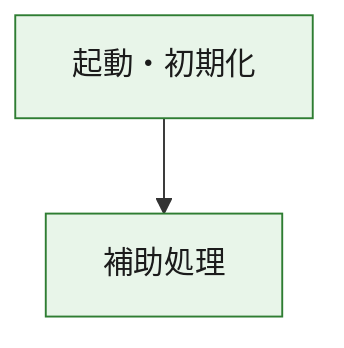
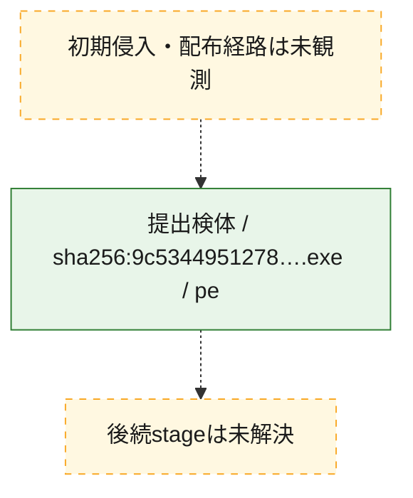
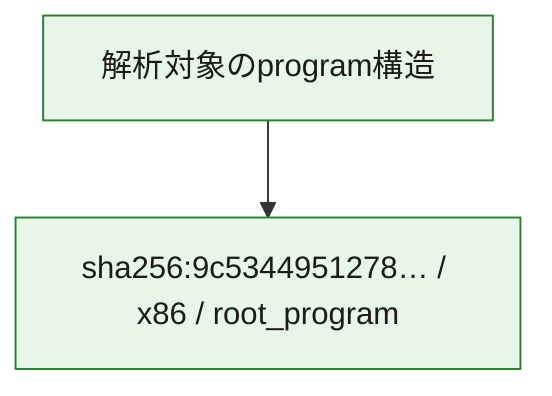

# 全体ロジック：9c53449512780b0e97289285f3879c8c67ee9d19c1dd421da7411008535077f9

代表関数の静的証跡から、起動・初期化の処理群を確認しました。

## 読み方

- phaseの掲載順は解析上の整理順です。observed_call_edgesがない段階間の実行順を断定しません。
- 図の実線は静的に観測した関係、点線と黄色のノードは未観測・未解決の関係を示します。
- 図は静的な要約であり、動的実行を再現するものではありません。
- 詳細な関数解説とfingerprintは[STATIC-LOGIC.md](STATIC-LOGIC.md)を参照してください。

## 静的可視化

### 実行フロー

### 感染チェーン

### モジュール関係

## 処理段階

### 1. 起動・初期化

entry pointから初期化と後続処理への移行を確認します。
確度: `confirmed_static_function_evidence`

- `9c53449512780b0e97289285f3879c8c67ee9d19c1dd421da7411008535077f9:ghidra:180001010` — 初期化と主要処理への分岐を行う入口関数です。 状態: `succeeded`、選定理由: `entry_point`, `meaningful_symbol_name`, `reviewed_call_centrality:22`, `role:entrypoint`, `small_program_complete_context`

### 2. 補助処理

主要処理を支える一般内部関数またはlibrary処理を確認します。
確度: `confirmed_static_function_evidence`

- `9c53449512780b0e97289285f3879c8c67ee9d19c1dd421da7411008535077f9:ghidra:180001240` — 検体内部の一般処理を実装する関数です。 状態: `succeeded`、選定理由: `context_representative`, `reviewed_call_centrality:2`, `small_program_complete_context`
- `9c53449512780b0e97289285f3879c8c67ee9d19c1dd421da7411008535077f9:ghidra:180001350` — 検体内部の一般処理を実装する関数です。 状態: `succeeded`、選定理由: `context_representative`, `reviewed_call_centrality:25`, `small_program_complete_context`
- `9c53449512780b0e97289285f3879c8c67ee9d19c1dd421da7411008535077f9:ghidra:180003780` — 検体内部の一般処理を実装する関数です。 状態: `succeeded`、選定理由: `context_representative`, `reviewed_call_centrality:2`, `small_program_complete_context`
- `9c53449512780b0e97289285f3879c8c67ee9d19c1dd421da7411008535077f9:ghidra:1800038e0` — 検体内部の一般処理を実装する関数です。 状態: `succeeded`、選定理由: `context_representative`, `reviewed_call_centrality:2`, `small_program_complete_context`

## 観測したcall関係

- `9c53449512780b0e97289285f3879c8c67ee9d19c1dd421da7411008535077f9:ghidra:180001010` → `9c53449512780b0e97289285f3879c8c67ee9d19c1dd421da7411008535077f9:ghidra:180001240` （`startup` → `support`）
- `9c53449512780b0e97289285f3879c8c67ee9d19c1dd421da7411008535077f9:ghidra:180001010` → `9c53449512780b0e97289285f3879c8c67ee9d19c1dd421da7411008535077f9:ghidra:180001350` （`startup` → `support`）
- `9c53449512780b0e97289285f3879c8c67ee9d19c1dd421da7411008535077f9:ghidra:180001350` → `9c53449512780b0e97289285f3879c8c67ee9d19c1dd421da7411008535077f9:ghidra:180001240` （`support` → `support`）
- `9c53449512780b0e97289285f3879c8c67ee9d19c1dd421da7411008535077f9:ghidra:180001350` → `9c53449512780b0e97289285f3879c8c67ee9d19c1dd421da7411008535077f9:ghidra:180003780` （`support` → `support`）
- `9c53449512780b0e97289285f3879c8c67ee9d19c1dd421da7411008535077f9:ghidra:180001350` → `9c53449512780b0e97289285f3879c8c67ee9d19c1dd421da7411008535077f9:ghidra:1800038e0` （`support` → `support`）
- `9c53449512780b0e97289285f3879c8c67ee9d19c1dd421da7411008535077f9:ghidra:180003780` → `9c53449512780b0e97289285f3879c8c67ee9d19c1dd421da7411008535077f9:ghidra:1800038e0` （`support` → `support`）
- `ghidra-function:9181dfa73fd2e4ce23cc249c` → `ghidra-function:164fb88648a1377a717ea947` （`unclassified` → `unclassified`）
- `ghidra-function:9181dfa73fd2e4ce23cc249c` → `ghidra-function:388ad45586064b4d34145442` （`unclassified` → `unclassified`）
- `ghidra-function:9181dfa73fd2e4ce23cc249c` → `ghidra-function:4b59498b2c0ce499cf6ce0f5` （`unclassified` → `unclassified`）
- `ghidra-function:9181dfa73fd2e4ce23cc249c` → `ghidra-function:6397dd4190889a989f9bf1b1` （`unclassified` → `unclassified`）
- `ghidra-function:9181dfa73fd2e4ce23cc249c` → `ghidra-function:9dad60819f462ebd4fa730e1` （`unclassified` → `unclassified`）
- `ghidra-function:9181dfa73fd2e4ce23cc249c` → `ghidra-function:a5a85fdbc70a377c1c720267` （`unclassified` → `unclassified`）
- `ghidra-function:9181dfa73fd2e4ce23cc249c` → `ghidra-function:b800a1728c215ced84f8b8f9` （`unclassified` → `unclassified`）
- `ghidra-function:9181dfa73fd2e4ce23cc249c` → `ghidra-function:b8bd4a557900e6f37059131f` （`unclassified` → `unclassified`）
- `ghidra-function:9181dfa73fd2e4ce23cc249c` → `ghidra-function:cd2982ba8285e69cb767bf85` （`unclassified` → `unclassified`）
- `ghidra-function:9181dfa73fd2e4ce23cc249c` → `ghidra-function:da56fb9833b7ac5411f805fb` （`unclassified` → `unclassified`）
- `ghidra-function:9181dfa73fd2e4ce23cc249c` → `ghidra-function:f0c73cd68ca468075f252016` （`unclassified` → `unclassified`）
- `ghidra-function:9181dfa73fd2e4ce23cc249c` → `ghidra-function:fbc5e31b1d16dd264afd56f0` （`unclassified` → `unclassified`）
- `ghidra-function:a7433a2b94c6885412b894eb` → `ghidra-function:1ff1e46ba10c2eb6863fe156` （`unclassified` → `unclassified`）
- `ghidra-function:b800a1728c215ced84f8b8f9` → `ghidra-external:02212c51818fbd52635bd58b` （`unclassified` → `unclassified`）
- `ghidra-function:b800a1728c215ced84f8b8f9` → `ghidra-external:20597245d49151c4a9a34dec` （`unclassified` → `unclassified`）
- `ghidra-function:b800a1728c215ced84f8b8f9` → `ghidra-external:602f99882373a84ccbda1282` （`unclassified` → `unclassified`）
- `ghidra-function:b800a1728c215ced84f8b8f9` → `ghidra-external:6728e80d2c03fc6dbf9b68ec` （`unclassified` → `unclassified`）
- `ghidra-function:b800a1728c215ced84f8b8f9` → `ghidra-external:6b2ef464f4ac5933c9c08c3a` （`unclassified` → `unclassified`）
- `ghidra-function:b800a1728c215ced84f8b8f9` → `ghidra-external:8fb3a87cb5bc2b42bec085e8` （`unclassified` → `unclassified`）
- `ghidra-function:b800a1728c215ced84f8b8f9` → `ghidra-external:a2010e8f35dbe1403a12e6dd` （`unclassified` → `unclassified`）
- `ghidra-function:b800a1728c215ced84f8b8f9` → `ghidra-external:a282b40368dd6238f345d20f` （`unclassified` → `unclassified`）
- `ghidra-function:b800a1728c215ced84f8b8f9` → `ghidra-external:a48c45b71007a9150ebaf5f3` （`unclassified` → `unclassified`）
- `ghidra-function:b800a1728c215ced84f8b8f9` → `ghidra-external:ace0ea4956107742407bb505` （`unclassified` → `unclassified`）
- `ghidra-function:b800a1728c215ced84f8b8f9` → `ghidra-external:b2cbce3d9a4ce00b41044143` （`unclassified` → `unclassified`）
- `ghidra-function:b800a1728c215ced84f8b8f9` → `ghidra-external:b74120a20525e6b85ef60583` （`unclassified` → `unclassified`）
- `ghidra-function:b800a1728c215ced84f8b8f9` → `ghidra-external:bf9047efd0e00e109701a022` （`unclassified` → `unclassified`）
- `ghidra-function:b800a1728c215ced84f8b8f9` → `ghidra-external:c0df06473de76e32471aa5f6` （`unclassified` → `unclassified`）
- `ghidra-function:b800a1728c215ced84f8b8f9` → `ghidra-external:c18f1f79c9cbaec200d6c346` （`unclassified` → `unclassified`）
- `ghidra-function:b800a1728c215ced84f8b8f9` → `ghidra-external:d2c3bf33e14e47689f5aec86` （`unclassified` → `unclassified`）
- `ghidra-function:b800a1728c215ced84f8b8f9` → `ghidra-external:d37cbd6be06bb01f717a0b13` （`unclassified` → `unclassified`）
- `ghidra-function:b800a1728c215ced84f8b8f9` → `ghidra-external:d8f3ee9874d1b522ebc9b371` （`unclassified` → `unclassified`）
- `ghidra-function:b800a1728c215ced84f8b8f9` → `ghidra-external:dbcb7a2b77562f607990f3c3` （`unclassified` → `unclassified`）
- `ghidra-function:b800a1728c215ced84f8b8f9` → `ghidra-external:e7ae5cc519eafc2b0bf7656b` （`unclassified` → `unclassified`）
- `ghidra-function:b800a1728c215ced84f8b8f9` → `ghidra-external:f9a4e7e81e898ea141954586` （`unclassified` → `unclassified`）
- `ghidra-function:b800a1728c215ced84f8b8f9` → `ghidra-function:1ff1e46ba10c2eb6863fe156` （`unclassified` → `unclassified`）
- `ghidra-function:b800a1728c215ced84f8b8f9` → `ghidra-function:9dad60819f462ebd4fa730e1` （`unclassified` → `unclassified`）
- `ghidra-function:b800a1728c215ced84f8b8f9` → `ghidra-function:a7433a2b94c6885412b894eb` （`unclassified` → `unclassified`）

## 解析範囲と制約

- 選定外関数は全体inventoryへ残しますが、関数本体の個別解説対象にはしていません。
- indirect call、難読化、packer、VM、壊れたcontrol flowによりcall関係が欠落する場合があります。
- 文書は静的解析に基づき、検体実行や外部通信による動的確認は行っていません。
