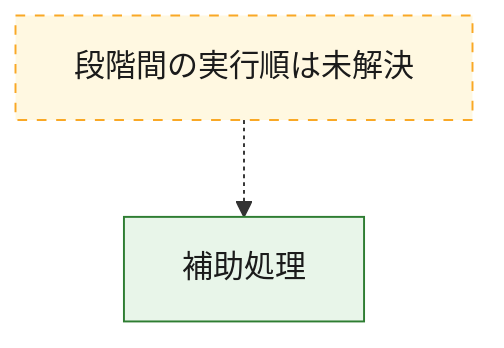
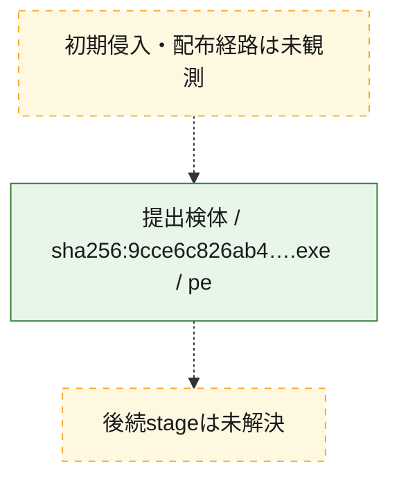
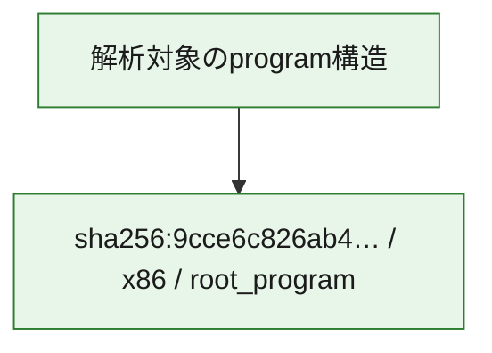

# 全体ロジック：9cce6c826ab4346b7697db6aab3c9ad82ff8f9ecd30bb4b199a606ba389b1d9a

代表関数から主要なmalware処理段階を自動分類できませんでした。

## 読み方

- phaseの掲載順は解析上の整理順です。observed_call_edgesがない段階間の実行順を断定しません。
- 図の実線は静的に観測した関係、点線と黄色のノードは未観測・未解決の関係を示します。
- 図は静的な要約であり、動的実行を再現するものではありません。
- 詳細な関数解説とfingerprintは[STATIC-LOGIC.md](STATIC-LOGIC.md)を参照してください。

## 静的可視化

### 実行フロー

### 感染チェーン

### モジュール関係

## 処理段階

### 1. 補助処理

主要処理を支える一般内部関数またはlibrary処理を確認します。
確度: `confirmed_static_function_evidence`

- `9cce6c826ab4346b7697db6aab3c9ad82ff8f9ecd30bb4b199a606ba389b1d9a:cil:0x06000169` — compiler生成処理または汎用library処理とみられる関数です。 状態: `succeeded`、選定理由: `large_function:instructions=448`
- `9cce6c826ab4346b7697db6aab3c9ad82ff8f9ecd30bb4b199a606ba389b1d9a:cil:0x06000208` — 検体内部の一般処理を実装する関数です。 状態: `succeeded`、選定理由: `large_function:instructions=3095`, `reviewed_call_centrality:64`
- `9cce6c826ab4346b7697db6aab3c9ad82ff8f9ecd30bb4b199a606ba389b1d9a:cil:0x0600020a` — 検体内部の一般処理を実装する関数です。 状態: `succeeded`、選定理由: `large_function:instructions=2975`, `reviewed_call_centrality:52`
- `9cce6c826ab4346b7697db6aab3c9ad82ff8f9ecd30bb4b199a606ba389b1d9a:cil:0x0600020c` — 検体内部の一般処理を実装する関数です。 状態: `succeeded`、選定理由: `large_function:instructions=2662`, `reviewed_call_centrality:66`
- `9cce6c826ab4346b7697db6aab3c9ad82ff8f9ecd30bb4b199a606ba389b1d9a:cil:0x06000212` — 検体内部の一般処理を実装する関数です。 状態: `succeeded`、選定理由: `large_function:instructions=3027`, `reviewed_call_centrality:54`
- `9cce6c826ab4346b7697db6aab3c9ad82ff8f9ecd30bb4b199a606ba389b1d9a:cil:0x06000224` — 検体内部の一般処理を実装する関数です。 状態: `succeeded`、選定理由: `large_function:instructions=3019`, `reviewed_call_centrality:68`
- `9cce6c826ab4346b7697db6aab3c9ad82ff8f9ecd30bb4b199a606ba389b1d9a:cil:0x06000226` — 検体内部の一般処理を実装する関数です。 状態: `succeeded`、選定理由: `large_function:instructions=3336`, `reviewed_call_centrality:70`
- `9cce6c826ab4346b7697db6aab3c9ad82ff8f9ecd30bb4b199a606ba389b1d9a:cil:0x06000227` — 検体内部の一般処理を実装する関数です。 状態: `succeeded`、選定理由: `large_function:instructions=2864`, `reviewed_call_centrality:62`
- `9cce6c826ab4346b7697db6aab3c9ad82ff8f9ecd30bb4b199a606ba389b1d9a:cil:0x0600022b` — 検体内部の一般処理を実装する関数です。 状態: `succeeded`、選定理由: `large_function:instructions=6077`, `reviewed_call_centrality:68`
- `9cce6c826ab4346b7697db6aab3c9ad82ff8f9ecd30bb4b199a606ba389b1d9a:cil:0x0600022c` — 検体内部の一般処理を実装する関数です。 状態: `succeeded`、選定理由: `large_function:instructions=754`, `reviewed_call_centrality:16`
- `9cce6c826ab4346b7697db6aab3c9ad82ff8f9ecd30bb4b199a606ba389b1d9a:cil:0x0600022d` — 検体内部の一般処理を実装する関数です。 状態: `succeeded`、選定理由: `large_function:instructions=2759`, `reviewed_call_centrality:62`
- `9cce6c826ab4346b7697db6aab3c9ad82ff8f9ecd30bb4b199a606ba389b1d9a:cil:0x06000237` — 検体内部の一般処理を実装する関数です。 状態: `succeeded`、選定理由: `large_function:instructions=2707`, `reviewed_call_centrality:62`
- `9cce6c826ab4346b7697db6aab3c9ad82ff8f9ecd30bb4b199a606ba389b1d9a:cil:0x06000248` — 検体内部の一般処理を実装する関数です。 状態: `succeeded`、選定理由: `large_function:instructions=3124`, `reviewed_call_centrality:68`
- `9cce6c826ab4346b7697db6aab3c9ad82ff8f9ecd30bb4b199a606ba389b1d9a:cil:0x06000259` — 検体内部の一般処理を実装する関数です。 状態: `succeeded`、選定理由: `large_function:instructions=2767`, `reviewed_call_centrality:54`
- `9cce6c826ab4346b7697db6aab3c9ad82ff8f9ecd30bb4b199a606ba389b1d9a:cil:0x06000268` — 検体内部の一般処理を実装する関数です。 状態: `succeeded`、選定理由: `large_function:instructions=2082`, `reviewed_call_centrality:58`
- `9cce6c826ab4346b7697db6aab3c9ad82ff8f9ecd30bb4b199a606ba389b1d9a:cil:0x06000270` — 検体内部の一般処理を実装する関数です。 状態: `succeeded`、選定理由: `large_function:instructions=2695`, `reviewed_call_centrality:62`
- `9cce6c826ab4346b7697db6aab3c9ad82ff8f9ecd30bb4b199a606ba389b1d9a:cil:0x06000277` — 検体内部の一般処理を実装する関数です。 状態: `succeeded`、選定理由: `large_function:instructions=2890`, `reviewed_call_centrality:62`
- `9cce6c826ab4346b7697db6aab3c9ad82ff8f9ecd30bb4b199a606ba389b1d9a:cil:0x0600027d` — 検体内部の一般処理を実装する関数です。 状態: `succeeded`、選定理由: `large_function:instructions=615`, `reviewed_call_centrality:18`
- `9cce6c826ab4346b7697db6aab3c9ad82ff8f9ecd30bb4b199a606ba389b1d9a:cil:0x06000280` — 検体内部の一般処理を実装する関数です。 状態: `succeeded`、選定理由: `large_function:instructions=2879`, `reviewed_call_centrality:60`
- `9cce6c826ab4346b7697db6aab3c9ad82ff8f9ecd30bb4b199a606ba389b1d9a:cil:0x06000285` — 検体内部の一般処理を実装する関数です。 状態: `succeeded`、選定理由: `large_function:instructions=4857`, `reviewed_call_centrality:62`
- `9cce6c826ab4346b7697db6aab3c9ad82ff8f9ecd30bb4b199a606ba389b1d9a:cil:0x0600028e` — 検体内部の一般処理を実装する関数です。 状態: `succeeded`、選定理由: `large_function:instructions=419`, `reviewed_call_centrality:22`
- `9cce6c826ab4346b7697db6aab3c9ad82ff8f9ecd30bb4b199a606ba389b1d9a:cil:0x0600028f` — 検体内部の一般処理を実装する関数です。 状態: `succeeded`、選定理由: `large_function:instructions=570`, `reviewed_call_centrality:20`
- `9cce6c826ab4346b7697db6aab3c9ad82ff8f9ecd30bb4b199a606ba389b1d9a:cil:0x06000294` — 検体内部の一般処理を実装する関数です。 状態: `succeeded`、選定理由: `large_function:instructions=3004`, `reviewed_call_centrality:62`
- `9cce6c826ab4346b7697db6aab3c9ad82ff8f9ecd30bb4b199a606ba389b1d9a:cil:0x06000298` — 検体内部の一般処理を実装する関数です。 状態: `succeeded`、選定理由: `large_function:instructions=538`, `reviewed_call_centrality:22`
- `9cce6c826ab4346b7697db6aab3c9ad82ff8f9ecd30bb4b199a606ba389b1d9a:cil:0x060002a0` — 検体内部の一般処理を実装する関数です。 状態: `succeeded`、選定理由: `large_function:instructions=2768`, `reviewed_call_centrality:68`
- `9cce6c826ab4346b7697db6aab3c9ad82ff8f9ecd30bb4b199a606ba389b1d9a:cil:0x060002a4` — 検体内部の一般処理を実装する関数です。 状態: `succeeded`、選定理由: `large_function:instructions=2879`, `reviewed_call_centrality:64`
- `9cce6c826ab4346b7697db6aab3c9ad82ff8f9ecd30bb4b199a606ba389b1d9a:cil:0x060002b7` — 検体内部の一般処理を実装する関数です。 状態: `succeeded`、選定理由: `large_function:instructions=2900`, `reviewed_call_centrality:54`
- `9cce6c826ab4346b7697db6aab3c9ad82ff8f9ecd30bb4b199a606ba389b1d9a:cil:0x060002b9` — 検体内部の一般処理を実装する関数です。 状態: `succeeded`、選定理由: `large_function:instructions=515`, `reviewed_call_centrality:20`
- `9cce6c826ab4346b7697db6aab3c9ad82ff8f9ecd30bb4b199a606ba389b1d9a:cil:0x060002bb` — 検体内部の一般処理を実装する関数です。 状態: `succeeded`、選定理由: `large_function:instructions=3324`, `reviewed_call_centrality:62`
- `9cce6c826ab4346b7697db6aab3c9ad82ff8f9ecd30bb4b199a606ba389b1d9a:cil:0x060002be` — 検体内部の一般処理を実装する関数です。 状態: `succeeded`、選定理由: `large_function:instructions=2839`, `reviewed_call_centrality:66`
- `9cce6c826ab4346b7697db6aab3c9ad82ff8f9ecd30bb4b199a606ba389b1d9a:cil:0x060002e1` — 検体内部の一般処理を実装する関数です。 状態: `succeeded`、選定理由: `large_function:instructions=391`, `reviewed_call_centrality:28`
- `9cce6c826ab4346b7697db6aab3c9ad82ff8f9ecd30bb4b199a606ba389b1d9a:cil:0x060002e8` — 検体内部の一般処理を実装する関数です。 状態: `succeeded`、選定理由: `large_function:instructions=358`, `reviewed_call_centrality:24`

## 観測したcall関係

- 代表関数間で直接解決できた呼出関係はありません。

## 解析範囲と制約

- 選定外関数は全体inventoryへ残しますが、関数本体の個別解説対象にはしていません。
- indirect call、難読化、packer、VM、壊れたcontrol flowによりcall関係が欠落する場合があります。
- 文書は静的解析に基づき、検体実行や外部通信による動的確認は行っていません。
