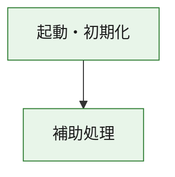
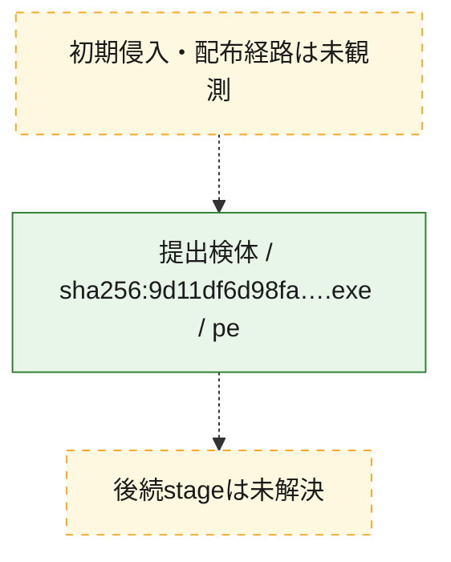
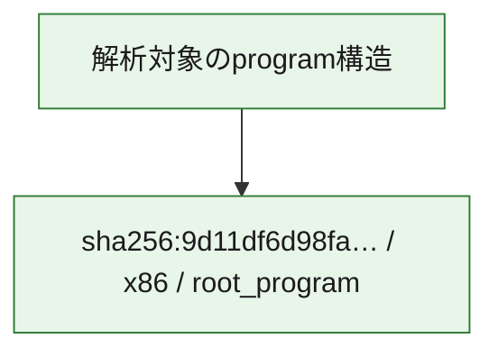

# 全体ロジック：9d11df6d98fa57fb6acea9e4d2894e7ff479932d43e1963ffe6b73251641eba6

代表関数の静的証跡から、起動・初期化の処理群を確認しました。

## 読み方

- phaseの掲載順は解析上の整理順です。observed_call_edgesがない段階間の実行順を断定しません。
- 図の実線は静的に観測した関係、点線と黄色のノードは未観測・未解決の関係を示します。
- 図は静的な要約であり、動的実行を再現するものではありません。
- 詳細な関数解説とfingerprintは[STATIC-LOGIC.md](STATIC-LOGIC.md)を参照してください。

## 静的可視化

### 実行フロー

### 感染チェーン

### モジュール関係

## 処理段階

### 1. 起動・初期化

entry pointから初期化と後続処理への移行を確認します。
確度: `confirmed_static_function_evidence`

- `9d11df6d98fa57fb6acea9e4d2894e7ff479932d43e1963ffe6b73251641eba6:ghidra:180001010` — 初期化と主要処理への分岐を行う入口関数です。 状態: `succeeded`、選定理由: `entry_point`, `meaningful_symbol_name`, `reviewed_call_centrality:22`, `role:entrypoint`, `small_program_complete_context`

### 2. 補助処理

主要処理を支える一般内部関数またはlibrary処理を確認します。
確度: `confirmed_static_function_evidence`

- `9d11df6d98fa57fb6acea9e4d2894e7ff479932d43e1963ffe6b73251641eba6:ghidra:180001240` — 検体内部の一般処理を実装する関数です。 状態: `succeeded`、選定理由: `context_representative`, `reviewed_call_centrality:2`, `small_program_complete_context`
- `9d11df6d98fa57fb6acea9e4d2894e7ff479932d43e1963ffe6b73251641eba6:ghidra:180001350` — 検体内部の一般処理を実装する関数です。 状態: `succeeded`、選定理由: `context_representative`, `reviewed_call_centrality:25`, `small_program_complete_context`
- `9d11df6d98fa57fb6acea9e4d2894e7ff479932d43e1963ffe6b73251641eba6:ghidra:180003780` — 検体内部の一般処理を実装する関数です。 状態: `succeeded`、選定理由: `context_representative`, `reviewed_call_centrality:2`, `small_program_complete_context`
- `9d11df6d98fa57fb6acea9e4d2894e7ff479932d43e1963ffe6b73251641eba6:ghidra:1800038e0` — 検体内部の一般処理を実装する関数です。 状態: `succeeded`、選定理由: `context_representative`, `reviewed_call_centrality:2`, `small_program_complete_context`

## 観測したcall関係

- `9d11df6d98fa57fb6acea9e4d2894e7ff479932d43e1963ffe6b73251641eba6:ghidra:180001010` → `9d11df6d98fa57fb6acea9e4d2894e7ff479932d43e1963ffe6b73251641eba6:ghidra:180001240` （`startup` → `support`）
- `9d11df6d98fa57fb6acea9e4d2894e7ff479932d43e1963ffe6b73251641eba6:ghidra:180001010` → `9d11df6d98fa57fb6acea9e4d2894e7ff479932d43e1963ffe6b73251641eba6:ghidra:180001350` （`startup` → `support`）
- `9d11df6d98fa57fb6acea9e4d2894e7ff479932d43e1963ffe6b73251641eba6:ghidra:180001350` → `9d11df6d98fa57fb6acea9e4d2894e7ff479932d43e1963ffe6b73251641eba6:ghidra:180001240` （`support` → `support`）
- `9d11df6d98fa57fb6acea9e4d2894e7ff479932d43e1963ffe6b73251641eba6:ghidra:180001350` → `9d11df6d98fa57fb6acea9e4d2894e7ff479932d43e1963ffe6b73251641eba6:ghidra:180003780` （`support` → `support`）
- `9d11df6d98fa57fb6acea9e4d2894e7ff479932d43e1963ffe6b73251641eba6:ghidra:180001350` → `9d11df6d98fa57fb6acea9e4d2894e7ff479932d43e1963ffe6b73251641eba6:ghidra:1800038e0` （`support` → `support`）
- `9d11df6d98fa57fb6acea9e4d2894e7ff479932d43e1963ffe6b73251641eba6:ghidra:180003780` → `9d11df6d98fa57fb6acea9e4d2894e7ff479932d43e1963ffe6b73251641eba6:ghidra:1800038e0` （`support` → `support`）
- `ghidra-function:3194dad461e9928a21eae09a` → `ghidra-function:7e81207a22bc9f3ac076ea1a` （`unclassified` → `unclassified`）
- `ghidra-function:77e23dda53278074b70f6532` → `ghidra-function:030869974c533e3654647d6a` （`unclassified` → `unclassified`）
- `ghidra-function:77e23dda53278074b70f6532` → `ghidra-function:41dfd58edfa900e115f5ed8a` （`unclassified` → `unclassified`）
- `ghidra-function:77e23dda53278074b70f6532` → `ghidra-function:540da0902ac072c0e87b28bd` （`unclassified` → `unclassified`）
- `ghidra-function:77e23dda53278074b70f6532` → `ghidra-function:7c93d8716a95644d269217d8` （`unclassified` → `unclassified`）
- `ghidra-function:77e23dda53278074b70f6532` → `ghidra-function:7d436b71d1db7bf998f2b0dd` （`unclassified` → `unclassified`）
- `ghidra-function:77e23dda53278074b70f6532` → `ghidra-function:b2221fbb2b3ca36a475300fb` （`unclassified` → `unclassified`）
- `ghidra-function:77e23dda53278074b70f6532` → `ghidra-function:bb31ac800751e9ed3317d198` （`unclassified` → `unclassified`）
- `ghidra-function:77e23dda53278074b70f6532` → `ghidra-function:c9d063471b05295e21cdac39` （`unclassified` → `unclassified`）
- `ghidra-function:77e23dda53278074b70f6532` → `ghidra-function:dfca28b44119c32e6c462116` （`unclassified` → `unclassified`）
- `ghidra-function:77e23dda53278074b70f6532` → `ghidra-function:ec0895479ee0e1bd10f0bcb8` （`unclassified` → `unclassified`）
- `ghidra-function:77e23dda53278074b70f6532` → `ghidra-function:ec7e8c71afb5c896deab38ee` （`unclassified` → `unclassified`）
- `ghidra-function:77e23dda53278074b70f6532` → `ghidra-function:fc1b6ad80048c2ab71ef3c95` （`unclassified` → `unclassified`）
- `ghidra-function:fc1b6ad80048c2ab71ef3c95` → `ghidra-external:018fb4002fa46e4d255efeba` （`unclassified` → `unclassified`）
- `ghidra-function:fc1b6ad80048c2ab71ef3c95` → `ghidra-external:0c04b88692833224d0a70153` （`unclassified` → `unclassified`）
- `ghidra-function:fc1b6ad80048c2ab71ef3c95` → `ghidra-external:3914d732c02563768e8f84f4` （`unclassified` → `unclassified`）
- `ghidra-function:fc1b6ad80048c2ab71ef3c95` → `ghidra-external:4a7b9826c39f2d5c6161643b` （`unclassified` → `unclassified`）
- `ghidra-function:fc1b6ad80048c2ab71ef3c95` → `ghidra-external:4db8d0bf3018cdacc8574ea5` （`unclassified` → `unclassified`）
- `ghidra-function:fc1b6ad80048c2ab71ef3c95` → `ghidra-external:549f389bde81d138f7aab338` （`unclassified` → `unclassified`）
- `ghidra-function:fc1b6ad80048c2ab71ef3c95` → `ghidra-external:599aba2535dd9d4d695351b5` （`unclassified` → `unclassified`）
- `ghidra-function:fc1b6ad80048c2ab71ef3c95` → `ghidra-external:72e701edd9ce538846547be5` （`unclassified` → `unclassified`）
- `ghidra-function:fc1b6ad80048c2ab71ef3c95` → `ghidra-external:7dd646dbf1135acdae4df662` （`unclassified` → `unclassified`）
- `ghidra-function:fc1b6ad80048c2ab71ef3c95` → `ghidra-external:8eddbc8c67f43f81ea2f4405` （`unclassified` → `unclassified`）
- `ghidra-function:fc1b6ad80048c2ab71ef3c95` → `ghidra-external:8ffd744a0eb01f56ee45542c` （`unclassified` → `unclassified`）
- `ghidra-function:fc1b6ad80048c2ab71ef3c95` → `ghidra-external:aef01587bd65c06e51c13082` （`unclassified` → `unclassified`）
- `ghidra-function:fc1b6ad80048c2ab71ef3c95` → `ghidra-external:b9b5453ef8e25c0dfa469914` （`unclassified` → `unclassified`）
- `ghidra-function:fc1b6ad80048c2ab71ef3c95` → `ghidra-external:c025d5b3e95098461031a244` （`unclassified` → `unclassified`）
- `ghidra-function:fc1b6ad80048c2ab71ef3c95` → `ghidra-external:c0a96dbdeb18af9fe7229859` （`unclassified` → `unclassified`）
- `ghidra-function:fc1b6ad80048c2ab71ef3c95` → `ghidra-external:cf8581b25d3a93c85d99ecc2` （`unclassified` → `unclassified`）
- `ghidra-function:fc1b6ad80048c2ab71ef3c95` → `ghidra-external:d74ca3955aa8dd75ed7272bd` （`unclassified` → `unclassified`）
- `ghidra-function:fc1b6ad80048c2ab71ef3c95` → `ghidra-external:d9cdd2c7f7905666732693f0` （`unclassified` → `unclassified`）
- `ghidra-function:fc1b6ad80048c2ab71ef3c95` → `ghidra-external:e9daaa5f51437e8d5431fdc2` （`unclassified` → `unclassified`）
- `ghidra-function:fc1b6ad80048c2ab71ef3c95` → `ghidra-external:ed3072963303a6c75f8cf98b` （`unclassified` → `unclassified`）
- `ghidra-function:fc1b6ad80048c2ab71ef3c95` → `ghidra-external:f5055cc89cb1f62d838c9015` （`unclassified` → `unclassified`）
- `ghidra-function:fc1b6ad80048c2ab71ef3c95` → `ghidra-function:3194dad461e9928a21eae09a` （`unclassified` → `unclassified`）
- `ghidra-function:fc1b6ad80048c2ab71ef3c95` → `ghidra-function:7c93d8716a95644d269217d8` （`unclassified` → `unclassified`）
- `ghidra-function:fc1b6ad80048c2ab71ef3c95` → `ghidra-function:7e81207a22bc9f3ac076ea1a` （`unclassified` → `unclassified`）

## 解析範囲と制約

- 選定外関数は全体inventoryへ残しますが、関数本体の個別解説対象にはしていません。
- indirect call、難読化、packer、VM、壊れたcontrol flowによりcall関係が欠落する場合があります。
- 文書は静的解析に基づき、検体実行や外部通信による動的確認は行っていません。
