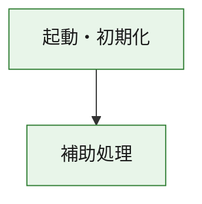
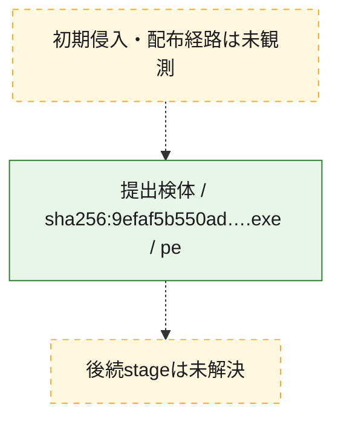
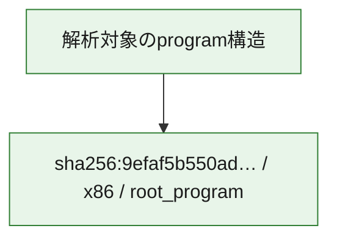

# 全体ロジック：9efaf5b550adde9bc6316fef4a449fd45ca5fb8e25c773468407b6f48ff5f001

代表関数の静的証跡から、起動・初期化の処理群を確認しました。

## 読み方

- phaseの掲載順は解析上の整理順です。observed_call_edgesがない段階間の実行順を断定しません。
- 図の実線は静的に観測した関係、点線と黄色のノードは未観測・未解決の関係を示します。
- 図は静的な要約であり、動的実行を再現するものではありません。
- 詳細な関数解説とfingerprintは[STATIC-LOGIC.md](STATIC-LOGIC.md)を参照してください。

## 静的可視化

### 実行フロー

### 感染チェーン

### モジュール関係

## 処理段階

### 1. 起動・初期化

entry pointから初期化と後続処理への移行を確認します。
確度: `confirmed_static_function_evidence`

- `9efaf5b550adde9bc6316fef4a449fd45ca5fb8e25c773468407b6f48ff5f001:ghidra:180001010` — 初期化と主要処理への分岐を行う入口関数です。 状態: `succeeded`、選定理由: `entry_point`, `meaningful_symbol_name`, `reviewed_call_centrality:22`, `role:entrypoint`, `small_program_complete_context`

### 2. 補助処理

主要処理を支える一般内部関数またはlibrary処理を確認します。
確度: `confirmed_static_function_evidence`

- `9efaf5b550adde9bc6316fef4a449fd45ca5fb8e25c773468407b6f48ff5f001:ghidra:180001240` — 検体内部の一般処理を実装する関数です。 状態: `succeeded`、選定理由: `context_representative`, `reviewed_call_centrality:2`, `small_program_complete_context`
- `9efaf5b550adde9bc6316fef4a449fd45ca5fb8e25c773468407b6f48ff5f001:ghidra:180001350` — 検体内部の一般処理を実装する関数です。 状態: `succeeded`、選定理由: `context_representative`, `reviewed_call_centrality:25`, `small_program_complete_context`
- `9efaf5b550adde9bc6316fef4a449fd45ca5fb8e25c773468407b6f48ff5f001:ghidra:180003780` — 検体内部の一般処理を実装する関数です。 状態: `succeeded`、選定理由: `context_representative`, `reviewed_call_centrality:2`, `small_program_complete_context`
- `9efaf5b550adde9bc6316fef4a449fd45ca5fb8e25c773468407b6f48ff5f001:ghidra:1800038e0` — 検体内部の一般処理を実装する関数です。 状態: `succeeded`、選定理由: `context_representative`, `reviewed_call_centrality:2`, `small_program_complete_context`

## 観測したcall関係

- `9efaf5b550adde9bc6316fef4a449fd45ca5fb8e25c773468407b6f48ff5f001:ghidra:180001010` → `9efaf5b550adde9bc6316fef4a449fd45ca5fb8e25c773468407b6f48ff5f001:ghidra:180001240` （`startup` → `support`）
- `9efaf5b550adde9bc6316fef4a449fd45ca5fb8e25c773468407b6f48ff5f001:ghidra:180001010` → `9efaf5b550adde9bc6316fef4a449fd45ca5fb8e25c773468407b6f48ff5f001:ghidra:180001350` （`startup` → `support`）
- `9efaf5b550adde9bc6316fef4a449fd45ca5fb8e25c773468407b6f48ff5f001:ghidra:180001350` → `9efaf5b550adde9bc6316fef4a449fd45ca5fb8e25c773468407b6f48ff5f001:ghidra:180001240` （`support` → `support`）
- `9efaf5b550adde9bc6316fef4a449fd45ca5fb8e25c773468407b6f48ff5f001:ghidra:180001350` → `9efaf5b550adde9bc6316fef4a449fd45ca5fb8e25c773468407b6f48ff5f001:ghidra:180003780` （`support` → `support`）
- `9efaf5b550adde9bc6316fef4a449fd45ca5fb8e25c773468407b6f48ff5f001:ghidra:180001350` → `9efaf5b550adde9bc6316fef4a449fd45ca5fb8e25c773468407b6f48ff5f001:ghidra:1800038e0` （`support` → `support`）
- `9efaf5b550adde9bc6316fef4a449fd45ca5fb8e25c773468407b6f48ff5f001:ghidra:180003780` → `9efaf5b550adde9bc6316fef4a449fd45ca5fb8e25c773468407b6f48ff5f001:ghidra:1800038e0` （`support` → `support`）
- `ghidra-function:56de310cb88bf804d7a4e230` → `ghidra-function:171e0defbe13b9230a89452f` （`unclassified` → `unclassified`）
- `ghidra-function:56de310cb88bf804d7a4e230` → `ghidra-function:28d19c09b4574b389eac8495` （`unclassified` → `unclassified`）
- `ghidra-function:56de310cb88bf804d7a4e230` → `ghidra-function:61f8c86c2aa3d8227e7180b3` （`unclassified` → `unclassified`）
- `ghidra-function:56de310cb88bf804d7a4e230` → `ghidra-function:6c427a2ecbfbacd66b61c0a4` （`unclassified` → `unclassified`）
- `ghidra-function:56de310cb88bf804d7a4e230` → `ghidra-function:6d44f1f2d64d981cd1bb7366` （`unclassified` → `unclassified`）
- `ghidra-function:56de310cb88bf804d7a4e230` → `ghidra-function:9b83882732b6a390f3251bc6` （`unclassified` → `unclassified`）
- `ghidra-function:56de310cb88bf804d7a4e230` → `ghidra-function:a32c911275c0986bfa1821c9` （`unclassified` → `unclassified`）
- `ghidra-function:56de310cb88bf804d7a4e230` → `ghidra-function:a3e94a2e98a7b6ab8fddded3` （`unclassified` → `unclassified`）
- `ghidra-function:56de310cb88bf804d7a4e230` → `ghidra-function:c452574361e8d402ade4418d` （`unclassified` → `unclassified`）
- `ghidra-function:56de310cb88bf804d7a4e230` → `ghidra-function:cbe1e50396ecebc11f5e7955` （`unclassified` → `unclassified`）
- `ghidra-function:56de310cb88bf804d7a4e230` → `ghidra-function:d9957d05b124eee04a6010a2` （`unclassified` → `unclassified`）
- `ghidra-function:56de310cb88bf804d7a4e230` → `ghidra-function:f7e60fd2f68eefa99fc872cf` （`unclassified` → `unclassified`）
- `ghidra-function:803dcf32ba4a59829f6c7089` → `ghidra-function:d04ee7ccb936d0e33ad30758` （`unclassified` → `unclassified`）
- `ghidra-function:c452574361e8d402ade4418d` → `ghidra-external:09736544524156413a66c5ab` （`unclassified` → `unclassified`）
- `ghidra-function:c452574361e8d402ade4418d` → `ghidra-external:12751d702480a2cf41ab67c6` （`unclassified` → `unclassified`）
- `ghidra-function:c452574361e8d402ade4418d` → `ghidra-external:1ec2585077e257ba164934db` （`unclassified` → `unclassified`）
- `ghidra-function:c452574361e8d402ade4418d` → `ghidra-external:21b6fb91df465284ce92e808` （`unclassified` → `unclassified`）
- `ghidra-function:c452574361e8d402ade4418d` → `ghidra-external:38828bde3d6b7a52164c9854` （`unclassified` → `unclassified`）
- `ghidra-function:c452574361e8d402ade4418d` → `ghidra-external:4228bfb587348da5a932a31a` （`unclassified` → `unclassified`）
- `ghidra-function:c452574361e8d402ade4418d` → `ghidra-external:4f6dba369a14f9308eb9b8c2` （`unclassified` → `unclassified`）
- `ghidra-function:c452574361e8d402ade4418d` → `ghidra-external:56f4ff0d01ee7d0b4fdf83b4` （`unclassified` → `unclassified`）
- `ghidra-function:c452574361e8d402ade4418d` → `ghidra-external:5c395e87266e601b56115365` （`unclassified` → `unclassified`）
- `ghidra-function:c452574361e8d402ade4418d` → `ghidra-external:6d0a5c71393c97dac5634e5f` （`unclassified` → `unclassified`）
- `ghidra-function:c452574361e8d402ade4418d` → `ghidra-external:7176bca4aa1f2d953db5003d` （`unclassified` → `unclassified`）
- `ghidra-function:c452574361e8d402ade4418d` → `ghidra-external:79fefcaed7faa84e4d22178c` （`unclassified` → `unclassified`）
- `ghidra-function:c452574361e8d402ade4418d` → `ghidra-external:a74cf5edf753fd385ed9d32c` （`unclassified` → `unclassified`）
- `ghidra-function:c452574361e8d402ade4418d` → `ghidra-external:ab054e7dcd37408a962af9e5` （`unclassified` → `unclassified`）
- `ghidra-function:c452574361e8d402ade4418d` → `ghidra-external:c3a3f2597ad00f3f811bbdb0` （`unclassified` → `unclassified`）
- `ghidra-function:c452574361e8d402ade4418d` → `ghidra-external:dd2a4271d6bd0c151ca8688b` （`unclassified` → `unclassified`）
- `ghidra-function:c452574361e8d402ade4418d` → `ghidra-external:dfafed8610d03c21b5cf8a4f` （`unclassified` → `unclassified`）
- `ghidra-function:c452574361e8d402ade4418d` → `ghidra-external:e53de5fd03fbfe6073569fc9` （`unclassified` → `unclassified`）
- `ghidra-function:c452574361e8d402ade4418d` → `ghidra-external:ec3067b0afa35a9fde0d8ee5` （`unclassified` → `unclassified`）
- `ghidra-function:c452574361e8d402ade4418d` → `ghidra-external:f32f992086577ec34a98e5ff` （`unclassified` → `unclassified`）
- `ghidra-function:c452574361e8d402ade4418d` → `ghidra-external:fb713f22be6d938a3771a4b9` （`unclassified` → `unclassified`）
- `ghidra-function:c452574361e8d402ade4418d` → `ghidra-function:803dcf32ba4a59829f6c7089` （`unclassified` → `unclassified`）
- `ghidra-function:c452574361e8d402ade4418d` → `ghidra-function:d04ee7ccb936d0e33ad30758` （`unclassified` → `unclassified`）
- `ghidra-function:c452574361e8d402ade4418d` → `ghidra-function:d9957d05b124eee04a6010a2` （`unclassified` → `unclassified`）

## 解析範囲と制約

- 選定外関数は全体inventoryへ残しますが、関数本体の個別解説対象にはしていません。
- indirect call、難読化、packer、VM、壊れたcontrol flowによりcall関係が欠落する場合があります。
- 文書は静的解析に基づき、検体実行や外部通信による動的確認は行っていません。
