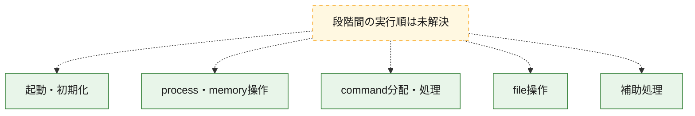
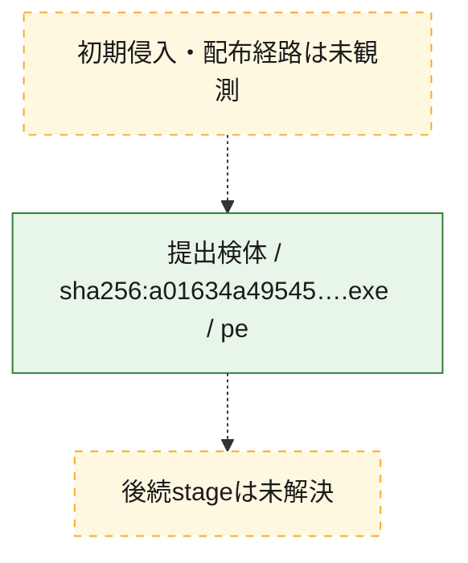
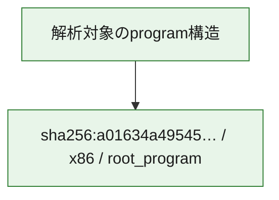

# 全体ロジック：a01634a49545e05dcb1624aec62184f1f45c9224e4d356d191971914a4668a5a

代表関数の静的証跡から、起動・初期化、process・memory操作、command分配・処理、file操作の処理群を確認しました。

## 読み方

- phaseの掲載順は解析上の整理順です。observed_call_edgesがない段階間の実行順を断定しません。
- 図の実線は静的に観測した関係、点線と黄色のノードは未観測・未解決の関係を示します。
- 図は静的な要約であり、動的実行を再現するものではありません。
- 詳細な関数解説とfingerprintは[STATIC-LOGIC.md](STATIC-LOGIC.md)を参照してください。

## 静的可視化

### 実行フロー

### 感染チェーン

### モジュール関係

## 処理段階

### 1. 起動・初期化

entry pointから初期化と後続処理への移行を確認します。
確度: `confirmed_static_function_evidence`

- `a01634a49545e05dcb1624aec62184f1f45c9224e4d356d191971914a4668a5a:ghidra:180001bd4` — 初期化と主要処理への分岐を行う入口関数です。 状態: `succeeded`、選定理由: `entry_point`, `meaningful_symbol_name`, `reviewed_call_centrality:5`, `role:entrypoint`

### 2. process・memory操作

process、thread、module、memory操作と実行移行を確認します。
確度: `confirmed_static_function_evidence`

- `a01634a49545e05dcb1624aec62184f1f45c9224e4d356d191971914a4668a5a:ghidra:180001020` — process、thread、module、またはmemory操作に関係する関数です。 状態: `succeeded`、選定理由: `context_representative`, `reviewed_call_centrality:4`, `role:process_or_memory_operation`
- `a01634a49545e05dcb1624aec62184f1f45c9224e4d356d191971914a4668a5a:ghidra:180001040` — process、thread、module、またはmemory操作に関係する関数です。 状態: `succeeded`、選定理由: `entry_point`, `meaningful_symbol_name`, `reviewed_call_centrality:40`, `role:process_or_memory_operation`
- `a01634a49545e05dcb1624aec62184f1f45c9224e4d356d191971914a4668a5a:ghidra:180001c1c` — process、thread、module、またはmemory操作に関係する関数です。 状態: `succeeded`、選定理由: `context_representative`, `reviewed_call_centrality:10`, `role:process_or_memory_operation`

### 3. command分配・処理

受信commandやtaskの解釈、分配、個別handlerへの移行を確認します。
確度: `confirmed_static_function_evidence_with_limits`

- `a01634a49545e05dcb1624aec62184f1f45c9224e4d356d191971914a4668a5a:ghidra:1800018c0` — commandの解釈、分配、または個別処理を担当する関数です。 状態: `succeeded`、選定理由: `context_representative`, `reviewed_call_centrality:25`, `role:command_dispatch_or_handler`
- `a01634a49545e05dcb1624aec62184f1f45c9224e4d356d191971914a4668a5a:ghidra:180001910` — commandの解釈、分配、または個別処理を担当する関数です。 状態: `succeeded`、選定理由: `context_representative`, `reviewed_call_centrality:15`, `role:command_dispatch_or_handler`
- `a01634a49545e05dcb1624aec62184f1f45c9224e4d356d191971914a4668a5a:ghidra:180001ddc` — commandの解釈、分配、または個別処理を担当する関数です。 状態: `succeeded`、選定理由: `context_representative`, `reviewed_call_centrality:4`, `role:command_dispatch_or_handler`
- `a01634a49545e05dcb1624aec62184f1f45c9224e4d356d191971914a4668a5a:ghidra:18000204c` — commandの解釈、分配、または個別処理を担当する関数です。 状態: `succeeded`、選定理由: `context_representative`, `reviewed_call_centrality:3`, `role:command_dispatch_or_handler`
- `a01634a49545e05dcb1624aec62184f1f45c9224e4d356d191971914a4668a5a:ghidra:18000cee0` — commandの解釈、分配、または個別処理を担当する関数です。 状態: `limited_bad_instruction_or_flow`、選定理由: `meaningful_symbol_name`, `reviewed_call_centrality:4`, `role:command_dispatch_or_handler`

### 4. file操作

fileやdirectoryの作成、読書き、削除を確認します。
確度: `confirmed_static_function_evidence`

- `a01634a49545e05dcb1624aec62184f1f45c9224e4d356d191971914a4668a5a:ghidra:180001640` — fileまたはdirectoryの読書き・管理に関係する関数です。 状態: `succeeded`、選定理由: `context_representative`, `reviewed_call_centrality:11`, `role:file_operation`

### 5. 補助処理

主要処理を支える一般内部関数またはlibrary処理を確認します。
確度: `confirmed_static_function_evidence`

- `a01634a49545e05dcb1624aec62184f1f45c9224e4d356d191971914a4668a5a:ghidra:1800014a0` — 検体内部の一般処理を実装する関数です。 状態: `succeeded`、選定理由: `entry_point`, `meaningful_symbol_name`, `reviewed_call_centrality:2`
- `a01634a49545e05dcb1624aec62184f1f45c9224e4d356d191971914a4668a5a:ghidra:1800014e0` — 検体内部の一般処理を実装する関数です。 状態: `succeeded`、選定理由: `context_representative`, `reviewed_call_centrality:5`
- `a01634a49545e05dcb1624aec62184f1f45c9224e4d356d191971914a4668a5a:ghidra:1800015b0` — 検体内部の一般処理を実装する関数です。 状態: `succeeded`、選定理由: `context_representative`, `reviewed_call_centrality:5`
- `a01634a49545e05dcb1624aec62184f1f45c9224e4d356d191971914a4668a5a:ghidra:1800017a4` — 検体内部の一般処理を実装する関数です。 状態: `succeeded`、選定理由: `context_representative`, `reviewed_call_centrality:1`
- `a01634a49545e05dcb1624aec62184f1f45c9224e4d356d191971914a4668a5a:ghidra:180001840` — 検体内部の一般処理を実装する関数です。 状態: `succeeded`、選定理由: `context_representative`, `reviewed_call_centrality:1`
- `a01634a49545e05dcb1624aec62184f1f45c9224e4d356d191971914a4668a5a:ghidra:1800018a0` — 検体内部の一般処理を実装する関数です。 状態: `succeeded`、選定理由: `context_representative`, `reviewed_call_centrality:5`
- `a01634a49545e05dcb1624aec62184f1f45c9224e4d356d191971914a4668a5a:ghidra:180001a28` — 検体内部の一般処理を実装する関数です。 状態: `succeeded`、選定理由: `context_representative`, `reviewed_call_centrality:11`
- `a01634a49545e05dcb1624aec62184f1f45c9224e4d356d191971914a4668a5a:ghidra:180001aac` — 検体内部の一般処理を実装する関数です。 状態: `succeeded`、選定理由: `context_representative`, `reviewed_call_centrality:4`
- `a01634a49545e05dcb1624aec62184f1f45c9224e4d356d191971914a4668a5a:ghidra:180001cf8` — 検体内部の一般処理を実装する関数です。 状態: `succeeded`、選定理由: `context_representative`, `reviewed_call_centrality:4`
- `a01634a49545e05dcb1624aec62184f1f45c9224e4d356d191971914a4668a5a:ghidra:180001d14` — 検体内部の一般処理を実装する関数です。 状態: `succeeded`、選定理由: `context_representative`, `reviewed_call_centrality:6`
- `a01634a49545e05dcb1624aec62184f1f45c9224e4d356d191971914a4668a5a:ghidra:180001d50` — 検体内部の一般処理を実装する関数です。 状態: `succeeded`、選定理由: `context_representative`, `reviewed_call_centrality:7`
- `a01634a49545e05dcb1624aec62184f1f45c9224e4d356d191971914a4668a5a:ghidra:180001d84` — 検体内部の一般処理を実装する関数です。 状態: `succeeded`、選定理由: `context_representative`, `reviewed_call_centrality:3`
- `a01634a49545e05dcb1624aec62184f1f45c9224e4d356d191971914a4668a5a:ghidra:180001d9c` — 検体内部の一般処理を実装する関数です。 状態: `succeeded`、選定理由: `context_representative`, `reviewed_call_centrality:4`
- `a01634a49545e05dcb1624aec62184f1f45c9224e4d356d191971914a4668a5a:ghidra:180001dc4` — 検体内部の一般処理を実装する関数です。 状態: `succeeded`、選定理由: `context_representative`, `reviewed_call_centrality:3`
- `a01634a49545e05dcb1624aec62184f1f45c9224e4d356d191971914a4668a5a:ghidra:180001e3c` — 検体内部の一般処理を実装する関数です。 状態: `succeeded`、選定理由: `context_representative`, `reviewed_call_centrality:6`
- `a01634a49545e05dcb1624aec62184f1f45c9224e4d356d191971914a4668a5a:ghidra:180001e6c` — 検体内部の一般処理を実装する関数です。 状態: `succeeded`、選定理由: `context_representative`, `reviewed_call_centrality:4`
- `a01634a49545e05dcb1624aec62184f1f45c9224e4d356d191971914a4668a5a:ghidra:180001e80` — 検体内部の一般処理を実装する関数です。 状態: `succeeded`、選定理由: `context_representative`, `reviewed_call_centrality:6`
- `a01634a49545e05dcb1624aec62184f1f45c9224e4d356d191971914a4668a5a:ghidra:180001ebc` — 検体内部の一般処理を実装する関数です。 状態: `succeeded`、選定理由: `context_representative`, `reviewed_call_centrality:5`
- `a01634a49545e05dcb1624aec62184f1f45c9224e4d356d191971914a4668a5a:ghidra:180001f48` — 検体内部の一般処理を実装する関数です。 状態: `succeeded`、選定理由: `context_representative`, `reviewed_call_centrality:4`
- `a01634a49545e05dcb1624aec62184f1f45c9224e4d356d191971914a4668a5a:ghidra:180001fe0` — 検体内部の一般処理を実装する関数です。 状態: `succeeded`、選定理由: `context_representative`, `reviewed_call_centrality:6`
- `a01634a49545e05dcb1624aec62184f1f45c9224e4d356d191971914a4668a5a:ghidra:180002004` — 検体内部の一般処理を実装する関数です。 状態: `succeeded`、選定理由: `context_representative`, `reviewed_call_centrality:4`
- `a01634a49545e05dcb1624aec62184f1f45c9224e4d356d191971914a4668a5a:ghidra:1800020c4` — 検体内部の一般処理を実装する関数です。 状態: `succeeded`、選定理由: `meaningful_symbol_name`

## 観測したcall関係

- 代表関数間で直接解決できた呼出関係はありません。

## 解析範囲と制約

- 選定外関数は全体inventoryへ残しますが、関数本体の個別解説対象にはしていません。
- indirect call、難読化、packer、VM、壊れたcontrol flowによりcall関係が欠落する場合があります。
- 文書は静的解析に基づき、検体実行や外部通信による動的確認は行っていません。
