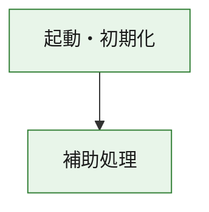
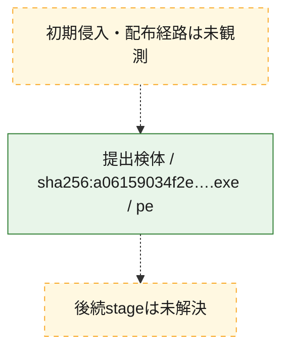
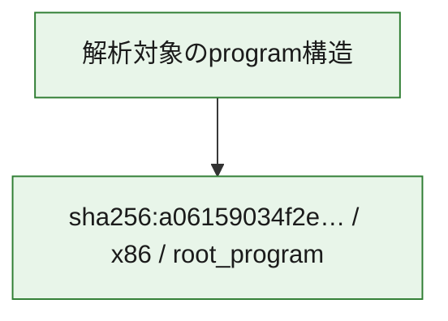

# 全体ロジック：a06159034f2e9d1db463a3a63349758145f88f7a70dbe16824bc46d0d49e397c

代表関数の静的証跡から、起動・初期化の処理群を確認しました。

## 読み方

- phaseの掲載順は解析上の整理順です。observed_call_edgesがない段階間の実行順を断定しません。
- 図の実線は静的に観測した関係、点線と黄色のノードは未観測・未解決の関係を示します。
- 図は静的な要約であり、動的実行を再現するものではありません。
- 詳細な関数解説とfingerprintは[STATIC-LOGIC.md](STATIC-LOGIC.md)を参照してください。

## 静的可視化

### 実行フロー

### 感染チェーン

### モジュール関係

## 処理段階

### 1. 起動・初期化

entry pointから初期化と後続処理への移行を確認します。
確度: `confirmed_static_function_evidence`

- `a06159034f2e9d1db463a3a63349758145f88f7a70dbe16824bc46d0d49e397c:ghidra:180001010` — 初期化と主要処理への分岐を行う入口関数です。 状態: `succeeded`、選定理由: `entry_point`, `meaningful_symbol_name`, `reviewed_call_centrality:22`, `role:entrypoint`, `small_program_complete_context`

### 2. 補助処理

主要処理を支える一般内部関数またはlibrary処理を確認します。
確度: `confirmed_static_function_evidence`

- `a06159034f2e9d1db463a3a63349758145f88f7a70dbe16824bc46d0d49e397c:ghidra:180001240` — 検体内部の一般処理を実装する関数です。 状態: `succeeded`、選定理由: `context_representative`, `reviewed_call_centrality:2`, `small_program_complete_context`
- `a06159034f2e9d1db463a3a63349758145f88f7a70dbe16824bc46d0d49e397c:ghidra:180001350` — 検体内部の一般処理を実装する関数です。 状態: `succeeded`、選定理由: `context_representative`, `reviewed_call_centrality:25`, `small_program_complete_context`
- `a06159034f2e9d1db463a3a63349758145f88f7a70dbe16824bc46d0d49e397c:ghidra:180003780` — 検体内部の一般処理を実装する関数です。 状態: `succeeded`、選定理由: `context_representative`, `reviewed_call_centrality:2`, `small_program_complete_context`
- `a06159034f2e9d1db463a3a63349758145f88f7a70dbe16824bc46d0d49e397c:ghidra:1800038e0` — 検体内部の一般処理を実装する関数です。 状態: `succeeded`、選定理由: `context_representative`, `reviewed_call_centrality:2`, `small_program_complete_context`

## 観測したcall関係

- `a06159034f2e9d1db463a3a63349758145f88f7a70dbe16824bc46d0d49e397c:ghidra:180001010` → `a06159034f2e9d1db463a3a63349758145f88f7a70dbe16824bc46d0d49e397c:ghidra:180001240` （`startup` → `support`）
- `a06159034f2e9d1db463a3a63349758145f88f7a70dbe16824bc46d0d49e397c:ghidra:180001010` → `a06159034f2e9d1db463a3a63349758145f88f7a70dbe16824bc46d0d49e397c:ghidra:180001350` （`startup` → `support`）
- `a06159034f2e9d1db463a3a63349758145f88f7a70dbe16824bc46d0d49e397c:ghidra:180001350` → `a06159034f2e9d1db463a3a63349758145f88f7a70dbe16824bc46d0d49e397c:ghidra:180001240` （`support` → `support`）
- `a06159034f2e9d1db463a3a63349758145f88f7a70dbe16824bc46d0d49e397c:ghidra:180001350` → `a06159034f2e9d1db463a3a63349758145f88f7a70dbe16824bc46d0d49e397c:ghidra:180003780` （`support` → `support`）
- `a06159034f2e9d1db463a3a63349758145f88f7a70dbe16824bc46d0d49e397c:ghidra:180001350` → `a06159034f2e9d1db463a3a63349758145f88f7a70dbe16824bc46d0d49e397c:ghidra:1800038e0` （`support` → `support`）
- `a06159034f2e9d1db463a3a63349758145f88f7a70dbe16824bc46d0d49e397c:ghidra:180003780` → `a06159034f2e9d1db463a3a63349758145f88f7a70dbe16824bc46d0d49e397c:ghidra:1800038e0` （`support` → `support`）
- `ghidra-function:1f033c4d144c88b39a05549b` → `ghidra-function:d2560dac393c1370536fe798` （`unclassified` → `unclassified`）
- `ghidra-function:69b97dca11be039a7dee13cf` → `ghidra-external:22d5c98196c69ddf1747ea95` （`unclassified` → `unclassified`）
- `ghidra-function:69b97dca11be039a7dee13cf` → `ghidra-external:2467a5cc2ee1ab73c19b04f7` （`unclassified` → `unclassified`）
- `ghidra-function:69b97dca11be039a7dee13cf` → `ghidra-external:2607f763bc2544f6070b22a0` （`unclassified` → `unclassified`）
- `ghidra-function:69b97dca11be039a7dee13cf` → `ghidra-external:27a4dad6a669ae53c78cf819` （`unclassified` → `unclassified`）
- `ghidra-function:69b97dca11be039a7dee13cf` → `ghidra-external:37015eee66ac82c653407422` （`unclassified` → `unclassified`）
- `ghidra-function:69b97dca11be039a7dee13cf` → `ghidra-external:3b9597b2c8dbeba6b519bf95` （`unclassified` → `unclassified`）
- `ghidra-function:69b97dca11be039a7dee13cf` → `ghidra-external:5422842c7be8cd24cb80a654` （`unclassified` → `unclassified`）
- `ghidra-function:69b97dca11be039a7dee13cf` → `ghidra-external:7ae03f29ab90a6c35f28913d` （`unclassified` → `unclassified`）
- `ghidra-function:69b97dca11be039a7dee13cf` → `ghidra-external:93be2f29db38371a57f12a7d` （`unclassified` → `unclassified`）
- `ghidra-function:69b97dca11be039a7dee13cf` → `ghidra-external:a6d2957b84e03dcb98fbc4db` （`unclassified` → `unclassified`）
- `ghidra-function:69b97dca11be039a7dee13cf` → `ghidra-external:b284142586037a1b4114e5a3` （`unclassified` → `unclassified`）
- `ghidra-function:69b97dca11be039a7dee13cf` → `ghidra-external:b34cedca56c6ee25790be3ef` （`unclassified` → `unclassified`）
- `ghidra-function:69b97dca11be039a7dee13cf` → `ghidra-external:b9a2b30bd701c519ea90ce95` （`unclassified` → `unclassified`）
- `ghidra-function:69b97dca11be039a7dee13cf` → `ghidra-external:bacb08d9a88c2549219343ca` （`unclassified` → `unclassified`）
- `ghidra-function:69b97dca11be039a7dee13cf` → `ghidra-external:c8b69a67ee443dbc4b3ede38` （`unclassified` → `unclassified`）
- `ghidra-function:69b97dca11be039a7dee13cf` → `ghidra-external:d1d301499725f13b607cdd69` （`unclassified` → `unclassified`）
- `ghidra-function:69b97dca11be039a7dee13cf` → `ghidra-external:d3dd48ab314fc769424c78d1` （`unclassified` → `unclassified`）
- `ghidra-function:69b97dca11be039a7dee13cf` → `ghidra-external:d6ab67316995692d8c1c000d` （`unclassified` → `unclassified`）
- `ghidra-function:69b97dca11be039a7dee13cf` → `ghidra-external:dd785f50297959d80544ab8e` （`unclassified` → `unclassified`）
- `ghidra-function:69b97dca11be039a7dee13cf` → `ghidra-external:fbee69a9e7817bf41ffebf76` （`unclassified` → `unclassified`）
- `ghidra-function:69b97dca11be039a7dee13cf` → `ghidra-external:fcdb0491bc10f1750b6b11e9` （`unclassified` → `unclassified`）
- `ghidra-function:69b97dca11be039a7dee13cf` → `ghidra-function:1f033c4d144c88b39a05549b` （`unclassified` → `unclassified`）
- `ghidra-function:69b97dca11be039a7dee13cf` → `ghidra-function:2558ef0d542da09757ccb368` （`unclassified` → `unclassified`）
- `ghidra-function:69b97dca11be039a7dee13cf` → `ghidra-function:d2560dac393c1370536fe798` （`unclassified` → `unclassified`）
- `ghidra-function:9d1f7297b9bbe85ca62e05ce` → `ghidra-function:021829a9387bbd027cfa270b` （`unclassified` → `unclassified`）
- `ghidra-function:9d1f7297b9bbe85ca62e05ce` → `ghidra-function:0598f9150387943c8f01b700` （`unclassified` → `unclassified`）
- `ghidra-function:9d1f7297b9bbe85ca62e05ce` → `ghidra-function:21f5d5326f509503a78e0479` （`unclassified` → `unclassified`）
- `ghidra-function:9d1f7297b9bbe85ca62e05ce` → `ghidra-function:2558ef0d542da09757ccb368` （`unclassified` → `unclassified`）
- `ghidra-function:9d1f7297b9bbe85ca62e05ce` → `ghidra-function:69b97dca11be039a7dee13cf` （`unclassified` → `unclassified`）
- `ghidra-function:9d1f7297b9bbe85ca62e05ce` → `ghidra-function:951efeb1246cb3e94225dcb1` （`unclassified` → `unclassified`）
- `ghidra-function:9d1f7297b9bbe85ca62e05ce` → `ghidra-function:aab275efec5b6c57dcc12f3e` （`unclassified` → `unclassified`）
- `ghidra-function:9d1f7297b9bbe85ca62e05ce` → `ghidra-function:bea7ae55485a0a73dc0db50e` （`unclassified` → `unclassified`）
- `ghidra-function:9d1f7297b9bbe85ca62e05ce` → `ghidra-function:c2b83886e6b26c0399bde132` （`unclassified` → `unclassified`）
- `ghidra-function:9d1f7297b9bbe85ca62e05ce` → `ghidra-function:d51b511f5f0068e139e63aa1` （`unclassified` → `unclassified`）
- `ghidra-function:9d1f7297b9bbe85ca62e05ce` → `ghidra-function:ed8fe53c1f5e564d11127b94` （`unclassified` → `unclassified`）
- `ghidra-function:9d1f7297b9bbe85ca62e05ce` → `ghidra-function:f79d44ad8a33b170e63bdf9e` （`unclassified` → `unclassified`）

## 解析範囲と制約

- 選定外関数は全体inventoryへ残しますが、関数本体の個別解説対象にはしていません。
- indirect call、難読化、packer、VM、壊れたcontrol flowによりcall関係が欠落する場合があります。
- 文書は静的解析に基づき、検体実行や外部通信による動的確認は行っていません。
