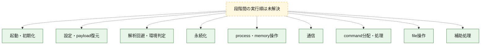

# 全体ロジック：a0aaa48a09b7de1757174e1d71f2f971ebacb0b519df482fb31a490d03038941

代表関数の静的証跡から、起動・初期化、設定・payload復元、解析回避・環境判定、永続化、process・memory操作、通信、command分配・処理、file操作の処理群を確認しました。

## 読み方

- phaseの掲載順は解析上の整理順です。observed_call_edgesがない段階間の実行順を断定しません。
- 図の実線は静的に観測した関係、点線と黄色のノードは未観測・未解決の関係を示します。
- 図は静的な要約であり、動的実行を再現するものではありません。
- 詳細な関数解説とfingerprintは[STATIC-LOGIC.md](STATIC-LOGIC.md)を参照してください。

## 静的可視化

### 実行フロー

### 感染チェーン

```mermaid
flowchart TD
  chain_initial["初期侵入・配布経路は未観測"]
  chain_01["提出検体 / sha256:a0aaa48a09b7….exe / pe"]
  chain_02["静的復元層 1 / sha256:a0aaa48a09b7….exe::embedded-pe / pe"]
  chain_03["静的復元層 1 / sha256:a0aaa48a09b7….exe::embedded-pe / pe"]
  chain_04["静的復元層 1 / sha256:a0aaa48a09b7….exe::embedded-pe / pe"]
  chain_05["静的復元層 1 / sha256:a0aaa48a09b7….exe::embedded-pe / pe"]
  chain_06["静的復元層 1 / sha256:a0aaa48a09b7….exe::embedded-pe / pe"]
  chain_07["静的復元層 1 / sha256:a0aaa48a09b7….exe::embedded-pe / pe"]
  chain_08["静的復元層 1 / sha256:a0aaa48a09b7….exe::pe-resource-pe / pe"]
  chain_09["静的復元層 1 / sha256:a0aaa48a09b7….exe::pe-resource-pe / pe"]
  chain_10["静的復元層 1 / sha256:a0aaa48a09b7….exe::pe-resource-pe / pe"]
  chain_01 -->|embedded-pe| chain_02
  chain_01 -->|embedded-pe| chain_03
  chain_01 -->|embedded-pe| chain_04
  chain_01 -->|embedded-pe| chain_05
  chain_01 -->|embedded-pe| chain_06
  chain_01 -->|embedded-pe| chain_07
  chain_01 -->|pe-resource-pe| chain_08
  chain_01 -->|pe-resource-pe| chain_09
  chain_01 -->|pe-resource-pe| chain_10
  chain_initial -.-> chain_01
  chain_unknown["後続stageは未解決"]
  chain_02 -.-> chain_unknown
  chain_03 -.-> chain_unknown
  chain_04 -.-> chain_unknown
  chain_05 -.-> chain_unknown
  chain_06 -.-> chain_unknown
  chain_07 -.-> chain_unknown
  chain_08 -.-> chain_unknown
  chain_09 -.-> chain_unknown
  chain_10 -.-> chain_unknown
  class chain_unknown unresolved
  class chain_01,chain_02,chain_03,chain_04,chain_05,chain_06,chain_07,chain_08,chain_09,chain_10 confirmed
  class chain_initial unresolved
  classDef confirmed fill:#e8f5e9,stroke:#2e7d32,color:#1b1b1b
  classDef unresolved fill:#fff8e1,stroke:#f9a825,color:#1b1b1b,stroke-dasharray:5 5
```

### モジュール関係

```mermaid
flowchart TD
  module_scope["解析対象のprogram構造"]
  module_01["sha256:ad6062215032… / x86 / statically_recovered_program"]
  module_02["sha256:8a55c15cc76e… / x86 / statically_recovered_program"]
  module_03["sha256:545bd806e223… / x86 / statically_recovered_program"]
  module_04["sha256:289a4eea79ba… / x86 / statically_recovered_program"]
  module_05["sha256:808c61a09e22… / x86 / statically_recovered_program"]
  module_06["sha256:9342c7be8036… / x86 / statically_recovered_program"]
  module_07["sha256:e4b29e87ae28… / x86 / statically_recovered_program"]
  module_08["sha256:619de6b81b80… / x86 / statically_recovered_program"]
  module_09["sha256:001f46a4c1ef… / x86 / statically_recovered_program"]
  module_10["sha256:a0aaa48a09b7… / x86 / root_program"]
  module_10 -->|静的復元| module_01
  module_10 -->|静的復元| module_02
  module_10 -->|静的復元| module_03
  module_10 -->|静的復元| module_04
  module_10 -->|静的復元| module_05
  module_10 -->|静的復元| module_06
  module_10 -->|静的復元| module_07
  module_10 -->|静的復元| module_08
  module_10 -->|静的復元| module_09
  module_scope --> module_10
  class module_scope confirmed
  class module_01,module_02,module_03,module_04,module_05,module_06,module_07,module_08,module_09,module_10 confirmed
  classDef confirmed fill:#e8f5e9,stroke:#2e7d32,color:#1b1b1b
  classDef unresolved fill:#fff8e1,stroke:#f9a825,color:#1b1b1b,stroke-dasharray:5 5
```

## 処理段階

### 1. 起動・初期化

entry pointから初期化と後続処理への移行を確認します。
確度: `confirmed_static_function_evidence`

- `8a55c15cc76e31042e17458c479772aa95bc1b908016c85b1dc8b8e3eff23254:ghidra:180007e50` — 初期化と主要処理への分岐を行う入口関数です。 状態: `succeeded`、選定理由: `entry_point`, `meaningful_symbol_name`, `reviewed_call_centrality:4`, `role:entrypoint`
- `808c61a09e220c361cff01e76c30f269e6c037c85069e0811662fd86c137874a:ghidra:1800380f8` — 初期化と主要処理への分岐を行う入口関数です。 状態: `succeeded`、選定理由: `entry_point`, `meaningful_symbol_name`, `reviewed_call_centrality:4`, `role:entrypoint`
- `e4b29e87ae288199964726c10ea221827cfde794c2aee17f71f4561cd09bf472:ghidra:180036be8` — 初期化と主要処理への分岐を行う入口関数です。 状態: `succeeded`、選定理由: `entry_point`, `meaningful_symbol_name`, `reviewed_call_centrality:4`, `role:entrypoint`
- `619de6b81b8055ee249b00df1150da82c2e97e6c54f3f4686f483ff8718a59f6:cil:0x060011bc` — 初期化と主要処理への分岐を行う入口関数です。 状態: `succeeded`、選定理由: `entry_point`, `reviewed_call_centrality:2`

### 2. 設定・payload復元

設定、resource、payload、暗号化データの復元・変換を確認します。
確度: `confirmed_static_function_evidence`

- `545bd806e223163ad469c7c0f41182447ad309d103071476294ae9f283fe492a:cil:0x06000267` — 設定、resource、payloadなどの解析・変換を行う関数です。 状態: `succeeded`、選定理由: `large_function:instructions=104`, `reviewed_call_centrality:20`, `role:config_or_data_transform`
- `545bd806e223163ad469c7c0f41182447ad309d103071476294ae9f283fe492a:cil:0x06000286` — 暗号、hash、encoding、または復号処理に関係する関数です。 状態: `succeeded`、選定理由: `role:cryptographic_transform`
- `e4b29e87ae288199964726c10ea221827cfde794c2aee17f71f4561cd09bf472:ghidra:180007b50` — 設定、resource、payloadなどの解析・変換を行う関数です。 状態: `succeeded`、選定理由: `entry_point`, `meaningful_symbol_name`, `reviewed_call_centrality:1`, `role:config_or_data_transform`
- `619de6b81b8055ee249b00df1150da82c2e97e6c54f3f4686f483ff8718a59f6:cil:0x06000e03` — 設定、resource、payloadなどの解析・変換を行う関数です。 状態: `succeeded`、選定理由: `reviewed_call_centrality:22`, `role:config_or_data_transform`
- `619de6b81b8055ee249b00df1150da82c2e97e6c54f3f4686f483ff8718a59f6:cil:0x06001111` — 暗号、hash、encoding、または復号処理に関係する関数です。 状態: `succeeded`、選定理由: `large_function:instructions=94`, `reviewed_call_centrality:26`, `role:cryptographic_transform`
- `001f46a4c1ef3f09e0842acd0dc8975424dc01b87736b1176e785ac9721e0c08:cil:0x060002ee` — 暗号、hash、encoding、または復号処理に関係する関数です。 状態: `succeeded`、選定理由: `reviewed_call_centrality:6`, `role:cryptographic_transform`
- `001f46a4c1ef3f09e0842acd0dc8975424dc01b87736b1176e785ac9721e0c08:cil:0x06000300` — 設定、resource、payloadなどの解析・変換を行う関数です。 状態: `succeeded`、選定理由: `reviewed_call_centrality:18`, `role:config_or_data_transform`

### 3. 解析回避・環境判定

debugger、sandbox、仮想環境、時間差などの判定を確認します。
確度: `confirmed_static_function_evidence`

- `808c61a09e220c361cff01e76c30f269e6c037c85069e0811662fd86c137874a:ghidra:1800055e0` — debugger、仮想環境、sandbox、または時間差の確認に関係する関数です。 状態: `succeeded`、選定理由: `context_representative`, `reviewed_call_centrality:5`, `role:anti_analysis`

### 4. 永続化

自動起動や永続化に関係する設定変更を確認します。
確度: `confirmed_static_function_evidence`

- `545bd806e223163ad469c7c0f41182447ad309d103071476294ae9f283fe492a:cil:0x06000005` — 自動起動または永続化に関係する処理を含む関数です。 状態: `succeeded`、選定理由: `reviewed_call_centrality:2`, `role:persistence`
- `619de6b81b8055ee249b00df1150da82c2e97e6c54f3f4686f483ff8718a59f6:cil:0x06000022` — 自動起動または永続化に関係する処理を含む関数です。 状態: `succeeded`、選定理由: `reviewed_call_centrality:2`, `role:persistence`
- `001f46a4c1ef3f09e0842acd0dc8975424dc01b87736b1176e785ac9721e0c08:cil:0x06000002` — 自動起動または永続化に関係する処理を含む関数です。 状態: `succeeded`、選定理由: `reviewed_call_centrality:2`, `role:persistence`

### 5. process・memory操作

process、thread、module、memory操作と実行移行を確認します。
確度: `confirmed_static_function_evidence`

- `545bd806e223163ad469c7c0f41182447ad309d103071476294ae9f283fe492a:cil:0x0600029f` — process、thread、module、またはmemory操作に関係する関数です。 状態: `succeeded`、選定理由: `reviewed_call_centrality:6`, `role:process_or_memory_operation`
- `619de6b81b8055ee249b00df1150da82c2e97e6c54f3f4686f483ff8718a59f6:cil:0x06000142` — process、thread、module、またはmemory操作に関係する関数です。 状態: `succeeded`、選定理由: `large_function:instructions=71`, `reviewed_call_centrality:30`, `role:process_or_memory_operation`
- `001f46a4c1ef3f09e0842acd0dc8975424dc01b87736b1176e785ac9721e0c08:cil:0x06000326` — process、thread、module、またはmemory操作に関係する関数です。 状態: `succeeded`、選定理由: `reviewed_call_centrality:16`, `role:process_or_memory_operation`

### 6. 通信

通信初期化、endpoint処理、送受信の役割を確認します。
確度: `confirmed_static_function_evidence`

- `545bd806e223163ad469c7c0f41182447ad309d103071476294ae9f283fe492a:cil:0x0600006b` — 通信初期化、送受信、またはendpoint処理に関係する関数です。 状態: `succeeded`、選定理由: `large_function:instructions=81`, `reviewed_call_centrality:26`, `role:network_communication`
- `545bd806e223163ad469c7c0f41182447ad309d103071476294ae9f283fe492a:cil:0x06000071` — 通信初期化、送受信、またはendpoint処理に関係する関数です。 状態: `succeeded`、選定理由: `large_function:instructions=204`, `reviewed_call_centrality:26`, `role:network_communication`
- `545bd806e223163ad469c7c0f41182447ad309d103071476294ae9f283fe492a:cil:0x06000072` — 通信初期化、送受信、またはendpoint処理に関係する関数です。 状態: `succeeded`、選定理由: `large_function:instructions=225`, `reviewed_call_centrality:22`, `role:network_communication`
- `545bd806e223163ad469c7c0f41182447ad309d103071476294ae9f283fe492a:cil:0x06000073` — 通信初期化、送受信、またはendpoint処理に関係する関数です。 状態: `succeeded`、選定理由: `large_function:instructions=193`, `reviewed_call_centrality:26`, `role:network_communication`
- `545bd806e223163ad469c7c0f41182447ad309d103071476294ae9f283fe492a:cil:0x06000079` — 通信初期化、送受信、またはendpoint処理に関係する関数です。 状態: `succeeded`、選定理由: `large_function:instructions=126`, `reviewed_call_centrality:42`, `role:network_communication`
- `545bd806e223163ad469c7c0f41182447ad309d103071476294ae9f283fe492a:cil:0x0600007b` — 通信初期化、送受信、またはendpoint処理に関係する関数です。 状態: `succeeded`、選定理由: `large_function:instructions=310`, `reviewed_call_centrality:62`, `role:network_communication`
- `545bd806e223163ad469c7c0f41182447ad309d103071476294ae9f283fe492a:cil:0x06000082` — 通信初期化、送受信、またはendpoint処理に関係する関数です。 状態: `succeeded`、選定理由: `large_function:instructions=72`, `reviewed_call_centrality:30`, `role:network_communication`
- `545bd806e223163ad469c7c0f41182447ad309d103071476294ae9f283fe492a:cil:0x0600009c` — 通信初期化、送受信、またはendpoint処理に関係する関数です。 状態: `succeeded`、選定理由: `large_function:instructions=477`, `reviewed_call_centrality:38`, `role:network_communication`
- `545bd806e223163ad469c7c0f41182447ad309d103071476294ae9f283fe492a:cil:0x060000be` — 通信初期化、送受信、またはendpoint処理に関係する関数です。 状態: `succeeded`、選定理由: `large_function:instructions=484`, `reviewed_call_centrality:66`, `role:network_communication`
- `545bd806e223163ad469c7c0f41182447ad309d103071476294ae9f283fe492a:cil:0x060000dd` — 通信初期化、送受信、またはendpoint処理に関係する関数です。 状態: `succeeded`、選定理由: `large_function:instructions=67`, `reviewed_call_centrality:28`, `role:network_communication`
- `545bd806e223163ad469c7c0f41182447ad309d103071476294ae9f283fe492a:cil:0x06000134` — 通信初期化、送受信、またはendpoint処理に関係する関数です。 状態: `succeeded`、選定理由: `large_function:instructions=65`, `reviewed_call_centrality:30`, `role:network_communication`
- `545bd806e223163ad469c7c0f41182447ad309d103071476294ae9f283fe492a:cil:0x0600013b` — 通信初期化、送受信、またはendpoint処理に関係する関数です。 状態: `succeeded`、選定理由: `large_function:instructions=69`, `reviewed_call_centrality:30`, `role:network_communication`
- `545bd806e223163ad469c7c0f41182447ad309d103071476294ae9f283fe492a:cil:0x0600013d` — 通信初期化、送受信、またはendpoint処理に関係する関数です。 状態: `succeeded`、選定理由: `large_function:instructions=143`, `reviewed_call_centrality:40`, `role:network_communication`
- `545bd806e223163ad469c7c0f41182447ad309d103071476294ae9f283fe492a:cil:0x06000157` — 通信初期化、送受信、またはendpoint処理に関係する関数です。 状態: `succeeded`、選定理由: `large_function:instructions=146`, `reviewed_call_centrality:40`, `role:network_communication`
- `545bd806e223163ad469c7c0f41182447ad309d103071476294ae9f283fe492a:cil:0x0600015d` — 通信初期化、送受信、またはendpoint処理に関係する関数です。 状態: `succeeded`、選定理由: `large_function:instructions=179`, `reviewed_call_centrality:48`, `role:network_communication`
- `545bd806e223163ad469c7c0f41182447ad309d103071476294ae9f283fe492a:cil:0x06000162` — 通信初期化、送受信、またはendpoint処理に関係する関数です。 状態: `succeeded`、選定理由: `large_function:instructions=169`, `reviewed_call_centrality:40`, `role:network_communication`
- `545bd806e223163ad469c7c0f41182447ad309d103071476294ae9f283fe492a:cil:0x06000167` — 通信初期化、送受信、またはendpoint処理に関係する関数です。 状態: `succeeded`、選定理由: `large_function:instructions=413`, `reviewed_call_centrality:54`, `role:network_communication`
- `545bd806e223163ad469c7c0f41182447ad309d103071476294ae9f283fe492a:cil:0x06000168` — 通信初期化、送受信、またはendpoint処理に関係する関数です。 状態: `succeeded`、選定理由: `large_function:instructions=116`, `reviewed_call_centrality:26`, `role:network_communication`
- `545bd806e223163ad469c7c0f41182447ad309d103071476294ae9f283fe492a:cil:0x0600016a` — 通信初期化、送受信、またはendpoint処理に関係する関数です。 状態: `succeeded`、選定理由: `large_function:instructions=171`, `reviewed_call_centrality:30`, `role:network_communication`
- `545bd806e223163ad469c7c0f41182447ad309d103071476294ae9f283fe492a:cil:0x0600016b` — 通信初期化、送受信、またはendpoint処理に関係する関数です。 状態: `succeeded`、選定理由: `large_function:instructions=99`, `reviewed_call_centrality:26`, `role:network_communication`
- `545bd806e223163ad469c7c0f41182447ad309d103071476294ae9f283fe492a:cil:0x0600016c` — 通信初期化、送受信、またはendpoint処理に関係する関数です。 状態: `succeeded`、選定理由: `large_function:instructions=106`, `reviewed_call_centrality:34`, `role:network_communication`
- `545bd806e223163ad469c7c0f41182447ad309d103071476294ae9f283fe492a:cil:0x0600017a` — 通信初期化、送受信、またはendpoint処理に関係する関数です。 状態: `succeeded`、選定理由: `large_function:instructions=100`, `reviewed_call_centrality:36`, `role:network_communication`
- `545bd806e223163ad469c7c0f41182447ad309d103071476294ae9f283fe492a:cil:0x0600017c` — 通信初期化、送受信、またはendpoint処理に関係する関数です。 状態: `succeeded`、選定理由: `large_function:instructions=78`, `reviewed_call_centrality:28`, `role:network_communication`
- `545bd806e223163ad469c7c0f41182447ad309d103071476294ae9f283fe492a:cil:0x0600017d` — 通信初期化、送受信、またはendpoint処理に関係する関数です。 状態: `succeeded`、選定理由: `large_function:instructions=159`, `reviewed_call_centrality:42`, `role:network_communication`
- `545bd806e223163ad469c7c0f41182447ad309d103071476294ae9f283fe492a:cil:0x0600017f` — 通信初期化、送受信、またはendpoint処理に関係する関数です。 状態: `succeeded`、選定理由: `large_function:instructions=442`, `reviewed_call_centrality:54`, `role:network_communication`
- `545bd806e223163ad469c7c0f41182447ad309d103071476294ae9f283fe492a:cil:0x0600019a` — 通信初期化、送受信、またはendpoint処理に関係する関数です。 状態: `succeeded`、選定理由: `large_function:instructions=75`, `reviewed_call_centrality:36`, `role:network_communication`
- `619de6b81b8055ee249b00df1150da82c2e97e6c54f3f4686f483ff8718a59f6:cil:0x0600025a` — 通信初期化、送受信、またはendpoint処理に関係する関数です。 状態: `succeeded`、選定理由: `large_function:instructions=140`, `reviewed_call_centrality:48`, `role:network_communication`
- `619de6b81b8055ee249b00df1150da82c2e97e6c54f3f4686f483ff8718a59f6:cil:0x0600025d` — 通信初期化、送受信、またはendpoint処理に関係する関数です。 状態: `succeeded`、選定理由: `large_function:instructions=170`, `reviewed_call_centrality:42`, `role:network_communication`
- `619de6b81b8055ee249b00df1150da82c2e97e6c54f3f4686f483ff8718a59f6:cil:0x06000266` — 通信初期化、送受信、またはendpoint処理に関係する関数です。 状態: `succeeded`、選定理由: `large_function:instructions=81`, `reviewed_call_centrality:46`, `role:network_communication`
- `619de6b81b8055ee249b00df1150da82c2e97e6c54f3f4686f483ff8718a59f6:cil:0x0600042c` — 通信初期化、送受信、またはendpoint処理に関係する関数です。 状態: `succeeded`、選定理由: `large_function:instructions=74`, `reviewed_call_centrality:28`, `role:network_communication`
- `619de6b81b8055ee249b00df1150da82c2e97e6c54f3f4686f483ff8718a59f6:cil:0x0600051e` — 通信初期化、送受信、またはendpoint処理に関係する関数です。 状態: `succeeded`、選定理由: `large_function:instructions=64`, `reviewed_call_centrality:32`, `role:network_communication`
- `619de6b81b8055ee249b00df1150da82c2e97e6c54f3f4686f483ff8718a59f6:cil:0x06000568` — 通信初期化、送受信、またはendpoint処理に関係する関数です。 状態: `succeeded`、選定理由: `large_function:instructions=97`, `reviewed_call_centrality:28`, `role:network_communication`
- `619de6b81b8055ee249b00df1150da82c2e97e6c54f3f4686f483ff8718a59f6:cil:0x060005e8` — 通信初期化、送受信、またはendpoint処理に関係する関数です。 状態: `succeeded`、選定理由: `large_function:instructions=308`, `reviewed_call_centrality:22`, `role:network_communication`
- `619de6b81b8055ee249b00df1150da82c2e97e6c54f3f4686f483ff8718a59f6:cil:0x060006d5` — 通信初期化、送受信、またはendpoint処理に関係する関数です。 状態: `succeeded`、選定理由: `large_function:instructions=81`, `reviewed_call_centrality:36`, `role:network_communication`
- `619de6b81b8055ee249b00df1150da82c2e97e6c54f3f4686f483ff8718a59f6:cil:0x06000779` — 通信初期化、送受信、またはendpoint処理に関係する関数です。 状態: `succeeded`、選定理由: `large_function:instructions=110`, `reviewed_call_centrality:28`, `role:network_communication`
- `619de6b81b8055ee249b00df1150da82c2e97e6c54f3f4686f483ff8718a59f6:cil:0x06000991` — 通信初期化、送受信、またはendpoint処理に関係する関数です。 状態: `succeeded`、選定理由: `large_function:instructions=152`, `reviewed_call_centrality:36`, `role:network_communication`
- `619de6b81b8055ee249b00df1150da82c2e97e6c54f3f4686f483ff8718a59f6:cil:0x060009d8` — 通信初期化、送受信、またはendpoint処理に関係する関数です。 状態: `succeeded`、選定理由: `large_function:instructions=328`, `reviewed_call_centrality:76`, `role:network_communication`
- `619de6b81b8055ee249b00df1150da82c2e97e6c54f3f4686f483ff8718a59f6:cil:0x06000a1f` — 通信初期化、送受信、またはendpoint処理に関係する関数です。 状態: `succeeded`、選定理由: `large_function:instructions=221`, `reviewed_call_centrality:56`, `role:network_communication`
- `619de6b81b8055ee249b00df1150da82c2e97e6c54f3f4686f483ff8718a59f6:cil:0x06000b27` — 通信初期化、送受信、またはendpoint処理に関係する関数です。 状態: `succeeded`、選定理由: `reviewed_call_centrality:32`, `role:network_communication`
- `619de6b81b8055ee249b00df1150da82c2e97e6c54f3f4686f483ff8718a59f6:cil:0x06000b51` — 通信初期化、送受信、またはendpoint処理に関係する関数です。 状態: `succeeded`、選定理由: `reviewed_call_centrality:34`, `role:network_communication`
- `619de6b81b8055ee249b00df1150da82c2e97e6c54f3f4686f483ff8718a59f6:cil:0x06000b58` — 通信初期化、送受信、またはendpoint処理に関係する関数です。 状態: `succeeded`、選定理由: `large_function:instructions=216`, `reviewed_call_centrality:88`, `role:network_communication`
- `619de6b81b8055ee249b00df1150da82c2e97e6c54f3f4686f483ff8718a59f6:cil:0x06000b5e` — 通信初期化、送受信、またはendpoint処理に関係する関数です。 状態: `succeeded`、選定理由: `large_function:instructions=76`, `reviewed_call_centrality:34`, `role:network_communication`
- `619de6b81b8055ee249b00df1150da82c2e97e6c54f3f4686f483ff8718a59f6:cil:0x06000b69` — 通信初期化、送受信、またはendpoint処理に関係する関数です。 状態: `succeeded`、選定理由: `large_function:instructions=75`, `reviewed_call_centrality:34`, `role:network_communication`
- `619de6b81b8055ee249b00df1150da82c2e97e6c54f3f4686f483ff8718a59f6:cil:0x06000ba9` — 通信初期化、送受信、またはendpoint処理に関係する関数です。 状態: `succeeded`、選定理由: `large_function:instructions=72`, `reviewed_call_centrality:30`, `role:network_communication`
- `619de6b81b8055ee249b00df1150da82c2e97e6c54f3f4686f483ff8718a59f6:cil:0x06000c1c` — 通信初期化、送受信、またはendpoint処理に関係する関数です。 状態: `succeeded`、選定理由: `large_function:instructions=151`, `reviewed_call_centrality:40`, `role:network_communication`
- `619de6b81b8055ee249b00df1150da82c2e97e6c54f3f4686f483ff8718a59f6:cil:0x06000c1f` — 通信初期化、送受信、またはendpoint処理に関係する関数です。 状態: `succeeded`、選定理由: `large_function:instructions=133`, `reviewed_call_centrality:32`, `role:network_communication`
- `619de6b81b8055ee249b00df1150da82c2e97e6c54f3f4686f483ff8718a59f6:cil:0x06000c71` — 通信初期化、送受信、またはendpoint処理に関係する関数です。 状態: `succeeded`、選定理由: `reviewed_call_centrality:34`, `role:network_communication`
- `619de6b81b8055ee249b00df1150da82c2e97e6c54f3f4686f483ff8718a59f6:cil:0x06000c7c` — 通信初期化、送受信、またはendpoint処理に関係する関数です。 状態: `succeeded`、選定理由: `large_function:instructions=136`, `reviewed_call_centrality:38`, `role:network_communication`
- `001f46a4c1ef3f09e0842acd0dc8975424dc01b87736b1176e785ac9721e0c08:cil:0x0600001c` — 通信初期化、送受信、またはendpoint処理に関係する関数です。 状態: `succeeded`、選定理由: `reviewed_call_centrality:28`, `role:network_communication`
- `001f46a4c1ef3f09e0842acd0dc8975424dc01b87736b1176e785ac9721e0c08:cil:0x06000055` — 通信初期化、送受信、またはendpoint処理に関係する関数です。 状態: `succeeded`、選定理由: `large_function:instructions=132`, `reviewed_call_centrality:30`, `role:network_communication`
- `001f46a4c1ef3f09e0842acd0dc8975424dc01b87736b1176e785ac9721e0c08:cil:0x0600005f` — 通信初期化、送受信、またはendpoint処理に関係する関数です。 状態: `succeeded`、選定理由: `large_function:instructions=85`, `reviewed_call_centrality:50`, `role:network_communication`
- `001f46a4c1ef3f09e0842acd0dc8975424dc01b87736b1176e785ac9721e0c08:cil:0x06000060` — 通信初期化、送受信、またはendpoint処理に関係する関数です。 状態: `succeeded`、選定理由: `large_function:instructions=119`, `reviewed_call_centrality:50`, `role:network_communication`
- `001f46a4c1ef3f09e0842acd0dc8975424dc01b87736b1176e785ac9721e0c08:cil:0x06000071` — 通信初期化、送受信、またはendpoint処理に関係する関数です。 状態: `succeeded`、選定理由: `large_function:instructions=138`, `reviewed_call_centrality:56`, `role:network_communication`
- `001f46a4c1ef3f09e0842acd0dc8975424dc01b87736b1176e785ac9721e0c08:cil:0x0600007a` — 通信初期化、送受信、またはendpoint処理に関係する関数です。 状態: `succeeded`、選定理由: `large_function:instructions=218`, `reviewed_call_centrality:52`, `role:network_communication`
- `001f46a4c1ef3f09e0842acd0dc8975424dc01b87736b1176e785ac9721e0c08:cil:0x06000080` — 通信初期化、送受信、またはendpoint処理に関係する関数です。 状態: `succeeded`、選定理由: `large_function:instructions=623`, `reviewed_call_centrality:88`, `role:network_communication`
- `001f46a4c1ef3f09e0842acd0dc8975424dc01b87736b1176e785ac9721e0c08:cil:0x06000081` — 通信初期化、送受信、またはendpoint処理に関係する関数です。 状態: `succeeded`、選定理由: `large_function:instructions=105`, `reviewed_call_centrality:54`, `role:network_communication`
- `001f46a4c1ef3f09e0842acd0dc8975424dc01b87736b1176e785ac9721e0c08:cil:0x06000094` — 通信初期化、送受信、またはendpoint処理に関係する関数です。 状態: `succeeded`、選定理由: `large_function:instructions=144`, `reviewed_call_centrality:42`, `role:network_communication`
- `001f46a4c1ef3f09e0842acd0dc8975424dc01b87736b1176e785ac9721e0c08:cil:0x0600009e` — 通信初期化、送受信、またはendpoint処理に関係する関数です。 状態: `succeeded`、選定理由: `reviewed_call_centrality:28`, `role:network_communication`
- `001f46a4c1ef3f09e0842acd0dc8975424dc01b87736b1176e785ac9721e0c08:cil:0x060000a1` — 通信初期化、送受信、またはendpoint処理に関係する関数です。 状態: `succeeded`、選定理由: `large_function:instructions=117`, `reviewed_call_centrality:42`, `role:network_communication`
- `001f46a4c1ef3f09e0842acd0dc8975424dc01b87736b1176e785ac9721e0c08:cil:0x060000a8` — 通信初期化、送受信、またはendpoint処理に関係する関数です。 状態: `succeeded`、選定理由: `large_function:instructions=85`, `reviewed_call_centrality:28`, `role:network_communication`
- `001f46a4c1ef3f09e0842acd0dc8975424dc01b87736b1176e785ac9721e0c08:cil:0x060000b2` — 通信初期化、送受信、またはendpoint処理に関係する関数です。 状態: `succeeded`、選定理由: `reviewed_call_centrality:26`, `role:network_communication`
- `001f46a4c1ef3f09e0842acd0dc8975424dc01b87736b1176e785ac9721e0c08:cil:0x060000b7` — 通信初期化、送受信、またはendpoint処理に関係する関数です。 状態: `succeeded`、選定理由: `reviewed_call_centrality:26`, `role:network_communication`
- `001f46a4c1ef3f09e0842acd0dc8975424dc01b87736b1176e785ac9721e0c08:cil:0x060000c0` — 通信初期化、送受信、またはendpoint処理に関係する関数です。 状態: `succeeded`、選定理由: `large_function:instructions=237`, `reviewed_call_centrality:104`, `role:network_communication`
- `001f46a4c1ef3f09e0842acd0dc8975424dc01b87736b1176e785ac9721e0c08:cil:0x060000c1` — 通信初期化、送受信、またはendpoint処理に関係する関数です。 状態: `succeeded`、選定理由: `large_function:instructions=104`, `reviewed_call_centrality:30`, `role:network_communication`
- `001f46a4c1ef3f09e0842acd0dc8975424dc01b87736b1176e785ac9721e0c08:cil:0x060000c4` — 通信初期化、送受信、またはendpoint処理に関係する関数です。 状態: `succeeded`、選定理由: `reviewed_call_centrality:34`, `role:network_communication`
- `001f46a4c1ef3f09e0842acd0dc8975424dc01b87736b1176e785ac9721e0c08:cil:0x060000da` — 通信初期化、送受信、またはendpoint処理に関係する関数です。 状態: `succeeded`、選定理由: `large_function:instructions=93`, `reviewed_call_centrality:32`, `role:network_communication`
- `001f46a4c1ef3f09e0842acd0dc8975424dc01b87736b1176e785ac9721e0c08:cil:0x060000dd` — 通信初期化、送受信、またはendpoint処理に関係する関数です。 状態: `succeeded`、選定理由: `large_function:instructions=131`, `reviewed_call_centrality:32`, `role:network_communication`
- `001f46a4c1ef3f09e0842acd0dc8975424dc01b87736b1176e785ac9721e0c08:cil:0x060000eb` — 通信初期化、送受信、またはendpoint処理に関係する関数です。 状態: `succeeded`、選定理由: `large_function:instructions=88`, `reviewed_call_centrality:44`, `role:network_communication`
- `001f46a4c1ef3f09e0842acd0dc8975424dc01b87736b1176e785ac9721e0c08:cil:0x06000145` — 通信初期化、送受信、またはendpoint処理に関係する関数です。 状態: `succeeded`、選定理由: `large_function:instructions=220`, `reviewed_call_centrality:50`, `role:network_communication`
- `001f46a4c1ef3f09e0842acd0dc8975424dc01b87736b1176e785ac9721e0c08:cil:0x060002fd` — 通信初期化、送受信、またはendpoint処理に関係する関数です。 状態: `succeeded`、選定理由: `reviewed_call_centrality:28`, `role:network_communication`
- `001f46a4c1ef3f09e0842acd0dc8975424dc01b87736b1176e785ac9721e0c08:cil:0x0600030b` — 通信初期化、送受信、またはendpoint処理に関係する関数です。 状態: `succeeded`、選定理由: `reviewed_call_centrality:36`, `role:network_communication`
- `001f46a4c1ef3f09e0842acd0dc8975424dc01b87736b1176e785ac9721e0c08:cil:0x06000327` — 通信初期化、送受信、またはendpoint処理に関係する関数です。 状態: `succeeded`、選定理由: `large_function:instructions=74`, `reviewed_call_centrality:28`, `role:network_communication`
- `001f46a4c1ef3f09e0842acd0dc8975424dc01b87736b1176e785ac9721e0c08:cil:0x0600046d` — 通信初期化、送受信、またはendpoint処理に関係する関数です。 状態: `succeeded`、選定理由: `large_function:instructions=145`, `reviewed_call_centrality:24`, `role:network_communication`

### 7. command分配・処理

受信commandやtaskの解釈、分配、個別handlerへの移行を確認します。
確度: `confirmed_static_function_evidence_with_limits`

- `808c61a09e220c361cff01e76c30f269e6c037c85069e0811662fd86c137874a:ghidra:1800429a0` — commandの解釈、分配、または個別処理を担当する関数です。 状態: `limited_bad_instruction_or_flow`、選定理由: `meaningful_symbol_name`, `role:command_dispatch_or_handler`
- `619de6b81b8055ee249b00df1150da82c2e97e6c54f3f4686f483ff8718a59f6:cil:0x060011bb` — commandの解釈、分配、または個別処理を担当する関数です。 状態: `succeeded`、選定理由: `reviewed_call_centrality:4`, `role:command_dispatch_or_handler`
- `001f46a4c1ef3f09e0842acd0dc8975424dc01b87736b1176e785ac9721e0c08:cil:0x06000359` — commandの解釈、分配、または個別処理を担当する関数です。 状態: `succeeded`、選定理由: `large_function:instructions=145`, `reviewed_call_centrality:22`, `role:command_dispatch_or_handler`

### 8. file操作

fileやdirectoryの作成、読書き、削除を確認します。
確度: `confirmed_static_function_evidence`

- `545bd806e223163ad469c7c0f41182447ad309d103071476294ae9f283fe492a:cil:0x060002e3` — fileまたはdirectoryの読書き・管理に関係する関数です。 状態: `succeeded`、選定理由: `reviewed_call_centrality:24`, `role:file_operation`
- `808c61a09e220c361cff01e76c30f269e6c037c85069e0811662fd86c137874a:ghidra:180006e20` — fileまたはdirectoryの読書き・管理に関係する関数です。 状態: `succeeded`、選定理由: `entry_point`, `meaningful_symbol_name`, `reviewed_call_centrality:2`, `role:file_operation`
- `808c61a09e220c361cff01e76c30f269e6c037c85069e0811662fd86c137874a:ghidra:180006eb0` — fileまたはdirectoryの読書き・管理に関係する関数です。 状態: `succeeded`、選定理由: `entry_point`, `meaningful_symbol_name`, `reviewed_call_centrality:1`, `role:file_operation`
- `808c61a09e220c361cff01e76c30f269e6c037c85069e0811662fd86c137874a:ghidra:180006fb0` — fileまたはdirectoryの読書き・管理に関係する関数です。 状態: `succeeded`、選定理由: `entry_point`, `meaningful_symbol_name`, `reviewed_call_centrality:9`, `role:file_operation`
- `808c61a09e220c361cff01e76c30f269e6c037c85069e0811662fd86c137874a:ghidra:180012110` — fileまたはdirectoryの読書き・管理に関係する関数です。 状態: `succeeded`、選定理由: `entry_point`, `meaningful_symbol_name`, `reviewed_call_centrality:4`, `role:file_operation`
- `619de6b81b8055ee249b00df1150da82c2e97e6c54f3f4686f483ff8718a59f6:cil:0x06000ffa` — fileまたはdirectoryの読書き・管理に関係する関数です。 状態: `succeeded`、選定理由: `large_function:instructions=98`, `reviewed_call_centrality:28`, `role:file_operation`
- `619de6b81b8055ee249b00df1150da82c2e97e6c54f3f4686f483ff8718a59f6:cil:0x060011ba` — fileまたはdirectoryの読書き・管理に関係する関数です。 状態: `succeeded`、選定理由: `large_function:instructions=107`, `reviewed_call_centrality:32`, `role:file_operation`
- `619de6b81b8055ee249b00df1150da82c2e97e6c54f3f4686f483ff8718a59f6:cil:0x060011be` — fileまたはdirectoryの読書き・管理に関係する関数です。 状態: `succeeded`、選定理由: `reviewed_call_centrality:36`, `role:file_operation`
- `001f46a4c1ef3f09e0842acd0dc8975424dc01b87736b1176e785ac9721e0c08:cil:0x06000458` — fileまたはdirectoryの読書き・管理に関係する関数です。 状態: `succeeded`、選定理由: `reviewed_call_centrality:8`, `role:file_operation`

### 9. 補助処理

主要処理を支える一般内部関数またはlibrary処理を確認します。
確度: `confirmed_static_function_evidence`

- `8a55c15cc76e31042e17458c479772aa95bc1b908016c85b1dc8b8e3eff23254:ghidra:180001000` — 検体内部の一般処理を実装する関数です。 状態: `succeeded`、選定理由: `context_representative`, `reviewed_call_centrality:6`
- `8a55c15cc76e31042e17458c479772aa95bc1b908016c85b1dc8b8e3eff23254:ghidra:180001370` — 検体内部の一般処理を実装する関数です。 状態: `succeeded`、選定理由: `context_representative`
- `8a55c15cc76e31042e17458c479772aa95bc1b908016c85b1dc8b8e3eff23254:ghidra:180001690` — 検体内部の一般処理を実装する関数です。 状態: `succeeded`、選定理由: `entry_point`, `meaningful_symbol_name`, `reviewed_call_centrality:2`
- `8a55c15cc76e31042e17458c479772aa95bc1b908016c85b1dc8b8e3eff23254:ghidra:180001920` — 検体内部の一般処理を実装する関数です。 状態: `succeeded`、選定理由: `context_representative`, `reviewed_call_centrality:4`
- `8a55c15cc76e31042e17458c479772aa95bc1b908016c85b1dc8b8e3eff23254:ghidra:1800019f0` — 検体内部の一般処理を実装する関数です。 状態: `succeeded`、選定理由: `context_representative`, `reviewed_call_centrality:3`
- `8a55c15cc76e31042e17458c479772aa95bc1b908016c85b1dc8b8e3eff23254:ghidra:180001a50` — 検体内部の一般処理を実装する関数です。 状態: `succeeded`、選定理由: `context_representative`, `reviewed_call_centrality:8`
- `8a55c15cc76e31042e17458c479772aa95bc1b908016c85b1dc8b8e3eff23254:ghidra:180001ad0` — 検体内部の一般処理を実装する関数です。 状態: `succeeded`、選定理由: `entry_point`, `meaningful_symbol_name`, `reviewed_call_centrality:9`
- `8a55c15cc76e31042e17458c479772aa95bc1b908016c85b1dc8b8e3eff23254:ghidra:180002390` — 検体内部の一般処理を実装する関数です。 状態: `succeeded`、選定理由: `entry_point`, `meaningful_symbol_name`, `reviewed_call_centrality:1`
- `8a55c15cc76e31042e17458c479772aa95bc1b908016c85b1dc8b8e3eff23254:ghidra:180002470` — 検体内部の一般処理を実装する関数です。 状態: `succeeded`、選定理由: `context_representative`, `reviewed_call_centrality:4`
- `8a55c15cc76e31042e17458c479772aa95bc1b908016c85b1dc8b8e3eff23254:ghidra:180002520` — 検体内部の一般処理を実装する関数です。 状態: `succeeded`、選定理由: `context_representative`, `reviewed_call_centrality:2`
- `8a55c15cc76e31042e17458c479772aa95bc1b908016c85b1dc8b8e3eff23254:ghidra:1800025e0` — 検体内部の一般処理を実装する関数です。 状態: `succeeded`、選定理由: `context_representative`, `reviewed_call_centrality:8`
- `8a55c15cc76e31042e17458c479772aa95bc1b908016c85b1dc8b8e3eff23254:ghidra:180002850` — 検体内部の一般処理を実装する関数です。 状態: `succeeded`、選定理由: `context_representative`, `reviewed_call_centrality:3`
- `8a55c15cc76e31042e17458c479772aa95bc1b908016c85b1dc8b8e3eff23254:ghidra:180002a60` — 検体内部の一般処理を実装する関数です。 状態: `succeeded`、選定理由: `context_representative`, `reviewed_call_centrality:4`
- `8a55c15cc76e31042e17458c479772aa95bc1b908016c85b1dc8b8e3eff23254:ghidra:180002e70` — 検体内部の一般処理を実装する関数です。 状態: `succeeded`、選定理由: `context_representative`, `reviewed_call_centrality:4`
- `8a55c15cc76e31042e17458c479772aa95bc1b908016c85b1dc8b8e3eff23254:ghidra:180003390` — 検体内部の一般処理を実装する関数です。 状態: `succeeded`、選定理由: `context_representative`, `reviewed_call_centrality:4`
- `8a55c15cc76e31042e17458c479772aa95bc1b908016c85b1dc8b8e3eff23254:ghidra:1800036e0` — 検体内部の一般処理を実装する関数です。 状態: `succeeded`、選定理由: `context_representative`, `reviewed_call_centrality:4`
- `8a55c15cc76e31042e17458c479772aa95bc1b908016c85b1dc8b8e3eff23254:ghidra:1800038b0` — 検体内部の一般処理を実装する関数です。 状態: `succeeded`、選定理由: `context_representative`, `reviewed_call_centrality:2`
- `8a55c15cc76e31042e17458c479772aa95bc1b908016c85b1dc8b8e3eff23254:ghidra:180003b10` — 検体内部の一般処理を実装する関数です。 状態: `succeeded`、選定理由: `context_representative`, `reviewed_call_centrality:2`
- `8a55c15cc76e31042e17458c479772aa95bc1b908016c85b1dc8b8e3eff23254:ghidra:180003bc0` — 検体内部の一般処理を実装する関数です。 状態: `succeeded`、選定理由: `entry_point`, `meaningful_symbol_name`, `reviewed_call_centrality:1`
- `8a55c15cc76e31042e17458c479772aa95bc1b908016c85b1dc8b8e3eff23254:ghidra:180003ce0` — 検体内部の一般処理を実装する関数です。 状態: `succeeded`、選定理由: `context_representative`, `reviewed_call_centrality:2`
- `8a55c15cc76e31042e17458c479772aa95bc1b908016c85b1dc8b8e3eff23254:ghidra:180003de0` — 検体内部の一般処理を実装する関数です。 状態: `succeeded`、選定理由: `entry_point`, `meaningful_symbol_name`, `reviewed_call_centrality:7`
- `8a55c15cc76e31042e17458c479772aa95bc1b908016c85b1dc8b8e3eff23254:ghidra:180005530` — 検体内部の一般処理を実装する関数です。 状態: `succeeded`、選定理由: `entry_point`, `meaningful_symbol_name`
- `8a55c15cc76e31042e17458c479772aa95bc1b908016c85b1dc8b8e3eff23254:ghidra:180005590` — 検体内部の一般処理を実装する関数です。 状態: `succeeded`、選定理由: `context_representative`, `reviewed_call_centrality:4`
- `8a55c15cc76e31042e17458c479772aa95bc1b908016c85b1dc8b8e3eff23254:ghidra:180005af0` — 検体内部の一般処理を実装する関数です。 状態: `succeeded`、選定理由: `context_representative`, `reviewed_call_centrality:2`
- `8a55c15cc76e31042e17458c479772aa95bc1b908016c85b1dc8b8e3eff23254:ghidra:180005be0` — 検体内部の一般処理を実装する関数です。 状態: `succeeded`、選定理由: `context_representative`, `reviewed_call_centrality:1`
- `8a55c15cc76e31042e17458c479772aa95bc1b908016c85b1dc8b8e3eff23254:ghidra:180005e00` — 検体内部の一般処理を実装する関数です。 状態: `succeeded`、選定理由: `context_representative`, `reviewed_call_centrality:1`
- `8a55c15cc76e31042e17458c479772aa95bc1b908016c85b1dc8b8e3eff23254:ghidra:180005e80` — 検体内部の一般処理を実装する関数です。 状態: `succeeded`、選定理由: `context_representative`, `reviewed_call_centrality:4`
- `8a55c15cc76e31042e17458c479772aa95bc1b908016c85b1dc8b8e3eff23254:ghidra:1800060d0` — 検体内部の一般処理を実装する関数です。 状態: `succeeded`、選定理由: `context_representative`, `reviewed_call_centrality:1`
- `8a55c15cc76e31042e17458c479772aa95bc1b908016c85b1dc8b8e3eff23254:ghidra:1800061c0` — 検体内部の一般処理を実装する関数です。 状態: `succeeded`、選定理由: `context_representative`, `reviewed_call_centrality:1`
- `8a55c15cc76e31042e17458c479772aa95bc1b908016c85b1dc8b8e3eff23254:ghidra:180006730` — 検体内部の一般処理を実装する関数です。 状態: `succeeded`、選定理由: `context_representative`, `reviewed_call_centrality:2`
- `8a55c15cc76e31042e17458c479772aa95bc1b908016c85b1dc8b8e3eff23254:ghidra:1800067c0` — 検体内部の一般処理を実装する関数です。 状態: `succeeded`、選定理由: `context_representative`, `reviewed_call_centrality:1`
- `545bd806e223163ad469c7c0f41182447ad309d103071476294ae9f283fe492a:cil:0x0600029b` — 検体内部の一般処理を実装する関数です。 状態: `succeeded`、選定理由: `large_function:instructions=103`, `reviewed_call_centrality:12`
- `289a4eea79baa4141744e44d60db713e18b5f23322663c63047962f51b467614:ghidra:1003100b` — 検体内部の一般処理を実装する関数です。 状態: `succeeded`、選定理由: `meaningful_symbol_name`, `small_program_complete_context`
- `808c61a09e220c361cff01e76c30f269e6c037c85069e0811662fd86c137874a:ghidra:180001000` — 検体内部の一般処理を実装する関数です。 状態: `succeeded`、選定理由: `context_representative`, `reviewed_call_centrality:3`
- `808c61a09e220c361cff01e76c30f269e6c037c85069e0811662fd86c137874a:ghidra:1800012f0` — 検体内部の一般処理を実装する関数です。 状態: `succeeded`、選定理由: `context_representative`, `reviewed_call_centrality:3`
- `808c61a09e220c361cff01e76c30f269e6c037c85069e0811662fd86c137874a:ghidra:1800017b0` — 検体内部の一般処理を実装する関数です。 状態: `succeeded`、選定理由: `context_representative`, `reviewed_call_centrality:2`
- `808c61a09e220c361cff01e76c30f269e6c037c85069e0811662fd86c137874a:ghidra:180001970` — 検体内部の一般処理を実装する関数です。 状態: `succeeded`、選定理由: `context_representative`, `reviewed_call_centrality:3`
- `808c61a09e220c361cff01e76c30f269e6c037c85069e0811662fd86c137874a:ghidra:1800021f0` — 検体内部の一般処理を実装する関数です。 状態: `succeeded`、選定理由: `context_representative`, `reviewed_call_centrality:4`
- `808c61a09e220c361cff01e76c30f269e6c037c85069e0811662fd86c137874a:ghidra:1800022b0` — 検体内部の一般処理を実装する関数です。 状態: `succeeded`、選定理由: `context_representative`, `reviewed_call_centrality:1`
- `808c61a09e220c361cff01e76c30f269e6c037c85069e0811662fd86c137874a:ghidra:180002330` — 検体内部の一般処理を実装する関数です。 状態: `succeeded`、選定理由: `context_representative`, `reviewed_call_centrality:1`
- `808c61a09e220c361cff01e76c30f269e6c037c85069e0811662fd86c137874a:ghidra:1800024e0` — 検体内部の一般処理を実装する関数です。 状態: `succeeded`、選定理由: `context_representative`
- `808c61a09e220c361cff01e76c30f269e6c037c85069e0811662fd86c137874a:ghidra:180002790` — 検体内部の一般処理を実装する関数です。 状態: `succeeded`、選定理由: `context_representative`, `reviewed_call_centrality:4`
- `808c61a09e220c361cff01e76c30f269e6c037c85069e0811662fd86c137874a:ghidra:180002910` — 検体内部の一般処理を実装する関数です。 状態: `succeeded`、選定理由: `context_representative`, `reviewed_call_centrality:1`
- `808c61a09e220c361cff01e76c30f269e6c037c85069e0811662fd86c137874a:ghidra:180002b70` — 検体内部の一般処理を実装する関数です。 状態: `succeeded`、選定理由: `context_representative`, `reviewed_call_centrality:4`
- `808c61a09e220c361cff01e76c30f269e6c037c85069e0811662fd86c137874a:ghidra:180003820` — 検体内部の一般処理を実装する関数です。 状態: `succeeded`、選定理由: `context_representative`, `reviewed_call_centrality:2`
- `808c61a09e220c361cff01e76c30f269e6c037c85069e0811662fd86c137874a:ghidra:1800038b0` — 検体内部の一般処理を実装する関数です。 状態: `succeeded`、選定理由: `context_representative`, `reviewed_call_centrality:3`
- `808c61a09e220c361cff01e76c30f269e6c037c85069e0811662fd86c137874a:ghidra:180003ba0` — 検体内部の一般処理を実装する関数です。 状態: `succeeded`、選定理由: `context_representative`, `reviewed_call_centrality:6`
- `808c61a09e220c361cff01e76c30f269e6c037c85069e0811662fd86c137874a:ghidra:180003ef0` — 検体内部の一般処理を実装する関数です。 状態: `succeeded`、選定理由: `context_representative`, `reviewed_call_centrality:1`
- `808c61a09e220c361cff01e76c30f269e6c037c85069e0811662fd86c137874a:ghidra:1800042a0` — 検体内部の一般処理を実装する関数です。 状態: `succeeded`、選定理由: `context_representative`, `reviewed_call_centrality:4`
- `808c61a09e220c361cff01e76c30f269e6c037c85069e0811662fd86c137874a:ghidra:180005460` — 検体内部の一般処理を実装する関数です。 状態: `succeeded`、選定理由: `context_representative`, `reviewed_call_centrality:2`
- `808c61a09e220c361cff01e76c30f269e6c037c85069e0811662fd86c137874a:ghidra:1800054f0` — 検体内部の一般処理を実装する関数です。 状態: `succeeded`、選定理由: `context_representative`, `reviewed_call_centrality:3`
- `808c61a09e220c361cff01e76c30f269e6c037c85069e0811662fd86c137874a:ghidra:180005690` — 検体内部の一般処理を実装する関数です。 状態: `succeeded`、選定理由: `context_representative`, `reviewed_call_centrality:2`
- `808c61a09e220c361cff01e76c30f269e6c037c85069e0811662fd86c137874a:ghidra:180005760` — 検体内部の一般処理を実装する関数です。 状態: `succeeded`、選定理由: `context_representative`, `reviewed_call_centrality:1`
- `808c61a09e220c361cff01e76c30f269e6c037c85069e0811662fd86c137874a:ghidra:1800057e0` — 検体内部の一般処理を実装する関数です。 状態: `succeeded`、選定理由: `context_representative`, `reviewed_call_centrality:3`
- `808c61a09e220c361cff01e76c30f269e6c037c85069e0811662fd86c137874a:ghidra:1800059c0` — 検体内部の一般処理を実装する関数です。 状態: `succeeded`、選定理由: `context_representative`, `reviewed_call_centrality:3`
- `808c61a09e220c361cff01e76c30f269e6c037c85069e0811662fd86c137874a:ghidra:180006f00` — 検体内部の一般処理を実装する関数です。 状態: `succeeded`、選定理由: `entry_point`, `meaningful_symbol_name`
- `808c61a09e220c361cff01e76c30f269e6c037c85069e0811662fd86c137874a:ghidra:18000cf60` — 検体内部の一般処理を実装する関数です。 状態: `succeeded`、選定理由: `entry_point`, `meaningful_symbol_name`, `reviewed_call_centrality:2`
- `808c61a09e220c361cff01e76c30f269e6c037c85069e0811662fd86c137874a:ghidra:180038784` — 検体内部の一般処理を実装する関数です。 状態: `succeeded`、選定理由: `meaningful_symbol_name`
- `9342c7be8036a5f8dc3895d75e3314dce961fd3bc70ee59928c67fa04f0c7e08:ghidra:10008390` — 検体内部の一般処理を実装する関数です。 状態: `succeeded`、選定理由: `meaningful_symbol_name`, `small_program_complete_context`
- `e4b29e87ae288199964726c10ea221827cfde794c2aee17f71f4561cd09bf472:ghidra:180001000` — 検体内部の一般処理を実装する関数です。 状態: `succeeded`、選定理由: `context_representative`, `reviewed_call_centrality:10`
- `e4b29e87ae288199964726c10ea221827cfde794c2aee17f71f4561cd09bf472:ghidra:1800013d0` — 検体内部の一般処理を実装する関数です。 状態: `succeeded`、選定理由: `context_representative`, `reviewed_call_centrality:1`
- `e4b29e87ae288199964726c10ea221827cfde794c2aee17f71f4561cd09bf472:ghidra:180001420` — 検体内部の一般処理を実装する関数です。 状態: `succeeded`、選定理由: `context_representative`, `reviewed_call_centrality:1`
- `e4b29e87ae288199964726c10ea221827cfde794c2aee17f71f4561cd09bf472:ghidra:1800015f0` — 検体内部の一般処理を実装する関数です。 状態: `succeeded`、選定理由: `context_representative`, `reviewed_call_centrality:3`
- `e4b29e87ae288199964726c10ea221827cfde794c2aee17f71f4561cd09bf472:ghidra:180001950` — 検体内部の一般処理を実装する関数です。 状態: `succeeded`、選定理由: `context_representative`, `reviewed_call_centrality:1`
- `e4b29e87ae288199964726c10ea221827cfde794c2aee17f71f4561cd09bf472:ghidra:180001980` — 検体内部の一般処理を実装する関数です。 状態: `succeeded`、選定理由: `context_representative`, `reviewed_call_centrality:1`
- `e4b29e87ae288199964726c10ea221827cfde794c2aee17f71f4561cd09bf472:ghidra:1800019c0` — 検体内部の一般処理を実装する関数です。 状態: `succeeded`、選定理由: `context_representative`, `reviewed_call_centrality:6`
- `e4b29e87ae288199964726c10ea221827cfde794c2aee17f71f4561cd09bf472:ghidra:180001cd0` — 検体内部の一般処理を実装する関数です。 状態: `succeeded`、選定理由: `context_representative`, `reviewed_call_centrality:1`
- `e4b29e87ae288199964726c10ea221827cfde794c2aee17f71f4561cd09bf472:ghidra:180002000` — 検体内部の一般処理を実装する関数です。 状態: `succeeded`、選定理由: `context_representative`, `reviewed_call_centrality:3`
- `e4b29e87ae288199964726c10ea221827cfde794c2aee17f71f4561cd09bf472:ghidra:1800023f0` — 検体内部の一般処理を実装する関数です。 状態: `succeeded`、選定理由: `context_representative`, `reviewed_call_centrality:2`
- `e4b29e87ae288199964726c10ea221827cfde794c2aee17f71f4561cd09bf472:ghidra:180002700` — 検体内部の一般処理を実装する関数です。 状態: `succeeded`、選定理由: `context_representative`, `reviewed_call_centrality:6`
- `e4b29e87ae288199964726c10ea221827cfde794c2aee17f71f4561cd09bf472:ghidra:180002a40` — 検体内部の一般処理を実装する関数です。 状態: `succeeded`、選定理由: `context_representative`, `reviewed_call_centrality:1`
- `e4b29e87ae288199964726c10ea221827cfde794c2aee17f71f4561cd09bf472:ghidra:180002dd0` — 検体内部の一般処理を実装する関数です。 状態: `succeeded`、選定理由: `context_representative`, `reviewed_call_centrality:4`
- `e4b29e87ae288199964726c10ea221827cfde794c2aee17f71f4561cd09bf472:ghidra:1800036d0` — 検体内部の一般処理を実装する関数です。 状態: `succeeded`、選定理由: `context_representative`, `reviewed_call_centrality:2`
- `e4b29e87ae288199964726c10ea221827cfde794c2aee17f71f4561cd09bf472:ghidra:1800037e0` — 検体内部の一般処理を実装する関数です。 状態: `succeeded`、選定理由: `context_representative`, `reviewed_call_centrality:1`
- `e4b29e87ae288199964726c10ea221827cfde794c2aee17f71f4561cd09bf472:ghidra:180003850` — 検体内部の一般処理を実装する関数です。 状態: `succeeded`、選定理由: `context_representative`, `reviewed_call_centrality:1`
- `e4b29e87ae288199964726c10ea221827cfde794c2aee17f71f4561cd09bf472:ghidra:180003a00` — 検体内部の一般処理を実装する関数です。 状態: `succeeded`、選定理由: `context_representative`, `reviewed_call_centrality:4`
- `e4b29e87ae288199964726c10ea221827cfde794c2aee17f71f4561cd09bf472:ghidra:180003b10` — 検体内部の一般処理を実装する関数です。 状態: `succeeded`、選定理由: `context_representative`, `reviewed_call_centrality:7`
- `e4b29e87ae288199964726c10ea221827cfde794c2aee17f71f4561cd09bf472:ghidra:180003cc0` — 検体内部の一般処理を実装する関数です。 状態: `succeeded`、選定理由: `context_representative`
- `e4b29e87ae288199964726c10ea221827cfde794c2aee17f71f4561cd09bf472:ghidra:180003d30` — 検体内部の一般処理を実装する関数です。 状態: `succeeded`、選定理由: `context_representative`, `reviewed_call_centrality:5`
- `e4b29e87ae288199964726c10ea221827cfde794c2aee17f71f4561cd09bf472:ghidra:180003e90` — 検体内部の一般処理を実装する関数です。 状態: `succeeded`、選定理由: `context_representative`, `reviewed_call_centrality:1`
- `e4b29e87ae288199964726c10ea221827cfde794c2aee17f71f4561cd09bf472:ghidra:180003ec0` — 検体内部の一般処理を実装する関数です。 状態: `succeeded`、選定理由: `context_representative`
- `e4b29e87ae288199964726c10ea221827cfde794c2aee17f71f4561cd09bf472:ghidra:180003ff0` — 検体内部の一般処理を実装する関数です。 状態: `succeeded`、選定理由: `context_representative`
- `e4b29e87ae288199964726c10ea221827cfde794c2aee17f71f4561cd09bf472:ghidra:180004140` — 検体内部の一般処理を実装する関数です。 状態: `succeeded`、選定理由: `context_representative`, `reviewed_call_centrality:2`
- `e4b29e87ae288199964726c10ea221827cfde794c2aee17f71f4561cd09bf472:ghidra:180004200` — 検体内部の一般処理を実装する関数です。 状態: `succeeded`、選定理由: `context_representative`, `reviewed_call_centrality:1`
- `e4b29e87ae288199964726c10ea221827cfde794c2aee17f71f4561cd09bf472:ghidra:180004430` — 検体内部の一般処理を実装する関数です。 状態: `succeeded`、選定理由: `context_representative`, `reviewed_call_centrality:1`
- `e4b29e87ae288199964726c10ea221827cfde794c2aee17f71f4561cd09bf472:ghidra:1800044a0` — 検体内部の一般処理を実装する関数です。 状態: `succeeded`、選定理由: `context_representative`, `reviewed_call_centrality:1`
- `e4b29e87ae288199964726c10ea221827cfde794c2aee17f71f4561cd09bf472:ghidra:1800045b0` — 検体内部の一般処理を実装する関数です。 状態: `succeeded`、選定理由: `context_representative`, `reviewed_call_centrality:2`
- `e4b29e87ae288199964726c10ea221827cfde794c2aee17f71f4561cd09bf472:ghidra:180009e40` — 検体内部の一般処理を実装する関数です。 状態: `succeeded`、選定理由: `meaningful_symbol_name`
- `e4b29e87ae288199964726c10ea221827cfde794c2aee17f71f4561cd09bf472:ghidra:18000f280` — 検体内部の一般処理を実装する関数です。 状態: `succeeded`、選定理由: `entry_point`, `meaningful_symbol_name`, `reviewed_call_centrality:6`
- `619de6b81b8055ee249b00df1150da82c2e97e6c54f3f4686f483ff8718a59f6:cil:0x06000d00` — 検体内部の一般処理を実装する関数です。 状態: `succeeded`、選定理由: `large_function:instructions=103`, `reviewed_call_centrality:24`
- `001f46a4c1ef3f09e0842acd0dc8975424dc01b87736b1176e785ac9721e0c08:cil:0x06000379` — 検体内部の一般処理を実装する関数です。 状態: `succeeded`、選定理由: `large_function:instructions=178`, `reviewed_call_centrality:36`
- `a0aaa48a09b7de1757174e1d71f2f971ebacb0b519df482fb31a490d03038941:ghidra:004018ff` — 検体内部の一般処理を実装する関数です。 状態: `succeeded`、選定理由: `meaningful_symbol_name`, `small_program_complete_context`

## 観測したcall関係

- 代表関数間で直接解決できた呼出関係はありません。

## 解析範囲と制約

- 選定外関数は全体inventoryへ残しますが、関数本体の個別解説対象にはしていません。
- indirect call、難読化、packer、VM、壊れたcontrol flowによりcall関係が欠落する場合があります。
- 文書は静的解析に基づき、検体実行や外部通信による動的確認は行っていません。
