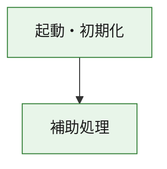
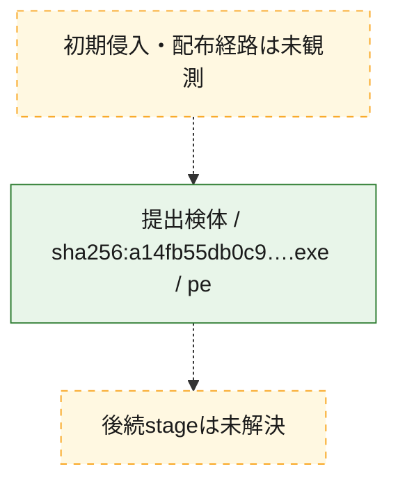
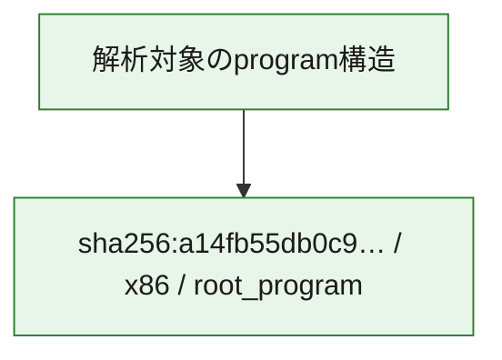

# 全体ロジック：a14fb55db0c9ba8c61603e6935a47f2d6d71c4856981532327eb36aae4b30809

代表関数の静的証跡から、起動・初期化の処理群を確認しました。

## 読み方

- phaseの掲載順は解析上の整理順です。observed_call_edgesがない段階間の実行順を断定しません。
- 図の実線は静的に観測した関係、点線と黄色のノードは未観測・未解決の関係を示します。
- 図は静的な要約であり、動的実行を再現するものではありません。
- 詳細な関数解説とfingerprintは[STATIC-LOGIC.md](STATIC-LOGIC.md)を参照してください。

## 静的可視化

### 実行フロー

### 感染チェーン

### モジュール関係

## 処理段階

### 1. 起動・初期化

entry pointから初期化と後続処理への移行を確認します。
確度: `confirmed_static_function_evidence`

- `a14fb55db0c9ba8c61603e6935a47f2d6d71c4856981532327eb36aae4b30809:ghidra:180001010` — 初期化と主要処理への分岐を行う入口関数です。 状態: `succeeded`、選定理由: `entry_point`, `meaningful_symbol_name`, `reviewed_call_centrality:22`, `role:entrypoint`, `small_program_complete_context`

### 2. 補助処理

主要処理を支える一般内部関数またはlibrary処理を確認します。
確度: `confirmed_static_function_evidence`

- `a14fb55db0c9ba8c61603e6935a47f2d6d71c4856981532327eb36aae4b30809:ghidra:180001240` — 検体内部の一般処理を実装する関数です。 状態: `succeeded`、選定理由: `context_representative`, `reviewed_call_centrality:2`, `small_program_complete_context`
- `a14fb55db0c9ba8c61603e6935a47f2d6d71c4856981532327eb36aae4b30809:ghidra:180001350` — 検体内部の一般処理を実装する関数です。 状態: `succeeded`、選定理由: `context_representative`, `reviewed_call_centrality:25`, `small_program_complete_context`
- `a14fb55db0c9ba8c61603e6935a47f2d6d71c4856981532327eb36aae4b30809:ghidra:180003780` — 検体内部の一般処理を実装する関数です。 状態: `succeeded`、選定理由: `context_representative`, `reviewed_call_centrality:2`, `small_program_complete_context`
- `a14fb55db0c9ba8c61603e6935a47f2d6d71c4856981532327eb36aae4b30809:ghidra:1800038e0` — 検体内部の一般処理を実装する関数です。 状態: `succeeded`、選定理由: `context_representative`, `reviewed_call_centrality:2`, `small_program_complete_context`

## 観測したcall関係

- `a14fb55db0c9ba8c61603e6935a47f2d6d71c4856981532327eb36aae4b30809:ghidra:180001010` → `a14fb55db0c9ba8c61603e6935a47f2d6d71c4856981532327eb36aae4b30809:ghidra:180001240` （`startup` → `support`）
- `a14fb55db0c9ba8c61603e6935a47f2d6d71c4856981532327eb36aae4b30809:ghidra:180001010` → `a14fb55db0c9ba8c61603e6935a47f2d6d71c4856981532327eb36aae4b30809:ghidra:180001350` （`startup` → `support`）
- `a14fb55db0c9ba8c61603e6935a47f2d6d71c4856981532327eb36aae4b30809:ghidra:180001350` → `a14fb55db0c9ba8c61603e6935a47f2d6d71c4856981532327eb36aae4b30809:ghidra:180001240` （`support` → `support`）
- `a14fb55db0c9ba8c61603e6935a47f2d6d71c4856981532327eb36aae4b30809:ghidra:180001350` → `a14fb55db0c9ba8c61603e6935a47f2d6d71c4856981532327eb36aae4b30809:ghidra:180003780` （`support` → `support`）
- `a14fb55db0c9ba8c61603e6935a47f2d6d71c4856981532327eb36aae4b30809:ghidra:180001350` → `a14fb55db0c9ba8c61603e6935a47f2d6d71c4856981532327eb36aae4b30809:ghidra:1800038e0` （`support` → `support`）
- `a14fb55db0c9ba8c61603e6935a47f2d6d71c4856981532327eb36aae4b30809:ghidra:180003780` → `a14fb55db0c9ba8c61603e6935a47f2d6d71c4856981532327eb36aae4b30809:ghidra:1800038e0` （`support` → `support`）
- `ghidra-function:5956fb8edfeb9202ef627ca1` → `ghidra-function:bd8975d98c5e434b2caaba10` （`unclassified` → `unclassified`）
- `ghidra-function:6054fa4e9dfed9103f5c90ab` → `ghidra-external:159be233a0b9cbee7fbd3a68` （`unclassified` → `unclassified`）
- `ghidra-function:6054fa4e9dfed9103f5c90ab` → `ghidra-external:33e9340f6649b8418a283c75` （`unclassified` → `unclassified`）
- `ghidra-function:6054fa4e9dfed9103f5c90ab` → `ghidra-external:342ea4affb6d671566571adb` （`unclassified` → `unclassified`）
- `ghidra-function:6054fa4e9dfed9103f5c90ab` → `ghidra-external:3a2855b89c2a3c7772e38ea1` （`unclassified` → `unclassified`）
- `ghidra-function:6054fa4e9dfed9103f5c90ab` → `ghidra-external:4b0b52a06b3eaeca3b3a67c7` （`unclassified` → `unclassified`）
- `ghidra-function:6054fa4e9dfed9103f5c90ab` → `ghidra-external:504dc5a2cf7b137fa03f106a` （`unclassified` → `unclassified`）
- `ghidra-function:6054fa4e9dfed9103f5c90ab` → `ghidra-external:56684f5613a7a7737849a759` （`unclassified` → `unclassified`）
- `ghidra-function:6054fa4e9dfed9103f5c90ab` → `ghidra-external:5a7262abf63c1f71d2375767` （`unclassified` → `unclassified`）
- `ghidra-function:6054fa4e9dfed9103f5c90ab` → `ghidra-external:5b28d6e6b37fbd8fe4aa3400` （`unclassified` → `unclassified`）
- `ghidra-function:6054fa4e9dfed9103f5c90ab` → `ghidra-external:651ab86b729aebca7267bd88` （`unclassified` → `unclassified`）
- `ghidra-function:6054fa4e9dfed9103f5c90ab` → `ghidra-external:65410da4cb61a3856fa7bf4c` （`unclassified` → `unclassified`）
- `ghidra-function:6054fa4e9dfed9103f5c90ab` → `ghidra-external:669108c35cf94a623b2b3a28` （`unclassified` → `unclassified`）
- `ghidra-function:6054fa4e9dfed9103f5c90ab` → `ghidra-external:79ef4847fc2f63105013c2b7` （`unclassified` → `unclassified`）
- `ghidra-function:6054fa4e9dfed9103f5c90ab` → `ghidra-external:7ae4796cc44c434e57ada2a5` （`unclassified` → `unclassified`）
- `ghidra-function:6054fa4e9dfed9103f5c90ab` → `ghidra-external:8689d6b08284ad941288af19` （`unclassified` → `unclassified`）
- `ghidra-function:6054fa4e9dfed9103f5c90ab` → `ghidra-external:8904354ee85eef54ab94d03f` （`unclassified` → `unclassified`）
- `ghidra-function:6054fa4e9dfed9103f5c90ab` → `ghidra-external:9682b05d3936d0e860d0f771` （`unclassified` → `unclassified`）
- `ghidra-function:6054fa4e9dfed9103f5c90ab` → `ghidra-external:a2d62a5710451c8cca4fb8ba` （`unclassified` → `unclassified`）
- `ghidra-function:6054fa4e9dfed9103f5c90ab` → `ghidra-external:bdb11f830f409d9c17faf109` （`unclassified` → `unclassified`）
- `ghidra-function:6054fa4e9dfed9103f5c90ab` → `ghidra-external:dc20c99df35318eca4d32001` （`unclassified` → `unclassified`）
- `ghidra-function:6054fa4e9dfed9103f5c90ab` → `ghidra-external:eabf89c21bbcb221bf7df61a` （`unclassified` → `unclassified`）
- `ghidra-function:6054fa4e9dfed9103f5c90ab` → `ghidra-function:5956fb8edfeb9202ef627ca1` （`unclassified` → `unclassified`）
- `ghidra-function:6054fa4e9dfed9103f5c90ab` → `ghidra-function:637ce4dc9929a24a1ca96e42` （`unclassified` → `unclassified`）
- `ghidra-function:6054fa4e9dfed9103f5c90ab` → `ghidra-function:bd8975d98c5e434b2caaba10` （`unclassified` → `unclassified`）
- `ghidra-function:d3c61c1648ce831f04c9b816` → `ghidra-function:08eddc906138e278428a7de1` （`unclassified` → `unclassified`）
- `ghidra-function:d3c61c1648ce831f04c9b816` → `ghidra-function:0cb7592e95dece9dba9cbfad` （`unclassified` → `unclassified`）
- `ghidra-function:d3c61c1648ce831f04c9b816` → `ghidra-function:24ce229a223842979205cfda` （`unclassified` → `unclassified`）
- `ghidra-function:d3c61c1648ce831f04c9b816` → `ghidra-function:42274e7191e2a9b4844f58df` （`unclassified` → `unclassified`）
- `ghidra-function:d3c61c1648ce831f04c9b816` → `ghidra-function:6054fa4e9dfed9103f5c90ab` （`unclassified` → `unclassified`）
- `ghidra-function:d3c61c1648ce831f04c9b816` → `ghidra-function:637ce4dc9929a24a1ca96e42` （`unclassified` → `unclassified`）
- `ghidra-function:d3c61c1648ce831f04c9b816` → `ghidra-function:65fdf1f461481cb1aa350a48` （`unclassified` → `unclassified`）
- `ghidra-function:d3c61c1648ce831f04c9b816` → `ghidra-function:739303943ed51a73c82d31bb` （`unclassified` → `unclassified`）
- `ghidra-function:d3c61c1648ce831f04c9b816` → `ghidra-function:9c7faa346f78b4bbfd1beccd` （`unclassified` → `unclassified`）
- `ghidra-function:d3c61c1648ce831f04c9b816` → `ghidra-function:9dc4196e124bad29594b9ce1` （`unclassified` → `unclassified`）
- `ghidra-function:d3c61c1648ce831f04c9b816` → `ghidra-function:e0537cc8bc14efa396bdd492` （`unclassified` → `unclassified`）
- `ghidra-function:d3c61c1648ce831f04c9b816` → `ghidra-function:ea55e4b00759021837746923` （`unclassified` → `unclassified`）

## 解析範囲と制約

- 選定外関数は全体inventoryへ残しますが、関数本体の個別解説対象にはしていません。
- indirect call、難読化、packer、VM、壊れたcontrol flowによりcall関係が欠落する場合があります。
- 文書は静的解析に基づき、検体実行や外部通信による動的確認は行っていません。
