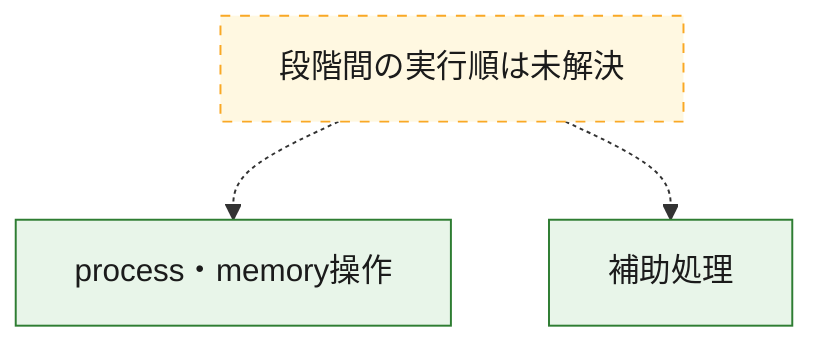
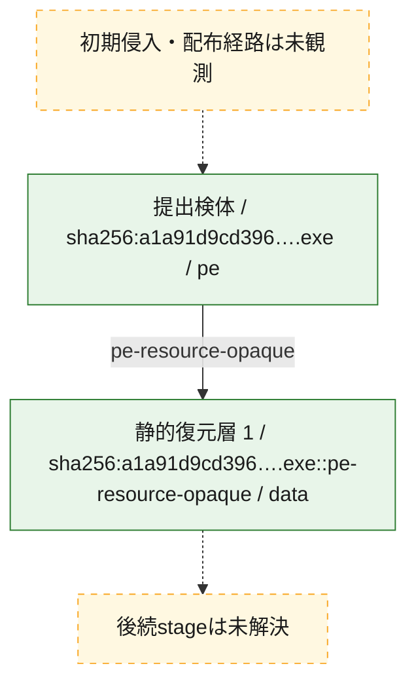
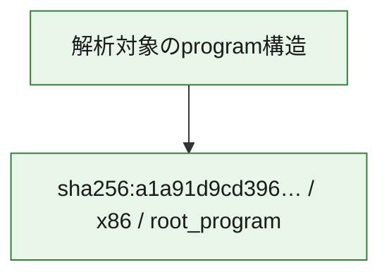

# 全体ロジック：a1a91d9cd396186c4fde28e050f88aa68062b05195aaea091e7b3a1ca7539893

代表関数の静的証跡から、process・memory操作の処理群を確認しました。

## 読み方

- phaseの掲載順は解析上の整理順です。observed_call_edgesがない段階間の実行順を断定しません。
- 図の実線は静的に観測した関係、点線と黄色のノードは未観測・未解決の関係を示します。
- 図は静的な要約であり、動的実行を再現するものではありません。
- 詳細な関数解説とfingerprintは[STATIC-LOGIC.md](STATIC-LOGIC.md)を参照してください。

## 静的可視化

### 実行フロー

### 感染チェーン

### モジュール関係

## 処理段階

### 1. process・memory操作

process、thread、module、memory操作と実行移行を確認します。
確度: `confirmed_static_function_evidence_with_limits`

- `a1a91d9cd396186c4fde28e050f88aa68062b05195aaea091e7b3a1ca7539893:ghidra:140001210` — process、thread、module、またはmemory操作に関係する関数です。 状態: `succeeded`、選定理由: `context_representative`, `reviewed_call_centrality:47`, `role:process_or_memory_operation`
- `a1a91d9cd396186c4fde28e050f88aa68062b05195aaea091e7b3a1ca7539893:ghidra:1400026d0` — process、thread、module、またはmemory操作に関係する関数です。 状態: `succeeded`、選定理由: `context_representative`, `reviewed_call_centrality:24`, `role:process_or_memory_operation`
- `a1a91d9cd396186c4fde28e050f88aa68062b05195aaea091e7b3a1ca7539893:ghidra:140003dc0` — process、thread、module、またはmemory操作に関係する関数です。 状態: `limited_bad_instruction_or_flow`、選定理由: `context_representative`, `reviewed_call_centrality:9`, `role:process_or_memory_operation`
- `a1a91d9cd396186c4fde28e050f88aa68062b05195aaea091e7b3a1ca7539893:ghidra:140003f70` — process、thread、module、またはmemory操作に関係する関数です。 状態: `limited_bad_instruction_or_flow`、選定理由: `context_representative`, `reviewed_call_centrality:21`, `role:process_or_memory_operation`
- `a1a91d9cd396186c4fde28e050f88aa68062b05195aaea091e7b3a1ca7539893:ghidra:1400040b0` — process、thread、module、またはmemory操作に関係する関数です。 状態: `limited_bad_instruction_or_flow`、選定理由: `context_representative`, `reviewed_call_centrality:16`, `role:process_or_memory_operation`
- `a1a91d9cd396186c4fde28e050f88aa68062b05195aaea091e7b3a1ca7539893:ghidra:140004320` — process、thread、module、またはmemory操作に関係する関数です。 状態: `limited_bad_instruction_or_flow`、選定理由: `context_representative`, `reviewed_call_centrality:15`, `role:process_or_memory_operation`
- `a1a91d9cd396186c4fde28e050f88aa68062b05195aaea091e7b3a1ca7539893:ghidra:140004520` — process、thread、module、またはmemory操作に関係する関数です。 状態: `limited_bad_instruction_or_flow`、選定理由: `context_representative`, `reviewed_call_centrality:4`, `role:process_or_memory_operation`
- `a1a91d9cd396186c4fde28e050f88aa68062b05195aaea091e7b3a1ca7539893:ghidra:140004590` — process、thread、module、またはmemory操作に関係する関数です。 状態: `limited_bad_instruction_or_flow`、選定理由: `context_representative`, `reviewed_call_centrality:14`, `role:process_or_memory_operation`
- `a1a91d9cd396186c4fde28e050f88aa68062b05195aaea091e7b3a1ca7539893:ghidra:140004650` — process、thread、module、またはmemory操作に関係する関数です。 状態: `limited_bad_instruction_or_flow`、選定理由: `context_representative`, `reviewed_call_centrality:11`, `role:process_or_memory_operation`

### 2. 補助処理

主要処理を支える一般内部関数またはlibrary処理を確認します。
確度: `confirmed_static_function_evidence_with_limits`

- `a1a91d9cd396186c4fde28e050f88aa68062b05195aaea091e7b3a1ca7539893:ghidra:140001000` — 検体内部の一般処理を実装する関数です。 状態: `succeeded`、選定理由: `context_representative`, `reviewed_call_centrality:1`
- `a1a91d9cd396186c4fde28e050f88aa68062b05195aaea091e7b3a1ca7539893:ghidra:140001010` — 検体内部の一般処理を実装する関数です。 状態: `succeeded`、選定理由: `context_representative`, `reviewed_call_centrality:1`
- `a1a91d9cd396186c4fde28e050f88aa68062b05195aaea091e7b3a1ca7539893:ghidra:140001030` — 検体内部の一般処理を実装する関数です。 状態: `succeeded`、選定理由: `context_representative`, `reviewed_call_centrality:8`
- `a1a91d9cd396186c4fde28e050f88aa68062b05195aaea091e7b3a1ca7539893:ghidra:1400011f0` — 検体内部の一般処理を実装する関数です。 状態: `succeeded`、選定理由: `context_representative`, `reviewed_call_centrality:2`
- `a1a91d9cd396186c4fde28e050f88aa68062b05195aaea091e7b3a1ca7539893:ghidra:140002460` — 検体内部の一般処理を実装する関数です。 状態: `succeeded`、選定理由: `context_representative`, `reviewed_call_centrality:10`
- `a1a91d9cd396186c4fde28e050f88aa68062b05195aaea091e7b3a1ca7539893:ghidra:140002c90` — 検体内部の一般処理を実装する関数です。 状態: `succeeded`、選定理由: `context_representative`, `reviewed_call_centrality:10`
- `a1a91d9cd396186c4fde28e050f88aa68062b05195aaea091e7b3a1ca7539893:ghidra:140002e90` — 検体内部の一般処理を実装する関数です。 状態: `succeeded`、選定理由: `context_representative`, `reviewed_call_centrality:10`
- `a1a91d9cd396186c4fde28e050f88aa68062b05195aaea091e7b3a1ca7539893:ghidra:1400030d0` — 検体内部の一般処理を実装する関数です。 状態: `succeeded`、選定理由: `context_representative`, `reviewed_call_centrality:6`
- `a1a91d9cd396186c4fde28e050f88aa68062b05195aaea091e7b3a1ca7539893:ghidra:140003350` — 検体内部の一般処理を実装する関数です。 状態: `limited_bad_instruction_or_flow`、選定理由: `context_representative`, `reviewed_call_centrality:90`
- `a1a91d9cd396186c4fde28e050f88aa68062b05195aaea091e7b3a1ca7539893:ghidra:140004730` — 検体内部の一般処理を実装する関数です。 状態: `succeeded`、選定理由: `context_representative`, `reviewed_call_centrality:4`
- `a1a91d9cd396186c4fde28e050f88aa68062b05195aaea091e7b3a1ca7539893:ghidra:1400048f0` — 検体内部の一般処理を実装する関数です。 状態: `succeeded`、選定理由: `context_representative`, `reviewed_call_centrality:1`
- `a1a91d9cd396186c4fde28e050f88aa68062b05195aaea091e7b3a1ca7539893:ghidra:140004930` — 検体内部の一般処理を実装する関数です。 状態: `succeeded`、選定理由: `context_representative`, `reviewed_call_centrality:2`
- `a1a91d9cd396186c4fde28e050f88aa68062b05195aaea091e7b3a1ca7539893:ghidra:140004a80` — 検体内部の一般処理を実装する関数です。 状態: `succeeded`、選定理由: `context_representative`, `reviewed_call_centrality:10`
- `a1a91d9cd396186c4fde28e050f88aa68062b05195aaea091e7b3a1ca7539893:ghidra:140004c10` — 検体内部の一般処理を実装する関数です。 状態: `succeeded`、選定理由: `context_representative`, `reviewed_call_centrality:8`
- `a1a91d9cd396186c4fde28e050f88aa68062b05195aaea091e7b3a1ca7539893:ghidra:140004fa0` — 検体内部の一般処理を実装する関数です。 状態: `succeeded`、選定理由: `context_representative`, `reviewed_call_centrality:17`
- `a1a91d9cd396186c4fde28e050f88aa68062b05195aaea091e7b3a1ca7539893:ghidra:140005710` — 検体内部の一般処理を実装する関数です。 状態: `succeeded`、選定理由: `context_representative`, `reviewed_call_centrality:2`
- `a1a91d9cd396186c4fde28e050f88aa68062b05195aaea091e7b3a1ca7539893:ghidra:140005740` — 検体内部の一般処理を実装する関数です。 状態: `succeeded`、選定理由: `context_representative`, `reviewed_call_centrality:2`
- `a1a91d9cd396186c4fde28e050f88aa68062b05195aaea091e7b3a1ca7539893:ghidra:140005770` — 検体内部の一般処理を実装する関数です。 状態: `succeeded`、選定理由: `context_representative`, `reviewed_call_centrality:1`
- `a1a91d9cd396186c4fde28e050f88aa68062b05195aaea091e7b3a1ca7539893:ghidra:1400057a0` — 検体内部の一般処理を実装する関数です。 状態: `succeeded`、選定理由: `context_representative`, `reviewed_call_centrality:7`
- `a1a91d9cd396186c4fde28e050f88aa68062b05195aaea091e7b3a1ca7539893:ghidra:1400058a0` — 検体内部の一般処理を実装する関数です。 状態: `succeeded`、選定理由: `context_representative`, `reviewed_call_centrality:5`
- `a1a91d9cd396186c4fde28e050f88aa68062b05195aaea091e7b3a1ca7539893:ghidra:140005930` — 検体内部の一般処理を実装する関数です。 状態: `succeeded`、選定理由: `context_representative`, `reviewed_call_centrality:3`
- `a1a91d9cd396186c4fde28e050f88aa68062b05195aaea091e7b3a1ca7539893:ghidra:1400059d0` — 検体内部の一般処理を実装する関数です。 状態: `succeeded`、選定理由: `context_representative`, `reviewed_call_centrality:7`
- `a1a91d9cd396186c4fde28e050f88aa68062b05195aaea091e7b3a1ca7539893:ghidra:140005b80` — 検体内部の一般処理を実装する関数です。 状態: `succeeded`、選定理由: `context_representative`, `reviewed_call_centrality:3`

## 観測したcall関係

- 代表関数間で直接解決できた呼出関係はありません。

## 解析範囲と制約

- 選定外関数は全体inventoryへ残しますが、関数本体の個別解説対象にはしていません。
- indirect call、難読化、packer、VM、壊れたcontrol flowによりcall関係が欠落する場合があります。
- 文書は静的解析に基づき、検体実行や外部通信による動的確認は行っていません。
