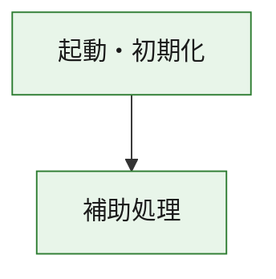
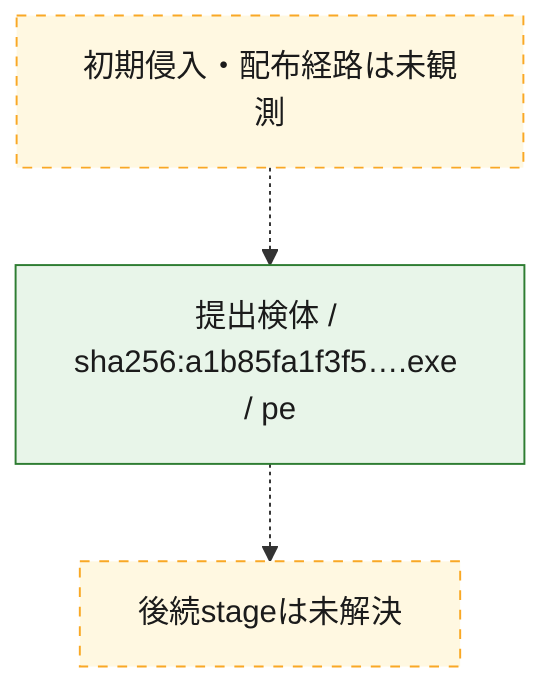
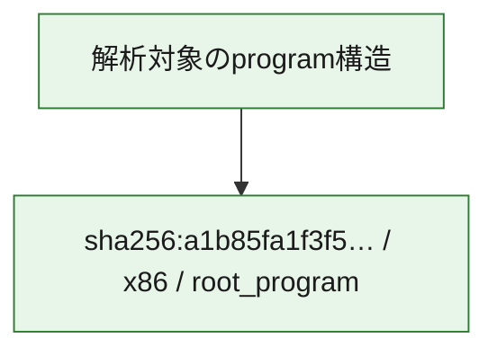

# 全体ロジック：a1b85fa1f3f58a0315506a8187b8292fbf51fb82d38f842a847cac21a57fb34e

代表関数の静的証跡から、起動・初期化の処理群を確認しました。

## 読み方

- phaseの掲載順は解析上の整理順です。observed_call_edgesがない段階間の実行順を断定しません。
- 図の実線は静的に観測した関係、点線と黄色のノードは未観測・未解決の関係を示します。
- 図は静的な要約であり、動的実行を再現するものではありません。
- 詳細な関数解説とfingerprintは[STATIC-LOGIC.md](STATIC-LOGIC.md)を参照してください。

## 静的可視化

### 実行フロー

### 感染チェーン

### モジュール関係

## 処理段階

### 1. 起動・初期化

entry pointから初期化と後続処理への移行を確認します。
確度: `confirmed_static_function_evidence`

- `a1b85fa1f3f58a0315506a8187b8292fbf51fb82d38f842a847cac21a57fb34e:ghidra:180001010` — 初期化と主要処理への分岐を行う入口関数です。 状態: `succeeded`、選定理由: `entry_point`, `meaningful_symbol_name`, `reviewed_call_centrality:22`, `role:entrypoint`, `small_program_complete_context`

### 2. 補助処理

主要処理を支える一般内部関数またはlibrary処理を確認します。
確度: `confirmed_static_function_evidence`

- `a1b85fa1f3f58a0315506a8187b8292fbf51fb82d38f842a847cac21a57fb34e:ghidra:180001240` — 検体内部の一般処理を実装する関数です。 状態: `succeeded`、選定理由: `context_representative`, `reviewed_call_centrality:2`, `small_program_complete_context`
- `a1b85fa1f3f58a0315506a8187b8292fbf51fb82d38f842a847cac21a57fb34e:ghidra:180001350` — 検体内部の一般処理を実装する関数です。 状態: `succeeded`、選定理由: `context_representative`, `reviewed_call_centrality:25`, `small_program_complete_context`
- `a1b85fa1f3f58a0315506a8187b8292fbf51fb82d38f842a847cac21a57fb34e:ghidra:180003780` — 検体内部の一般処理を実装する関数です。 状態: `succeeded`、選定理由: `context_representative`, `reviewed_call_centrality:2`, `small_program_complete_context`
- `a1b85fa1f3f58a0315506a8187b8292fbf51fb82d38f842a847cac21a57fb34e:ghidra:1800038e0` — 検体内部の一般処理を実装する関数です。 状態: `succeeded`、選定理由: `context_representative`, `reviewed_call_centrality:2`, `small_program_complete_context`

## 観測したcall関係

- `a1b85fa1f3f58a0315506a8187b8292fbf51fb82d38f842a847cac21a57fb34e:ghidra:180001010` → `a1b85fa1f3f58a0315506a8187b8292fbf51fb82d38f842a847cac21a57fb34e:ghidra:180001240` （`startup` → `support`）
- `a1b85fa1f3f58a0315506a8187b8292fbf51fb82d38f842a847cac21a57fb34e:ghidra:180001010` → `a1b85fa1f3f58a0315506a8187b8292fbf51fb82d38f842a847cac21a57fb34e:ghidra:180001350` （`startup` → `support`）
- `a1b85fa1f3f58a0315506a8187b8292fbf51fb82d38f842a847cac21a57fb34e:ghidra:180001350` → `a1b85fa1f3f58a0315506a8187b8292fbf51fb82d38f842a847cac21a57fb34e:ghidra:180001240` （`support` → `support`）
- `a1b85fa1f3f58a0315506a8187b8292fbf51fb82d38f842a847cac21a57fb34e:ghidra:180001350` → `a1b85fa1f3f58a0315506a8187b8292fbf51fb82d38f842a847cac21a57fb34e:ghidra:180003780` （`support` → `support`）
- `a1b85fa1f3f58a0315506a8187b8292fbf51fb82d38f842a847cac21a57fb34e:ghidra:180001350` → `a1b85fa1f3f58a0315506a8187b8292fbf51fb82d38f842a847cac21a57fb34e:ghidra:1800038e0` （`support` → `support`）
- `a1b85fa1f3f58a0315506a8187b8292fbf51fb82d38f842a847cac21a57fb34e:ghidra:180003780` → `a1b85fa1f3f58a0315506a8187b8292fbf51fb82d38f842a847cac21a57fb34e:ghidra:1800038e0` （`support` → `support`）
- `ghidra-function:6f33f7b082248f9a2a6820d0` → `ghidra-function:a7b76701d74dd036c1c07ef0` （`unclassified` → `unclassified`）
- `ghidra-function:7e0a235317f991f31530d25e` → `ghidra-external:082c099a32c61aa29f047d48` （`unclassified` → `unclassified`）
- `ghidra-function:7e0a235317f991f31530d25e` → `ghidra-external:08cc8480c10ddec8423c852b` （`unclassified` → `unclassified`）
- `ghidra-function:7e0a235317f991f31530d25e` → `ghidra-external:0afff386b1dca9d1d7220fb5` （`unclassified` → `unclassified`）
- `ghidra-function:7e0a235317f991f31530d25e` → `ghidra-external:25d32aa41c329eb1c7670ae1` （`unclassified` → `unclassified`）
- `ghidra-function:7e0a235317f991f31530d25e` → `ghidra-external:2b085ab11869f65a90bbc3a1` （`unclassified` → `unclassified`）
- `ghidra-function:7e0a235317f991f31530d25e` → `ghidra-external:313160ff3c0fa8f5e3a6c3ec` （`unclassified` → `unclassified`）
- `ghidra-function:7e0a235317f991f31530d25e` → `ghidra-external:36cc72e4c6222b6bb5521bc5` （`unclassified` → `unclassified`）
- `ghidra-function:7e0a235317f991f31530d25e` → `ghidra-external:4476c64ab7a09b6d10404065` （`unclassified` → `unclassified`）
- `ghidra-function:7e0a235317f991f31530d25e` → `ghidra-external:5fe2062349fdbc80102fa062` （`unclassified` → `unclassified`）
- `ghidra-function:7e0a235317f991f31530d25e` → `ghidra-external:68b9f635c98d067e500e50b0` （`unclassified` → `unclassified`）
- `ghidra-function:7e0a235317f991f31530d25e` → `ghidra-external:699016088560c3e9ac47ec24` （`unclassified` → `unclassified`）
- `ghidra-function:7e0a235317f991f31530d25e` → `ghidra-external:6dffb595a99d43ef4480bacf` （`unclassified` → `unclassified`）
- `ghidra-function:7e0a235317f991f31530d25e` → `ghidra-external:6f0bce835b4fb35230b4e85c` （`unclassified` → `unclassified`）
- `ghidra-function:7e0a235317f991f31530d25e` → `ghidra-external:71dbe5838cf55c7f2012db4c` （`unclassified` → `unclassified`）
- `ghidra-function:7e0a235317f991f31530d25e` → `ghidra-external:791b4b7b26a920cae6167857` （`unclassified` → `unclassified`）
- `ghidra-function:7e0a235317f991f31530d25e` → `ghidra-external:7bc521ea7c64246d45fd8137` （`unclassified` → `unclassified`）
- `ghidra-function:7e0a235317f991f31530d25e` → `ghidra-external:95e7de1c7c1ff6353a38e1b9` （`unclassified` → `unclassified`）
- `ghidra-function:7e0a235317f991f31530d25e` → `ghidra-external:a64a0b3672f47aa19d8c736e` （`unclassified` → `unclassified`）
- `ghidra-function:7e0a235317f991f31530d25e` → `ghidra-external:a8fb8f664086c05563afa81c` （`unclassified` → `unclassified`）
- `ghidra-function:7e0a235317f991f31530d25e` → `ghidra-external:c7c26db56d0edeb5ddf79b3f` （`unclassified` → `unclassified`）
- `ghidra-function:7e0a235317f991f31530d25e` → `ghidra-external:edf9df7f61a0acf344af318e` （`unclassified` → `unclassified`）
- `ghidra-function:7e0a235317f991f31530d25e` → `ghidra-function:0495f659befe567276e41940` （`unclassified` → `unclassified`）
- `ghidra-function:7e0a235317f991f31530d25e` → `ghidra-function:6f33f7b082248f9a2a6820d0` （`unclassified` → `unclassified`）
- `ghidra-function:7e0a235317f991f31530d25e` → `ghidra-function:a7b76701d74dd036c1c07ef0` （`unclassified` → `unclassified`）
- `ghidra-function:a569faab32acac12510c9ddc` → `ghidra-function:0495f659befe567276e41940` （`unclassified` → `unclassified`）
- `ghidra-function:a569faab32acac12510c9ddc` → `ghidra-function:24faf1cf29b63cd54a2941a8` （`unclassified` → `unclassified`）
- `ghidra-function:a569faab32acac12510c9ddc` → `ghidra-function:385076afb15e7c10db0ce7c5` （`unclassified` → `unclassified`）
- `ghidra-function:a569faab32acac12510c9ddc` → `ghidra-function:4edc75addb66c39bcbdb121e` （`unclassified` → `unclassified`）
- `ghidra-function:a569faab32acac12510c9ddc` → `ghidra-function:52b6a8aeffa08e485eeeb80a` （`unclassified` → `unclassified`）
- `ghidra-function:a569faab32acac12510c9ddc` → `ghidra-function:7e0a235317f991f31530d25e` （`unclassified` → `unclassified`）
- `ghidra-function:a569faab32acac12510c9ddc` → `ghidra-function:8c8d006bb808d430719206b5` （`unclassified` → `unclassified`）
- `ghidra-function:a569faab32acac12510c9ddc` → `ghidra-function:949049ef348a5def56ce8939` （`unclassified` → `unclassified`）
- `ghidra-function:a569faab32acac12510c9ddc` → `ghidra-function:b5ce1eb842ae72a766474748` （`unclassified` → `unclassified`）
- `ghidra-function:a569faab32acac12510c9ddc` → `ghidra-function:bd9facb9fc265d681548d3cd` （`unclassified` → `unclassified`）
- `ghidra-function:a569faab32acac12510c9ddc` → `ghidra-function:e4f4f2cb5e14ee88ca4155fc` （`unclassified` → `unclassified`）
- `ghidra-function:a569faab32acac12510c9ddc` → `ghidra-function:eb1649efef0f8bccd5817fb3` （`unclassified` → `unclassified`）

## 解析範囲と制約

- 選定外関数は全体inventoryへ残しますが、関数本体の個別解説対象にはしていません。
- indirect call、難読化、packer、VM、壊れたcontrol flowによりcall関係が欠落する場合があります。
- 文書は静的解析に基づき、検体実行や外部通信による動的確認は行っていません。
