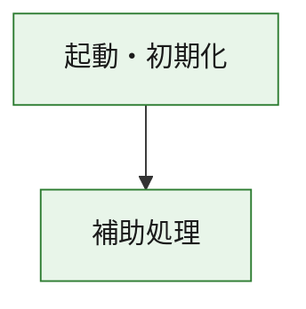
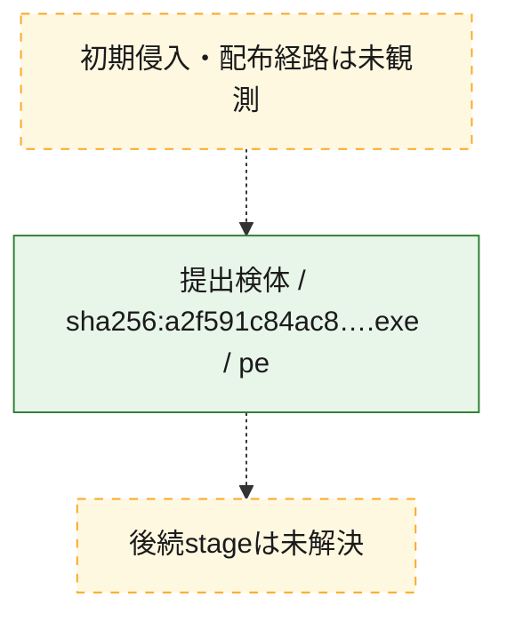
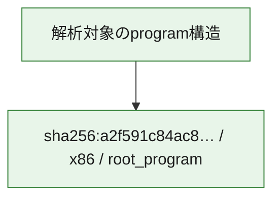

# 全体ロジック：a2f591c84ac86690a8f9003b758b7091822e20e780e89ee1bf31d76e7f778791

代表関数の静的証跡から、起動・初期化の処理群を確認しました。

## 読み方

- phaseの掲載順は解析上の整理順です。observed_call_edgesがない段階間の実行順を断定しません。
- 図の実線は静的に観測した関係、点線と黄色のノードは未観測・未解決の関係を示します。
- 図は静的な要約であり、動的実行を再現するものではありません。
- 詳細な関数解説とfingerprintは[STATIC-LOGIC.md](STATIC-LOGIC.md)を参照してください。

## 静的可視化

### 実行フロー

### 感染チェーン

### モジュール関係

## 処理段階

### 1. 起動・初期化

entry pointから初期化と後続処理への移行を確認します。
確度: `confirmed_static_function_evidence`

- `a2f591c84ac86690a8f9003b758b7091822e20e780e89ee1bf31d76e7f778791:ghidra:180001010` — 初期化と主要処理への分岐を行う入口関数です。 状態: `succeeded`、選定理由: `entry_point`, `meaningful_symbol_name`, `reviewed_call_centrality:22`, `role:entrypoint`, `small_program_complete_context`

### 2. 補助処理

主要処理を支える一般内部関数またはlibrary処理を確認します。
確度: `confirmed_static_function_evidence`

- `a2f591c84ac86690a8f9003b758b7091822e20e780e89ee1bf31d76e7f778791:ghidra:180001240` — 検体内部の一般処理を実装する関数です。 状態: `succeeded`、選定理由: `context_representative`, `reviewed_call_centrality:2`, `small_program_complete_context`
- `a2f591c84ac86690a8f9003b758b7091822e20e780e89ee1bf31d76e7f778791:ghidra:180001350` — 検体内部の一般処理を実装する関数です。 状態: `succeeded`、選定理由: `context_representative`, `reviewed_call_centrality:25`, `small_program_complete_context`
- `a2f591c84ac86690a8f9003b758b7091822e20e780e89ee1bf31d76e7f778791:ghidra:180003780` — 検体内部の一般処理を実装する関数です。 状態: `succeeded`、選定理由: `context_representative`, `reviewed_call_centrality:2`, `small_program_complete_context`
- `a2f591c84ac86690a8f9003b758b7091822e20e780e89ee1bf31d76e7f778791:ghidra:1800038e0` — 検体内部の一般処理を実装する関数です。 状態: `succeeded`、選定理由: `context_representative`, `reviewed_call_centrality:2`, `small_program_complete_context`

## 観測したcall関係

- `a2f591c84ac86690a8f9003b758b7091822e20e780e89ee1bf31d76e7f778791:ghidra:180001010` → `a2f591c84ac86690a8f9003b758b7091822e20e780e89ee1bf31d76e7f778791:ghidra:180001240` （`startup` → `support`）
- `a2f591c84ac86690a8f9003b758b7091822e20e780e89ee1bf31d76e7f778791:ghidra:180001010` → `a2f591c84ac86690a8f9003b758b7091822e20e780e89ee1bf31d76e7f778791:ghidra:180001350` （`startup` → `support`）
- `a2f591c84ac86690a8f9003b758b7091822e20e780e89ee1bf31d76e7f778791:ghidra:180001350` → `a2f591c84ac86690a8f9003b758b7091822e20e780e89ee1bf31d76e7f778791:ghidra:180001240` （`support` → `support`）
- `a2f591c84ac86690a8f9003b758b7091822e20e780e89ee1bf31d76e7f778791:ghidra:180001350` → `a2f591c84ac86690a8f9003b758b7091822e20e780e89ee1bf31d76e7f778791:ghidra:180003780` （`support` → `support`）
- `a2f591c84ac86690a8f9003b758b7091822e20e780e89ee1bf31d76e7f778791:ghidra:180001350` → `a2f591c84ac86690a8f9003b758b7091822e20e780e89ee1bf31d76e7f778791:ghidra:1800038e0` （`support` → `support`）
- `a2f591c84ac86690a8f9003b758b7091822e20e780e89ee1bf31d76e7f778791:ghidra:180003780` → `a2f591c84ac86690a8f9003b758b7091822e20e780e89ee1bf31d76e7f778791:ghidra:1800038e0` （`support` → `support`）
- `ghidra-function:38a5cf60a935fabe8b9ed070` → `ghidra-external:0078c7626690b09b217945fd` （`unclassified` → `unclassified`）
- `ghidra-function:38a5cf60a935fabe8b9ed070` → `ghidra-external:135e8c4eddb9a6e40f84b456` （`unclassified` → `unclassified`）
- `ghidra-function:38a5cf60a935fabe8b9ed070` → `ghidra-external:342dd0fa71b3cb92a29783df` （`unclassified` → `unclassified`）
- `ghidra-function:38a5cf60a935fabe8b9ed070` → `ghidra-external:56869b93c98ab1b3d0105e16` （`unclassified` → `unclassified`）
- `ghidra-function:38a5cf60a935fabe8b9ed070` → `ghidra-external:5afaefa2c43b67ed18cb4739` （`unclassified` → `unclassified`）
- `ghidra-function:38a5cf60a935fabe8b9ed070` → `ghidra-external:5e4aa407bf2abef66f26ba32` （`unclassified` → `unclassified`）
- `ghidra-function:38a5cf60a935fabe8b9ed070` → `ghidra-external:61e044c8c7a7cff67269b305` （`unclassified` → `unclassified`）
- `ghidra-function:38a5cf60a935fabe8b9ed070` → `ghidra-external:6787bd35fa60ff956307a242` （`unclassified` → `unclassified`）
- `ghidra-function:38a5cf60a935fabe8b9ed070` → `ghidra-external:6f01f0b370269691a171e516` （`unclassified` → `unclassified`）
- `ghidra-function:38a5cf60a935fabe8b9ed070` → `ghidra-external:7def4c9c58d2813b6bed8e2d` （`unclassified` → `unclassified`）
- `ghidra-function:38a5cf60a935fabe8b9ed070` → `ghidra-external:9e9c97e04b02ebfa6166ab47` （`unclassified` → `unclassified`）
- `ghidra-function:38a5cf60a935fabe8b9ed070` → `ghidra-external:adf7b4a7018b88b120329f4c` （`unclassified` → `unclassified`）
- `ghidra-function:38a5cf60a935fabe8b9ed070` → `ghidra-external:b2f8f505a9897ff96d254c0a` （`unclassified` → `unclassified`）
- `ghidra-function:38a5cf60a935fabe8b9ed070` → `ghidra-external:c1a04b4ce32acd36a7b04b0c` （`unclassified` → `unclassified`）
- `ghidra-function:38a5cf60a935fabe8b9ed070` → `ghidra-external:c56848cf1f8653f1c7323ce6` （`unclassified` → `unclassified`）
- `ghidra-function:38a5cf60a935fabe8b9ed070` → `ghidra-external:d1c5aba5283fc25b938b055b` （`unclassified` → `unclassified`）
- `ghidra-function:38a5cf60a935fabe8b9ed070` → `ghidra-external:d583d1aedd6bb426d821ae5c` （`unclassified` → `unclassified`）
- `ghidra-function:38a5cf60a935fabe8b9ed070` → `ghidra-external:df45232bb30be4fe6c3acf54` （`unclassified` → `unclassified`）
- `ghidra-function:38a5cf60a935fabe8b9ed070` → `ghidra-external:e498bfc5562768fc9ff1de56` （`unclassified` → `unclassified`）
- `ghidra-function:38a5cf60a935fabe8b9ed070` → `ghidra-external:f56a42199966ce5cf5e068e5` （`unclassified` → `unclassified`）
- `ghidra-function:38a5cf60a935fabe8b9ed070` → `ghidra-external:fde80e61fa96f3e10b5fbdcf` （`unclassified` → `unclassified`）
- `ghidra-function:38a5cf60a935fabe8b9ed070` → `ghidra-function:1077caff21224fef4605ff4e` （`unclassified` → `unclassified`）
- `ghidra-function:38a5cf60a935fabe8b9ed070` → `ghidra-function:867dd01a9a7a8b288252f244` （`unclassified` → `unclassified`）
- `ghidra-function:38a5cf60a935fabe8b9ed070` → `ghidra-function:d5566446444aa325ffb36e5c` （`unclassified` → `unclassified`）
- `ghidra-function:859f5045c0f1971e6ef494ad` → `ghidra-function:1077caff21224fef4605ff4e` （`unclassified` → `unclassified`）
- `ghidra-function:859f5045c0f1971e6ef494ad` → `ghidra-function:36ac761e69b74279b04f28f6` （`unclassified` → `unclassified`）
- `ghidra-function:859f5045c0f1971e6ef494ad` → `ghidra-function:38a5cf60a935fabe8b9ed070` （`unclassified` → `unclassified`）
- `ghidra-function:859f5045c0f1971e6ef494ad` → `ghidra-function:5de05fe708d825a09c95e996` （`unclassified` → `unclassified`）
- `ghidra-function:859f5045c0f1971e6ef494ad` → `ghidra-function:905e9c5970bb58189d4143c1` （`unclassified` → `unclassified`）
- `ghidra-function:859f5045c0f1971e6ef494ad` → `ghidra-function:90b62fb428deefddb0e992dd` （`unclassified` → `unclassified`）
- `ghidra-function:859f5045c0f1971e6ef494ad` → `ghidra-function:a5a566a5c0ba826861040212` （`unclassified` → `unclassified`）
- `ghidra-function:859f5045c0f1971e6ef494ad` → `ghidra-function:ccc0a6dbcf25cc6aca79633f` （`unclassified` → `unclassified`）
- `ghidra-function:859f5045c0f1971e6ef494ad` → `ghidra-function:df390830329316649ed95b23` （`unclassified` → `unclassified`）
- `ghidra-function:859f5045c0f1971e6ef494ad` → `ghidra-function:e40c80d1fbb36a88807d6b63` （`unclassified` → `unclassified`）
- `ghidra-function:859f5045c0f1971e6ef494ad` → `ghidra-function:ed6e789795b6748a010f5ab3` （`unclassified` → `unclassified`）
- `ghidra-function:859f5045c0f1971e6ef494ad` → `ghidra-function:fcaa18d691e90f4343197e94` （`unclassified` → `unclassified`）
- `ghidra-function:d5566446444aa325ffb36e5c` → `ghidra-function:867dd01a9a7a8b288252f244` （`unclassified` → `unclassified`）

## 解析範囲と制約

- 選定外関数は全体inventoryへ残しますが、関数本体の個別解説対象にはしていません。
- indirect call、難読化、packer、VM、壊れたcontrol flowによりcall関係が欠落する場合があります。
- 文書は静的解析に基づき、検体実行や外部通信による動的確認は行っていません。
