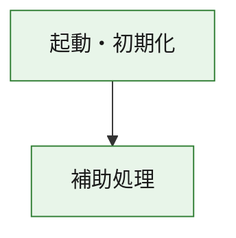
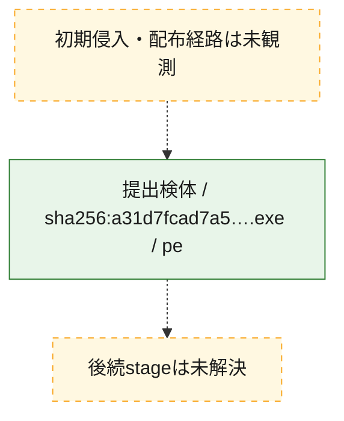
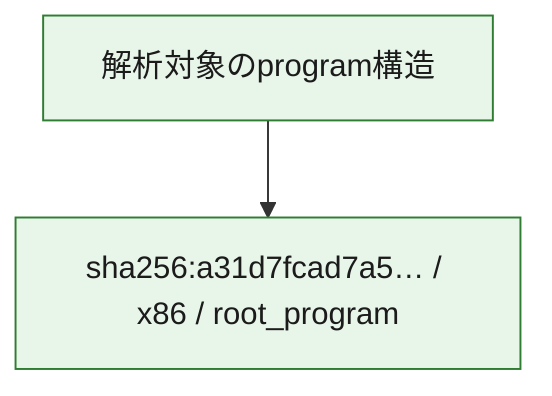

# 全体ロジック：a31d7fcad7a5f76af53d609cd3a2501364b98c68ad20eb9f3b488927c3e65ed2

代表関数の静的証跡から、起動・初期化の処理群を確認しました。

## 読み方

- phaseの掲載順は解析上の整理順です。observed_call_edgesがない段階間の実行順を断定しません。
- 図の実線は静的に観測した関係、点線と黄色のノードは未観測・未解決の関係を示します。
- 図は静的な要約であり、動的実行を再現するものではありません。
- 詳細な関数解説とfingerprintは[STATIC-LOGIC.md](STATIC-LOGIC.md)を参照してください。

## 静的可視化

### 実行フロー

### 感染チェーン

### モジュール関係

## 処理段階

### 1. 起動・初期化

entry pointから初期化と後続処理への移行を確認します。
確度: `confirmed_static_function_evidence`

- `a31d7fcad7a5f76af53d609cd3a2501364b98c68ad20eb9f3b488927c3e65ed2:ghidra:180001010` — 初期化と主要処理への分岐を行う入口関数です。 状態: `succeeded`、選定理由: `entry_point`, `meaningful_symbol_name`, `reviewed_call_centrality:22`, `role:entrypoint`, `small_program_complete_context`

### 2. 補助処理

主要処理を支える一般内部関数またはlibrary処理を確認します。
確度: `confirmed_static_function_evidence`

- `a31d7fcad7a5f76af53d609cd3a2501364b98c68ad20eb9f3b488927c3e65ed2:ghidra:180001240` — 検体内部の一般処理を実装する関数です。 状態: `succeeded`、選定理由: `context_representative`, `reviewed_call_centrality:2`, `small_program_complete_context`
- `a31d7fcad7a5f76af53d609cd3a2501364b98c68ad20eb9f3b488927c3e65ed2:ghidra:180001350` — 検体内部の一般処理を実装する関数です。 状態: `succeeded`、選定理由: `context_representative`, `reviewed_call_centrality:25`, `small_program_complete_context`
- `a31d7fcad7a5f76af53d609cd3a2501364b98c68ad20eb9f3b488927c3e65ed2:ghidra:180003780` — 検体内部の一般処理を実装する関数です。 状態: `succeeded`、選定理由: `context_representative`, `reviewed_call_centrality:2`, `small_program_complete_context`
- `a31d7fcad7a5f76af53d609cd3a2501364b98c68ad20eb9f3b488927c3e65ed2:ghidra:1800038e0` — 検体内部の一般処理を実装する関数です。 状態: `succeeded`、選定理由: `context_representative`, `reviewed_call_centrality:2`, `small_program_complete_context`

## 観測したcall関係

- `a31d7fcad7a5f76af53d609cd3a2501364b98c68ad20eb9f3b488927c3e65ed2:ghidra:180001010` → `a31d7fcad7a5f76af53d609cd3a2501364b98c68ad20eb9f3b488927c3e65ed2:ghidra:180001240` （`startup` → `support`）
- `a31d7fcad7a5f76af53d609cd3a2501364b98c68ad20eb9f3b488927c3e65ed2:ghidra:180001010` → `a31d7fcad7a5f76af53d609cd3a2501364b98c68ad20eb9f3b488927c3e65ed2:ghidra:180001350` （`startup` → `support`）
- `a31d7fcad7a5f76af53d609cd3a2501364b98c68ad20eb9f3b488927c3e65ed2:ghidra:180001350` → `a31d7fcad7a5f76af53d609cd3a2501364b98c68ad20eb9f3b488927c3e65ed2:ghidra:180001240` （`support` → `support`）
- `a31d7fcad7a5f76af53d609cd3a2501364b98c68ad20eb9f3b488927c3e65ed2:ghidra:180001350` → `a31d7fcad7a5f76af53d609cd3a2501364b98c68ad20eb9f3b488927c3e65ed2:ghidra:180003780` （`support` → `support`）
- `a31d7fcad7a5f76af53d609cd3a2501364b98c68ad20eb9f3b488927c3e65ed2:ghidra:180001350` → `a31d7fcad7a5f76af53d609cd3a2501364b98c68ad20eb9f3b488927c3e65ed2:ghidra:1800038e0` （`support` → `support`）
- `a31d7fcad7a5f76af53d609cd3a2501364b98c68ad20eb9f3b488927c3e65ed2:ghidra:180003780` → `a31d7fcad7a5f76af53d609cd3a2501364b98c68ad20eb9f3b488927c3e65ed2:ghidra:1800038e0` （`support` → `support`）
- `ghidra-function:6791e3bf11b54914779d45e0` → `ghidra-external:040b0f97f9bc022684322cfc` （`unclassified` → `unclassified`）
- `ghidra-function:6791e3bf11b54914779d45e0` → `ghidra-external:0e6bdb062917424a9218d5f1` （`unclassified` → `unclassified`）
- `ghidra-function:6791e3bf11b54914779d45e0` → `ghidra-external:1cbfa36ea3b7e5eeb152b550` （`unclassified` → `unclassified`）
- `ghidra-function:6791e3bf11b54914779d45e0` → `ghidra-external:1ebae518f139bc2e8f7f21b3` （`unclassified` → `unclassified`）
- `ghidra-function:6791e3bf11b54914779d45e0` → `ghidra-external:3565ba97f4a69719f1db7a52` （`unclassified` → `unclassified`）
- `ghidra-function:6791e3bf11b54914779d45e0` → `ghidra-external:5124db3b57593e8ebf059e1a` （`unclassified` → `unclassified`）
- `ghidra-function:6791e3bf11b54914779d45e0` → `ghidra-external:5435bc244572065c50ae4d9c` （`unclassified` → `unclassified`）
- `ghidra-function:6791e3bf11b54914779d45e0` → `ghidra-external:57fe1a3330cf5f118d694462` （`unclassified` → `unclassified`）
- `ghidra-function:6791e3bf11b54914779d45e0` → `ghidra-external:5b5f78465997c7b1a3b898ca` （`unclassified` → `unclassified`）
- `ghidra-function:6791e3bf11b54914779d45e0` → `ghidra-external:7f3b545e203c044b4f52838e` （`unclassified` → `unclassified`）
- `ghidra-function:6791e3bf11b54914779d45e0` → `ghidra-external:8072372f9a4f4cee2163eb47` （`unclassified` → `unclassified`）
- `ghidra-function:6791e3bf11b54914779d45e0` → `ghidra-external:9acfd5694f1bffdbe84fa716` （`unclassified` → `unclassified`）
- `ghidra-function:6791e3bf11b54914779d45e0` → `ghidra-external:a9295cbc15c3ed05099c5487` （`unclassified` → `unclassified`）
- `ghidra-function:6791e3bf11b54914779d45e0` → `ghidra-external:a945ace7623d0128d259fce4` （`unclassified` → `unclassified`）
- `ghidra-function:6791e3bf11b54914779d45e0` → `ghidra-external:aba6cf4be925db30fad4183f` （`unclassified` → `unclassified`）
- `ghidra-function:6791e3bf11b54914779d45e0` → `ghidra-external:b6119a750cfca2a5b09976c7` （`unclassified` → `unclassified`）
- `ghidra-function:6791e3bf11b54914779d45e0` → `ghidra-external:bd271db3195dcade49d6de97` （`unclassified` → `unclassified`）
- `ghidra-function:6791e3bf11b54914779d45e0` → `ghidra-external:cf002ac1003fe7a19bda24bf` （`unclassified` → `unclassified`）
- `ghidra-function:6791e3bf11b54914779d45e0` → `ghidra-external:dd61c619625f60e8a2e1a65c` （`unclassified` → `unclassified`）
- `ghidra-function:6791e3bf11b54914779d45e0` → `ghidra-external:fcfa15f0b96de3ee9af81c39` （`unclassified` → `unclassified`）
- `ghidra-function:6791e3bf11b54914779d45e0` → `ghidra-external:ff2bdd80b62a410b8ff0a153` （`unclassified` → `unclassified`）
- `ghidra-function:6791e3bf11b54914779d45e0` → `ghidra-function:49287fd80ec72b7e708cfc50` （`unclassified` → `unclassified`）
- `ghidra-function:6791e3bf11b54914779d45e0` → `ghidra-function:d4fe1366b23381eea7486789` （`unclassified` → `unclassified`）
- `ghidra-function:6791e3bf11b54914779d45e0` → `ghidra-function:fb74172b2074a72ddac613f2` （`unclassified` → `unclassified`）
- `ghidra-function:d4fe1366b23381eea7486789` → `ghidra-function:fb74172b2074a72ddac613f2` （`unclassified` → `unclassified`）
- `ghidra-function:ecab40d9b40e45808eff361e` → `ghidra-function:3cb6d321ffaccb5daaeb77d9` （`unclassified` → `unclassified`）
- `ghidra-function:ecab40d9b40e45808eff361e` → `ghidra-function:4173e24261da92787713bdfe` （`unclassified` → `unclassified`）
- `ghidra-function:ecab40d9b40e45808eff361e` → `ghidra-function:42a8d9c93b63c9ed248afb6b` （`unclassified` → `unclassified`）
- `ghidra-function:ecab40d9b40e45808eff361e` → `ghidra-function:49287fd80ec72b7e708cfc50` （`unclassified` → `unclassified`）
- `ghidra-function:ecab40d9b40e45808eff361e` → `ghidra-function:6791e3bf11b54914779d45e0` （`unclassified` → `unclassified`）
- `ghidra-function:ecab40d9b40e45808eff361e` → `ghidra-function:71c96ecee20f77844eb6d6be` （`unclassified` → `unclassified`）
- `ghidra-function:ecab40d9b40e45808eff361e` → `ghidra-function:a534c41ead347d2de1777d90` （`unclassified` → `unclassified`）
- `ghidra-function:ecab40d9b40e45808eff361e` → `ghidra-function:ad2c7bd7f76c0db7b4c74c0d` （`unclassified` → `unclassified`）
- `ghidra-function:ecab40d9b40e45808eff361e` → `ghidra-function:cbc9b72fdb8dabec28aa3564` （`unclassified` → `unclassified`）
- `ghidra-function:ecab40d9b40e45808eff361e` → `ghidra-function:d40c134dcaca96846e01dcc4` （`unclassified` → `unclassified`）
- `ghidra-function:ecab40d9b40e45808eff361e` → `ghidra-function:d70a13c064f1fdf8088d89bb` （`unclassified` → `unclassified`）
- `ghidra-function:ecab40d9b40e45808eff361e` → `ghidra-function:d8cde8ef37789b098d475482` （`unclassified` → `unclassified`）

## 解析範囲と制約

- 選定外関数は全体inventoryへ残しますが、関数本体の個別解説対象にはしていません。
- indirect call、難読化、packer、VM、壊れたcontrol flowによりcall関係が欠落する場合があります。
- 文書は静的解析に基づき、検体実行や外部通信による動的確認は行っていません。
