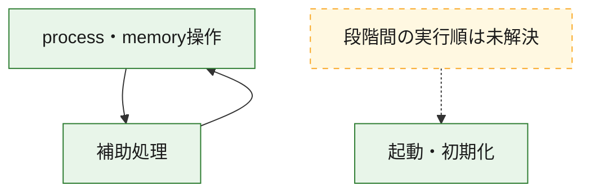
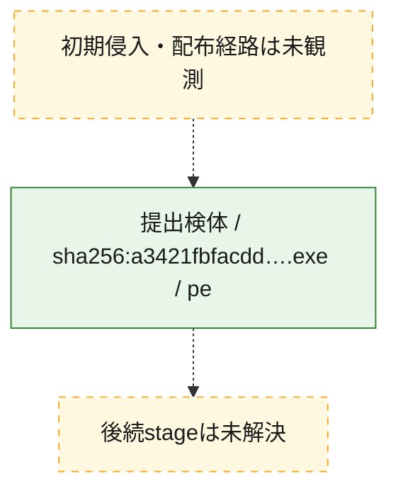
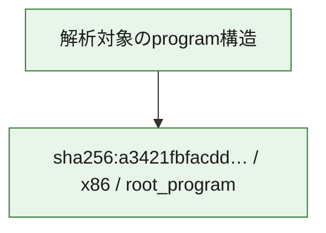

# 全体ロジック：a3421fbfacdd45de64aca2f6f56334d0cc8858e9e40d5d84a15cf4c0b4dee255

代表関数の静的証跡から、起動・初期化、process・memory操作の処理群を確認しました。

## 読み方

- phaseの掲載順は解析上の整理順です。observed_call_edgesがない段階間の実行順を断定しません。
- 図の実線は静的に観測した関係、点線と黄色のノードは未観測・未解決の関係を示します。
- 図は静的な要約であり、動的実行を再現するものではありません。
- 詳細な関数解説とfingerprintは[STATIC-LOGIC.md](STATIC-LOGIC.md)を参照してください。

## 静的可視化

### 実行フロー

### 感染チェーン

### モジュール関係

## 処理段階

### 1. 起動・初期化

entry pointから初期化と後続処理への移行を確認します。
確度: `confirmed_static_function_evidence`

- `a3421fbfacdd45de64aca2f6f56334d0cc8858e9e40d5d84a15cf4c0b4dee255:ghidra:14000c950` — 初期化と主要処理への分岐を行う入口関数です。 状態: `succeeded`、選定理由: `entry_point`, `meaningful_symbol_name`, `reviewed_call_centrality:22`, `role:entrypoint`

### 2. process・memory操作

process、thread、module、memory操作と実行移行を確認します。
確度: `confirmed_static_function_evidence_with_limits`

- `a3421fbfacdd45de64aca2f6f56334d0cc8858e9e40d5d84a15cf4c0b4dee255:ghidra:14000278e` — process、thread、module、またはmemory操作に関係する関数です。 状態: `limited_bad_instruction_or_flow`、選定理由: `context_representative`, `reviewed_call_centrality:18`, `role:process_or_memory_operation`

### 3. 補助処理

主要処理を支える一般内部関数またはlibrary処理を確認します。
確度: `confirmed_static_function_evidence_with_limits`

- `a3421fbfacdd45de64aca2f6f56334d0cc8858e9e40d5d84a15cf4c0b4dee255:ghidra:140001000` — 検体内部の一般処理を実装する関数です。 状態: `succeeded`、選定理由: `context_representative`, `reviewed_call_centrality:3`
- `a3421fbfacdd45de64aca2f6f56334d0cc8858e9e40d5d84a15cf4c0b4dee255:ghidra:14000106c` — 検体内部の一般処理を実装する関数です。 状態: `succeeded`、選定理由: `context_representative`, `reviewed_call_centrality:5`
- `a3421fbfacdd45de64aca2f6f56334d0cc8858e9e40d5d84a15cf4c0b4dee255:ghidra:1400011d8` — 検体内部の一般処理を実装する関数です。 状態: `succeeded`、選定理由: `context_representative`, `reviewed_call_centrality:5`
- `a3421fbfacdd45de64aca2f6f56334d0cc8858e9e40d5d84a15cf4c0b4dee255:ghidra:140001219` — 検体内部の一般処理を実装する関数です。 状態: `limited_bad_instruction_or_flow`、選定理由: `context_representative`, `reviewed_call_centrality:4`
- `a3421fbfacdd45de64aca2f6f56334d0cc8858e9e40d5d84a15cf4c0b4dee255:ghidra:140001280` — 検体内部の一般処理を実装する関数です。 状態: `succeeded`、選定理由: `context_representative`, `reviewed_call_centrality:2`
- `a3421fbfacdd45de64aca2f6f56334d0cc8858e9e40d5d84a15cf4c0b4dee255:ghidra:1400014e0` — 検体内部の一般処理を実装する関数です。 状態: `succeeded`、選定理由: `context_representative`, `reviewed_call_centrality:3`
- `a3421fbfacdd45de64aca2f6f56334d0cc8858e9e40d5d84a15cf4c0b4dee255:ghidra:140001544` — 検体内部の一般処理を実装する関数です。 状態: `succeeded`、選定理由: `context_representative`, `reviewed_call_centrality:3`
- `a3421fbfacdd45de64aca2f6f56334d0cc8858e9e40d5d84a15cf4c0b4dee255:ghidra:1400015d5` — 検体内部の一般処理を実装する関数です。 状態: `succeeded`、選定理由: `context_representative`, `reviewed_call_centrality:2`
- `a3421fbfacdd45de64aca2f6f56334d0cc8858e9e40d5d84a15cf4c0b4dee255:ghidra:140001647` — 検体内部の一般処理を実装する関数です。 状態: `succeeded`、選定理由: `context_representative`, `reviewed_call_centrality:4`
- `a3421fbfacdd45de64aca2f6f56334d0cc8858e9e40d5d84a15cf4c0b4dee255:ghidra:14000168c` — 検体内部の一般処理を実装する関数です。 状態: `succeeded`、選定理由: `context_representative`, `reviewed_call_centrality:5`
- `a3421fbfacdd45de64aca2f6f56334d0cc8858e9e40d5d84a15cf4c0b4dee255:ghidra:1400016fb` — 検体内部の一般処理を実装する関数です。 状態: `limited_bad_instruction_or_flow`、選定理由: `context_representative`, `reviewed_call_centrality:13`
- `a3421fbfacdd45de64aca2f6f56334d0cc8858e9e40d5d84a15cf4c0b4dee255:ghidra:140001725` — 検体内部の一般処理を実装する関数です。 状態: `limited_bad_instruction_or_flow`、選定理由: `context_representative`, `reviewed_call_centrality:8`
- `a3421fbfacdd45de64aca2f6f56334d0cc8858e9e40d5d84a15cf4c0b4dee255:ghidra:14000175a` — 検体内部の一般処理を実装する関数です。 状態: `limited_bad_instruction_or_flow`、選定理由: `context_representative`, `reviewed_call_centrality:6`
- `a3421fbfacdd45de64aca2f6f56334d0cc8858e9e40d5d84a15cf4c0b4dee255:ghidra:1400017d4` — 検体内部の一般処理を実装する関数です。 状態: `succeeded`、選定理由: `context_representative`, `reviewed_call_centrality:2`
- `a3421fbfacdd45de64aca2f6f56334d0cc8858e9e40d5d84a15cf4c0b4dee255:ghidra:140001c61` — compiler生成処理または汎用library処理とみられる関数です。 状態: `limited_bad_instruction_or_flow`、選定理由: `entry_point`, `meaningful_symbol_name`, `reviewed_call_centrality:7`
- `a3421fbfacdd45de64aca2f6f56334d0cc8858e9e40d5d84a15cf4c0b4dee255:ghidra:140001d8a` — 検体内部の一般処理を実装する関数です。 状態: `succeeded`、選定理由: `context_representative`, `reviewed_call_centrality:2`
- `a3421fbfacdd45de64aca2f6f56334d0cc8858e9e40d5d84a15cf4c0b4dee255:ghidra:140001dc2` — 検体内部の一般処理を実装する関数です。 状態: `limited_bad_instruction_or_flow`、選定理由: `context_representative`, `reviewed_call_centrality:4`
- `a3421fbfacdd45de64aca2f6f56334d0cc8858e9e40d5d84a15cf4c0b4dee255:ghidra:140001df1` — 検体内部の一般処理を実装する関数です。 状態: `succeeded`、選定理由: `context_representative`, `reviewed_call_centrality:2`
- `a3421fbfacdd45de64aca2f6f56334d0cc8858e9e40d5d84a15cf4c0b4dee255:ghidra:140001e20` — 検体内部の一般処理を実装する関数です。 状態: `succeeded`、選定理由: `context_representative`, `reviewed_call_centrality:1`
- `a3421fbfacdd45de64aca2f6f56334d0cc8858e9e40d5d84a15cf4c0b4dee255:ghidra:140001f12` — 検体内部の一般処理を実装する関数です。 状態: `succeeded`、選定理由: `context_representative`, `reviewed_call_centrality:26`
- `a3421fbfacdd45de64aca2f6f56334d0cc8858e9e40d5d84a15cf4c0b4dee255:ghidra:140002578` — 検体内部の一般処理を実装する関数です。 状態: `succeeded`、選定理由: `context_representative`, `reviewed_call_centrality:9`
- `a3421fbfacdd45de64aca2f6f56334d0cc8858e9e40d5d84a15cf4c0b4dee255:ghidra:140002619` — 検体内部の一般処理を実装する関数です。 状態: `limited_bad_instruction_or_flow`、選定理由: `context_representative`, `reviewed_call_centrality:4`
- `a3421fbfacdd45de64aca2f6f56334d0cc8858e9e40d5d84a15cf4c0b4dee255:ghidra:14000267a` — 検体内部の一般処理を実装する関数です。 状態: `succeeded`、選定理由: `context_representative`, `reviewed_call_centrality:1`
- `a3421fbfacdd45de64aca2f6f56334d0cc8858e9e40d5d84a15cf4c0b4dee255:ghidra:140003245` — 検体内部の一般処理を実装する関数です。 状態: `succeeded`、選定理由: `context_representative`, `reviewed_call_centrality:1`
- `a3421fbfacdd45de64aca2f6f56334d0cc8858e9e40d5d84a15cf4c0b4dee255:ghidra:14000325f` — 検体内部の一般処理を実装する関数です。 状態: `limited_bad_instruction_or_flow`、選定理由: `context_representative`, `reviewed_call_centrality:6`
- `a3421fbfacdd45de64aca2f6f56334d0cc8858e9e40d5d84a15cf4c0b4dee255:ghidra:1400032c2` — 検体内部の一般処理を実装する関数です。 状態: `succeeded`、選定理由: `context_representative`, `reviewed_call_centrality:1`
- `a3421fbfacdd45de64aca2f6f56334d0cc8858e9e40d5d84a15cf4c0b4dee255:ghidra:140003321` — 検体内部の一般処理を実装する関数です。 状態: `limited_bad_instruction_or_flow`、選定理由: `context_representative`, `reviewed_call_centrality:4`
- `a3421fbfacdd45de64aca2f6f56334d0cc8858e9e40d5d84a15cf4c0b4dee255:ghidra:140003350` — 検体内部の一般処理を実装する関数です。 状態: `limited_bad_instruction_or_flow`、選定理由: `context_representative`, `reviewed_call_centrality:6`
- `a3421fbfacdd45de64aca2f6f56334d0cc8858e9e40d5d84a15cf4c0b4dee255:ghidra:14000338e` — 検体内部の一般処理を実装する関数です。 状態: `limited_bad_instruction_or_flow`、選定理由: `context_representative`, `reviewed_call_centrality:4`
- `a3421fbfacdd45de64aca2f6f56334d0cc8858e9e40d5d84a15cf4c0b4dee255:ghidra:1400033f8` — 検体内部の一般処理を実装する関数です。 状態: `succeeded`、選定理由: `context_representative`, `reviewed_call_centrality:1`

## 観測したcall関係

- `a3421fbfacdd45de64aca2f6f56334d0cc8858e9e40d5d84a15cf4c0b4dee255:ghidra:140001000` → `a3421fbfacdd45de64aca2f6f56334d0cc8858e9e40d5d84a15cf4c0b4dee255:ghidra:140001725` （`support` → `support`）
- `a3421fbfacdd45de64aca2f6f56334d0cc8858e9e40d5d84a15cf4c0b4dee255:ghidra:140001280` → `a3421fbfacdd45de64aca2f6f56334d0cc8858e9e40d5d84a15cf4c0b4dee255:ghidra:1400011d8` （`support` → `support`）
- `a3421fbfacdd45de64aca2f6f56334d0cc8858e9e40d5d84a15cf4c0b4dee255:ghidra:1400014e0` → `a3421fbfacdd45de64aca2f6f56334d0cc8858e9e40d5d84a15cf4c0b4dee255:ghidra:140001725` （`support` → `support`）
- `a3421fbfacdd45de64aca2f6f56334d0cc8858e9e40d5d84a15cf4c0b4dee255:ghidra:1400016fb` → `a3421fbfacdd45de64aca2f6f56334d0cc8858e9e40d5d84a15cf4c0b4dee255:ghidra:1400011d8` （`support` → `support`）
- `a3421fbfacdd45de64aca2f6f56334d0cc8858e9e40d5d84a15cf4c0b4dee255:ghidra:1400016fb` → `a3421fbfacdd45de64aca2f6f56334d0cc8858e9e40d5d84a15cf4c0b4dee255:ghidra:14000278e` （`support` → `execution`）
- `a3421fbfacdd45de64aca2f6f56334d0cc8858e9e40d5d84a15cf4c0b4dee255:ghidra:140001df1` → `a3421fbfacdd45de64aca2f6f56334d0cc8858e9e40d5d84a15cf4c0b4dee255:ghidra:140001725` （`support` → `support`）
- `a3421fbfacdd45de64aca2f6f56334d0cc8858e9e40d5d84a15cf4c0b4dee255:ghidra:140001e20` → `a3421fbfacdd45de64aca2f6f56334d0cc8858e9e40d5d84a15cf4c0b4dee255:ghidra:1400011d8` （`support` → `support`）
- `a3421fbfacdd45de64aca2f6f56334d0cc8858e9e40d5d84a15cf4c0b4dee255:ghidra:140001f12` → `a3421fbfacdd45de64aca2f6f56334d0cc8858e9e40d5d84a15cf4c0b4dee255:ghidra:14000175a` （`support` → `support`）
- `a3421fbfacdd45de64aca2f6f56334d0cc8858e9e40d5d84a15cf4c0b4dee255:ghidra:140001f12` → `a3421fbfacdd45de64aca2f6f56334d0cc8858e9e40d5d84a15cf4c0b4dee255:ghidra:140002578` （`support` → `support`）
- `a3421fbfacdd45de64aca2f6f56334d0cc8858e9e40d5d84a15cf4c0b4dee255:ghidra:14000278e` → `a3421fbfacdd45de64aca2f6f56334d0cc8858e9e40d5d84a15cf4c0b4dee255:ghidra:140001725` （`execution` → `support`）
- `a3421fbfacdd45de64aca2f6f56334d0cc8858e9e40d5d84a15cf4c0b4dee255:ghidra:140003245` → `a3421fbfacdd45de64aca2f6f56334d0cc8858e9e40d5d84a15cf4c0b4dee255:ghidra:140001f12` （`support` → `support`）
- `ghidra-function:057cfb5f1e175f139dd9ba20` → `ghidra-function:36889dd5a8a0bacca5279cf3` （`unclassified` → `unclassified`）
- `ghidra-function:11b2333151394ddf165a4b67` → `ghidra-external:e2501c4a56ce08d0d915439f` （`unclassified` → `unclassified`）
- `ghidra-function:11b2333151394ddf165a4b67` → `ghidra-function:241ef7fe339843728c349868` （`unclassified` → `unclassified`）
- `ghidra-function:11b2333151394ddf165a4b67` → `ghidra-function:411955787a7f50b18830c649` （`unclassified` → `unclassified`）
- `ghidra-function:1948513b3ea213264d73782e` → `ghidra-external:0426e25588569b3bc02b4452` （`unclassified` → `unclassified`）
- `ghidra-function:1948513b3ea213264d73782e` → `ghidra-external:bb96d7d0cf950aa08753797e` （`unclassified` → `unclassified`）
- `ghidra-function:1948513b3ea213264d73782e` → `ghidra-external:e2501c4a56ce08d0d915439f` （`unclassified` → `unclassified`）
- `ghidra-function:1948513b3ea213264d73782e` → `ghidra-function:677b1d6d722e8608c8f026c7` （`unclassified` → `unclassified`）
- `ghidra-function:1966b0b8653ed382223da20e` → `ghidra-external:0426e25588569b3bc02b4452` （`unclassified` → `unclassified`）
- `ghidra-function:1966b0b8653ed382223da20e` → `ghidra-external:bb96d7d0cf950aa08753797e` （`unclassified` → `unclassified`）
- `ghidra-function:1966b0b8653ed382223da20e` → `ghidra-function:28505c065123427513502f85` （`unclassified` → `unclassified`）
- `ghidra-function:1966b0b8653ed382223da20e` → `ghidra-function:36889dd5a8a0bacca5279cf3` （`unclassified` → `unclassified`）
- `ghidra-function:1966b0b8653ed382223da20e` → `ghidra-function:3e05b278b8c98e05493912e5` （`unclassified` → `unclassified`）
- `ghidra-function:1966b0b8653ed382223da20e` → `ghidra-function:44e9b3c000718db4fb42a870` （`unclassified` → `unclassified`）
- `ghidra-function:1966b0b8653ed382223da20e` → `ghidra-function:4738d0b4a5ca4f471afc01cb` （`unclassified` → `unclassified`）
- `ghidra-function:1966b0b8653ed382223da20e` → `ghidra-function:83ae8b0b0824cdcf4e290b6f` （`unclassified` → `unclassified`）
- `ghidra-function:1966b0b8653ed382223da20e` → `ghidra-function:ac14b4a5b2c75a086a530173` （`unclassified` → `unclassified`）
- `ghidra-function:1966b0b8653ed382223da20e` → `ghidra-function:b50c074787e43f25b814cea7` （`unclassified` → `unclassified`）
- `ghidra-function:19e865fff0dfb51ba09b220c` → `ghidra-function:28505c065123427513502f85` （`unclassified` → `unclassified`）
- `ghidra-function:19e865fff0dfb51ba09b220c` → `ghidra-function:83ae8b0b0824cdcf4e290b6f` （`unclassified` → `unclassified`）
- `ghidra-function:1c91e173dcdd18751087cb16` → `ghidra-function:83ae8b0b0824cdcf4e290b6f` （`unclassified` → `unclassified`）
- `ghidra-function:1c91e173dcdd18751087cb16` → `ghidra-function:bb2fc2eae9f10032ffb4af01` （`unclassified` → `unclassified`）
- `ghidra-function:213df7cdc2cd73c9d75bafc2` → `ghidra-function:36889dd5a8a0bacca5279cf3` （`unclassified` → `unclassified`）
- `ghidra-function:213df7cdc2cd73c9d75bafc2` → `ghidra-function:411955787a7f50b18830c649` （`unclassified` → `unclassified`）
- `ghidra-function:34188a0feeea3c3fb43abb06` → `ghidra-external:e2501c4a56ce08d0d915439f` （`unclassified` → `unclassified`）
- `ghidra-function:34188a0feeea3c3fb43abb06` → `ghidra-function:1c91e173dcdd18751087cb16` （`unclassified` → `unclassified`）
- `ghidra-function:36889dd5a8a0bacca5279cf3` → `ghidra-external:e2501c4a56ce08d0d915439f` （`unclassified` → `unclassified`）
- `ghidra-function:36889dd5a8a0bacca5279cf3` → `ghidra-function:241ef7fe339843728c349868` （`unclassified` → `unclassified`）
- `ghidra-function:36c1debf37dd532ed60062b3` → `ghidra-external:0426e25588569b3bc02b4452` （`unclassified` → `unclassified`）
- `ghidra-function:36c1debf37dd532ed60062b3` → `ghidra-external:101cf815397cd3d7f77dbd31` （`unclassified` → `unclassified`）
- `ghidra-function:36c1debf37dd532ed60062b3` → `ghidra-external:b9d0a1ff955eae8ed324a14a` （`unclassified` → `unclassified`）
- `ghidra-function:36c1debf37dd532ed60062b3` → `ghidra-external:bb96d7d0cf950aa08753797e` （`unclassified` → `unclassified`）
- `ghidra-function:36c1debf37dd532ed60062b3` → `ghidra-external:e2501c4a56ce08d0d915439f` （`unclassified` → `unclassified`）
- `ghidra-function:36c1debf37dd532ed60062b3` → `ghidra-function:28505c065123427513502f85` （`unclassified` → `unclassified`）
- `ghidra-function:36c1debf37dd532ed60062b3` → `ghidra-function:411955787a7f50b18830c649` （`unclassified` → `unclassified`）
- `ghidra-function:36c1debf37dd532ed60062b3` → `ghidra-function:7787afaa0ed0270361ea8185` （`unclassified` → `unclassified`）
- `ghidra-function:36c1debf37dd532ed60062b3` → `ghidra-function:83ae8b0b0824cdcf4e290b6f` （`unclassified` → `unclassified`）
- `ghidra-function:36c1debf37dd532ed60062b3` → `ghidra-function:8ddc3ed5943e5322eccd7a24` （`unclassified` → `unclassified`）
- `ghidra-function:36c1debf37dd532ed60062b3` → `ghidra-function:99201584246ce7ee52fdf053` （`unclassified` → `unclassified`）
- `ghidra-function:36c1debf37dd532ed60062b3` → `ghidra-function:bfa1d036333da7564af6a14c` （`unclassified` → `unclassified`）
- `ghidra-function:36c1debf37dd532ed60062b3` → `ghidra-function:c5914d58308b7ea8ec755064` （`unclassified` → `unclassified`）
- `ghidra-function:36c1debf37dd532ed60062b3` → `ghidra-function:d5b5e8c76bc931c8a9369126` （`unclassified` → `unclassified`）
- `ghidra-function:36c1debf37dd532ed60062b3` → `ghidra-function:e93eed3243646532e61c398e` （`unclassified` → `unclassified`）
- `ghidra-function:36c1debf37dd532ed60062b3` → `ghidra-function:ecc6c5c47799d756c0b1ebae` （`unclassified` → `unclassified`）
- `ghidra-function:36c1debf37dd532ed60062b3` → `ghidra-function:f019ea248be6804b1e74e5bf` （`unclassified` → `unclassified`）
- `ghidra-function:36c1debf37dd532ed60062b3` → `ghidra-function:fad2d4e888759db03f50a77f` （`unclassified` → `unclassified`）
- `ghidra-function:3e05b278b8c98e05493912e5` → `ghidra-external:0426e25588569b3bc02b4452` （`unclassified` → `unclassified`）
- `ghidra-function:3e05b278b8c98e05493912e5` → `ghidra-external:bb96d7d0cf950aa08753797e` （`unclassified` → `unclassified`）
- `ghidra-function:3e05b278b8c98e05493912e5` → `ghidra-external:d6f80daebb77aaaa758d7772` （`unclassified` → `unclassified`）
- `ghidra-function:3e05b278b8c98e05493912e5` → `ghidra-external:e2501c4a56ce08d0d915439f` （`unclassified` → `unclassified`）
- `ghidra-function:3e05b278b8c98e05493912e5` → `ghidra-function:1c91e173dcdd18751087cb16` （`unclassified` → `unclassified`）
- `ghidra-function:3e05b278b8c98e05493912e5` → `ghidra-function:411955787a7f50b18830c649` （`unclassified` → `unclassified`）
- `ghidra-function:3e05b278b8c98e05493912e5` → `ghidra-function:7fa315afe1c67b9046150380` （`unclassified` → `unclassified`）
- `ghidra-function:3e05b278b8c98e05493912e5` → `ghidra-function:921e08744ff449af459275b7` （`unclassified` → `unclassified`）
- `ghidra-function:3e05b278b8c98e05493912e5` → `ghidra-function:b1a7eeaa1ad9233b0780074e` （`unclassified` → `unclassified`）
- `ghidra-function:3e05b278b8c98e05493912e5` → `ghidra-function:d13f8add0b526157a96902fc` （`unclassified` → `unclassified`）
- `ghidra-function:3e05b278b8c98e05493912e5` → `ghidra-function:d9a2e2c12364026e2bd4ddf0` （`unclassified` → `unclassified`）
- `ghidra-function:3e05b278b8c98e05493912e5` → `ghidra-function:e5f9fcf090fd635701dcf610` （`unclassified` → `unclassified`）
- `ghidra-function:4800f535ef0a7b94f214ab5b` → `ghidra-external:d6f80daebb77aaaa758d7772` （`unclassified` → `unclassified`）
- `ghidra-function:4800f535ef0a7b94f214ab5b` → `ghidra-function:9543bd331ea608d66f305aa2` （`unclassified` → `unclassified`）
- `ghidra-function:4800f535ef0a7b94f214ab5b` → `ghidra-function:b3a027bd1c5345ccdea6535d` （`unclassified` → `unclassified`）
- `ghidra-function:4c63c3327e48cb26315eb99a` → `ghidra-function:4738d0b4a5ca4f471afc01cb` （`unclassified` → `unclassified`）
- `ghidra-function:4c63c3327e48cb26315eb99a` → `ghidra-function:ea9bc2bf27aca4037d3281b3` （`unclassified` → `unclassified`）
- `ghidra-function:4cbbb06c583a41007a588343` → `ghidra-external:e2501c4a56ce08d0d915439f` （`unclassified` → `unclassified`）
- `ghidra-function:4cbbb06c583a41007a588343` → `ghidra-function:1c91e173dcdd18751087cb16` （`unclassified` → `unclassified`）
- `ghidra-function:4cbbb06c583a41007a588343` → `ghidra-function:b50c074787e43f25b814cea7` （`unclassified` → `unclassified`）
- `ghidra-function:577c8377687282d17a0cda2a` → `ghidra-external:e2501c4a56ce08d0d915439f` （`unclassified` → `unclassified`）
- `ghidra-function:577c8377687282d17a0cda2a` → `ghidra-function:1c91e173dcdd18751087cb16` （`unclassified` → `unclassified`）
- `ghidra-function:577c8377687282d17a0cda2a` → `ghidra-function:411955787a7f50b18830c649` （`unclassified` → `unclassified`）
- `ghidra-function:6ffa80f31756f29063d0952e` → `ghidra-external:e2501c4a56ce08d0d915439f` （`unclassified` → `unclassified`）
- `ghidra-function:6ffa80f31756f29063d0952e` → `ghidra-function:241ef7fe339843728c349868` （`unclassified` → `unclassified`）
- `ghidra-function:87839ceb8e86c8a629662352` → `ghidra-function:67dce9b9425897e1ee3d9965` （`unclassified` → `unclassified`）
- `ghidra-function:87839ceb8e86c8a629662352` → `ghidra-function:7787afaa0ed0270361ea8185` （`unclassified` → `unclassified`）
- `ghidra-function:96e84b379787ef06de90a557` → `ghidra-external:54f123088af75065e101ba2c` （`unclassified` → `unclassified`）
- `ghidra-function:96e84b379787ef06de90a557` → `ghidra-function:28505c065123427513502f85` （`unclassified` → `unclassified`）
- `ghidra-function:96e84b379787ef06de90a557` → `ghidra-function:83ae8b0b0824cdcf4e290b6f` （`unclassified` → `unclassified`）
- `ghidra-function:96e84b379787ef06de90a557` → `ghidra-function:8770ee7cd2bd68451389c200` （`unclassified` → `unclassified`）
- `ghidra-function:99201584246ce7ee52fdf053` → `ghidra-function:28505c065123427513502f85` （`unclassified` → `unclassified`）
- `ghidra-function:99201584246ce7ee52fdf053` → `ghidra-function:83ae8b0b0824cdcf4e290b6f` （`unclassified` → `unclassified`）
- `ghidra-function:99201584246ce7ee52fdf053` → `ghidra-function:8770ee7cd2bd68451389c200` （`unclassified` → `unclassified`）
- `ghidra-function:a327cf27d9ec8f8d61c91fe5` → `ghidra-function:411955787a7f50b18830c649` （`unclassified` → `unclassified`）
- `ghidra-function:a49fdd8040bb03539ebd650c` → `ghidra-function:4738d0b4a5ca4f471afc01cb` （`unclassified` → `unclassified`）
- `ghidra-function:a49fdd8040bb03539ebd650c` → `ghidra-function:ea9bc2bf27aca4037d3281b3` （`unclassified` → `unclassified`）
- `ghidra-function:a6e5d17cce5b4d750755b2b5` → `ghidra-function:4738d0b4a5ca4f471afc01cb` （`unclassified` → `unclassified`）
- `ghidra-function:a6e5d17cce5b4d750755b2b5` → `ghidra-function:ea9bc2bf27aca4037d3281b3` （`unclassified` → `unclassified`）
- `ghidra-function:b6f8cc7cd7d5362b121a6aff` → `ghidra-function:28505c065123427513502f85` （`unclassified` → `unclassified`）
- `ghidra-function:b6f8cc7cd7d5362b121a6aff` → `ghidra-function:83ae8b0b0824cdcf4e290b6f` （`unclassified` → `unclassified`）
- `ghidra-function:beaa0e40d150ead426871046` → `ghidra-external:e2501c4a56ce08d0d915439f` （`unclassified` → `unclassified`）
- `ghidra-function:dc1b761b97f533a0807092b7` → `ghidra-external:e2501c4a56ce08d0d915439f` （`unclassified` → `unclassified`）
- `ghidra-function:e5953a3c4bbf2b09651ecafc` → `ghidra-external:0426e25588569b3bc02b4452` （`unclassified` → `unclassified`）
- `ghidra-function:e5953a3c4bbf2b09651ecafc` → `ghidra-external:bb96d7d0cf950aa08753797e` （`unclassified` → `unclassified`）
- `ghidra-function:e5953a3c4bbf2b09651ecafc` → `ghidra-external:e2501c4a56ce08d0d915439f` （`unclassified` → `unclassified`）
- `ghidra-function:e5953a3c4bbf2b09651ecafc` → `ghidra-function:28505c065123427513502f85` （`unclassified` → `unclassified`）
- `ghidra-function:e5953a3c4bbf2b09651ecafc` → `ghidra-function:83ae8b0b0824cdcf4e290b6f` （`unclassified` → `unclassified`）
- `ghidra-function:e920cbb9142dc58d72ebbc11` → `ghidra-external:10b453cd7f753f8868992f43` （`unclassified` → `unclassified`）
- `ghidra-function:e920cbb9142dc58d72ebbc11` → `ghidra-function:009c364082ad1f2eb7c1b572` （`unclassified` → `unclassified`）
- `ghidra-function:ecc6c5c47799d756c0b1ebae` → `ghidra-external:7dd26e2e769bbf6a1dd0f0ec` （`unclassified` → `unclassified`）
- `ghidra-function:ecc6c5c47799d756c0b1ebae` → `ghidra-external:e2501c4a56ce08d0d915439f` （`unclassified` → `unclassified`）
- `ghidra-function:ecc6c5c47799d756c0b1ebae` → `ghidra-function:4404d989aaa4e5018883a3f6` （`unclassified` → `unclassified`）
- `ghidra-function:ecc6c5c47799d756c0b1ebae` → `ghidra-function:87795bf184825324b1d240c6` （`unclassified` → `unclassified`）
- `ghidra-function:ecc6c5c47799d756c0b1ebae` → `ghidra-function:9ccfa7fab6c9b464f0a50118` （`unclassified` → `unclassified`）
- `ghidra-function:ed67a780a5aef9143550856e` → `ghidra-external:145d36bedc8c717df04029b1` （`unclassified` → `unclassified`）
- `ghidra-function:ed67a780a5aef9143550856e` → `ghidra-external:1bccbc0377c85e4e146193b6` （`unclassified` → `unclassified`）
- `ghidra-function:ed67a780a5aef9143550856e` → `ghidra-external:3a46362c0f12ead744f66737` （`unclassified` → `unclassified`）
- `ghidra-function:ed67a780a5aef9143550856e` → `ghidra-external:57864fa31f950856ceedb0f7` （`unclassified` → `unclassified`）
- `ghidra-function:ed67a780a5aef9143550856e` → `ghidra-external:71453e3404de432bb198dda1` （`unclassified` → `unclassified`）
- `ghidra-function:ed67a780a5aef9143550856e` → `ghidra-external:7dd26e2e769bbf6a1dd0f0ec` （`unclassified` → `unclassified`）
- `ghidra-function:ed67a780a5aef9143550856e` → `ghidra-external:8ca5d66ed4f1d67a8d98522f` （`unclassified` → `unclassified`）
- `ghidra-function:ed67a780a5aef9143550856e` → `ghidra-external:adecd9c38ab0182bcfe9c725` （`unclassified` → `unclassified`）
- `ghidra-function:ed67a780a5aef9143550856e` → `ghidra-external:b042685f251b4d0968d47223` （`unclassified` → `unclassified`）
- `ghidra-function:ed67a780a5aef9143550856e` → `ghidra-external:c9294c192cc504572a4d2fc0` （`unclassified` → `unclassified`）
- `ghidra-function:ed67a780a5aef9143550856e` → `ghidra-function:2fc3fa322d9cb4befd932174` （`unclassified` → `unclassified`）
- `ghidra-function:ed67a780a5aef9143550856e` → `ghidra-function:4047b8c91707fa50ca7d87ea` （`unclassified` → `unclassified`）
- `ghidra-function:ed67a780a5aef9143550856e` → `ghidra-function:44decf2521df5caf5230e1d6` （`unclassified` → `unclassified`）
- `ghidra-function:ed67a780a5aef9143550856e` → `ghidra-function:55f8f9734790a680f6b7e5d1` （`unclassified` → `unclassified`）
- `ghidra-function:ed67a780a5aef9143550856e` → `ghidra-function:76b1dfae24bdb2dc2b863c14` （`unclassified` → `unclassified`）
- `ghidra-function:ed67a780a5aef9143550856e` → `ghidra-function:7aed2ff737d33dd5ae9297ab` （`unclassified` → `unclassified`）
- `ghidra-function:ed67a780a5aef9143550856e` → `ghidra-function:8e5f38bd3af9d5cc186657d5` （`unclassified` → `unclassified`）
- `ghidra-function:ed67a780a5aef9143550856e` → `ghidra-function:979b2c936a0691aaa1848598` （`unclassified` → `unclassified`）
- `ghidra-function:ed67a780a5aef9143550856e` → `ghidra-function:a74851bf4353838e1cf248f1` （`unclassified` → `unclassified`）
- `ghidra-function:ed67a780a5aef9143550856e` → `ghidra-function:cd7b180c74f8043aa25859ec` （`unclassified` → `unclassified`）
- `ghidra-function:ed67a780a5aef9143550856e` → `ghidra-function:daf00e687c8c546473557168` （`unclassified` → `unclassified`）
- `ghidra-function:ed67a780a5aef9143550856e` → `ghidra-function:e0ce82c55dd2b3bfc5750ed2` （`unclassified` → `unclassified`）
- `ghidra-function:eef34486a99e2f15f13560fd` → `ghidra-external:0426e25588569b3bc02b4452` （`unclassified` → `unclassified`）
- `ghidra-function:eef34486a99e2f15f13560fd` → `ghidra-external:bb96d7d0cf950aa08753797e` （`unclassified` → `unclassified`）
- `ghidra-function:eef34486a99e2f15f13560fd` → `ghidra-function:28505c065123427513502f85` （`unclassified` → `unclassified`）
- `ghidra-function:eef34486a99e2f15f13560fd` → `ghidra-function:83ae8b0b0824cdcf4e290b6f` （`unclassified` → `unclassified`）
- `ghidra-function:f06f121ee18897cf8490e571` → `ghidra-function:36c1debf37dd532ed60062b3` （`unclassified` → `unclassified`）
- `ghidra-function:fc644037f4362edf7b5a6162` → `ghidra-external:e2501c4a56ce08d0d915439f` （`unclassified` → `unclassified`）
- `ghidra-function:fc644037f4362edf7b5a6162` → `ghidra-function:241ef7fe339843728c349868` （`unclassified` → `unclassified`）

## 解析範囲と制約

- 選定外関数は全体inventoryへ残しますが、関数本体の個別解説対象にはしていません。
- indirect call、難読化、packer、VM、壊れたcontrol flowによりcall関係が欠落する場合があります。
- 文書は静的解析に基づき、検体実行や外部通信による動的確認は行っていません。
