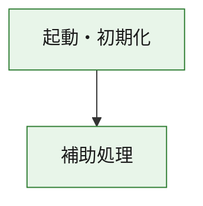
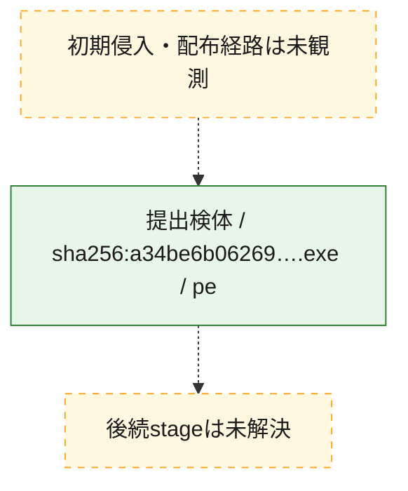
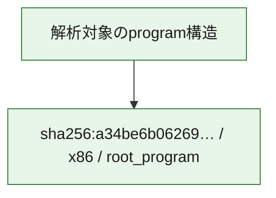

# 全体ロジック：a34be6b062691b7f9483b0522f34136c510d91c31c3461afaf3d199e22f17b5b

代表関数の静的証跡から、起動・初期化の処理群を確認しました。

## 読み方

- phaseの掲載順は解析上の整理順です。observed_call_edgesがない段階間の実行順を断定しません。
- 図の実線は静的に観測した関係、点線と黄色のノードは未観測・未解決の関係を示します。
- 図は静的な要約であり、動的実行を再現するものではありません。
- 詳細な関数解説とfingerprintは[STATIC-LOGIC.md](STATIC-LOGIC.md)を参照してください。

## 静的可視化

### 実行フロー

### 感染チェーン

### モジュール関係

## 処理段階

### 1. 起動・初期化

entry pointから初期化と後続処理への移行を確認します。
確度: `confirmed_static_function_evidence`

- `a34be6b062691b7f9483b0522f34136c510d91c31c3461afaf3d199e22f17b5b:ghidra:180001010` — 初期化と主要処理への分岐を行う入口関数です。 状態: `succeeded`、選定理由: `entry_point`, `meaningful_symbol_name`, `reviewed_call_centrality:22`, `role:entrypoint`, `small_program_complete_context`

### 2. 補助処理

主要処理を支える一般内部関数またはlibrary処理を確認します。
確度: `confirmed_static_function_evidence`

- `a34be6b062691b7f9483b0522f34136c510d91c31c3461afaf3d199e22f17b5b:ghidra:180001240` — 検体内部の一般処理を実装する関数です。 状態: `succeeded`、選定理由: `context_representative`, `reviewed_call_centrality:2`, `small_program_complete_context`
- `a34be6b062691b7f9483b0522f34136c510d91c31c3461afaf3d199e22f17b5b:ghidra:180001350` — 検体内部の一般処理を実装する関数です。 状態: `succeeded`、選定理由: `context_representative`, `reviewed_call_centrality:25`, `small_program_complete_context`
- `a34be6b062691b7f9483b0522f34136c510d91c31c3461afaf3d199e22f17b5b:ghidra:180003780` — 検体内部の一般処理を実装する関数です。 状態: `succeeded`、選定理由: `context_representative`, `reviewed_call_centrality:2`, `small_program_complete_context`
- `a34be6b062691b7f9483b0522f34136c510d91c31c3461afaf3d199e22f17b5b:ghidra:1800038e0` — 検体内部の一般処理を実装する関数です。 状態: `succeeded`、選定理由: `context_representative`, `reviewed_call_centrality:2`, `small_program_complete_context`

## 観測したcall関係

- `a34be6b062691b7f9483b0522f34136c510d91c31c3461afaf3d199e22f17b5b:ghidra:180001010` → `a34be6b062691b7f9483b0522f34136c510d91c31c3461afaf3d199e22f17b5b:ghidra:180001240` （`startup` → `support`）
- `a34be6b062691b7f9483b0522f34136c510d91c31c3461afaf3d199e22f17b5b:ghidra:180001010` → `a34be6b062691b7f9483b0522f34136c510d91c31c3461afaf3d199e22f17b5b:ghidra:180001350` （`startup` → `support`）
- `a34be6b062691b7f9483b0522f34136c510d91c31c3461afaf3d199e22f17b5b:ghidra:180001350` → `a34be6b062691b7f9483b0522f34136c510d91c31c3461afaf3d199e22f17b5b:ghidra:180001240` （`support` → `support`）
- `a34be6b062691b7f9483b0522f34136c510d91c31c3461afaf3d199e22f17b5b:ghidra:180001350` → `a34be6b062691b7f9483b0522f34136c510d91c31c3461afaf3d199e22f17b5b:ghidra:180003780` （`support` → `support`）
- `a34be6b062691b7f9483b0522f34136c510d91c31c3461afaf3d199e22f17b5b:ghidra:180001350` → `a34be6b062691b7f9483b0522f34136c510d91c31c3461afaf3d199e22f17b5b:ghidra:1800038e0` （`support` → `support`）
- `a34be6b062691b7f9483b0522f34136c510d91c31c3461afaf3d199e22f17b5b:ghidra:180003780` → `a34be6b062691b7f9483b0522f34136c510d91c31c3461afaf3d199e22f17b5b:ghidra:1800038e0` （`support` → `support`）
- `ghidra-function:7af7084e8082256e3a007856` → `ghidra-external:0d4fdc3e26f6b6d3a5a47e1f` （`unclassified` → `unclassified`）
- `ghidra-function:7af7084e8082256e3a007856` → `ghidra-external:1bad6f94edf73ee4ec20ce79` （`unclassified` → `unclassified`）
- `ghidra-function:7af7084e8082256e3a007856` → `ghidra-external:22ddd04480aaf94eae7e0d6e` （`unclassified` → `unclassified`）
- `ghidra-function:7af7084e8082256e3a007856` → `ghidra-external:4cb93a5dd5fa4747551152fb` （`unclassified` → `unclassified`）
- `ghidra-function:7af7084e8082256e3a007856` → `ghidra-external:5004a9adc1082146d3b653b3` （`unclassified` → `unclassified`）
- `ghidra-function:7af7084e8082256e3a007856` → `ghidra-external:54c3aace9eac2de8ea877dec` （`unclassified` → `unclassified`）
- `ghidra-function:7af7084e8082256e3a007856` → `ghidra-external:5902aa25716aea7db37d9ab2` （`unclassified` → `unclassified`）
- `ghidra-function:7af7084e8082256e3a007856` → `ghidra-external:5e3d10f125693da403a734ac` （`unclassified` → `unclassified`）
- `ghidra-function:7af7084e8082256e3a007856` → `ghidra-external:5fd029e4257ee04281e334ec` （`unclassified` → `unclassified`）
- `ghidra-function:7af7084e8082256e3a007856` → `ghidra-external:6c1974dbc9b0cc125a63723b` （`unclassified` → `unclassified`）
- `ghidra-function:7af7084e8082256e3a007856` → `ghidra-external:701d0502a5050ecb0a4223b4` （`unclassified` → `unclassified`）
- `ghidra-function:7af7084e8082256e3a007856` → `ghidra-external:7cfa5ea50b93870c4a38bc6b` （`unclassified` → `unclassified`）
- `ghidra-function:7af7084e8082256e3a007856` → `ghidra-external:7de8f90ad16ee58d833d6cd5` （`unclassified` → `unclassified`）
- `ghidra-function:7af7084e8082256e3a007856` → `ghidra-external:7f8d2cdfaaf8302206f18262` （`unclassified` → `unclassified`）
- `ghidra-function:7af7084e8082256e3a007856` → `ghidra-external:97a71176d73ce6927bd7f8c0` （`unclassified` → `unclassified`）
- `ghidra-function:7af7084e8082256e3a007856` → `ghidra-external:af7dc06bc556c9e60e2090b6` （`unclassified` → `unclassified`）
- `ghidra-function:7af7084e8082256e3a007856` → `ghidra-external:b5f5c7683278a1ea0cccc6ca` （`unclassified` → `unclassified`）
- `ghidra-function:7af7084e8082256e3a007856` → `ghidra-external:cb8c7e81b4697972030e37e2` （`unclassified` → `unclassified`）
- `ghidra-function:7af7084e8082256e3a007856` → `ghidra-external:d53488dd406d128e7a4fba74` （`unclassified` → `unclassified`）
- `ghidra-function:7af7084e8082256e3a007856` → `ghidra-external:edb2fa899730fc4e3b9a9f8c` （`unclassified` → `unclassified`）
- `ghidra-function:7af7084e8082256e3a007856` → `ghidra-external:fa11c02a66653fd9a2328e8d` （`unclassified` → `unclassified`）
- `ghidra-function:7af7084e8082256e3a007856` → `ghidra-function:2e11575461f710e5c34f92d0` （`unclassified` → `unclassified`）
- `ghidra-function:7af7084e8082256e3a007856` → `ghidra-function:a0bdc27f6176daa1302098e7` （`unclassified` → `unclassified`）
- `ghidra-function:7af7084e8082256e3a007856` → `ghidra-function:a1eba97f39c8456d732e31d4` （`unclassified` → `unclassified`）
- `ghidra-function:a0bdc27f6176daa1302098e7` → `ghidra-function:a1eba97f39c8456d732e31d4` （`unclassified` → `unclassified`）
- `ghidra-function:afdd54e70056d2be7fc44146` → `ghidra-function:095d1fc2f41179456399000e` （`unclassified` → `unclassified`）
- `ghidra-function:afdd54e70056d2be7fc44146` → `ghidra-function:10e5e6eecd311bc061b4e63f` （`unclassified` → `unclassified`）
- `ghidra-function:afdd54e70056d2be7fc44146` → `ghidra-function:14d57f1d78de9caa3a91e9e2` （`unclassified` → `unclassified`）
- `ghidra-function:afdd54e70056d2be7fc44146` → `ghidra-function:2e11575461f710e5c34f92d0` （`unclassified` → `unclassified`）
- `ghidra-function:afdd54e70056d2be7fc44146` → `ghidra-function:4f336842cebdc98b33bf6475` （`unclassified` → `unclassified`）
- `ghidra-function:afdd54e70056d2be7fc44146` → `ghidra-function:56e3a3a8631b540cbc164fb7` （`unclassified` → `unclassified`）
- `ghidra-function:afdd54e70056d2be7fc44146` → `ghidra-function:5c630d254b2232dda7aae49e` （`unclassified` → `unclassified`）
- `ghidra-function:afdd54e70056d2be7fc44146` → `ghidra-function:6e68002022dca6f5f8ba89e7` （`unclassified` → `unclassified`）
- `ghidra-function:afdd54e70056d2be7fc44146` → `ghidra-function:79f0e4b0adc4a686bb00021e` （`unclassified` → `unclassified`）
- `ghidra-function:afdd54e70056d2be7fc44146` → `ghidra-function:7af7084e8082256e3a007856` （`unclassified` → `unclassified`）
- `ghidra-function:afdd54e70056d2be7fc44146` → `ghidra-function:9fc4eb603902d9786946505a` （`unclassified` → `unclassified`）
- `ghidra-function:afdd54e70056d2be7fc44146` → `ghidra-function:f4739e22ef4e4e203a7acb0c` （`unclassified` → `unclassified`）

## 解析範囲と制約

- 選定外関数は全体inventoryへ残しますが、関数本体の個別解説対象にはしていません。
- indirect call、難読化、packer、VM、壊れたcontrol flowによりcall関係が欠落する場合があります。
- 文書は静的解析に基づき、検体実行や外部通信による動的確認は行っていません。
