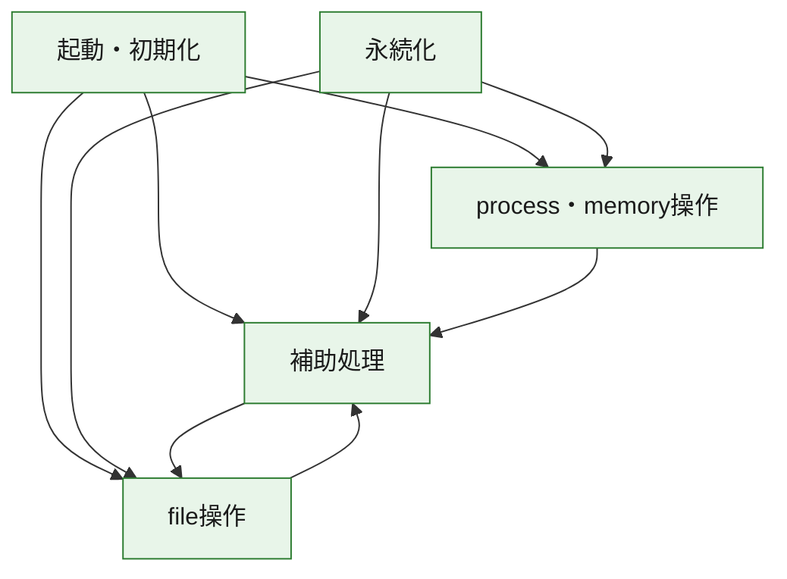
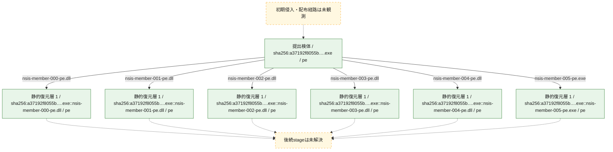
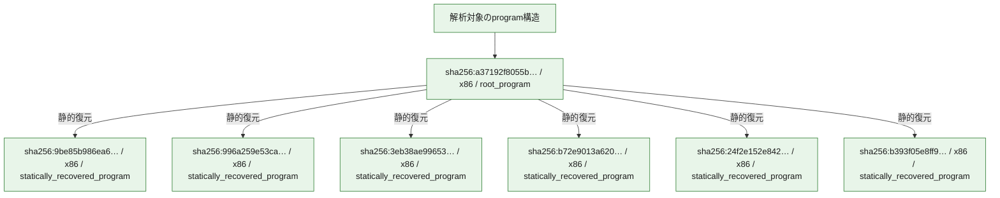

# 全体ロジック：a37192f8055bb5a3ae93f873c50f688fea2e01a8124732e7cb285498908fab35

代表関数の静的証跡から、起動・初期化、永続化、process・memory操作、file操作の処理群を確認しました。

## 読み方

- phaseの掲載順は解析上の整理順です。observed_call_edgesがない段階間の実行順を断定しません。
- 図の実線は静的に観測した関係、点線と黄色のノードは未観測・未解決の関係を示します。
- 図は静的な要約であり、動的実行を再現するものではありません。
- 詳細な関数解説とfingerprintは[STATIC-LOGIC.md](STATIC-LOGIC.md)を参照してください。

## 静的可視化

### 実行フロー

### 感染チェーン

### モジュール関係

## 処理段階

### 1. 起動・初期化

entry pointから初期化と後続処理への移行を確認します。
確度: `confirmed_static_function_evidence`

- `9be85b986ea66a6997dde658abe82b3147ed2a1a3dcb784bb5176f41d22815a6:ghidra:100012ff` — 初期化と主要処理への分岐を行う入口関数です。 状態: `succeeded`、選定理由: `entry_point`, `meaningful_symbol_name`, `role:entrypoint`, `small_program_complete_context`
- `996a259e53ca18b89ec36d038c40148957c978c0fd600a268497d4c92f882a93:ghidra:10002170` — 初期化と主要処理への分岐を行う入口関数です。 状態: `succeeded`、選定理由: `call_graph_centrality:in=0,out=1`, `entry_point`, `meaningful_symbol_name`, `reviewed_call_centrality:1`, `role:entrypoint`, `small_program_complete_context`
- `3eb38ae99653a7dbc724132ee240f6e5c4af4bfe7c01d31d23faf373f9f2eaca:ghidra:10002993` — 初期化と主要処理への分岐を行う入口関数です。 状態: `succeeded`、選定理由: `call_graph_centrality:in=0,out=1`, `entry_point`, `meaningful_symbol_name`, `reviewed_call_centrality:1`, `reviewed_call_centrality:2`, `role:entrypoint`, `small_program_complete_context`
- `b72e9013a6204e9f01076dc38dabbf30870d44dfc66962adbf73619d4331601e:ghidra:1000eab9` — 初期化と主要処理への分岐を行う入口関数です。 状態: `succeeded`、選定理由: `call_graph_centrality:in=0,out=1`, `entry_point`, `meaningful_symbol_name`, `reviewed_call_centrality:1`, `reviewed_call_centrality:5`, `role:entrypoint`, `small_program_complete_context`
- `24f2e152e842aa38062d691b8af5462d69627c51cc9b0dc332cb7227c7fcfb83:ghidra:0040338f` — 初期化と主要処理への分岐を行う入口関数です。 状態: `succeeded`、選定理由: `call_graph_centrality:in=0,out=41`, `entry_point`, `large_function:instructions=410`, `meaningful_symbol_name`, `reviewed_call_centrality:45`, `reviewed_call_centrality:64`, `role:entrypoint`
- `a37192f8055bb5a3ae93f873c50f688fea2e01a8124732e7cb285498908fab35:ghidra:0040338f` — 初期化と主要処理への分岐を行う入口関数です。 状態: `succeeded`、選定理由: `call_graph_centrality:in=0,out=18`, `entry_point`, `large_function:instructions=410`, `meaningful_symbol_name`, `reviewed_call_centrality:35`, `reviewed_call_centrality:67`, `role:entrypoint`, `small_program_complete_context`

### 2. 永続化

自動起動や永続化に関係する設定変更を確認します。
確度: `confirmed_static_function_evidence_with_limits`

- `24f2e152e842aa38062d691b8af5462d69627c51cc9b0dc332cb7227c7fcfb83:ghidra:00401434` — 自動起動または永続化に関係する処理を含む関数です。 状態: `failed`、選定理由: `call_graph_centrality:in=1,out=105`, `entry_reachable_call_depth:3`, `large_function:instructions=1908`, `reviewed_call_centrality:110`, `reviewed_call_centrality:164`, `role:persistence`
- `24f2e152e842aa38062d691b8af5462d69627c51cc9b0dc332cb7227c7fcfb83:ghidra:00402d44` — 自動起動または永続化に関係する処理を含む関数です。 状態: `succeeded`、選定理由: `call_graph_centrality:in=2,out=6`, `reviewed_call_centrality:11`, `reviewed_call_centrality:9`, `role:persistence`
- `24f2e152e842aa38062d691b8af5462d69627c51cc9b0dc332cb7227c7fcfb83:ghidra:00406155` — 自動起動または永続化に関係する処理を含む関数です。 状態: `succeeded`、選定理由: `call_graph_centrality:in=1,out=2`, `reviewed_call_centrality:3`, `reviewed_call_centrality:4`, `role:persistence`

### 3. process・memory操作

process、thread、module、memory操作と実行移行を確認します。
確度: `confirmed_static_function_evidence`

- `24f2e152e842aa38062d691b8af5462d69627c51cc9b0dc332cb7227c7fcfb83:ghidra:00405461` — process、thread、module、またはmemory操作に関係する関数です。 状態: `succeeded`、選定理由: `call_graph_centrality:in=0,out=25`, `large_function:instructions=284`, `reviewed_call_centrality:25`, `reviewed_call_centrality:43`, `role:process_or_memory_operation`
- `24f2e152e842aa38062d691b8af5462d69627c51cc9b0dc332cb7227c7fcfb83:ghidra:004058a3` — process、thread、module、またはmemory操作に関係する関数です。 状態: `succeeded`、選定理由: `call_graph_centrality:in=2,out=2`, `entry_reachable_call_depth:1`, `reviewed_call_centrality:4`, `reviewed_call_centrality:6`, `role:process_or_memory_operation`

### 4. file操作

fileやdirectoryの作成、読書き、削除を確認します。
確度: `confirmed_static_function_evidence`

- `24f2e152e842aa38062d691b8af5462d69627c51cc9b0dc332cb7227c7fcfb83:ghidra:00405984` — fileまたはdirectoryの読書き・管理に関係する関数です。 状態: `succeeded`、選定理由: `call_graph_centrality:in=1,out=4`, `entry_reachable_call_depth:3`, `reviewed_call_centrality:5`, `reviewed_call_centrality:8`, `role:file_operation`
- `24f2e152e842aa38062d691b8af5462d69627c51cc9b0dc332cb7227c7fcfb83:ghidra:004059cc` — fileまたはdirectoryの読書き・管理に関係する関数です。 状態: `succeeded`、選定理由: `call_graph_centrality:in=3,out=15`, `entry_reachable_call_depth:2`, `large_function:instructions=148`, `reviewed_call_centrality:20`, `reviewed_call_centrality:22`, `role:file_operation`
- `24f2e152e842aa38062d691b8af5462d69627c51cc9b0dc332cb7227c7fcfb83:ghidra:00405db0` — fileまたはdirectoryの読書き・管理に関係する関数です。 状態: `succeeded`、選定理由: `call_graph_centrality:in=3,out=2`, `entry_reachable_call_depth:2`, `reviewed_call_centrality:5`, `reviewed_call_centrality:7`, `role:file_operation`
- `24f2e152e842aa38062d691b8af5462d69627c51cc9b0dc332cb7227c7fcfb83:ghidra:00405e33` — fileまたはdirectoryの読書き・管理に関係する関数です。 状態: `succeeded`、選定理由: `call_graph_centrality:in=4,out=1`, `entry_reachable_call_depth:3`, `reviewed_call_centrality:5`, `reviewed_call_centrality:6`, `role:file_operation`
- `24f2e152e842aa38062d691b8af5462d69627c51cc9b0dc332cb7227c7fcfb83:ghidra:00405e62` — fileまたはdirectoryの読書き・管理に関係する関数です。 状態: `succeeded`、選定理由: `call_graph_centrality:in=4,out=1`, `entry_reachable_call_depth:3`, `reviewed_call_centrality:5`, `reviewed_call_centrality:6`, `role:file_operation`
- `24f2e152e842aa38062d691b8af5462d69627c51cc9b0dc332cb7227c7fcfb83:ghidra:004065fd` — fileまたはdirectoryの読書き・管理に関係する関数です。 状態: `succeeded`、選定理由: `call_graph_centrality:in=3,out=2`, `entry_reachable_call_depth:2`, `reviewed_call_centrality:5`, `reviewed_call_centrality:7`, `role:file_operation`

### 5. 補助処理

主要処理を支える一般内部関数またはlibrary処理を確認します。
確度: `confirmed_static_function_evidence`

- `996a259e53ca18b89ec36d038c40148957c978c0fd600a268497d4c92f882a93:ghidra:10001fd0` — 検体内部の一般処理を実装する関数です。 状態: `succeeded`、選定理由: `call_graph_centrality:in=1,out=5`, `entry_reachable_call_depth:1`, `large_function:instructions=75`, `reviewed_call_centrality:11`, `reviewed_call_centrality:6`, `small_program_complete_context`
- `b72e9013a6204e9f01076dc38dabbf30870d44dfc66962adbf73619d4331601e:ghidra:10005968` — 検体内部の一般処理を実装する関数です。 状態: `succeeded`、選定理由: `call_graph_centrality:in=1,out=0`, `entry_reachable_call_depth:1`, `reviewed_call_centrality:1`, `reviewed_call_centrality:5`, `small_program_complete_context`
- `24f2e152e842aa38062d691b8af5462d69627c51cc9b0dc332cb7227c7fcfb83:ghidra:0040140b` — 検体内部の一般処理を実装する関数です。 状態: `succeeded`、選定理由: `call_graph_centrality:in=5,out=1`, `entry_reachable_call_depth:1`, `reviewed_call_centrality:6`
- `24f2e152e842aa38062d691b8af5462d69627c51cc9b0dc332cb7227c7fcfb83:ghidra:00402edd` — 検体内部の一般処理を実装する関数です。 状態: `succeeded`、選定理由: `call_graph_centrality:in=1,out=14`, `entry_reachable_call_depth:1`, `large_function:instructions=182`, `reviewed_call_centrality:15`, `reviewed_call_centrality:20`
- `24f2e152e842aa38062d691b8af5462d69627c51cc9b0dc332cb7227c7fcfb83:ghidra:00403116` — 検体内部の一般処理を実装する関数です。 状態: `succeeded`、選定理由: `call_graph_centrality:in=2,out=8`, `entry_reachable_call_depth:2`, `large_function:instructions=166`, `reviewed_call_centrality:10`, `reviewed_call_centrality:13`
- `24f2e152e842aa38062d691b8af5462d69627c51cc9b0dc332cb7227c7fcfb83:ghidra:0040335e` — 検体内部の一般処理を実装する関数です。 状態: `succeeded`、選定理由: `call_graph_centrality:in=1,out=5`, `entry_reachable_call_depth:1`, `reviewed_call_centrality:6`
- `24f2e152e842aa38062d691b8af5462d69627c51cc9b0dc332cb7227c7fcfb83:ghidra:004038d0` — 検体内部の一般処理を実装する関数です。 状態: `succeeded`、選定理由: `call_graph_centrality:in=1,out=3`, `entry_reachable_call_depth:1`, `reviewed_call_centrality:4`, `reviewed_call_centrality:5`
- `24f2e152e842aa38062d691b8af5462d69627c51cc9b0dc332cb7227c7fcfb83:ghidra:004039aa` — 検体内部の一般処理を実装する関数です。 状態: `succeeded`、選定理由: `call_graph_centrality:in=1,out=24`, `entry_reachable_call_depth:1`, `large_function:instructions=215`, `reviewed_call_centrality:28`, `reviewed_call_centrality:33`
- `24f2e152e842aa38062d691b8af5462d69627c51cc9b0dc332cb7227c7fcfb83:ghidra:004057f1` — 検体内部の一般処理を実装する関数です。 状態: `succeeded`、選定理由: `call_graph_centrality:in=2,out=3`, `entry_reachable_call_depth:1`, `reviewed_call_centrality:5`, `reviewed_call_centrality:8`
- `24f2e152e842aa38062d691b8af5462d69627c51cc9b0dc332cb7227c7fcfb83:ghidra:0040586e` — 検体内部の一般処理を実装する関数です。 状態: `succeeded`、選定理由: `call_graph_centrality:in=3,out=2`, `entry_reachable_call_depth:1`, `reviewed_call_centrality:5`, `reviewed_call_centrality:7`
- `24f2e152e842aa38062d691b8af5462d69627c51cc9b0dc332cb7227c7fcfb83:ghidra:0040588b` — 検体内部の一般処理を実装する関数です。 状態: `succeeded`、選定理由: `call_graph_centrality:in=2,out=1`, `entry_reachable_call_depth:1`, `reviewed_call_centrality:3`
- `24f2e152e842aa38062d691b8af5462d69627c51cc9b0dc332cb7227c7fcfb83:ghidra:00405920` — 検体内部の一般処理を実装する関数です。 状態: `succeeded`、選定理由: `call_graph_centrality:in=2,out=1`, `entry_reachable_call_depth:1`, `reviewed_call_centrality:3`, `reviewed_call_centrality:4`
- `24f2e152e842aa38062d691b8af5462d69627c51cc9b0dc332cb7227c7fcfb83:ghidra:00405b8f` — 検体内部の一般処理を実装する関数です。 状態: `succeeded`、選定理由: `call_graph_centrality:in=6,out=3`, `entry_reachable_call_depth:2`, `reviewed_call_centrality:10`, `reviewed_call_centrality:9`
- `24f2e152e842aa38062d691b8af5462d69627c51cc9b0dc332cb7227c7fcfb83:ghidra:00405bbc` — 検体内部の一般処理を実装する関数です。 状態: `succeeded`、選定理由: `call_graph_centrality:in=5,out=1`, `entry_reachable_call_depth:1`, `reviewed_call_centrality:6`, `reviewed_call_centrality:7`
- `24f2e152e842aa38062d691b8af5462d69627c51cc9b0dc332cb7227c7fcfb83:ghidra:00405c97` — 検体内部の一般処理を実装する関数です。 状態: `succeeded`、選定理由: `call_graph_centrality:in=4,out=8`, `entry_reachable_call_depth:1`, `reviewed_call_centrality:12`, `reviewed_call_centrality:13`
- `24f2e152e842aa38062d691b8af5462d69627c51cc9b0dc332cb7227c7fcfb83:ghidra:00405f06` — 検体内部の一般処理を実装する関数です。 状態: `succeeded`、選定理由: `call_graph_centrality:in=1,out=14`, `entry_reachable_call_depth:2`, `large_function:instructions=130`, `reviewed_call_centrality:15`, `reviewed_call_centrality:23`
- `24f2e152e842aa38062d691b8af5462d69627c51cc9b0dc332cb7227c7fcfb83:ghidra:00406080` — 検体内部の一般処理を実装する関数です。 状態: `succeeded`、選定理由: `call_graph_centrality:in=3,out=2`, `entry_reachable_call_depth:1`, `reviewed_call_centrality:5`, `reviewed_call_centrality:6`
- `24f2e152e842aa38062d691b8af5462d69627c51cc9b0dc332cb7227c7fcfb83:ghidra:004062ba` — 検体内部の一般処理を実装する関数です。 状態: `succeeded`、選定理由: `call_graph_centrality:in=9,out=1`, `entry_reachable_call_depth:1`, `reviewed_call_centrality:10`, `reviewed_call_centrality:11`
- `24f2e152e842aa38062d691b8af5462d69627c51cc9b0dc332cb7227c7fcfb83:ghidra:004062dc` — 検体内部の一般処理を実装する関数です。 状態: `succeeded`、選定理由: `call_graph_centrality:in=15,out=12`, `entry_reachable_call_depth:1`, `large_function:instructions=209`, `reviewed_call_centrality:27`, `reviewed_call_centrality:32`
- `24f2e152e842aa38062d691b8af5462d69627c51cc9b0dc332cb7227c7fcfb83:ghidra:0040654e` — 検体内部の一般処理を実装する関数です。 状態: `succeeded`、選定理由: `call_graph_centrality:in=6,out=5`, `entry_reachable_call_depth:2`, `large_function:instructions=69`, `reviewed_call_centrality:11`, `reviewed_call_centrality:13`
- `24f2e152e842aa38062d691b8af5462d69627c51cc9b0dc332cb7227c7fcfb83:ghidra:00406624` — 検体内部の一般処理を実装する関数です。 状態: `succeeded`、選定理由: `call_graph_centrality:in=3,out=3`, `entry_reachable_call_depth:1`, `reviewed_call_centrality:6`, `reviewed_call_centrality:9`
- `24f2e152e842aa38062d691b8af5462d69627c51cc9b0dc332cb7227c7fcfb83:ghidra:00406694` — 検体内部の一般処理を実装する関数です。 状態: `succeeded`、選定理由: `call_graph_centrality:in=6,out=3`, `entry_reachable_call_depth:1`, `reviewed_call_centrality:11`, `reviewed_call_centrality:9`
- `b393f05e8ff919ef071181050e1873c9a776e1a0ae8329aefff7007d0cadf592:ghidra:100248ac` — compiler生成処理または汎用library処理とみられる関数です。 状態: `succeeded`、選定理由: `meaningful_symbol_name`, `small_program_complete_context`

## 観測したcall関係

- `24f2e152e842aa38062d691b8af5462d69627c51cc9b0dc332cb7227c7fcfb83:ghidra:00401434` → `24f2e152e842aa38062d691b8af5462d69627c51cc9b0dc332cb7227c7fcfb83:ghidra:00403116` （`persistence` → `support`）
- `24f2e152e842aa38062d691b8af5462d69627c51cc9b0dc332cb7227c7fcfb83:ghidra:00401434` → `24f2e152e842aa38062d691b8af5462d69627c51cc9b0dc332cb7227c7fcfb83:ghidra:004057f1` （`persistence` → `support`）
- `24f2e152e842aa38062d691b8af5462d69627c51cc9b0dc332cb7227c7fcfb83:ghidra:00401434` → `24f2e152e842aa38062d691b8af5462d69627c51cc9b0dc332cb7227c7fcfb83:ghidra:0040586e` （`persistence` → `support`）
- `24f2e152e842aa38062d691b8af5462d69627c51cc9b0dc332cb7227c7fcfb83:ghidra:00401434` → `24f2e152e842aa38062d691b8af5462d69627c51cc9b0dc332cb7227c7fcfb83:ghidra:0040588b` （`persistence` → `support`）
- `24f2e152e842aa38062d691b8af5462d69627c51cc9b0dc332cb7227c7fcfb83:ghidra:00401434` → `24f2e152e842aa38062d691b8af5462d69627c51cc9b0dc332cb7227c7fcfb83:ghidra:004058a3` （`persistence` → `execution`）
- `24f2e152e842aa38062d691b8af5462d69627c51cc9b0dc332cb7227c7fcfb83:ghidra:00401434` → `24f2e152e842aa38062d691b8af5462d69627c51cc9b0dc332cb7227c7fcfb83:ghidra:00405920` （`persistence` → `support`）
- `24f2e152e842aa38062d691b8af5462d69627c51cc9b0dc332cb7227c7fcfb83:ghidra:00401434` → `24f2e152e842aa38062d691b8af5462d69627c51cc9b0dc332cb7227c7fcfb83:ghidra:004059cc` （`persistence` → `file_activity`）
- `24f2e152e842aa38062d691b8af5462d69627c51cc9b0dc332cb7227c7fcfb83:ghidra:00401434` → `24f2e152e842aa38062d691b8af5462d69627c51cc9b0dc332cb7227c7fcfb83:ghidra:00405b8f` （`persistence` → `support`）
- `24f2e152e842aa38062d691b8af5462d69627c51cc9b0dc332cb7227c7fcfb83:ghidra:00401434` → `24f2e152e842aa38062d691b8af5462d69627c51cc9b0dc332cb7227c7fcfb83:ghidra:00405bbc` （`persistence` → `support`）
- `24f2e152e842aa38062d691b8af5462d69627c51cc9b0dc332cb7227c7fcfb83:ghidra:00401434` → `24f2e152e842aa38062d691b8af5462d69627c51cc9b0dc332cb7227c7fcfb83:ghidra:00405db0` （`persistence` → `file_activity`）
- `24f2e152e842aa38062d691b8af5462d69627c51cc9b0dc332cb7227c7fcfb83:ghidra:00401434` → `24f2e152e842aa38062d691b8af5462d69627c51cc9b0dc332cb7227c7fcfb83:ghidra:00405e33` （`persistence` → `file_activity`）
- `24f2e152e842aa38062d691b8af5462d69627c51cc9b0dc332cb7227c7fcfb83:ghidra:00401434` → `24f2e152e842aa38062d691b8af5462d69627c51cc9b0dc332cb7227c7fcfb83:ghidra:00405e62` （`persistence` → `file_activity`）
- `24f2e152e842aa38062d691b8af5462d69627c51cc9b0dc332cb7227c7fcfb83:ghidra:00401434` → `24f2e152e842aa38062d691b8af5462d69627c51cc9b0dc332cb7227c7fcfb83:ghidra:00406080` （`persistence` → `support`）
- `24f2e152e842aa38062d691b8af5462d69627c51cc9b0dc332cb7227c7fcfb83:ghidra:00401434` → `24f2e152e842aa38062d691b8af5462d69627c51cc9b0dc332cb7227c7fcfb83:ghidra:004062ba` （`persistence` → `support`）
- `24f2e152e842aa38062d691b8af5462d69627c51cc9b0dc332cb7227c7fcfb83:ghidra:00401434` → `24f2e152e842aa38062d691b8af5462d69627c51cc9b0dc332cb7227c7fcfb83:ghidra:004062dc` （`persistence` → `support`）
- `24f2e152e842aa38062d691b8af5462d69627c51cc9b0dc332cb7227c7fcfb83:ghidra:00401434` → `24f2e152e842aa38062d691b8af5462d69627c51cc9b0dc332cb7227c7fcfb83:ghidra:0040654e` （`persistence` → `support`）
- `24f2e152e842aa38062d691b8af5462d69627c51cc9b0dc332cb7227c7fcfb83:ghidra:00401434` → `24f2e152e842aa38062d691b8af5462d69627c51cc9b0dc332cb7227c7fcfb83:ghidra:004065fd` （`persistence` → `file_activity`）
- `24f2e152e842aa38062d691b8af5462d69627c51cc9b0dc332cb7227c7fcfb83:ghidra:00401434` → `24f2e152e842aa38062d691b8af5462d69627c51cc9b0dc332cb7227c7fcfb83:ghidra:00406694` （`persistence` → `support`）
- `24f2e152e842aa38062d691b8af5462d69627c51cc9b0dc332cb7227c7fcfb83:ghidra:00402d44` → `24f2e152e842aa38062d691b8af5462d69627c51cc9b0dc332cb7227c7fcfb83:ghidra:00406694` （`persistence` → `support`）
- `24f2e152e842aa38062d691b8af5462d69627c51cc9b0dc332cb7227c7fcfb83:ghidra:00402edd` → `24f2e152e842aa38062d691b8af5462d69627c51cc9b0dc332cb7227c7fcfb83:ghidra:00403116` （`support` → `support`）
- `24f2e152e842aa38062d691b8af5462d69627c51cc9b0dc332cb7227c7fcfb83:ghidra:00402edd` → `24f2e152e842aa38062d691b8af5462d69627c51cc9b0dc332cb7227c7fcfb83:ghidra:00405db0` （`support` → `file_activity`）
- `24f2e152e842aa38062d691b8af5462d69627c51cc9b0dc332cb7227c7fcfb83:ghidra:00402edd` → `24f2e152e842aa38062d691b8af5462d69627c51cc9b0dc332cb7227c7fcfb83:ghidra:004062ba` （`support` → `support`）
- `24f2e152e842aa38062d691b8af5462d69627c51cc9b0dc332cb7227c7fcfb83:ghidra:00403116` → `24f2e152e842aa38062d691b8af5462d69627c51cc9b0dc332cb7227c7fcfb83:ghidra:00405e62` （`support` → `file_activity`）
- `24f2e152e842aa38062d691b8af5462d69627c51cc9b0dc332cb7227c7fcfb83:ghidra:0040335e` → `24f2e152e842aa38062d691b8af5462d69627c51cc9b0dc332cb7227c7fcfb83:ghidra:0040586e` （`support` → `support`）
- `24f2e152e842aa38062d691b8af5462d69627c51cc9b0dc332cb7227c7fcfb83:ghidra:0040335e` → `24f2e152e842aa38062d691b8af5462d69627c51cc9b0dc332cb7227c7fcfb83:ghidra:00405b8f` （`support` → `support`）
- `24f2e152e842aa38062d691b8af5462d69627c51cc9b0dc332cb7227c7fcfb83:ghidra:0040335e` → `24f2e152e842aa38062d691b8af5462d69627c51cc9b0dc332cb7227c7fcfb83:ghidra:0040654e` （`support` → `support`）
- `24f2e152e842aa38062d691b8af5462d69627c51cc9b0dc332cb7227c7fcfb83:ghidra:0040338f` → `24f2e152e842aa38062d691b8af5462d69627c51cc9b0dc332cb7227c7fcfb83:ghidra:0040140b` （`startup` → `support`）
- `24f2e152e842aa38062d691b8af5462d69627c51cc9b0dc332cb7227c7fcfb83:ghidra:0040338f` → `24f2e152e842aa38062d691b8af5462d69627c51cc9b0dc332cb7227c7fcfb83:ghidra:00402edd` （`startup` → `support`）
- `24f2e152e842aa38062d691b8af5462d69627c51cc9b0dc332cb7227c7fcfb83:ghidra:0040338f` → `24f2e152e842aa38062d691b8af5462d69627c51cc9b0dc332cb7227c7fcfb83:ghidra:0040335e` （`startup` → `support`）
- `24f2e152e842aa38062d691b8af5462d69627c51cc9b0dc332cb7227c7fcfb83:ghidra:0040338f` → `24f2e152e842aa38062d691b8af5462d69627c51cc9b0dc332cb7227c7fcfb83:ghidra:004038d0` （`startup` → `support`）
- `24f2e152e842aa38062d691b8af5462d69627c51cc9b0dc332cb7227c7fcfb83:ghidra:0040338f` → `24f2e152e842aa38062d691b8af5462d69627c51cc9b0dc332cb7227c7fcfb83:ghidra:004039aa` （`startup` → `support`）
- `24f2e152e842aa38062d691b8af5462d69627c51cc9b0dc332cb7227c7fcfb83:ghidra:0040338f` → `24f2e152e842aa38062d691b8af5462d69627c51cc9b0dc332cb7227c7fcfb83:ghidra:004057f1` （`startup` → `support`）
- `24f2e152e842aa38062d691b8af5462d69627c51cc9b0dc332cb7227c7fcfb83:ghidra:0040338f` → `24f2e152e842aa38062d691b8af5462d69627c51cc9b0dc332cb7227c7fcfb83:ghidra:0040586e` （`startup` → `support`）
- `24f2e152e842aa38062d691b8af5462d69627c51cc9b0dc332cb7227c7fcfb83:ghidra:0040338f` → `24f2e152e842aa38062d691b8af5462d69627c51cc9b0dc332cb7227c7fcfb83:ghidra:0040588b` （`startup` → `support`）
- `24f2e152e842aa38062d691b8af5462d69627c51cc9b0dc332cb7227c7fcfb83:ghidra:0040338f` → `24f2e152e842aa38062d691b8af5462d69627c51cc9b0dc332cb7227c7fcfb83:ghidra:004058a3` （`startup` → `execution`）
- `24f2e152e842aa38062d691b8af5462d69627c51cc9b0dc332cb7227c7fcfb83:ghidra:0040338f` → `24f2e152e842aa38062d691b8af5462d69627c51cc9b0dc332cb7227c7fcfb83:ghidra:00405920` （`startup` → `support`）
- `24f2e152e842aa38062d691b8af5462d69627c51cc9b0dc332cb7227c7fcfb83:ghidra:0040338f` → `24f2e152e842aa38062d691b8af5462d69627c51cc9b0dc332cb7227c7fcfb83:ghidra:004059cc` （`startup` → `file_activity`）
- `24f2e152e842aa38062d691b8af5462d69627c51cc9b0dc332cb7227c7fcfb83:ghidra:0040338f` → `24f2e152e842aa38062d691b8af5462d69627c51cc9b0dc332cb7227c7fcfb83:ghidra:00405bbc` （`startup` → `support`）
- `24f2e152e842aa38062d691b8af5462d69627c51cc9b0dc332cb7227c7fcfb83:ghidra:0040338f` → `24f2e152e842aa38062d691b8af5462d69627c51cc9b0dc332cb7227c7fcfb83:ghidra:00405c97` （`startup` → `support`）
- `24f2e152e842aa38062d691b8af5462d69627c51cc9b0dc332cb7227c7fcfb83:ghidra:0040338f` → `24f2e152e842aa38062d691b8af5462d69627c51cc9b0dc332cb7227c7fcfb83:ghidra:00406080` （`startup` → `support`）
- `24f2e152e842aa38062d691b8af5462d69627c51cc9b0dc332cb7227c7fcfb83:ghidra:0040338f` → `24f2e152e842aa38062d691b8af5462d69627c51cc9b0dc332cb7227c7fcfb83:ghidra:004062ba` （`startup` → `support`）
- `24f2e152e842aa38062d691b8af5462d69627c51cc9b0dc332cb7227c7fcfb83:ghidra:0040338f` → `24f2e152e842aa38062d691b8af5462d69627c51cc9b0dc332cb7227c7fcfb83:ghidra:004062dc` （`startup` → `support`）
- `24f2e152e842aa38062d691b8af5462d69627c51cc9b0dc332cb7227c7fcfb83:ghidra:0040338f` → `24f2e152e842aa38062d691b8af5462d69627c51cc9b0dc332cb7227c7fcfb83:ghidra:00406624` （`startup` → `support`）
- `24f2e152e842aa38062d691b8af5462d69627c51cc9b0dc332cb7227c7fcfb83:ghidra:0040338f` → `24f2e152e842aa38062d691b8af5462d69627c51cc9b0dc332cb7227c7fcfb83:ghidra:00406694` （`startup` → `support`）
- `24f2e152e842aa38062d691b8af5462d69627c51cc9b0dc332cb7227c7fcfb83:ghidra:004038d0` → `24f2e152e842aa38062d691b8af5462d69627c51cc9b0dc332cb7227c7fcfb83:ghidra:004059cc` （`support` → `file_activity`）
- `24f2e152e842aa38062d691b8af5462d69627c51cc9b0dc332cb7227c7fcfb83:ghidra:004039aa` → `24f2e152e842aa38062d691b8af5462d69627c51cc9b0dc332cb7227c7fcfb83:ghidra:0040140b` （`support` → `support`）
- `24f2e152e842aa38062d691b8af5462d69627c51cc9b0dc332cb7227c7fcfb83:ghidra:004039aa` → `24f2e152e842aa38062d691b8af5462d69627c51cc9b0dc332cb7227c7fcfb83:ghidra:00405b8f` （`support` → `support`）
- `24f2e152e842aa38062d691b8af5462d69627c51cc9b0dc332cb7227c7fcfb83:ghidra:004039aa` → `24f2e152e842aa38062d691b8af5462d69627c51cc9b0dc332cb7227c7fcfb83:ghidra:00405bbc` （`support` → `support`）
- `24f2e152e842aa38062d691b8af5462d69627c51cc9b0dc332cb7227c7fcfb83:ghidra:004039aa` → `24f2e152e842aa38062d691b8af5462d69627c51cc9b0dc332cb7227c7fcfb83:ghidra:00405c97` （`support` → `support`）
- `24f2e152e842aa38062d691b8af5462d69627c51cc9b0dc332cb7227c7fcfb83:ghidra:004039aa` → `24f2e152e842aa38062d691b8af5462d69627c51cc9b0dc332cb7227c7fcfb83:ghidra:004062ba` （`support` → `support`）
- `24f2e152e842aa38062d691b8af5462d69627c51cc9b0dc332cb7227c7fcfb83:ghidra:004039aa` → `24f2e152e842aa38062d691b8af5462d69627c51cc9b0dc332cb7227c7fcfb83:ghidra:004062dc` （`support` → `support`）
- `24f2e152e842aa38062d691b8af5462d69627c51cc9b0dc332cb7227c7fcfb83:ghidra:004039aa` → `24f2e152e842aa38062d691b8af5462d69627c51cc9b0dc332cb7227c7fcfb83:ghidra:00406624` （`support` → `support`）
- `24f2e152e842aa38062d691b8af5462d69627c51cc9b0dc332cb7227c7fcfb83:ghidra:004039aa` → `24f2e152e842aa38062d691b8af5462d69627c51cc9b0dc332cb7227c7fcfb83:ghidra:00406694` （`support` → `support`）
- `24f2e152e842aa38062d691b8af5462d69627c51cc9b0dc332cb7227c7fcfb83:ghidra:00405461` → `24f2e152e842aa38062d691b8af5462d69627c51cc9b0dc332cb7227c7fcfb83:ghidra:004062dc` （`execution` → `support`）
- `24f2e152e842aa38062d691b8af5462d69627c51cc9b0dc332cb7227c7fcfb83:ghidra:0040588b` → `24f2e152e842aa38062d691b8af5462d69627c51cc9b0dc332cb7227c7fcfb83:ghidra:00406694` （`support` → `support`）
- `24f2e152e842aa38062d691b8af5462d69627c51cc9b0dc332cb7227c7fcfb83:ghidra:004059cc` → `24f2e152e842aa38062d691b8af5462d69627c51cc9b0dc332cb7227c7fcfb83:ghidra:00405984` （`file_activity` → `file_activity`）
- `24f2e152e842aa38062d691b8af5462d69627c51cc9b0dc332cb7227c7fcfb83:ghidra:004059cc` → `24f2e152e842aa38062d691b8af5462d69627c51cc9b0dc332cb7227c7fcfb83:ghidra:00405b8f` （`file_activity` → `support`）
- `24f2e152e842aa38062d691b8af5462d69627c51cc9b0dc332cb7227c7fcfb83:ghidra:004059cc` → `24f2e152e842aa38062d691b8af5462d69627c51cc9b0dc332cb7227c7fcfb83:ghidra:00405c97` （`file_activity` → `support`）
- `24f2e152e842aa38062d691b8af5462d69627c51cc9b0dc332cb7227c7fcfb83:ghidra:004059cc` → `24f2e152e842aa38062d691b8af5462d69627c51cc9b0dc332cb7227c7fcfb83:ghidra:00406080` （`file_activity` → `support`）
- `24f2e152e842aa38062d691b8af5462d69627c51cc9b0dc332cb7227c7fcfb83:ghidra:004059cc` → `24f2e152e842aa38062d691b8af5462d69627c51cc9b0dc332cb7227c7fcfb83:ghidra:004062ba` （`file_activity` → `support`）
- `24f2e152e842aa38062d691b8af5462d69627c51cc9b0dc332cb7227c7fcfb83:ghidra:004059cc` → `24f2e152e842aa38062d691b8af5462d69627c51cc9b0dc332cb7227c7fcfb83:ghidra:004065fd` （`file_activity` → `file_activity`）
- `24f2e152e842aa38062d691b8af5462d69627c51cc9b0dc332cb7227c7fcfb83:ghidra:00405c97` → `24f2e152e842aa38062d691b8af5462d69627c51cc9b0dc332cb7227c7fcfb83:ghidra:00405b8f` （`support` → `support`）
- `24f2e152e842aa38062d691b8af5462d69627c51cc9b0dc332cb7227c7fcfb83:ghidra:00405c97` → `24f2e152e842aa38062d691b8af5462d69627c51cc9b0dc332cb7227c7fcfb83:ghidra:004062ba` （`support` → `support`）
- `24f2e152e842aa38062d691b8af5462d69627c51cc9b0dc332cb7227c7fcfb83:ghidra:00405c97` → `24f2e152e842aa38062d691b8af5462d69627c51cc9b0dc332cb7227c7fcfb83:ghidra:0040654e` （`support` → `support`）
- `24f2e152e842aa38062d691b8af5462d69627c51cc9b0dc332cb7227c7fcfb83:ghidra:00405c97` → `24f2e152e842aa38062d691b8af5462d69627c51cc9b0dc332cb7227c7fcfb83:ghidra:004065fd` （`support` → `file_activity`）
- `24f2e152e842aa38062d691b8af5462d69627c51cc9b0dc332cb7227c7fcfb83:ghidra:00405f06` → `24f2e152e842aa38062d691b8af5462d69627c51cc9b0dc332cb7227c7fcfb83:ghidra:00405db0` （`support` → `file_activity`）
- `24f2e152e842aa38062d691b8af5462d69627c51cc9b0dc332cb7227c7fcfb83:ghidra:00405f06` → `24f2e152e842aa38062d691b8af5462d69627c51cc9b0dc332cb7227c7fcfb83:ghidra:00405e33` （`support` → `file_activity`）
- `24f2e152e842aa38062d691b8af5462d69627c51cc9b0dc332cb7227c7fcfb83:ghidra:00405f06` → `24f2e152e842aa38062d691b8af5462d69627c51cc9b0dc332cb7227c7fcfb83:ghidra:00405e62` （`support` → `file_activity`）
- `24f2e152e842aa38062d691b8af5462d69627c51cc9b0dc332cb7227c7fcfb83:ghidra:00405f06` → `24f2e152e842aa38062d691b8af5462d69627c51cc9b0dc332cb7227c7fcfb83:ghidra:004062dc` （`support` → `support`）
- `24f2e152e842aa38062d691b8af5462d69627c51cc9b0dc332cb7227c7fcfb83:ghidra:00406080` → `24f2e152e842aa38062d691b8af5462d69627c51cc9b0dc332cb7227c7fcfb83:ghidra:00405f06` （`support` → `support`）
- `24f2e152e842aa38062d691b8af5462d69627c51cc9b0dc332cb7227c7fcfb83:ghidra:004062dc` → `24f2e152e842aa38062d691b8af5462d69627c51cc9b0dc332cb7227c7fcfb83:ghidra:004062ba` （`support` → `support`）
- `24f2e152e842aa38062d691b8af5462d69627c51cc9b0dc332cb7227c7fcfb83:ghidra:004062dc` → `24f2e152e842aa38062d691b8af5462d69627c51cc9b0dc332cb7227c7fcfb83:ghidra:0040654e` （`support` → `support`）
- `24f2e152e842aa38062d691b8af5462d69627c51cc9b0dc332cb7227c7fcfb83:ghidra:0040654e` → `24f2e152e842aa38062d691b8af5462d69627c51cc9b0dc332cb7227c7fcfb83:ghidra:00405bbc` （`support` → `support`）
- `24f2e152e842aa38062d691b8af5462d69627c51cc9b0dc332cb7227c7fcfb83:ghidra:00406694` → `24f2e152e842aa38062d691b8af5462d69627c51cc9b0dc332cb7227c7fcfb83:ghidra:00406624` （`support` → `support`）
- `996a259e53ca18b89ec36d038c40148957c978c0fd600a268497d4c92f882a93:ghidra:10002170` → `996a259e53ca18b89ec36d038c40148957c978c0fd600a268497d4c92f882a93:ghidra:10001fd0` （`startup` → `support`）
- `a37192f8055bb5a3ae93f873c50f688fea2e01a8124732e7cb285498908fab35:ghidra:0040338f` → `24f2e152e842aa38062d691b8af5462d69627c51cc9b0dc332cb7227c7fcfb83:ghidra:0040140b` （`startup` → `support`）
- `a37192f8055bb5a3ae93f873c50f688fea2e01a8124732e7cb285498908fab35:ghidra:0040338f` → `24f2e152e842aa38062d691b8af5462d69627c51cc9b0dc332cb7227c7fcfb83:ghidra:00402edd` （`startup` → `support`）
- `a37192f8055bb5a3ae93f873c50f688fea2e01a8124732e7cb285498908fab35:ghidra:0040338f` → `24f2e152e842aa38062d691b8af5462d69627c51cc9b0dc332cb7227c7fcfb83:ghidra:0040335e` （`startup` → `support`）
- `a37192f8055bb5a3ae93f873c50f688fea2e01a8124732e7cb285498908fab35:ghidra:0040338f` → `24f2e152e842aa38062d691b8af5462d69627c51cc9b0dc332cb7227c7fcfb83:ghidra:004038d0` （`startup` → `support`）
- `a37192f8055bb5a3ae93f873c50f688fea2e01a8124732e7cb285498908fab35:ghidra:0040338f` → `24f2e152e842aa38062d691b8af5462d69627c51cc9b0dc332cb7227c7fcfb83:ghidra:004039aa` （`startup` → `support`）
- `a37192f8055bb5a3ae93f873c50f688fea2e01a8124732e7cb285498908fab35:ghidra:0040338f` → `24f2e152e842aa38062d691b8af5462d69627c51cc9b0dc332cb7227c7fcfb83:ghidra:004057f1` （`startup` → `support`）
- `a37192f8055bb5a3ae93f873c50f688fea2e01a8124732e7cb285498908fab35:ghidra:0040338f` → `24f2e152e842aa38062d691b8af5462d69627c51cc9b0dc332cb7227c7fcfb83:ghidra:0040586e` （`startup` → `support`）
- `a37192f8055bb5a3ae93f873c50f688fea2e01a8124732e7cb285498908fab35:ghidra:0040338f` → `24f2e152e842aa38062d691b8af5462d69627c51cc9b0dc332cb7227c7fcfb83:ghidra:0040588b` （`startup` → `support`）
- `a37192f8055bb5a3ae93f873c50f688fea2e01a8124732e7cb285498908fab35:ghidra:0040338f` → `24f2e152e842aa38062d691b8af5462d69627c51cc9b0dc332cb7227c7fcfb83:ghidra:004058a3` （`startup` → `execution`）
- `a37192f8055bb5a3ae93f873c50f688fea2e01a8124732e7cb285498908fab35:ghidra:0040338f` → `24f2e152e842aa38062d691b8af5462d69627c51cc9b0dc332cb7227c7fcfb83:ghidra:00405920` （`startup` → `support`）
- `a37192f8055bb5a3ae93f873c50f688fea2e01a8124732e7cb285498908fab35:ghidra:0040338f` → `24f2e152e842aa38062d691b8af5462d69627c51cc9b0dc332cb7227c7fcfb83:ghidra:004059cc` （`startup` → `file_activity`）
- `a37192f8055bb5a3ae93f873c50f688fea2e01a8124732e7cb285498908fab35:ghidra:0040338f` → `24f2e152e842aa38062d691b8af5462d69627c51cc9b0dc332cb7227c7fcfb83:ghidra:00405bbc` （`startup` → `support`）
- `a37192f8055bb5a3ae93f873c50f688fea2e01a8124732e7cb285498908fab35:ghidra:0040338f` → `24f2e152e842aa38062d691b8af5462d69627c51cc9b0dc332cb7227c7fcfb83:ghidra:00405c97` （`startup` → `support`）
- `a37192f8055bb5a3ae93f873c50f688fea2e01a8124732e7cb285498908fab35:ghidra:0040338f` → `24f2e152e842aa38062d691b8af5462d69627c51cc9b0dc332cb7227c7fcfb83:ghidra:00406080` （`startup` → `support`）
- `a37192f8055bb5a3ae93f873c50f688fea2e01a8124732e7cb285498908fab35:ghidra:0040338f` → `24f2e152e842aa38062d691b8af5462d69627c51cc9b0dc332cb7227c7fcfb83:ghidra:004062ba` （`startup` → `support`）
- `a37192f8055bb5a3ae93f873c50f688fea2e01a8124732e7cb285498908fab35:ghidra:0040338f` → `24f2e152e842aa38062d691b8af5462d69627c51cc9b0dc332cb7227c7fcfb83:ghidra:004062dc` （`startup` → `support`）
- `a37192f8055bb5a3ae93f873c50f688fea2e01a8124732e7cb285498908fab35:ghidra:0040338f` → `24f2e152e842aa38062d691b8af5462d69627c51cc9b0dc332cb7227c7fcfb83:ghidra:00406624` （`startup` → `support`）
- `a37192f8055bb5a3ae93f873c50f688fea2e01a8124732e7cb285498908fab35:ghidra:0040338f` → `24f2e152e842aa38062d691b8af5462d69627c51cc9b0dc332cb7227c7fcfb83:ghidra:00406694` （`startup` → `support`）
- `b72e9013a6204e9f01076dc38dabbf30870d44dfc66962adbf73619d4331601e:ghidra:1000eab9` → `b72e9013a6204e9f01076dc38dabbf30870d44dfc66962adbf73619d4331601e:ghidra:10005968` （`startup` → `support`）
- `ghidra-function:01225e3e0d2f352e23949d43` → `ghidra-function:682cc84763ee01943c643028` （`unclassified` → `unclassified`）
- `ghidra-function:01225e3e0d2f352e23949d43` → `ghidra-function:71d7789407f7f592554a7b78` （`unclassified` → `unclassified`）
- `ghidra-function:01225e3e0d2f352e23949d43` → `ghidra-function:fe3badf5028f111f91c0b971` （`unclassified` → `unclassified`）
- `ghidra-function:0671a6bfabe93dab319ba128` → `ghidra-function:4a598a8b3fffa2622cf42dad` （`unclassified` → `unclassified`）
- `ghidra-function:0671a6bfabe93dab319ba128` → `ghidra-function:bfa865245706870ad8d411af` （`unclassified` → `unclassified`）
- `ghidra-function:0671a6bfabe93dab319ba128` → `ghidra-function:dbd532e109d41500ae0ec048` （`unclassified` → `unclassified`）
- `ghidra-function:0b49806e223d66c9c6af7bf1` → `ghidra-function:42065700f5b777f29c1a791d` （`unclassified` → `unclassified`）
- `ghidra-function:0e2206f24a4679a0640d8585` → `ghidra-external:537c887308d846123fe51d26` （`unclassified` → `unclassified`）
- `ghidra-function:0e2206f24a4679a0640d8585` → `ghidra-external:5ab8b701d84c845c0137182f` （`unclassified` → `unclassified`）
- `ghidra-function:0e2206f24a4679a0640d8585` → `ghidra-external:7874d173ff84bcc0422d5227` （`unclassified` → `unclassified`）
- `ghidra-function:0e2206f24a4679a0640d8585` → `ghidra-external:cfab379a7590376ae28ddc2a` （`unclassified` → `unclassified`）
- `ghidra-function:0e2206f24a4679a0640d8585` → `ghidra-function:01225e3e0d2f352e23949d43` （`unclassified` → `unclassified`）
- `ghidra-function:0e2206f24a4679a0640d8585` → `ghidra-function:05cee37fc0308ca918191780` （`unclassified` → `unclassified`）
- `ghidra-function:0e2206f24a4679a0640d8585` → `ghidra-function:0db2c8abdad21b6f9efe8102` （`unclassified` → `unclassified`）
- `ghidra-function:0e2206f24a4679a0640d8585` → `ghidra-function:0edcf78e92bb9b4603bd7010` （`unclassified` → `unclassified`）
- `ghidra-function:0e2206f24a4679a0640d8585` → `ghidra-function:103fa8c7386ca4655439e935` （`unclassified` → `unclassified`）
- `ghidra-function:0e2206f24a4679a0640d8585` → `ghidra-function:145055e34afa71e6494ab3de` （`unclassified` → `unclassified`）
- `ghidra-function:0e2206f24a4679a0640d8585` → `ghidra-function:1dac306f166e2f93d42f3b81` （`unclassified` → `unclassified`）
- `ghidra-function:0e2206f24a4679a0640d8585` → `ghidra-function:2764e32bf2490a0b022725e8` （`unclassified` → `unclassified`）
- `ghidra-function:0e2206f24a4679a0640d8585` → `ghidra-function:2950397f14d4138cd4a835b3` （`unclassified` → `unclassified`）
- `ghidra-function:0e2206f24a4679a0640d8585` → `ghidra-function:29b2034480a42d91c15cf09e` （`unclassified` → `unclassified`）
- `ghidra-function:0e2206f24a4679a0640d8585` → `ghidra-function:2ce9a44ca4217b6eb9c19489` （`unclassified` → `unclassified`）
- `ghidra-function:0e2206f24a4679a0640d8585` → `ghidra-function:2d4b6500f68d93c040346449` （`unclassified` → `unclassified`）
- `ghidra-function:0e2206f24a4679a0640d8585` → `ghidra-function:30ee472ba1622429dd453733` （`unclassified` → `unclassified`）
- `ghidra-function:0e2206f24a4679a0640d8585` → `ghidra-function:3155839c8ccbb3013d55f310` （`unclassified` → `unclassified`）
- `ghidra-function:0e2206f24a4679a0640d8585` → `ghidra-function:318eb09f5ea5251b8833c3c3` （`unclassified` → `unclassified`）
- `ghidra-function:0e2206f24a4679a0640d8585` → `ghidra-function:360a424a133f3747800fbc0a` （`unclassified` → `unclassified`）
- `ghidra-function:0e2206f24a4679a0640d8585` → `ghidra-function:3983684b4102a69c07b94dea` （`unclassified` → `unclassified`）
- `ghidra-function:0e2206f24a4679a0640d8585` → `ghidra-function:3e22f5b0ac4ade6fea64171d` （`unclassified` → `unclassified`）
- `ghidra-function:0e2206f24a4679a0640d8585` → `ghidra-function:3f5dd8c68df6c75b7ceb1a66` （`unclassified` → `unclassified`）
- `ghidra-function:0e2206f24a4679a0640d8585` → `ghidra-function:3ff07ad94dbba0ec91deb57d` （`unclassified` → `unclassified`）
- `ghidra-function:0e2206f24a4679a0640d8585` → `ghidra-function:41784837794fa13e76c644d9` （`unclassified` → `unclassified`）
- `ghidra-function:0e2206f24a4679a0640d8585` → `ghidra-function:43177e334329fe76fb866dc7` （`unclassified` → `unclassified`）
- `ghidra-function:0e2206f24a4679a0640d8585` → `ghidra-function:481d753f90a26687ff12cc1b` （`unclassified` → `unclassified`）
- `ghidra-function:0e2206f24a4679a0640d8585` → `ghidra-function:49c927ccf0278ce2c3bb2384` （`unclassified` → `unclassified`）
- `ghidra-function:0e2206f24a4679a0640d8585` → `ghidra-function:4a598a8b3fffa2622cf42dad` （`unclassified` → `unclassified`）
- `ghidra-function:0e2206f24a4679a0640d8585` → `ghidra-function:4e14d134a25a983685de2366` （`unclassified` → `unclassified`）
- `ghidra-function:0e2206f24a4679a0640d8585` → `ghidra-function:4fcd35fc38c26c05a7efd6c1` （`unclassified` → `unclassified`）
- `ghidra-function:0e2206f24a4679a0640d8585` → `ghidra-function:515e4e2ea4c9e47da6906e36` （`unclassified` → `unclassified`）
- `ghidra-function:0e2206f24a4679a0640d8585` → `ghidra-function:51acd57c47c1445b18d92909` （`unclassified` → `unclassified`）
- `ghidra-function:0e2206f24a4679a0640d8585` → `ghidra-function:52bc0d0084ce7e2b484c39cc` （`unclassified` → `unclassified`）
- `ghidra-function:0e2206f24a4679a0640d8585` → `ghidra-function:59f0e1569329cc69144065a6` （`unclassified` → `unclassified`）
- `ghidra-function:0e2206f24a4679a0640d8585` → `ghidra-function:5be77f41d347269791c605af` （`unclassified` → `unclassified`）
- `ghidra-function:0e2206f24a4679a0640d8585` → `ghidra-function:5c8889c42b88709c82e94d5a` （`unclassified` → `unclassified`）
- `ghidra-function:0e2206f24a4679a0640d8585` → `ghidra-function:5e1221da1bec361458f38b7e` （`unclassified` → `unclassified`）
- `ghidra-function:0e2206f24a4679a0640d8585` → `ghidra-function:6525a563179b48f17efe2661` （`unclassified` → `unclassified`）
- `ghidra-function:0e2206f24a4679a0640d8585` → `ghidra-function:672a358dc0cad0f90c7cade0` （`unclassified` → `unclassified`）
- `ghidra-function:0e2206f24a4679a0640d8585` → `ghidra-function:682cc84763ee01943c643028` （`unclassified` → `unclassified`）
- `ghidra-function:0e2206f24a4679a0640d8585` → `ghidra-function:6c0eea2786c3d641eb1451ff` （`unclassified` → `unclassified`）
- `ghidra-function:0e2206f24a4679a0640d8585` → `ghidra-function:6c40eefdb3e07f6cd135fa08` （`unclassified` → `unclassified`）
- `ghidra-function:0e2206f24a4679a0640d8585` → `ghidra-function:71b67ae3e0277e0683ca229d` （`unclassified` → `unclassified`）
- `ghidra-function:0e2206f24a4679a0640d8585` → `ghidra-function:71d7789407f7f592554a7b78` （`unclassified` → `unclassified`）
- `ghidra-function:0e2206f24a4679a0640d8585` → `ghidra-function:71d8f36dbad2d59431e6d0d9` （`unclassified` → `unclassified`）
- `ghidra-function:0e2206f24a4679a0640d8585` → `ghidra-function:73d86cf5c053d6bbcc3f2915` （`unclassified` → `unclassified`）
- `ghidra-function:0e2206f24a4679a0640d8585` → `ghidra-function:76b2d3ed8c7bf2ed43f5a29d` （`unclassified` → `unclassified`）
- `ghidra-function:0e2206f24a4679a0640d8585` → `ghidra-function:791155a19eafdd3b792b8be1` （`unclassified` → `unclassified`）
- `ghidra-function:0e2206f24a4679a0640d8585` → `ghidra-function:793d64f3876f71c940219d33` （`unclassified` → `unclassified`）
- `ghidra-function:0e2206f24a4679a0640d8585` → `ghidra-function:7b871bee99bfcd140415ddef` （`unclassified` → `unclassified`）
- `ghidra-function:0e2206f24a4679a0640d8585` → `ghidra-function:7c566414a4e3a1c6e978b658` （`unclassified` → `unclassified`）
- `ghidra-function:0e2206f24a4679a0640d8585` → `ghidra-function:8076646aea3ed4d0a9f1bc59` （`unclassified` → `unclassified`）
- `ghidra-function:0e2206f24a4679a0640d8585` → `ghidra-function:825380b2d1dd71a485854e0f` （`unclassified` → `unclassified`）
- `ghidra-function:0e2206f24a4679a0640d8585` → `ghidra-function:84530a4b83667b5c28da3687` （`unclassified` → `unclassified`）
- `ghidra-function:0e2206f24a4679a0640d8585` → `ghidra-function:878836dda9b390e0b660a2c2` （`unclassified` → `unclassified`）
- `ghidra-function:0e2206f24a4679a0640d8585` → `ghidra-function:8915e67d7b3cb7496b389672` （`unclassified` → `unclassified`）
- `ghidra-function:0e2206f24a4679a0640d8585` → `ghidra-function:891fb894184140c87bdce914` （`unclassified` → `unclassified`）
- `ghidra-function:0e2206f24a4679a0640d8585` → `ghidra-function:91151fd4921253af60714ba0` （`unclassified` → `unclassified`）
- `ghidra-function:0e2206f24a4679a0640d8585` → `ghidra-function:971d98e4e7231052ced80b19` （`unclassified` → `unclassified`）
- `ghidra-function:0e2206f24a4679a0640d8585` → `ghidra-function:9839a7150a2fa2f7f963a59a` （`unclassified` → `unclassified`）
- `ghidra-function:0e2206f24a4679a0640d8585` → `ghidra-function:9a663a68f9312076b9d08a01` （`unclassified` → `unclassified`）
- `ghidra-function:0e2206f24a4679a0640d8585` → `ghidra-function:9e9ee1fa9f541df7e5e251b4` （`unclassified` → `unclassified`）
- `ghidra-function:0e2206f24a4679a0640d8585` → `ghidra-function:a05f8a47a4709216f4766ef4` （`unclassified` → `unclassified`）
- `ghidra-function:0e2206f24a4679a0640d8585` → `ghidra-function:a07cd6e5dc1437d8e2f28414` （`unclassified` → `unclassified`）
- `ghidra-function:0e2206f24a4679a0640d8585` → `ghidra-function:a7df1ed224d208f15d3ab16c` （`unclassified` → `unclassified`）
- `ghidra-function:0e2206f24a4679a0640d8585` → `ghidra-function:a91ba83143f7d7bcaabe387a` （`unclassified` → `unclassified`）
- `ghidra-function:0e2206f24a4679a0640d8585` → `ghidra-function:ab6756272ddda2457e6ec4df` （`unclassified` → `unclassified`）
- `ghidra-function:0e2206f24a4679a0640d8585` → `ghidra-function:abaefb40858e2417af7b71a0` （`unclassified` → `unclassified`）
- `ghidra-function:0e2206f24a4679a0640d8585` → `ghidra-function:abf8c117102c799415eaedce` （`unclassified` → `unclassified`）
- `ghidra-function:0e2206f24a4679a0640d8585` → `ghidra-function:af845d2dc05a080d1c54ee12` （`unclassified` → `unclassified`）
- `ghidra-function:0e2206f24a4679a0640d8585` → `ghidra-function:b002724e7a0254d3007f9a0e` （`unclassified` → `unclassified`）
- `ghidra-function:0e2206f24a4679a0640d8585` → `ghidra-function:b1f553fee42dc5c4bc4d178b` （`unclassified` → `unclassified`）
- `ghidra-function:0e2206f24a4679a0640d8585` → `ghidra-function:b4dcc190b908f0878bf088ef` （`unclassified` → `unclassified`）
- `ghidra-function:0e2206f24a4679a0640d8585` → `ghidra-function:b79de4a54705fd334f89bcad` （`unclassified` → `unclassified`）
- `ghidra-function:0e2206f24a4679a0640d8585` → `ghidra-function:be1211a41dbfd9d05dd63577` （`unclassified` → `unclassified`）
- `ghidra-function:0e2206f24a4679a0640d8585` → `ghidra-function:bf97abe72f6425ee14f09c65` （`unclassified` → `unclassified`）
- `ghidra-function:0e2206f24a4679a0640d8585` → `ghidra-function:bfc7d983c4ba89c94efcfc05` （`unclassified` → `unclassified`）
- `ghidra-function:0e2206f24a4679a0640d8585` → `ghidra-function:bfe6897da36fc84e646075a1` （`unclassified` → `unclassified`）
- `ghidra-function:0e2206f24a4679a0640d8585` → `ghidra-function:c0064c95a2904fc9fc0fe8c1` （`unclassified` → `unclassified`）
- `ghidra-function:0e2206f24a4679a0640d8585` → `ghidra-function:c33fee354282eb206e52c575` （`unclassified` → `unclassified`）
- `ghidra-function:0e2206f24a4679a0640d8585` → `ghidra-function:c7aa329f80829c075382dec4` （`unclassified` → `unclassified`）
- `ghidra-function:0e2206f24a4679a0640d8585` → `ghidra-function:c9e3e090f6e805478cad0574` （`unclassified` → `unclassified`）
- `ghidra-function:0e2206f24a4679a0640d8585` → `ghidra-function:cd6f4d828e45c77758780e3d` （`unclassified` → `unclassified`）
- `ghidra-function:0e2206f24a4679a0640d8585` → `ghidra-function:ce74960332e29931f0cd732e` （`unclassified` → `unclassified`）
- `ghidra-function:0e2206f24a4679a0640d8585` → `ghidra-function:d0cc006ce544c4c596c5bef1` （`unclassified` → `unclassified`）
- `ghidra-function:0e2206f24a4679a0640d8585` → `ghidra-function:d2861b867255d12b7c5ce11d` （`unclassified` → `unclassified`）
- `ghidra-function:0e2206f24a4679a0640d8585` → `ghidra-function:d29720c4deb6644060ba6ae3` （`unclassified` → `unclassified`）
- `ghidra-function:0e2206f24a4679a0640d8585` → `ghidra-function:d584f5316fc46d38f198e186` （`unclassified` → `unclassified`）
- `ghidra-function:0e2206f24a4679a0640d8585` → `ghidra-function:dbd532e109d41500ae0ec048` （`unclassified` → `unclassified`）
- `ghidra-function:0e2206f24a4679a0640d8585` → `ghidra-function:dc8fdb6ed72da300f5624c0d` （`unclassified` → `unclassified`）
- `ghidra-function:0e2206f24a4679a0640d8585` → `ghidra-function:de46e13572124945c4b04b6c` （`unclassified` → `unclassified`）
- `ghidra-function:0e2206f24a4679a0640d8585` → `ghidra-function:e6303e078a5943864840ea7c` （`unclassified` → `unclassified`）
- `ghidra-function:0e2206f24a4679a0640d8585` → `ghidra-function:e82baef20486b4b25beac539` （`unclassified` → `unclassified`）
- `ghidra-function:0e2206f24a4679a0640d8585` → `ghidra-function:eacf7dd04a22248471c3b79d` （`unclassified` → `unclassified`）
- `ghidra-function:0e2206f24a4679a0640d8585` → `ghidra-function:ebae6ccc984d00476b54b9c5` （`unclassified` → `unclassified`）
- `ghidra-function:0e2206f24a4679a0640d8585` → `ghidra-function:ece23958a758e33b5a870b01` （`unclassified` → `unclassified`）
- `ghidra-function:0e2206f24a4679a0640d8585` → `ghidra-function:ee66de664a1b1364070b8ef5` （`unclassified` → `unclassified`）
- `ghidra-function:0e2206f24a4679a0640d8585` → `ghidra-function:efe245b6c4e8201d1f06455a` （`unclassified` → `unclassified`）
- 残り596件は`static-logic.json`に記録しています。

## 解析範囲と制約

- 選定外関数は全体inventoryへ残しますが、関数本体の個別解説対象にはしていません。
- indirect call、難読化、packer、VM、壊れたcontrol flowによりcall関係が欠落する場合があります。
- 文書は静的解析に基づき、検体実行や外部通信による動的確認は行っていません。
