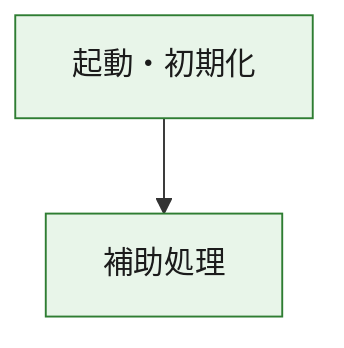
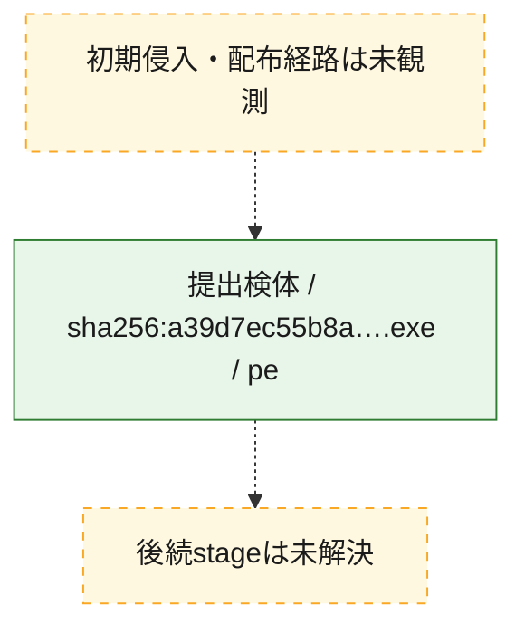
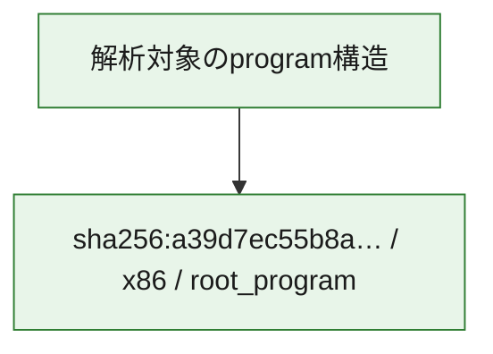

# 全体ロジック：a39d7ec55b8a277b304f7de3aefa55d5906390a4c86d7c9ca18783dee8eaee41

代表関数の静的証跡から、起動・初期化の処理群を確認しました。

## 読み方

- phaseの掲載順は解析上の整理順です。observed_call_edgesがない段階間の実行順を断定しません。
- 図の実線は静的に観測した関係、点線と黄色のノードは未観測・未解決の関係を示します。
- 図は静的な要約であり、動的実行を再現するものではありません。
- 詳細な関数解説とfingerprintは[STATIC-LOGIC.md](STATIC-LOGIC.md)を参照してください。

## 静的可視化

### 実行フロー

### 感染チェーン

### モジュール関係

## 処理段階

### 1. 起動・初期化

entry pointから初期化と後続処理への移行を確認します。
確度: `confirmed_static_function_evidence`

- `a39d7ec55b8a277b304f7de3aefa55d5906390a4c86d7c9ca18783dee8eaee41:ghidra:180001010` — 初期化と主要処理への分岐を行う入口関数です。 状態: `succeeded`、選定理由: `entry_point`, `meaningful_symbol_name`, `reviewed_call_centrality:22`, `role:entrypoint`, `small_program_complete_context`

### 2. 補助処理

主要処理を支える一般内部関数またはlibrary処理を確認します。
確度: `confirmed_static_function_evidence`

- `a39d7ec55b8a277b304f7de3aefa55d5906390a4c86d7c9ca18783dee8eaee41:ghidra:180001240` — 検体内部の一般処理を実装する関数です。 状態: `succeeded`、選定理由: `context_representative`, `reviewed_call_centrality:2`, `small_program_complete_context`
- `a39d7ec55b8a277b304f7de3aefa55d5906390a4c86d7c9ca18783dee8eaee41:ghidra:180001350` — 検体内部の一般処理を実装する関数です。 状態: `succeeded`、選定理由: `context_representative`, `reviewed_call_centrality:25`, `small_program_complete_context`
- `a39d7ec55b8a277b304f7de3aefa55d5906390a4c86d7c9ca18783dee8eaee41:ghidra:180003780` — 検体内部の一般処理を実装する関数です。 状態: `succeeded`、選定理由: `context_representative`, `reviewed_call_centrality:2`, `small_program_complete_context`
- `a39d7ec55b8a277b304f7de3aefa55d5906390a4c86d7c9ca18783dee8eaee41:ghidra:1800038e0` — 検体内部の一般処理を実装する関数です。 状態: `succeeded`、選定理由: `context_representative`, `reviewed_call_centrality:2`, `small_program_complete_context`

## 観測したcall関係

- `a39d7ec55b8a277b304f7de3aefa55d5906390a4c86d7c9ca18783dee8eaee41:ghidra:180001010` → `a39d7ec55b8a277b304f7de3aefa55d5906390a4c86d7c9ca18783dee8eaee41:ghidra:180001240` （`startup` → `support`）
- `a39d7ec55b8a277b304f7de3aefa55d5906390a4c86d7c9ca18783dee8eaee41:ghidra:180001010` → `a39d7ec55b8a277b304f7de3aefa55d5906390a4c86d7c9ca18783dee8eaee41:ghidra:180001350` （`startup` → `support`）
- `a39d7ec55b8a277b304f7de3aefa55d5906390a4c86d7c9ca18783dee8eaee41:ghidra:180001350` → `a39d7ec55b8a277b304f7de3aefa55d5906390a4c86d7c9ca18783dee8eaee41:ghidra:180001240` （`support` → `support`）
- `a39d7ec55b8a277b304f7de3aefa55d5906390a4c86d7c9ca18783dee8eaee41:ghidra:180001350` → `a39d7ec55b8a277b304f7de3aefa55d5906390a4c86d7c9ca18783dee8eaee41:ghidra:180003780` （`support` → `support`）
- `a39d7ec55b8a277b304f7de3aefa55d5906390a4c86d7c9ca18783dee8eaee41:ghidra:180001350` → `a39d7ec55b8a277b304f7de3aefa55d5906390a4c86d7c9ca18783dee8eaee41:ghidra:1800038e0` （`support` → `support`）
- `a39d7ec55b8a277b304f7de3aefa55d5906390a4c86d7c9ca18783dee8eaee41:ghidra:180003780` → `a39d7ec55b8a277b304f7de3aefa55d5906390a4c86d7c9ca18783dee8eaee41:ghidra:1800038e0` （`support` → `support`）
- `ghidra-function:0d3045ee94dc2addf1102218` → `ghidra-function:02f5b5ee746ed66b9e095f5e` （`unclassified` → `unclassified`）
- `ghidra-function:0d3045ee94dc2addf1102218` → `ghidra-function:0cdf92f1442669349bfc7686` （`unclassified` → `unclassified`）
- `ghidra-function:0d3045ee94dc2addf1102218` → `ghidra-function:32e44c450937a0ece8659ec6` （`unclassified` → `unclassified`）
- `ghidra-function:0d3045ee94dc2addf1102218` → `ghidra-function:515d471c841ee6f86596c02c` （`unclassified` → `unclassified`）
- `ghidra-function:0d3045ee94dc2addf1102218` → `ghidra-function:6aa5d362afff85d58b39f0bd` （`unclassified` → `unclassified`）
- `ghidra-function:0d3045ee94dc2addf1102218` → `ghidra-function:801b0ced8a068d3b98e69ede` （`unclassified` → `unclassified`）
- `ghidra-function:0d3045ee94dc2addf1102218` → `ghidra-function:cd9dd968931950f8a5c5e50b` （`unclassified` → `unclassified`）
- `ghidra-function:0d3045ee94dc2addf1102218` → `ghidra-function:d0f1ec05fd5877cafdb382f1` （`unclassified` → `unclassified`）
- `ghidra-function:0d3045ee94dc2addf1102218` → `ghidra-function:ebc0e2e5c0737f580292c16a` （`unclassified` → `unclassified`）
- `ghidra-function:0d3045ee94dc2addf1102218` → `ghidra-function:ec6f43f4360f5287c7d98c78` （`unclassified` → `unclassified`）
- `ghidra-function:0d3045ee94dc2addf1102218` → `ghidra-function:f24a41199612bad02110959d` （`unclassified` → `unclassified`）
- `ghidra-function:0d3045ee94dc2addf1102218` → `ghidra-function:f25649bddfc0f0bfe50710fb` （`unclassified` → `unclassified`）
- `ghidra-function:836ec06c47d61a59e55ecf86` → `ghidra-function:9493ab0694f2bc9c120c08a5` （`unclassified` → `unclassified`）
- `ghidra-function:ebc0e2e5c0737f580292c16a` → `ghidra-external:125c5a10cee81d9d19db8477` （`unclassified` → `unclassified`）
- `ghidra-function:ebc0e2e5c0737f580292c16a` → `ghidra-external:19a157eb87a95b537d16d329` （`unclassified` → `unclassified`）
- `ghidra-function:ebc0e2e5c0737f580292c16a` → `ghidra-external:1bdac66b651d1f7fc19f5fdf` （`unclassified` → `unclassified`）
- `ghidra-function:ebc0e2e5c0737f580292c16a` → `ghidra-external:281ede76c5c9b3a19095be6e` （`unclassified` → `unclassified`）
- `ghidra-function:ebc0e2e5c0737f580292c16a` → `ghidra-external:381eeaa4eaea8e534ad1a113` （`unclassified` → `unclassified`）
- `ghidra-function:ebc0e2e5c0737f580292c16a` → `ghidra-external:405e124fffe64d50aaccaa23` （`unclassified` → `unclassified`）
- `ghidra-function:ebc0e2e5c0737f580292c16a` → `ghidra-external:61d282af13876331ad5c57d5` （`unclassified` → `unclassified`）
- `ghidra-function:ebc0e2e5c0737f580292c16a` → `ghidra-external:755975f66e2fed7863c0b200` （`unclassified` → `unclassified`）
- `ghidra-function:ebc0e2e5c0737f580292c16a` → `ghidra-external:8e9e95d280c3656085a11bf8` （`unclassified` → `unclassified`）
- `ghidra-function:ebc0e2e5c0737f580292c16a` → `ghidra-external:983e1463f510b12208de5c49` （`unclassified` → `unclassified`）
- `ghidra-function:ebc0e2e5c0737f580292c16a` → `ghidra-external:9d1ced85b607197449ac4837` （`unclassified` → `unclassified`）
- `ghidra-function:ebc0e2e5c0737f580292c16a` → `ghidra-external:a67e97b907d854cb164c8ae2` （`unclassified` → `unclassified`）
- `ghidra-function:ebc0e2e5c0737f580292c16a` → `ghidra-external:aff3974759e3a8eb0f367ce5` （`unclassified` → `unclassified`）
- `ghidra-function:ebc0e2e5c0737f580292c16a` → `ghidra-external:bc8a97a71c3e399af6b39a3b` （`unclassified` → `unclassified`）
- `ghidra-function:ebc0e2e5c0737f580292c16a` → `ghidra-external:bfa797cd57c2f9d92cbbf8a2` （`unclassified` → `unclassified`）
- `ghidra-function:ebc0e2e5c0737f580292c16a` → `ghidra-external:c07a009f7a95f4c6c9f3ab31` （`unclassified` → `unclassified`）
- `ghidra-function:ebc0e2e5c0737f580292c16a` → `ghidra-external:c0db05bb35c5612f65fe488d` （`unclassified` → `unclassified`）
- `ghidra-function:ebc0e2e5c0737f580292c16a` → `ghidra-external:c353585e58656b3393620982` （`unclassified` → `unclassified`）
- `ghidra-function:ebc0e2e5c0737f580292c16a` → `ghidra-external:d0d95f4d5018e46f60775a30` （`unclassified` → `unclassified`）
- `ghidra-function:ebc0e2e5c0737f580292c16a` → `ghidra-external:d2343480f78e0a04b6959ee3` （`unclassified` → `unclassified`）
- `ghidra-function:ebc0e2e5c0737f580292c16a` → `ghidra-external:dffe3cd86b3f068e0fdc2aa4` （`unclassified` → `unclassified`）
- `ghidra-function:ebc0e2e5c0737f580292c16a` → `ghidra-function:515d471c841ee6f86596c02c` （`unclassified` → `unclassified`）
- `ghidra-function:ebc0e2e5c0737f580292c16a` → `ghidra-function:836ec06c47d61a59e55ecf86` （`unclassified` → `unclassified`）
- `ghidra-function:ebc0e2e5c0737f580292c16a` → `ghidra-function:9493ab0694f2bc9c120c08a5` （`unclassified` → `unclassified`）

## 解析範囲と制約

- 選定外関数は全体inventoryへ残しますが、関数本体の個別解説対象にはしていません。
- indirect call、難読化、packer、VM、壊れたcontrol flowによりcall関係が欠落する場合があります。
- 文書は静的解析に基づき、検体実行や外部通信による動的確認は行っていません。
