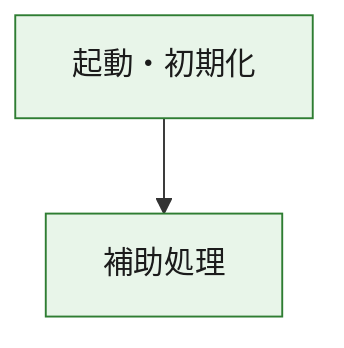
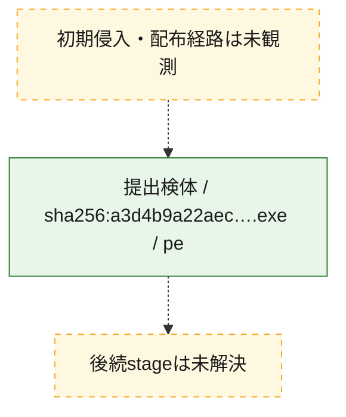
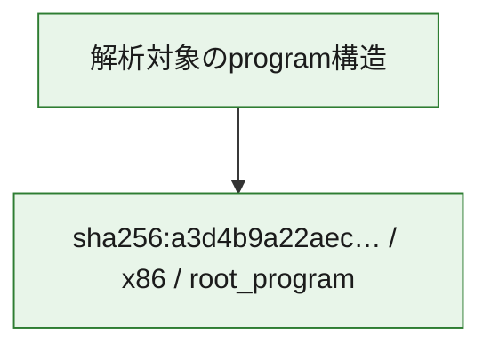

# 全体ロジック：a3d4b9a22aecc1d9b3ddaff2587434c89a708c0495700efedcfdefb00ac1eb6b

代表関数の静的証跡から、起動・初期化の処理群を確認しました。

## 読み方

- phaseの掲載順は解析上の整理順です。observed_call_edgesがない段階間の実行順を断定しません。
- 図の実線は静的に観測した関係、点線と黄色のノードは未観測・未解決の関係を示します。
- 図は静的な要約であり、動的実行を再現するものではありません。
- 詳細な関数解説とfingerprintは[STATIC-LOGIC.md](STATIC-LOGIC.md)を参照してください。

## 静的可視化

### 実行フロー

### 感染チェーン

### モジュール関係

## 処理段階

### 1. 起動・初期化

entry pointから初期化と後続処理への移行を確認します。
確度: `confirmed_static_function_evidence`

- `a3d4b9a22aecc1d9b3ddaff2587434c89a708c0495700efedcfdefb00ac1eb6b:ghidra:180001010` — 初期化と主要処理への分岐を行う入口関数です。 状態: `succeeded`、選定理由: `entry_point`, `meaningful_symbol_name`, `reviewed_call_centrality:22`, `role:entrypoint`, `small_program_complete_context`

### 2. 補助処理

主要処理を支える一般内部関数またはlibrary処理を確認します。
確度: `confirmed_static_function_evidence`

- `a3d4b9a22aecc1d9b3ddaff2587434c89a708c0495700efedcfdefb00ac1eb6b:ghidra:180001240` — 検体内部の一般処理を実装する関数です。 状態: `succeeded`、選定理由: `context_representative`, `reviewed_call_centrality:2`, `small_program_complete_context`
- `a3d4b9a22aecc1d9b3ddaff2587434c89a708c0495700efedcfdefb00ac1eb6b:ghidra:180001350` — 検体内部の一般処理を実装する関数です。 状態: `succeeded`、選定理由: `context_representative`, `reviewed_call_centrality:25`, `small_program_complete_context`
- `a3d4b9a22aecc1d9b3ddaff2587434c89a708c0495700efedcfdefb00ac1eb6b:ghidra:180003780` — 検体内部の一般処理を実装する関数です。 状態: `succeeded`、選定理由: `context_representative`, `reviewed_call_centrality:2`, `small_program_complete_context`
- `a3d4b9a22aecc1d9b3ddaff2587434c89a708c0495700efedcfdefb00ac1eb6b:ghidra:1800038e0` — 検体内部の一般処理を実装する関数です。 状態: `succeeded`、選定理由: `context_representative`, `reviewed_call_centrality:2`, `small_program_complete_context`

## 観測したcall関係

- `a3d4b9a22aecc1d9b3ddaff2587434c89a708c0495700efedcfdefb00ac1eb6b:ghidra:180001010` → `a3d4b9a22aecc1d9b3ddaff2587434c89a708c0495700efedcfdefb00ac1eb6b:ghidra:180001240` （`startup` → `support`）
- `a3d4b9a22aecc1d9b3ddaff2587434c89a708c0495700efedcfdefb00ac1eb6b:ghidra:180001010` → `a3d4b9a22aecc1d9b3ddaff2587434c89a708c0495700efedcfdefb00ac1eb6b:ghidra:180001350` （`startup` → `support`）
- `a3d4b9a22aecc1d9b3ddaff2587434c89a708c0495700efedcfdefb00ac1eb6b:ghidra:180001350` → `a3d4b9a22aecc1d9b3ddaff2587434c89a708c0495700efedcfdefb00ac1eb6b:ghidra:180001240` （`support` → `support`）
- `a3d4b9a22aecc1d9b3ddaff2587434c89a708c0495700efedcfdefb00ac1eb6b:ghidra:180001350` → `a3d4b9a22aecc1d9b3ddaff2587434c89a708c0495700efedcfdefb00ac1eb6b:ghidra:180003780` （`support` → `support`）
- `a3d4b9a22aecc1d9b3ddaff2587434c89a708c0495700efedcfdefb00ac1eb6b:ghidra:180001350` → `a3d4b9a22aecc1d9b3ddaff2587434c89a708c0495700efedcfdefb00ac1eb6b:ghidra:1800038e0` （`support` → `support`）
- `a3d4b9a22aecc1d9b3ddaff2587434c89a708c0495700efedcfdefb00ac1eb6b:ghidra:180003780` → `a3d4b9a22aecc1d9b3ddaff2587434c89a708c0495700efedcfdefb00ac1eb6b:ghidra:1800038e0` （`support` → `support`）
- `ghidra-function:2374a323814e0d583e43826a` → `ghidra-function:151f22a39628e731c2d65968` （`unclassified` → `unclassified`）
- `ghidra-function:2374a323814e0d583e43826a` → `ghidra-function:24638400706791ec2cc035cc` （`unclassified` → `unclassified`）
- `ghidra-function:2374a323814e0d583e43826a` → `ghidra-function:39fb3eeb37bb6ba166c3a1ce` （`unclassified` → `unclassified`）
- `ghidra-function:2374a323814e0d583e43826a` → `ghidra-function:3a5ade7fd7ae4e1e90d4da04` （`unclassified` → `unclassified`）
- `ghidra-function:2374a323814e0d583e43826a` → `ghidra-function:3a6b791a5ed3fc56736effc7` （`unclassified` → `unclassified`）
- `ghidra-function:2374a323814e0d583e43826a` → `ghidra-function:3e3fc07a38e5bb0b7cff9b2e` （`unclassified` → `unclassified`）
- `ghidra-function:2374a323814e0d583e43826a` → `ghidra-function:60f19ee8107d24301f80c0ba` （`unclassified` → `unclassified`）
- `ghidra-function:2374a323814e0d583e43826a` → `ghidra-function:69c11e6b78081b8049a11df6` （`unclassified` → `unclassified`）
- `ghidra-function:2374a323814e0d583e43826a` → `ghidra-function:b2dca9767949fd0639a51996` （`unclassified` → `unclassified`）
- `ghidra-function:2374a323814e0d583e43826a` → `ghidra-function:bc73e5057e1a74d518e7aeba` （`unclassified` → `unclassified`）
- `ghidra-function:2374a323814e0d583e43826a` → `ghidra-function:de11beb62b026029e7223a77` （`unclassified` → `unclassified`）
- `ghidra-function:2374a323814e0d583e43826a` → `ghidra-function:f6dfb1eec3c7be66a69597f7` （`unclassified` → `unclassified`）
- `ghidra-function:56cf9a7918d4bb6ed9170081` → `ghidra-function:cbb894bcc03cdf89cf2badca` （`unclassified` → `unclassified`）
- `ghidra-function:f6dfb1eec3c7be66a69597f7` → `ghidra-external:270dd43f7319f676bad254c6` （`unclassified` → `unclassified`）
- `ghidra-function:f6dfb1eec3c7be66a69597f7` → `ghidra-external:3821bbcbda0e1e8482aebc6e` （`unclassified` → `unclassified`）
- `ghidra-function:f6dfb1eec3c7be66a69597f7` → `ghidra-external:3fe7b92fad470cb82061601f` （`unclassified` → `unclassified`）
- `ghidra-function:f6dfb1eec3c7be66a69597f7` → `ghidra-external:47eb93ffb1021d89393f2bb8` （`unclassified` → `unclassified`）
- `ghidra-function:f6dfb1eec3c7be66a69597f7` → `ghidra-external:4aee5463369130cfa0a59e3f` （`unclassified` → `unclassified`）
- `ghidra-function:f6dfb1eec3c7be66a69597f7` → `ghidra-external:4c74c1c13add0b5fb26163f3` （`unclassified` → `unclassified`）
- `ghidra-function:f6dfb1eec3c7be66a69597f7` → `ghidra-external:547fd5fd15088eb73ef6f309` （`unclassified` → `unclassified`）
- `ghidra-function:f6dfb1eec3c7be66a69597f7` → `ghidra-external:5507730458888ab0eb27f721` （`unclassified` → `unclassified`）
- `ghidra-function:f6dfb1eec3c7be66a69597f7` → `ghidra-external:78e9d766b71a97dcd15a1738` （`unclassified` → `unclassified`）
- `ghidra-function:f6dfb1eec3c7be66a69597f7` → `ghidra-external:7c17555fed578ef9e6ecdbdc` （`unclassified` → `unclassified`）
- `ghidra-function:f6dfb1eec3c7be66a69597f7` → `ghidra-external:7da9a6a7f68d7b5aec951bb1` （`unclassified` → `unclassified`）
- `ghidra-function:f6dfb1eec3c7be66a69597f7` → `ghidra-external:832b8f48ae8db74e9956220c` （`unclassified` → `unclassified`）
- `ghidra-function:f6dfb1eec3c7be66a69597f7` → `ghidra-external:87b113666e0a6e80fdef431c` （`unclassified` → `unclassified`）
- `ghidra-function:f6dfb1eec3c7be66a69597f7` → `ghidra-external:9208198ccd30c8b60fc1840d` （`unclassified` → `unclassified`）
- `ghidra-function:f6dfb1eec3c7be66a69597f7` → `ghidra-external:95f1ffb393e3b804044cfc4d` （`unclassified` → `unclassified`）
- `ghidra-function:f6dfb1eec3c7be66a69597f7` → `ghidra-external:b3f3e7a7fbb606f2065b6e44` （`unclassified` → `unclassified`）
- `ghidra-function:f6dfb1eec3c7be66a69597f7` → `ghidra-external:ca354bea1ffa4333631b5953` （`unclassified` → `unclassified`）
- `ghidra-function:f6dfb1eec3c7be66a69597f7` → `ghidra-external:d096771c6005258bbe2702a7` （`unclassified` → `unclassified`）
- `ghidra-function:f6dfb1eec3c7be66a69597f7` → `ghidra-external:d47941f5babdb92dcae6bf3c` （`unclassified` → `unclassified`）
- `ghidra-function:f6dfb1eec3c7be66a69597f7` → `ghidra-external:e52b556320fd6e73ff952776` （`unclassified` → `unclassified`）
- `ghidra-function:f6dfb1eec3c7be66a69597f7` → `ghidra-external:f2b6838f9b781ee4b0200251` （`unclassified` → `unclassified`）
- `ghidra-function:f6dfb1eec3c7be66a69597f7` → `ghidra-function:56cf9a7918d4bb6ed9170081` （`unclassified` → `unclassified`）
- `ghidra-function:f6dfb1eec3c7be66a69597f7` → `ghidra-function:69c11e6b78081b8049a11df6` （`unclassified` → `unclassified`）
- `ghidra-function:f6dfb1eec3c7be66a69597f7` → `ghidra-function:cbb894bcc03cdf89cf2badca` （`unclassified` → `unclassified`）

## 解析範囲と制約

- 選定外関数は全体inventoryへ残しますが、関数本体の個別解説対象にはしていません。
- indirect call、難読化、packer、VM、壊れたcontrol flowによりcall関係が欠落する場合があります。
- 文書は静的解析に基づき、検体実行や外部通信による動的確認は行っていません。
