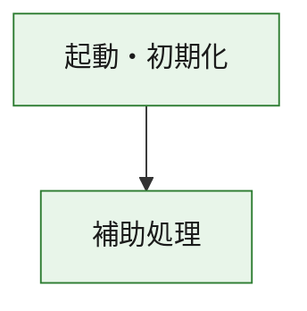
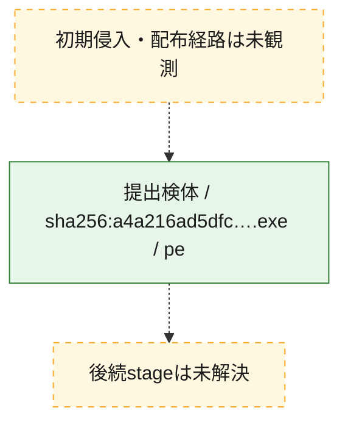
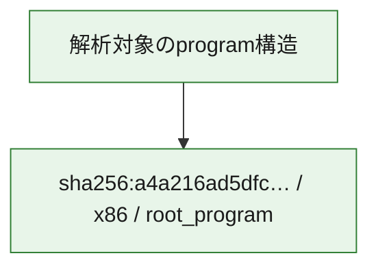

# 全体ロジック：a4a216ad5dfcf89c7029236608a64eaf457a276e4e955de04dcd7ee1441677fa

代表関数の静的証跡から、起動・初期化の処理群を確認しました。

## 読み方

- phaseの掲載順は解析上の整理順です。observed_call_edgesがない段階間の実行順を断定しません。
- 図の実線は静的に観測した関係、点線と黄色のノードは未観測・未解決の関係を示します。
- 図は静的な要約であり、動的実行を再現するものではありません。
- 詳細な関数解説とfingerprintは[STATIC-LOGIC.md](STATIC-LOGIC.md)を参照してください。

## 静的可視化

### 実行フロー

### 感染チェーン

### モジュール関係

## 処理段階

### 1. 起動・初期化

entry pointから初期化と後続処理への移行を確認します。
確度: `confirmed_static_function_evidence`

- `a4a216ad5dfcf89c7029236608a64eaf457a276e4e955de04dcd7ee1441677fa:ghidra:180001010` — 初期化と主要処理への分岐を行う入口関数です。 状態: `succeeded`、選定理由: `entry_point`, `meaningful_symbol_name`, `reviewed_call_centrality:22`, `role:entrypoint`, `small_program_complete_context`

### 2. 補助処理

主要処理を支える一般内部関数またはlibrary処理を確認します。
確度: `confirmed_static_function_evidence`

- `a4a216ad5dfcf89c7029236608a64eaf457a276e4e955de04dcd7ee1441677fa:ghidra:180001240` — 検体内部の一般処理を実装する関数です。 状態: `succeeded`、選定理由: `context_representative`, `reviewed_call_centrality:2`, `small_program_complete_context`
- `a4a216ad5dfcf89c7029236608a64eaf457a276e4e955de04dcd7ee1441677fa:ghidra:180001350` — 検体内部の一般処理を実装する関数です。 状態: `succeeded`、選定理由: `context_representative`, `reviewed_call_centrality:25`, `small_program_complete_context`
- `a4a216ad5dfcf89c7029236608a64eaf457a276e4e955de04dcd7ee1441677fa:ghidra:180003780` — 検体内部の一般処理を実装する関数です。 状態: `succeeded`、選定理由: `context_representative`, `reviewed_call_centrality:2`, `small_program_complete_context`
- `a4a216ad5dfcf89c7029236608a64eaf457a276e4e955de04dcd7ee1441677fa:ghidra:1800038e0` — 検体内部の一般処理を実装する関数です。 状態: `succeeded`、選定理由: `context_representative`, `reviewed_call_centrality:2`, `small_program_complete_context`

## 観測したcall関係

- `a4a216ad5dfcf89c7029236608a64eaf457a276e4e955de04dcd7ee1441677fa:ghidra:180001010` → `a4a216ad5dfcf89c7029236608a64eaf457a276e4e955de04dcd7ee1441677fa:ghidra:180001240` （`startup` → `support`）
- `a4a216ad5dfcf89c7029236608a64eaf457a276e4e955de04dcd7ee1441677fa:ghidra:180001010` → `a4a216ad5dfcf89c7029236608a64eaf457a276e4e955de04dcd7ee1441677fa:ghidra:180001350` （`startup` → `support`）
- `a4a216ad5dfcf89c7029236608a64eaf457a276e4e955de04dcd7ee1441677fa:ghidra:180001350` → `a4a216ad5dfcf89c7029236608a64eaf457a276e4e955de04dcd7ee1441677fa:ghidra:180001240` （`support` → `support`）
- `a4a216ad5dfcf89c7029236608a64eaf457a276e4e955de04dcd7ee1441677fa:ghidra:180001350` → `a4a216ad5dfcf89c7029236608a64eaf457a276e4e955de04dcd7ee1441677fa:ghidra:180003780` （`support` → `support`）
- `a4a216ad5dfcf89c7029236608a64eaf457a276e4e955de04dcd7ee1441677fa:ghidra:180001350` → `a4a216ad5dfcf89c7029236608a64eaf457a276e4e955de04dcd7ee1441677fa:ghidra:1800038e0` （`support` → `support`）
- `a4a216ad5dfcf89c7029236608a64eaf457a276e4e955de04dcd7ee1441677fa:ghidra:180003780` → `a4a216ad5dfcf89c7029236608a64eaf457a276e4e955de04dcd7ee1441677fa:ghidra:1800038e0` （`support` → `support`）
- `ghidra-function:27655ff431ee1a1dc6da2f30` → `ghidra-function:ea2e59d74dd08a3235f833ab` （`unclassified` → `unclassified`）
- `ghidra-function:69760534d9153b68ab25e180` → `ghidra-function:113978575a41eb03d60da26f` （`unclassified` → `unclassified`）
- `ghidra-function:69760534d9153b68ab25e180` → `ghidra-function:162577e9688c3b348e99b010` （`unclassified` → `unclassified`）
- `ghidra-function:69760534d9153b68ab25e180` → `ghidra-function:2f07242c31b8bc72a7b33f5e` （`unclassified` → `unclassified`）
- `ghidra-function:69760534d9153b68ab25e180` → `ghidra-function:462efb3f7611c1dab3f921f1` （`unclassified` → `unclassified`）
- `ghidra-function:69760534d9153b68ab25e180` → `ghidra-function:700001f5a5c0a05917859760` （`unclassified` → `unclassified`）
- `ghidra-function:69760534d9153b68ab25e180` → `ghidra-function:79082a96e6db65939730bc6b` （`unclassified` → `unclassified`）
- `ghidra-function:69760534d9153b68ab25e180` → `ghidra-function:7f5e543d9236239ae0a5db8b` （`unclassified` → `unclassified`）
- `ghidra-function:69760534d9153b68ab25e180` → `ghidra-function:9acdcade7332482cf2ab89e4` （`unclassified` → `unclassified`）
- `ghidra-function:69760534d9153b68ab25e180` → `ghidra-function:abea62ada7455dab5e2b7c86` （`unclassified` → `unclassified`）
- `ghidra-function:69760534d9153b68ab25e180` → `ghidra-function:b0ed7139f88d29e1d682c002` （`unclassified` → `unclassified`）
- `ghidra-function:69760534d9153b68ab25e180` → `ghidra-function:c9447b26f892e757d6d2a3bd` （`unclassified` → `unclassified`）
- `ghidra-function:69760534d9153b68ab25e180` → `ghidra-function:f9b76516294053fc79ed9858` （`unclassified` → `unclassified`）
- `ghidra-function:700001f5a5c0a05917859760` → `ghidra-external:0057dcc770e8bb070f73948f` （`unclassified` → `unclassified`）
- `ghidra-function:700001f5a5c0a05917859760` → `ghidra-external:0bc9e16eb2596ab466faec3a` （`unclassified` → `unclassified`）
- `ghidra-function:700001f5a5c0a05917859760` → `ghidra-external:260e094e90b42aec622cad76` （`unclassified` → `unclassified`）
- `ghidra-function:700001f5a5c0a05917859760` → `ghidra-external:2a15e7093be710dd45094649` （`unclassified` → `unclassified`）
- `ghidra-function:700001f5a5c0a05917859760` → `ghidra-external:5868479deea3bafc072b1954` （`unclassified` → `unclassified`）
- `ghidra-function:700001f5a5c0a05917859760` → `ghidra-external:60fa25d702afdb5d2a6e4125` （`unclassified` → `unclassified`）
- `ghidra-function:700001f5a5c0a05917859760` → `ghidra-external:68cc6e16e94c077c9b8932ed` （`unclassified` → `unclassified`）
- `ghidra-function:700001f5a5c0a05917859760` → `ghidra-external:69e37349b75192b0e1193140` （`unclassified` → `unclassified`）
- `ghidra-function:700001f5a5c0a05917859760` → `ghidra-external:72442c91940437dbc6798206` （`unclassified` → `unclassified`）
- `ghidra-function:700001f5a5c0a05917859760` → `ghidra-external:8b4ec79638d35ca04e50238e` （`unclassified` → `unclassified`）
- `ghidra-function:700001f5a5c0a05917859760` → `ghidra-external:b4a17aab57014d046a1bbbbf` （`unclassified` → `unclassified`）
- `ghidra-function:700001f5a5c0a05917859760` → `ghidra-external:b6f4fc2ed39934004e8141a2` （`unclassified` → `unclassified`）
- `ghidra-function:700001f5a5c0a05917859760` → `ghidra-external:bda2111fde2837a515cedc9b` （`unclassified` → `unclassified`）
- `ghidra-function:700001f5a5c0a05917859760` → `ghidra-external:c10d97c4a40572d443aec3b0` （`unclassified` → `unclassified`）
- `ghidra-function:700001f5a5c0a05917859760` → `ghidra-external:c44ce41062f395870573960a` （`unclassified` → `unclassified`）
- `ghidra-function:700001f5a5c0a05917859760` → `ghidra-external:ca67372ab96341bf4ffdd3ff` （`unclassified` → `unclassified`）
- `ghidra-function:700001f5a5c0a05917859760` → `ghidra-external:dacb8868264876d8498133a1` （`unclassified` → `unclassified`）
- `ghidra-function:700001f5a5c0a05917859760` → `ghidra-external:e25aedd41581b99971035daf` （`unclassified` → `unclassified`）
- `ghidra-function:700001f5a5c0a05917859760` → `ghidra-external:e5051168294d7a59808993df` （`unclassified` → `unclassified`）
- `ghidra-function:700001f5a5c0a05917859760` → `ghidra-external:ee899d021bf9ebf7ecd7ab97` （`unclassified` → `unclassified`）
- `ghidra-function:700001f5a5c0a05917859760` → `ghidra-external:fca31ae7c87cf06cfee7f7f3` （`unclassified` → `unclassified`）
- `ghidra-function:700001f5a5c0a05917859760` → `ghidra-function:27655ff431ee1a1dc6da2f30` （`unclassified` → `unclassified`）
- `ghidra-function:700001f5a5c0a05917859760` → `ghidra-function:462efb3f7611c1dab3f921f1` （`unclassified` → `unclassified`）
- `ghidra-function:700001f5a5c0a05917859760` → `ghidra-function:ea2e59d74dd08a3235f833ab` （`unclassified` → `unclassified`）

## 解析範囲と制約

- 選定外関数は全体inventoryへ残しますが、関数本体の個別解説対象にはしていません。
- indirect call、難読化、packer、VM、壊れたcontrol flowによりcall関係が欠落する場合があります。
- 文書は静的解析に基づき、検体実行や外部通信による動的確認は行っていません。
