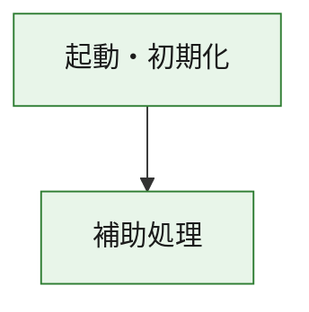
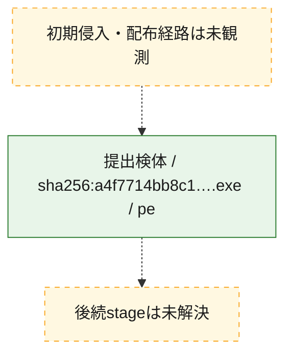
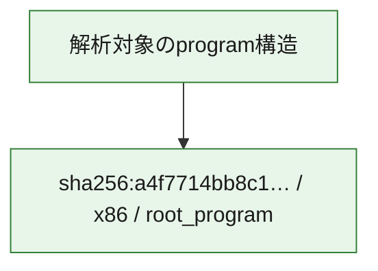

# 全体ロジック：a4f7714bb8c1e6ff6c5b6205f5c9da818e3c9625d51457669c9b6a673c43375d

代表関数の静的証跡から、起動・初期化の処理群を確認しました。

## 読み方

- phaseの掲載順は解析上の整理順です。observed_call_edgesがない段階間の実行順を断定しません。
- 図の実線は静的に観測した関係、点線と黄色のノードは未観測・未解決の関係を示します。
- 図は静的な要約であり、動的実行を再現するものではありません。
- 詳細な関数解説とfingerprintは[STATIC-LOGIC.md](STATIC-LOGIC.md)を参照してください。

## 静的可視化

### 実行フロー

### 感染チェーン

### モジュール関係

## 処理段階

### 1. 起動・初期化

entry pointから初期化と後続処理への移行を確認します。
確度: `confirmed_static_function_evidence`

- `a4f7714bb8c1e6ff6c5b6205f5c9da818e3c9625d51457669c9b6a673c43375d:ghidra:180001010` — 初期化と主要処理への分岐を行う入口関数です。 状態: `succeeded`、選定理由: `entry_point`, `meaningful_symbol_name`, `reviewed_call_centrality:22`, `role:entrypoint`, `small_program_complete_context`

### 2. 補助処理

主要処理を支える一般内部関数またはlibrary処理を確認します。
確度: `confirmed_static_function_evidence`

- `a4f7714bb8c1e6ff6c5b6205f5c9da818e3c9625d51457669c9b6a673c43375d:ghidra:180001240` — 検体内部の一般処理を実装する関数です。 状態: `succeeded`、選定理由: `context_representative`, `reviewed_call_centrality:2`, `small_program_complete_context`
- `a4f7714bb8c1e6ff6c5b6205f5c9da818e3c9625d51457669c9b6a673c43375d:ghidra:180001350` — 検体内部の一般処理を実装する関数です。 状態: `succeeded`、選定理由: `context_representative`, `reviewed_call_centrality:25`, `small_program_complete_context`
- `a4f7714bb8c1e6ff6c5b6205f5c9da818e3c9625d51457669c9b6a673c43375d:ghidra:180003780` — 検体内部の一般処理を実装する関数です。 状態: `succeeded`、選定理由: `context_representative`, `reviewed_call_centrality:2`, `small_program_complete_context`
- `a4f7714bb8c1e6ff6c5b6205f5c9da818e3c9625d51457669c9b6a673c43375d:ghidra:1800038e0` — 検体内部の一般処理を実装する関数です。 状態: `succeeded`、選定理由: `context_representative`, `reviewed_call_centrality:2`, `small_program_complete_context`

## 観測したcall関係

- `a4f7714bb8c1e6ff6c5b6205f5c9da818e3c9625d51457669c9b6a673c43375d:ghidra:180001010` → `a4f7714bb8c1e6ff6c5b6205f5c9da818e3c9625d51457669c9b6a673c43375d:ghidra:180001240` （`startup` → `support`）
- `a4f7714bb8c1e6ff6c5b6205f5c9da818e3c9625d51457669c9b6a673c43375d:ghidra:180001010` → `a4f7714bb8c1e6ff6c5b6205f5c9da818e3c9625d51457669c9b6a673c43375d:ghidra:180001350` （`startup` → `support`）
- `a4f7714bb8c1e6ff6c5b6205f5c9da818e3c9625d51457669c9b6a673c43375d:ghidra:180001350` → `a4f7714bb8c1e6ff6c5b6205f5c9da818e3c9625d51457669c9b6a673c43375d:ghidra:180001240` （`support` → `support`）
- `a4f7714bb8c1e6ff6c5b6205f5c9da818e3c9625d51457669c9b6a673c43375d:ghidra:180001350` → `a4f7714bb8c1e6ff6c5b6205f5c9da818e3c9625d51457669c9b6a673c43375d:ghidra:180003780` （`support` → `support`）
- `a4f7714bb8c1e6ff6c5b6205f5c9da818e3c9625d51457669c9b6a673c43375d:ghidra:180001350` → `a4f7714bb8c1e6ff6c5b6205f5c9da818e3c9625d51457669c9b6a673c43375d:ghidra:1800038e0` （`support` → `support`）
- `a4f7714bb8c1e6ff6c5b6205f5c9da818e3c9625d51457669c9b6a673c43375d:ghidra:180003780` → `a4f7714bb8c1e6ff6c5b6205f5c9da818e3c9625d51457669c9b6a673c43375d:ghidra:1800038e0` （`support` → `support`）
- `ghidra-function:1843bfe7101fdc10bc04a10b` → `ghidra-external:0b1dab3ad9694cca5010eb3f` （`unclassified` → `unclassified`）
- `ghidra-function:1843bfe7101fdc10bc04a10b` → `ghidra-external:1ba8b367df24cc7a03f2a1d9` （`unclassified` → `unclassified`）
- `ghidra-function:1843bfe7101fdc10bc04a10b` → `ghidra-external:3ce5e5c85bcb50492aaca760` （`unclassified` → `unclassified`）
- `ghidra-function:1843bfe7101fdc10bc04a10b` → `ghidra-external:3cfde2699ddf4c666bc641f6` （`unclassified` → `unclassified`）
- `ghidra-function:1843bfe7101fdc10bc04a10b` → `ghidra-external:54c9719fbd1d51571159e6d0` （`unclassified` → `unclassified`）
- `ghidra-function:1843bfe7101fdc10bc04a10b` → `ghidra-external:5f03c5f5696e93d89b9a7ae2` （`unclassified` → `unclassified`）
- `ghidra-function:1843bfe7101fdc10bc04a10b` → `ghidra-external:649398dcfd6da74d6944a9ac` （`unclassified` → `unclassified`）
- `ghidra-function:1843bfe7101fdc10bc04a10b` → `ghidra-external:70b8e617ac7334b65eff585b` （`unclassified` → `unclassified`）
- `ghidra-function:1843bfe7101fdc10bc04a10b` → `ghidra-external:72a23503f67b65008271023b` （`unclassified` → `unclassified`）
- `ghidra-function:1843bfe7101fdc10bc04a10b` → `ghidra-external:7cb83dfbad7c4592f9e3c30e` （`unclassified` → `unclassified`）
- `ghidra-function:1843bfe7101fdc10bc04a10b` → `ghidra-external:83bdfbf5ff3cb2326c89f738` （`unclassified` → `unclassified`）
- `ghidra-function:1843bfe7101fdc10bc04a10b` → `ghidra-external:88d1a5d670cc9672f6aa84e9` （`unclassified` → `unclassified`）
- `ghidra-function:1843bfe7101fdc10bc04a10b` → `ghidra-external:992831822c049ddd9cb653a6` （`unclassified` → `unclassified`）
- `ghidra-function:1843bfe7101fdc10bc04a10b` → `ghidra-external:9e85577c4cac6e7008db5be0` （`unclassified` → `unclassified`）
- `ghidra-function:1843bfe7101fdc10bc04a10b` → `ghidra-external:b5578c614bf2c03d49bda8a8` （`unclassified` → `unclassified`）
- `ghidra-function:1843bfe7101fdc10bc04a10b` → `ghidra-external:bf9e023bce9ef194a9e38afb` （`unclassified` → `unclassified`）
- `ghidra-function:1843bfe7101fdc10bc04a10b` → `ghidra-external:c8119c27e26c8e2a05ad4d63` （`unclassified` → `unclassified`）
- `ghidra-function:1843bfe7101fdc10bc04a10b` → `ghidra-external:cf6cd285aa09c8e32a423f4a` （`unclassified` → `unclassified`）
- `ghidra-function:1843bfe7101fdc10bc04a10b` → `ghidra-external:dd31640e68debf40b67b4f8a` （`unclassified` → `unclassified`）
- `ghidra-function:1843bfe7101fdc10bc04a10b` → `ghidra-external:ea67d5ddcfb7aaeed3db8952` （`unclassified` → `unclassified`）
- `ghidra-function:1843bfe7101fdc10bc04a10b` → `ghidra-external:f9949d509e6327535e7d93a8` （`unclassified` → `unclassified`）
- `ghidra-function:1843bfe7101fdc10bc04a10b` → `ghidra-function:0b0e8ac62869e581ddb8f7a9` （`unclassified` → `unclassified`）
- `ghidra-function:1843bfe7101fdc10bc04a10b` → `ghidra-function:35f593c1844058de02b47a14` （`unclassified` → `unclassified`）
- `ghidra-function:1843bfe7101fdc10bc04a10b` → `ghidra-function:453c3f126828ea114060c7c9` （`unclassified` → `unclassified`）
- `ghidra-function:453c3f126828ea114060c7c9` → `ghidra-function:35f593c1844058de02b47a14` （`unclassified` → `unclassified`）
- `ghidra-function:7b68d7899161dd32353e2362` → `ghidra-function:0713874bdb6e42e3669383b2` （`unclassified` → `unclassified`）
- `ghidra-function:7b68d7899161dd32353e2362` → `ghidra-function:0b0e8ac62869e581ddb8f7a9` （`unclassified` → `unclassified`）
- `ghidra-function:7b68d7899161dd32353e2362` → `ghidra-function:1458b817d2a444a9ca68e629` （`unclassified` → `unclassified`）
- `ghidra-function:7b68d7899161dd32353e2362` → `ghidra-function:1843bfe7101fdc10bc04a10b` （`unclassified` → `unclassified`）
- `ghidra-function:7b68d7899161dd32353e2362` → `ghidra-function:1efc5f15a07dae04dfae554a` （`unclassified` → `unclassified`）
- `ghidra-function:7b68d7899161dd32353e2362` → `ghidra-function:814e087279f9045e0ded2489` （`unclassified` → `unclassified`）
- `ghidra-function:7b68d7899161dd32353e2362` → `ghidra-function:8447cedf764fe3dc0d480df4` （`unclassified` → `unclassified`）
- `ghidra-function:7b68d7899161dd32353e2362` → `ghidra-function:ac03416278c9dbc2d6f5fd2f` （`unclassified` → `unclassified`）
- `ghidra-function:7b68d7899161dd32353e2362` → `ghidra-function:d7271a7779831f93789f5f94` （`unclassified` → `unclassified`）
- `ghidra-function:7b68d7899161dd32353e2362` → `ghidra-function:da1ae405a46aa9f1bd896a9b` （`unclassified` → `unclassified`）
- `ghidra-function:7b68d7899161dd32353e2362` → `ghidra-function:f0e28ac96b8e321b9bea9d47` （`unclassified` → `unclassified`）
- `ghidra-function:7b68d7899161dd32353e2362` → `ghidra-function:fd801b69e9b9e7374bbe4954` （`unclassified` → `unclassified`）

## 解析範囲と制約

- 選定外関数は全体inventoryへ残しますが、関数本体の個別解説対象にはしていません。
- indirect call、難読化、packer、VM、壊れたcontrol flowによりcall関係が欠落する場合があります。
- 文書は静的解析に基づき、検体実行や外部通信による動的確認は行っていません。
