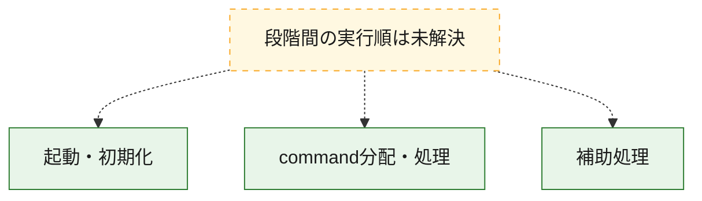
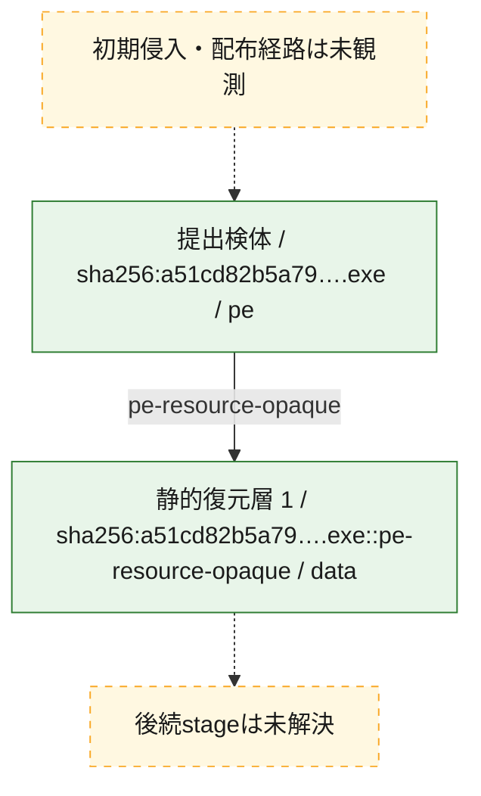
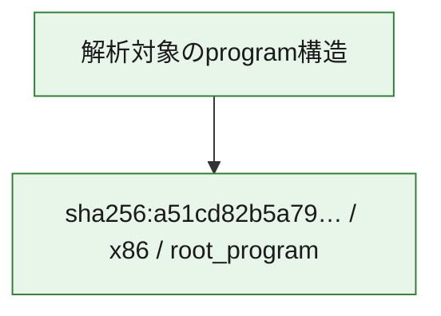

# 全体ロジック：a51cd82b5a79b11cdbdb00cff26c7fd39ad6a4a5b410d2d20d3219527b93e595

代表関数の静的証跡から、起動・初期化、command分配・処理の処理群を確認しました。

## 読み方

- phaseの掲載順は解析上の整理順です。observed_call_edgesがない段階間の実行順を断定しません。
- 図の実線は静的に観測した関係、点線と黄色のノードは未観測・未解決の関係を示します。
- 図は静的な要約であり、動的実行を再現するものではありません。
- 詳細な関数解説とfingerprintは[STATIC-LOGIC.md](STATIC-LOGIC.md)を参照してください。

## 静的可視化

### 実行フロー

### 感染チェーン

### モジュール関係

## 処理段階

### 1. 起動・初期化

entry pointから初期化と後続処理への移行を確認します。
確度: `confirmed_static_function_evidence`

- `a51cd82b5a79b11cdbdb00cff26c7fd39ad6a4a5b410d2d20d3219527b93e595:ghidra:180164464` — 初期化と主要処理への分岐を行う入口関数です。 状態: `succeeded`、選定理由: `entry_point`, `meaningful_symbol_name`, `reviewed_call_centrality:5`, `role:entrypoint`

### 2. command分配・処理

受信commandやtaskの解釈、分配、個別handlerへの移行を確認します。
確度: `confirmed_static_function_evidence_with_limits`

- `a51cd82b5a79b11cdbdb00cff26c7fd39ad6a4a5b410d2d20d3219527b93e595:ghidra:180164d80` — commandの解釈、分配、または個別処理を担当する関数です。 状態: `limited_bad_instruction_or_flow`、選定理由: `meaningful_symbol_name`, `role:command_dispatch_or_handler`

### 3. 補助処理

主要処理を支える一般内部関数またはlibrary処理を確認します。
確度: `confirmed_static_function_evidence_with_limits`

- `a51cd82b5a79b11cdbdb00cff26c7fd39ad6a4a5b410d2d20d3219527b93e595:ghidra:180001000` — 検体内部の一般処理を実装する関数です。 状態: `succeeded`、選定理由: `context_representative`, `reviewed_call_centrality:8`
- `a51cd82b5a79b11cdbdb00cff26c7fd39ad6a4a5b410d2d20d3219527b93e595:ghidra:1800011b0` — 検体内部の一般処理を実装する関数です。 状態: `succeeded`、選定理由: `context_representative`, `reviewed_call_centrality:2`
- `a51cd82b5a79b11cdbdb00cff26c7fd39ad6a4a5b410d2d20d3219527b93e595:ghidra:180001240` — 検体内部の一般処理を実装する関数です。 状態: `succeeded`、選定理由: `context_representative`, `reviewed_call_centrality:22`
- `a51cd82b5a79b11cdbdb00cff26c7fd39ad6a4a5b410d2d20d3219527b93e595:ghidra:180001310` — 検体内部の一般処理を実装する関数です。 状態: `limited_bad_instruction_or_flow`、選定理由: `context_representative`, `reviewed_call_centrality:5`
- `a51cd82b5a79b11cdbdb00cff26c7fd39ad6a4a5b410d2d20d3219527b93e595:ghidra:1800013b0` — 検体内部の一般処理を実装する関数です。 状態: `limited_bad_instruction_or_flow`、選定理由: `context_representative`, `reviewed_call_centrality:4`
- `a51cd82b5a79b11cdbdb00cff26c7fd39ad6a4a5b410d2d20d3219527b93e595:ghidra:180001460` — 検体内部の一般処理を実装する関数です。 状態: `succeeded`、選定理由: `context_representative`, `reviewed_call_centrality:9`
- `a51cd82b5a79b11cdbdb00cff26c7fd39ad6a4a5b410d2d20d3219527b93e595:ghidra:180001600` — 検体内部の一般処理を実装する関数です。 状態: `succeeded`、選定理由: `context_representative`, `reviewed_call_centrality:7`
- `a51cd82b5a79b11cdbdb00cff26c7fd39ad6a4a5b410d2d20d3219527b93e595:ghidra:1800016c0` — 検体内部の一般処理を実装する関数です。 状態: `succeeded`、選定理由: `context_representative`, `reviewed_call_centrality:4`
- `a51cd82b5a79b11cdbdb00cff26c7fd39ad6a4a5b410d2d20d3219527b93e595:ghidra:180001730` — 検体内部の一般処理を実装する関数です。 状態: `succeeded`、選定理由: `context_representative`, `reviewed_call_centrality:2`
- `a51cd82b5a79b11cdbdb00cff26c7fd39ad6a4a5b410d2d20d3219527b93e595:ghidra:180001780` — 検体内部の一般処理を実装する関数です。 状態: `succeeded`、選定理由: `context_representative`, `reviewed_call_centrality:3`
- `a51cd82b5a79b11cdbdb00cff26c7fd39ad6a4a5b410d2d20d3219527b93e595:ghidra:180001890` — 検体内部の一般処理を実装する関数です。 状態: `succeeded`、選定理由: `context_representative`, `reviewed_call_centrality:4`
- `a51cd82b5a79b11cdbdb00cff26c7fd39ad6a4a5b410d2d20d3219527b93e595:ghidra:1800019a0` — 検体内部の一般処理を実装する関数です。 状態: `succeeded`、選定理由: `context_representative`, `reviewed_call_centrality:3`
- `a51cd82b5a79b11cdbdb00cff26c7fd39ad6a4a5b410d2d20d3219527b93e595:ghidra:180001ab0` — 検体内部の一般処理を実装する関数です。 状態: `succeeded`、選定理由: `context_representative`, `reviewed_call_centrality:3`
- `a51cd82b5a79b11cdbdb00cff26c7fd39ad6a4a5b410d2d20d3219527b93e595:ghidra:180001bc0` — 検体内部の一般処理を実装する関数です。 状態: `succeeded`、選定理由: `context_representative`, `reviewed_call_centrality:3`
- `a51cd82b5a79b11cdbdb00cff26c7fd39ad6a4a5b410d2d20d3219527b93e595:ghidra:180001cd0` — 検体内部の一般処理を実装する関数です。 状態: `succeeded`、選定理由: `context_representative`, `reviewed_call_centrality:20`
- `a51cd82b5a79b11cdbdb00cff26c7fd39ad6a4a5b410d2d20d3219527b93e595:ghidra:180002180` — 検体内部の一般処理を実装する関数です。 状態: `succeeded`、選定理由: `context_representative`, `reviewed_call_centrality:23`
- `a51cd82b5a79b11cdbdb00cff26c7fd39ad6a4a5b410d2d20d3219527b93e595:ghidra:180002660` — 検体内部の一般処理を実装する関数です。 状態: `succeeded`、選定理由: `context_representative`, `reviewed_call_centrality:31`
- `a51cd82b5a79b11cdbdb00cff26c7fd39ad6a4a5b410d2d20d3219527b93e595:ghidra:180003620` — 検体内部の一般処理を実装する関数です。 状態: `succeeded`、選定理由: `context_representative`, `reviewed_call_centrality:19`
- `a51cd82b5a79b11cdbdb00cff26c7fd39ad6a4a5b410d2d20d3219527b93e595:ghidra:180003c30` — 検体内部の一般処理を実装する関数です。 状態: `succeeded`、選定理由: `context_representative`, `reviewed_call_centrality:33`
- `a51cd82b5a79b11cdbdb00cff26c7fd39ad6a4a5b410d2d20d3219527b93e595:ghidra:180005940` — 検体内部の一般処理を実装する関数です。 状態: `succeeded`、選定理由: `context_representative`, `reviewed_call_centrality:111`
- `a51cd82b5a79b11cdbdb00cff26c7fd39ad6a4a5b410d2d20d3219527b93e595:ghidra:180009050` — 検体内部の一般処理を実装する関数です。 状態: `limited_bad_instruction_or_flow`、選定理由: `context_representative`, `reviewed_call_centrality:3`
- `a51cd82b5a79b11cdbdb00cff26c7fd39ad6a4a5b410d2d20d3219527b93e595:ghidra:1800090f0` — 検体内部の一般処理を実装する関数です。 状態: `succeeded`、選定理由: `context_representative`, `reviewed_call_centrality:7`
- `a51cd82b5a79b11cdbdb00cff26c7fd39ad6a4a5b410d2d20d3219527b93e595:ghidra:180009270` — 検体内部の一般処理を実装する関数です。 状態: `limited_bad_instruction_or_flow`、選定理由: `context_representative`, `reviewed_call_centrality:3`
- `a51cd82b5a79b11cdbdb00cff26c7fd39ad6a4a5b410d2d20d3219527b93e595:ghidra:180009310` — 検体内部の一般処理を実装する関数です。 状態: `limited_bad_instruction_or_flow`、選定理由: `context_representative`, `reviewed_call_centrality:3`
- `a51cd82b5a79b11cdbdb00cff26c7fd39ad6a4a5b410d2d20d3219527b93e595:ghidra:1800093c0` — 検体内部の一般処理を実装する関数です。 状態: `succeeded`、選定理由: `context_representative`, `reviewed_call_centrality:1`
- `a51cd82b5a79b11cdbdb00cff26c7fd39ad6a4a5b410d2d20d3219527b93e595:ghidra:180009410` — 検体内部の一般処理を実装する関数です。 状態: `succeeded`、選定理由: `context_representative`, `reviewed_call_centrality:2`
- `a51cd82b5a79b11cdbdb00cff26c7fd39ad6a4a5b410d2d20d3219527b93e595:ghidra:180009520` — 検体内部の一般処理を実装する関数です。 状態: `succeeded`、選定理由: `context_representative`, `reviewed_call_centrality:2`
- `a51cd82b5a79b11cdbdb00cff26c7fd39ad6a4a5b410d2d20d3219527b93e595:ghidra:180009630` — 検体内部の一般処理を実装する関数です。 状態: `succeeded`、選定理由: `context_representative`, `reviewed_call_centrality:2`
- `a51cd82b5a79b11cdbdb00cff26c7fd39ad6a4a5b410d2d20d3219527b93e595:ghidra:180009740` — 検体内部の一般処理を実装する関数です。 状態: `succeeded`、選定理由: `context_representative`, `reviewed_call_centrality:2`
- `a51cd82b5a79b11cdbdb00cff26c7fd39ad6a4a5b410d2d20d3219527b93e595:ghidra:1800a73f0` — 検体内部の一般処理を実装する関数です。 状態: `succeeded`、選定理由: `meaningful_symbol_name`

## 観測したcall関係

- `a51cd82b5a79b11cdbdb00cff26c7fd39ad6a4a5b410d2d20d3219527b93e595:ghidra:180001310` → `a51cd82b5a79b11cdbdb00cff26c7fd39ad6a4a5b410d2d20d3219527b93e595:ghidra:180001240` （`support` → `support`）
- `a51cd82b5a79b11cdbdb00cff26c7fd39ad6a4a5b410d2d20d3219527b93e595:ghidra:1800013b0` → `a51cd82b5a79b11cdbdb00cff26c7fd39ad6a4a5b410d2d20d3219527b93e595:ghidra:180001240` （`support` → `support`）
- `a51cd82b5a79b11cdbdb00cff26c7fd39ad6a4a5b410d2d20d3219527b93e595:ghidra:180001600` → `a51cd82b5a79b11cdbdb00cff26c7fd39ad6a4a5b410d2d20d3219527b93e595:ghidra:180001240` （`support` → `support`）
- `a51cd82b5a79b11cdbdb00cff26c7fd39ad6a4a5b410d2d20d3219527b93e595:ghidra:180001730` → `a51cd82b5a79b11cdbdb00cff26c7fd39ad6a4a5b410d2d20d3219527b93e595:ghidra:180001240` （`support` → `support`）
- `a51cd82b5a79b11cdbdb00cff26c7fd39ad6a4a5b410d2d20d3219527b93e595:ghidra:180001780` → `a51cd82b5a79b11cdbdb00cff26c7fd39ad6a4a5b410d2d20d3219527b93e595:ghidra:180001240` （`support` → `support`）
- `a51cd82b5a79b11cdbdb00cff26c7fd39ad6a4a5b410d2d20d3219527b93e595:ghidra:180001890` → `a51cd82b5a79b11cdbdb00cff26c7fd39ad6a4a5b410d2d20d3219527b93e595:ghidra:180001240` （`support` → `support`）
- `a51cd82b5a79b11cdbdb00cff26c7fd39ad6a4a5b410d2d20d3219527b93e595:ghidra:1800019a0` → `a51cd82b5a79b11cdbdb00cff26c7fd39ad6a4a5b410d2d20d3219527b93e595:ghidra:180001240` （`support` → `support`）
- `a51cd82b5a79b11cdbdb00cff26c7fd39ad6a4a5b410d2d20d3219527b93e595:ghidra:180001ab0` → `a51cd82b5a79b11cdbdb00cff26c7fd39ad6a4a5b410d2d20d3219527b93e595:ghidra:180001240` （`support` → `support`）
- `a51cd82b5a79b11cdbdb00cff26c7fd39ad6a4a5b410d2d20d3219527b93e595:ghidra:180001bc0` → `a51cd82b5a79b11cdbdb00cff26c7fd39ad6a4a5b410d2d20d3219527b93e595:ghidra:180001240` （`support` → `support`）
- `a51cd82b5a79b11cdbdb00cff26c7fd39ad6a4a5b410d2d20d3219527b93e595:ghidra:180001cd0` → `a51cd82b5a79b11cdbdb00cff26c7fd39ad6a4a5b410d2d20d3219527b93e595:ghidra:180001000` （`support` → `support`）
- `a51cd82b5a79b11cdbdb00cff26c7fd39ad6a4a5b410d2d20d3219527b93e595:ghidra:180001cd0` → `a51cd82b5a79b11cdbdb00cff26c7fd39ad6a4a5b410d2d20d3219527b93e595:ghidra:180001460` （`support` → `support`）
- `a51cd82b5a79b11cdbdb00cff26c7fd39ad6a4a5b410d2d20d3219527b93e595:ghidra:180002180` → `a51cd82b5a79b11cdbdb00cff26c7fd39ad6a4a5b410d2d20d3219527b93e595:ghidra:180001460` （`support` → `support`）
- `a51cd82b5a79b11cdbdb00cff26c7fd39ad6a4a5b410d2d20d3219527b93e595:ghidra:180002660` → `a51cd82b5a79b11cdbdb00cff26c7fd39ad6a4a5b410d2d20d3219527b93e595:ghidra:180001000` （`support` → `support`）
- `a51cd82b5a79b11cdbdb00cff26c7fd39ad6a4a5b410d2d20d3219527b93e595:ghidra:180002660` → `a51cd82b5a79b11cdbdb00cff26c7fd39ad6a4a5b410d2d20d3219527b93e595:ghidra:1800011b0` （`support` → `support`）
- `a51cd82b5a79b11cdbdb00cff26c7fd39ad6a4a5b410d2d20d3219527b93e595:ghidra:180002660` → `a51cd82b5a79b11cdbdb00cff26c7fd39ad6a4a5b410d2d20d3219527b93e595:ghidra:180001240` （`support` → `support`）
- `a51cd82b5a79b11cdbdb00cff26c7fd39ad6a4a5b410d2d20d3219527b93e595:ghidra:180002660` → `a51cd82b5a79b11cdbdb00cff26c7fd39ad6a4a5b410d2d20d3219527b93e595:ghidra:1800016c0` （`support` → `support`）
- `a51cd82b5a79b11cdbdb00cff26c7fd39ad6a4a5b410d2d20d3219527b93e595:ghidra:180002660` → `a51cd82b5a79b11cdbdb00cff26c7fd39ad6a4a5b410d2d20d3219527b93e595:ghidra:180001890` （`support` → `support`）
- `a51cd82b5a79b11cdbdb00cff26c7fd39ad6a4a5b410d2d20d3219527b93e595:ghidra:180003620` → `a51cd82b5a79b11cdbdb00cff26c7fd39ad6a4a5b410d2d20d3219527b93e595:ghidra:180001000` （`support` → `support`）
- `a51cd82b5a79b11cdbdb00cff26c7fd39ad6a4a5b410d2d20d3219527b93e595:ghidra:180003620` → `a51cd82b5a79b11cdbdb00cff26c7fd39ad6a4a5b410d2d20d3219527b93e595:ghidra:180001240` （`support` → `support`）
- `a51cd82b5a79b11cdbdb00cff26c7fd39ad6a4a5b410d2d20d3219527b93e595:ghidra:180003620` → `a51cd82b5a79b11cdbdb00cff26c7fd39ad6a4a5b410d2d20d3219527b93e595:ghidra:1800016c0` （`support` → `support`）
- `a51cd82b5a79b11cdbdb00cff26c7fd39ad6a4a5b410d2d20d3219527b93e595:ghidra:180003c30` → `a51cd82b5a79b11cdbdb00cff26c7fd39ad6a4a5b410d2d20d3219527b93e595:ghidra:180001000` （`support` → `support`）
- `a51cd82b5a79b11cdbdb00cff26c7fd39ad6a4a5b410d2d20d3219527b93e595:ghidra:180003c30` → `a51cd82b5a79b11cdbdb00cff26c7fd39ad6a4a5b410d2d20d3219527b93e595:ghidra:1800011b0` （`support` → `support`）
- `a51cd82b5a79b11cdbdb00cff26c7fd39ad6a4a5b410d2d20d3219527b93e595:ghidra:180003c30` → `a51cd82b5a79b11cdbdb00cff26c7fd39ad6a4a5b410d2d20d3219527b93e595:ghidra:180001240` （`support` → `support`）
- `a51cd82b5a79b11cdbdb00cff26c7fd39ad6a4a5b410d2d20d3219527b93e595:ghidra:180003c30` → `a51cd82b5a79b11cdbdb00cff26c7fd39ad6a4a5b410d2d20d3219527b93e595:ghidra:180001600` （`support` → `support`）
- `a51cd82b5a79b11cdbdb00cff26c7fd39ad6a4a5b410d2d20d3219527b93e595:ghidra:180003c30` → `a51cd82b5a79b11cdbdb00cff26c7fd39ad6a4a5b410d2d20d3219527b93e595:ghidra:1800016c0` （`support` → `support`）
- `a51cd82b5a79b11cdbdb00cff26c7fd39ad6a4a5b410d2d20d3219527b93e595:ghidra:180003c30` → `a51cd82b5a79b11cdbdb00cff26c7fd39ad6a4a5b410d2d20d3219527b93e595:ghidra:180001780` （`support` → `support`）
- `a51cd82b5a79b11cdbdb00cff26c7fd39ad6a4a5b410d2d20d3219527b93e595:ghidra:180003c30` → `a51cd82b5a79b11cdbdb00cff26c7fd39ad6a4a5b410d2d20d3219527b93e595:ghidra:180001890` （`support` → `support`）
- `a51cd82b5a79b11cdbdb00cff26c7fd39ad6a4a5b410d2d20d3219527b93e595:ghidra:180003c30` → `a51cd82b5a79b11cdbdb00cff26c7fd39ad6a4a5b410d2d20d3219527b93e595:ghidra:1800019a0` （`support` → `support`）
- `a51cd82b5a79b11cdbdb00cff26c7fd39ad6a4a5b410d2d20d3219527b93e595:ghidra:180003c30` → `a51cd82b5a79b11cdbdb00cff26c7fd39ad6a4a5b410d2d20d3219527b93e595:ghidra:180001ab0` （`support` → `support`）
- `a51cd82b5a79b11cdbdb00cff26c7fd39ad6a4a5b410d2d20d3219527b93e595:ghidra:180003c30` → `a51cd82b5a79b11cdbdb00cff26c7fd39ad6a4a5b410d2d20d3219527b93e595:ghidra:180001bc0` （`support` → `support`）
- `a51cd82b5a79b11cdbdb00cff26c7fd39ad6a4a5b410d2d20d3219527b93e595:ghidra:180005940` → `a51cd82b5a79b11cdbdb00cff26c7fd39ad6a4a5b410d2d20d3219527b93e595:ghidra:180001240` （`support` → `support`）
- `a51cd82b5a79b11cdbdb00cff26c7fd39ad6a4a5b410d2d20d3219527b93e595:ghidra:180005940` → `a51cd82b5a79b11cdbdb00cff26c7fd39ad6a4a5b410d2d20d3219527b93e595:ghidra:180001310` （`support` → `support`）
- `a51cd82b5a79b11cdbdb00cff26c7fd39ad6a4a5b410d2d20d3219527b93e595:ghidra:180005940` → `a51cd82b5a79b11cdbdb00cff26c7fd39ad6a4a5b410d2d20d3219527b93e595:ghidra:1800013b0` （`support` → `support`）
- `a51cd82b5a79b11cdbdb00cff26c7fd39ad6a4a5b410d2d20d3219527b93e595:ghidra:180005940` → `a51cd82b5a79b11cdbdb00cff26c7fd39ad6a4a5b410d2d20d3219527b93e595:ghidra:1800016c0` （`support` → `support`）
- `a51cd82b5a79b11cdbdb00cff26c7fd39ad6a4a5b410d2d20d3219527b93e595:ghidra:180005940` → `a51cd82b5a79b11cdbdb00cff26c7fd39ad6a4a5b410d2d20d3219527b93e595:ghidra:180001730` （`support` → `support`）
- `a51cd82b5a79b11cdbdb00cff26c7fd39ad6a4a5b410d2d20d3219527b93e595:ghidra:180009050` → `a51cd82b5a79b11cdbdb00cff26c7fd39ad6a4a5b410d2d20d3219527b93e595:ghidra:180001310` （`support` → `support`）
- `a51cd82b5a79b11cdbdb00cff26c7fd39ad6a4a5b410d2d20d3219527b93e595:ghidra:1800090f0` → `a51cd82b5a79b11cdbdb00cff26c7fd39ad6a4a5b410d2d20d3219527b93e595:ghidra:180005940` （`support` → `support`）
- `a51cd82b5a79b11cdbdb00cff26c7fd39ad6a4a5b410d2d20d3219527b93e595:ghidra:180009270` → `a51cd82b5a79b11cdbdb00cff26c7fd39ad6a4a5b410d2d20d3219527b93e595:ghidra:180001240` （`support` → `support`）
- `a51cd82b5a79b11cdbdb00cff26c7fd39ad6a4a5b410d2d20d3219527b93e595:ghidra:180009310` → `a51cd82b5a79b11cdbdb00cff26c7fd39ad6a4a5b410d2d20d3219527b93e595:ghidra:180001240` （`support` → `support`）
- `a51cd82b5a79b11cdbdb00cff26c7fd39ad6a4a5b410d2d20d3219527b93e595:ghidra:1800093c0` → `a51cd82b5a79b11cdbdb00cff26c7fd39ad6a4a5b410d2d20d3219527b93e595:ghidra:180001240` （`support` → `support`）
- `a51cd82b5a79b11cdbdb00cff26c7fd39ad6a4a5b410d2d20d3219527b93e595:ghidra:180009410` → `a51cd82b5a79b11cdbdb00cff26c7fd39ad6a4a5b410d2d20d3219527b93e595:ghidra:180001240` （`support` → `support`）
- `a51cd82b5a79b11cdbdb00cff26c7fd39ad6a4a5b410d2d20d3219527b93e595:ghidra:180009520` → `a51cd82b5a79b11cdbdb00cff26c7fd39ad6a4a5b410d2d20d3219527b93e595:ghidra:180001240` （`support` → `support`）
- `a51cd82b5a79b11cdbdb00cff26c7fd39ad6a4a5b410d2d20d3219527b93e595:ghidra:180009630` → `a51cd82b5a79b11cdbdb00cff26c7fd39ad6a4a5b410d2d20d3219527b93e595:ghidra:180001240` （`support` → `support`）
- `a51cd82b5a79b11cdbdb00cff26c7fd39ad6a4a5b410d2d20d3219527b93e595:ghidra:180009740` → `a51cd82b5a79b11cdbdb00cff26c7fd39ad6a4a5b410d2d20d3219527b93e595:ghidra:180001240` （`support` → `support`）
- `ghidra-function:00bc08250d5eb50c3b02769c` → `ghidra-function:1d96b71380b4755992dca75f` （`unclassified` → `unclassified`）
- `ghidra-function:00bc08250d5eb50c3b02769c` → `ghidra-function:91d280ac359c4219ba79a41f` （`unclassified` → `unclassified`）
- `ghidra-function:10770d5aea54225909df9adc` → `ghidra-function:1d96b71380b4755992dca75f` （`unclassified` → `unclassified`）
- `ghidra-function:1348b38a29268b162e19649e` → `ghidra-function:1603cc9e1e7bd5efa71e58db` （`unclassified` → `unclassified`）
- `ghidra-function:1348b38a29268b162e19649e` → `ghidra-function:1d96b71380b4755992dca75f` （`unclassified` → `unclassified`）
- `ghidra-function:1d96b71380b4755992dca75f` → `ghidra-function:1603cc9e1e7bd5efa71e58db` （`unclassified` → `unclassified`）
- `ghidra-function:1d96b71380b4755992dca75f` → `ghidra-function:25ae586e0ee4673437716683` （`unclassified` → `unclassified`）
- `ghidra-function:234a7c6a0e646d52b15108cd` → `ghidra-external:9ede22c3ba56defd74b00672` （`unclassified` → `unclassified`）
- `ghidra-function:234a7c6a0e646d52b15108cd` → `ghidra-external:c23a8c30a541bb1269ba0631` （`unclassified` → `unclassified`）
- `ghidra-function:234a7c6a0e646d52b15108cd` → `ghidra-external:d1276c8ad05ecf8c4c8e546b` （`unclassified` → `unclassified`）
- `ghidra-function:234a7c6a0e646d52b15108cd` → `ghidra-function:006f0a6247429450d8a64ea4` （`unclassified` → `unclassified`）
- `ghidra-function:234a7c6a0e646d52b15108cd` → `ghidra-function:07527183d4c3456633f8ad15` （`unclassified` → `unclassified`）
- `ghidra-function:234a7c6a0e646d52b15108cd` → `ghidra-function:1603cc9e1e7bd5efa71e58db` （`unclassified` → `unclassified`）
- `ghidra-function:234a7c6a0e646d52b15108cd` → `ghidra-function:19ebfca5b0387cd4d0dd3c79` （`unclassified` → `unclassified`）
- `ghidra-function:234a7c6a0e646d52b15108cd` → `ghidra-function:1d96b71380b4755992dca75f` （`unclassified` → `unclassified`）
- `ghidra-function:234a7c6a0e646d52b15108cd` → `ghidra-function:36c9fe5a9c723bf20f49b480` （`unclassified` → `unclassified`）
- `ghidra-function:234a7c6a0e646d52b15108cd` → `ghidra-function:62b8e6e50d8c0806003ac6a1` （`unclassified` → `unclassified`）
- `ghidra-function:234a7c6a0e646d52b15108cd` → `ghidra-function:63321d558d827d6fa0f6f5e4` （`unclassified` → `unclassified`）
- `ghidra-function:234a7c6a0e646d52b15108cd` → `ghidra-function:933ca8bf339e76f030987dd6` （`unclassified` → `unclassified`）
- `ghidra-function:234a7c6a0e646d52b15108cd` → `ghidra-function:949b15bb2b0be96f925d5b5a` （`unclassified` → `unclassified`）
- `ghidra-function:234a7c6a0e646d52b15108cd` → `ghidra-function:9839c8bb7afd42af804fd810` （`unclassified` → `unclassified`）
- `ghidra-function:234a7c6a0e646d52b15108cd` → `ghidra-function:bd7db25071915197f457d235` （`unclassified` → `unclassified`）
- `ghidra-function:234a7c6a0e646d52b15108cd` → `ghidra-function:c5f5894d677c2997557543f5` （`unclassified` → `unclassified`）
- `ghidra-function:234a7c6a0e646d52b15108cd` → `ghidra-function:d93c16d47b5ce562aafd72b3` （`unclassified` → `unclassified`）
- `ghidra-function:2fc36071e16b05fe7ffadfaa` → `ghidra-function:1603cc9e1e7bd5efa71e58db` （`unclassified` → `unclassified`）
- `ghidra-function:2fc36071e16b05fe7ffadfaa` → `ghidra-function:1d96b71380b4755992dca75f` （`unclassified` → `unclassified`）
- `ghidra-function:36c9fe5a9c723bf20f49b480` → `ghidra-external:aaf83ed50e721a184568866a` （`unclassified` → `unclassified`）
- `ghidra-function:36c9fe5a9c723bf20f49b480` → `ghidra-function:483656d7d8cd7c425862e2b2` （`unclassified` → `unclassified`）
- `ghidra-function:36c9fe5a9c723bf20f49b480` → `ghidra-function:cfdb5dcd8c463a8cd13db5a5` （`unclassified` → `unclassified`）
- `ghidra-function:41ad3b3a20cd71b894ec4203` → `ghidra-external:c23a8c30a541bb1269ba0631` （`unclassified` → `unclassified`）
- `ghidra-function:41ad3b3a20cd71b894ec4203` → `ghidra-function:1d96b71380b4755992dca75f` （`unclassified` → `unclassified`）
- `ghidra-function:41ad3b3a20cd71b894ec4203` → `ghidra-function:7dea1a07d20fa56d69c22212` （`unclassified` → `unclassified`）
- `ghidra-function:41ad3b3a20cd71b894ec4203` → `ghidra-function:e068d4b2e1ce79663d967008` （`unclassified` → `unclassified`）
- `ghidra-function:425aeb1992267c344f27909e` → `ghidra-external:b2cd3c8b27d78cc7f3ac9bf3` （`unclassified` → `unclassified`）
- `ghidra-function:425aeb1992267c344f27909e` → `ghidra-function:24fee1e61aba11a5e1d31142` （`unclassified` → `unclassified`）
- `ghidra-function:425aeb1992267c344f27909e` → `ghidra-function:2ff6939d7f381267924741de` （`unclassified` → `unclassified`）
- `ghidra-function:425aeb1992267c344f27909e` → `ghidra-function:5cfc82cc484bd7c85dce505d` （`unclassified` → `unclassified`）
- `ghidra-function:425aeb1992267c344f27909e` → `ghidra-function:e1da26a9ca698b04cd6f4a7e` （`unclassified` → `unclassified`）
- `ghidra-function:4397417b2fe0efdf0f7b98da` → `ghidra-external:0b842464cfd16fafcfbb67ce` （`unclassified` → `unclassified`）
- `ghidra-function:4397417b2fe0efdf0f7b98da` → `ghidra-external:3e8d993794b84be7f497e1bc` （`unclassified` → `unclassified`）
- `ghidra-function:4397417b2fe0efdf0f7b98da` → `ghidra-external:61a172f4a1cff06c6ec6e055` （`unclassified` → `unclassified`）
- `ghidra-function:4397417b2fe0efdf0f7b98da` → `ghidra-external:67b9327f7c006875de7be72b` （`unclassified` → `unclassified`）
- `ghidra-function:4397417b2fe0efdf0f7b98da` → `ghidra-external:7ae6b403a6a543d858bb37c1` （`unclassified` → `unclassified`）
- `ghidra-function:4397417b2fe0efdf0f7b98da` → `ghidra-external:c23a8c30a541bb1269ba0631` （`unclassified` → `unclassified`）
- `ghidra-function:4397417b2fe0efdf0f7b98da` → `ghidra-external:d1276c8ad05ecf8c4c8e546b` （`unclassified` → `unclassified`）
- `ghidra-function:4397417b2fe0efdf0f7b98da` → `ghidra-function:020a635cbd4c24168c3a421e` （`unclassified` → `unclassified`）
- `ghidra-function:4397417b2fe0efdf0f7b98da` → `ghidra-function:0264e88b26ff9d19d7212754` （`unclassified` → `unclassified`）
- `ghidra-function:4397417b2fe0efdf0f7b98da` → `ghidra-function:07527183d4c3456633f8ad15` （`unclassified` → `unclassified`）
- `ghidra-function:4397417b2fe0efdf0f7b98da` → `ghidra-function:10e86da28b8628eefffaafbc` （`unclassified` → `unclassified`）
- `ghidra-function:4397417b2fe0efdf0f7b98da` → `ghidra-function:11a7cca330a55db01123bbad` （`unclassified` → `unclassified`）
- `ghidra-function:4397417b2fe0efdf0f7b98da` → `ghidra-function:143fb11d4bf182485fafaf71` （`unclassified` → `unclassified`）
- `ghidra-function:4397417b2fe0efdf0f7b98da` → `ghidra-function:1a2bd2d42b6e28d1165c1ec2` （`unclassified` → `unclassified`）
- `ghidra-function:4397417b2fe0efdf0f7b98da` → `ghidra-function:1d8ed6cc1059b3a3d25fc274` （`unclassified` → `unclassified`）
- `ghidra-function:4397417b2fe0efdf0f7b98da` → `ghidra-function:1d96b71380b4755992dca75f` （`unclassified` → `unclassified`）
- `ghidra-function:4397417b2fe0efdf0f7b98da` → `ghidra-function:2058828e6cf037f261a312f8` （`unclassified` → `unclassified`）
- `ghidra-function:4397417b2fe0efdf0f7b98da` → `ghidra-function:2173559c88233e44f646c449` （`unclassified` → `unclassified`）
- `ghidra-function:4397417b2fe0efdf0f7b98da` → `ghidra-function:222f3777589afe50f7228381` （`unclassified` → `unclassified`）
- `ghidra-function:4397417b2fe0efdf0f7b98da` → `ghidra-function:27a3cba0b19db55b21abf566` （`unclassified` → `unclassified`）
- `ghidra-function:4397417b2fe0efdf0f7b98da` → `ghidra-function:27da6cb4730f1505a272cc4d` （`unclassified` → `unclassified`）
- `ghidra-function:4397417b2fe0efdf0f7b98da` → `ghidra-function:2d38ef3efc1ac88d6246c9e8` （`unclassified` → `unclassified`）
- `ghidra-function:4397417b2fe0efdf0f7b98da` → `ghidra-function:33a84ff328bc5819e9360e8a` （`unclassified` → `unclassified`）
- `ghidra-function:4397417b2fe0efdf0f7b98da` → `ghidra-function:3ce3f05b7bfece05271b123b` （`unclassified` → `unclassified`）
- `ghidra-function:4397417b2fe0efdf0f7b98da` → `ghidra-function:41f1e060860d04eba3350d06` （`unclassified` → `unclassified`）
- `ghidra-function:4397417b2fe0efdf0f7b98da` → `ghidra-function:448ef7c073a98b6c66565fe1` （`unclassified` → `unclassified`）
- `ghidra-function:4397417b2fe0efdf0f7b98da` → `ghidra-function:44b21d276f1482f5101906c5` （`unclassified` → `unclassified`）
- `ghidra-function:4397417b2fe0efdf0f7b98da` → `ghidra-function:469e4cc561d6c19e84f7dc8d` （`unclassified` → `unclassified`）
- `ghidra-function:4397417b2fe0efdf0f7b98da` → `ghidra-function:483656d7d8cd7c425862e2b2` （`unclassified` → `unclassified`）
- `ghidra-function:4397417b2fe0efdf0f7b98da` → `ghidra-function:5378705664df5e986e5cd1b4` （`unclassified` → `unclassified`）
- `ghidra-function:4397417b2fe0efdf0f7b98da` → `ghidra-function:56ca2bcaea315f9781be3df0` （`unclassified` → `unclassified`）
- `ghidra-function:4397417b2fe0efdf0f7b98da` → `ghidra-function:5c652fa83ad5886e6ed887bc` （`unclassified` → `unclassified`）
- `ghidra-function:4397417b2fe0efdf0f7b98da` → `ghidra-function:5d55b3737552c665842315d8` （`unclassified` → `unclassified`）
- `ghidra-function:4397417b2fe0efdf0f7b98da` → `ghidra-function:6023437a8b0e425ef551f272` （`unclassified` → `unclassified`）
- `ghidra-function:4397417b2fe0efdf0f7b98da` → `ghidra-function:62b8e6e50d8c0806003ac6a1` （`unclassified` → `unclassified`）
- `ghidra-function:4397417b2fe0efdf0f7b98da` → `ghidra-function:6457e06e298adf0b9c64bae4` （`unclassified` → `unclassified`）
- `ghidra-function:4397417b2fe0efdf0f7b98da` → `ghidra-function:65c6a1bd827e6fedd6564c4b` （`unclassified` → `unclassified`）
- `ghidra-function:4397417b2fe0efdf0f7b98da` → `ghidra-function:6cb4b01af91feba0456f25a9` （`unclassified` → `unclassified`）
- `ghidra-function:4397417b2fe0efdf0f7b98da` → `ghidra-function:72f7cfd945ceae4374927666` （`unclassified` → `unclassified`）
- `ghidra-function:4397417b2fe0efdf0f7b98da` → `ghidra-function:7694ce209f65377841938d67` （`unclassified` → `unclassified`）
- `ghidra-function:4397417b2fe0efdf0f7b98da` → `ghidra-function:7dea1a07d20fa56d69c22212` （`unclassified` → `unclassified`）
- `ghidra-function:4397417b2fe0efdf0f7b98da` → `ghidra-function:8059d1ae40218f9e227b7299` （`unclassified` → `unclassified`）
- `ghidra-function:4397417b2fe0efdf0f7b98da` → `ghidra-function:807d371c240d5cd168d19b3c` （`unclassified` → `unclassified`）
- `ghidra-function:4397417b2fe0efdf0f7b98da` → `ghidra-function:814e9ec4c424ac4f26d888d0` （`unclassified` → `unclassified`）
- `ghidra-function:4397417b2fe0efdf0f7b98da` → `ghidra-function:83963ce0b5d509a846d0c39d` （`unclassified` → `unclassified`）
- `ghidra-function:4397417b2fe0efdf0f7b98da` → `ghidra-function:8c781bf8f98b581065bf6893` （`unclassified` → `unclassified`）
- `ghidra-function:4397417b2fe0efdf0f7b98da` → `ghidra-function:918eb7f46a68b047b4f1fcb7` （`unclassified` → `unclassified`）
- `ghidra-function:4397417b2fe0efdf0f7b98da` → `ghidra-function:91d280ac359c4219ba79a41f` （`unclassified` → `unclassified`）
- `ghidra-function:4397417b2fe0efdf0f7b98da` → `ghidra-function:93382ad74c64a3af0b6f496e` （`unclassified` → `unclassified`）
- `ghidra-function:4397417b2fe0efdf0f7b98da` → `ghidra-function:949b15bb2b0be96f925d5b5a` （`unclassified` → `unclassified`）
- `ghidra-function:4397417b2fe0efdf0f7b98da` → `ghidra-function:95d94915b5439d0b7c2df2bc` （`unclassified` → `unclassified`）
- `ghidra-function:4397417b2fe0efdf0f7b98da` → `ghidra-function:97409379247c60c4437de20e` （`unclassified` → `unclassified`）
- `ghidra-function:4397417b2fe0efdf0f7b98da` → `ghidra-function:9839c8bb7afd42af804fd810` （`unclassified` → `unclassified`）
- `ghidra-function:4397417b2fe0efdf0f7b98da` → `ghidra-function:987afa3f21774b2cd2f475bb` （`unclassified` → `unclassified`）
- `ghidra-function:4397417b2fe0efdf0f7b98da` → `ghidra-function:9b1e66889a732fcc4cc548b3` （`unclassified` → `unclassified`）
- `ghidra-function:4397417b2fe0efdf0f7b98da` → `ghidra-function:9b836588096d94197f268988` （`unclassified` → `unclassified`）
- `ghidra-function:4397417b2fe0efdf0f7b98da` → `ghidra-function:9be67bd39f6f3d645c1937d0` （`unclassified` → `unclassified`）
- `ghidra-function:4397417b2fe0efdf0f7b98da` → `ghidra-function:9c7cec7e13da6b89596446a7` （`unclassified` → `unclassified`）
- `ghidra-function:4397417b2fe0efdf0f7b98da` → `ghidra-function:9ecf40fb7fc2429e61d2e4f8` （`unclassified` → `unclassified`）
- `ghidra-function:4397417b2fe0efdf0f7b98da` → `ghidra-function:abec2079b8475a00e0412b37` （`unclassified` → `unclassified`）
- `ghidra-function:4397417b2fe0efdf0f7b98da` → `ghidra-function:ac59836ecf095d3310825fe4` （`unclassified` → `unclassified`）
- `ghidra-function:4397417b2fe0efdf0f7b98da` → `ghidra-function:b69417d2521c898fbc98f002` （`unclassified` → `unclassified`）
- `ghidra-function:4397417b2fe0efdf0f7b98da` → `ghidra-function:b8655625c0dd4c4712ffd877` （`unclassified` → `unclassified`）
- `ghidra-function:4397417b2fe0efdf0f7b98da` → `ghidra-function:b8e84db5ab782c2917d8d8cd` （`unclassified` → `unclassified`）
- `ghidra-function:4397417b2fe0efdf0f7b98da` → `ghidra-function:c5f5894d677c2997557543f5` （`unclassified` → `unclassified`）
- `ghidra-function:4397417b2fe0efdf0f7b98da` → `ghidra-function:d5530bed4162d0b693e6d8d0` （`unclassified` → `unclassified`）
- `ghidra-function:4397417b2fe0efdf0f7b98da` → `ghidra-function:d7a561bea4425bbef71b0512` （`unclassified` → `unclassified`）
- `ghidra-function:4397417b2fe0efdf0f7b98da` → `ghidra-function:d93c16d47b5ce562aafd72b3` （`unclassified` → `unclassified`）
- `ghidra-function:4397417b2fe0efdf0f7b98da` → `ghidra-function:dd211291032f9cc3f8101a70` （`unclassified` → `unclassified`）
- `ghidra-function:4397417b2fe0efdf0f7b98da` → `ghidra-function:dea900dada33a4e9adad33c9` （`unclassified` → `unclassified`）
- `ghidra-function:4397417b2fe0efdf0f7b98da` → `ghidra-function:e068d4b2e1ce79663d967008` （`unclassified` → `unclassified`）
- `ghidra-function:4397417b2fe0efdf0f7b98da` → `ghidra-function:e121aebfa61cf49331022bff` （`unclassified` → `unclassified`）
- `ghidra-function:4397417b2fe0efdf0f7b98da` → `ghidra-function:e4757610539510944648424c` （`unclassified` → `unclassified`）
- `ghidra-function:4397417b2fe0efdf0f7b98da` → `ghidra-function:ef3edfbc2a919329089c874b` （`unclassified` → `unclassified`）
- `ghidra-function:4397417b2fe0efdf0f7b98da` → `ghidra-function:f1d03cfe8aceab4491335b3e` （`unclassified` → `unclassified`）
- `ghidra-function:4397417b2fe0efdf0f7b98da` → `ghidra-function:f829613278aa037e6a746a8f` （`unclassified` → `unclassified`）
- `ghidra-function:4397417b2fe0efdf0f7b98da` → `ghidra-function:fe85ab7be353701b39545c8a` （`unclassified` → `unclassified`）
- `ghidra-function:5e9ea552d3bebed7c9ff0eb2` → `ghidra-function:1603cc9e1e7bd5efa71e58db` （`unclassified` → `unclassified`）
- `ghidra-function:5e9ea552d3bebed7c9ff0eb2` → `ghidra-function:1d96b71380b4755992dca75f` （`unclassified` → `unclassified`）
- `ghidra-function:77656ab2ef7ea07e22b07269` → `ghidra-function:c97d62d993e1aeee0dafba83` （`unclassified` → `unclassified`）
- `ghidra-function:77656ab2ef7ea07e22b07269` → `ghidra-function:d5530bed4162d0b693e6d8d0` （`unclassified` → `unclassified`）
- `ghidra-function:7c35dc5cc140821c2602d59b` → `ghidra-function:1603cc9e1e7bd5efa71e58db` （`unclassified` → `unclassified`）
- `ghidra-function:7c35dc5cc140821c2602d59b` → `ghidra-function:1d96b71380b4755992dca75f` （`unclassified` → `unclassified`）
- `ghidra-function:8085d09cb3bb39f1825dba0e` → `ghidra-function:11a7cca330a55db01123bbad` （`unclassified` → `unclassified`）
- `ghidra-function:8085d09cb3bb39f1825dba0e` → `ghidra-function:25aeb95640bba60db79cb4fa` （`unclassified` → `unclassified`）
- `ghidra-function:8085d09cb3bb39f1825dba0e` → `ghidra-function:299cfc1ed5fbf1cb9d331065` （`unclassified` → `unclassified`）
- `ghidra-function:8085d09cb3bb39f1825dba0e` → `ghidra-function:b8c52fe62d15ac8f1e3cde29` （`unclassified` → `unclassified`）
- `ghidra-function:80a685b50004bd046e0e0a3c` → `ghidra-external:0b842464cfd16fafcfbb67ce` （`unclassified` → `unclassified`）
- `ghidra-function:80a685b50004bd046e0e0a3c` → `ghidra-function:4397417b2fe0efdf0f7b98da` （`unclassified` → `unclassified`）
- `ghidra-function:80a685b50004bd046e0e0a3c` → `ghidra-function:9be67bd39f6f3d645c1937d0` （`unclassified` → `unclassified`）
- `ghidra-function:80a685b50004bd046e0e0a3c` → `ghidra-function:e5c980d5f35261737ef5d8ce` （`unclassified` → `unclassified`）
- `ghidra-function:80a685b50004bd046e0e0a3c` → `ghidra-function:ef3edfbc2a919329089c874b` （`unclassified` → `unclassified`）
- `ghidra-function:83963ce0b5d509a846d0c39d` → `ghidra-function:1d96b71380b4755992dca75f` （`unclassified` → `unclassified`）
- `ghidra-function:83963ce0b5d509a846d0c39d` → `ghidra-function:91d280ac359c4219ba79a41f` （`unclassified` → `unclassified`）
- `ghidra-function:8c2e698bfab12be0ba2e6086` → `ghidra-external:aaf83ed50e721a184568866a` （`unclassified` → `unclassified`）
- `ghidra-function:8c2e698bfab12be0ba2e6086` → `ghidra-function:11a7cca330a55db01123bbad` （`unclassified` → `unclassified`）
- `ghidra-function:8c2e698bfab12be0ba2e6086` → `ghidra-function:1d8ed6cc1059b3a3d25fc274` （`unclassified` → `unclassified`）
- `ghidra-function:8c2e698bfab12be0ba2e6086` → `ghidra-function:36c9fe5a9c723bf20f49b480` （`unclassified` → `unclassified`）
- `ghidra-function:8c2e698bfab12be0ba2e6086` → `ghidra-function:469e4cc561d6c19e84f7dc8d` （`unclassified` → `unclassified`）
- `ghidra-function:8c2e698bfab12be0ba2e6086` → `ghidra-function:63891c8b785bb0c198c37f28` （`unclassified` → `unclassified`）
- `ghidra-function:8c2e698bfab12be0ba2e6086` → `ghidra-function:69c7046cd972b54683e8baa8` （`unclassified` → `unclassified`）
- `ghidra-function:8c2e698bfab12be0ba2e6086` → `ghidra-function:8085d09cb3bb39f1825dba0e` （`unclassified` → `unclassified`）
- `ghidra-function:8c2e698bfab12be0ba2e6086` → `ghidra-function:90f2924aea30306fa65f5112` （`unclassified` → `unclassified`）
- `ghidra-function:8c2e698bfab12be0ba2e6086` → `ghidra-function:95d94915b5439d0b7c2df2bc` （`unclassified` → `unclassified`）
- `ghidra-function:8c2e698bfab12be0ba2e6086` → `ghidra-function:98a3bea18af7f0a41aa184c2` （`unclassified` → `unclassified`）
- `ghidra-function:8c2e698bfab12be0ba2e6086` → `ghidra-function:a8d4d414c8102fdfe25eb4d2` （`unclassified` → `unclassified`）
- `ghidra-function:8c2e698bfab12be0ba2e6086` → `ghidra-function:c5f5894d677c2997557543f5` （`unclassified` → `unclassified`）
- `ghidra-function:8c2e698bfab12be0ba2e6086` → `ghidra-function:d55ad402577f35eebe0a6021` （`unclassified` → `unclassified`）
- `ghidra-function:8c2e698bfab12be0ba2e6086` → `ghidra-function:f75ed552dcbe7aa3f0aedcfd` （`unclassified` → `unclassified`）
- `ghidra-function:8f04980ca83b6484bfd379f8` → `ghidra-function:1603cc9e1e7bd5efa71e58db` （`unclassified` → `unclassified`）
- `ghidra-function:8f04980ca83b6484bfd379f8` → `ghidra-function:1d96b71380b4755992dca75f` （`unclassified` → `unclassified`）
- `ghidra-function:9ab13000cba5fc6eab955629` → `ghidra-function:1603cc9e1e7bd5efa71e58db` （`unclassified` → `unclassified`）
- `ghidra-function:9ab13000cba5fc6eab955629` → `ghidra-function:1d96b71380b4755992dca75f` （`unclassified` → `unclassified`）
- `ghidra-function:be756127298eb6cd9c623051` → `ghidra-function:1603cc9e1e7bd5efa71e58db` （`unclassified` → `unclassified`）
- `ghidra-function:be756127298eb6cd9c623051` → `ghidra-function:1d96b71380b4755992dca75f` （`unclassified` → `unclassified`）
- `ghidra-function:c27041779abf84ebaad29096` → `ghidra-external:497eec6660d697c3fc86343b` （`unclassified` → `unclassified`）
- `ghidra-function:c27041779abf84ebaad29096` → `ghidra-external:d1276c8ad05ecf8c4c8e546b` （`unclassified` → `unclassified`）
- `ghidra-function:c27041779abf84ebaad29096` → `ghidra-function:006f0a6247429450d8a64ea4` （`unclassified` → `unclassified`）
- 残り81件は`static-logic.json`に記録しています。

## 解析範囲と制約

- 選定外関数は全体inventoryへ残しますが、関数本体の個別解説対象にはしていません。
- indirect call、難読化、packer、VM、壊れたcontrol flowによりcall関係が欠落する場合があります。
- 文書は静的解析に基づき、検体実行や外部通信による動的確認は行っていません。
