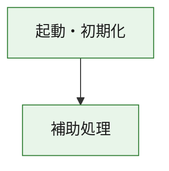
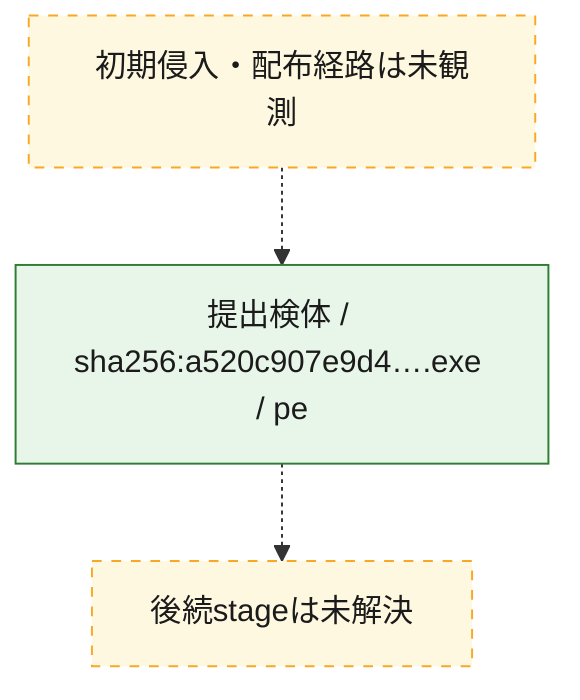
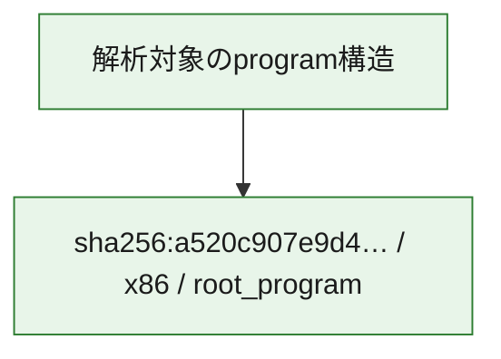

# 全体ロジック：a520c907e9d42b15799e70ae3bd6b7641d1809f1c8f6572192c03e62d4a403c1

代表関数の静的証跡から、起動・初期化の処理群を確認しました。

## 読み方

- phaseの掲載順は解析上の整理順です。observed_call_edgesがない段階間の実行順を断定しません。
- 図の実線は静的に観測した関係、点線と黄色のノードは未観測・未解決の関係を示します。
- 図は静的な要約であり、動的実行を再現するものではありません。
- 詳細な関数解説とfingerprintは[STATIC-LOGIC.md](STATIC-LOGIC.md)を参照してください。

## 静的可視化

### 実行フロー

### 感染チェーン

### モジュール関係

## 処理段階

### 1. 起動・初期化

entry pointから初期化と後続処理への移行を確認します。
確度: `confirmed_static_function_evidence`

- `a520c907e9d42b15799e70ae3bd6b7641d1809f1c8f6572192c03e62d4a403c1:ghidra:180001010` — 初期化と主要処理への分岐を行う入口関数です。 状態: `succeeded`、選定理由: `entry_point`, `meaningful_symbol_name`, `reviewed_call_centrality:22`, `role:entrypoint`, `small_program_complete_context`

### 2. 補助処理

主要処理を支える一般内部関数またはlibrary処理を確認します。
確度: `confirmed_static_function_evidence`

- `a520c907e9d42b15799e70ae3bd6b7641d1809f1c8f6572192c03e62d4a403c1:ghidra:180001240` — 検体内部の一般処理を実装する関数です。 状態: `succeeded`、選定理由: `context_representative`, `reviewed_call_centrality:2`, `small_program_complete_context`
- `a520c907e9d42b15799e70ae3bd6b7641d1809f1c8f6572192c03e62d4a403c1:ghidra:180001350` — 検体内部の一般処理を実装する関数です。 状態: `succeeded`、選定理由: `context_representative`, `reviewed_call_centrality:25`, `small_program_complete_context`
- `a520c907e9d42b15799e70ae3bd6b7641d1809f1c8f6572192c03e62d4a403c1:ghidra:180003780` — 検体内部の一般処理を実装する関数です。 状態: `succeeded`、選定理由: `context_representative`, `reviewed_call_centrality:2`, `small_program_complete_context`
- `a520c907e9d42b15799e70ae3bd6b7641d1809f1c8f6572192c03e62d4a403c1:ghidra:1800038e0` — 検体内部の一般処理を実装する関数です。 状態: `succeeded`、選定理由: `context_representative`, `reviewed_call_centrality:2`, `small_program_complete_context`

## 観測したcall関係

- `a520c907e9d42b15799e70ae3bd6b7641d1809f1c8f6572192c03e62d4a403c1:ghidra:180001010` → `a520c907e9d42b15799e70ae3bd6b7641d1809f1c8f6572192c03e62d4a403c1:ghidra:180001240` （`startup` → `support`）
- `a520c907e9d42b15799e70ae3bd6b7641d1809f1c8f6572192c03e62d4a403c1:ghidra:180001010` → `a520c907e9d42b15799e70ae3bd6b7641d1809f1c8f6572192c03e62d4a403c1:ghidra:180001350` （`startup` → `support`）
- `a520c907e9d42b15799e70ae3bd6b7641d1809f1c8f6572192c03e62d4a403c1:ghidra:180001350` → `a520c907e9d42b15799e70ae3bd6b7641d1809f1c8f6572192c03e62d4a403c1:ghidra:180001240` （`support` → `support`）
- `a520c907e9d42b15799e70ae3bd6b7641d1809f1c8f6572192c03e62d4a403c1:ghidra:180001350` → `a520c907e9d42b15799e70ae3bd6b7641d1809f1c8f6572192c03e62d4a403c1:ghidra:180003780` （`support` → `support`）
- `a520c907e9d42b15799e70ae3bd6b7641d1809f1c8f6572192c03e62d4a403c1:ghidra:180001350` → `a520c907e9d42b15799e70ae3bd6b7641d1809f1c8f6572192c03e62d4a403c1:ghidra:1800038e0` （`support` → `support`）
- `a520c907e9d42b15799e70ae3bd6b7641d1809f1c8f6572192c03e62d4a403c1:ghidra:180003780` → `a520c907e9d42b15799e70ae3bd6b7641d1809f1c8f6572192c03e62d4a403c1:ghidra:1800038e0` （`support` → `support`）
- `ghidra-function:23a1c8f5311a7226a33df8cf` → `ghidra-function:023d7bb9923f36edf8baae05` （`unclassified` → `unclassified`）
- `ghidra-function:23a1c8f5311a7226a33df8cf` → `ghidra-function:48cb3fc5c43d37cb30b09204` （`unclassified` → `unclassified`）
- `ghidra-function:23a1c8f5311a7226a33df8cf` → `ghidra-function:5a758ba9b93b3d582b910d7f` （`unclassified` → `unclassified`）
- `ghidra-function:23a1c8f5311a7226a33df8cf` → `ghidra-function:677973c9f4bd716a0f9da05c` （`unclassified` → `unclassified`）
- `ghidra-function:23a1c8f5311a7226a33df8cf` → `ghidra-function:6f32d61aa7a4863a6578b08c` （`unclassified` → `unclassified`）
- `ghidra-function:23a1c8f5311a7226a33df8cf` → `ghidra-function:834c59bdcb719c8330d0a051` （`unclassified` → `unclassified`）
- `ghidra-function:23a1c8f5311a7226a33df8cf` → `ghidra-function:89c3e2cbcb94d9eec7da9a84` （`unclassified` → `unclassified`）
- `ghidra-function:23a1c8f5311a7226a33df8cf` → `ghidra-function:965f54e9b621608da5a9f27a` （`unclassified` → `unclassified`）
- `ghidra-function:23a1c8f5311a7226a33df8cf` → `ghidra-function:a675361929adfac1a3347668` （`unclassified` → `unclassified`）
- `ghidra-function:23a1c8f5311a7226a33df8cf` → `ghidra-function:ab2cf157b0658deba861d147` （`unclassified` → `unclassified`）
- `ghidra-function:23a1c8f5311a7226a33df8cf` → `ghidra-function:b439aaea6df27c06472681ca` （`unclassified` → `unclassified`）
- `ghidra-function:23a1c8f5311a7226a33df8cf` → `ghidra-function:ce84c1d947d3b93ae09df840` （`unclassified` → `unclassified`）
- `ghidra-function:8c513c40e76cc9719ae447ff` → `ghidra-function:7af439e85ad4b7cfb8c4a60c` （`unclassified` → `unclassified`）
- `ghidra-function:a675361929adfac1a3347668` → `ghidra-external:00e213b1e7a440f9f4cd21e2` （`unclassified` → `unclassified`）
- `ghidra-function:a675361929adfac1a3347668` → `ghidra-external:19d06886c61321d2317bfe54` （`unclassified` → `unclassified`）
- `ghidra-function:a675361929adfac1a3347668` → `ghidra-external:2b4090dcaf405d019cdefe3b` （`unclassified` → `unclassified`）
- `ghidra-function:a675361929adfac1a3347668` → `ghidra-external:39fcf09bfae4e741acd889f5` （`unclassified` → `unclassified`）
- `ghidra-function:a675361929adfac1a3347668` → `ghidra-external:493103c92214fc785c04bf92` （`unclassified` → `unclassified`）
- `ghidra-function:a675361929adfac1a3347668` → `ghidra-external:4972606d916c1ccf6aefcbe2` （`unclassified` → `unclassified`）
- `ghidra-function:a675361929adfac1a3347668` → `ghidra-external:4dc6f4b58b959bb6dba76ae9` （`unclassified` → `unclassified`）
- `ghidra-function:a675361929adfac1a3347668` → `ghidra-external:506cd03592a699cc7c623f89` （`unclassified` → `unclassified`）
- `ghidra-function:a675361929adfac1a3347668` → `ghidra-external:5fad062cf319f288447bcb45` （`unclassified` → `unclassified`）
- `ghidra-function:a675361929adfac1a3347668` → `ghidra-external:698b7f9be8851bb13ea3a94d` （`unclassified` → `unclassified`）
- `ghidra-function:a675361929adfac1a3347668` → `ghidra-external:6e2b2a3f3bf1ea8c744b1380` （`unclassified` → `unclassified`）
- `ghidra-function:a675361929adfac1a3347668` → `ghidra-external:8eee546ed938a4fb4322316c` （`unclassified` → `unclassified`）
- `ghidra-function:a675361929adfac1a3347668` → `ghidra-external:93a0389028da5bada26c62d8` （`unclassified` → `unclassified`）
- `ghidra-function:a675361929adfac1a3347668` → `ghidra-external:a0f2f76916e566abcbd7e183` （`unclassified` → `unclassified`）
- `ghidra-function:a675361929adfac1a3347668` → `ghidra-external:cb7a664b969a972fd698d0f1` （`unclassified` → `unclassified`）
- `ghidra-function:a675361929adfac1a3347668` → `ghidra-external:cd958f58dc17d7091f0d4837` （`unclassified` → `unclassified`）
- `ghidra-function:a675361929adfac1a3347668` → `ghidra-external:d0839443293220ab6e8b5094` （`unclassified` → `unclassified`）
- `ghidra-function:a675361929adfac1a3347668` → `ghidra-external:d179f5cb936329f70eb44075` （`unclassified` → `unclassified`）
- `ghidra-function:a675361929adfac1a3347668` → `ghidra-external:e506a9debc0e2e9eaf7b4016` （`unclassified` → `unclassified`）
- `ghidra-function:a675361929adfac1a3347668` → `ghidra-external:ee189a245d71ea99108b2f07` （`unclassified` → `unclassified`）
- `ghidra-function:a675361929adfac1a3347668` → `ghidra-external:fe04ee79f91d3ed6e4d4bc2f` （`unclassified` → `unclassified`）
- `ghidra-function:a675361929adfac1a3347668` → `ghidra-function:677973c9f4bd716a0f9da05c` （`unclassified` → `unclassified`）
- `ghidra-function:a675361929adfac1a3347668` → `ghidra-function:7af439e85ad4b7cfb8c4a60c` （`unclassified` → `unclassified`）
- `ghidra-function:a675361929adfac1a3347668` → `ghidra-function:8c513c40e76cc9719ae447ff` （`unclassified` → `unclassified`）

## 解析範囲と制約

- 選定外関数は全体inventoryへ残しますが、関数本体の個別解説対象にはしていません。
- indirect call、難読化、packer、VM、壊れたcontrol flowによりcall関係が欠落する場合があります。
- 文書は静的解析に基づき、検体実行や外部通信による動的確認は行っていません。
