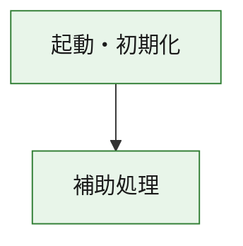
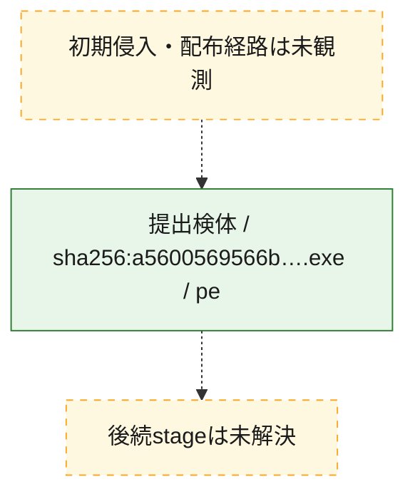
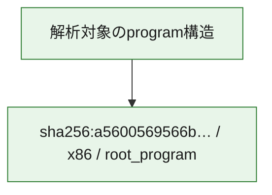

# 全体ロジック：a5600569566be6e9bd1e67eabf342060b7bd2874f42b83d05045783f979576a5

代表関数の静的証跡から、起動・初期化の処理群を確認しました。

## 読み方

- phaseの掲載順は解析上の整理順です。observed_call_edgesがない段階間の実行順を断定しません。
- 図の実線は静的に観測した関係、点線と黄色のノードは未観測・未解決の関係を示します。
- 図は静的な要約であり、動的実行を再現するものではありません。
- 詳細な関数解説とfingerprintは[STATIC-LOGIC.md](STATIC-LOGIC.md)を参照してください。

## 静的可視化

### 実行フロー

### 感染チェーン

### モジュール関係

## 処理段階

### 1. 起動・初期化

entry pointから初期化と後続処理への移行を確認します。
確度: `confirmed_static_function_evidence`

- `a5600569566be6e9bd1e67eabf342060b7bd2874f42b83d05045783f979576a5:ghidra:3550c11f0` — 初期化と主要処理への分岐を行う入口関数です。 状態: `succeeded`、選定理由: `entry_point`, `meaningful_symbol_name`, `reviewed_call_centrality:2`, `role:entrypoint`

### 2. 補助処理

主要処理を支える一般内部関数またはlibrary処理を確認します。
確度: `confirmed_static_function_evidence_with_limits`

- `a5600569566be6e9bd1e67eabf342060b7bd2874f42b83d05045783f979576a5:ghidra:3550c1000` — 検体内部の一般処理を実装する関数です。 状態: `succeeded`、選定理由: `context_representative`, `reviewed_call_centrality:14`
- `a5600569566be6e9bd1e67eabf342060b7bd2874f42b83d05045783f979576a5:ghidra:3550c1330` — 検体内部の一般処理を実装する関数です。 状態: `limited_bad_instruction_or_flow`、選定理由: `context_representative`, `reviewed_call_centrality:2`
- `a5600569566be6e9bd1e67eabf342060b7bd2874f42b83d05045783f979576a5:ghidra:3550c1340` — 検体内部の一般処理を実装する関数です。 状態: `limited_bad_instruction_or_flow`、選定理由: `context_representative`, `reviewed_call_centrality:2`
- `a5600569566be6e9bd1e67eabf342060b7bd2874f42b83d05045783f979576a5:ghidra:3550c1350` — 検体内部の一般処理を実装する関数です。 状態: `succeeded`、選定理由: `context_representative`
- `a5600569566be6e9bd1e67eabf342060b7bd2874f42b83d05045783f979576a5:ghidra:3550e2e80` — 検体内部の一般処理を実装する関数です。 状態: `succeeded`、選定理由: `context_representative`, `reviewed_call_centrality:4`
- `a5600569566be6e9bd1e67eabf342060b7bd2874f42b83d05045783f979576a5:ghidra:3550e2f80` — 検体内部の一般処理を実装する関数です。 状態: `succeeded`、選定理由: `context_representative`, `reviewed_call_centrality:4`
- `a5600569566be6e9bd1e67eabf342060b7bd2874f42b83d05045783f979576a5:ghidra:3550e2fe0` — 検体内部の一般処理を実装する関数です。 状態: `succeeded`、選定理由: `context_representative`, `reviewed_call_centrality:7`
- `a5600569566be6e9bd1e67eabf342060b7bd2874f42b83d05045783f979576a5:ghidra:3550e30c0` — 検体内部の一般処理を実装する関数です。 状態: `succeeded`、選定理由: `context_representative`, `reviewed_call_centrality:1`
- `a5600569566be6e9bd1e67eabf342060b7bd2874f42b83d05045783f979576a5:ghidra:3550e3140` — 検体内部の一般処理を実装する関数です。 状態: `succeeded`、選定理由: `context_representative`, `reviewed_call_centrality:1`
- `a5600569566be6e9bd1e67eabf342060b7bd2874f42b83d05045783f979576a5:ghidra:3550e31a0` — 検体内部の一般処理を実装する関数です。 状態: `succeeded`、選定理由: `context_representative`, `reviewed_call_centrality:2`
- `a5600569566be6e9bd1e67eabf342060b7bd2874f42b83d05045783f979576a5:ghidra:3550e3210` — 検体内部の一般処理を実装する関数です。 状態: `succeeded`、選定理由: `context_representative`
- `a5600569566be6e9bd1e67eabf342060b7bd2874f42b83d05045783f979576a5:ghidra:3550e3370` — 検体内部の一般処理を実装する関数です。 状態: `succeeded`、選定理由: `context_representative`
- `a5600569566be6e9bd1e67eabf342060b7bd2874f42b83d05045783f979576a5:ghidra:3550e33a0` — 検体内部の一般処理を実装する関数です。 状態: `succeeded`、選定理由: `context_representative`
- `a5600569566be6e9bd1e67eabf342060b7bd2874f42b83d05045783f979576a5:ghidra:3550e33e0` — 検体内部の一般処理を実装する関数です。 状態: `succeeded`、選定理由: `context_representative`, `reviewed_call_centrality:4`
- `a5600569566be6e9bd1e67eabf342060b7bd2874f42b83d05045783f979576a5:ghidra:3550e34c0` — 検体内部の一般処理を実装する関数です。 状態: `succeeded`、選定理由: `context_representative`, `reviewed_call_centrality:1`
- `a5600569566be6e9bd1e67eabf342060b7bd2874f42b83d05045783f979576a5:ghidra:3550e3520` — 検体内部の一般処理を実装する関数です。 状態: `succeeded`、選定理由: `context_representative`
- `a5600569566be6e9bd1e67eabf342060b7bd2874f42b83d05045783f979576a5:ghidra:3550e35a0` — 検体内部の一般処理を実装する関数です。 状態: `succeeded`、選定理由: `context_representative`
- `a5600569566be6e9bd1e67eabf342060b7bd2874f42b83d05045783f979576a5:ghidra:3550e3600` — 検体内部の一般処理を実装する関数です。 状態: `succeeded`、選定理由: `context_representative`, `reviewed_call_centrality:1`
- `a5600569566be6e9bd1e67eabf342060b7bd2874f42b83d05045783f979576a5:ghidra:3550e36d0` — 検体内部の一般処理を実装する関数です。 状態: `succeeded`、選定理由: `context_representative`
- `a5600569566be6e9bd1e67eabf342060b7bd2874f42b83d05045783f979576a5:ghidra:3550e37d0` — 検体内部の一般処理を実装する関数です。 状態: `succeeded`、選定理由: `context_representative`, `reviewed_call_centrality:2`
- `a5600569566be6e9bd1e67eabf342060b7bd2874f42b83d05045783f979576a5:ghidra:3550e3860` — 検体内部の一般処理を実装する関数です。 状態: `succeeded`、選定理由: `context_representative`, `reviewed_call_centrality:6`
- `a5600569566be6e9bd1e67eabf342060b7bd2874f42b83d05045783f979576a5:ghidra:3550e39b0` — 検体内部の一般処理を実装する関数です。 状態: `succeeded`、選定理由: `context_representative`, `reviewed_call_centrality:6`
- `a5600569566be6e9bd1e67eabf342060b7bd2874f42b83d05045783f979576a5:ghidra:3550e3c20` — 検体内部の一般処理を実装する関数です。 状態: `succeeded`、選定理由: `context_representative`, `reviewed_call_centrality:5`
- `a5600569566be6e9bd1e67eabf342060b7bd2874f42b83d05045783f979576a5:ghidra:3550e3d30` — 検体内部の一般処理を実装する関数です。 状態: `succeeded`、選定理由: `context_representative`, `reviewed_call_centrality:4`
- `a5600569566be6e9bd1e67eabf342060b7bd2874f42b83d05045783f979576a5:ghidra:3550e3fb0` — 検体内部の一般処理を実装する関数です。 状態: `succeeded`、選定理由: `context_representative`, `reviewed_call_centrality:2`
- `a5600569566be6e9bd1e67eabf342060b7bd2874f42b83d05045783f979576a5:ghidra:3550e4050` — 検体内部の一般処理を実装する関数です。 状態: `succeeded`、選定理由: `context_representative`, `reviewed_call_centrality:27`
- `a5600569566be6e9bd1e67eabf342060b7bd2874f42b83d05045783f979576a5:ghidra:3550e4c00` — 検体内部の一般処理を実装する関数です。 状態: `succeeded`、選定理由: `context_representative`, `reviewed_call_centrality:6`
- `a5600569566be6e9bd1e67eabf342060b7bd2874f42b83d05045783f979576a5:ghidra:3550e4d20` — 検体内部の一般処理を実装する関数です。 状態: `succeeded`、選定理由: `context_representative`, `reviewed_call_centrality:4`
- `a5600569566be6e9bd1e67eabf342060b7bd2874f42b83d05045783f979576a5:ghidra:3550f0030` — compiler生成処理または汎用library処理とみられる関数です。 状態: `succeeded`、選定理由: `entry_point`, `meaningful_symbol_name`, `reviewed_call_centrality:7`
- `a5600569566be6e9bd1e67eabf342060b7bd2874f42b83d05045783f979576a5:ghidra:3550f0050` — compiler生成処理または汎用library処理とみられる関数です。 状態: `succeeded`、選定理由: `entry_point`, `meaningful_symbol_name`, `reviewed_call_centrality:4`
- `a5600569566be6e9bd1e67eabf342060b7bd2874f42b83d05045783f979576a5:ghidra:3550feb00` — compiler生成処理または汎用library処理とみられる関数です。 状態: `limited_bad_instruction_or_flow`、選定理由: `entry_point`, `meaningful_symbol_name`, `reviewed_call_centrality:12`

## 観測したcall関係

- `a5600569566be6e9bd1e67eabf342060b7bd2874f42b83d05045783f979576a5:ghidra:3550c1000` → `a5600569566be6e9bd1e67eabf342060b7bd2874f42b83d05045783f979576a5:ghidra:3550f0050` （`support` → `support`）
- `a5600569566be6e9bd1e67eabf342060b7bd2874f42b83d05045783f979576a5:ghidra:3550c11f0` → `a5600569566be6e9bd1e67eabf342060b7bd2874f42b83d05045783f979576a5:ghidra:3550c1000` （`startup` → `support`）
- `a5600569566be6e9bd1e67eabf342060b7bd2874f42b83d05045783f979576a5:ghidra:3550e30c0` → `a5600569566be6e9bd1e67eabf342060b7bd2874f42b83d05045783f979576a5:ghidra:3550e2fe0` （`support` → `support`）
- `a5600569566be6e9bd1e67eabf342060b7bd2874f42b83d05045783f979576a5:ghidra:3550e31a0` → `a5600569566be6e9bd1e67eabf342060b7bd2874f42b83d05045783f979576a5:ghidra:3550e2fe0` （`support` → `support`）
- `a5600569566be6e9bd1e67eabf342060b7bd2874f42b83d05045783f979576a5:ghidra:3550e37d0` → `a5600569566be6e9bd1e67eabf342060b7bd2874f42b83d05045783f979576a5:ghidra:3550e2fe0` （`support` → `support`）
- `a5600569566be6e9bd1e67eabf342060b7bd2874f42b83d05045783f979576a5:ghidra:3550e3860` → `a5600569566be6e9bd1e67eabf342060b7bd2874f42b83d05045783f979576a5:ghidra:3550e2f80` （`support` → `support`）
- `a5600569566be6e9bd1e67eabf342060b7bd2874f42b83d05045783f979576a5:ghidra:3550e3860` → `a5600569566be6e9bd1e67eabf342060b7bd2874f42b83d05045783f979576a5:ghidra:3550e2fe0` （`support` → `support`）
- `a5600569566be6e9bd1e67eabf342060b7bd2874f42b83d05045783f979576a5:ghidra:3550e39b0` → `a5600569566be6e9bd1e67eabf342060b7bd2874f42b83d05045783f979576a5:ghidra:3550e2f80` （`support` → `support`）
- `a5600569566be6e9bd1e67eabf342060b7bd2874f42b83d05045783f979576a5:ghidra:3550e39b0` → `a5600569566be6e9bd1e67eabf342060b7bd2874f42b83d05045783f979576a5:ghidra:3550e2fe0` （`support` → `support`）
- `a5600569566be6e9bd1e67eabf342060b7bd2874f42b83d05045783f979576a5:ghidra:3550e3c20` → `a5600569566be6e9bd1e67eabf342060b7bd2874f42b83d05045783f979576a5:ghidra:3550e2f80` （`support` → `support`）
- `a5600569566be6e9bd1e67eabf342060b7bd2874f42b83d05045783f979576a5:ghidra:3550e3c20` → `a5600569566be6e9bd1e67eabf342060b7bd2874f42b83d05045783f979576a5:ghidra:3550e2fe0` （`support` → `support`）
- `a5600569566be6e9bd1e67eabf342060b7bd2874f42b83d05045783f979576a5:ghidra:3550e3d30` → `a5600569566be6e9bd1e67eabf342060b7bd2874f42b83d05045783f979576a5:ghidra:3550e2e80` （`support` → `support`）
- `a5600569566be6e9bd1e67eabf342060b7bd2874f42b83d05045783f979576a5:ghidra:3550e3d30` → `a5600569566be6e9bd1e67eabf342060b7bd2874f42b83d05045783f979576a5:ghidra:3550e3c20` （`support` → `support`）
- `a5600569566be6e9bd1e67eabf342060b7bd2874f42b83d05045783f979576a5:ghidra:3550e3fb0` → `a5600569566be6e9bd1e67eabf342060b7bd2874f42b83d05045783f979576a5:ghidra:3550e2e80` （`support` → `support`）
- `a5600569566be6e9bd1e67eabf342060b7bd2874f42b83d05045783f979576a5:ghidra:3550e3fb0` → `a5600569566be6e9bd1e67eabf342060b7bd2874f42b83d05045783f979576a5:ghidra:3550e3c20` （`support` → `support`）
- `a5600569566be6e9bd1e67eabf342060b7bd2874f42b83d05045783f979576a5:ghidra:3550e4050` → `a5600569566be6e9bd1e67eabf342060b7bd2874f42b83d05045783f979576a5:ghidra:3550e2e80` （`support` → `support`）
- `a5600569566be6e9bd1e67eabf342060b7bd2874f42b83d05045783f979576a5:ghidra:3550e4050` → `a5600569566be6e9bd1e67eabf342060b7bd2874f42b83d05045783f979576a5:ghidra:3550e2f80` （`support` → `support`）
- `a5600569566be6e9bd1e67eabf342060b7bd2874f42b83d05045783f979576a5:ghidra:3550e4050` → `a5600569566be6e9bd1e67eabf342060b7bd2874f42b83d05045783f979576a5:ghidra:3550e2fe0` （`support` → `support`）
- `a5600569566be6e9bd1e67eabf342060b7bd2874f42b83d05045783f979576a5:ghidra:3550e4050` → `a5600569566be6e9bd1e67eabf342060b7bd2874f42b83d05045783f979576a5:ghidra:3550e3140` （`support` → `support`）
- `a5600569566be6e9bd1e67eabf342060b7bd2874f42b83d05045783f979576a5:ghidra:3550e4050` → `a5600569566be6e9bd1e67eabf342060b7bd2874f42b83d05045783f979576a5:ghidra:3550e31a0` （`support` → `support`）
- `a5600569566be6e9bd1e67eabf342060b7bd2874f42b83d05045783f979576a5:ghidra:3550e4050` → `a5600569566be6e9bd1e67eabf342060b7bd2874f42b83d05045783f979576a5:ghidra:3550e34c0` （`support` → `support`）
- `a5600569566be6e9bd1e67eabf342060b7bd2874f42b83d05045783f979576a5:ghidra:3550e4050` → `a5600569566be6e9bd1e67eabf342060b7bd2874f42b83d05045783f979576a5:ghidra:3550e37d0` （`support` → `support`）
- `a5600569566be6e9bd1e67eabf342060b7bd2874f42b83d05045783f979576a5:ghidra:3550e4050` → `a5600569566be6e9bd1e67eabf342060b7bd2874f42b83d05045783f979576a5:ghidra:3550e3c20` （`support` → `support`）
- `a5600569566be6e9bd1e67eabf342060b7bd2874f42b83d05045783f979576a5:ghidra:3550e4050` → `a5600569566be6e9bd1e67eabf342060b7bd2874f42b83d05045783f979576a5:ghidra:3550e3d30` （`support` → `support`）
- `a5600569566be6e9bd1e67eabf342060b7bd2874f42b83d05045783f979576a5:ghidra:3550e4050` → `a5600569566be6e9bd1e67eabf342060b7bd2874f42b83d05045783f979576a5:ghidra:3550e4c00` （`support` → `support`）
- `a5600569566be6e9bd1e67eabf342060b7bd2874f42b83d05045783f979576a5:ghidra:3550e4050` → `a5600569566be6e9bd1e67eabf342060b7bd2874f42b83d05045783f979576a5:ghidra:3550e4d20` （`support` → `support`）
- `a5600569566be6e9bd1e67eabf342060b7bd2874f42b83d05045783f979576a5:ghidra:3550e4c00` → `a5600569566be6e9bd1e67eabf342060b7bd2874f42b83d05045783f979576a5:ghidra:3550e2e80` （`support` → `support`）
- `a5600569566be6e9bd1e67eabf342060b7bd2874f42b83d05045783f979576a5:ghidra:3550e4c00` → `a5600569566be6e9bd1e67eabf342060b7bd2874f42b83d05045783f979576a5:ghidra:3550e4050` （`support` → `support`）
- `a5600569566be6e9bd1e67eabf342060b7bd2874f42b83d05045783f979576a5:ghidra:3550e4d20` → `a5600569566be6e9bd1e67eabf342060b7bd2874f42b83d05045783f979576a5:ghidra:3550e4050` （`support` → `support`）
- `a5600569566be6e9bd1e67eabf342060b7bd2874f42b83d05045783f979576a5:ghidra:3550e4d20` → `a5600569566be6e9bd1e67eabf342060b7bd2874f42b83d05045783f979576a5:ghidra:3550e4c00` （`support` → `support`）
- `ghidra-function:38d3c01cdd4283bae368a042` → `ghidra-external:54a54064d63aa86e6c0d0354` （`unclassified` → `unclassified`）
- `ghidra-function:38d3c01cdd4283bae368a042` → `ghidra-function:5a1dd67d5c06aa62678bffb8` （`unclassified` → `unclassified`）
- `ghidra-function:38d3c01cdd4283bae368a042` → `ghidra-function:8ce917513aedcd2d8de3ba87` （`unclassified` → `unclassified`）
- `ghidra-function:45686c5dadb5a3d06ff805c4` → `ghidra-external:1ed7102dddd9fff1b58d4c62` （`unclassified` → `unclassified`）
- `ghidra-function:45686c5dadb5a3d06ff805c4` → `ghidra-external:605a5809d6060c463e35702e` （`unclassified` → `unclassified`）
- `ghidra-function:45686c5dadb5a3d06ff805c4` → `ghidra-external:6bac0e52f81192acb93ab661` （`unclassified` → `unclassified`）
- `ghidra-function:45686c5dadb5a3d06ff805c4` → `ghidra-external:83835a130068eae040917d35` （`unclassified` → `unclassified`）
- `ghidra-function:478dfbe2ca464beb1d5f952f` → `ghidra-external:605a5809d6060c463e35702e` （`unclassified` → `unclassified`）
- `ghidra-function:478dfbe2ca464beb1d5f952f` → `ghidra-function:2db63e90baebea9fb01275f1` （`unclassified` → `unclassified`）
- `ghidra-function:478dfbe2ca464beb1d5f952f` → `ghidra-function:591fa32ccc0deffc5fb891b6` （`unclassified` → `unclassified`）
- `ghidra-function:478dfbe2ca464beb1d5f952f` → `ghidra-function:949af57290b3024525daecc5` （`unclassified` → `unclassified`）
- `ghidra-function:478dfbe2ca464beb1d5f952f` → `ghidra-function:c856d305259f9eed01e36e04` （`unclassified` → `unclassified`）
- `ghidra-function:4e335dc7bbabfb4b2daf9e85` → `ghidra-external:54a54064d63aa86e6c0d0354` （`unclassified` → `unclassified`）
- `ghidra-function:4e335dc7bbabfb4b2daf9e85` → `ghidra-function:949af57290b3024525daecc5` （`unclassified` → `unclassified`）
- `ghidra-function:58b73026bad816f20321abb1` → `ghidra-function:5d94c65bfa55b82f17ef9043` （`unclassified` → `unclassified`）
- `ghidra-function:58b73026bad816f20321abb1` → `ghidra-function:6b2af57866e5d9f1086d1075` （`unclassified` → `unclassified`）
- `ghidra-function:5a1dd67d5c06aa62678bffb8` → `ghidra-external:54a54064d63aa86e6c0d0354` （`unclassified` → `unclassified`）
- `ghidra-function:5a1dd67d5c06aa62678bffb8` → `ghidra-function:6b2af57866e5d9f1086d1075` （`unclassified` → `unclassified`）
- `ghidra-function:5a1dd67d5c06aa62678bffb8` → `ghidra-function:8ce917513aedcd2d8de3ba87` （`unclassified` → `unclassified`）
- `ghidra-function:5a1dd67d5c06aa62678bffb8` → `ghidra-function:db8c422c2e80dc8d2be75e72` （`unclassified` → `unclassified`）
- `ghidra-function:5d94c65bfa55b82f17ef9043` → `ghidra-function:4691acabe2af40d11d1de9d7` （`unclassified` → `unclassified`）
- `ghidra-function:5d94c65bfa55b82f17ef9043` → `ghidra-function:7093e14cf1ac21d556e682d8` （`unclassified` → `unclassified`）
- `ghidra-function:836080cbd58117ed9c119c96` → `ghidra-external:2f00d4c45910c643b251b00d` （`unclassified` → `unclassified`）
- `ghidra-function:836080cbd58117ed9c119c96` → `ghidra-external:558440e5b490211bd76d4244` （`unclassified` → `unclassified`）
- `ghidra-function:836080cbd58117ed9c119c96` → `ghidra-external:7a38a14b6072d9b7724f2130` （`unclassified` → `unclassified`）
- `ghidra-function:836080cbd58117ed9c119c96` → `ghidra-external:a60e9640a3f5e8aa627a2a40` （`unclassified` → `unclassified`）
- `ghidra-function:836080cbd58117ed9c119c96` → `ghidra-external:bed2af5873142a0a016c0b20` （`unclassified` → `unclassified`）
- `ghidra-function:836080cbd58117ed9c119c96` → `ghidra-external:e0ef1b1faad4b4250753d93b` （`unclassified` → `unclassified`）
- `ghidra-function:836080cbd58117ed9c119c96` → `ghidra-external:fa1d68902fbfacccaf8dea73` （`unclassified` → `unclassified`）
- `ghidra-function:836080cbd58117ed9c119c96` → `ghidra-function:03497b9eace8afc84ccbe43c` （`unclassified` → `unclassified`）
- `ghidra-function:836080cbd58117ed9c119c96` → `ghidra-function:105139092dfced1605da7674` （`unclassified` → `unclassified`）
- `ghidra-function:836080cbd58117ed9c119c96` → `ghidra-function:4e335dc7bbabfb4b2daf9e85` （`unclassified` → `unclassified`）
- `ghidra-function:836080cbd58117ed9c119c96` → `ghidra-function:7e9f63b7bf9902b3375f3b67` （`unclassified` → `unclassified`）
- `ghidra-function:836080cbd58117ed9c119c96` → `ghidra-function:dcfd9905dbbfe6a9bb47786d` （`unclassified` → `unclassified`）
- `ghidra-function:84a49de997d9008e0e082617` → `ghidra-external:cbba0a40fd9b3e1f56627a63` （`unclassified` → `unclassified`）
- `ghidra-function:84a49de997d9008e0e082617` → `ghidra-function:3c0256f28d3a3820082547dc` （`unclassified` → `unclassified`）
- `ghidra-function:84a49de997d9008e0e082617` → `ghidra-function:4691acabe2af40d11d1de9d7` （`unclassified` → `unclassified`）
- `ghidra-function:84a49de997d9008e0e082617` → `ghidra-function:51e29da8d2f8afd8bf9df098` （`unclassified` → `unclassified`）
- `ghidra-function:84a49de997d9008e0e082617` → `ghidra-function:7093e14cf1ac21d556e682d8` （`unclassified` → `unclassified`）
- `ghidra-function:84a49de997d9008e0e082617` → `ghidra-function:db8c422c2e80dc8d2be75e72` （`unclassified` → `unclassified`）
- `ghidra-function:87c4e48813e683e48b8d0861` → `ghidra-external:cbba0a40fd9b3e1f56627a63` （`unclassified` → `unclassified`）
- `ghidra-function:87c4e48813e683e48b8d0861` → `ghidra-function:3c0256f28d3a3820082547dc` （`unclassified` → `unclassified`）
- `ghidra-function:87c4e48813e683e48b8d0861` → `ghidra-function:4691acabe2af40d11d1de9d7` （`unclassified` → `unclassified`）
- `ghidra-function:87c4e48813e683e48b8d0861` → `ghidra-function:51e29da8d2f8afd8bf9df098` （`unclassified` → `unclassified`）
- `ghidra-function:87c4e48813e683e48b8d0861` → `ghidra-function:7093e14cf1ac21d556e682d8` （`unclassified` → `unclassified`）
- `ghidra-function:87c4e48813e683e48b8d0861` → `ghidra-function:db8c422c2e80dc8d2be75e72` （`unclassified` → `unclassified`）
- `ghidra-function:8ce917513aedcd2d8de3ba87` → `ghidra-external:80b9b47930bb8590b64233e0` （`unclassified` → `unclassified`）
- `ghidra-function:8ce917513aedcd2d8de3ba87` → `ghidra-external:cbba0a40fd9b3e1f56627a63` （`unclassified` → `unclassified`）
- `ghidra-function:8ce917513aedcd2d8de3ba87` → `ghidra-function:0729b370c01309b4df0c8b64` （`unclassified` → `unclassified`）
- `ghidra-function:8ce917513aedcd2d8de3ba87` → `ghidra-function:38d3c01cdd4283bae368a042` （`unclassified` → `unclassified`）
- `ghidra-function:8ce917513aedcd2d8de3ba87` → `ghidra-function:3c0256f28d3a3820082547dc` （`unclassified` → `unclassified`）
- `ghidra-function:8ce917513aedcd2d8de3ba87` → `ghidra-function:4691acabe2af40d11d1de9d7` （`unclassified` → `unclassified`）
- `ghidra-function:8ce917513aedcd2d8de3ba87` → `ghidra-function:4a25d6eda4f17a06ab1d54bc` （`unclassified` → `unclassified`）
- `ghidra-function:8ce917513aedcd2d8de3ba87` → `ghidra-function:50736795467d7772eafdecea` （`unclassified` → `unclassified`）
- `ghidra-function:8ce917513aedcd2d8de3ba87` → `ghidra-function:51e29da8d2f8afd8bf9df098` （`unclassified` → `unclassified`）
- `ghidra-function:8ce917513aedcd2d8de3ba87` → `ghidra-function:5a1dd67d5c06aa62678bffb8` （`unclassified` → `unclassified`）
- `ghidra-function:8ce917513aedcd2d8de3ba87` → `ghidra-function:5d94c65bfa55b82f17ef9043` （`unclassified` → `unclassified`）
- `ghidra-function:8ce917513aedcd2d8de3ba87` → `ghidra-function:624171d22c2cbfa5e99f00d8` （`unclassified` → `unclassified`）
- `ghidra-function:8ce917513aedcd2d8de3ba87` → `ghidra-function:6b2af57866e5d9f1086d1075` （`unclassified` → `unclassified`）
- `ghidra-function:8ce917513aedcd2d8de3ba87` → `ghidra-function:7093e14cf1ac21d556e682d8` （`unclassified` → `unclassified`）
- `ghidra-function:8ce917513aedcd2d8de3ba87` → `ghidra-function:83a493dd264d2eaa9eef1c6c` （`unclassified` → `unclassified`）
- `ghidra-function:8ce917513aedcd2d8de3ba87` → `ghidra-function:8d370f0a695a89b5162ccfa8` （`unclassified` → `unclassified`）
- `ghidra-function:8ce917513aedcd2d8de3ba87` → `ghidra-function:8f37f9471f26c5cb9794fa0f` （`unclassified` → `unclassified`）
- `ghidra-function:8ce917513aedcd2d8de3ba87` → `ghidra-function:936c59a9523d161b0d78513c` （`unclassified` → `unclassified`）
- `ghidra-function:8ce917513aedcd2d8de3ba87` → `ghidra-function:b3b28e1a5206ab1ee64479fc` （`unclassified` → `unclassified`）
- `ghidra-function:8ce917513aedcd2d8de3ba87` → `ghidra-function:bb1b7a3044df40e1f5efdef2` （`unclassified` → `unclassified`）
- `ghidra-function:8ce917513aedcd2d8de3ba87` → `ghidra-function:c22d28612a3ebf85d00ed8ad` （`unclassified` → `unclassified`）
- `ghidra-function:8ce917513aedcd2d8de3ba87` → `ghidra-function:db8c422c2e80dc8d2be75e72` （`unclassified` → `unclassified`）
- `ghidra-function:8ce917513aedcd2d8de3ba87` → `ghidra-function:e34e58eb7075d08ee42ee5c6` （`unclassified` → `unclassified`）
- `ghidra-function:8ce917513aedcd2d8de3ba87` → `ghidra-function:e4dcb02b759483fae9a1e99c` （`unclassified` → `unclassified`）
- `ghidra-function:8ce917513aedcd2d8de3ba87` → `ghidra-function:eb4ac8a5a2de331cc951b349` （`unclassified` → `unclassified`）
- `ghidra-function:8d370f0a695a89b5162ccfa8` → `ghidra-function:4691acabe2af40d11d1de9d7` （`unclassified` → `unclassified`）
- `ghidra-function:8f37f9471f26c5cb9794fa0f` → `ghidra-external:45a3b7a40a77f0262c3d9b6f` （`unclassified` → `unclassified`）
- `ghidra-function:8f37f9471f26c5cb9794fa0f` → `ghidra-function:5d94c65bfa55b82f17ef9043` （`unclassified` → `unclassified`）
- `ghidra-function:8f37f9471f26c5cb9794fa0f` → `ghidra-function:6b2af57866e5d9f1086d1075` （`unclassified` → `unclassified`）
- `ghidra-function:963a4666613ddc0bc2bba320` → `ghidra-function:2743b6ae88ede56abea03dba` （`unclassified` → `unclassified`）
- `ghidra-function:a2a6efc83010f0c676d495c4` → `ghidra-external:cbba0a40fd9b3e1f56627a63` （`unclassified` → `unclassified`）
- `ghidra-function:b72142e86ee53adf084a207d` → `ghidra-function:2743b6ae88ede56abea03dba` （`unclassified` → `unclassified`）
- `ghidra-function:b8f24a7651b7ce2442fa3525` → `ghidra-external:1ed7102dddd9fff1b58d4c62` （`unclassified` → `unclassified`）
- `ghidra-function:b8f24a7651b7ce2442fa3525` → `ghidra-function:034f7757b9867c2739f7ee59` （`unclassified` → `unclassified`）
- `ghidra-function:b8f24a7651b7ce2442fa3525` → `ghidra-function:0e6aeccd055963dee9f6b946` （`unclassified` → `unclassified`）
- `ghidra-function:b8f24a7651b7ce2442fa3525` → `ghidra-function:10912107a8e861dc8bb2a85d` （`unclassified` → `unclassified`）
- `ghidra-function:b8f24a7651b7ce2442fa3525` → `ghidra-function:275266c144ab1985e32abd88` （`unclassified` → `unclassified`）
- `ghidra-function:b8f24a7651b7ce2442fa3525` → `ghidra-function:60254e54faa9a5759003050d` （`unclassified` → `unclassified`）
- `ghidra-function:b8f24a7651b7ce2442fa3525` → `ghidra-function:75127923704ce6ae9b824f1f` （`unclassified` → `unclassified`）
- `ghidra-function:b8f24a7651b7ce2442fa3525` → `ghidra-function:9d35d0ea195daa1b31a404ac` （`unclassified` → `unclassified`）
- `ghidra-function:b8f24a7651b7ce2442fa3525` → `ghidra-function:a15ed8621390f80b2e44098c` （`unclassified` → `unclassified`）
- `ghidra-function:c22d28612a3ebf85d00ed8ad` → `ghidra-function:4691acabe2af40d11d1de9d7` （`unclassified` → `unclassified`）
- `ghidra-function:eefd269edde361cfcaeb4657` → `ghidra-function:4691acabe2af40d11d1de9d7` （`unclassified` → `unclassified`）
- `ghidra-function:f401a7a641b4ca083f6538c6` → `ghidra-external:2f00d4c45910c643b251b00d` （`unclassified` → `unclassified`）
- `ghidra-function:f401a7a641b4ca083f6538c6` → `ghidra-function:836080cbd58117ed9c119c96` （`unclassified` → `unclassified`）

## 解析範囲と制約

- 選定外関数は全体inventoryへ残しますが、関数本体の個別解説対象にはしていません。
- indirect call、難読化、packer、VM、壊れたcontrol flowによりcall関係が欠落する場合があります。
- 文書は静的解析に基づき、検体実行や外部通信による動的確認は行っていません。
