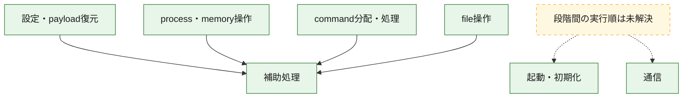
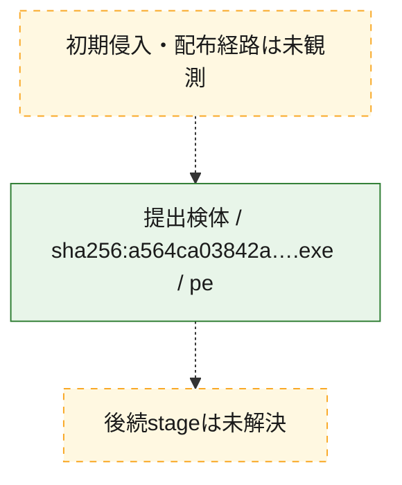
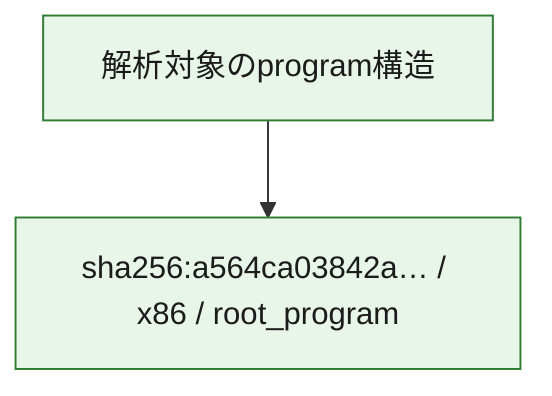

# 全体ロジック：a564ca03842ac237973a6f07a1c25fb5a072d8fb7424b6ac8684888377391d9a

代表関数の静的証跡から、起動・初期化、設定・payload復元、process・memory操作、通信、command分配・処理、file操作の処理群を確認しました。

## 読み方

- phaseの掲載順は解析上の整理順です。observed_call_edgesがない段階間の実行順を断定しません。
- 図の実線は静的に観測した関係、点線と黄色のノードは未観測・未解決の関係を示します。
- 図は静的な要約であり、動的実行を再現するものではありません。
- 詳細な関数解説とfingerprintは[STATIC-LOGIC.md](STATIC-LOGIC.md)を参照してください。

## 静的可視化

### 実行フロー

### 感染チェーン

### モジュール関係

## 処理段階

### 1. 起動・初期化

entry pointから初期化と後続処理への移行を確認します。
確度: `confirmed_static_function_evidence`

- `a564ca03842ac237973a6f07a1c25fb5a072d8fb7424b6ac8684888377391d9a:ghidra:140007474` — 初期化と主要処理への分岐を行う入口関数です。 状態: `succeeded`、選定理由: `call_graph_centrality:in=0,out=2`, `entry_point`, `meaningful_symbol_name`, `reviewed_call_centrality:2`, `role:entrypoint`
- `a564ca03842ac237973a6f07a1c25fb5a072d8fb7424b6ac8684888377391d9a:ghidra:14000e748` — 初期化と主要処理への分岐を行う入口関数です。 状態: `succeeded`、選定理由: `call_graph_centrality:in=1,out=2`, `entry_point`, `meaningful_symbol_name`, `reviewed_call_centrality:3`, `role:entrypoint`

### 2. 設定・payload復元

設定、resource、payload、暗号化データの復元・変換を確認します。
確度: `confirmed_static_function_evidence`

- `a564ca03842ac237973a6f07a1c25fb5a072d8fb7424b6ac8684888377391d9a:ghidra:1400049b0` — 暗号、hash、encoding、または復号処理に関係する関数です。 状態: `succeeded`、選定理由: `call_graph_centrality:in=1,out=16`, `large_function:instructions=352`, `reviewed_call_centrality:21`, `reviewed_call_centrality:22`, `role:cryptographic_transform`, `role:process_or_memory_operation`
- `a564ca03842ac237973a6f07a1c25fb5a072d8fb7424b6ac8684888377391d9a:ghidra:14000721c` — 設定、resource、payloadなどの解析・変換を行う関数です。 状態: `succeeded`、選定理由: `call_graph_centrality:in=0,out=19`, `reviewed_call_centrality:19`, `reviewed_call_centrality:22`, `role:config_or_data_transform`
- `a564ca03842ac237973a6f07a1c25fb5a072d8fb7424b6ac8684888377391d9a:ghidra:14000d0e0` — 設定、resource、payloadなどの解析・変換を行う関数です。 状態: `succeeded`、選定理由: `call_graph_centrality:in=1,out=6`, `large_function:instructions=117`, `meaningful_symbol_name`, `reviewed_call_centrality:11`, `reviewed_call_centrality:7`, `role:config_or_data_transform`
- `a564ca03842ac237973a6f07a1c25fb5a072d8fb7424b6ac8684888377391d9a:ghidra:14000dc7c` — 設定、resource、payloadなどの解析・変換を行う関数です。 状態: `succeeded`、選定理由: `call_graph_centrality:in=1,out=8`, `large_function:instructions=112`, `meaningful_symbol_name`, `reviewed_call_centrality:10`, `reviewed_call_centrality:9`, `role:config_or_data_transform`
- `a564ca03842ac237973a6f07a1c25fb5a072d8fb7424b6ac8684888377391d9a:ghidra:14000eab0` — 設定、resource、payloadなどの解析・変換を行う関数です。 状態: `succeeded`、選定理由: `call_graph_centrality:in=1,out=4`, `large_function:instructions=241`, `meaningful_symbol_name`, `reviewed_call_centrality:5`, `reviewed_call_centrality:8`, `role:config_or_data_transform`

### 3. process・memory操作

process、thread、module、memory操作と実行移行を確認します。
確度: `confirmed_static_function_evidence_with_limits`

- `a564ca03842ac237973a6f07a1c25fb5a072d8fb7424b6ac8684888377391d9a:ghidra:140003b20` — process、thread、module、またはmemory操作に関係する関数です。 状態: `succeeded`、選定理由: `call_graph_centrality:in=1,out=16`, `large_function:instructions=165`, `reviewed_call_centrality:20`, `reviewed_call_centrality:26`, `role:process_or_memory_operation`
- `a564ca03842ac237973a6f07a1c25fb5a072d8fb7424b6ac8684888377391d9a:ghidra:1400066c0` — process、thread、module、またはmemory操作に関係する関数です。 状態: `succeeded`、選定理由: `call_graph_centrality:in=1,out=11`, `large_function:instructions=198`, `reviewed_call_centrality:13`, `reviewed_call_centrality:16`, `role:anti_analysis`, `role:process_or_memory_operation`
- `a564ca03842ac237973a6f07a1c25fb5a072d8fb7424b6ac8684888377391d9a:ghidra:140007674` — process、thread、module、またはmemory操作に関係する関数です。 状態: `succeeded`、選定理由: `call_graph_centrality:in=3,out=9`, `large_function:instructions=72`, `reviewed_call_centrality:14`, `reviewed_call_centrality:19`, `role:process_or_memory_operation`
- `a564ca03842ac237973a6f07a1c25fb5a072d8fb7424b6ac8684888377391d9a:ghidra:14000badc` — process、thread、module、またはmemory操作に関係する関数です。 状態: `limited_bad_instruction_or_flow`、選定理由: `call_graph_centrality:in=10,out=3`, `meaningful_symbol_name`, `reviewed_call_centrality:15`, `reviewed_call_centrality:16`, `role:process_or_memory_operation`
- `a564ca03842ac237973a6f07a1c25fb5a072d8fb7424b6ac8684888377391d9a:ghidra:14000c0a4` — process、thread、module、またはmemory操作に関係する関数です。 状態: `succeeded`、選定理由: `call_graph_centrality:in=1,out=6`, `large_function:instructions=123`, `meaningful_symbol_name`, `reviewed_call_centrality:10`, `reviewed_call_centrality:7`, `role:process_or_memory_operation`
- `a564ca03842ac237973a6f07a1c25fb5a072d8fb7424b6ac8684888377391d9a:ghidra:14000c66c` — process、thread、module、またはmemory操作に関係する関数です。 状態: `succeeded`、選定理由: `call_graph_centrality:in=1,out=6`, `large_function:instructions=151`, `meaningful_symbol_name`, `reviewed_call_centrality:7`, `reviewed_call_centrality:8`, `role:process_or_memory_operation`
- `a564ca03842ac237973a6f07a1c25fb5a072d8fb7424b6ac8684888377391d9a:ghidra:14000d87c` — process、thread、module、またはmemory操作に関係する関数です。 状態: `succeeded`、選定理由: `call_graph_centrality:in=3,out=4`, `meaningful_symbol_name`, `reviewed_call_centrality:10`, `reviewed_call_centrality:8`, `role:process_or_memory_operation`
- `a564ca03842ac237973a6f07a1c25fb5a072d8fb7424b6ac8684888377391d9a:ghidra:140011828` — process、thread、module、またはmemory操作に関係する関数です。 状態: `succeeded`、選定理由: `call_graph_centrality:in=1,out=12`, `large_function:instructions=216`, `meaningful_symbol_name`, `reviewed_call_centrality:14`, `reviewed_call_centrality:16`, `role:file_operation`, `role:process_or_memory_operation`
- `a564ca03842ac237973a6f07a1c25fb5a072d8fb7424b6ac8684888377391d9a:ghidra:140012f40` — process、thread、module、またはmemory操作に関係する関数です。 状態: `succeeded`、選定理由: `call_graph_centrality:in=10,out=5`, `large_function:instructions=127`, `meaningful_symbol_name`, `reviewed_call_centrality:17`, `reviewed_call_centrality:19`, `role:process_or_memory_operation`
- `a564ca03842ac237973a6f07a1c25fb5a072d8fb7424b6ac8684888377391d9a:ghidra:140017b5c` — process、thread、module、またはmemory操作に関係する関数です。 状態: `succeeded`、選定理由: `call_graph_centrality:in=1,out=10`, `large_function:instructions=328`, `meaningful_symbol_name`, `reviewed_call_centrality:14`, `reviewed_call_centrality:15`, `role:file_operation`, `role:process_or_memory_operation`
- `a564ca03842ac237973a6f07a1c25fb5a072d8fb7424b6ac8684888377391d9a:ghidra:140018268` — process、thread、module、またはmemory操作に関係する関数です。 状態: `succeeded`、選定理由: `call_graph_centrality:in=1,out=5`, `large_function:instructions=100`, `meaningful_symbol_name`, `reviewed_call_centrality:7`, `reviewed_call_centrality:8`, `role:file_operation`, `role:process_or_memory_operation`

### 4. 通信

通信初期化、endpoint処理、送受信の役割を確認します。
確度: `confirmed_static_function_evidence_with_limits`

- `a564ca03842ac237973a6f07a1c25fb5a072d8fb7424b6ac8684888377391d9a:ghidra:1400050c0` — 通信初期化、送受信、またはendpoint処理に関係する関数です。 状態: `failed`、選定理由: `call_graph_centrality:in=0,out=14`, `large_function:instructions=642`, `reviewed_call_centrality:16`, `reviewed_call_centrality:24`, `role:network_communication`

### 5. command分配・処理

受信commandやtaskの解釈、分配、個別handlerへの移行を確認します。
確度: `confirmed_static_function_evidence`

- `a564ca03842ac237973a6f07a1c25fb5a072d8fb7424b6ac8684888377391d9a:ghidra:140007da8` — commandの解釈、分配、または個別処理を担当する関数です。 状態: `succeeded`、選定理由: `call_graph_centrality:in=6,out=3`, `meaningful_symbol_name`, `reviewed_call_centrality:11`, `reviewed_call_centrality:9`, `role:command_dispatch_or_handler`
- `a564ca03842ac237973a6f07a1c25fb5a072d8fb7424b6ac8684888377391d9a:ghidra:140009608` — commandの解釈、分配、または個別処理を担当する関数です。 状態: `succeeded`、選定理由: `call_graph_centrality:in=1,out=6`, `large_function:instructions=145`, `meaningful_symbol_name`, `reviewed_call_centrality:8`, `role:command_dispatch_or_handler`
- `a564ca03842ac237973a6f07a1c25fb5a072d8fb7424b6ac8684888377391d9a:ghidra:1400099a4` — commandの解釈、分配、または個別処理を担当する関数です。 状態: `succeeded`、選定理由: `call_graph_centrality:in=1,out=20`, `large_function:instructions=311`, `reviewed_call_centrality:21`, `reviewed_call_centrality:25`, `role:command_dispatch_or_handler`
- `a564ca03842ac237973a6f07a1c25fb5a072d8fb7424b6ac8684888377391d9a:ghidra:140009ea0` — commandの解釈、分配、または個別処理を担当する関数です。 状態: `succeeded`、選定理由: `call_graph_centrality:in=1,out=11`, `large_function:instructions=188`, `meaningful_symbol_name`, `reviewed_call_centrality:13`, `reviewed_call_centrality:17`, `role:command_dispatch_or_handler`
- `a564ca03842ac237973a6f07a1c25fb5a072d8fb7424b6ac8684888377391d9a:ghidra:14000a858` — commandの解釈、分配、または個別処理を担当する関数です。 状態: `succeeded`、選定理由: `call_graph_centrality:in=0,out=9`, `large_function:instructions=115`, `meaningful_symbol_name`, `reviewed_call_centrality:10`, `reviewed_call_centrality:9`, `role:command_dispatch_or_handler`, `role:config_or_data_transform`
- `a564ca03842ac237973a6f07a1c25fb5a072d8fb7424b6ac8684888377391d9a:ghidra:14000ace8` — commandの解釈、分配、または個別処理を担当する関数です。 状態: `succeeded`、選定理由: `call_graph_centrality:in=2,out=11`, `large_function:instructions=168`, `reviewed_call_centrality:13`, `reviewed_call_centrality:15`, `role:command_dispatch_or_handler`, `role:config_or_data_transform`
- `a564ca03842ac237973a6f07a1c25fb5a072d8fb7424b6ac8684888377391d9a:ghidra:14000ea50` — commandの解釈、分配、または個別処理を担当する関数です。 状態: `succeeded`、選定理由: `call_graph_centrality:in=15,out=5`, `reviewed_call_centrality:21`, `role:command_dispatch_or_handler`
- `a564ca03842ac237973a6f07a1c25fb5a072d8fb7424b6ac8684888377391d9a:ghidra:1400169f0` — commandの解釈、分配、または個別処理を担当する関数です。 状態: `succeeded`、選定理由: `call_graph_centrality:in=1,out=4`, `large_function:instructions=260`, `meaningful_symbol_name`, `reviewed_call_centrality:6`, `role:command_dispatch_or_handler`

### 6. file操作

fileやdirectoryの作成、読書き、削除を確認します。
確度: `confirmed_static_function_evidence`

- `a564ca03842ac237973a6f07a1c25fb5a072d8fb7424b6ac8684888377391d9a:ghidra:140017a3c` — fileまたはdirectoryの読書き・管理に関係する関数です。 状態: `succeeded`、選定理由: `call_graph_centrality:in=1,out=7`, `meaningful_symbol_name`, `reviewed_call_centrality:10`, `reviewed_call_centrality:13`, `role:file_operation`
- `a564ca03842ac237973a6f07a1c25fb5a072d8fb7424b6ac8684888377391d9a:ghidra:1400184c4` — fileまたはdirectoryの読書き・管理に関係する関数です。 状態: `succeeded`、選定理由: `call_graph_centrality:in=1,out=15`, `large_function:instructions=202`, `meaningful_symbol_name`, `reviewed_call_centrality:19`, `role:file_operation`
- `a564ca03842ac237973a6f07a1c25fb5a072d8fb7424b6ac8684888377391d9a:ghidra:1400194f0` — fileまたはdirectoryの読書き・管理に関係する関数です。 状態: `succeeded`、選定理由: `call_graph_centrality:in=1,out=8`, `meaningful_symbol_name`, `reviewed_call_centrality:10`, `reviewed_call_centrality:9`, `role:file_operation`

### 7. 補助処理

主要処理を支える一般内部関数またはlibrary処理を確認します。
確度: `confirmed_static_function_evidence`

- `a564ca03842ac237973a6f07a1c25fb5a072d8fb7424b6ac8684888377391d9a:ghidra:14000f5c4` — compiler生成処理または汎用library処理とみられる関数です。 状態: `succeeded`、選定理由: `call_graph_centrality:in=66,out=1`, `meaningful_symbol_name`, `reviewed_call_centrality:66`, `reviewed_call_centrality:67`
- `a564ca03842ac237973a6f07a1c25fb5a072d8fb7424b6ac8684888377391d9a:ghidra:14000f64c` — 検体内部の一般処理を実装する関数です。 状態: `succeeded`、選定理由: `call_graph_centrality:in=48,out=4`, `meaningful_symbol_name`, `reviewed_call_centrality:53`, `reviewed_call_centrality:54`

## 観測したcall関係

- `a564ca03842ac237973a6f07a1c25fb5a072d8fb7424b6ac8684888377391d9a:ghidra:14000c0a4` → `a564ca03842ac237973a6f07a1c25fb5a072d8fb7424b6ac8684888377391d9a:ghidra:14000f5c4` （`execution` → `support`）
- `a564ca03842ac237973a6f07a1c25fb5a072d8fb7424b6ac8684888377391d9a:ghidra:14000c66c` → `a564ca03842ac237973a6f07a1c25fb5a072d8fb7424b6ac8684888377391d9a:ghidra:14000f5c4` （`execution` → `support`）
- `a564ca03842ac237973a6f07a1c25fb5a072d8fb7424b6ac8684888377391d9a:ghidra:14000d0e0` → `a564ca03842ac237973a6f07a1c25fb5a072d8fb7424b6ac8684888377391d9a:ghidra:14000f5c4` （`configuration` → `support`）
- `a564ca03842ac237973a6f07a1c25fb5a072d8fb7424b6ac8684888377391d9a:ghidra:14000dc7c` → `a564ca03842ac237973a6f07a1c25fb5a072d8fb7424b6ac8684888377391d9a:ghidra:14000f5c4` （`configuration` → `support`）
- `a564ca03842ac237973a6f07a1c25fb5a072d8fb7424b6ac8684888377391d9a:ghidra:14000eab0` → `a564ca03842ac237973a6f07a1c25fb5a072d8fb7424b6ac8684888377391d9a:ghidra:14000f5c4` （`configuration` → `support`）
- `a564ca03842ac237973a6f07a1c25fb5a072d8fb7424b6ac8684888377391d9a:ghidra:14000f64c` → `a564ca03842ac237973a6f07a1c25fb5a072d8fb7424b6ac8684888377391d9a:ghidra:14000f5c4` （`support` → `support`）
- `a564ca03842ac237973a6f07a1c25fb5a072d8fb7424b6ac8684888377391d9a:ghidra:1400169f0` → `a564ca03842ac237973a6f07a1c25fb5a072d8fb7424b6ac8684888377391d9a:ghidra:14000f5c4` （`dispatch` → `support`）
- `a564ca03842ac237973a6f07a1c25fb5a072d8fb7424b6ac8684888377391d9a:ghidra:140017a3c` → `a564ca03842ac237973a6f07a1c25fb5a072d8fb7424b6ac8684888377391d9a:ghidra:14000f5c4` （`file_activity` → `support`）
- `a564ca03842ac237973a6f07a1c25fb5a072d8fb7424b6ac8684888377391d9a:ghidra:1400184c4` → `a564ca03842ac237973a6f07a1c25fb5a072d8fb7424b6ac8684888377391d9a:ghidra:14000f5c4` （`file_activity` → `support`）
- `a564ca03842ac237973a6f07a1c25fb5a072d8fb7424b6ac8684888377391d9a:ghidra:1400194f0` → `a564ca03842ac237973a6f07a1c25fb5a072d8fb7424b6ac8684888377391d9a:ghidra:14000f5c4` （`file_activity` → `support`）

## 解析範囲と制約

- 選定外関数は全体inventoryへ残しますが、関数本体の個別解説対象にはしていません。
- indirect call、難読化、packer、VM、壊れたcontrol flowによりcall関係が欠落する場合があります。
- 文書は静的解析に基づき、検体実行や外部通信による動的確認は行っていません。
