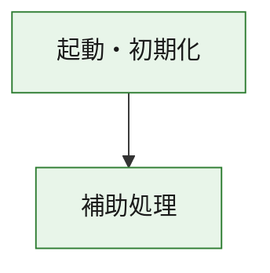
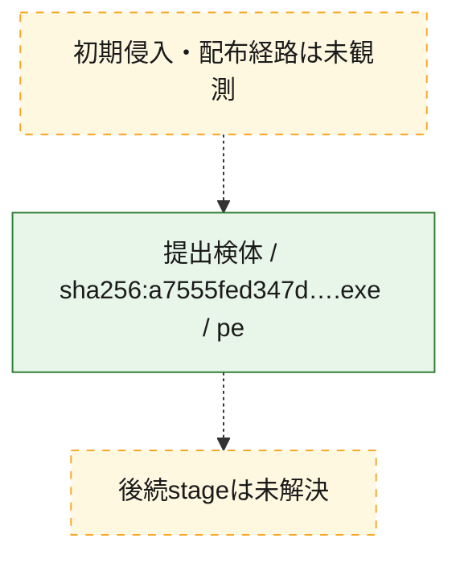
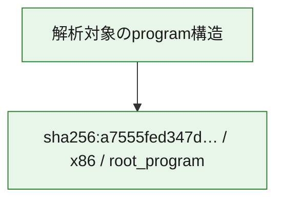

# 全体ロジック：a7555fed347dc25cb4c4df920138b4a3a0206cfdb73ba0d70f170ea7f799e7fc

代表関数の静的証跡から、起動・初期化の処理群を確認しました。

## 読み方

- phaseの掲載順は解析上の整理順です。observed_call_edgesがない段階間の実行順を断定しません。
- 図の実線は静的に観測した関係、点線と黄色のノードは未観測・未解決の関係を示します。
- 図は静的な要約であり、動的実行を再現するものではありません。
- 詳細な関数解説とfingerprintは[STATIC-LOGIC.md](STATIC-LOGIC.md)を参照してください。

## 静的可視化

### 実行フロー

### 感染チェーン

### モジュール関係

## 処理段階

### 1. 起動・初期化

entry pointから初期化と後続処理への移行を確認します。
確度: `confirmed_static_function_evidence`

- `a7555fed347dc25cb4c4df920138b4a3a0206cfdb73ba0d70f170ea7f799e7fc:ghidra:180001010` — 初期化と主要処理への分岐を行う入口関数です。 状態: `succeeded`、選定理由: `entry_point`, `meaningful_symbol_name`, `reviewed_call_centrality:22`, `role:entrypoint`, `small_program_complete_context`

### 2. 補助処理

主要処理を支える一般内部関数またはlibrary処理を確認します。
確度: `confirmed_static_function_evidence`

- `a7555fed347dc25cb4c4df920138b4a3a0206cfdb73ba0d70f170ea7f799e7fc:ghidra:180001240` — 検体内部の一般処理を実装する関数です。 状態: `succeeded`、選定理由: `context_representative`, `reviewed_call_centrality:2`, `small_program_complete_context`
- `a7555fed347dc25cb4c4df920138b4a3a0206cfdb73ba0d70f170ea7f799e7fc:ghidra:180001350` — 検体内部の一般処理を実装する関数です。 状態: `succeeded`、選定理由: `context_representative`, `reviewed_call_centrality:25`, `small_program_complete_context`
- `a7555fed347dc25cb4c4df920138b4a3a0206cfdb73ba0d70f170ea7f799e7fc:ghidra:180003780` — 検体内部の一般処理を実装する関数です。 状態: `succeeded`、選定理由: `context_representative`, `reviewed_call_centrality:2`, `small_program_complete_context`
- `a7555fed347dc25cb4c4df920138b4a3a0206cfdb73ba0d70f170ea7f799e7fc:ghidra:1800038e0` — 検体内部の一般処理を実装する関数です。 状態: `succeeded`、選定理由: `context_representative`, `reviewed_call_centrality:2`, `small_program_complete_context`

## 観測したcall関係

- `a7555fed347dc25cb4c4df920138b4a3a0206cfdb73ba0d70f170ea7f799e7fc:ghidra:180001010` → `a7555fed347dc25cb4c4df920138b4a3a0206cfdb73ba0d70f170ea7f799e7fc:ghidra:180001240` （`startup` → `support`）
- `a7555fed347dc25cb4c4df920138b4a3a0206cfdb73ba0d70f170ea7f799e7fc:ghidra:180001010` → `a7555fed347dc25cb4c4df920138b4a3a0206cfdb73ba0d70f170ea7f799e7fc:ghidra:180001350` （`startup` → `support`）
- `a7555fed347dc25cb4c4df920138b4a3a0206cfdb73ba0d70f170ea7f799e7fc:ghidra:180001350` → `a7555fed347dc25cb4c4df920138b4a3a0206cfdb73ba0d70f170ea7f799e7fc:ghidra:180001240` （`support` → `support`）
- `a7555fed347dc25cb4c4df920138b4a3a0206cfdb73ba0d70f170ea7f799e7fc:ghidra:180001350` → `a7555fed347dc25cb4c4df920138b4a3a0206cfdb73ba0d70f170ea7f799e7fc:ghidra:180003780` （`support` → `support`）
- `a7555fed347dc25cb4c4df920138b4a3a0206cfdb73ba0d70f170ea7f799e7fc:ghidra:180001350` → `a7555fed347dc25cb4c4df920138b4a3a0206cfdb73ba0d70f170ea7f799e7fc:ghidra:1800038e0` （`support` → `support`）
- `a7555fed347dc25cb4c4df920138b4a3a0206cfdb73ba0d70f170ea7f799e7fc:ghidra:180003780` → `a7555fed347dc25cb4c4df920138b4a3a0206cfdb73ba0d70f170ea7f799e7fc:ghidra:1800038e0` （`support` → `support`）
- `ghidra-function:23a6b8aaa66b0a5594e830f6` → `ghidra-function:3f5273f03c781197f6072715` （`unclassified` → `unclassified`）
- `ghidra-function:c52608db8585164db3cc3eba` → `ghidra-function:1f6bcdbc1065592376a8bbb4` （`unclassified` → `unclassified`）
- `ghidra-function:c52608db8585164db3cc3eba` → `ghidra-function:208ac2c29b795256c083b6a5` （`unclassified` → `unclassified`）
- `ghidra-function:c52608db8585164db3cc3eba` → `ghidra-function:2a9e57ba7f3bf0dd35d31377` （`unclassified` → `unclassified`）
- `ghidra-function:c52608db8585164db3cc3eba` → `ghidra-function:34390038715a5f550abc49d2` （`unclassified` → `unclassified`）
- `ghidra-function:c52608db8585164db3cc3eba` → `ghidra-function:4c03f75f76521b56a55a60dd` （`unclassified` → `unclassified`）
- `ghidra-function:c52608db8585164db3cc3eba` → `ghidra-function:4da0f169c51ba6a0cc8624c2` （`unclassified` → `unclassified`）
- `ghidra-function:c52608db8585164db3cc3eba` → `ghidra-function:7af91804034c32eada43c0b5` （`unclassified` → `unclassified`）
- `ghidra-function:c52608db8585164db3cc3eba` → `ghidra-function:b84290049837386e14b90a59` （`unclassified` → `unclassified`）
- `ghidra-function:c52608db8585164db3cc3eba` → `ghidra-function:e6ba8f195dbacccf795accbb` （`unclassified` → `unclassified`）
- `ghidra-function:c52608db8585164db3cc3eba` → `ghidra-function:ea4e47fdb942d4542f783011` （`unclassified` → `unclassified`）
- `ghidra-function:c52608db8585164db3cc3eba` → `ghidra-function:ebb2aa2e4f950c6d7ce086df` （`unclassified` → `unclassified`）
- `ghidra-function:c52608db8585164db3cc3eba` → `ghidra-function:fcd798243631254447221a08` （`unclassified` → `unclassified`）
- `ghidra-function:ea4e47fdb942d4542f783011` → `ghidra-external:031abd6da4f032e492fcff62` （`unclassified` → `unclassified`）
- `ghidra-function:ea4e47fdb942d4542f783011` → `ghidra-external:095d5afc718e01ab0503ee81` （`unclassified` → `unclassified`）
- `ghidra-function:ea4e47fdb942d4542f783011` → `ghidra-external:238cb58c6ddd0ad936c82544` （`unclassified` → `unclassified`）
- `ghidra-function:ea4e47fdb942d4542f783011` → `ghidra-external:2c4950239742ca9372689457` （`unclassified` → `unclassified`）
- `ghidra-function:ea4e47fdb942d4542f783011` → `ghidra-external:2ee989886417c59080cefdaa` （`unclassified` → `unclassified`）
- `ghidra-function:ea4e47fdb942d4542f783011` → `ghidra-external:3508ddb15fe55b1924c39f1f` （`unclassified` → `unclassified`）
- `ghidra-function:ea4e47fdb942d4542f783011` → `ghidra-external:4d56966193e00b439ef05e0a` （`unclassified` → `unclassified`）
- `ghidra-function:ea4e47fdb942d4542f783011` → `ghidra-external:79606fec1a7870d491882192` （`unclassified` → `unclassified`）
- `ghidra-function:ea4e47fdb942d4542f783011` → `ghidra-external:7f3ad0b78dc98eace1202509` （`unclassified` → `unclassified`）
- `ghidra-function:ea4e47fdb942d4542f783011` → `ghidra-external:8372166dd1d3bcbab4bdeafe` （`unclassified` → `unclassified`）
- `ghidra-function:ea4e47fdb942d4542f783011` → `ghidra-external:9cf9ccd3a21b3c8c7facd2bf` （`unclassified` → `unclassified`）
- `ghidra-function:ea4e47fdb942d4542f783011` → `ghidra-external:a55064a4b03b79f18ab605fc` （`unclassified` → `unclassified`）
- `ghidra-function:ea4e47fdb942d4542f783011` → `ghidra-external:a9ace9dc66113b3b17532065` （`unclassified` → `unclassified`）
- `ghidra-function:ea4e47fdb942d4542f783011` → `ghidra-external:b9842ad82ad0dedec43f6725` （`unclassified` → `unclassified`）
- `ghidra-function:ea4e47fdb942d4542f783011` → `ghidra-external:ba18a7a37e7fe60913a343ea` （`unclassified` → `unclassified`）
- `ghidra-function:ea4e47fdb942d4542f783011` → `ghidra-external:cd5a9f5b6332d2e815d8835a` （`unclassified` → `unclassified`）
- `ghidra-function:ea4e47fdb942d4542f783011` → `ghidra-external:dab875873ab701ff7f0b7edf` （`unclassified` → `unclassified`）
- `ghidra-function:ea4e47fdb942d4542f783011` → `ghidra-external:e6a118e143a33f9ee67421a7` （`unclassified` → `unclassified`）
- `ghidra-function:ea4e47fdb942d4542f783011` → `ghidra-external:f03b8ca777c835c7e2e0cbbb` （`unclassified` → `unclassified`）
- `ghidra-function:ea4e47fdb942d4542f783011` → `ghidra-external:fa5742eea27aa13f7fce73bd` （`unclassified` → `unclassified`）
- `ghidra-function:ea4e47fdb942d4542f783011` → `ghidra-external:fef18391a9fa3ead053d7e82` （`unclassified` → `unclassified`）
- `ghidra-function:ea4e47fdb942d4542f783011` → `ghidra-function:23a6b8aaa66b0a5594e830f6` （`unclassified` → `unclassified`）
- `ghidra-function:ea4e47fdb942d4542f783011` → `ghidra-function:3f5273f03c781197f6072715` （`unclassified` → `unclassified`）
- `ghidra-function:ea4e47fdb942d4542f783011` → `ghidra-function:fcd798243631254447221a08` （`unclassified` → `unclassified`）

## 解析範囲と制約

- 選定外関数は全体inventoryへ残しますが、関数本体の個別解説対象にはしていません。
- indirect call、難読化、packer、VM、壊れたcontrol flowによりcall関係が欠落する場合があります。
- 文書は静的解析に基づき、検体実行や外部通信による動的確認は行っていません。
