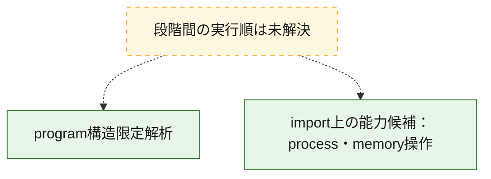
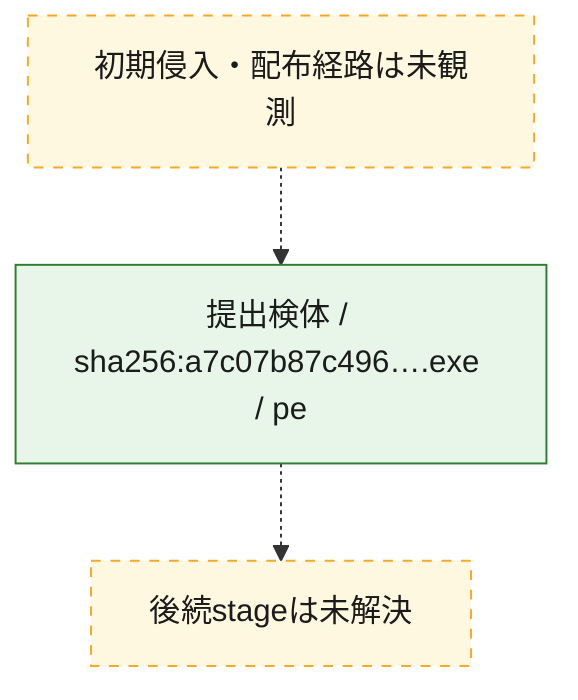
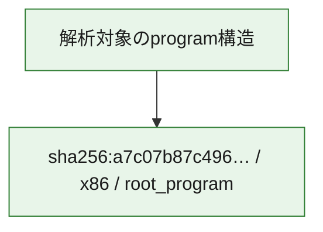

# 全体ロジック：a7c07b87c4968d7ac8120e2c6fb40ccd615d1bd25d4445fbe129d7c66235740a

Ghidra MCPでprogram構造を取得しましたが、解析可能な関数本体は認識されなかったため、関数ロジックを断定せず構造限定結果を記録します。 import表から、process・memory操作に関連する能力候補を整理しました。

## 読み方

- phaseの掲載順は解析上の整理順です。observed_call_edgesがない段階間の実行順を断定しません。
- 図の実線は静的に観測した関係、点線と黄色のノードは未観測・未解決の関係を示します。
- 図は静的な要約であり、動的実行を再現するものではありません。
- 詳細な関数解説とfingerprintは[STATIC-LOGIC.md](STATIC-LOGIC.md)を参照してください。

## 静的可視化

### 実行フロー

### 感染チェーン

### モジュール関係

## 処理段階

### 1. program構造限定解析

Ghidra MCPで1個のprogram、2件のentry point、4件のimportを確認しましたが、解析可能な関数本体は認識されませんでした。
確度: `confirmed_program_structure_with_function_recovery_limit`

### 2. import上の能力候補：process・memory操作

import表に関連APIが存在します。能力候補を示す証跡であり、実行経路や悪性動作の成立を単独では証明しません。
確度: `confirmed_import_presence_not_execution`

- import証跡: `LoadLibraryA`, `VirtualProtect`

## 観測したcall関係

- 代表関数間で直接解決できた呼出関係はありません。

## 解析範囲と制約

- Ghidraで関数本体を認識できなかったため、entry point、import、export、segment等のprogram構造だけを確認しています。
- 選定外関数は全体inventoryへ残しますが、関数本体の個別解説対象にはしていません。
- indirect call、難読化、packer、VM、壊れたcontrol flowによりcall関係が欠落する場合があります。
- 文書は静的解析に基づき、検体実行や外部通信による動的確認は行っていません。
