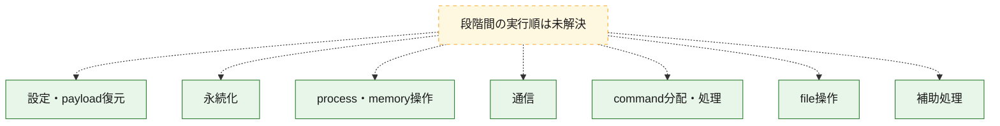
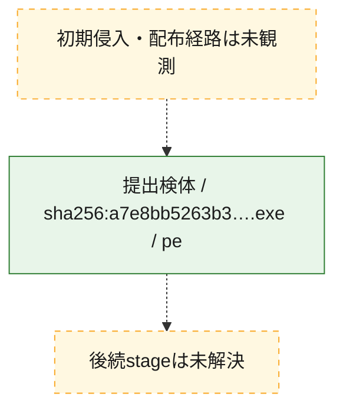
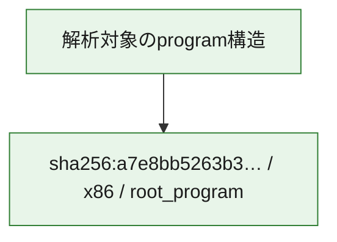

# 全体ロジック：a7e8bb5263b34be020d8b5c938b4c4187f390b9240f9ce757cae953da9988227

代表関数の静的証跡から、設定・payload復元、永続化、process・memory操作、通信、command分配・処理、file操作の処理群を確認しました。

## 読み方

- phaseの掲載順は解析上の整理順です。observed_call_edgesがない段階間の実行順を断定しません。
- 図の実線は静的に観測した関係、点線と黄色のノードは未観測・未解決の関係を示します。
- 図は静的な要約であり、動的実行を再現するものではありません。
- 詳細な関数解説とfingerprintは[STATIC-LOGIC.md](STATIC-LOGIC.md)を参照してください。

## 静的可視化

### 実行フロー

### 感染チェーン

### モジュール関係

## 処理段階

### 1. 設定・payload復元

設定、resource、payload、暗号化データの復元・変換を確認します。
確度: `confirmed_static_function_evidence`

- `a7e8bb5263b34be020d8b5c938b4c4187f390b9240f9ce757cae953da9988227:cil:0x06000544` — 暗号、hash、encoding、または復号処理に関係する関数です。 状態: `succeeded`、選定理由: `large_function:instructions=3108`, `reviewed_call_centrality:6`, `role:cryptographic_transform`
- `a7e8bb5263b34be020d8b5c938b4c4187f390b9240f9ce757cae953da9988227:cil:0x0600062d` — 設定、resource、payloadなどの解析・変換を行う関数です。 状態: `succeeded`、選定理由: `large_function:instructions=2870`, `reviewed_call_centrality:6`, `role:config_or_data_transform`
- `a7e8bb5263b34be020d8b5c938b4c4187f390b9240f9ce757cae953da9988227:cil:0x0600063a` — 暗号、hash、encoding、または復号処理に関係する関数です。 状態: `succeeded`、選定理由: `large_function:instructions=3428`, `reviewed_call_centrality:6`, `role:cryptographic_transform`
- `a7e8bb5263b34be020d8b5c938b4c4187f390b9240f9ce757cae953da9988227:cil:0x0600063b` — 暗号、hash、encoding、または復号処理に関係する関数です。 状態: `succeeded`、選定理由: `large_function:instructions=2585`, `reviewed_call_centrality:6`, `role:cryptographic_transform`
- `a7e8bb5263b34be020d8b5c938b4c4187f390b9240f9ce757cae953da9988227:cil:0x0600063c` — 暗号、hash、encoding、または復号処理に関係する関数です。 状態: `succeeded`、選定理由: `large_function:instructions=2823`, `reviewed_call_centrality:6`, `role:cryptographic_transform`
- `a7e8bb5263b34be020d8b5c938b4c4187f390b9240f9ce757cae953da9988227:cil:0x0600066d` — 暗号、hash、encoding、または復号処理に関係する関数です。 状態: `succeeded`、選定理由: `large_function:instructions=2828`, `reviewed_call_centrality:6`, `role:cryptographic_transform`
- `a7e8bb5263b34be020d8b5c938b4c4187f390b9240f9ce757cae953da9988227:cil:0x060006e3` — 暗号、hash、encoding、または復号処理に関係する関数です。 状態: `succeeded`、選定理由: `large_function:instructions=2590`, `reviewed_call_centrality:6`, `role:cryptographic_transform`
- `a7e8bb5263b34be020d8b5c938b4c4187f390b9240f9ce757cae953da9988227:cil:0x06000775` — 暗号、hash、encoding、または復号処理に関係する関数です。 状態: `succeeded`、選定理由: `large_function:instructions=2429`, `reviewed_call_centrality:6`, `role:cryptographic_transform`
- `a7e8bb5263b34be020d8b5c938b4c4187f390b9240f9ce757cae953da9988227:cil:0x06000905` — 暗号、hash、encoding、または復号処理に関係する関数です。 状態: `succeeded`、選定理由: `large_function:instructions=2429`, `reviewed_call_centrality:6`, `role:cryptographic_transform`
- `a7e8bb5263b34be020d8b5c938b4c4187f390b9240f9ce757cae953da9988227:cil:0x06000b46` — 暗号、hash、encoding、または復号処理に関係する関数です。 状態: `succeeded`、選定理由: `large_function:instructions=2429`, `reviewed_call_centrality:6`, `role:cryptographic_transform`
- `a7e8bb5263b34be020d8b5c938b4c4187f390b9240f9ce757cae953da9988227:cil:0x06000c18` — 暗号、hash、encoding、または復号処理に関係する関数です。 状態: `succeeded`、選定理由: `large_function:instructions=3826`, `reviewed_call_centrality:6`, `role:cryptographic_transform`
- `a7e8bb5263b34be020d8b5c938b4c4187f390b9240f9ce757cae953da9988227:cil:0x06000f90` — 暗号、hash、encoding、または復号処理に関係する関数です。 状態: `succeeded`、選定理由: `large_function:instructions=2949`, `reviewed_call_centrality:6`, `role:cryptographic_transform`
- `a7e8bb5263b34be020d8b5c938b4c4187f390b9240f9ce757cae953da9988227:cil:0x06001ce7` — 暗号、hash、encoding、または復号処理に関係する関数です。 状態: `succeeded`、選定理由: `large_function:instructions=4677`, `reviewed_call_centrality:6`, `role:cryptographic_transform`
- `a7e8bb5263b34be020d8b5c938b4c4187f390b9240f9ce757cae953da9988227:cil:0x06001ce8` — 暗号、hash、encoding、または復号処理に関係する関数です。 状態: `succeeded`、選定理由: `large_function:instructions=4118`, `reviewed_call_centrality:6`, `role:cryptographic_transform`

### 2. 永続化

自動起動や永続化に関係する設定変更を確認します。
確度: `confirmed_static_function_evidence`

- `a7e8bb5263b34be020d8b5c938b4c4187f390b9240f9ce757cae953da9988227:cil:0x06000022` — 自動起動または永続化に関係する処理を含む関数です。 状態: `succeeded`、選定理由: `large_function:instructions=3749`, `reviewed_call_centrality:6`, `role:persistence`
- `a7e8bb5263b34be020d8b5c938b4c4187f390b9240f9ce757cae953da9988227:cil:0x06000030` — 自動起動または永続化に関係する処理を含む関数です。 状態: `succeeded`、選定理由: `large_function:instructions=4578`, `reviewed_call_centrality:6`, `role:persistence`
- `a7e8bb5263b34be020d8b5c938b4c4187f390b9240f9ce757cae953da9988227:cil:0x06000661` — 自動起動または永続化に関係する処理を含む関数です。 状態: `succeeded`、選定理由: `large_function:instructions=3132`, `reviewed_call_centrality:6`, `role:persistence`
- `a7e8bb5263b34be020d8b5c938b4c4187f390b9240f9ce757cae953da9988227:cil:0x06000685` — 自動起動または永続化に関係する処理を含む関数です。 状態: `succeeded`、選定理由: `large_function:instructions=2415`, `reviewed_call_centrality:6`, `role:persistence`
- `a7e8bb5263b34be020d8b5c938b4c4187f390b9240f9ce757cae953da9988227:cil:0x06000725` — 自動起動または永続化に関係する処理を含む関数です。 状態: `succeeded`、選定理由: `large_function:instructions=3828`, `reviewed_call_centrality:6`, `role:persistence`
- `a7e8bb5263b34be020d8b5c938b4c4187f390b9240f9ce757cae953da9988227:cil:0x0600077a` — 自動起動または永続化に関係する処理を含む関数です。 状態: `succeeded`、選定理由: `large_function:instructions=3218`, `reviewed_call_centrality:6`, `role:persistence`
- `a7e8bb5263b34be020d8b5c938b4c4187f390b9240f9ce757cae953da9988227:cil:0x06000b4b` — 自動起動または永続化に関係する処理を含む関数です。 状態: `succeeded`、選定理由: `large_function:instructions=3218`, `reviewed_call_centrality:6`, `role:persistence`
- `a7e8bb5263b34be020d8b5c938b4c4187f390b9240f9ce757cae953da9988227:cil:0x06000c13` — 自動起動または永続化に関係する処理を含む関数です。 状態: `succeeded`、選定理由: `large_function:instructions=4392`, `reviewed_call_centrality:6`, `role:persistence`
- `a7e8bb5263b34be020d8b5c938b4c4187f390b9240f9ce757cae953da9988227:cil:0x06000c17` — 自動起動または永続化に関係する処理を含む関数です。 状態: `succeeded`、選定理由: `large_function:instructions=3052`, `reviewed_call_centrality:6`, `role:persistence`

### 3. process・memory操作

process、thread、module、memory操作と実行移行を確認します。
確度: `confirmed_static_function_evidence`

- `a7e8bb5263b34be020d8b5c938b4c4187f390b9240f9ce757cae953da9988227:cil:0x06000cfa` — process、thread、module、またはmemory操作に関係する関数です。 状態: `succeeded`、選定理由: `large_function:instructions=2181`, `reviewed_call_centrality:4`, `role:process_or_memory_operation`

### 4. 通信

通信初期化、endpoint処理、送受信の役割を確認します。
確度: `confirmed_static_function_evidence`

- `a7e8bb5263b34be020d8b5c938b4c4187f390b9240f9ce757cae953da9988227:cil:0x06000020` — 通信初期化、送受信、またはendpoint処理に関係する関数です。 状態: `succeeded`、選定理由: `reviewed_call_centrality:106`, `role:network_communication`
- `a7e8bb5263b34be020d8b5c938b4c4187f390b9240f9ce757cae953da9988227:cil:0x06000fbd` — 通信初期化、送受信、またはendpoint処理に関係する関数です。 状態: `succeeded`、選定理由: `large_function:instructions=83`, `reviewed_call_centrality:164`, `role:network_communication`
- `a7e8bb5263b34be020d8b5c938b4c4187f390b9240f9ce757cae953da9988227:cil:0x06001501` — 通信初期化、送受信、またはendpoint処理に関係する関数です。 状態: `succeeded`、選定理由: `large_function:instructions=441`, `reviewed_call_centrality:628`, `role:network_communication`

### 5. command分配・処理

受信commandやtaskの解釈、分配、個別handlerへの移行を確認します。
確度: `confirmed_static_function_evidence`

- `a7e8bb5263b34be020d8b5c938b4c4187f390b9240f9ce757cae953da9988227:cil:0x06000013` — commandの解釈、分配、または個別処理を担当する関数です。 状態: `succeeded`、選定理由: `large_function:instructions=2582`, `reviewed_call_centrality:6`, `role:command_dispatch_or_handler`

### 6. file操作

fileやdirectoryの作成、読書き、削除を確認します。
確度: `confirmed_static_function_evidence`

- `a7e8bb5263b34be020d8b5c938b4c4187f390b9240f9ce757cae953da9988227:cil:0x0600003f` — fileまたはdirectoryの読書き・管理に関係する関数です。 状態: `succeeded`、選定理由: `large_function:instructions=3022`, `reviewed_call_centrality:6`, `role:file_operation`
- `a7e8bb5263b34be020d8b5c938b4c4187f390b9240f9ce757cae953da9988227:cil:0x06000e08` — fileまたはdirectoryの読書き・管理に関係する関数です。 状態: `succeeded`、選定理由: `large_function:instructions=4138`, `reviewed_call_centrality:6`, `role:file_operation`
- `a7e8bb5263b34be020d8b5c938b4c4187f390b9240f9ce757cae953da9988227:cil:0x06000e12` — fileまたはdirectoryの読書き・管理に関係する関数です。 状態: `succeeded`、選定理由: `large_function:instructions=2823`, `reviewed_call_centrality:6`, `role:file_operation`

### 7. 補助処理

主要処理を支える一般内部関数またはlibrary処理を確認します。
確度: `confirmed_static_function_evidence`

- `a7e8bb5263b34be020d8b5c938b4c4187f390b9240f9ce757cae953da9988227:cil:0x06000224` — 検体内部の一般処理を実装する関数です。 状態: `succeeded`、選定理由: `large_function:instructions=2977`, `reviewed_call_centrality:4`

## 観測したcall関係

- 代表関数間で直接解決できた呼出関係はありません。

## 解析範囲と制約

- 選定外関数は全体inventoryへ残しますが、関数本体の個別解説対象にはしていません。
- indirect call、難読化、packer、VM、壊れたcontrol flowによりcall関係が欠落する場合があります。
- 文書は静的解析に基づき、検体実行や外部通信による動的確認は行っていません。
