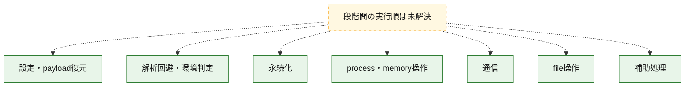
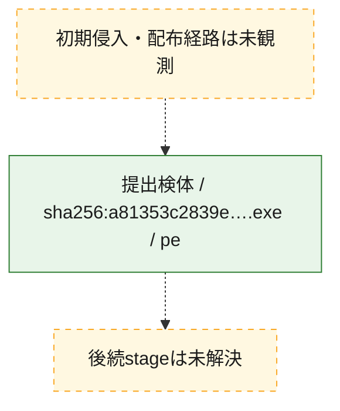
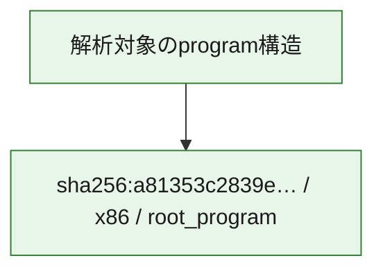

# 全体ロジック：a81353c2839e2f8ec2c7127be7dcf516a6f18708cb1f2dd564caf7d4aee50fb4

代表関数の静的証跡から、設定・payload復元、解析回避・環境判定、永続化、process・memory操作、通信、file操作の処理群を確認しました。

## 読み方

- phaseの掲載順は解析上の整理順です。observed_call_edgesがない段階間の実行順を断定しません。
- 図の実線は静的に観測した関係、点線と黄色のノードは未観測・未解決の関係を示します。
- 図は静的な要約であり、動的実行を再現するものではありません。
- 詳細な関数解説とfingerprintは[STATIC-LOGIC.md](STATIC-LOGIC.md)を参照してください。

## 静的可視化

### 実行フロー

### 感染チェーン

### モジュール関係

## 処理段階

### 1. 設定・payload復元

設定、resource、payload、暗号化データの復元・変換を確認します。
確度: `confirmed_static_function_evidence`

- `a81353c2839e2f8ec2c7127be7dcf516a6f18708cb1f2dd564caf7d4aee50fb4:ghidra:140001080` — 設定、resource、payloadなどの解析・変換を行う関数です。 状態: `succeeded`、選定理由: `meaningful_symbol_name`, `reviewed_call_centrality:5`, `role:config_or_data_transform`
- `a81353c2839e2f8ec2c7127be7dcf516a6f18708cb1f2dd564caf7d4aee50fb4:ghidra:1400053c0` — 暗号、hash、encoding、または復号処理に関係する関数です。 状態: `succeeded`、選定理由: `meaningful_symbol_name`, `reviewed_call_centrality:4`, `role:cryptographic_transform`
- `a81353c2839e2f8ec2c7127be7dcf516a6f18708cb1f2dd564caf7d4aee50fb4:ghidra:1400071e0` — 暗号、hash、encoding、または復号処理に関係する関数です。 状態: `succeeded`、選定理由: `meaningful_symbol_name`, `reviewed_call_centrality:4`, `role:cryptographic_transform`
- `a81353c2839e2f8ec2c7127be7dcf516a6f18708cb1f2dd564caf7d4aee50fb4:ghidra:14000a2a0` — 暗号、hash、encoding、または復号処理に関係する関数です。 状態: `succeeded`、選定理由: `meaningful_symbol_name`, `reviewed_call_centrality:5`, `role:cryptographic_transform`
- `a81353c2839e2f8ec2c7127be7dcf516a6f18708cb1f2dd564caf7d4aee50fb4:ghidra:14000cd60` — 設定、resource、payloadなどの解析・変換を行う関数です。 状態: `succeeded`、選定理由: `meaningful_symbol_name`, `reviewed_call_centrality:3`, `role:config_or_data_transform`
- `a81353c2839e2f8ec2c7127be7dcf516a6f18708cb1f2dd564caf7d4aee50fb4:ghidra:14000cde0` — 設定、resource、payloadなどの解析・変換を行う関数です。 状態: `succeeded`、選定理由: `meaningful_symbol_name`, `reviewed_call_centrality:4`, `role:config_or_data_transform`
- `a81353c2839e2f8ec2c7127be7dcf516a6f18708cb1f2dd564caf7d4aee50fb4:ghidra:14000d240` — 設定、resource、payloadなどの解析・変換を行う関数です。 状態: `succeeded`、選定理由: `meaningful_symbol_name`, `reviewed_call_centrality:7`, `role:config_or_data_transform`
- `a81353c2839e2f8ec2c7127be7dcf516a6f18708cb1f2dd564caf7d4aee50fb4:ghidra:14000d540` — 設定、resource、payloadなどの解析・変換を行う関数です。 状態: `succeeded`、選定理由: `meaningful_symbol_name`, `reviewed_call_centrality:4`, `role:config_or_data_transform`
- `a81353c2839e2f8ec2c7127be7dcf516a6f18708cb1f2dd564caf7d4aee50fb4:ghidra:140012980` — 暗号、hash、encoding、または復号処理に関係する関数です。 状態: `succeeded`、選定理由: `meaningful_symbol_name`, `reviewed_call_centrality:4`, `role:cryptographic_transform`
- `a81353c2839e2f8ec2c7127be7dcf516a6f18708cb1f2dd564caf7d4aee50fb4:ghidra:140012de0` — 暗号、hash、encoding、または復号処理に関係する関数です。 状態: `succeeded`、選定理由: `meaningful_symbol_name`, `reviewed_call_centrality:3`, `role:cryptographic_transform`
- `a81353c2839e2f8ec2c7127be7dcf516a6f18708cb1f2dd564caf7d4aee50fb4:ghidra:140012e80` — 暗号、hash、encoding、または復号処理に関係する関数です。 状態: `succeeded`、選定理由: `meaningful_symbol_name`, `reviewed_call_centrality:3`, `role:cryptographic_transform`
- `a81353c2839e2f8ec2c7127be7dcf516a6f18708cb1f2dd564caf7d4aee50fb4:ghidra:140012f60` — 暗号、hash、encoding、または復号処理に関係する関数です。 状態: `succeeded`、選定理由: `meaningful_symbol_name`, `reviewed_call_centrality:4`, `role:cryptographic_transform`
- `a81353c2839e2f8ec2c7127be7dcf516a6f18708cb1f2dd564caf7d4aee50fb4:ghidra:140013060` — 暗号、hash、encoding、または復号処理に関係する関数です。 状態: `succeeded`、選定理由: `meaningful_symbol_name`, `reviewed_call_centrality:1`, `role:cryptographic_transform`
- `a81353c2839e2f8ec2c7127be7dcf516a6f18708cb1f2dd564caf7d4aee50fb4:ghidra:140013620` — 暗号、hash、encoding、または復号処理に関係する関数です。 状態: `succeeded`、選定理由: `meaningful_symbol_name`, `reviewed_call_centrality:3`, `role:cryptographic_transform`
- `a81353c2839e2f8ec2c7127be7dcf516a6f18708cb1f2dd564caf7d4aee50fb4:ghidra:140013800` — 暗号、hash、encoding、または復号処理に関係する関数です。 状態: `succeeded`、選定理由: `meaningful_symbol_name`, `reviewed_call_centrality:3`, `role:cryptographic_transform`
- `a81353c2839e2f8ec2c7127be7dcf516a6f18708cb1f2dd564caf7d4aee50fb4:ghidra:140013840` — 暗号、hash、encoding、または復号処理に関係する関数です。 状態: `succeeded`、選定理由: `meaningful_symbol_name`, `reviewed_call_centrality:3`, `role:cryptographic_transform`
- `a81353c2839e2f8ec2c7127be7dcf516a6f18708cb1f2dd564caf7d4aee50fb4:ghidra:140013880` — 暗号、hash、encoding、または復号処理に関係する関数です。 状態: `succeeded`、選定理由: `meaningful_symbol_name`, `reviewed_call_centrality:3`, `role:cryptographic_transform`
- `a81353c2839e2f8ec2c7127be7dcf516a6f18708cb1f2dd564caf7d4aee50fb4:ghidra:1400138c0` — 暗号、hash、encoding、または復号処理に関係する関数です。 状態: `succeeded`、選定理由: `meaningful_symbol_name`, `reviewed_call_centrality:2`, `role:cryptographic_transform`
- `a81353c2839e2f8ec2c7127be7dcf516a6f18708cb1f2dd564caf7d4aee50fb4:ghidra:1400138e0` — 暗号、hash、encoding、または復号処理に関係する関数です。 状態: `succeeded`、選定理由: `meaningful_symbol_name`, `reviewed_call_centrality:3`, `role:cryptographic_transform`
- `a81353c2839e2f8ec2c7127be7dcf516a6f18708cb1f2dd564caf7d4aee50fb4:ghidra:140013920` — 暗号、hash、encoding、または復号処理に関係する関数です。 状態: `succeeded`、選定理由: `meaningful_symbol_name`, `reviewed_call_centrality:5`, `role:cryptographic_transform`
- `a81353c2839e2f8ec2c7127be7dcf516a6f18708cb1f2dd564caf7d4aee50fb4:ghidra:1400139e0` — 暗号、hash、encoding、または復号処理に関係する関数です。 状態: `succeeded`、選定理由: `meaningful_symbol_name`, `reviewed_call_centrality:5`, `role:cryptographic_transform`
- `a81353c2839e2f8ec2c7127be7dcf516a6f18708cb1f2dd564caf7d4aee50fb4:ghidra:140013aa0` — 暗号、hash、encoding、または復号処理に関係する関数です。 状態: `succeeded`、選定理由: `meaningful_symbol_name`, `reviewed_call_centrality:3`, `role:cryptographic_transform`
- `a81353c2839e2f8ec2c7127be7dcf516a6f18708cb1f2dd564caf7d4aee50fb4:ghidra:140013b00` — 暗号、hash、encoding、または復号処理に関係する関数です。 状態: `succeeded`、選定理由: `meaningful_symbol_name`, `reviewed_call_centrality:3`, `role:cryptographic_transform`
- `a81353c2839e2f8ec2c7127be7dcf516a6f18708cb1f2dd564caf7d4aee50fb4:ghidra:140013b60` — 暗号、hash、encoding、または復号処理に関係する関数です。 状態: `succeeded`、選定理由: `meaningful_symbol_name`, `reviewed_call_centrality:8`, `role:cryptographic_transform`

### 2. 解析回避・環境判定

debugger、sandbox、仮想環境、時間差などの判定を確認します。
確度: `confirmed_static_function_evidence`

- `a81353c2839e2f8ec2c7127be7dcf516a6f18708cb1f2dd564caf7d4aee50fb4:ghidra:14000a3c0` — debugger、仮想環境、sandbox、または時間差の確認に関係する関数です。 状態: `succeeded`、選定理由: `meaningful_symbol_name`, `reviewed_call_centrality:3`, `role:anti_analysis`

### 3. 永続化

自動起動や永続化に関係する設定変更を確認します。
確度: `confirmed_static_function_evidence`

- `a81353c2839e2f8ec2c7127be7dcf516a6f18708cb1f2dd564caf7d4aee50fb4:ghidra:14001ece0` — 自動起動または永続化に関係する処理を含む関数です。 状態: `succeeded`、選定理由: `meaningful_symbol_name`, `reviewed_call_centrality:2`, `role:persistence`

### 4. process・memory操作

process、thread、module、memory操作と実行移行を確認します。
確度: `confirmed_static_function_evidence`

- `a81353c2839e2f8ec2c7127be7dcf516a6f18708cb1f2dd564caf7d4aee50fb4:ghidra:140001be0` — process、thread、module、またはmemory操作に関係する関数です。 状態: `succeeded`、選定理由: `meaningful_symbol_name`, `reviewed_call_centrality:8`, `role:process_or_memory_operation`

### 5. 通信

通信初期化、endpoint処理、送受信の役割を確認します。
確度: `confirmed_static_function_evidence`

- `a81353c2839e2f8ec2c7127be7dcf516a6f18708cb1f2dd564caf7d4aee50fb4:ghidra:140014ea0` — 通信初期化、送受信、またはendpoint処理に関係する関数です。 状態: `succeeded`、選定理由: `meaningful_symbol_name`, `reviewed_call_centrality:2`, `role:network_communication`
- `a81353c2839e2f8ec2c7127be7dcf516a6f18708cb1f2dd564caf7d4aee50fb4:ghidra:140014ec0` — 通信初期化、送受信、またはendpoint処理に関係する関数です。 状態: `succeeded`、選定理由: `meaningful_symbol_name`, `reviewed_call_centrality:22`, `role:network_communication`
- `a81353c2839e2f8ec2c7127be7dcf516a6f18708cb1f2dd564caf7d4aee50fb4:ghidra:1400154c0` — 通信初期化、送受信、またはendpoint処理に関係する関数です。 状態: `succeeded`、選定理由: `meaningful_symbol_name`, `reviewed_call_centrality:3`, `role:network_communication`

### 6. file操作

fileやdirectoryの作成、読書き、削除を確認します。
確度: `confirmed_static_function_evidence`

- `a81353c2839e2f8ec2c7127be7dcf516a6f18708cb1f2dd564caf7d4aee50fb4:ghidra:14001eae0` — fileまたはdirectoryの読書き・管理に関係する関数です。 状態: `succeeded`、選定理由: `meaningful_symbol_name`, `reviewed_call_centrality:5`, `role:file_operation`

### 7. 補助処理

主要処理を支える一般内部関数またはlibrary処理を確認します。
確度: `confirmed_static_function_evidence`

- `a81353c2839e2f8ec2c7127be7dcf516a6f18708cb1f2dd564caf7d4aee50fb4:ghidra:140001180` — 検体内部の一般処理を実装する関数です。 状態: `succeeded`、選定理由: `meaningful_symbol_name`, `reviewed_call_centrality:3`

## 観測したcall関係

- 代表関数間で直接解決できた呼出関係はありません。

## 解析範囲と制約

- 選定外関数は全体inventoryへ残しますが、関数本体の個別解説対象にはしていません。
- indirect call、難読化、packer、VM、壊れたcontrol flowによりcall関係が欠落する場合があります。
- 文書は静的解析に基づき、検体実行や外部通信による動的確認は行っていません。
