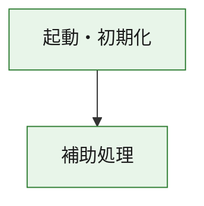
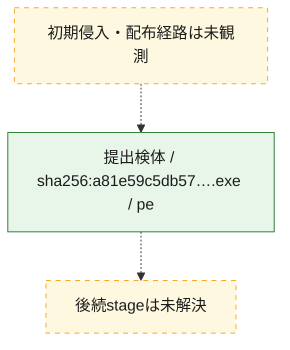
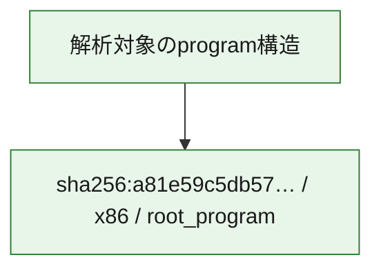

# 全体ロジック：a81e59c5db57776de1ce9da02a4bd12b27279d2084d764a323c65ca616baaac6

代表関数の静的証跡から、起動・初期化の処理群を確認しました。

## 読み方

- phaseの掲載順は解析上の整理順です。observed_call_edgesがない段階間の実行順を断定しません。
- 図の実線は静的に観測した関係、点線と黄色のノードは未観測・未解決の関係を示します。
- 図は静的な要約であり、動的実行を再現するものではありません。
- 詳細な関数解説とfingerprintは[STATIC-LOGIC.md](STATIC-LOGIC.md)を参照してください。

## 静的可視化

### 実行フロー

### 感染チェーン

### モジュール関係

## 処理段階

### 1. 起動・初期化

entry pointから初期化と後続処理への移行を確認します。
確度: `confirmed_static_function_evidence`

- `a81e59c5db57776de1ce9da02a4bd12b27279d2084d764a323c65ca616baaac6:ghidra:180001010` — 初期化と主要処理への分岐を行う入口関数です。 状態: `succeeded`、選定理由: `entry_point`, `meaningful_symbol_name`, `reviewed_call_centrality:22`, `role:entrypoint`, `small_program_complete_context`

### 2. 補助処理

主要処理を支える一般内部関数またはlibrary処理を確認します。
確度: `confirmed_static_function_evidence`

- `a81e59c5db57776de1ce9da02a4bd12b27279d2084d764a323c65ca616baaac6:ghidra:180001240` — 検体内部の一般処理を実装する関数です。 状態: `succeeded`、選定理由: `context_representative`, `reviewed_call_centrality:2`, `small_program_complete_context`
- `a81e59c5db57776de1ce9da02a4bd12b27279d2084d764a323c65ca616baaac6:ghidra:180001350` — 検体内部の一般処理を実装する関数です。 状態: `succeeded`、選定理由: `context_representative`, `reviewed_call_centrality:25`, `small_program_complete_context`
- `a81e59c5db57776de1ce9da02a4bd12b27279d2084d764a323c65ca616baaac6:ghidra:180003780` — 検体内部の一般処理を実装する関数です。 状態: `succeeded`、選定理由: `context_representative`, `reviewed_call_centrality:2`, `small_program_complete_context`
- `a81e59c5db57776de1ce9da02a4bd12b27279d2084d764a323c65ca616baaac6:ghidra:1800038e0` — 検体内部の一般処理を実装する関数です。 状態: `succeeded`、選定理由: `context_representative`, `reviewed_call_centrality:2`, `small_program_complete_context`

## 観測したcall関係

- `a81e59c5db57776de1ce9da02a4bd12b27279d2084d764a323c65ca616baaac6:ghidra:180001010` → `a81e59c5db57776de1ce9da02a4bd12b27279d2084d764a323c65ca616baaac6:ghidra:180001240` （`startup` → `support`）
- `a81e59c5db57776de1ce9da02a4bd12b27279d2084d764a323c65ca616baaac6:ghidra:180001010` → `a81e59c5db57776de1ce9da02a4bd12b27279d2084d764a323c65ca616baaac6:ghidra:180001350` （`startup` → `support`）
- `a81e59c5db57776de1ce9da02a4bd12b27279d2084d764a323c65ca616baaac6:ghidra:180001350` → `a81e59c5db57776de1ce9da02a4bd12b27279d2084d764a323c65ca616baaac6:ghidra:180001240` （`support` → `support`）
- `a81e59c5db57776de1ce9da02a4bd12b27279d2084d764a323c65ca616baaac6:ghidra:180001350` → `a81e59c5db57776de1ce9da02a4bd12b27279d2084d764a323c65ca616baaac6:ghidra:180003780` （`support` → `support`）
- `a81e59c5db57776de1ce9da02a4bd12b27279d2084d764a323c65ca616baaac6:ghidra:180001350` → `a81e59c5db57776de1ce9da02a4bd12b27279d2084d764a323c65ca616baaac6:ghidra:1800038e0` （`support` → `support`）
- `a81e59c5db57776de1ce9da02a4bd12b27279d2084d764a323c65ca616baaac6:ghidra:180003780` → `a81e59c5db57776de1ce9da02a4bd12b27279d2084d764a323c65ca616baaac6:ghidra:1800038e0` （`support` → `support`）
- `ghidra-function:3e132587cba95d7635a473ad` → `ghidra-function:4261319d82576f3a34c291d3` （`unclassified` → `unclassified`）
- `ghidra-function:87daca995794e3e67240f8c9` → `ghidra-function:0b80f46ced02e1fae3e88404` （`unclassified` → `unclassified`）
- `ghidra-function:87daca995794e3e67240f8c9` → `ghidra-function:6ad5b9e8851a1f981fc76872` （`unclassified` → `unclassified`）
- `ghidra-function:87daca995794e3e67240f8c9` → `ghidra-function:9493792536942bd53ec9727c` （`unclassified` → `unclassified`）
- `ghidra-function:87daca995794e3e67240f8c9` → `ghidra-function:9b01addeec073112a0e31683` （`unclassified` → `unclassified`）
- `ghidra-function:87daca995794e3e67240f8c9` → `ghidra-function:9c0a9c06a3d2fb5c9c672cca` （`unclassified` → `unclassified`）
- `ghidra-function:87daca995794e3e67240f8c9` → `ghidra-function:c8abd68817f9a93a3f46d051` （`unclassified` → `unclassified`）
- `ghidra-function:87daca995794e3e67240f8c9` → `ghidra-function:d5deddf2500bde1feeda042f` （`unclassified` → `unclassified`）
- `ghidra-function:87daca995794e3e67240f8c9` → `ghidra-function:eca53b12c6729165e0d30177` （`unclassified` → `unclassified`）
- `ghidra-function:87daca995794e3e67240f8c9` → `ghidra-function:f0b84aa87daf7a4c3220caf9` （`unclassified` → `unclassified`）
- `ghidra-function:87daca995794e3e67240f8c9` → `ghidra-function:f79a3fba3ef871945779dfe0` （`unclassified` → `unclassified`）
- `ghidra-function:87daca995794e3e67240f8c9` → `ghidra-function:fe406f0e52760dea6aff4ece` （`unclassified` → `unclassified`）
- `ghidra-function:87daca995794e3e67240f8c9` → `ghidra-function:fef3aead6e1aa633d34898f1` （`unclassified` → `unclassified`）
- `ghidra-function:fe406f0e52760dea6aff4ece` → `ghidra-external:0faf1e41e29f4bcb099e6ebe` （`unclassified` → `unclassified`）
- `ghidra-function:fe406f0e52760dea6aff4ece` → `ghidra-external:33e6672b80ed5a59ea34d24f` （`unclassified` → `unclassified`）
- `ghidra-function:fe406f0e52760dea6aff4ece` → `ghidra-external:3eb161cd772c4d8683a82d85` （`unclassified` → `unclassified`）
- `ghidra-function:fe406f0e52760dea6aff4ece` → `ghidra-external:4a1aac2644f8b888a52cf760` （`unclassified` → `unclassified`）
- `ghidra-function:fe406f0e52760dea6aff4ece` → `ghidra-external:4bb16f57eaa397b1cf067e13` （`unclassified` → `unclassified`）
- `ghidra-function:fe406f0e52760dea6aff4ece` → `ghidra-external:5115208e045ec8106bfd0f9b` （`unclassified` → `unclassified`）
- `ghidra-function:fe406f0e52760dea6aff4ece` → `ghidra-external:5d315e1acfa8a8025ddff6e4` （`unclassified` → `unclassified`）
- `ghidra-function:fe406f0e52760dea6aff4ece` → `ghidra-external:736896222cee629086b55147` （`unclassified` → `unclassified`）
- `ghidra-function:fe406f0e52760dea6aff4ece` → `ghidra-external:77c82e82803f6b53ac56bceb` （`unclassified` → `unclassified`）
- `ghidra-function:fe406f0e52760dea6aff4ece` → `ghidra-external:7deca144cf26c3390b82dc91` （`unclassified` → `unclassified`）
- `ghidra-function:fe406f0e52760dea6aff4ece` → `ghidra-external:8982e01346de0d1e2e669825` （`unclassified` → `unclassified`）
- `ghidra-function:fe406f0e52760dea6aff4ece` → `ghidra-external:8c333045a5d271ca4e217289` （`unclassified` → `unclassified`）
- `ghidra-function:fe406f0e52760dea6aff4ece` → `ghidra-external:949d018864131415d74d27ac` （`unclassified` → `unclassified`）
- `ghidra-function:fe406f0e52760dea6aff4ece` → `ghidra-external:974ff99123ea2d270f9fd326` （`unclassified` → `unclassified`）
- `ghidra-function:fe406f0e52760dea6aff4ece` → `ghidra-external:a75f74a1fa9f5419d53eeef8` （`unclassified` → `unclassified`）
- `ghidra-function:fe406f0e52760dea6aff4ece` → `ghidra-external:b26daae241fb2111a744be10` （`unclassified` → `unclassified`）
- `ghidra-function:fe406f0e52760dea6aff4ece` → `ghidra-external:be3cc1ebd9b654838b2a06fc` （`unclassified` → `unclassified`）
- `ghidra-function:fe406f0e52760dea6aff4ece` → `ghidra-external:c36d56edbd7cf3e807e0d751` （`unclassified` → `unclassified`）
- `ghidra-function:fe406f0e52760dea6aff4ece` → `ghidra-external:d0f4fca8ee77a8125ad9b8c7` （`unclassified` → `unclassified`）
- `ghidra-function:fe406f0e52760dea6aff4ece` → `ghidra-external:d934459921dabff0877a9adc` （`unclassified` → `unclassified`）
- `ghidra-function:fe406f0e52760dea6aff4ece` → `ghidra-external:f9c7e3313298e795b3375c32` （`unclassified` → `unclassified`）
- `ghidra-function:fe406f0e52760dea6aff4ece` → `ghidra-function:3e132587cba95d7635a473ad` （`unclassified` → `unclassified`）
- `ghidra-function:fe406f0e52760dea6aff4ece` → `ghidra-function:4261319d82576f3a34c291d3` （`unclassified` → `unclassified`）
- `ghidra-function:fe406f0e52760dea6aff4ece` → `ghidra-function:9493792536942bd53ec9727c` （`unclassified` → `unclassified`）

## 解析範囲と制約

- 選定外関数は全体inventoryへ残しますが、関数本体の個別解説対象にはしていません。
- indirect call、難読化、packer、VM、壊れたcontrol flowによりcall関係が欠落する場合があります。
- 文書は静的解析に基づき、検体実行や外部通信による動的確認は行っていません。
