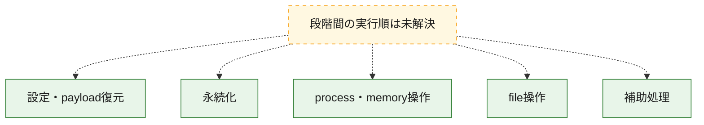
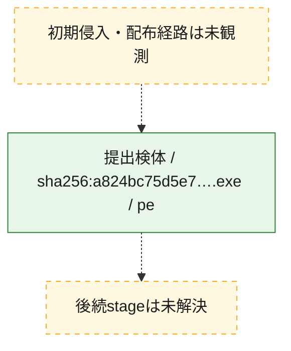
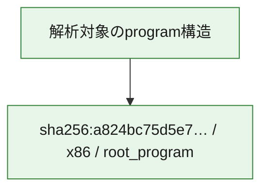

# 全体ロジック：a824bc75d5e76a8e91a6c15501d9c68f723d4d92ea8217f906024ed217a36a42

代表関数の静的証跡から、設定・payload復元、永続化、process・memory操作、file操作の処理群を確認しました。

## 読み方

- phaseの掲載順は解析上の整理順です。observed_call_edgesがない段階間の実行順を断定しません。
- 図の実線は静的に観測した関係、点線と黄色のノードは未観測・未解決の関係を示します。
- 図は静的な要約であり、動的実行を再現するものではありません。
- 詳細な関数解説とfingerprintは[STATIC-LOGIC.md](STATIC-LOGIC.md)を参照してください。

## 静的可視化

### 実行フロー

### 感染チェーン

### モジュール関係

## 処理段階

### 1. 設定・payload復元

設定、resource、payload、暗号化データの復元・変換を確認します。
確度: `confirmed_static_function_evidence`

- `a824bc75d5e76a8e91a6c15501d9c68f723d4d92ea8217f906024ed217a36a42:ghidra:004166c0` — 設定、resource、payloadなどの解析・変換を行う関数です。 状態: `succeeded`、選定理由: `meaningful_symbol_name`, `reviewed_call_centrality:3`, `role:config_or_data_transform`
- `a824bc75d5e76a8e91a6c15501d9c68f723d4d92ea8217f906024ed217a36a42:ghidra:0060a9fc` — 設定、resource、payloadなどの解析・変換を行う関数です。 状態: `succeeded`、選定理由: `meaningful_symbol_name`, `reviewed_call_centrality:3`, `role:config_or_data_transform`

### 2. 永続化

自動起動や永続化に関係する設定変更を確認します。
確度: `confirmed_static_function_evidence`

- `a824bc75d5e76a8e91a6c15501d9c68f723d4d92ea8217f906024ed217a36a42:ghidra:0079f3b8` — 自動起動または永続化に関係する処理を含む関数です。 状態: `succeeded`、選定理由: `meaningful_symbol_name`, `reviewed_call_centrality:3`, `role:persistence`

### 3. process・memory操作

process、thread、module、memory操作と実行移行を確認します。
確度: `confirmed_static_function_evidence`

- `a824bc75d5e76a8e91a6c15501d9c68f723d4d92ea8217f906024ed217a36a42:ghidra:00405468` — process、thread、module、またはmemory操作に関係する関数です。 状態: `succeeded`、選定理由: `meaningful_symbol_name`, `reviewed_call_centrality:3`, `role:process_or_memory_operation`
- `a824bc75d5e76a8e91a6c15501d9c68f723d4d92ea8217f906024ed217a36a42:ghidra:00415e5c` — process、thread、module、またはmemory操作に関係する関数です。 状態: `succeeded`、選定理由: `meaningful_symbol_name`, `reviewed_call_centrality:3`, `role:process_or_memory_operation`
- `a824bc75d5e76a8e91a6c15501d9c68f723d4d92ea8217f906024ed217a36a42:ghidra:00416728` — process、thread、module、またはmemory操作に関係する関数です。 状態: `succeeded`、選定理由: `meaningful_symbol_name`, `reviewed_call_centrality:3`, `role:process_or_memory_operation`
- `a824bc75d5e76a8e91a6c15501d9c68f723d4d92ea8217f906024ed217a36a42:ghidra:00416758` — process、thread、module、またはmemory操作に関係する関数です。 状態: `succeeded`、選定理由: `meaningful_symbol_name`, `reviewed_call_centrality:3`, `role:process_or_memory_operation`
- `a824bc75d5e76a8e91a6c15501d9c68f723d4d92ea8217f906024ed217a36a42:ghidra:0059fc64` — process、thread、module、またはmemory操作に関係する関数です。 状態: `succeeded`、選定理由: `meaningful_symbol_name`, `reviewed_call_centrality:3`, `role:process_or_memory_operation`

### 4. file操作

fileやdirectoryの作成、読書き、削除を確認します。
確度: `confirmed_static_function_evidence`

- `a824bc75d5e76a8e91a6c15501d9c68f723d4d92ea8217f906024ed217a36a42:ghidra:0079f490` — fileまたはdirectoryの読書き・管理に関係する関数です。 状態: `succeeded`、選定理由: `meaningful_symbol_name`, `reviewed_call_centrality:3`, `role:file_operation`
- `a824bc75d5e76a8e91a6c15501d9c68f723d4d92ea8217f906024ed217a36a42:ghidra:0079f4a8` — fileまたはdirectoryの読書き・管理に関係する関数です。 状態: `succeeded`、選定理由: `meaningful_symbol_name`, `reviewed_call_centrality:3`, `role:file_operation`

### 5. 補助処理

主要処理を支える一般内部関数またはlibrary処理を確認します。
確度: `confirmed_static_function_evidence`

- `a824bc75d5e76a8e91a6c15501d9c68f723d4d92ea8217f906024ed217a36a42:ghidra:004053e0` — 検体内部の一般処理を実装する関数です。 状態: `succeeded`、選定理由: `meaningful_symbol_name`, `reviewed_call_centrality:3`
- `a824bc75d5e76a8e91a6c15501d9c68f723d4d92ea8217f906024ed217a36a42:ghidra:00415284` — 検体内部の一般処理を実装する関数です。 状態: `succeeded`、選定理由: `meaningful_symbol_name`, `reviewed_call_centrality:3`
- `a824bc75d5e76a8e91a6c15501d9c68f723d4d92ea8217f906024ed217a36a42:ghidra:00415594` — 検体内部の一般処理を実装する関数です。 状態: `succeeded`、選定理由: `meaningful_symbol_name`, `reviewed_call_centrality:3`
- `a824bc75d5e76a8e91a6c15501d9c68f723d4d92ea8217f906024ed217a36a42:ghidra:004155ac` — 検体内部の一般処理を実装する関数です。 状態: `succeeded`、選定理由: `meaningful_symbol_name`, `reviewed_call_centrality:3`
- `a824bc75d5e76a8e91a6c15501d9c68f723d4d92ea8217f906024ed217a36a42:ghidra:004155f4` — 検体内部の一般処理を実装する関数です。 状態: `succeeded`、選定理由: `meaningful_symbol_name`, `reviewed_call_centrality:3`
- `a824bc75d5e76a8e91a6c15501d9c68f723d4d92ea8217f906024ed217a36a42:ghidra:00415614` — 検体内部の一般処理を実装する関数です。 状態: `succeeded`、選定理由: `meaningful_symbol_name`, `reviewed_call_centrality:3`
- `a824bc75d5e76a8e91a6c15501d9c68f723d4d92ea8217f906024ed217a36a42:ghidra:0041562c` — 検体内部の一般処理を実装する関数です。 状態: `succeeded`、選定理由: `meaningful_symbol_name`, `reviewed_call_centrality:3`
- `a824bc75d5e76a8e91a6c15501d9c68f723d4d92ea8217f906024ed217a36a42:ghidra:00415654` — 検体内部の一般処理を実装する関数です。 状態: `succeeded`、選定理由: `meaningful_symbol_name`, `reviewed_call_centrality:3`
- `a824bc75d5e76a8e91a6c15501d9c68f723d4d92ea8217f906024ed217a36a42:ghidra:0041568c` — 検体内部の一般処理を実装する関数です。 状態: `succeeded`、選定理由: `meaningful_symbol_name`, `reviewed_call_centrality:3`
- `a824bc75d5e76a8e91a6c15501d9c68f723d4d92ea8217f906024ed217a36a42:ghidra:004158bc` — 検体内部の一般処理を実装する関数です。 状態: `succeeded`、選定理由: `meaningful_symbol_name`, `reviewed_call_centrality:3`
- `a824bc75d5e76a8e91a6c15501d9c68f723d4d92ea8217f906024ed217a36a42:ghidra:00415a9c` — 検体内部の一般処理を実装する関数です。 状態: `succeeded`、選定理由: `meaningful_symbol_name`, `reviewed_call_centrality:3`
- `a824bc75d5e76a8e91a6c15501d9c68f723d4d92ea8217f906024ed217a36a42:ghidra:00415c0c` — 検体内部の一般処理を実装する関数です。 状態: `succeeded`、選定理由: `meaningful_symbol_name`, `reviewed_call_centrality:3`
- `a824bc75d5e76a8e91a6c15501d9c68f723d4d92ea8217f906024ed217a36a42:ghidra:00415e74` — 検体内部の一般処理を実装する関数です。 状態: `succeeded`、選定理由: `meaningful_symbol_name`, `reviewed_call_centrality:3`
- `a824bc75d5e76a8e91a6c15501d9c68f723d4d92ea8217f906024ed217a36a42:ghidra:00415e8c` — 検体内部の一般処理を実装する関数です。 状態: `succeeded`、選定理由: `meaningful_symbol_name`, `reviewed_call_centrality:3`
- `a824bc75d5e76a8e91a6c15501d9c68f723d4d92ea8217f906024ed217a36a42:ghidra:00415ea4` — 検体内部の一般処理を実装する関数です。 状態: `succeeded`、選定理由: `meaningful_symbol_name`, `reviewed_call_centrality:3`
- `a824bc75d5e76a8e91a6c15501d9c68f723d4d92ea8217f906024ed217a36a42:ghidra:00415fac` — 検体内部の一般処理を実装する関数です。 状態: `succeeded`、選定理由: `meaningful_symbol_name`, `reviewed_call_centrality:3`
- `a824bc75d5e76a8e91a6c15501d9c68f723d4d92ea8217f906024ed217a36a42:ghidra:004161a4` — 検体内部の一般処理を実装する関数です。 状態: `succeeded`、選定理由: `meaningful_symbol_name`, `reviewed_call_centrality:3`
- `a824bc75d5e76a8e91a6c15501d9c68f723d4d92ea8217f906024ed217a36a42:ghidra:00416358` — 検体内部の一般処理を実装する関数です。 状態: `succeeded`、選定理由: `meaningful_symbol_name`, `reviewed_call_centrality:3`
- `a824bc75d5e76a8e91a6c15501d9c68f723d4d92ea8217f906024ed217a36a42:ghidra:004163e0` — 検体内部の一般処理を実装する関数です。 状態: `succeeded`、選定理由: `meaningful_symbol_name`, `reviewed_call_centrality:3`
- `a824bc75d5e76a8e91a6c15501d9c68f723d4d92ea8217f906024ed217a36a42:ghidra:00416690` — 検体内部の一般処理を実装する関数です。 状態: `succeeded`、選定理由: `meaningful_symbol_name`, `reviewed_call_centrality:3`
- `a824bc75d5e76a8e91a6c15501d9c68f723d4d92ea8217f906024ed217a36a42:ghidra:004166a8` — 検体内部の一般処理を実装する関数です。 状態: `succeeded`、選定理由: `meaningful_symbol_name`, `reviewed_call_centrality:3`
- `a824bc75d5e76a8e91a6c15501d9c68f723d4d92ea8217f906024ed217a36a42:ghidra:00416740` — 検体内部の一般処理を実装する関数です。 状態: `succeeded`、選定理由: `meaningful_symbol_name`, `reviewed_call_centrality:3`

## 観測したcall関係

- 代表関数間で直接解決できた呼出関係はありません。

## 解析範囲と制約

- 選定外関数は全体inventoryへ残しますが、関数本体の個別解説対象にはしていません。
- indirect call、難読化、packer、VM、壊れたcontrol flowによりcall関係が欠落する場合があります。
- 文書は静的解析に基づき、検体実行や外部通信による動的確認は行っていません。
