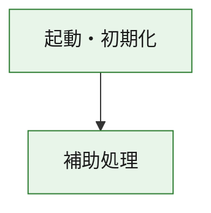
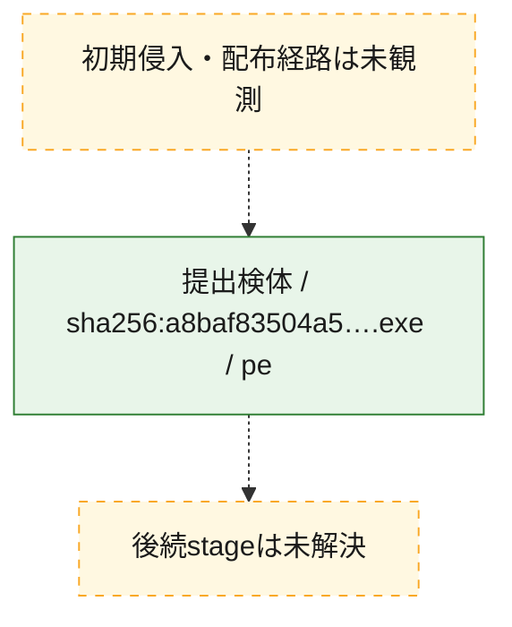
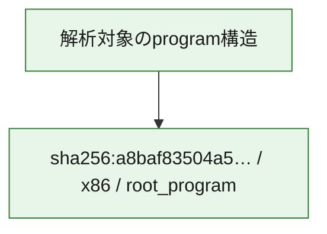

# 全体ロジック：a8baf83504a5782f76a310a48eb80b19c3476d9cc13038edfb1041f2f1b2db8f

代表関数の静的証跡から、起動・初期化の処理群を確認しました。

## 読み方

- phaseの掲載順は解析上の整理順です。observed_call_edgesがない段階間の実行順を断定しません。
- 図の実線は静的に観測した関係、点線と黄色のノードは未観測・未解決の関係を示します。
- 図は静的な要約であり、動的実行を再現するものではありません。
- 詳細な関数解説とfingerprintは[STATIC-LOGIC.md](STATIC-LOGIC.md)を参照してください。

## 静的可視化

### 実行フロー

### 感染チェーン

### モジュール関係

## 処理段階

### 1. 起動・初期化

entry pointから初期化と後続処理への移行を確認します。
確度: `confirmed_static_function_evidence`

- `a8baf83504a5782f76a310a48eb80b19c3476d9cc13038edfb1041f2f1b2db8f:ghidra:180001010` — 初期化と主要処理への分岐を行う入口関数です。 状態: `succeeded`、選定理由: `entry_point`, `meaningful_symbol_name`, `reviewed_call_centrality:22`, `role:entrypoint`, `small_program_complete_context`

### 2. 補助処理

主要処理を支える一般内部関数またはlibrary処理を確認します。
確度: `confirmed_static_function_evidence`

- `a8baf83504a5782f76a310a48eb80b19c3476d9cc13038edfb1041f2f1b2db8f:ghidra:180001240` — 検体内部の一般処理を実装する関数です。 状態: `succeeded`、選定理由: `context_representative`, `reviewed_call_centrality:2`, `small_program_complete_context`
- `a8baf83504a5782f76a310a48eb80b19c3476d9cc13038edfb1041f2f1b2db8f:ghidra:180001350` — 検体内部の一般処理を実装する関数です。 状態: `succeeded`、選定理由: `context_representative`, `reviewed_call_centrality:25`, `small_program_complete_context`
- `a8baf83504a5782f76a310a48eb80b19c3476d9cc13038edfb1041f2f1b2db8f:ghidra:180003780` — 検体内部の一般処理を実装する関数です。 状態: `succeeded`、選定理由: `context_representative`, `reviewed_call_centrality:2`, `small_program_complete_context`
- `a8baf83504a5782f76a310a48eb80b19c3476d9cc13038edfb1041f2f1b2db8f:ghidra:1800038e0` — 検体内部の一般処理を実装する関数です。 状態: `succeeded`、選定理由: `context_representative`, `reviewed_call_centrality:2`, `small_program_complete_context`

## 観測したcall関係

- `a8baf83504a5782f76a310a48eb80b19c3476d9cc13038edfb1041f2f1b2db8f:ghidra:180001010` → `a8baf83504a5782f76a310a48eb80b19c3476d9cc13038edfb1041f2f1b2db8f:ghidra:180001240` （`startup` → `support`）
- `a8baf83504a5782f76a310a48eb80b19c3476d9cc13038edfb1041f2f1b2db8f:ghidra:180001010` → `a8baf83504a5782f76a310a48eb80b19c3476d9cc13038edfb1041f2f1b2db8f:ghidra:180001350` （`startup` → `support`）
- `a8baf83504a5782f76a310a48eb80b19c3476d9cc13038edfb1041f2f1b2db8f:ghidra:180001350` → `a8baf83504a5782f76a310a48eb80b19c3476d9cc13038edfb1041f2f1b2db8f:ghidra:180001240` （`support` → `support`）
- `a8baf83504a5782f76a310a48eb80b19c3476d9cc13038edfb1041f2f1b2db8f:ghidra:180001350` → `a8baf83504a5782f76a310a48eb80b19c3476d9cc13038edfb1041f2f1b2db8f:ghidra:180003780` （`support` → `support`）
- `a8baf83504a5782f76a310a48eb80b19c3476d9cc13038edfb1041f2f1b2db8f:ghidra:180001350` → `a8baf83504a5782f76a310a48eb80b19c3476d9cc13038edfb1041f2f1b2db8f:ghidra:1800038e0` （`support` → `support`）
- `a8baf83504a5782f76a310a48eb80b19c3476d9cc13038edfb1041f2f1b2db8f:ghidra:180003780` → `a8baf83504a5782f76a310a48eb80b19c3476d9cc13038edfb1041f2f1b2db8f:ghidra:1800038e0` （`support` → `support`）
- `ghidra-function:2711a2ec8deb2fbc2fda8e88` → `ghidra-function:0443927c2ea3685ca705e082` （`unclassified` → `unclassified`）
- `ghidra-function:2711a2ec8deb2fbc2fda8e88` → `ghidra-function:5b6ab5f8952b00842b839c07` （`unclassified` → `unclassified`）
- `ghidra-function:2711a2ec8deb2fbc2fda8e88` → `ghidra-function:831d1418be31f2d2232a96f7` （`unclassified` → `unclassified`）
- `ghidra-function:2711a2ec8deb2fbc2fda8e88` → `ghidra-function:8381f643ec387f33fddef578` （`unclassified` → `unclassified`）
- `ghidra-function:2711a2ec8deb2fbc2fda8e88` → `ghidra-function:8707440c0d9109be044ad288` （`unclassified` → `unclassified`）
- `ghidra-function:2711a2ec8deb2fbc2fda8e88` → `ghidra-function:b1722857ee5e752f48a6932b` （`unclassified` → `unclassified`）
- `ghidra-function:2711a2ec8deb2fbc2fda8e88` → `ghidra-function:c0d680c2731af9fea03a4bec` （`unclassified` → `unclassified`）
- `ghidra-function:2711a2ec8deb2fbc2fda8e88` → `ghidra-function:d1f550087e15c7bd45c1bf41` （`unclassified` → `unclassified`）
- `ghidra-function:2711a2ec8deb2fbc2fda8e88` → `ghidra-function:d39d402967a7dd87aef017e8` （`unclassified` → `unclassified`）
- `ghidra-function:2711a2ec8deb2fbc2fda8e88` → `ghidra-function:dd6acc6d2a27007dfcddbf16` （`unclassified` → `unclassified`）
- `ghidra-function:2711a2ec8deb2fbc2fda8e88` → `ghidra-function:ddd863bf8eb9908e6b8ac4d9` （`unclassified` → `unclassified`）
- `ghidra-function:2711a2ec8deb2fbc2fda8e88` → `ghidra-function:f50a8644a941cce97b482b65` （`unclassified` → `unclassified`）
- `ghidra-function:b578b161cec673adadb3c02e` → `ghidra-function:56cdebbee6dbb54a8532f5e2` （`unclassified` → `unclassified`）
- `ghidra-function:d39d402967a7dd87aef017e8` → `ghidra-external:0f2b37c345626e478b6bac51` （`unclassified` → `unclassified`）
- `ghidra-function:d39d402967a7dd87aef017e8` → `ghidra-external:1c881118a468cdc09b66b292` （`unclassified` → `unclassified`）
- `ghidra-function:d39d402967a7dd87aef017e8` → `ghidra-external:25c87b9a35a1de39c529d15e` （`unclassified` → `unclassified`）
- `ghidra-function:d39d402967a7dd87aef017e8` → `ghidra-external:26bb2ad5ca7fb7548a149c9e` （`unclassified` → `unclassified`）
- `ghidra-function:d39d402967a7dd87aef017e8` → `ghidra-external:2c05731ac3d1400dc186c53d` （`unclassified` → `unclassified`）
- `ghidra-function:d39d402967a7dd87aef017e8` → `ghidra-external:2ce42f8f5e78e48045d70b1f` （`unclassified` → `unclassified`）
- `ghidra-function:d39d402967a7dd87aef017e8` → `ghidra-external:2d7ca54f086a7a2acfedf868` （`unclassified` → `unclassified`）
- `ghidra-function:d39d402967a7dd87aef017e8` → `ghidra-external:2f6ed0b6ee9f4ea18ce7cb04` （`unclassified` → `unclassified`）
- `ghidra-function:d39d402967a7dd87aef017e8` → `ghidra-external:48bf9f4c80a97df82bdade15` （`unclassified` → `unclassified`）
- `ghidra-function:d39d402967a7dd87aef017e8` → `ghidra-external:6eb7ba11696f5edea0af66e0` （`unclassified` → `unclassified`）
- `ghidra-function:d39d402967a7dd87aef017e8` → `ghidra-external:6ffb0420ee0feb4fd07764ff` （`unclassified` → `unclassified`）
- `ghidra-function:d39d402967a7dd87aef017e8` → `ghidra-external:83506b2dd701b1d2a5f3cb50` （`unclassified` → `unclassified`）
- `ghidra-function:d39d402967a7dd87aef017e8` → `ghidra-external:9eee75f521555622939dd998` （`unclassified` → `unclassified`）
- `ghidra-function:d39d402967a7dd87aef017e8` → `ghidra-external:a5e03fc1a1197b4b54685cf9` （`unclassified` → `unclassified`）
- `ghidra-function:d39d402967a7dd87aef017e8` → `ghidra-external:c658400abf2596065ba7a1d3` （`unclassified` → `unclassified`）
- `ghidra-function:d39d402967a7dd87aef017e8` → `ghidra-external:f68f8889a3b375ea4fd6ed87` （`unclassified` → `unclassified`）
- `ghidra-function:d39d402967a7dd87aef017e8` → `ghidra-external:f7320ed9a34d5c6280d2420b` （`unclassified` → `unclassified`）
- `ghidra-function:d39d402967a7dd87aef017e8` → `ghidra-external:faccbcdae02b385acadd93c3` （`unclassified` → `unclassified`）
- `ghidra-function:d39d402967a7dd87aef017e8` → `ghidra-external:fb3891aa1f230a2f8d597623` （`unclassified` → `unclassified`）
- `ghidra-function:d39d402967a7dd87aef017e8` → `ghidra-external:fc5f82ad2e8ec2c8752c0ea2` （`unclassified` → `unclassified`）
- `ghidra-function:d39d402967a7dd87aef017e8` → `ghidra-external:fd393a54215ef6cddc0f2a13` （`unclassified` → `unclassified`）
- `ghidra-function:d39d402967a7dd87aef017e8` → `ghidra-function:56cdebbee6dbb54a8532f5e2` （`unclassified` → `unclassified`）
- `ghidra-function:d39d402967a7dd87aef017e8` → `ghidra-function:5b6ab5f8952b00842b839c07` （`unclassified` → `unclassified`）
- `ghidra-function:d39d402967a7dd87aef017e8` → `ghidra-function:b578b161cec673adadb3c02e` （`unclassified` → `unclassified`）

## 解析範囲と制約

- 選定外関数は全体inventoryへ残しますが、関数本体の個別解説対象にはしていません。
- indirect call、難読化、packer、VM、壊れたcontrol flowによりcall関係が欠落する場合があります。
- 文書は静的解析に基づき、検体実行や外部通信による動的確認は行っていません。
