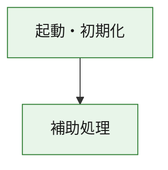
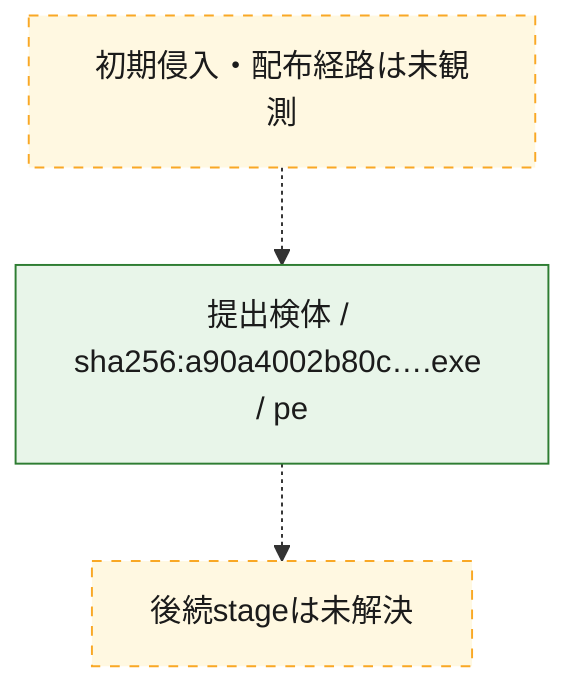
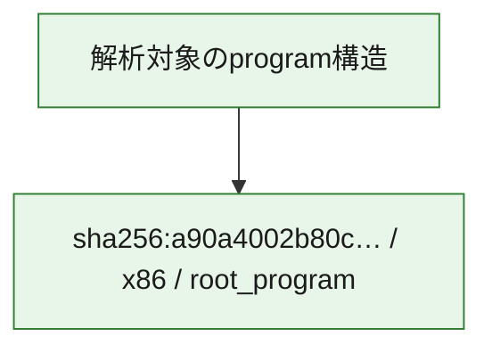

# 全体ロジック：a90a4002b80cfe93512c8472e1e4f2f1b0169b22b354d65a932618fcf335b944

代表関数の静的証跡から、起動・初期化の処理群を確認しました。

## 読み方

- phaseの掲載順は解析上の整理順です。observed_call_edgesがない段階間の実行順を断定しません。
- 図の実線は静的に観測した関係、点線と黄色のノードは未観測・未解決の関係を示します。
- 図は静的な要約であり、動的実行を再現するものではありません。
- 詳細な関数解説とfingerprintは[STATIC-LOGIC.md](STATIC-LOGIC.md)を参照してください。

## 静的可視化

### 実行フロー

### 感染チェーン

### モジュール関係

## 処理段階

### 1. 起動・初期化

entry pointから初期化と後続処理への移行を確認します。
確度: `confirmed_static_function_evidence`

- `a90a4002b80cfe93512c8472e1e4f2f1b0169b22b354d65a932618fcf335b944:ghidra:180001010` — 初期化と主要処理への分岐を行う入口関数です。 状態: `succeeded`、選定理由: `entry_point`, `meaningful_symbol_name`, `reviewed_call_centrality:22`, `role:entrypoint`, `small_program_complete_context`

### 2. 補助処理

主要処理を支える一般内部関数またはlibrary処理を確認します。
確度: `confirmed_static_function_evidence`

- `a90a4002b80cfe93512c8472e1e4f2f1b0169b22b354d65a932618fcf335b944:ghidra:180001240` — 検体内部の一般処理を実装する関数です。 状態: `succeeded`、選定理由: `context_representative`, `reviewed_call_centrality:2`, `small_program_complete_context`
- `a90a4002b80cfe93512c8472e1e4f2f1b0169b22b354d65a932618fcf335b944:ghidra:180001350` — 検体内部の一般処理を実装する関数です。 状態: `succeeded`、選定理由: `context_representative`, `reviewed_call_centrality:25`, `small_program_complete_context`
- `a90a4002b80cfe93512c8472e1e4f2f1b0169b22b354d65a932618fcf335b944:ghidra:180003780` — 検体内部の一般処理を実装する関数です。 状態: `succeeded`、選定理由: `context_representative`, `reviewed_call_centrality:2`, `small_program_complete_context`
- `a90a4002b80cfe93512c8472e1e4f2f1b0169b22b354d65a932618fcf335b944:ghidra:1800038e0` — 検体内部の一般処理を実装する関数です。 状態: `succeeded`、選定理由: `context_representative`, `reviewed_call_centrality:2`, `small_program_complete_context`

## 観測したcall関係

- `a90a4002b80cfe93512c8472e1e4f2f1b0169b22b354d65a932618fcf335b944:ghidra:180001010` → `a90a4002b80cfe93512c8472e1e4f2f1b0169b22b354d65a932618fcf335b944:ghidra:180001240` （`startup` → `support`）
- `a90a4002b80cfe93512c8472e1e4f2f1b0169b22b354d65a932618fcf335b944:ghidra:180001010` → `a90a4002b80cfe93512c8472e1e4f2f1b0169b22b354d65a932618fcf335b944:ghidra:180001350` （`startup` → `support`）
- `a90a4002b80cfe93512c8472e1e4f2f1b0169b22b354d65a932618fcf335b944:ghidra:180001350` → `a90a4002b80cfe93512c8472e1e4f2f1b0169b22b354d65a932618fcf335b944:ghidra:180001240` （`support` → `support`）
- `a90a4002b80cfe93512c8472e1e4f2f1b0169b22b354d65a932618fcf335b944:ghidra:180001350` → `a90a4002b80cfe93512c8472e1e4f2f1b0169b22b354d65a932618fcf335b944:ghidra:180003780` （`support` → `support`）
- `a90a4002b80cfe93512c8472e1e4f2f1b0169b22b354d65a932618fcf335b944:ghidra:180001350` → `a90a4002b80cfe93512c8472e1e4f2f1b0169b22b354d65a932618fcf335b944:ghidra:1800038e0` （`support` → `support`）
- `a90a4002b80cfe93512c8472e1e4f2f1b0169b22b354d65a932618fcf335b944:ghidra:180003780` → `a90a4002b80cfe93512c8472e1e4f2f1b0169b22b354d65a932618fcf335b944:ghidra:1800038e0` （`support` → `support`）
- `ghidra-function:5584dfc5a5737edf77e1aff4` → `ghidra-external:023bd4c0428a431ae3811f86` （`unclassified` → `unclassified`）
- `ghidra-function:5584dfc5a5737edf77e1aff4` → `ghidra-external:0e3794f538d8af13772cdba6` （`unclassified` → `unclassified`）
- `ghidra-function:5584dfc5a5737edf77e1aff4` → `ghidra-external:274fa3f201a896be2a44be75` （`unclassified` → `unclassified`）
- `ghidra-function:5584dfc5a5737edf77e1aff4` → `ghidra-external:27943f5b107998f9996604ef` （`unclassified` → `unclassified`）
- `ghidra-function:5584dfc5a5737edf77e1aff4` → `ghidra-external:5084c098736fa12a27700f17` （`unclassified` → `unclassified`）
- `ghidra-function:5584dfc5a5737edf77e1aff4` → `ghidra-external:530e527807da25ead4cd99c4` （`unclassified` → `unclassified`）
- `ghidra-function:5584dfc5a5737edf77e1aff4` → `ghidra-external:5b8e306a350fc1181cc783a6` （`unclassified` → `unclassified`）
- `ghidra-function:5584dfc5a5737edf77e1aff4` → `ghidra-external:5ed2f1febc11b762e188f322` （`unclassified` → `unclassified`）
- `ghidra-function:5584dfc5a5737edf77e1aff4` → `ghidra-external:6ead70f6a8cf7afaa3853f45` （`unclassified` → `unclassified`）
- `ghidra-function:5584dfc5a5737edf77e1aff4` → `ghidra-external:8f863529c17f2a8a47cd123a` （`unclassified` → `unclassified`）
- `ghidra-function:5584dfc5a5737edf77e1aff4` → `ghidra-external:942ab9e0bb43278cbb1c349b` （`unclassified` → `unclassified`）
- `ghidra-function:5584dfc5a5737edf77e1aff4` → `ghidra-external:953aecf0799653986037150c` （`unclassified` → `unclassified`）
- `ghidra-function:5584dfc5a5737edf77e1aff4` → `ghidra-external:a1a5d62ae64957b41f92903c` （`unclassified` → `unclassified`）
- `ghidra-function:5584dfc5a5737edf77e1aff4` → `ghidra-external:b76959fe3ce25d9d9ad63087` （`unclassified` → `unclassified`）
- `ghidra-function:5584dfc5a5737edf77e1aff4` → `ghidra-external:c489b76fd826a3c6c883f144` （`unclassified` → `unclassified`）
- `ghidra-function:5584dfc5a5737edf77e1aff4` → `ghidra-external:c4ddc89bd20b2040424c1cd3` （`unclassified` → `unclassified`）
- `ghidra-function:5584dfc5a5737edf77e1aff4` → `ghidra-external:c964241aae296a30fb63ea9c` （`unclassified` → `unclassified`）
- `ghidra-function:5584dfc5a5737edf77e1aff4` → `ghidra-external:c9ce60279670856f90742118` （`unclassified` → `unclassified`）
- `ghidra-function:5584dfc5a5737edf77e1aff4` → `ghidra-external:cba53e50f7639882029b67fc` （`unclassified` → `unclassified`）
- `ghidra-function:5584dfc5a5737edf77e1aff4` → `ghidra-external:e1335c035ea0436c70bc716c` （`unclassified` → `unclassified`）
- `ghidra-function:5584dfc5a5737edf77e1aff4` → `ghidra-external:edb85c5b33e64c49130510df` （`unclassified` → `unclassified`）
- `ghidra-function:5584dfc5a5737edf77e1aff4` → `ghidra-function:477cdf6fe3bf4fec5def9bc4` （`unclassified` → `unclassified`）
- `ghidra-function:5584dfc5a5737edf77e1aff4` → `ghidra-function:c743526134759d778ef3cf8b` （`unclassified` → `unclassified`）
- `ghidra-function:5584dfc5a5737edf77e1aff4` → `ghidra-function:dc140aed3dc7023b2914179c` （`unclassified` → `unclassified`）
- `ghidra-function:a32af2425c4832b392705e93` → `ghidra-function:084f867f94d58d81b6958d9f` （`unclassified` → `unclassified`）
- `ghidra-function:a32af2425c4832b392705e93` → `ghidra-function:3e6a2b42f43d4e8455b5bf35` （`unclassified` → `unclassified`）
- `ghidra-function:a32af2425c4832b392705e93` → `ghidra-function:3f37b60eba8f30fd0cbd76b5` （`unclassified` → `unclassified`）
- `ghidra-function:a32af2425c4832b392705e93` → `ghidra-function:5584dfc5a5737edf77e1aff4` （`unclassified` → `unclassified`）
- `ghidra-function:a32af2425c4832b392705e93` → `ghidra-function:5b968839e7861d19045be272` （`unclassified` → `unclassified`）
- `ghidra-function:a32af2425c4832b392705e93` → `ghidra-function:7cf8cdfa429b5afac30a287a` （`unclassified` → `unclassified`）
- `ghidra-function:a32af2425c4832b392705e93` → `ghidra-function:7d8a685ab81d48f8e5e56f97` （`unclassified` → `unclassified`）
- `ghidra-function:a32af2425c4832b392705e93` → `ghidra-function:b345f144cd63ee87d5f67d45` （`unclassified` → `unclassified`）
- `ghidra-function:a32af2425c4832b392705e93` → `ghidra-function:cb8d40f408dbbd0f939a64f1` （`unclassified` → `unclassified`）
- `ghidra-function:a32af2425c4832b392705e93` → `ghidra-function:d8abd3be417f697f7929b77b` （`unclassified` → `unclassified`）
- `ghidra-function:a32af2425c4832b392705e93` → `ghidra-function:dc140aed3dc7023b2914179c` （`unclassified` → `unclassified`）
- `ghidra-function:a32af2425c4832b392705e93` → `ghidra-function:f6b8b825c046042c1663c644` （`unclassified` → `unclassified`）
- `ghidra-function:c743526134759d778ef3cf8b` → `ghidra-function:477cdf6fe3bf4fec5def9bc4` （`unclassified` → `unclassified`）

## 解析範囲と制約

- 選定外関数は全体inventoryへ残しますが、関数本体の個別解説対象にはしていません。
- indirect call、難読化、packer、VM、壊れたcontrol flowによりcall関係が欠落する場合があります。
- 文書は静的解析に基づき、検体実行や外部通信による動的確認は行っていません。
