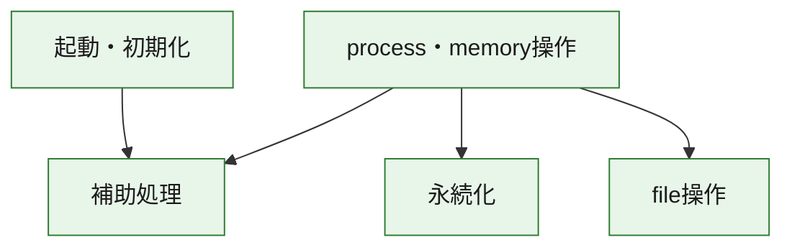
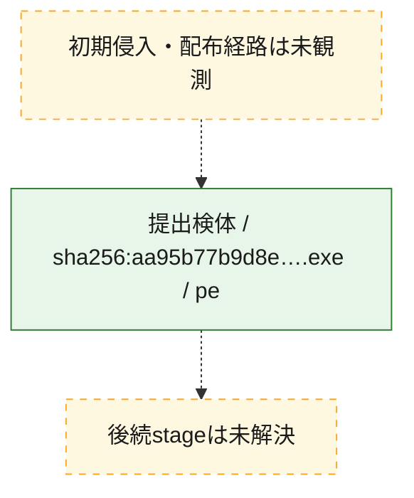
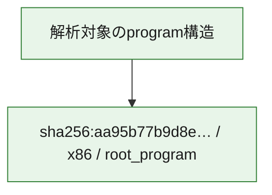

# 全体ロジック：aa95b77b9d8e3181c6f3d6e378d3efb997860cc224694aee009a3e852060c753

代表関数の静的証跡から、起動・初期化、永続化、process・memory操作、file操作の処理群を確認しました。

## 読み方

- phaseの掲載順は解析上の整理順です。observed_call_edgesがない段階間の実行順を断定しません。
- 図の実線は静的に観測した関係、点線と黄色のノードは未観測・未解決の関係を示します。
- 図は静的な要約であり、動的実行を再現するものではありません。
- 詳細な関数解説とfingerprintは[STATIC-LOGIC.md](STATIC-LOGIC.md)を参照してください。

## 静的可視化

### 実行フロー

### 感染チェーン

### モジュール関係

## 処理段階

### 1. 起動・初期化

entry pointから初期化と後続処理への移行を確認します。
確度: `confirmed_static_function_evidence`

- `aa95b77b9d8e3181c6f3d6e378d3efb997860cc224694aee009a3e852060c753:ghidra:140001160` — 初期化と主要処理への分岐を行う入口関数です。 状態: `succeeded`、選定理由: `entry_point`, `meaningful_symbol_name`, `reviewed_call_centrality:1`, `role:entrypoint`

### 2. 永続化

自動起動や永続化に関係する設定変更を確認します。
確度: `confirmed_static_function_evidence`

- `aa95b77b9d8e3181c6f3d6e378d3efb997860cc224694aee009a3e852060c753:ghidra:140001fa6` — 自動起動または永続化に関係する処理を含む関数です。 状態: `succeeded`、選定理由: `context_representative`, `reviewed_call_centrality:6`, `role:persistence`
- `aa95b77b9d8e3181c6f3d6e378d3efb997860cc224694aee009a3e852060c753:ghidra:140002251` — 自動起動または永続化に関係する処理を含む関数です。 状態: `succeeded`、選定理由: `context_representative`, `reviewed_call_centrality:3`, `role:persistence`

### 3. process・memory操作

process、thread、module、memory操作と実行移行を確認します。
確度: `confirmed_static_function_evidence`

- `aa95b77b9d8e3181c6f3d6e378d3efb997860cc224694aee009a3e852060c753:ghidra:1400013b4` — process、thread、module、またはmemory操作に関係する関数です。 状態: `succeeded`、選定理由: `context_representative`, `reviewed_call_centrality:48`, `role:process_or_memory_operation`
- `aa95b77b9d8e3181c6f3d6e378d3efb997860cc224694aee009a3e852060c753:ghidra:140002a10` — process、thread、module、またはmemory操作に関係する関数です。 状態: `succeeded`、選定理由: `context_representative`, `reviewed_call_centrality:11`, `role:process_or_memory_operation`

### 4. file操作

fileやdirectoryの作成、読書き、削除を確認します。
確度: `confirmed_static_function_evidence`

- `aa95b77b9d8e3181c6f3d6e378d3efb997860cc224694aee009a3e852060c753:ghidra:140002155` — fileまたはdirectoryの読書き・管理に関係する関数です。 状態: `succeeded`、選定理由: `context_representative`, `reviewed_call_centrality:3`, `role:file_operation`

### 5. 補助処理

主要処理を支える一般内部関数またはlibrary処理を確認します。
確度: `confirmed_static_function_evidence_with_limits`

- `aa95b77b9d8e3181c6f3d6e378d3efb997860cc224694aee009a3e852060c753:ghidra:140001000` — 検体内部の一般処理を実装する関数です。 状態: `succeeded`、選定理由: `context_representative`, `reviewed_call_centrality:8`
- `aa95b77b9d8e3181c6f3d6e378d3efb997860cc224694aee009a3e852060c753:ghidra:140001100` — 検体内部の一般処理を実装する関数です。 状態: `succeeded`、選定理由: `context_representative`, `reviewed_call_centrality:3`
- `aa95b77b9d8e3181c6f3d6e378d3efb997860cc224694aee009a3e852060c753:ghidra:140001180` — 検体内部の一般処理を実装する関数です。 状態: `succeeded`、選定理由: `context_representative`, `reviewed_call_centrality:24`
- `aa95b77b9d8e3181c6f3d6e378d3efb997860cc224694aee009a3e852060c753:ghidra:140001380` — 検体内部の一般処理を実装する関数です。 状態: `succeeded`、選定理由: `context_representative`, `reviewed_call_centrality:1`
- `aa95b77b9d8e3181c6f3d6e378d3efb997860cc224694aee009a3e852060c753:ghidra:140001c06` — 検体内部の一般処理を実装する関数です。 状態: `succeeded`、選定理由: `context_representative`, `reviewed_call_centrality:1`
- `aa95b77b9d8e3181c6f3d6e378d3efb997860cc224694aee009a3e852060c753:ghidra:140001f54` — 検体内部の一般処理を実装する関数です。 状態: `limited_bad_instruction_or_flow`、選定理由: `context_representative`, `reviewed_call_centrality:3`
- `aa95b77b9d8e3181c6f3d6e378d3efb997860cc224694aee009a3e852060c753:ghidra:1400021c5` — 検体内部の一般処理を実装する関数です。 状態: `succeeded`、選定理由: `context_representative`, `reviewed_call_centrality:9`
- `aa95b77b9d8e3181c6f3d6e378d3efb997860cc224694aee009a3e852060c753:ghidra:1400022d0` — compiler生成処理または汎用library処理とみられる関数です。 状態: `succeeded`、選定理由: `entry_point`, `meaningful_symbol_name`, `reviewed_call_centrality:3`
- `aa95b77b9d8e3181c6f3d6e378d3efb997860cc224694aee009a3e852060c753:ghidra:140002370` — 検体内部の一般処理を実装する関数です。 状態: `succeeded`、選定理由: `context_representative`, `reviewed_call_centrality:1`
- `aa95b77b9d8e3181c6f3d6e378d3efb997860cc224694aee009a3e852060c753:ghidra:1400023c0` — 検体内部の一般処理を実装する関数です。 状態: `limited_bad_instruction_or_flow`、選定理由: `context_representative`, `reviewed_call_centrality:3`
- `aa95b77b9d8e3181c6f3d6e378d3efb997860cc224694aee009a3e852060c753:ghidra:140002430` — 検体内部の一般処理を実装する関数です。 状態: `limited_bad_instruction_or_flow`、選定理由: `context_representative`, `reviewed_call_centrality:4`
- `aa95b77b9d8e3181c6f3d6e378d3efb997860cc224694aee009a3e852060c753:ghidra:1400024c0` — 検体内部の一般処理を実装する関数です。 状態: `limited_bad_instruction_or_flow`、選定理由: `context_representative`, `reviewed_call_centrality:3`
- `aa95b77b9d8e3181c6f3d6e378d3efb997860cc224694aee009a3e852060c753:ghidra:140002620` — 検体内部の一般処理を実装する関数です。 状態: `succeeded`、選定理由: `context_representative`, `reviewed_call_centrality:1`
- `aa95b77b9d8e3181c6f3d6e378d3efb997860cc224694aee009a3e852060c753:ghidra:140002690` — 検体内部の一般処理を実装する関数です。 状態: `succeeded`、選定理由: `context_representative`, `reviewed_call_centrality:2`
- `aa95b77b9d8e3181c6f3d6e378d3efb997860cc224694aee009a3e852060c753:ghidra:140002700` — 検体内部の一般処理を実装する関数です。 状態: `succeeded`、選定理由: `context_representative`, `reviewed_call_centrality:4`
- `aa95b77b9d8e3181c6f3d6e378d3efb997860cc224694aee009a3e852060c753:ghidra:140002bb0` — 検体内部の一般処理を実装する関数です。 状態: `succeeded`、選定理由: `context_representative`, `reviewed_call_centrality:6`
- `aa95b77b9d8e3181c6f3d6e378d3efb997860cc224694aee009a3e852060c753:ghidra:140002c30` — 検体内部の一般処理を実装する関数です。 状態: `failed_empty`、選定理由: `context_representative`, `reviewed_call_centrality:1`
- `aa95b77b9d8e3181c6f3d6e378d3efb997860cc224694aee009a3e852060c753:ghidra:140002d40` — 検体内部の一般処理を実装する関数です。 状態: `failed_empty`、選定理由: `context_representative`, `reviewed_call_centrality:1`
- `aa95b77b9d8e3181c6f3d6e378d3efb997860cc224694aee009a3e852060c753:ghidra:140002dc0` — 検体内部の一般処理を実装する関数です。 状態: `succeeded`、選定理由: `context_representative`, `reviewed_call_centrality:7`
- `aa95b77b9d8e3181c6f3d6e378d3efb997860cc224694aee009a3e852060c753:ghidra:140002df0` — 検体内部の一般処理を実装する関数です。 状態: `succeeded`、選定理由: `context_representative`, `reviewed_call_centrality:5`
- `aa95b77b9d8e3181c6f3d6e378d3efb997860cc224694aee009a3e852060c753:ghidra:140002e60` — 検体内部の一般処理を実装する関数です。 状態: `succeeded`、選定理由: `context_representative`, `reviewed_call_centrality:5`
- `aa95b77b9d8e3181c6f3d6e378d3efb997860cc224694aee009a3e852060c753:ghidra:140002ef0` — 検体内部の一般処理を実装する関数です。 状態: `succeeded`、選定理由: `context_representative`, `reviewed_call_centrality:15`
- `aa95b77b9d8e3181c6f3d6e378d3efb997860cc224694aee009a3e852060c753:ghidra:140003090` — 検体内部の一般処理を実装する関数です。 状態: `succeeded`、選定理由: `context_representative`, `reviewed_call_centrality:3`
- `aa95b77b9d8e3181c6f3d6e378d3efb997860cc224694aee009a3e852060c753:ghidra:140003140` — 検体内部の一般処理を実装する関数です。 状態: `succeeded`、選定理由: `context_representative`, `reviewed_call_centrality:2`
- `aa95b77b9d8e3181c6f3d6e378d3efb997860cc224694aee009a3e852060c753:ghidra:140003390` — 検体内部の一般処理を実装する関数です。 状態: `succeeded`、選定理由: `context_representative`, `reviewed_call_centrality:1`
- `aa95b77b9d8e3181c6f3d6e378d3efb997860cc224694aee009a3e852060c753:ghidra:140003480` — 検体内部の一般処理を実装する関数です。 状態: `succeeded`、選定理由: `context_representative`, `reviewed_call_centrality:2`

## 観測したcall関係

- `aa95b77b9d8e3181c6f3d6e378d3efb997860cc224694aee009a3e852060c753:ghidra:140001000` → `aa95b77b9d8e3181c6f3d6e378d3efb997860cc224694aee009a3e852060c753:ghidra:140002dc0` （`support` → `support`）
- `aa95b77b9d8e3181c6f3d6e378d3efb997860cc224694aee009a3e852060c753:ghidra:140001100` → `aa95b77b9d8e3181c6f3d6e378d3efb997860cc224694aee009a3e852060c753:ghidra:140002d40` （`support` → `support`）
- `aa95b77b9d8e3181c6f3d6e378d3efb997860cc224694aee009a3e852060c753:ghidra:140001100` → `aa95b77b9d8e3181c6f3d6e378d3efb997860cc224694aee009a3e852060c753:ghidra:140002dc0` （`support` → `support`）
- `aa95b77b9d8e3181c6f3d6e378d3efb997860cc224694aee009a3e852060c753:ghidra:140001160` → `aa95b77b9d8e3181c6f3d6e378d3efb997860cc224694aee009a3e852060c753:ghidra:140001180` （`startup` → `support`）
- `aa95b77b9d8e3181c6f3d6e378d3efb997860cc224694aee009a3e852060c753:ghidra:140001180` → `aa95b77b9d8e3181c6f3d6e378d3efb997860cc224694aee009a3e852060c753:ghidra:140002430` （`support` → `support`）
- `aa95b77b9d8e3181c6f3d6e378d3efb997860cc224694aee009a3e852060c753:ghidra:140001180` → `aa95b77b9d8e3181c6f3d6e378d3efb997860cc224694aee009a3e852060c753:ghidra:140002700` （`support` → `support`）
- `aa95b77b9d8e3181c6f3d6e378d3efb997860cc224694aee009a3e852060c753:ghidra:140001180` → `aa95b77b9d8e3181c6f3d6e378d3efb997860cc224694aee009a3e852060c753:ghidra:140002c30` （`support` → `support`）
- `aa95b77b9d8e3181c6f3d6e378d3efb997860cc224694aee009a3e852060c753:ghidra:140001180` → `aa95b77b9d8e3181c6f3d6e378d3efb997860cc224694aee009a3e852060c753:ghidra:140002dc0` （`support` → `support`）
- `aa95b77b9d8e3181c6f3d6e378d3efb997860cc224694aee009a3e852060c753:ghidra:140001380` → `aa95b77b9d8e3181c6f3d6e378d3efb997860cc224694aee009a3e852060c753:ghidra:140001180` （`support` → `support`）
- `aa95b77b9d8e3181c6f3d6e378d3efb997860cc224694aee009a3e852060c753:ghidra:1400013b4` → `aa95b77b9d8e3181c6f3d6e378d3efb997860cc224694aee009a3e852060c753:ghidra:140001c06` （`execution` → `support`）
- `aa95b77b9d8e3181c6f3d6e378d3efb997860cc224694aee009a3e852060c753:ghidra:1400013b4` → `aa95b77b9d8e3181c6f3d6e378d3efb997860cc224694aee009a3e852060c753:ghidra:140001f54` （`execution` → `support`）
- `aa95b77b9d8e3181c6f3d6e378d3efb997860cc224694aee009a3e852060c753:ghidra:1400013b4` → `aa95b77b9d8e3181c6f3d6e378d3efb997860cc224694aee009a3e852060c753:ghidra:140001fa6` （`execution` → `persistence`）
- `aa95b77b9d8e3181c6f3d6e378d3efb997860cc224694aee009a3e852060c753:ghidra:1400013b4` → `aa95b77b9d8e3181c6f3d6e378d3efb997860cc224694aee009a3e852060c753:ghidra:140002155` （`execution` → `file_activity`）
- `aa95b77b9d8e3181c6f3d6e378d3efb997860cc224694aee009a3e852060c753:ghidra:1400013b4` → `aa95b77b9d8e3181c6f3d6e378d3efb997860cc224694aee009a3e852060c753:ghidra:1400021c5` （`execution` → `support`）
- `aa95b77b9d8e3181c6f3d6e378d3efb997860cc224694aee009a3e852060c753:ghidra:140001fa6` → `aa95b77b9d8e3181c6f3d6e378d3efb997860cc224694aee009a3e852060c753:ghidra:140002251` （`persistence` → `persistence`）
- `aa95b77b9d8e3181c6f3d6e378d3efb997860cc224694aee009a3e852060c753:ghidra:140002690` → `aa95b77b9d8e3181c6f3d6e378d3efb997860cc224694aee009a3e852060c753:ghidra:140003090` （`support` → `support`）
- `aa95b77b9d8e3181c6f3d6e378d3efb997860cc224694aee009a3e852060c753:ghidra:140002a10` → `aa95b77b9d8e3181c6f3d6e378d3efb997860cc224694aee009a3e852060c753:ghidra:140002bb0` （`execution` → `support`）
- `aa95b77b9d8e3181c6f3d6e378d3efb997860cc224694aee009a3e852060c753:ghidra:140002bb0` → `aa95b77b9d8e3181c6f3d6e378d3efb997860cc224694aee009a3e852060c753:ghidra:140003480` （`support` → `support`）
- `aa95b77b9d8e3181c6f3d6e378d3efb997860cc224694aee009a3e852060c753:ghidra:140002dc0` → `aa95b77b9d8e3181c6f3d6e378d3efb997860cc224694aee009a3e852060c753:ghidra:140003090` （`support` → `support`）
- `ghidra-function:0919d64960e444ae10d734fb` → `ghidra-function:69525862acd0ab6b7ccd16d7` （`unclassified` → `unclassified`）
- `ghidra-function:0d653d2bd7107c7fcc6997bb` → `ghidra-external:3de4860e44a25c9e8f414d0e` （`unclassified` → `unclassified`）
- `ghidra-function:0d653d2bd7107c7fcc6997bb` → `ghidra-function:28dd0fd41e33d1e3b33811cf` （`unclassified` → `unclassified`）
- `ghidra-function:10103e637b7983b0e775d29e` → `ghidra-external:0a55ded2c0bb10e962112b12` （`unclassified` → `unclassified`）
- `ghidra-function:10103e637b7983b0e775d29e` → `ghidra-external:1e5e21953e2c5aa4ef050594` （`unclassified` → `unclassified`）
- `ghidra-function:10103e637b7983b0e775d29e` → `ghidra-external:91c121165fe01ca11cb29df8` （`unclassified` → `unclassified`）
- `ghidra-function:10103e637b7983b0e775d29e` → `ghidra-external:b1c9d63dcba349e717b29a4c` （`unclassified` → `unclassified`）
- `ghidra-function:10103e637b7983b0e775d29e` → `ghidra-function:1ce4e1538b96d8e12d1c3f77` （`unclassified` → `unclassified`）
- `ghidra-function:10103e637b7983b0e775d29e` → `ghidra-function:3af7ec5f8825888e86972e5d` （`unclassified` → `unclassified`）
- `ghidra-function:10103e637b7983b0e775d29e` → `ghidra-function:aae1d8d75761daabc34f23a1` （`unclassified` → `unclassified`）
- `ghidra-function:10103e637b7983b0e775d29e` → `ghidra-function:ba0e9fa0c3628b65c0f77065` （`unclassified` → `unclassified`）
- `ghidra-function:10d0801868ca54312b12f10e` → `ghidra-external:732775403e90d3b880a9d2c1` （`unclassified` → `unclassified`）
- `ghidra-function:10d0801868ca54312b12f10e` → `ghidra-function:595767296d02fe777df1f060` （`unclassified` → `unclassified`）
- `ghidra-function:10d0801868ca54312b12f10e` → `ghidra-function:5fe582aeca11b895e7624419` （`unclassified` → `unclassified`）
- `ghidra-function:15cc92c550afc1ee418ab233` → `ghidra-external:1e5e21953e2c5aa4ef050594` （`unclassified` → `unclassified`）
- `ghidra-function:15cc92c550afc1ee418ab233` → `ghidra-external:3de4860e44a25c9e8f414d0e` （`unclassified` → `unclassified`）
- `ghidra-function:15cc92c550afc1ee418ab233` → `ghidra-external:4e5e1237db54b3d2a4e823be` （`unclassified` → `unclassified`）
- `ghidra-function:15cc92c550afc1ee418ab233` → `ghidra-function:28dd0fd41e33d1e3b33811cf` （`unclassified` → `unclassified`）
- `ghidra-function:16cfbedbd517d5318c020115` → `ghidra-function:22329fc8bedc170a647976ba` （`unclassified` → `unclassified`）
- `ghidra-function:16cfbedbd517d5318c020115` → `ghidra-function:4b96d39441416c0d2916e392` （`unclassified` → `unclassified`）
- `ghidra-function:16cfbedbd517d5318c020115` → `ghidra-function:974b274cc0933a34b4327f73` （`unclassified` → `unclassified`）
- `ghidra-function:16cfbedbd517d5318c020115` → `ghidra-function:e389a055dc87dc26e064b683` （`unclassified` → `unclassified`）
- `ghidra-function:28dd0fd41e33d1e3b33811cf` → `ghidra-external:1ad3bccf29587e92ddca1d7b` （`unclassified` → `unclassified`）
- `ghidra-function:302887c3b9e0ea5d7f181cc7` → `ghidra-external:b35e41311c2f8bda8b897dff` （`unclassified` → `unclassified`）
- `ghidra-function:302887c3b9e0ea5d7f181cc7` → `ghidra-external:e7e93141187f03c6f6ec6d3a` （`unclassified` → `unclassified`）
- `ghidra-function:302887c3b9e0ea5d7f181cc7` → `ghidra-function:5f83591b9e296bf5100bbf46` （`unclassified` → `unclassified`）
- `ghidra-function:512a249edd1b3318c1422d10` → `ghidra-external:7534c55a753e5c0cf42af5dc` （`unclassified` → `unclassified`）
- `ghidra-function:512a249edd1b3318c1422d10` → `ghidra-function:0a443376848864d6cec4606d` （`unclassified` → `unclassified`）
- `ghidra-function:512a249edd1b3318c1422d10` → `ghidra-function:16cfbedbd517d5318c020115` （`unclassified` → `unclassified`）
- `ghidra-function:512a249edd1b3318c1422d10` → `ghidra-function:259682273b62cd5e60c187c7` （`unclassified` → `unclassified`）
- `ghidra-function:512a249edd1b3318c1422d10` → `ghidra-function:32fd626aa17593e99931f4ec` （`unclassified` → `unclassified`）
- `ghidra-function:512a249edd1b3318c1422d10` → `ghidra-function:3d4ba58cfa12559f382b9869` （`unclassified` → `unclassified`）
- `ghidra-function:512a249edd1b3318c1422d10` → `ghidra-function:4cda3b0a696401773ddabfca` （`unclassified` → `unclassified`）
- `ghidra-function:512a249edd1b3318c1422d10` → `ghidra-function:56ace09d117733c96f3d1ff5` （`unclassified` → `unclassified`）
- `ghidra-function:512a249edd1b3318c1422d10` → `ghidra-function:5991e9b03dd941ce5c74d6d5` （`unclassified` → `unclassified`）
- `ghidra-function:512a249edd1b3318c1422d10` → `ghidra-function:64233a938c7562917a1f60e6` （`unclassified` → `unclassified`）
- `ghidra-function:512a249edd1b3318c1422d10` → `ghidra-function:7227fe4ea22f9e92cd766327` （`unclassified` → `unclassified`）
- `ghidra-function:512a249edd1b3318c1422d10` → `ghidra-function:76b44124c4ccc3c18b4bdaf7` （`unclassified` → `unclassified`）
- `ghidra-function:512a249edd1b3318c1422d10` → `ghidra-function:85e81446f9cd798b8fc2b143` （`unclassified` → `unclassified`）
- `ghidra-function:512a249edd1b3318c1422d10` → `ghidra-function:8774a9f1872274276f5b1f5c` （`unclassified` → `unclassified`）
- `ghidra-function:512a249edd1b3318c1422d10` → `ghidra-function:93574c267b17f9827fcca80c` （`unclassified` → `unclassified`）
- `ghidra-function:512a249edd1b3318c1422d10` → `ghidra-function:974b274cc0933a34b4327f73` （`unclassified` → `unclassified`）
- `ghidra-function:512a249edd1b3318c1422d10` → `ghidra-function:9a2556c796b5a4a770c54f1d` （`unclassified` → `unclassified`）
- `ghidra-function:512a249edd1b3318c1422d10` → `ghidra-function:b277676f3467237f27012008` （`unclassified` → `unclassified`）
- `ghidra-function:512a249edd1b3318c1422d10` → `ghidra-function:b3c78dc0f24aed29c10b2d27` （`unclassified` → `unclassified`）
- `ghidra-function:512a249edd1b3318c1422d10` → `ghidra-function:ba77fc831fc66e325dfba2c7` （`unclassified` → `unclassified`）
- `ghidra-function:512a249edd1b3318c1422d10` → `ghidra-function:bb1fa850a599b9b5be4e5350` （`unclassified` → `unclassified`）
- `ghidra-function:512a249edd1b3318c1422d10` → `ghidra-function:c8d9668845e6c4b6e4ff2269` （`unclassified` → `unclassified`）
- `ghidra-function:512a249edd1b3318c1422d10` → `ghidra-function:ccd6ea0a883770703392d9c2` （`unclassified` → `unclassified`）
- `ghidra-function:512a249edd1b3318c1422d10` → `ghidra-function:dd8062d58c8f70083e852dc0` （`unclassified` → `unclassified`）
- `ghidra-function:512a249edd1b3318c1422d10` → `ghidra-function:e3b7b7c2ff6c93a0fda1fe8b` （`unclassified` → `unclassified`）
- `ghidra-function:512a249edd1b3318c1422d10` → `ghidra-function:e41fd7ebade67e36075f029c` （`unclassified` → `unclassified`）
- `ghidra-function:512a249edd1b3318c1422d10` → `ghidra-function:f754f2e5cc3364188c33f9aa` （`unclassified` → `unclassified`）
- `ghidra-function:67fd8b81cb77995deef0afd6` → `ghidra-function:69525862acd0ab6b7ccd16d7` （`unclassified` → `unclassified`）
- `ghidra-function:69525862acd0ab6b7ccd16d7` → `ghidra-external:0c79da417e3644761fbbcc4c` （`unclassified` → `unclassified`）
- `ghidra-function:69525862acd0ab6b7ccd16d7` → `ghidra-external:1e5e21953e2c5aa4ef050594` （`unclassified` → `unclassified`）
- `ghidra-function:69525862acd0ab6b7ccd16d7` → `ghidra-external:469a8dc6594af69121a07357` （`unclassified` → `unclassified`）
- `ghidra-function:69525862acd0ab6b7ccd16d7` → `ghidra-external:4cd60dde5930ca7c174f5ae8` （`unclassified` → `unclassified`）
- `ghidra-function:69525862acd0ab6b7ccd16d7` → `ghidra-external:527c4867444b101522871552` （`unclassified` → `unclassified`）
- `ghidra-function:69525862acd0ab6b7ccd16d7` → `ghidra-external:55356148f4df48b5cc525184` （`unclassified` → `unclassified`）
- `ghidra-function:69525862acd0ab6b7ccd16d7` → `ghidra-external:7733b400d35a7411e95fc1d2` （`unclassified` → `unclassified`）
- `ghidra-function:69525862acd0ab6b7ccd16d7` → `ghidra-external:93a6a7ab6683b2fcfa1c56d1` （`unclassified` → `unclassified`）
- `ghidra-function:69525862acd0ab6b7ccd16d7` → `ghidra-external:b1c9d63dcba349e717b29a4c` （`unclassified` → `unclassified`）
- `ghidra-function:69525862acd0ab6b7ccd16d7` → `ghidra-external:b651c0ab43dab3dabcd6776c` （`unclassified` → `unclassified`）
- `ghidra-function:69525862acd0ab6b7ccd16d7` → `ghidra-external:bab38260a94894c049d515e1` （`unclassified` → `unclassified`）
- `ghidra-function:69525862acd0ab6b7ccd16d7` → `ghidra-external:e7e93141187f03c6f6ec6d3a` （`unclassified` → `unclassified`）
- `ghidra-function:69525862acd0ab6b7ccd16d7` → `ghidra-external:ed3dc50368c21929e478f486` （`unclassified` → `unclassified`）
- `ghidra-function:69525862acd0ab6b7ccd16d7` → `ghidra-function:130d087d50fcc4e21a52ab70` （`unclassified` → `unclassified`）
- `ghidra-function:69525862acd0ab6b7ccd16d7` → `ghidra-function:15cc92c550afc1ee418ab233` （`unclassified` → `unclassified`）
- `ghidra-function:69525862acd0ab6b7ccd16d7` → `ghidra-function:5f83591b9e296bf5100bbf46` （`unclassified` → `unclassified`）
- `ghidra-function:69525862acd0ab6b7ccd16d7` → `ghidra-function:d1e735a54e61524799db9ecf` （`unclassified` → `unclassified`）
- `ghidra-function:69525862acd0ab6b7ccd16d7` → `ghidra-function:dae3a5a55de2e7ffa6dfeffa` （`unclassified` → `unclassified`）
- `ghidra-function:69525862acd0ab6b7ccd16d7` → `ghidra-function:dc892f99895a5dab12a0a477` （`unclassified` → `unclassified`）
- `ghidra-function:69525862acd0ab6b7ccd16d7` → `ghidra-function:e12ed17036f2a327235c65e6` （`unclassified` → `unclassified`）
- `ghidra-function:740f3c14abdf71370051961d` → `ghidra-external:1ad3bccf29587e92ddca1d7b` （`unclassified` → `unclassified`）
- `ghidra-function:7b735dc8f880c9cc540a9c12` → `ghidra-external:732775403e90d3b880a9d2c1` （`unclassified` → `unclassified`）
- `ghidra-function:7b735dc8f880c9cc540a9c12` → `ghidra-external:e7e93141187f03c6f6ec6d3a` （`unclassified` → `unclassified`）
- `ghidra-function:7b735dc8f880c9cc540a9c12` → `ghidra-function:1ce4e1538b96d8e12d1c3f77` （`unclassified` → `unclassified`）
- `ghidra-function:7b735dc8f880c9cc540a9c12` → `ghidra-function:283bb81bba567001c28a6a13` （`unclassified` → `unclassified`）
- `ghidra-function:7b735dc8f880c9cc540a9c12` → `ghidra-function:3849f41fa97782d40aaeeaa1` （`unclassified` → `unclassified`）
- `ghidra-function:7b735dc8f880c9cc540a9c12` → `ghidra-function:595767296d02fe777df1f060` （`unclassified` → `unclassified`）
- `ghidra-function:7b735dc8f880c9cc540a9c12` → `ghidra-function:5f83591b9e296bf5100bbf46` （`unclassified` → `unclassified`）
- `ghidra-function:7b735dc8f880c9cc540a9c12` → `ghidra-function:5fe582aeca11b895e7624419` （`unclassified` → `unclassified`）
- `ghidra-function:7b735dc8f880c9cc540a9c12` → `ghidra-function:7a8c3219a3b105267fdfafc1` （`unclassified` → `unclassified`）
- `ghidra-function:7e83936ce743a1dd221c6db5` → `ghidra-external:823a296f0cd188382fec0ff4` （`unclassified` → `unclassified`）
- `ghidra-function:7e83936ce743a1dd221c6db5` → `ghidra-function:595767296d02fe777df1f060` （`unclassified` → `unclassified`）
- `ghidra-function:7e83936ce743a1dd221c6db5` → `ghidra-function:5fe582aeca11b895e7624419` （`unclassified` → `unclassified`）
- `ghidra-function:8774a9f1872274276f5b1f5c` → `ghidra-function:2f9661a1df108eefae3a64b9` （`unclassified` → `unclassified`）
- `ghidra-function:8774a9f1872274276f5b1f5c` → `ghidra-function:9879cc08c68c9383c2ee89e1` （`unclassified` → `unclassified`）
- `ghidra-function:8774a9f1872274276f5b1f5c` → `ghidra-function:ac99f6b46ed8ad52b273699b` （`unclassified` → `unclassified`）
- `ghidra-function:9879cc08c68c9383c2ee89e1` → `ghidra-function:847625e3c39c79f76095e660` （`unclassified` → `unclassified`）
- `ghidra-function:9cae3edb6791d0ffaa981926` → `ghidra-external:1e5e21953e2c5aa4ef050594` （`unclassified` → `unclassified`）
- `ghidra-function:9cae3edb6791d0ffaa981926` → `ghidra-external:3b928a8df7615d7e3ae20216` （`unclassified` → `unclassified`）
- `ghidra-function:9cae3edb6791d0ffaa981926` → `ghidra-external:49c51bada36bfbb4a84975e4` （`unclassified` → `unclassified`）
- `ghidra-function:9cae3edb6791d0ffaa981926` → `ghidra-external:4b56cddf583cbd0649e3495b` （`unclassified` → `unclassified`）
- `ghidra-function:9cae3edb6791d0ffaa981926` → `ghidra-external:73d522198c23e3d84ce4676d` （`unclassified` → `unclassified`）
- `ghidra-function:9cae3edb6791d0ffaa981926` → `ghidra-external:9aaba7835d6ce84a2525b3a8` （`unclassified` → `unclassified`）
- `ghidra-function:9cae3edb6791d0ffaa981926` → `ghidra-external:9e3962bf6240e19cb6ada280` （`unclassified` → `unclassified`）
- `ghidra-function:9cae3edb6791d0ffaa981926` → `ghidra-function:15cc92c550afc1ee418ab233` （`unclassified` → `unclassified`）
- `ghidra-function:9fe554b185c2e60da820a4f2` → `ghidra-external:4cd60dde5930ca7c174f5ae8` （`unclassified` → `unclassified`）
- `ghidra-function:9fe554b185c2e60da820a4f2` → `ghidra-external:a93e56d430fe5ee4e3eba1ca` （`unclassified` → `unclassified`）
- `ghidra-function:a5849f8f49c10d71f079eace` → `ghidra-function:5f83591b9e296bf5100bbf46` （`unclassified` → `unclassified`）
- `ghidra-function:a78bf8c1959760c3e435d380` → `ghidra-function:2e23172de967bd702b21a0f9` （`unclassified` → `unclassified`）
- `ghidra-function:a78bf8c1959760c3e435d380` → `ghidra-function:5f83591b9e296bf5100bbf46` （`unclassified` → `unclassified`）
- `ghidra-function:ba0e9fa0c3628b65c0f77065` → `ghidra-external:1e5e21953e2c5aa4ef050594` （`unclassified` → `unclassified`）
- `ghidra-function:ba0e9fa0c3628b65c0f77065` → `ghidra-external:3de4860e44a25c9e8f414d0e` （`unclassified` → `unclassified`）
- `ghidra-function:ba0e9fa0c3628b65c0f77065` → `ghidra-external:4200bf21ea05a33d00bac013` （`unclassified` → `unclassified`）
- `ghidra-function:ba0e9fa0c3628b65c0f77065` → `ghidra-external:d70d59a5337893a319d16644` （`unclassified` → `unclassified`）
- `ghidra-function:ba0e9fa0c3628b65c0f77065` → `ghidra-function:740f3c14abdf71370051961d` （`unclassified` → `unclassified`）
- `ghidra-function:bb1fa850a599b9b5be4e5350` → `ghidra-function:6c7e0f71c3feeb94551fa232` （`unclassified` → `unclassified`）
- `ghidra-function:bfc8be56d511d16cdbb3a64f` → `ghidra-function:5f83591b9e296bf5100bbf46` （`unclassified` → `unclassified`）
- `ghidra-function:dc892f99895a5dab12a0a477` → `ghidra-external:49c51bada36bfbb4a84975e4` （`unclassified` → `unclassified`）
- `ghidra-function:dc892f99895a5dab12a0a477` → `ghidra-external:857ea39bf461b4180b4ea534` （`unclassified` → `unclassified`）
- `ghidra-function:dc892f99895a5dab12a0a477` → `ghidra-external:b4c75dc484361e5ddd1b0ac5` （`unclassified` → `unclassified`）
- `ghidra-function:dd8062d58c8f70083e852dc0` → `ghidra-function:53c5671d0b07a9f56e37af19` （`unclassified` → `unclassified`）
- `ghidra-function:e12ed17036f2a327235c65e6` → `ghidra-function:2e23172de967bd702b21a0f9` （`unclassified` → `unclassified`）
- `ghidra-function:e12ed17036f2a327235c65e6` → `ghidra-function:5f83591b9e296bf5100bbf46` （`unclassified` → `unclassified`）
- `ghidra-function:e45baad395ffb2b67853ca85` → `ghidra-external:49c51bada36bfbb4a84975e4` （`unclassified` → `unclassified`）
- `ghidra-function:e45baad395ffb2b67853ca85` → `ghidra-function:3849f41fa97782d40aaeeaa1` （`unclassified` → `unclassified`）
- `ghidra-function:f4e095c7d12a87ece7b71fa7` → `ghidra-external:49c51bada36bfbb4a84975e4` （`unclassified` → `unclassified`）
- `ghidra-function:f726cc9dc113703a2ea314ef` → `ghidra-external:1e5e21953e2c5aa4ef050594` （`unclassified` → `unclassified`）
- `ghidra-function:f726cc9dc113703a2ea314ef` → `ghidra-function:15cc92c550afc1ee418ab233` （`unclassified` → `unclassified`）
- `ghidra-function:f726cc9dc113703a2ea314ef` → `ghidra-function:a9dcb8694d09b098bba05b91` （`unclassified` → `unclassified`）

## 解析範囲と制約

- 選定外関数は全体inventoryへ残しますが、関数本体の個別解説対象にはしていません。
- indirect call、難読化、packer、VM、壊れたcontrol flowによりcall関係が欠落する場合があります。
- 文書は静的解析に基づき、検体実行や外部通信による動的確認は行っていません。
