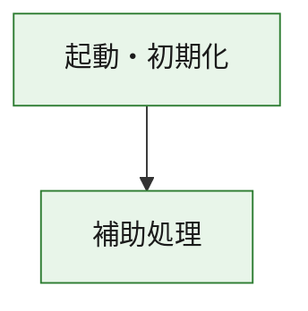
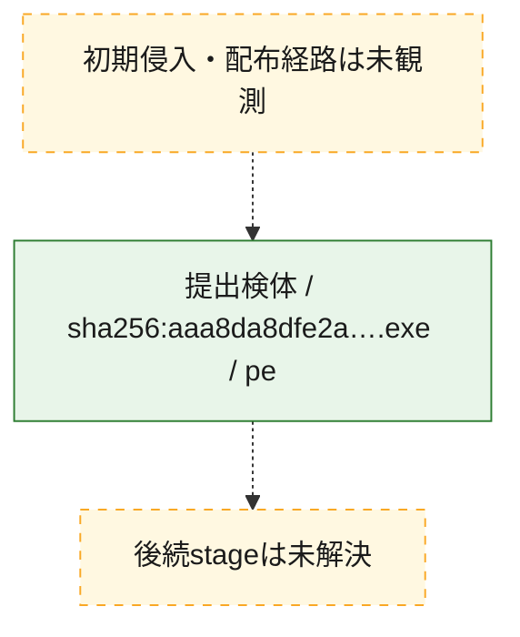
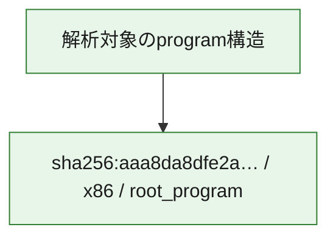

# 全体ロジック：aaa8da8dfe2aaa513916b12137ad6141f451ebf7cbe578830fc1bb4ae2008d94

代表関数の静的証跡から、起動・初期化の処理群を確認しました。

## 読み方

- phaseの掲載順は解析上の整理順です。observed_call_edgesがない段階間の実行順を断定しません。
- 図の実線は静的に観測した関係、点線と黄色のノードは未観測・未解決の関係を示します。
- 図は静的な要約であり、動的実行を再現するものではありません。
- 詳細な関数解説とfingerprintは[STATIC-LOGIC.md](STATIC-LOGIC.md)を参照してください。

## 静的可視化

### 実行フロー

### 感染チェーン

### モジュール関係

## 処理段階

### 1. 起動・初期化

entry pointから初期化と後続処理への移行を確認します。
確度: `confirmed_static_function_evidence`

- `aaa8da8dfe2aaa513916b12137ad6141f451ebf7cbe578830fc1bb4ae2008d94:ghidra:180001010` — 初期化と主要処理への分岐を行う入口関数です。 状態: `succeeded`、選定理由: `entry_point`, `meaningful_symbol_name`, `reviewed_call_centrality:22`, `role:entrypoint`, `small_program_complete_context`

### 2. 補助処理

主要処理を支える一般内部関数またはlibrary処理を確認します。
確度: `confirmed_static_function_evidence`

- `aaa8da8dfe2aaa513916b12137ad6141f451ebf7cbe578830fc1bb4ae2008d94:ghidra:180001240` — 検体内部の一般処理を実装する関数です。 状態: `succeeded`、選定理由: `context_representative`, `reviewed_call_centrality:2`, `small_program_complete_context`
- `aaa8da8dfe2aaa513916b12137ad6141f451ebf7cbe578830fc1bb4ae2008d94:ghidra:180001350` — 検体内部の一般処理を実装する関数です。 状態: `succeeded`、選定理由: `context_representative`, `reviewed_call_centrality:25`, `small_program_complete_context`
- `aaa8da8dfe2aaa513916b12137ad6141f451ebf7cbe578830fc1bb4ae2008d94:ghidra:180003780` — 検体内部の一般処理を実装する関数です。 状態: `succeeded`、選定理由: `context_representative`, `reviewed_call_centrality:2`, `small_program_complete_context`
- `aaa8da8dfe2aaa513916b12137ad6141f451ebf7cbe578830fc1bb4ae2008d94:ghidra:1800038e0` — 検体内部の一般処理を実装する関数です。 状態: `succeeded`、選定理由: `context_representative`, `reviewed_call_centrality:2`, `small_program_complete_context`

## 観測したcall関係

- `aaa8da8dfe2aaa513916b12137ad6141f451ebf7cbe578830fc1bb4ae2008d94:ghidra:180001010` → `aaa8da8dfe2aaa513916b12137ad6141f451ebf7cbe578830fc1bb4ae2008d94:ghidra:180001240` （`startup` → `support`）
- `aaa8da8dfe2aaa513916b12137ad6141f451ebf7cbe578830fc1bb4ae2008d94:ghidra:180001010` → `aaa8da8dfe2aaa513916b12137ad6141f451ebf7cbe578830fc1bb4ae2008d94:ghidra:180001350` （`startup` → `support`）
- `aaa8da8dfe2aaa513916b12137ad6141f451ebf7cbe578830fc1bb4ae2008d94:ghidra:180001350` → `aaa8da8dfe2aaa513916b12137ad6141f451ebf7cbe578830fc1bb4ae2008d94:ghidra:180001240` （`support` → `support`）
- `aaa8da8dfe2aaa513916b12137ad6141f451ebf7cbe578830fc1bb4ae2008d94:ghidra:180001350` → `aaa8da8dfe2aaa513916b12137ad6141f451ebf7cbe578830fc1bb4ae2008d94:ghidra:180003780` （`support` → `support`）
- `aaa8da8dfe2aaa513916b12137ad6141f451ebf7cbe578830fc1bb4ae2008d94:ghidra:180001350` → `aaa8da8dfe2aaa513916b12137ad6141f451ebf7cbe578830fc1bb4ae2008d94:ghidra:1800038e0` （`support` → `support`）
- `aaa8da8dfe2aaa513916b12137ad6141f451ebf7cbe578830fc1bb4ae2008d94:ghidra:180003780` → `aaa8da8dfe2aaa513916b12137ad6141f451ebf7cbe578830fc1bb4ae2008d94:ghidra:1800038e0` （`support` → `support`）
- `ghidra-function:a9ee77a2cb522b2bd6ab3e4f` → `ghidra-function:0eeef3d5c4b45a5b1968c45b` （`unclassified` → `unclassified`）
- `ghidra-function:a9ee77a2cb522b2bd6ab3e4f` → `ghidra-function:12f66f6a33d47e9643e808cc` （`unclassified` → `unclassified`）
- `ghidra-function:a9ee77a2cb522b2bd6ab3e4f` → `ghidra-function:1b48e3009ed242ccf2d8d09a` （`unclassified` → `unclassified`）
- `ghidra-function:a9ee77a2cb522b2bd6ab3e4f` → `ghidra-function:4c25f2cd919c74a585ffa631` （`unclassified` → `unclassified`）
- `ghidra-function:a9ee77a2cb522b2bd6ab3e4f` → `ghidra-function:6539a12fe498922b226f957b` （`unclassified` → `unclassified`）
- `ghidra-function:a9ee77a2cb522b2bd6ab3e4f` → `ghidra-function:68216d2911234374f46e69a3` （`unclassified` → `unclassified`）
- `ghidra-function:a9ee77a2cb522b2bd6ab3e4f` → `ghidra-function:6df5fb26f7aee6548fb7d053` （`unclassified` → `unclassified`）
- `ghidra-function:a9ee77a2cb522b2bd6ab3e4f` → `ghidra-function:8ce4398e341e56439de642ad` （`unclassified` → `unclassified`）
- `ghidra-function:a9ee77a2cb522b2bd6ab3e4f` → `ghidra-function:9d3f549647bbc78aa4ee4387` （`unclassified` → `unclassified`）
- `ghidra-function:a9ee77a2cb522b2bd6ab3e4f` → `ghidra-function:be2b39d475ea7b051396c024` （`unclassified` → `unclassified`）
- `ghidra-function:a9ee77a2cb522b2bd6ab3e4f` → `ghidra-function:cad7ec7c885249eb1b3e9b13` （`unclassified` → `unclassified`）
- `ghidra-function:a9ee77a2cb522b2bd6ab3e4f` → `ghidra-function:d166254b20cb402e02213b2a` （`unclassified` → `unclassified`）
- `ghidra-function:ac2fbae4cebc5daf84a526af` → `ghidra-function:9122ae0b01fbe36844442841` （`unclassified` → `unclassified`）
- `ghidra-function:be2b39d475ea7b051396c024` → `ghidra-external:102ef41ce647e8e19a6735b8` （`unclassified` → `unclassified`）
- `ghidra-function:be2b39d475ea7b051396c024` → `ghidra-external:12c7e98ecc17c576b06d6c9d` （`unclassified` → `unclassified`）
- `ghidra-function:be2b39d475ea7b051396c024` → `ghidra-external:13d47c25fde9d826a5058599` （`unclassified` → `unclassified`）
- `ghidra-function:be2b39d475ea7b051396c024` → `ghidra-external:16e0a0fe7f4d392a0f7558e7` （`unclassified` → `unclassified`）
- `ghidra-function:be2b39d475ea7b051396c024` → `ghidra-external:1a69c5b1c699beb9999bd8b4` （`unclassified` → `unclassified`）
- `ghidra-function:be2b39d475ea7b051396c024` → `ghidra-external:2467dbfa019fbf72dec01fee` （`unclassified` → `unclassified`）
- `ghidra-function:be2b39d475ea7b051396c024` → `ghidra-external:27223209dca615b87e566b5b` （`unclassified` → `unclassified`）
- `ghidra-function:be2b39d475ea7b051396c024` → `ghidra-external:43d958758452a32b0d892a07` （`unclassified` → `unclassified`）
- `ghidra-function:be2b39d475ea7b051396c024` → `ghidra-external:4724a5a7898230c4aed9144d` （`unclassified` → `unclassified`）
- `ghidra-function:be2b39d475ea7b051396c024` → `ghidra-external:53bfa1faa881be9f120061a0` （`unclassified` → `unclassified`）
- `ghidra-function:be2b39d475ea7b051396c024` → `ghidra-external:63cb6905c9b25b75fd95a3ac` （`unclassified` → `unclassified`）
- `ghidra-function:be2b39d475ea7b051396c024` → `ghidra-external:78909380fd0996c41a0b1326` （`unclassified` → `unclassified`）
- `ghidra-function:be2b39d475ea7b051396c024` → `ghidra-external:939a62a96068837e66ed8c0f` （`unclassified` → `unclassified`）
- `ghidra-function:be2b39d475ea7b051396c024` → `ghidra-external:9c8999335c65bc688f80886e` （`unclassified` → `unclassified`）
- `ghidra-function:be2b39d475ea7b051396c024` → `ghidra-external:aea0fa1408b114fa241f978b` （`unclassified` → `unclassified`）
- `ghidra-function:be2b39d475ea7b051396c024` → `ghidra-external:b4b38af89b60fa2e877c4f27` （`unclassified` → `unclassified`）
- `ghidra-function:be2b39d475ea7b051396c024` → `ghidra-external:be53627d22bd5b5fc3977669` （`unclassified` → `unclassified`）
- `ghidra-function:be2b39d475ea7b051396c024` → `ghidra-external:c3d43d52f1ef60e533d555b4` （`unclassified` → `unclassified`）
- `ghidra-function:be2b39d475ea7b051396c024` → `ghidra-external:ca74fecf4f2b2fc5548e781c` （`unclassified` → `unclassified`）
- `ghidra-function:be2b39d475ea7b051396c024` → `ghidra-external:dd01b337c42c35e1e0a48622` （`unclassified` → `unclassified`）
- `ghidra-function:be2b39d475ea7b051396c024` → `ghidra-external:e3a54c78d11344327dde32fd` （`unclassified` → `unclassified`）
- `ghidra-function:be2b39d475ea7b051396c024` → `ghidra-function:6539a12fe498922b226f957b` （`unclassified` → `unclassified`）
- `ghidra-function:be2b39d475ea7b051396c024` → `ghidra-function:9122ae0b01fbe36844442841` （`unclassified` → `unclassified`）
- `ghidra-function:be2b39d475ea7b051396c024` → `ghidra-function:ac2fbae4cebc5daf84a526af` （`unclassified` → `unclassified`）

## 解析範囲と制約

- 選定外関数は全体inventoryへ残しますが、関数本体の個別解説対象にはしていません。
- indirect call、難読化、packer、VM、壊れたcontrol flowによりcall関係が欠落する場合があります。
- 文書は静的解析に基づき、検体実行や外部通信による動的確認は行っていません。
