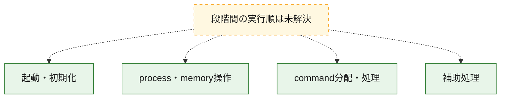
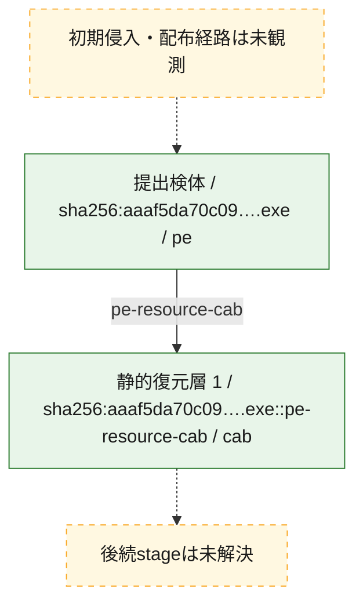
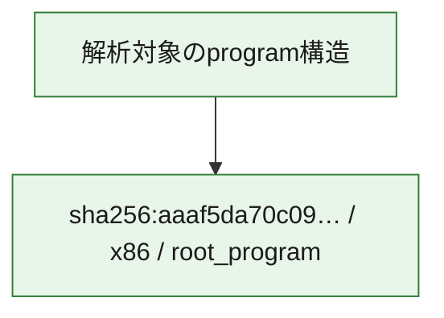

# 全体ロジック：aaaf5da70c09896a1527b7b32a2f9ec22184b8bdb2cca248accd48492e8a1cef

代表関数の静的証跡から、起動・初期化、process・memory操作、command分配・処理の処理群を確認しました。

## 読み方

- phaseの掲載順は解析上の整理順です。observed_call_edgesがない段階間の実行順を断定しません。
- 図の実線は静的に観測した関係、点線と黄色のノードは未観測・未解決の関係を示します。
- 図は静的な要約であり、動的実行を再現するものではありません。
- 詳細な関数解説とfingerprintは[STATIC-LOGIC.md](STATIC-LOGIC.md)を参照してください。

## 静的可視化

### 実行フロー

### 感染チェーン

### モジュール関係

## 処理段階

### 1. 起動・初期化

entry pointから初期化と後続処理への移行を確認します。
確度: `confirmed_static_function_evidence`

- `aaaf5da70c09896a1527b7b32a2f9ec22184b8bdb2cca248accd48492e8a1cef:ghidra:14000a770` — 初期化と主要処理への分岐を行う入口関数です。 状態: `succeeded`、選定理由: `entry_point`, `meaningful_symbol_name`, `reviewed_call_centrality:4`, `role:entrypoint`

### 2. process・memory操作

process、thread、module、memory操作と実行移行を確認します。
確度: `confirmed_static_function_evidence_with_limits`

- `aaaf5da70c09896a1527b7b32a2f9ec22184b8bdb2cca248accd48492e8a1cef:ghidra:140003ca0` — process、thread、module、またはmemory操作に関係する関数です。 状態: `limited_bad_instruction_or_flow`、選定理由: `context_representative`, `reviewed_call_centrality:3`, `role:process_or_memory_operation`

### 3. command分配・処理

受信commandやtaskの解釈、分配、個別handlerへの移行を確認します。
確度: `confirmed_static_function_evidence_with_limits`

- `aaaf5da70c09896a1527b7b32a2f9ec22184b8bdb2cca248accd48492e8a1cef:ghidra:14002f0e0` — commandの解釈、分配、または個別処理を担当する関数です。 状態: `limited_bad_instruction_or_flow`、選定理由: `meaningful_symbol_name`, `role:command_dispatch_or_handler`

### 4. 補助処理

主要処理を支える一般内部関数またはlibrary処理を確認します。
確度: `confirmed_static_function_evidence_with_limits`

- `aaaf5da70c09896a1527b7b32a2f9ec22184b8bdb2cca248accd48492e8a1cef:ghidra:140001e60` — 検体内部の一般処理を実装する関数です。 状態: `succeeded`、選定理由: `context_representative`, `reviewed_call_centrality:4`
- `aaaf5da70c09896a1527b7b32a2f9ec22184b8bdb2cca248accd48492e8a1cef:ghidra:140001ee0` — 検体内部の一般処理を実装する関数です。 状態: `succeeded`、選定理由: `context_representative`, `reviewed_call_centrality:5`
- `aaaf5da70c09896a1527b7b32a2f9ec22184b8bdb2cca248accd48492e8a1cef:ghidra:140001ef0` — 検体内部の一般処理を実装する関数です。 状態: `succeeded`、選定理由: `context_representative`, `reviewed_call_centrality:4`
- `aaaf5da70c09896a1527b7b32a2f9ec22184b8bdb2cca248accd48492e8a1cef:ghidra:140001f00` — 検体内部の一般処理を実装する関数です。 状態: `succeeded`、選定理由: `context_representative`, `reviewed_call_centrality:5`
- `aaaf5da70c09896a1527b7b32a2f9ec22184b8bdb2cca248accd48492e8a1cef:ghidra:140001f20` — 検体内部の一般処理を実装する関数です。 状態: `succeeded`、選定理由: `context_representative`, `reviewed_call_centrality:3`
- `aaaf5da70c09896a1527b7b32a2f9ec22184b8bdb2cca248accd48492e8a1cef:ghidra:140001f50` — 検体内部の一般処理を実装する関数です。 状態: `succeeded`、選定理由: `context_representative`, `reviewed_call_centrality:2`
- `aaaf5da70c09896a1527b7b32a2f9ec22184b8bdb2cca248accd48492e8a1cef:ghidra:140001f60` — 検体内部の一般処理を実装する関数です。 状態: `succeeded`、選定理由: `context_representative`, `reviewed_call_centrality:2`
- `aaaf5da70c09896a1527b7b32a2f9ec22184b8bdb2cca248accd48492e8a1cef:ghidra:140001f80` — 検体内部の一般処理を実装する関数です。 状態: `limited_bad_instruction_or_flow`、選定理由: `context_representative`, `reviewed_call_centrality:3`
- `aaaf5da70c09896a1527b7b32a2f9ec22184b8bdb2cca248accd48492e8a1cef:ghidra:140002a60` — 検体内部の一般処理を実装する関数です。 状態: `limited_bad_instruction_or_flow`、選定理由: `context_representative`, `reviewed_call_centrality:2`
- `aaaf5da70c09896a1527b7b32a2f9ec22184b8bdb2cca248accd48492e8a1cef:ghidra:140002ee0` — 検体内部の一般処理を実装する関数です。 状態: `limited_bad_instruction_or_flow`、選定理由: `context_representative`, `reviewed_call_centrality:5`
- `aaaf5da70c09896a1527b7b32a2f9ec22184b8bdb2cca248accd48492e8a1cef:ghidra:140002f20` — 検体内部の一般処理を実装する関数です。 状態: `limited_bad_instruction_or_flow`、選定理由: `context_representative`, `reviewed_call_centrality:5`
- `aaaf5da70c09896a1527b7b32a2f9ec22184b8bdb2cca248accd48492e8a1cef:ghidra:1400030a0` — 検体内部の一般処理を実装する関数です。 状態: `limited_bad_instruction_or_flow`、選定理由: `context_representative`, `reviewed_call_centrality:2`
- `aaaf5da70c09896a1527b7b32a2f9ec22184b8bdb2cca248accd48492e8a1cef:ghidra:140003710` — 検体内部の一般処理を実装する関数です。 状態: `succeeded`、選定理由: `context_representative`, `reviewed_call_centrality:8`
- `aaaf5da70c09896a1527b7b32a2f9ec22184b8bdb2cca248accd48492e8a1cef:ghidra:140003780` — 検体内部の一般処理を実装する関数です。 状態: `succeeded`、選定理由: `context_representative`, `reviewed_call_centrality:8`
- `aaaf5da70c09896a1527b7b32a2f9ec22184b8bdb2cca248accd48492e8a1cef:ghidra:140003c70` — 検体内部の一般処理を実装する関数です。 状態: `succeeded`、選定理由: `context_representative`
- `aaaf5da70c09896a1527b7b32a2f9ec22184b8bdb2cca248accd48492e8a1cef:ghidra:140004000` — 検体内部の一般処理を実装する関数です。 状態: `succeeded`、選定理由: `context_representative`, `reviewed_call_centrality:9`
- `aaaf5da70c09896a1527b7b32a2f9ec22184b8bdb2cca248accd48492e8a1cef:ghidra:140004098` — 検体内部の一般処理を実装する関数です。 状態: `succeeded`、選定理由: `context_representative`, `reviewed_call_centrality:3`
- `aaaf5da70c09896a1527b7b32a2f9ec22184b8bdb2cca248accd48492e8a1cef:ghidra:140004238` — 検体内部の一般処理を実装する関数です。 状態: `succeeded`、選定理由: `context_representative`, `reviewed_call_centrality:3`
- `aaaf5da70c09896a1527b7b32a2f9ec22184b8bdb2cca248accd48492e8a1cef:ghidra:1400043f0` — 検体内部の一般処理を実装する関数です。 状態: `succeeded`、選定理由: `context_representative`, `reviewed_call_centrality:3`
- `aaaf5da70c09896a1527b7b32a2f9ec22184b8bdb2cca248accd48492e8a1cef:ghidra:1400044f0` — 検体内部の一般処理を実装する関数です。 状態: `succeeded`、選定理由: `context_representative`, `reviewed_call_centrality:2`
- `aaaf5da70c09896a1527b7b32a2f9ec22184b8bdb2cca248accd48492e8a1cef:ghidra:140004574` — 検体内部の一般処理を実装する関数です。 状態: `succeeded`、選定理由: `context_representative`, `reviewed_call_centrality:3`
- `aaaf5da70c09896a1527b7b32a2f9ec22184b8bdb2cca248accd48492e8a1cef:ghidra:140004824` — 検体内部の一般処理を実装する関数です。 状態: `succeeded`、選定理由: `context_representative`, `reviewed_call_centrality:3`
- `aaaf5da70c09896a1527b7b32a2f9ec22184b8bdb2cca248accd48492e8a1cef:ghidra:140004b0c` — 検体内部の一般処理を実装する関数です。 状態: `succeeded`、選定理由: `context_representative`, `reviewed_call_centrality:3`
- `aaaf5da70c09896a1527b7b32a2f9ec22184b8bdb2cca248accd48492e8a1cef:ghidra:140004da0` — 検体内部の一般処理を実装する関数です。 状態: `succeeded`、選定理由: `context_representative`, `reviewed_call_centrality:5`
- `aaaf5da70c09896a1527b7b32a2f9ec22184b8bdb2cca248accd48492e8a1cef:ghidra:140004e60` — 検体内部の一般処理を実装する関数です。 状態: `succeeded`、選定理由: `context_representative`, `reviewed_call_centrality:1`
- `aaaf5da70c09896a1527b7b32a2f9ec22184b8bdb2cca248accd48492e8a1cef:ghidra:140004f20` — 検体内部の一般処理を実装する関数です。 状態: `succeeded`、選定理由: `context_representative`, `reviewed_call_centrality:1`
- `aaaf5da70c09896a1527b7b32a2f9ec22184b8bdb2cca248accd48492e8a1cef:ghidra:140004f60` — 検体内部の一般処理を実装する関数です。 状態: `succeeded`、選定理由: `context_representative`, `reviewed_call_centrality:2`
- `aaaf5da70c09896a1527b7b32a2f9ec22184b8bdb2cca248accd48492e8a1cef:ghidra:140004f80` — 検体内部の一般処理を実装する関数です。 状態: `succeeded`、選定理由: `context_representative`, `reviewed_call_centrality:2`
- `aaaf5da70c09896a1527b7b32a2f9ec22184b8bdb2cca248accd48492e8a1cef:ghidra:14002b230` — 検体内部の一般処理を実装する関数です。 状態: `succeeded`、選定理由: `meaningful_symbol_name`

## 観測したcall関係

- `aaaf5da70c09896a1527b7b32a2f9ec22184b8bdb2cca248accd48492e8a1cef:ghidra:140004098` → `aaaf5da70c09896a1527b7b32a2f9ec22184b8bdb2cca248accd48492e8a1cef:ghidra:140004000` （`support` → `support`）
- `aaaf5da70c09896a1527b7b32a2f9ec22184b8bdb2cca248accd48492e8a1cef:ghidra:140004238` → `aaaf5da70c09896a1527b7b32a2f9ec22184b8bdb2cca248accd48492e8a1cef:ghidra:140004000` （`support` → `support`）
- `aaaf5da70c09896a1527b7b32a2f9ec22184b8bdb2cca248accd48492e8a1cef:ghidra:1400043f0` → `aaaf5da70c09896a1527b7b32a2f9ec22184b8bdb2cca248accd48492e8a1cef:ghidra:140004000` （`support` → `support`）
- `aaaf5da70c09896a1527b7b32a2f9ec22184b8bdb2cca248accd48492e8a1cef:ghidra:1400044f0` → `aaaf5da70c09896a1527b7b32a2f9ec22184b8bdb2cca248accd48492e8a1cef:ghidra:140004000` （`support` → `support`）
- `aaaf5da70c09896a1527b7b32a2f9ec22184b8bdb2cca248accd48492e8a1cef:ghidra:140004574` → `aaaf5da70c09896a1527b7b32a2f9ec22184b8bdb2cca248accd48492e8a1cef:ghidra:140004000` （`support` → `support`）
- `aaaf5da70c09896a1527b7b32a2f9ec22184b8bdb2cca248accd48492e8a1cef:ghidra:140004824` → `aaaf5da70c09896a1527b7b32a2f9ec22184b8bdb2cca248accd48492e8a1cef:ghidra:140004000` （`support` → `support`）
- `aaaf5da70c09896a1527b7b32a2f9ec22184b8bdb2cca248accd48492e8a1cef:ghidra:140004b0c` → `aaaf5da70c09896a1527b7b32a2f9ec22184b8bdb2cca248accd48492e8a1cef:ghidra:140004000` （`support` → `support`）
- `ghidra-function:270ee76b2c2b720008f2313b` → `ghidra-function:e1844dacbc0f418b4e31b6f0` （`unclassified` → `unclassified`）
- `ghidra-function:2d5eb5c6b0146c747b469fe8` → `ghidra-external:053bc70e671ef9d2de3b1bd0` （`unclassified` → `unclassified`）
- `ghidra-function:2d5eb5c6b0146c747b469fe8` → `ghidra-external:79ca602f077cdff4134482ad` （`unclassified` → `unclassified`）
- `ghidra-function:2d5eb5c6b0146c747b469fe8` → `ghidra-external:8a7d540f48a86b3299d3e571` （`unclassified` → `unclassified`）
- `ghidra-function:2d5eb5c6b0146c747b469fe8` → `ghidra-external:a95509d6af94a509127a96a1` （`unclassified` → `unclassified`）
- `ghidra-function:2d5eb5c6b0146c747b469fe8` → `ghidra-external:b21bb5209bd1b00df48fb19f` （`unclassified` → `unclassified`）
- `ghidra-function:2d5eb5c6b0146c747b469fe8` → `ghidra-external:bd126400a31015cb8e848c48` （`unclassified` → `unclassified`）
- `ghidra-function:2d5eb5c6b0146c747b469fe8` → `ghidra-external:c67d984900a76777cb023165` （`unclassified` → `unclassified`）
- `ghidra-function:2d5eb5c6b0146c747b469fe8` → `ghidra-external:e76a6ee247a442f7e2b1771a` （`unclassified` → `unclassified`）
- `ghidra-function:3b56a84cd85166e0b91594ee` → `ghidra-external:0038ea70a435c6911c46a67a` （`unclassified` → `unclassified`）
- `ghidra-function:3b56a84cd85166e0b91594ee` → `ghidra-external:053bc70e671ef9d2de3b1bd0` （`unclassified` → `unclassified`）
- `ghidra-function:3b56a84cd85166e0b91594ee` → `ghidra-external:46a9692bfc8b05334b2b4b50` （`unclassified` → `unclassified`）
- `ghidra-function:3b56a84cd85166e0b91594ee` → `ghidra-external:8a7d540f48a86b3299d3e571` （`unclassified` → `unclassified`）
- `ghidra-function:3b56a84cd85166e0b91594ee` → `ghidra-external:d4474aec04760b0ce8617f8b` （`unclassified` → `unclassified`）
- `ghidra-function:4f2c761d9fe5550c51314fe5` → `ghidra-external:0038ea70a435c6911c46a67a` （`unclassified` → `unclassified`）
- `ghidra-function:4f2c761d9fe5550c51314fe5` → `ghidra-external:d4474aec04760b0ce8617f8b` （`unclassified` → `unclassified`）
- `ghidra-function:512482f9300d745eb463fb93` → `ghidra-function:4c515b536497204b2e282dee` （`unclassified` → `unclassified`）
- `ghidra-function:512482f9300d745eb463fb93` → `ghidra-function:6a23f804501b6056c43ca332` （`unclassified` → `unclassified`）
- `ghidra-function:512482f9300d745eb463fb93` → `ghidra-function:6ba28fc6d6aea8b02b8730cd` （`unclassified` → `unclassified`）
- `ghidra-function:5b55d044eb9d662edc62c233` → `ghidra-external:4b310dd5c5555fd55c944b9b` （`unclassified` → `unclassified`）
- `ghidra-function:5b55d044eb9d662edc62c233` → `ghidra-external:e76a6ee247a442f7e2b1771a` （`unclassified` → `unclassified`）
- `ghidra-function:6a23f804501b6056c43ca332` → `ghidra-function:a06f1fe7991195b467bc6416` （`unclassified` → `unclassified`）
- `ghidra-function:6cd4c1f8a636c5e9bafeae05` → `ghidra-function:4c515b536497204b2e282dee` （`unclassified` → `unclassified`）
- `ghidra-function:6cd4c1f8a636c5e9bafeae05` → `ghidra-function:6a23f804501b6056c43ca332` （`unclassified` → `unclassified`）
- `ghidra-function:6cd4c1f8a636c5e9bafeae05` → `ghidra-function:6ba28fc6d6aea8b02b8730cd` （`unclassified` → `unclassified`）
- `ghidra-function:6d3fc392c43d15f2f2f0a667` → `ghidra-external:053bc70e671ef9d2de3b1bd0` （`unclassified` → `unclassified`）
- `ghidra-function:6d3fc392c43d15f2f2f0a667` → `ghidra-external:4b310dd5c5555fd55c944b9b` （`unclassified` → `unclassified`）
- `ghidra-function:6d3fc392c43d15f2f2f0a667` → `ghidra-external:d4474aec04760b0ce8617f8b` （`unclassified` → `unclassified`）
- `ghidra-function:6d3fc392c43d15f2f2f0a667` → `ghidra-external:e4c8963041766f49664a9016` （`unclassified` → `unclassified`）
- `ghidra-function:6d3fc392c43d15f2f2f0a667` → `ghidra-external:e76a6ee247a442f7e2b1771a` （`unclassified` → `unclassified`）
- `ghidra-function:81c66e596f7d057f9df0bddd` → `ghidra-function:4c515b536497204b2e282dee` （`unclassified` → `unclassified`）
- `ghidra-function:81c66e596f7d057f9df0bddd` → `ghidra-function:6a23f804501b6056c43ca332` （`unclassified` → `unclassified`）
- `ghidra-function:81c66e596f7d057f9df0bddd` → `ghidra-function:6ba28fc6d6aea8b02b8730cd` （`unclassified` → `unclassified`）
- `ghidra-function:8283a876cfab6e988c575a88` → `ghidra-external:4b310dd5c5555fd55c944b9b` （`unclassified` → `unclassified`）
- `ghidra-function:8283a876cfab6e988c575a88` → `ghidra-function:6ba28fc6d6aea8b02b8730cd` （`unclassified` → `unclassified`）
- `ghidra-function:8283a876cfab6e988c575a88` → `ghidra-function:e645a9f7603cb2cac8edff30` （`unclassified` → `unclassified`）
- `ghidra-function:8283a876cfab6e988c575a88` → `ghidra-function:eff051b1fbc5ed5c34033faf` （`unclassified` → `unclassified`）
- `ghidra-function:850ec6650a987607af762ab3` → `ghidra-external:053bc70e671ef9d2de3b1bd0` （`unclassified` → `unclassified`）
- `ghidra-function:850ec6650a987607af762ab3` → `ghidra-external:4b310dd5c5555fd55c944b9b` （`unclassified` → `unclassified`）
- `ghidra-function:850ec6650a987607af762ab3` → `ghidra-external:e76a6ee247a442f7e2b1771a` （`unclassified` → `unclassified`）
- `ghidra-function:8c75b84244ece508fc93347c` → `ghidra-external:0038ea70a435c6911c46a67a` （`unclassified` → `unclassified`）
- `ghidra-function:8c75b84244ece508fc93347c` → `ghidra-external:053bc70e671ef9d2de3b1bd0` （`unclassified` → `unclassified`）
- `ghidra-function:8c75b84244ece508fc93347c` → `ghidra-external:46a9692bfc8b05334b2b4b50` （`unclassified` → `unclassified`）
- `ghidra-function:8c75b84244ece508fc93347c` → `ghidra-external:d4474aec04760b0ce8617f8b` （`unclassified` → `unclassified`）
- `ghidra-function:8c75b84244ece508fc93347c` → `ghidra-external:f0c9a700438b293c4ba13e6d` （`unclassified` → `unclassified`）
- `ghidra-function:9aa3052c037c2797560c6498` → `ghidra-function:e645a9f7603cb2cac8edff30` （`unclassified` → `unclassified`）
- `ghidra-function:9c512813f90c44227109c3f0` → `ghidra-external:0038ea70a435c6911c46a67a` （`unclassified` → `unclassified`）
- `ghidra-function:9c512813f90c44227109c3f0` → `ghidra-external:053bc70e671ef9d2de3b1bd0` （`unclassified` → `unclassified`）
- `ghidra-function:9c512813f90c44227109c3f0` → `ghidra-external:d4474aec04760b0ce8617f8b` （`unclassified` → `unclassified`）
- `ghidra-function:9ce1418b1b818b0c8e12f5e1` → `ghidra-function:4c515b536497204b2e282dee` （`unclassified` → `unclassified`）
- `ghidra-function:9ce1418b1b818b0c8e12f5e1` → `ghidra-function:6a23f804501b6056c43ca332` （`unclassified` → `unclassified`）
- `ghidra-function:9ce1418b1b818b0c8e12f5e1` → `ghidra-function:6ba28fc6d6aea8b02b8730cd` （`unclassified` → `unclassified`）
- `ghidra-function:ae9e7d207997652cc9f910b8` → `ghidra-function:4c515b536497204b2e282dee` （`unclassified` → `unclassified`）
- `ghidra-function:ae9e7d207997652cc9f910b8` → `ghidra-function:6a23f804501b6056c43ca332` （`unclassified` → `unclassified`）
- `ghidra-function:ae9e7d207997652cc9f910b8` → `ghidra-function:6ba28fc6d6aea8b02b8730cd` （`unclassified` → `unclassified`）
- `ghidra-function:afd65bca90e17d73d565af40` → `ghidra-external:3c8b01110af02774c61947fd` （`unclassified` → `unclassified`）
- `ghidra-function:afd65bca90e17d73d565af40` → `ghidra-external:65b66d9f9eea443db8b65fb9` （`unclassified` → `unclassified`）
- `ghidra-function:b3b598ba8caf48d5fdc1028e` → `ghidra-function:6a23f804501b6056c43ca332` （`unclassified` → `unclassified`）
- `ghidra-function:b3b598ba8caf48d5fdc1028e` → `ghidra-function:6ba28fc6d6aea8b02b8730cd` （`unclassified` → `unclassified`）
- `ghidra-function:b49b9df09a8739e1015a36c0` → `ghidra-external:053bc70e671ef9d2de3b1bd0` （`unclassified` → `unclassified`）
- `ghidra-function:b49b9df09a8739e1015a36c0` → `ghidra-external:4b310dd5c5555fd55c944b9b` （`unclassified` → `unclassified`）
- `ghidra-function:b49b9df09a8739e1015a36c0` → `ghidra-external:d4474aec04760b0ce8617f8b` （`unclassified` → `unclassified`）
- `ghidra-function:b49b9df09a8739e1015a36c0` → `ghidra-external:e4c8963041766f49664a9016` （`unclassified` → `unclassified`）
- `ghidra-function:b8a04ba878f2df259011e468` → `ghidra-external:053bc70e671ef9d2de3b1bd0` （`unclassified` → `unclassified`）
- `ghidra-function:b8a04ba878f2df259011e468` → `ghidra-external:79ca602f077cdff4134482ad` （`unclassified` → `unclassified`）
- `ghidra-function:b8a04ba878f2df259011e468` → `ghidra-external:8a7d540f48a86b3299d3e571` （`unclassified` → `unclassified`）
- `ghidra-function:b8a04ba878f2df259011e468` → `ghidra-external:a95509d6af94a509127a96a1` （`unclassified` → `unclassified`）
- `ghidra-function:b8a04ba878f2df259011e468` → `ghidra-external:b21bb5209bd1b00df48fb19f` （`unclassified` → `unclassified`）
- `ghidra-function:b8a04ba878f2df259011e468` → `ghidra-external:bd126400a31015cb8e848c48` （`unclassified` → `unclassified`）
- `ghidra-function:b8a04ba878f2df259011e468` → `ghidra-external:c67d984900a76777cb023165` （`unclassified` → `unclassified`）
- `ghidra-function:b8a04ba878f2df259011e468` → `ghidra-external:e76a6ee247a442f7e2b1771a` （`unclassified` → `unclassified`）
- `ghidra-function:c850b99559564150898728fa` → `ghidra-external:3c8b01110af02774c61947fd` （`unclassified` → `unclassified`）
- `ghidra-function:c850b99559564150898728fa` → `ghidra-external:65b66d9f9eea443db8b65fb9` （`unclassified` → `unclassified`）
- `ghidra-function:c896af977b7985ac9688eace` → `ghidra-external:0038ea70a435c6911c46a67a` （`unclassified` → `unclassified`）
- `ghidra-function:c896af977b7985ac9688eace` → `ghidra-external:e76a6ee247a442f7e2b1771a` （`unclassified` → `unclassified`）
- `ghidra-function:d806b27de925a7c0da03e70b` → `ghidra-external:053bc70e671ef9d2de3b1bd0` （`unclassified` → `unclassified`）
- `ghidra-function:d806b27de925a7c0da03e70b` → `ghidra-external:4b310dd5c5555fd55c944b9b` （`unclassified` → `unclassified`）
- `ghidra-function:d806b27de925a7c0da03e70b` → `ghidra-external:d4474aec04760b0ce8617f8b` （`unclassified` → `unclassified`）
- `ghidra-function:d806b27de925a7c0da03e70b` → `ghidra-external:e4c8963041766f49664a9016` （`unclassified` → `unclassified`）
- `ghidra-function:d806b27de925a7c0da03e70b` → `ghidra-external:e76a6ee247a442f7e2b1771a` （`unclassified` → `unclassified`）
- `ghidra-function:db0848ee9cf3305c7bb43116` → `ghidra-external:4b310dd5c5555fd55c944b9b` （`unclassified` → `unclassified`）
- `ghidra-function:db0848ee9cf3305c7bb43116` → `ghidra-external:e76a6ee247a442f7e2b1771a` （`unclassified` → `unclassified`）
- `ghidra-function:e0b89ff68711cfc49f57ea63` → `ghidra-external:05ced83cf1913894a007b17b` （`unclassified` → `unclassified`）
- `ghidra-function:e0b89ff68711cfc49f57ea63` → `ghidra-external:8a2d5e08dd9b76027c1ec052` （`unclassified` → `unclassified`）
- `ghidra-function:e0b89ff68711cfc49f57ea63` → `ghidra-external:9f961d02294d3a77eff5b4ec` （`unclassified` → `unclassified`）
- `ghidra-function:e0b89ff68711cfc49f57ea63` → `ghidra-function:372b1d9fd28014b1642e1f0c` （`unclassified` → `unclassified`）
- `ghidra-function:e5cacf8116966aaae53b4af6` → `ghidra-external:e76a6ee247a442f7e2b1771a` （`unclassified` → `unclassified`）
- `ghidra-function:e5cacf8116966aaae53b4af6` → `ghidra-function:0731eb4e5e431ca0520d6a06` （`unclassified` → `unclassified`）
- `ghidra-function:f870b87aa76b4d10bda03667` → `ghidra-external:053bc70e671ef9d2de3b1bd0` （`unclassified` → `unclassified`）
- `ghidra-function:f870b87aa76b4d10bda03667` → `ghidra-external:4b310dd5c5555fd55c944b9b` （`unclassified` → `unclassified`）
- `ghidra-function:f870b87aa76b4d10bda03667` → `ghidra-external:d4474aec04760b0ce8617f8b` （`unclassified` → `unclassified`）
- `ghidra-function:f870b87aa76b4d10bda03667` → `ghidra-external:e4c8963041766f49664a9016` （`unclassified` → `unclassified`）
- `ghidra-function:f928cee71d7d963804b1bd02` → `ghidra-function:4c515b536497204b2e282dee` （`unclassified` → `unclassified`）
- `ghidra-function:f928cee71d7d963804b1bd02` → `ghidra-function:6a23f804501b6056c43ca332` （`unclassified` → `unclassified`）
- `ghidra-function:f928cee71d7d963804b1bd02` → `ghidra-function:6ba28fc6d6aea8b02b8730cd` （`unclassified` → `unclassified`）

## 解析範囲と制約

- 選定外関数は全体inventoryへ残しますが、関数本体の個別解説対象にはしていません。
- indirect call、難読化、packer、VM、壊れたcontrol flowによりcall関係が欠落する場合があります。
- 文書は静的解析に基づき、検体実行や外部通信による動的確認は行っていません。
