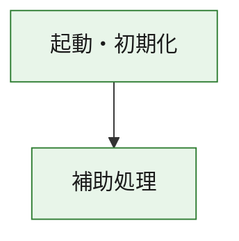
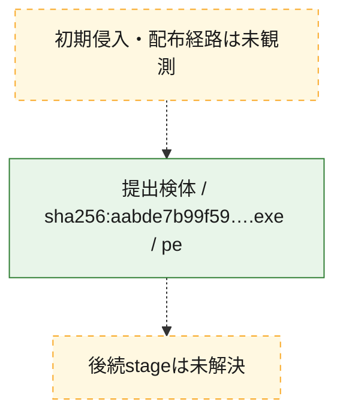
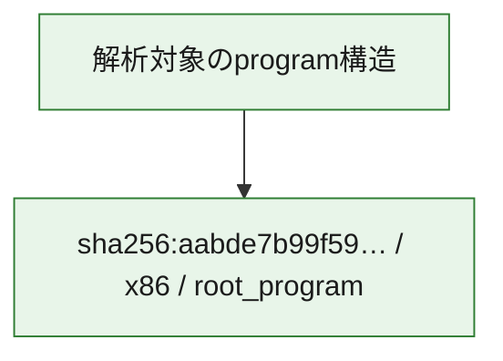

# 全体ロジック：aabde7b99f59b466c38672614e49bf2565e191a9261385f0b120147dd2b7eaf2

代表関数の静的証跡から、起動・初期化の処理群を確認しました。

## 読み方

- phaseの掲載順は解析上の整理順です。observed_call_edgesがない段階間の実行順を断定しません。
- 図の実線は静的に観測した関係、点線と黄色のノードは未観測・未解決の関係を示します。
- 図は静的な要約であり、動的実行を再現するものではありません。
- 詳細な関数解説とfingerprintは[STATIC-LOGIC.md](STATIC-LOGIC.md)を参照してください。

## 静的可視化

### 実行フロー

### 感染チェーン

### モジュール関係

## 処理段階

### 1. 起動・初期化

entry pointから初期化と後続処理への移行を確認します。
確度: `confirmed_static_function_evidence`

- `aabde7b99f59b466c38672614e49bf2565e191a9261385f0b120147dd2b7eaf2:ghidra:180001010` — 初期化と主要処理への分岐を行う入口関数です。 状態: `succeeded`、選定理由: `entry_point`, `meaningful_symbol_name`, `reviewed_call_centrality:22`, `role:entrypoint`, `small_program_complete_context`

### 2. 補助処理

主要処理を支える一般内部関数またはlibrary処理を確認します。
確度: `confirmed_static_function_evidence`

- `aabde7b99f59b466c38672614e49bf2565e191a9261385f0b120147dd2b7eaf2:ghidra:180001240` — 検体内部の一般処理を実装する関数です。 状態: `succeeded`、選定理由: `context_representative`, `reviewed_call_centrality:2`, `small_program_complete_context`
- `aabde7b99f59b466c38672614e49bf2565e191a9261385f0b120147dd2b7eaf2:ghidra:180001350` — 検体内部の一般処理を実装する関数です。 状態: `succeeded`、選定理由: `context_representative`, `reviewed_call_centrality:25`, `small_program_complete_context`
- `aabde7b99f59b466c38672614e49bf2565e191a9261385f0b120147dd2b7eaf2:ghidra:180003780` — 検体内部の一般処理を実装する関数です。 状態: `succeeded`、選定理由: `context_representative`, `reviewed_call_centrality:2`, `small_program_complete_context`
- `aabde7b99f59b466c38672614e49bf2565e191a9261385f0b120147dd2b7eaf2:ghidra:1800038e0` — 検体内部の一般処理を実装する関数です。 状態: `succeeded`、選定理由: `context_representative`, `reviewed_call_centrality:2`, `small_program_complete_context`

## 観測したcall関係

- `aabde7b99f59b466c38672614e49bf2565e191a9261385f0b120147dd2b7eaf2:ghidra:180001010` → `aabde7b99f59b466c38672614e49bf2565e191a9261385f0b120147dd2b7eaf2:ghidra:180001240` （`startup` → `support`）
- `aabde7b99f59b466c38672614e49bf2565e191a9261385f0b120147dd2b7eaf2:ghidra:180001010` → `aabde7b99f59b466c38672614e49bf2565e191a9261385f0b120147dd2b7eaf2:ghidra:180001350` （`startup` → `support`）
- `aabde7b99f59b466c38672614e49bf2565e191a9261385f0b120147dd2b7eaf2:ghidra:180001350` → `aabde7b99f59b466c38672614e49bf2565e191a9261385f0b120147dd2b7eaf2:ghidra:180001240` （`support` → `support`）
- `aabde7b99f59b466c38672614e49bf2565e191a9261385f0b120147dd2b7eaf2:ghidra:180001350` → `aabde7b99f59b466c38672614e49bf2565e191a9261385f0b120147dd2b7eaf2:ghidra:180003780` （`support` → `support`）
- `aabde7b99f59b466c38672614e49bf2565e191a9261385f0b120147dd2b7eaf2:ghidra:180001350` → `aabde7b99f59b466c38672614e49bf2565e191a9261385f0b120147dd2b7eaf2:ghidra:1800038e0` （`support` → `support`）
- `aabde7b99f59b466c38672614e49bf2565e191a9261385f0b120147dd2b7eaf2:ghidra:180003780` → `aabde7b99f59b466c38672614e49bf2565e191a9261385f0b120147dd2b7eaf2:ghidra:1800038e0` （`support` → `support`）
- `ghidra-function:06c33515b86ff6457eee23d8` → `ghidra-function:de2019cf9aba63850a96f82c` （`unclassified` → `unclassified`）
- `ghidra-function:4f9c5809f3ec0636e44ecbb8` → `ghidra-function:02519a93e3aa018193993230` （`unclassified` → `unclassified`）
- `ghidra-function:4f9c5809f3ec0636e44ecbb8` → `ghidra-function:19a7c549568265be61fa7da2` （`unclassified` → `unclassified`）
- `ghidra-function:4f9c5809f3ec0636e44ecbb8` → `ghidra-function:404a2de010394d7048a5890a` （`unclassified` → `unclassified`）
- `ghidra-function:4f9c5809f3ec0636e44ecbb8` → `ghidra-function:5e8afee89227d0a4dd949d7d` （`unclassified` → `unclassified`）
- `ghidra-function:4f9c5809f3ec0636e44ecbb8` → `ghidra-function:64a3241c066929b57790434f` （`unclassified` → `unclassified`）
- `ghidra-function:4f9c5809f3ec0636e44ecbb8` → `ghidra-function:7f34e8dbc28686f8396cbcfd` （`unclassified` → `unclassified`）
- `ghidra-function:4f9c5809f3ec0636e44ecbb8` → `ghidra-function:9723c67728dd041f7ac169d0` （`unclassified` → `unclassified`）
- `ghidra-function:4f9c5809f3ec0636e44ecbb8` → `ghidra-function:bc35ff83a429622b69aab741` （`unclassified` → `unclassified`）
- `ghidra-function:4f9c5809f3ec0636e44ecbb8` → `ghidra-function:c475e06b781646a0e60ef071` （`unclassified` → `unclassified`）
- `ghidra-function:4f9c5809f3ec0636e44ecbb8` → `ghidra-function:d0f57980a372c628fbda0721` （`unclassified` → `unclassified`）
- `ghidra-function:4f9c5809f3ec0636e44ecbb8` → `ghidra-function:e41346f69aa1983acd06302e` （`unclassified` → `unclassified`）
- `ghidra-function:4f9c5809f3ec0636e44ecbb8` → `ghidra-function:f01ad2b02a636608f8917c8c` （`unclassified` → `unclassified`）
- `ghidra-function:7f34e8dbc28686f8396cbcfd` → `ghidra-external:0478705110791f6a2f928945` （`unclassified` → `unclassified`）
- `ghidra-function:7f34e8dbc28686f8396cbcfd` → `ghidra-external:04c81e9475aeff00ba4e9bf6` （`unclassified` → `unclassified`）
- `ghidra-function:7f34e8dbc28686f8396cbcfd` → `ghidra-external:0c78339cc404f21ce3f61995` （`unclassified` → `unclassified`）
- `ghidra-function:7f34e8dbc28686f8396cbcfd` → `ghidra-external:1180de1cee047e37d2415979` （`unclassified` → `unclassified`）
- `ghidra-function:7f34e8dbc28686f8396cbcfd` → `ghidra-external:1ae8543eb304e2d734fd48ed` （`unclassified` → `unclassified`）
- `ghidra-function:7f34e8dbc28686f8396cbcfd` → `ghidra-external:2505f1746b62c96d838f2c63` （`unclassified` → `unclassified`）
- `ghidra-function:7f34e8dbc28686f8396cbcfd` → `ghidra-external:2a36da753740714cfe4054c1` （`unclassified` → `unclassified`）
- `ghidra-function:7f34e8dbc28686f8396cbcfd` → `ghidra-external:2eb30d8d1c5f3751d279fd70` （`unclassified` → `unclassified`）
- `ghidra-function:7f34e8dbc28686f8396cbcfd` → `ghidra-external:32e31057f1554a105aeac834` （`unclassified` → `unclassified`）
- `ghidra-function:7f34e8dbc28686f8396cbcfd` → `ghidra-external:465462298f4e1a4d97af7b98` （`unclassified` → `unclassified`）
- `ghidra-function:7f34e8dbc28686f8396cbcfd` → `ghidra-external:4df5cc56f300b50ca3100ce4` （`unclassified` → `unclassified`）
- `ghidra-function:7f34e8dbc28686f8396cbcfd` → `ghidra-external:55edb12d6f991bd12b28fc49` （`unclassified` → `unclassified`）
- `ghidra-function:7f34e8dbc28686f8396cbcfd` → `ghidra-external:93f0d318c42f9d544210819f` （`unclassified` → `unclassified`）
- `ghidra-function:7f34e8dbc28686f8396cbcfd` → `ghidra-external:c76e09634eaa0d745b838630` （`unclassified` → `unclassified`）
- `ghidra-function:7f34e8dbc28686f8396cbcfd` → `ghidra-external:c913aa013ee5f56a44970f80` （`unclassified` → `unclassified`）
- `ghidra-function:7f34e8dbc28686f8396cbcfd` → `ghidra-external:ce86df526ca6dd3839c29478` （`unclassified` → `unclassified`）
- `ghidra-function:7f34e8dbc28686f8396cbcfd` → `ghidra-external:d04369b0f0218b7a9fed669c` （`unclassified` → `unclassified`）
- `ghidra-function:7f34e8dbc28686f8396cbcfd` → `ghidra-external:d9c2e932f9e0408d0aba98f6` （`unclassified` → `unclassified`）
- `ghidra-function:7f34e8dbc28686f8396cbcfd` → `ghidra-external:e31822939b5f1cf4870735c2` （`unclassified` → `unclassified`）
- `ghidra-function:7f34e8dbc28686f8396cbcfd` → `ghidra-external:e7b4f424432829ee5d4f1553` （`unclassified` → `unclassified`）
- `ghidra-function:7f34e8dbc28686f8396cbcfd` → `ghidra-external:fef6bd8b138ccd23397becbb` （`unclassified` → `unclassified`）
- `ghidra-function:7f34e8dbc28686f8396cbcfd` → `ghidra-function:06c33515b86ff6457eee23d8` （`unclassified` → `unclassified`）
- `ghidra-function:7f34e8dbc28686f8396cbcfd` → `ghidra-function:64a3241c066929b57790434f` （`unclassified` → `unclassified`）
- `ghidra-function:7f34e8dbc28686f8396cbcfd` → `ghidra-function:de2019cf9aba63850a96f82c` （`unclassified` → `unclassified`）

## 解析範囲と制約

- 選定外関数は全体inventoryへ残しますが、関数本体の個別解説対象にはしていません。
- indirect call、難読化、packer、VM、壊れたcontrol flowによりcall関係が欠落する場合があります。
- 文書は静的解析に基づき、検体実行や外部通信による動的確認は行っていません。
