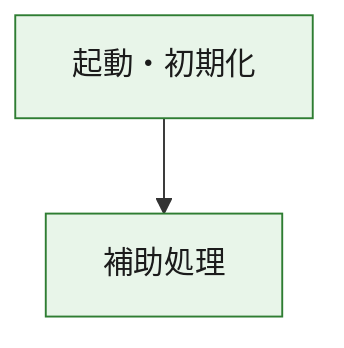
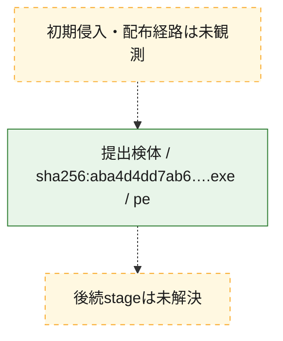
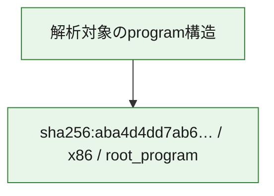

# 全体ロジック：aba4d4dd7ab62fea1849a1ef348bce68d68ce1f28e3b518436a46b8228940461

代表関数の静的証跡から、起動・初期化の処理群を確認しました。

## 読み方

- phaseの掲載順は解析上の整理順です。observed_call_edgesがない段階間の実行順を断定しません。
- 図の実線は静的に観測した関係、点線と黄色のノードは未観測・未解決の関係を示します。
- 図は静的な要約であり、動的実行を再現するものではありません。
- 詳細な関数解説とfingerprintは[STATIC-LOGIC.md](STATIC-LOGIC.md)を参照してください。

## 静的可視化

### 実行フロー

### 感染チェーン

### モジュール関係

## 処理段階

### 1. 起動・初期化

entry pointから初期化と後続処理への移行を確認します。
確度: `confirmed_static_function_evidence`

- `aba4d4dd7ab62fea1849a1ef348bce68d68ce1f28e3b518436a46b8228940461:ghidra:180001010` — 初期化と主要処理への分岐を行う入口関数です。 状態: `succeeded`、選定理由: `entry_point`, `meaningful_symbol_name`, `reviewed_call_centrality:22`, `role:entrypoint`, `small_program_complete_context`

### 2. 補助処理

主要処理を支える一般内部関数またはlibrary処理を確認します。
確度: `confirmed_static_function_evidence`

- `aba4d4dd7ab62fea1849a1ef348bce68d68ce1f28e3b518436a46b8228940461:ghidra:180001240` — 検体内部の一般処理を実装する関数です。 状態: `succeeded`、選定理由: `context_representative`, `reviewed_call_centrality:2`, `small_program_complete_context`
- `aba4d4dd7ab62fea1849a1ef348bce68d68ce1f28e3b518436a46b8228940461:ghidra:180001350` — 検体内部の一般処理を実装する関数です。 状態: `succeeded`、選定理由: `context_representative`, `reviewed_call_centrality:25`, `small_program_complete_context`
- `aba4d4dd7ab62fea1849a1ef348bce68d68ce1f28e3b518436a46b8228940461:ghidra:180003780` — 検体内部の一般処理を実装する関数です。 状態: `succeeded`、選定理由: `context_representative`, `reviewed_call_centrality:2`, `small_program_complete_context`
- `aba4d4dd7ab62fea1849a1ef348bce68d68ce1f28e3b518436a46b8228940461:ghidra:1800038e0` — 検体内部の一般処理を実装する関数です。 状態: `succeeded`、選定理由: `context_representative`, `reviewed_call_centrality:2`, `small_program_complete_context`

## 観測したcall関係

- `aba4d4dd7ab62fea1849a1ef348bce68d68ce1f28e3b518436a46b8228940461:ghidra:180001010` → `aba4d4dd7ab62fea1849a1ef348bce68d68ce1f28e3b518436a46b8228940461:ghidra:180001240` （`startup` → `support`）
- `aba4d4dd7ab62fea1849a1ef348bce68d68ce1f28e3b518436a46b8228940461:ghidra:180001010` → `aba4d4dd7ab62fea1849a1ef348bce68d68ce1f28e3b518436a46b8228940461:ghidra:180001350` （`startup` → `support`）
- `aba4d4dd7ab62fea1849a1ef348bce68d68ce1f28e3b518436a46b8228940461:ghidra:180001350` → `aba4d4dd7ab62fea1849a1ef348bce68d68ce1f28e3b518436a46b8228940461:ghidra:180001240` （`support` → `support`）
- `aba4d4dd7ab62fea1849a1ef348bce68d68ce1f28e3b518436a46b8228940461:ghidra:180001350` → `aba4d4dd7ab62fea1849a1ef348bce68d68ce1f28e3b518436a46b8228940461:ghidra:180003780` （`support` → `support`）
- `aba4d4dd7ab62fea1849a1ef348bce68d68ce1f28e3b518436a46b8228940461:ghidra:180001350` → `aba4d4dd7ab62fea1849a1ef348bce68d68ce1f28e3b518436a46b8228940461:ghidra:1800038e0` （`support` → `support`）
- `aba4d4dd7ab62fea1849a1ef348bce68d68ce1f28e3b518436a46b8228940461:ghidra:180003780` → `aba4d4dd7ab62fea1849a1ef348bce68d68ce1f28e3b518436a46b8228940461:ghidra:1800038e0` （`support` → `support`）
- `ghidra-function:1ddfdbdc3f3929cbdc674e94` → `ghidra-function:f125b53d1c568e0c87b26dbc` （`unclassified` → `unclassified`）
- `ghidra-function:5e52d55176e014f4829ee137` → `ghidra-external:0805f71e14ae21c7c90d4fc3` （`unclassified` → `unclassified`）
- `ghidra-function:5e52d55176e014f4829ee137` → `ghidra-external:0a1c8af8478e0ee994741eb9` （`unclassified` → `unclassified`）
- `ghidra-function:5e52d55176e014f4829ee137` → `ghidra-external:1b1a75c4a7bc820d4f7cc925` （`unclassified` → `unclassified`）
- `ghidra-function:5e52d55176e014f4829ee137` → `ghidra-external:1de06b60cd315ace5690d3f4` （`unclassified` → `unclassified`）
- `ghidra-function:5e52d55176e014f4829ee137` → `ghidra-external:243da2df2b5cdb5626001af6` （`unclassified` → `unclassified`）
- `ghidra-function:5e52d55176e014f4829ee137` → `ghidra-external:29afc1a3695415ec8506d16a` （`unclassified` → `unclassified`）
- `ghidra-function:5e52d55176e014f4829ee137` → `ghidra-external:3032e4e6863d63fa60e37326` （`unclassified` → `unclassified`）
- `ghidra-function:5e52d55176e014f4829ee137` → `ghidra-external:4b8880a8c127a55bf26a3bbc` （`unclassified` → `unclassified`）
- `ghidra-function:5e52d55176e014f4829ee137` → `ghidra-external:625d39d51db5fa361fa63a0d` （`unclassified` → `unclassified`）
- `ghidra-function:5e52d55176e014f4829ee137` → `ghidra-external:6ac7bc9387ec9c2c5fb465db` （`unclassified` → `unclassified`）
- `ghidra-function:5e52d55176e014f4829ee137` → `ghidra-external:90d12f8df6630369b3904a03` （`unclassified` → `unclassified`）
- `ghidra-function:5e52d55176e014f4829ee137` → `ghidra-external:a4dabe910be2ff5f96c27ba6` （`unclassified` → `unclassified`）
- `ghidra-function:5e52d55176e014f4829ee137` → `ghidra-external:a61e969c607d687a1482092e` （`unclassified` → `unclassified`）
- `ghidra-function:5e52d55176e014f4829ee137` → `ghidra-external:add8c906ad2252b247cf3941` （`unclassified` → `unclassified`）
- `ghidra-function:5e52d55176e014f4829ee137` → `ghidra-external:b196d492b2d355f15683163d` （`unclassified` → `unclassified`）
- `ghidra-function:5e52d55176e014f4829ee137` → `ghidra-external:be0b801c48cdb7e62742f737` （`unclassified` → `unclassified`）
- `ghidra-function:5e52d55176e014f4829ee137` → `ghidra-external:eafaa287d2fcaf4c630bd8db` （`unclassified` → `unclassified`）
- `ghidra-function:5e52d55176e014f4829ee137` → `ghidra-external:f2f2b5740e2bf450ee8cd008` （`unclassified` → `unclassified`）
- `ghidra-function:5e52d55176e014f4829ee137` → `ghidra-external:f5db77c79c7486518034e7c8` （`unclassified` → `unclassified`）
- `ghidra-function:5e52d55176e014f4829ee137` → `ghidra-external:f81e807508f90ec76eefea42` （`unclassified` → `unclassified`）
- `ghidra-function:5e52d55176e014f4829ee137` → `ghidra-external:f8f4ab37de8b1a24d4a7f28f` （`unclassified` → `unclassified`）
- `ghidra-function:5e52d55176e014f4829ee137` → `ghidra-function:1ddfdbdc3f3929cbdc674e94` （`unclassified` → `unclassified`）
- `ghidra-function:5e52d55176e014f4829ee137` → `ghidra-function:245ca325e758f52f6a4e600e` （`unclassified` → `unclassified`）
- `ghidra-function:5e52d55176e014f4829ee137` → `ghidra-function:f125b53d1c568e0c87b26dbc` （`unclassified` → `unclassified`）
- `ghidra-function:8aee02d64c0e98f8094654d4` → `ghidra-function:245ca325e758f52f6a4e600e` （`unclassified` → `unclassified`）
- `ghidra-function:8aee02d64c0e98f8094654d4` → `ghidra-function:25d0c375c86dc933f446fa4d` （`unclassified` → `unclassified`）
- `ghidra-function:8aee02d64c0e98f8094654d4` → `ghidra-function:4bc65b26019cfa8ccffa2de4` （`unclassified` → `unclassified`）
- `ghidra-function:8aee02d64c0e98f8094654d4` → `ghidra-function:535df3d91f3f19e0167b6f08` （`unclassified` → `unclassified`）
- `ghidra-function:8aee02d64c0e98f8094654d4` → `ghidra-function:55811f893c7caf10944b793c` （`unclassified` → `unclassified`）
- `ghidra-function:8aee02d64c0e98f8094654d4` → `ghidra-function:5e52d55176e014f4829ee137` （`unclassified` → `unclassified`）
- `ghidra-function:8aee02d64c0e98f8094654d4` → `ghidra-function:6259cdaa825b66f7cc2202c5` （`unclassified` → `unclassified`）
- `ghidra-function:8aee02d64c0e98f8094654d4` → `ghidra-function:7ebd85158349c383a6bcbb43` （`unclassified` → `unclassified`）
- `ghidra-function:8aee02d64c0e98f8094654d4` → `ghidra-function:a5fc71d7b79736d26bccf6e7` （`unclassified` → `unclassified`）
- `ghidra-function:8aee02d64c0e98f8094654d4` → `ghidra-function:bb7797050f9c8a5b207c19d1` （`unclassified` → `unclassified`）
- `ghidra-function:8aee02d64c0e98f8094654d4` → `ghidra-function:dadde6eb6cd9b9d46b1b7d9c` （`unclassified` → `unclassified`）
- `ghidra-function:8aee02d64c0e98f8094654d4` → `ghidra-function:fa69aaa9cd148a9e9d14b8a1` （`unclassified` → `unclassified`）

## 解析範囲と制約

- 選定外関数は全体inventoryへ残しますが、関数本体の個別解説対象にはしていません。
- indirect call、難読化、packer、VM、壊れたcontrol flowによりcall関係が欠落する場合があります。
- 文書は静的解析に基づき、検体実行や外部通信による動的確認は行っていません。
