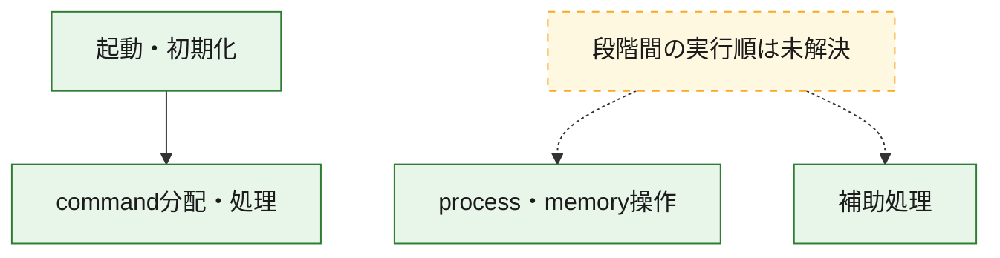
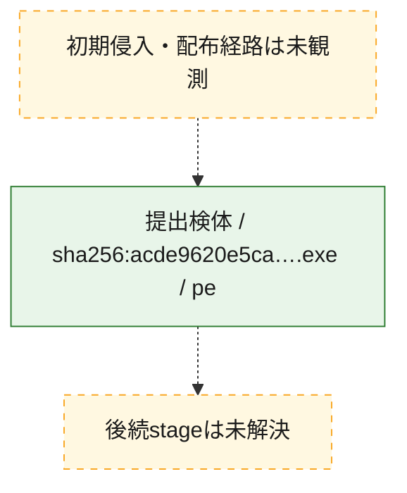
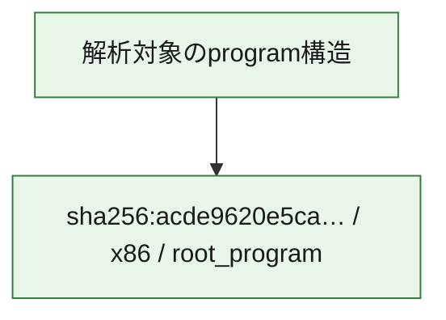

# 全体ロジック：acde9620e5ca90b9033d6f42c260c8dc99a54d6b447fa4d6648ed3e99c80b68b

代表関数の静的証跡から、起動・初期化、process・memory操作、command分配・処理の処理群を確認しました。

## 読み方

- phaseの掲載順は解析上の整理順です。observed_call_edgesがない段階間の実行順を断定しません。
- 図の実線は静的に観測した関係、点線と黄色のノードは未観測・未解決の関係を示します。
- 図は静的な要約であり、動的実行を再現するものではありません。
- 詳細な関数解説とfingerprintは[STATIC-LOGIC.md](STATIC-LOGIC.md)を参照してください。

## 静的可視化

### 実行フロー

### 感染チェーン

### モジュール関係

## 処理段階

### 1. 起動・初期化

entry pointから初期化と後続処理への移行を確認します。
確度: `confirmed_static_function_evidence`

- `acde9620e5ca90b9033d6f42c260c8dc99a54d6b447fa4d6648ed3e99c80b68b:ghidra:14000c430` — 初期化と主要処理への分岐を行う入口関数です。 状態: `succeeded`、選定理由: `entry_point`, `meaningful_symbol_name`, `reviewed_call_centrality:22`, `role:entrypoint`

### 2. process・memory操作

process、thread、module、memory操作と実行移行を確認します。
確度: `confirmed_static_function_evidence_with_limits`

- `acde9620e5ca90b9033d6f42c260c8dc99a54d6b447fa4d6648ed3e99c80b68b:ghidra:140001d20` — process、thread、module、またはmemory操作に関係する関数です。 状態: `limited_bad_instruction_or_flow`、選定理由: `context_representative`, `reviewed_call_centrality:7`, `role:process_or_memory_operation`

### 3. command分配・処理

受信commandやtaskの解釈、分配、個別handlerへの移行を確認します。
確度: `confirmed_static_function_evidence_with_limits`

- `acde9620e5ca90b9033d6f42c260c8dc99a54d6b447fa4d6648ed3e99c80b68b:ghidra:140019150` — commandの解釈、分配、または個別処理を担当する関数です。 状態: `limited_bad_instruction_or_flow`、選定理由: `meaningful_symbol_name`, `reviewed_call_centrality:1`, `role:command_dispatch_or_handler`

### 4. 補助処理

主要処理を支える一般内部関数またはlibrary処理を確認します。
確度: `confirmed_static_function_evidence_with_limits`

- `acde9620e5ca90b9033d6f42c260c8dc99a54d6b447fa4d6648ed3e99c80b68b:ghidra:1400011a0` — 検体内部の一般処理を実装する関数です。 状態: `succeeded`、選定理由: `context_representative`, `reviewed_call_centrality:8`
- `acde9620e5ca90b9033d6f42c260c8dc99a54d6b447fa4d6648ed3e99c80b68b:ghidra:1400014c0` — 検体内部の一般処理を実装する関数です。 状態: `succeeded`、選定理由: `context_representative`, `reviewed_call_centrality:1`
- `acde9620e5ca90b9033d6f42c260c8dc99a54d6b447fa4d6648ed3e99c80b68b:ghidra:140001540` — 検体内部の一般処理を実装する関数です。 状態: `succeeded`、選定理由: `context_representative`
- `acde9620e5ca90b9033d6f42c260c8dc99a54d6b447fa4d6648ed3e99c80b68b:ghidra:140001580` — 検体内部の一般処理を実装する関数です。 状態: `succeeded`、選定理由: `context_representative`, `reviewed_call_centrality:2`
- `acde9620e5ca90b9033d6f42c260c8dc99a54d6b447fa4d6648ed3e99c80b68b:ghidra:140001660` — 検体内部の一般処理を実装する関数です。 状態: `succeeded`、選定理由: `context_representative`, `reviewed_call_centrality:3`
- `acde9620e5ca90b9033d6f42c260c8dc99a54d6b447fa4d6648ed3e99c80b68b:ghidra:140001ac0` — 検体内部の一般処理を実装する関数です。 状態: `succeeded`、選定理由: `context_representative`, `reviewed_call_centrality:1`
- `acde9620e5ca90b9033d6f42c260c8dc99a54d6b447fa4d6648ed3e99c80b68b:ghidra:140001b80` — 検体内部の一般処理を実装する関数です。 状態: `limited_bad_instruction_or_flow`、選定理由: `context_representative`, `reviewed_call_centrality:14`
- `acde9620e5ca90b9033d6f42c260c8dc99a54d6b447fa4d6648ed3e99c80b68b:ghidra:140001bd0` — 検体内部の一般処理を実装する関数です。 状態: `limited_bad_instruction_or_flow`、選定理由: `context_representative`, `reviewed_call_centrality:8`
- `acde9620e5ca90b9033d6f42c260c8dc99a54d6b447fa4d6648ed3e99c80b68b:ghidra:140001cc0` — 検体内部の一般処理を実装する関数です。 状態: `succeeded`、選定理由: `context_representative`, `reviewed_call_centrality:2`
- `acde9620e5ca90b9033d6f42c260c8dc99a54d6b447fa4d6648ed3e99c80b68b:ghidra:140001e60` — 検体内部の一般処理を実装する関数です。 状態: `succeeded`、選定理由: `context_representative`, `reviewed_call_centrality:2`
- `acde9620e5ca90b9033d6f42c260c8dc99a54d6b447fa4d6648ed3e99c80b68b:ghidra:140001ea0` — 検体内部の一般処理を実装する関数です。 状態: `succeeded`、選定理由: `context_representative`, `reviewed_call_centrality:1`
- `acde9620e5ca90b9033d6f42c260c8dc99a54d6b447fa4d6648ed3e99c80b68b:ghidra:140001f40` — 検体内部の一般処理を実装する関数です。 状態: `limited_bad_instruction_or_flow`、選定理由: `context_representative`, `reviewed_call_centrality:7`
- `acde9620e5ca90b9033d6f42c260c8dc99a54d6b447fa4d6648ed3e99c80b68b:ghidra:140001fb0` — 検体内部の一般処理を実装する関数です。 状態: `succeeded`、選定理由: `context_representative`, `reviewed_call_centrality:1`
- `acde9620e5ca90b9033d6f42c260c8dc99a54d6b447fa4d6648ed3e99c80b68b:ghidra:1400023e0` — 検体内部の一般処理を実装する関数です。 状態: `succeeded`、選定理由: `context_representative`, `reviewed_call_centrality:3`
- `acde9620e5ca90b9033d6f42c260c8dc99a54d6b447fa4d6648ed3e99c80b68b:ghidra:140002720` — 検体内部の一般処理を実装する関数です。 状態: `limited_bad_instruction_or_flow`、選定理由: `context_representative`, `reviewed_call_centrality:1`
- `acde9620e5ca90b9033d6f42c260c8dc99a54d6b447fa4d6648ed3e99c80b68b:ghidra:140002ce0` — 検体内部の一般処理を実装する関数です。 状態: `succeeded`、選定理由: `context_representative`, `reviewed_call_centrality:4`
- `acde9620e5ca90b9033d6f42c260c8dc99a54d6b447fa4d6648ed3e99c80b68b:ghidra:140002d40` — 検体内部の一般処理を実装する関数です。 状態: `succeeded`、選定理由: `context_representative`, `reviewed_call_centrality:4`
- `acde9620e5ca90b9033d6f42c260c8dc99a54d6b447fa4d6648ed3e99c80b68b:ghidra:140002ea0` — 検体内部の一般処理を実装する関数です。 状態: `limited_bad_instruction_or_flow`、選定理由: `context_representative`, `reviewed_call_centrality:11`
- `acde9620e5ca90b9033d6f42c260c8dc99a54d6b447fa4d6648ed3e99c80b68b:ghidra:140003180` — 検体内部の一般処理を実装する関数です。 状態: `succeeded`、選定理由: `context_representative`, `reviewed_call_centrality:1`
- `acde9620e5ca90b9033d6f42c260c8dc99a54d6b447fa4d6648ed3e99c80b68b:ghidra:140003240` — 検体内部の一般処理を実装する関数です。 状態: `succeeded`、選定理由: `context_representative`, `reviewed_call_centrality:1`
- `acde9620e5ca90b9033d6f42c260c8dc99a54d6b447fa4d6648ed3e99c80b68b:ghidra:140003280` — 検体内部の一般処理を実装する関数です。 状態: `succeeded`、選定理由: `context_representative`, `reviewed_call_centrality:1`
- `acde9620e5ca90b9033d6f42c260c8dc99a54d6b447fa4d6648ed3e99c80b68b:ghidra:1400032f0` — 検体内部の一般処理を実装する関数です。 状態: `succeeded`、選定理由: `context_representative`, `reviewed_call_centrality:5`
- `acde9620e5ca90b9033d6f42c260c8dc99a54d6b447fa4d6648ed3e99c80b68b:ghidra:140003360` — 検体内部の一般処理を実装する関数です。 状態: `succeeded`、選定理由: `context_representative`, `reviewed_call_centrality:9`
- `acde9620e5ca90b9033d6f42c260c8dc99a54d6b447fa4d6648ed3e99c80b68b:ghidra:1400035c0` — 検体内部の一般処理を実装する関数です。 状態: `limited_bad_instruction_or_flow`、選定理由: `context_representative`, `reviewed_call_centrality:4`
- `acde9620e5ca90b9033d6f42c260c8dc99a54d6b447fa4d6648ed3e99c80b68b:ghidra:140003940` — 検体内部の一般処理を実装する関数です。 状態: `limited_bad_instruction_or_flow`、選定理由: `context_representative`, `reviewed_call_centrality:1`
- `acde9620e5ca90b9033d6f42c260c8dc99a54d6b447fa4d6648ed3e99c80b68b:ghidra:140003d80` — 検体内部の一般処理を実装する関数です。 状態: `succeeded`、選定理由: `context_representative`, `reviewed_call_centrality:2`
- `acde9620e5ca90b9033d6f42c260c8dc99a54d6b447fa4d6648ed3e99c80b68b:ghidra:140003e40` — 検体内部の一般処理を実装する関数です。 状態: `succeeded`、選定理由: `context_representative`, `reviewed_call_centrality:2`
- `acde9620e5ca90b9033d6f42c260c8dc99a54d6b447fa4d6648ed3e99c80b68b:ghidra:140009440` — compiler生成処理または汎用library処理とみられる関数です。 状態: `succeeded`、選定理由: `entry_point`, `meaningful_symbol_name`, `reviewed_call_centrality:2`
- `acde9620e5ca90b9033d6f42c260c8dc99a54d6b447fa4d6648ed3e99c80b68b:ghidra:14000ca60` — 検体内部の一般処理を実装する関数です。 状態: `succeeded`、選定理由: `meaningful_symbol_name`

## 観測したcall関係

- `acde9620e5ca90b9033d6f42c260c8dc99a54d6b447fa4d6648ed3e99c80b68b:ghidra:1400011a0` → `acde9620e5ca90b9033d6f42c260c8dc99a54d6b447fa4d6648ed3e99c80b68b:ghidra:140001b80` （`support` → `support`）
- `acde9620e5ca90b9033d6f42c260c8dc99a54d6b447fa4d6648ed3e99c80b68b:ghidra:1400011a0` → `acde9620e5ca90b9033d6f42c260c8dc99a54d6b447fa4d6648ed3e99c80b68b:ghidra:140001f40` （`support` → `support`）
- `acde9620e5ca90b9033d6f42c260c8dc99a54d6b447fa4d6648ed3e99c80b68b:ghidra:1400011a0` → `acde9620e5ca90b9033d6f42c260c8dc99a54d6b447fa4d6648ed3e99c80b68b:ghidra:140003360` （`support` → `support`）
- `acde9620e5ca90b9033d6f42c260c8dc99a54d6b447fa4d6648ed3e99c80b68b:ghidra:140001580` → `acde9620e5ca90b9033d6f42c260c8dc99a54d6b447fa4d6648ed3e99c80b68b:ghidra:1400023e0` （`support` → `support`）
- `acde9620e5ca90b9033d6f42c260c8dc99a54d6b447fa4d6648ed3e99c80b68b:ghidra:14000c430` → `acde9620e5ca90b9033d6f42c260c8dc99a54d6b447fa4d6648ed3e99c80b68b:ghidra:140019150` （`startup` → `dispatch`）
- `ghidra-function:032a7f0d682b9f50dce76de1` → `ghidra-external:86a4002144de7f0e41f67a13` （`unclassified` → `unclassified`）
- `ghidra-function:065b840c7952ee484068d00e` → `ghidra-external:34cd81b8f4cde7ca6d795bc1` （`unclassified` → `unclassified`）
- `ghidra-function:065b840c7952ee484068d00e` → `ghidra-external:404a540339c493a1be97596f` （`unclassified` → `unclassified`）
- `ghidra-function:065b840c7952ee484068d00e` → `ghidra-external:42be958b62e10b5e4a30486a` （`unclassified` → `unclassified`）
- `ghidra-function:065b840c7952ee484068d00e` → `ghidra-external:4d50394e976c65ef1f90b633` （`unclassified` → `unclassified`）
- `ghidra-function:065b840c7952ee484068d00e` → `ghidra-external:609f5c8554c2e7b0deaa3f53` （`unclassified` → `unclassified`）
- `ghidra-function:065b840c7952ee484068d00e` → `ghidra-external:86a4002144de7f0e41f67a13` （`unclassified` → `unclassified`）
- `ghidra-function:065b840c7952ee484068d00e` → `ghidra-external:ac2a5dc7cd8029b4a8c325bb` （`unclassified` → `unclassified`）
- `ghidra-function:065b840c7952ee484068d00e` → `ghidra-external:d9e7cad916ef2e32d3233008` （`unclassified` → `unclassified`）
- `ghidra-function:065b840c7952ee484068d00e` → `ghidra-external:db6d804fc624a30668d62f1c` （`unclassified` → `unclassified`）
- `ghidra-function:065b840c7952ee484068d00e` → `ghidra-external:e9eb5d545888852f4aece610` （`unclassified` → `unclassified`）
- `ghidra-function:065b840c7952ee484068d00e` → `ghidra-external:fd4b53883ad4dc0e350d43c4` （`unclassified` → `unclassified`）
- `ghidra-function:089a0145aa7363c75c5f9c40` → `ghidra-external:33f8df668795e48be4cad7eb` （`unclassified` → `unclassified`）
- `ghidra-function:089a0145aa7363c75c5f9c40` → `ghidra-function:e3372786dca3590a4eae7dda` （`unclassified` → `unclassified`）
- `ghidra-function:1e6114b66e265cf5e89cd427` → `ghidra-external:857de0f49dc5e7613bb7dd1f` （`unclassified` → `unclassified`）
- `ghidra-function:1e6114b66e265cf5e89cd427` → `ghidra-function:990102061ccb3d30f1a4d59a` （`unclassified` → `unclassified`）
- `ghidra-function:2a3f8b736fbfd948edf53e2b` → `ghidra-external:bce3acc1856d38883d2724ac` （`unclassified` → `unclassified`）
- `ghidra-function:2a3f8b736fbfd948edf53e2b` → `ghidra-function:089a0145aa7363c75c5f9c40` （`unclassified` → `unclassified`）
- `ghidra-function:3a116330ce8fd161171e9ecc` → `ghidra-function:8c32964d49c4d01410a392a2` （`unclassified` → `unclassified`）
- `ghidra-function:3f8b085555d0a5c679d5cf55` → `ghidra-function:2b85bb14ea75612ba8d18052` （`unclassified` → `unclassified`）
- `ghidra-function:4525f600296e6c2313caa22d` → `ghidra-external:4d50394e976c65ef1f90b633` （`unclassified` → `unclassified`）
- `ghidra-function:4525f600296e6c2313caa22d` → `ghidra-external:d4b23768999c76f6eff01e90` （`unclassified` → `unclassified`）
- `ghidra-function:4525f600296e6c2313caa22d` → `ghidra-external:eff741b86a46803fb5297b2c` （`unclassified` → `unclassified`）
- `ghidra-function:574903f44cdd19fb2ff157e9` → `ghidra-external:86a4002144de7f0e41f67a13` （`unclassified` → `unclassified`）
- `ghidra-function:574903f44cdd19fb2ff157e9` → `ghidra-external:d9e7cad916ef2e32d3233008` （`unclassified` → `unclassified`）
- `ghidra-function:574903f44cdd19fb2ff157e9` → `ghidra-function:5e6b90990290f54c8a19d5f7` （`unclassified` → `unclassified`）
- `ghidra-function:574903f44cdd19fb2ff157e9` → `ghidra-function:a877828fbe2e003f904da40b` （`unclassified` → `unclassified`）
- `ghidra-function:574903f44cdd19fb2ff157e9` → `ghidra-function:ffd56a3514c117667d62c271` （`unclassified` → `unclassified`）
- `ghidra-function:752c424ad2c503ad5db67ef6` → `ghidra-external:86a4002144de7f0e41f67a13` （`unclassified` → `unclassified`）
- `ghidra-function:752c424ad2c503ad5db67ef6` → `ghidra-external:a1309d5861e26d72f5e3510b` （`unclassified` → `unclassified`）
- `ghidra-function:78c0c5602ef0030790b3393a` → `ghidra-external:33f8df668795e48be4cad7eb` （`unclassified` → `unclassified`）
- `ghidra-function:78c0c5602ef0030790b3393a` → `ghidra-external:86a4002144de7f0e41f67a13` （`unclassified` → `unclassified`）
- `ghidra-function:7a0a02671c0e45aafc663365` → `ghidra-external:86a4002144de7f0e41f67a13` （`unclassified` → `unclassified`）
- `ghidra-function:7a0a02671c0e45aafc663365` → `ghidra-function:4f4614f66d762c0022fcf117` （`unclassified` → `unclassified`）
- `ghidra-function:7a0a02671c0e45aafc663365` → `ghidra-function:fa4da19898fd866a6b385ef8` （`unclassified` → `unclassified`）
- `ghidra-function:7ae62ea3f78f0e3afd5d0e2a` → `ghidra-external:86a4002144de7f0e41f67a13` （`unclassified` → `unclassified`）
- `ghidra-function:7ae62ea3f78f0e3afd5d0e2a` → `ghidra-function:6863d888c889565ba4181f29` （`unclassified` → `unclassified`）
- `ghidra-function:85d04a4988d0992993cb0194` → `ghidra-external:86a4002144de7f0e41f67a13` （`unclassified` → `unclassified`）
- `ghidra-function:9016f3507786e3a5164ebe33` → `ghidra-external:34cd81b8f4cde7ca6d795bc1` （`unclassified` → `unclassified`）
- `ghidra-function:9016f3507786e3a5164ebe33` → `ghidra-external:609f5c8554c2e7b0deaa3f53` （`unclassified` → `unclassified`）
- `ghidra-function:9016f3507786e3a5164ebe33` → `ghidra-external:7094795103cd6d088751dfae` （`unclassified` → `unclassified`）
- `ghidra-function:9016f3507786e3a5164ebe33` → `ghidra-function:88fbfd6e28cd6882077e3ff1` （`unclassified` → `unclassified`）
- `ghidra-function:9016f3507786e3a5164ebe33` → `ghidra-function:89699ca33432eb7136a40807` （`unclassified` → `unclassified`）
- `ghidra-function:903ba71579d54cb111638356` → `ghidra-external:5dadc651cf7f79eb62cd7b3a` （`unclassified` → `unclassified`）
- `ghidra-function:903ba71579d54cb111638356` → `ghidra-function:175578918821d2d18092aa6b` （`unclassified` → `unclassified`）
- `ghidra-function:903ba71579d54cb111638356` → `ghidra-function:51312b5b8452d354d6b27409` （`unclassified` → `unclassified`）
- `ghidra-function:903ba71579d54cb111638356` → `ghidra-function:6863d888c889565ba4181f29` （`unclassified` → `unclassified`）
- `ghidra-function:903ba71579d54cb111638356` → `ghidra-function:990102061ccb3d30f1a4d59a` （`unclassified` → `unclassified`）
- `ghidra-function:903ba71579d54cb111638356` → `ghidra-function:e3372786dca3590a4eae7dda` （`unclassified` → `unclassified`）
- `ghidra-function:9bf408dc81c1a301bcc9d96d` → `ghidra-external:86a4002144de7f0e41f67a13` （`unclassified` → `unclassified`）
- `ghidra-function:a1aff0c95ca8f997dafc9a14` → `ghidra-external:36de5c0d176eb6fc6d14f7ed` （`unclassified` → `unclassified`）
- `ghidra-function:a1aff0c95ca8f997dafc9a14` → `ghidra-external:86a4002144de7f0e41f67a13` （`unclassified` → `unclassified`）
- `ghidra-function:a1aff0c95ca8f997dafc9a14` → `ghidra-external:d4b23768999c76f6eff01e90` （`unclassified` → `unclassified`）
- `ghidra-function:a1aff0c95ca8f997dafc9a14` → `ghidra-function:574903f44cdd19fb2ff157e9` （`unclassified` → `unclassified`）
- `ghidra-function:a1aff0c95ca8f997dafc9a14` → `ghidra-function:91ce938f1f9c4209f8817d73` （`unclassified` → `unclassified`）
- `ghidra-function:a1aff0c95ca8f997dafc9a14` → `ghidra-function:c9c3666f8c70f219c2e9bf64` （`unclassified` → `unclassified`）
- `ghidra-function:a1aff0c95ca8f997dafc9a14` → `ghidra-function:f8038a2bc24f9ddc9ce0911e` （`unclassified` → `unclassified`）
- `ghidra-function:a659c1ba4efaceb83970d6a4` → `ghidra-external:4dc70f7328f1bb394f38ffa1` （`unclassified` → `unclassified`）
- `ghidra-function:bcf15e23eff1581e94f10df6` → `ghidra-function:88fbfd6e28cd6882077e3ff1` （`unclassified` → `unclassified`）
- `ghidra-function:bcf15e23eff1581e94f10df6` → `ghidra-function:f19a2c53ab29da6474477c9d` （`unclassified` → `unclassified`）
- `ghidra-function:c16a828da7525a0e5b48b6b7` → `ghidra-function:6439701218f3327a13cfd5c3` （`unclassified` → `unclassified`）
- `ghidra-function:c3ddbd91f7ccc03dad145f12` → `ghidra-external:ce54d5a56a2e2e752e99a6b2` （`unclassified` → `unclassified`）
- `ghidra-function:c72131f780b046f507ec2301` → `ghidra-function:88fbfd6e28cd6882077e3ff1` （`unclassified` → `unclassified`）
- `ghidra-function:c72131f780b046f507ec2301` → `ghidra-function:f19a2c53ab29da6474477c9d` （`unclassified` → `unclassified`）
- `ghidra-function:c9c3666f8c70f219c2e9bf64` → `ghidra-external:c8a8e7824b58cabd2cf52b1a` （`unclassified` → `unclassified`）
- `ghidra-function:c9c3666f8c70f219c2e9bf64` → `ghidra-function:51312b5b8452d354d6b27409` （`unclassified` → `unclassified`）
- `ghidra-function:c9c3666f8c70f219c2e9bf64` → `ghidra-function:6533e3e4bf9fc6f2753dacca` （`unclassified` → `unclassified`）
- `ghidra-function:c9c3666f8c70f219c2e9bf64` → `ghidra-function:6863d888c889565ba4181f29` （`unclassified` → `unclassified`）
- `ghidra-function:c9cb131f15fed61e66fe794a` → `ghidra-external:99d1984b30d0d36577aef9e7` （`unclassified` → `unclassified`）
- `ghidra-function:e000b7a657449d550b65e491` → `ghidra-external:34cd81b8f4cde7ca6d795bc1` （`unclassified` → `unclassified`）
- `ghidra-function:e000b7a657449d550b65e491` → `ghidra-external:609f5c8554c2e7b0deaa3f53` （`unclassified` → `unclassified`）
- `ghidra-function:e000b7a657449d550b65e491` → `ghidra-external:86a4002144de7f0e41f67a13` （`unclassified` → `unclassified`）
- `ghidra-function:e000b7a657449d550b65e491` → `ghidra-function:91ce938f1f9c4209f8817d73` （`unclassified` → `unclassified`）
- `ghidra-function:e8677c4903b49971b57d8980` → `ghidra-external:4d50394e976c65ef1f90b633` （`unclassified` → `unclassified`）
- `ghidra-function:e8677c4903b49971b57d8980` → `ghidra-external:62452c8db320b1a49d92900c` （`unclassified` → `unclassified`）
- `ghidra-function:e8677c4903b49971b57d8980` → `ghidra-external:7e7d9ece9071586270509e37` （`unclassified` → `unclassified`）
- `ghidra-function:e8677c4903b49971b57d8980` → `ghidra-external:99c73337264ae1deaaa645dc` （`unclassified` → `unclassified`）
- `ghidra-function:e8677c4903b49971b57d8980` → `ghidra-external:ac23b86c45a7a3b146d87c31` （`unclassified` → `unclassified`）
- `ghidra-function:e8677c4903b49971b57d8980` → `ghidra-external:aca1737ad09dc25680f97004` （`unclassified` → `unclassified`）
- `ghidra-function:e8677c4903b49971b57d8980` → `ghidra-external:cd25968ceef32679887d530c` （`unclassified` → `unclassified`）
- `ghidra-function:e8677c4903b49971b57d8980` → `ghidra-external:d15a74d6adc7a1a21a4a420c` （`unclassified` → `unclassified`）
- `ghidra-function:e8677c4903b49971b57d8980` → `ghidra-external:e5bc0650ca4ad4dacf8df6f5` （`unclassified` → `unclassified`）
- `ghidra-function:e8677c4903b49971b57d8980` → `ghidra-function:034647341f077b4525e528f1` （`unclassified` → `unclassified`）
- `ghidra-function:e8677c4903b49971b57d8980` → `ghidra-function:10623b6dbff03cf8c180e44b` （`unclassified` → `unclassified`）
- `ghidra-function:e8677c4903b49971b57d8980` → `ghidra-function:177755077204c7e4bcc0e336` （`unclassified` → `unclassified`）
- `ghidra-function:e8677c4903b49971b57d8980` → `ghidra-function:1e89e7e3a256955f81356562` （`unclassified` → `unclassified`）
- `ghidra-function:e8677c4903b49971b57d8980` → `ghidra-function:23ce4a53d3cae190d4769464` （`unclassified` → `unclassified`）
- `ghidra-function:e8677c4903b49971b57d8980` → `ghidra-function:286b744348e63ee1f1629e21` （`unclassified` → `unclassified`）
- `ghidra-function:e8677c4903b49971b57d8980` → `ghidra-function:2bffba96e1f6fe3b8a9386c2` （`unclassified` → `unclassified`）
- `ghidra-function:e8677c4903b49971b57d8980` → `ghidra-function:2f28dbfb4d5f953295747c78` （`unclassified` → `unclassified`）
- `ghidra-function:e8677c4903b49971b57d8980` → `ghidra-function:383e5246f93ab76a5c05aeef` （`unclassified` → `unclassified`）
- `ghidra-function:e8677c4903b49971b57d8980` → `ghidra-function:3f3a53654346009bd0577446` （`unclassified` → `unclassified`）
- `ghidra-function:e8677c4903b49971b57d8980` → `ghidra-function:6877e92363f433552f6bae64` （`unclassified` → `unclassified`）
- `ghidra-function:e8677c4903b49971b57d8980` → `ghidra-function:dee7ffaa649b54ddae8e30f0` （`unclassified` → `unclassified`）
- `ghidra-function:e8677c4903b49971b57d8980` → `ghidra-function:e50f53a5393376b0a010df65` （`unclassified` → `unclassified`）
- `ghidra-function:f40d9e5bb154f49d8935c1ee` → `ghidra-external:86a4002144de7f0e41f67a13` （`unclassified` → `unclassified`）
- `ghidra-function:f8038a2bc24f9ddc9ce0911e` → `ghidra-external:34cd81b8f4cde7ca6d795bc1` （`unclassified` → `unclassified`）
- `ghidra-function:f8038a2bc24f9ddc9ce0911e` → `ghidra-external:3d247184f0ebe3ff38885a42` （`unclassified` → `unclassified`）
- `ghidra-function:f8038a2bc24f9ddc9ce0911e` → `ghidra-external:40b6ddf97e171b3602038277` （`unclassified` → `unclassified`）
- `ghidra-function:f8038a2bc24f9ddc9ce0911e` → `ghidra-external:42be958b62e10b5e4a30486a` （`unclassified` → `unclassified`）
- `ghidra-function:f8038a2bc24f9ddc9ce0911e` → `ghidra-external:4d50394e976c65ef1f90b633` （`unclassified` → `unclassified`）
- `ghidra-function:f8038a2bc24f9ddc9ce0911e` → `ghidra-external:609f5c8554c2e7b0deaa3f53` （`unclassified` → `unclassified`）
- `ghidra-function:f8038a2bc24f9ddc9ce0911e` → `ghidra-external:86a4002144de7f0e41f67a13` （`unclassified` → `unclassified`）
- `ghidra-function:f8038a2bc24f9ddc9ce0911e` → `ghidra-external:ac2a5dc7cd8029b4a8c325bb` （`unclassified` → `unclassified`）
- `ghidra-function:f8038a2bc24f9ddc9ce0911e` → `ghidra-external:c8a8e7824b58cabd2cf52b1a` （`unclassified` → `unclassified`）
- `ghidra-function:f8038a2bc24f9ddc9ce0911e` → `ghidra-external:d9e7cad916ef2e32d3233008` （`unclassified` → `unclassified`）
- `ghidra-function:f8038a2bc24f9ddc9ce0911e` → `ghidra-external:db6d804fc624a30668d62f1c` （`unclassified` → `unclassified`）
- `ghidra-function:f8038a2bc24f9ddc9ce0911e` → `ghidra-external:e9eb5d545888852f4aece610` （`unclassified` → `unclassified`）
- `ghidra-function:f8038a2bc24f9ddc9ce0911e` → `ghidra-external:fd4b53883ad4dc0e350d43c4` （`unclassified` → `unclassified`）

## 解析範囲と制約

- 選定外関数は全体inventoryへ残しますが、関数本体の個別解説対象にはしていません。
- indirect call、難読化、packer、VM、壊れたcontrol flowによりcall関係が欠落する場合があります。
- 文書は静的解析に基づき、検体実行や外部通信による動的確認は行っていません。
