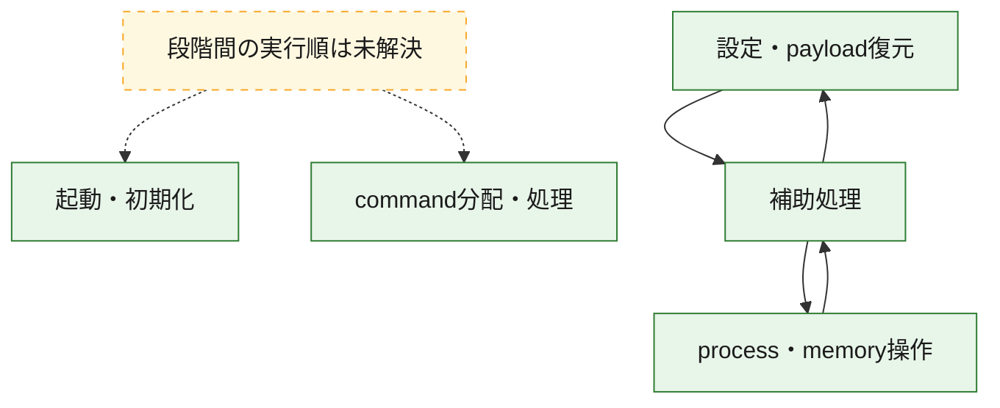
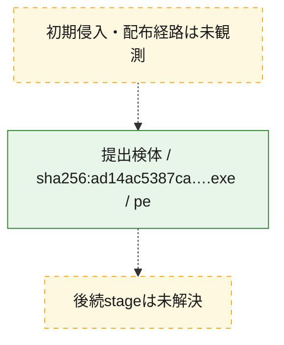
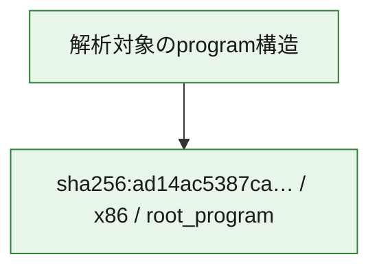

# 全体ロジック：ad14ac5387ca612b118e65562fe6c5846755c635b89362f4e616c987ecf83ec8

代表関数の静的証跡から、起動・初期化、設定・payload復元、process・memory操作、command分配・処理の処理群を確認しました。

## 読み方

- phaseの掲載順は解析上の整理順です。observed_call_edgesがない段階間の実行順を断定しません。
- 図の実線は静的に観測した関係、点線と黄色のノードは未観測・未解決の関係を示します。
- 図は静的な要約であり、動的実行を再現するものではありません。
- 詳細な関数解説とfingerprintは[STATIC-LOGIC.md](STATIC-LOGIC.md)を参照してください。

## 静的可視化

### 実行フロー

### 感染チェーン

### モジュール関係

## 処理段階

### 1. 起動・初期化

entry pointから初期化と後続処理への移行を確認します。
確度: `confirmed_static_function_evidence`

- `ad14ac5387ca612b118e65562fe6c5846755c635b89362f4e616c987ecf83ec8:ghidra:180002ce8` — 初期化と主要処理への分岐を行う入口関数です。 状態: `succeeded`、選定理由: `entry_point`, `meaningful_symbol_name`, `reviewed_call_centrality:5`, `role:entrypoint`

### 2. 設定・payload復元

設定、resource、payload、暗号化データの復元・変換を確認します。
確度: `confirmed_static_function_evidence`

- `ad14ac5387ca612b118e65562fe6c5846755c635b89362f4e616c987ecf83ec8:ghidra:1800012b0` — 暗号、hash、encoding、または復号処理に関係する関数です。 状態: `succeeded`、選定理由: `context_representative`, `reviewed_call_centrality:16`, `role:cryptographic_transform`

### 3. process・memory操作

process、thread、module、memory操作と実行移行を確認します。
確度: `confirmed_static_function_evidence`

- `ad14ac5387ca612b118e65562fe6c5846755c635b89362f4e616c987ecf83ec8:ghidra:180001988` — process、thread、module、またはmemory操作に関係する関数です。 状態: `succeeded`、選定理由: `context_representative`, `reviewed_call_centrality:16`, `role:process_or_memory_operation`
- `ad14ac5387ca612b118e65562fe6c5846755c635b89362f4e616c987ecf83ec8:ghidra:180001ca0` — process、thread、module、またはmemory操作に関係する関数です。 状態: `succeeded`、選定理由: `context_representative`, `reviewed_call_centrality:12`, `role:process_or_memory_operation`

### 4. command分配・処理

受信commandやtaskの解釈、分配、個別handlerへの移行を確認します。
確度: `confirmed_static_function_evidence_with_limits`

- `ad14ac5387ca612b118e65562fe6c5846755c635b89362f4e616c987ecf83ec8:ghidra:18000fb80` — commandの解釈、分配、または個別処理を担当する関数です。 状態: `limited_bad_instruction_or_flow`、選定理由: `meaningful_symbol_name`, `role:command_dispatch_or_handler`

### 5. 補助処理

主要処理を支える一般内部関数またはlibrary処理を確認します。
確度: `confirmed_static_function_evidence`

- `ad14ac5387ca612b118e65562fe6c5846755c635b89362f4e616c987ecf83ec8:ghidra:180001000` — 検体内部の一般処理を実装する関数です。 状態: `succeeded`、選定理由: `context_representative`, `reviewed_call_centrality:1`
- `ad14ac5387ca612b118e65562fe6c5846755c635b89362f4e616c987ecf83ec8:ghidra:180001048` — 検体内部の一般処理を実装する関数です。 状態: `succeeded`、選定理由: `context_representative`, `reviewed_call_centrality:2`
- `ad14ac5387ca612b118e65562fe6c5846755c635b89362f4e616c987ecf83ec8:ghidra:1800010c4` — 検体内部の一般処理を実装する関数です。 状態: `succeeded`、選定理由: `context_representative`, `reviewed_call_centrality:8`
- `ad14ac5387ca612b118e65562fe6c5846755c635b89362f4e616c987ecf83ec8:ghidra:1800010e4` — 検体内部の一般処理を実装する関数です。 状態: `succeeded`、選定理由: `context_representative`, `reviewed_call_centrality:1`
- `ad14ac5387ca612b118e65562fe6c5846755c635b89362f4e616c987ecf83ec8:ghidra:180001120` — 検体内部の一般処理を実装する関数です。 状態: `succeeded`、選定理由: `context_representative`, `reviewed_call_centrality:1`
- `ad14ac5387ca612b118e65562fe6c5846755c635b89362f4e616c987ecf83ec8:ghidra:18000115c` — 検体内部の一般処理を実装する関数です。 状態: `succeeded`、選定理由: `context_representative`, `reviewed_call_centrality:6`
- `ad14ac5387ca612b118e65562fe6c5846755c635b89362f4e616c987ecf83ec8:ghidra:180001170` — 検体内部の一般処理を実装する関数です。 状態: `succeeded`、選定理由: `context_representative`, `reviewed_call_centrality:6`
- `ad14ac5387ca612b118e65562fe6c5846755c635b89362f4e616c987ecf83ec8:ghidra:1800014ec` — 検体内部の一般処理を実装する関数です。 状態: `succeeded`、選定理由: `context_representative`, `reviewed_call_centrality:21`
- `ad14ac5387ca612b118e65562fe6c5846755c635b89362f4e616c987ecf83ec8:ghidra:18000190c` — 検体内部の一般処理を実装する関数です。 状態: `succeeded`、選定理由: `context_representative`, `reviewed_call_centrality:5`
- `ad14ac5387ca612b118e65562fe6c5846755c635b89362f4e616c987ecf83ec8:ghidra:180001dd0` — 検体内部の一般処理を実装する関数です。 状態: `succeeded`、選定理由: `context_representative`, `reviewed_call_centrality:5`
- `ad14ac5387ca612b118e65562fe6c5846755c635b89362f4e616c987ecf83ec8:ghidra:180001ee4` — 検体内部の一般処理を実装する関数です。 状態: `succeeded`、選定理由: `context_representative`, `reviewed_call_centrality:14`
- `ad14ac5387ca612b118e65562fe6c5846755c635b89362f4e616c987ecf83ec8:ghidra:180002044` — 検体内部の一般処理を実装する関数です。 状態: `succeeded`、選定理由: `context_representative`, `reviewed_call_centrality:7`
- `ad14ac5387ca612b118e65562fe6c5846755c635b89362f4e616c987ecf83ec8:ghidra:1800020cc` — 検体内部の一般処理を実装する関数です。 状態: `succeeded`、選定理由: `entry_point`, `meaningful_symbol_name`, `reviewed_call_centrality:17`
- `ad14ac5387ca612b118e65562fe6c5846755c635b89362f4e616c987ecf83ec8:ghidra:180002108` — 検体内部の一般処理を実装する関数です。 状態: `succeeded`、選定理由: `entry_point`, `meaningful_symbol_name`
- `ad14ac5387ca612b118e65562fe6c5846755c635b89362f4e616c987ecf83ec8:ghidra:180002114` — 検体内部の一般処理を実装する関数です。 状態: `succeeded`、選定理由: `context_representative`, `reviewed_call_centrality:4`
- `ad14ac5387ca612b118e65562fe6c5846755c635b89362f4e616c987ecf83ec8:ghidra:1800021e0` — 検体内部の一般処理を実装する関数です。 状態: `succeeded`、選定理由: `context_representative`, `reviewed_call_centrality:6`
- `ad14ac5387ca612b118e65562fe6c5846755c635b89362f4e616c987ecf83ec8:ghidra:180002254` — 検体内部の一般処理を実装する関数です。 状態: `succeeded`、選定理由: `context_representative`, `reviewed_call_centrality:6`
- `ad14ac5387ca612b118e65562fe6c5846755c635b89362f4e616c987ecf83ec8:ghidra:180002368` — 検体内部の一般処理を実装する関数です。 状態: `succeeded`、選定理由: `context_representative`, `reviewed_call_centrality:10`
- `ad14ac5387ca612b118e65562fe6c5846755c635b89362f4e616c987ecf83ec8:ghidra:180002488` — 検体内部の一般処理を実装する関数です。 状態: `succeeded`、選定理由: `context_representative`, `reviewed_call_centrality:9`
- `ad14ac5387ca612b118e65562fe6c5846755c635b89362f4e616c987ecf83ec8:ghidra:180002600` — 検体内部の一般処理を実装する関数です。 状態: `succeeded`、選定理由: `context_representative`, `reviewed_call_centrality:4`
- `ad14ac5387ca612b118e65562fe6c5846755c635b89362f4e616c987ecf83ec8:ghidra:180002620` — 検体内部の一般処理を実装する関数です。 状態: `succeeded`、選定理由: `context_representative`, `reviewed_call_centrality:10`
- `ad14ac5387ca612b118e65562fe6c5846755c635b89362f4e616c987ecf83ec8:ghidra:1800027b8` — 検体内部の一般処理を実装する関数です。 状態: `succeeded`、選定理由: `context_representative`, `reviewed_call_centrality:3`
- `ad14ac5387ca612b118e65562fe6c5846755c635b89362f4e616c987ecf83ec8:ghidra:1800027e0` — 検体内部の一般処理を実装する関数です。 状態: `succeeded`、選定理由: `context_representative`, `reviewed_call_centrality:1`
- `ad14ac5387ca612b118e65562fe6c5846755c635b89362f4e616c987ecf83ec8:ghidra:18000280c` — 検体内部の一般処理を実装する関数です。 状態: `succeeded`、選定理由: `context_representative`, `reviewed_call_centrality:9`
- `ad14ac5387ca612b118e65562fe6c5846755c635b89362f4e616c987ecf83ec8:ghidra:180002880` — 検体内部の一般処理を実装する関数です。 状態: `succeeded`、選定理由: `context_representative`, `reviewed_call_centrality:1`
- `ad14ac5387ca612b118e65562fe6c5846755c635b89362f4e616c987ecf83ec8:ghidra:1800028bc` — 検体内部の一般処理を実装する関数です。 状態: `succeeded`、選定理由: `context_representative`, `reviewed_call_centrality:1`
- `ad14ac5387ca612b118e65562fe6c5846755c635b89362f4e616c987ecf83ec8:ghidra:180002904` — 検体内部の一般処理を実装する関数です。 状態: `succeeded`、選定理由: `context_representative`, `reviewed_call_centrality:1`

## 観測したcall関係

- `ad14ac5387ca612b118e65562fe6c5846755c635b89362f4e616c987ecf83ec8:ghidra:180001170` → `ad14ac5387ca612b118e65562fe6c5846755c635b89362f4e616c987ecf83ec8:ghidra:180002368` （`support` → `support`）
- `ad14ac5387ca612b118e65562fe6c5846755c635b89362f4e616c987ecf83ec8:ghidra:180001170` → `ad14ac5387ca612b118e65562fe6c5846755c635b89362f4e616c987ecf83ec8:ghidra:180002600` （`support` → `support`）
- `ad14ac5387ca612b118e65562fe6c5846755c635b89362f4e616c987ecf83ec8:ghidra:1800012b0` → `ad14ac5387ca612b118e65562fe6c5846755c635b89362f4e616c987ecf83ec8:ghidra:180002368` （`configuration` → `support`）
- `ad14ac5387ca612b118e65562fe6c5846755c635b89362f4e616c987ecf83ec8:ghidra:1800012b0` → `ad14ac5387ca612b118e65562fe6c5846755c635b89362f4e616c987ecf83ec8:ghidra:180002600` （`configuration` → `support`）
- `ad14ac5387ca612b118e65562fe6c5846755c635b89362f4e616c987ecf83ec8:ghidra:1800014ec` → `ad14ac5387ca612b118e65562fe6c5846755c635b89362f4e616c987ecf83ec8:ghidra:1800010c4` （`support` → `support`）
- `ad14ac5387ca612b118e65562fe6c5846755c635b89362f4e616c987ecf83ec8:ghidra:1800014ec` → `ad14ac5387ca612b118e65562fe6c5846755c635b89362f4e616c987ecf83ec8:ghidra:18000115c` （`support` → `support`）
- `ad14ac5387ca612b118e65562fe6c5846755c635b89362f4e616c987ecf83ec8:ghidra:1800014ec` → `ad14ac5387ca612b118e65562fe6c5846755c635b89362f4e616c987ecf83ec8:ghidra:180002114` （`support` → `support`）
- `ad14ac5387ca612b118e65562fe6c5846755c635b89362f4e616c987ecf83ec8:ghidra:1800014ec` → `ad14ac5387ca612b118e65562fe6c5846755c635b89362f4e616c987ecf83ec8:ghidra:180002488` （`support` → `support`）
- `ad14ac5387ca612b118e65562fe6c5846755c635b89362f4e616c987ecf83ec8:ghidra:1800014ec` → `ad14ac5387ca612b118e65562fe6c5846755c635b89362f4e616c987ecf83ec8:ghidra:180002620` （`support` → `support`）
- `ad14ac5387ca612b118e65562fe6c5846755c635b89362f4e616c987ecf83ec8:ghidra:1800014ec` → `ad14ac5387ca612b118e65562fe6c5846755c635b89362f4e616c987ecf83ec8:ghidra:18000280c` （`support` → `support`）
- `ad14ac5387ca612b118e65562fe6c5846755c635b89362f4e616c987ecf83ec8:ghidra:180001988` → `ad14ac5387ca612b118e65562fe6c5846755c635b89362f4e616c987ecf83ec8:ghidra:18000115c` （`execution` → `support`）
- `ad14ac5387ca612b118e65562fe6c5846755c635b89362f4e616c987ecf83ec8:ghidra:180001988` → `ad14ac5387ca612b118e65562fe6c5846755c635b89362f4e616c987ecf83ec8:ghidra:180002114` （`execution` → `support`）
- `ad14ac5387ca612b118e65562fe6c5846755c635b89362f4e616c987ecf83ec8:ghidra:180001988` → `ad14ac5387ca612b118e65562fe6c5846755c635b89362f4e616c987ecf83ec8:ghidra:1800021e0` （`execution` → `support`）
- `ad14ac5387ca612b118e65562fe6c5846755c635b89362f4e616c987ecf83ec8:ghidra:180001988` → `ad14ac5387ca612b118e65562fe6c5846755c635b89362f4e616c987ecf83ec8:ghidra:180002254` （`execution` → `support`）
- `ad14ac5387ca612b118e65562fe6c5846755c635b89362f4e616c987ecf83ec8:ghidra:180001dd0` → `ad14ac5387ca612b118e65562fe6c5846755c635b89362f4e616c987ecf83ec8:ghidra:180001ca0` （`support` → `execution`）
- `ad14ac5387ca612b118e65562fe6c5846755c635b89362f4e616c987ecf83ec8:ghidra:180001ee4` → `ad14ac5387ca612b118e65562fe6c5846755c635b89362f4e616c987ecf83ec8:ghidra:180001170` （`support` → `support`）
- `ad14ac5387ca612b118e65562fe6c5846755c635b89362f4e616c987ecf83ec8:ghidra:180001ee4` → `ad14ac5387ca612b118e65562fe6c5846755c635b89362f4e616c987ecf83ec8:ghidra:1800012b0` （`support` → `configuration`）
- `ad14ac5387ca612b118e65562fe6c5846755c635b89362f4e616c987ecf83ec8:ghidra:180001ee4` → `ad14ac5387ca612b118e65562fe6c5846755c635b89362f4e616c987ecf83ec8:ghidra:1800014ec` （`support` → `support`）
- `ad14ac5387ca612b118e65562fe6c5846755c635b89362f4e616c987ecf83ec8:ghidra:180001ee4` → `ad14ac5387ca612b118e65562fe6c5846755c635b89362f4e616c987ecf83ec8:ghidra:18000190c` （`support` → `support`）
- `ad14ac5387ca612b118e65562fe6c5846755c635b89362f4e616c987ecf83ec8:ghidra:180001ee4` → `ad14ac5387ca612b118e65562fe6c5846755c635b89362f4e616c987ecf83ec8:ghidra:180001988` （`support` → `execution`）
- `ad14ac5387ca612b118e65562fe6c5846755c635b89362f4e616c987ecf83ec8:ghidra:180001ee4` → `ad14ac5387ca612b118e65562fe6c5846755c635b89362f4e616c987ecf83ec8:ghidra:180001dd0` （`support` → `support`）
- `ad14ac5387ca612b118e65562fe6c5846755c635b89362f4e616c987ecf83ec8:ghidra:180001ee4` → `ad14ac5387ca612b118e65562fe6c5846755c635b89362f4e616c987ecf83ec8:ghidra:1800021e0` （`support` → `support`）
- `ad14ac5387ca612b118e65562fe6c5846755c635b89362f4e616c987ecf83ec8:ghidra:1800020cc` → `ad14ac5387ca612b118e65562fe6c5846755c635b89362f4e616c987ecf83ec8:ghidra:180001170` （`support` → `support`）
- `ad14ac5387ca612b118e65562fe6c5846755c635b89362f4e616c987ecf83ec8:ghidra:1800020cc` → `ad14ac5387ca612b118e65562fe6c5846755c635b89362f4e616c987ecf83ec8:ghidra:1800012b0` （`support` → `configuration`）
- `ad14ac5387ca612b118e65562fe6c5846755c635b89362f4e616c987ecf83ec8:ghidra:1800020cc` → `ad14ac5387ca612b118e65562fe6c5846755c635b89362f4e616c987ecf83ec8:ghidra:1800014ec` （`support` → `support`）
- `ad14ac5387ca612b118e65562fe6c5846755c635b89362f4e616c987ecf83ec8:ghidra:1800020cc` → `ad14ac5387ca612b118e65562fe6c5846755c635b89362f4e616c987ecf83ec8:ghidra:18000190c` （`support` → `support`）
- `ad14ac5387ca612b118e65562fe6c5846755c635b89362f4e616c987ecf83ec8:ghidra:1800020cc` → `ad14ac5387ca612b118e65562fe6c5846755c635b89362f4e616c987ecf83ec8:ghidra:180001988` （`support` → `execution`）
- `ad14ac5387ca612b118e65562fe6c5846755c635b89362f4e616c987ecf83ec8:ghidra:1800020cc` → `ad14ac5387ca612b118e65562fe6c5846755c635b89362f4e616c987ecf83ec8:ghidra:180001dd0` （`support` → `support`）
- `ad14ac5387ca612b118e65562fe6c5846755c635b89362f4e616c987ecf83ec8:ghidra:1800020cc` → `ad14ac5387ca612b118e65562fe6c5846755c635b89362f4e616c987ecf83ec8:ghidra:180002044` （`support` → `support`）
- `ad14ac5387ca612b118e65562fe6c5846755c635b89362f4e616c987ecf83ec8:ghidra:1800020cc` → `ad14ac5387ca612b118e65562fe6c5846755c635b89362f4e616c987ecf83ec8:ghidra:1800021e0` （`support` → `support`）
- `ad14ac5387ca612b118e65562fe6c5846755c635b89362f4e616c987ecf83ec8:ghidra:180002114` → `ad14ac5387ca612b118e65562fe6c5846755c635b89362f4e616c987ecf83ec8:ghidra:180002620` （`support` → `support`）
- `ad14ac5387ca612b118e65562fe6c5846755c635b89362f4e616c987ecf83ec8:ghidra:180002254` → `ad14ac5387ca612b118e65562fe6c5846755c635b89362f4e616c987ecf83ec8:ghidra:1800010c4` （`support` → `support`）
- `ad14ac5387ca612b118e65562fe6c5846755c635b89362f4e616c987ecf83ec8:ghidra:180002254` → `ad14ac5387ca612b118e65562fe6c5846755c635b89362f4e616c987ecf83ec8:ghidra:18000280c` （`support` → `support`）
- `ad14ac5387ca612b118e65562fe6c5846755c635b89362f4e616c987ecf83ec8:ghidra:180002368` → `ad14ac5387ca612b118e65562fe6c5846755c635b89362f4e616c987ecf83ec8:ghidra:180002600` （`support` → `support`）
- `ad14ac5387ca612b118e65562fe6c5846755c635b89362f4e616c987ecf83ec8:ghidra:180002368` → `ad14ac5387ca612b118e65562fe6c5846755c635b89362f4e616c987ecf83ec8:ghidra:1800027b8` （`support` → `support`）
- `ad14ac5387ca612b118e65562fe6c5846755c635b89362f4e616c987ecf83ec8:ghidra:180002368` → `ad14ac5387ca612b118e65562fe6c5846755c635b89362f4e616c987ecf83ec8:ghidra:18000280c` （`support` → `support`）
- `ad14ac5387ca612b118e65562fe6c5846755c635b89362f4e616c987ecf83ec8:ghidra:180002488` → `ad14ac5387ca612b118e65562fe6c5846755c635b89362f4e616c987ecf83ec8:ghidra:1800010c4` （`support` → `support`）
- `ad14ac5387ca612b118e65562fe6c5846755c635b89362f4e616c987ecf83ec8:ghidra:180002488` → `ad14ac5387ca612b118e65562fe6c5846755c635b89362f4e616c987ecf83ec8:ghidra:18000115c` （`support` → `support`）
- `ad14ac5387ca612b118e65562fe6c5846755c635b89362f4e616c987ecf83ec8:ghidra:180002488` → `ad14ac5387ca612b118e65562fe6c5846755c635b89362f4e616c987ecf83ec8:ghidra:18000280c` （`support` → `support`）
- `ad14ac5387ca612b118e65562fe6c5846755c635b89362f4e616c987ecf83ec8:ghidra:180002620` → `ad14ac5387ca612b118e65562fe6c5846755c635b89362f4e616c987ecf83ec8:ghidra:1800010c4` （`support` → `support`）
- `ad14ac5387ca612b118e65562fe6c5846755c635b89362f4e616c987ecf83ec8:ghidra:180002620` → `ad14ac5387ca612b118e65562fe6c5846755c635b89362f4e616c987ecf83ec8:ghidra:18000115c` （`support` → `support`）
- `ad14ac5387ca612b118e65562fe6c5846755c635b89362f4e616c987ecf83ec8:ghidra:180002620` → `ad14ac5387ca612b118e65562fe6c5846755c635b89362f4e616c987ecf83ec8:ghidra:18000280c` （`support` → `support`）
- `ad14ac5387ca612b118e65562fe6c5846755c635b89362f4e616c987ecf83ec8:ghidra:18000280c` → `ad14ac5387ca612b118e65562fe6c5846755c635b89362f4e616c987ecf83ec8:ghidra:1800010c4` （`support` → `support`）
- `ghidra-function:031b668af9a633d098a13e28` → `ghidra-external:73dfeb49c2602d334979aa92` （`unclassified` → `unclassified`）
- `ghidra-function:031b668af9a633d098a13e28` → `ghidra-external:ec9cedb6a43ab94f98ad9e9f` （`unclassified` → `unclassified`）
- `ghidra-function:031b668af9a633d098a13e28` → `ghidra-function:6670a91efa2523fe3c524383` （`unclassified` → `unclassified`）
- `ghidra-function:031b668af9a633d098a13e28` → `ghidra-function:6ed813ac51ca0a0b14ffe2a7` （`unclassified` → `unclassified`）
- `ghidra-function:031b668af9a633d098a13e28` → `ghidra-function:8edf774136bcfd1a27c58b42` （`unclassified` → `unclassified`）
- `ghidra-function:031b668af9a633d098a13e28` → `ghidra-function:a467fa196959f6539430a45e` （`unclassified` → `unclassified`）
- `ghidra-function:031b668af9a633d098a13e28` → `ghidra-function:a9ff232ccfb6cbab8dbac299` （`unclassified` → `unclassified`）
- `ghidra-function:031b668af9a633d098a13e28` → `ghidra-function:fa90e4b1eeb5819b4bec4c3a` （`unclassified` → `unclassified`）
- `ghidra-function:2d2fa6da36a4c48e7bd232db` → `ghidra-function:0e8447200e7968f8c437691c` （`unclassified` → `unclassified`）
- `ghidra-function:2d2fa6da36a4c48e7bd232db` → `ghidra-function:47137bf4a309b951f7286b3c` （`unclassified` → `unclassified`）
- `ghidra-function:2d2fa6da36a4c48e7bd232db` → `ghidra-function:64637897b82d3459eee87fbc` （`unclassified` → `unclassified`）
- `ghidra-function:2d2fa6da36a4c48e7bd232db` → `ghidra-function:86b758d2bbf112ff22e63abf` （`unclassified` → `unclassified`）
- `ghidra-function:2d2fa6da36a4c48e7bd232db` → `ghidra-function:9ca1e56877c36066b1f55041` （`unclassified` → `unclassified`）
- `ghidra-function:2d2fa6da36a4c48e7bd232db` → `ghidra-function:e0ec14b1112cb91e2985353c` （`unclassified` → `unclassified`）
- `ghidra-function:321cde593bff21e144cde379` → `ghidra-function:f7ea1815c04c4b81906fe268` （`unclassified` → `unclassified`）
- `ghidra-function:3e032bcd5d409cfcef0b14bd` → `ghidra-function:36f693598c4343d9e4b21b44` （`unclassified` → `unclassified`）
- `ghidra-function:3e032bcd5d409cfcef0b14bd` → `ghidra-function:3a2f16c50d7f1f48771a8bc4` （`unclassified` → `unclassified`）
- `ghidra-function:3e032bcd5d409cfcef0b14bd` → `ghidra-function:7886e719cb703aa503772c0b` （`unclassified` → `unclassified`）
- `ghidra-function:3e032bcd5d409cfcef0b14bd` → `ghidra-function:959e9cbe3c3cb1e363bf3437` （`unclassified` → `unclassified`）
- `ghidra-function:3e032bcd5d409cfcef0b14bd` → `ghidra-function:968451f838bf455d7d362578` （`unclassified` → `unclassified`）
- `ghidra-function:3e032bcd5d409cfcef0b14bd` → `ghidra-function:a36c3b2c903862a84adcb8cf` （`unclassified` → `unclassified`）
- `ghidra-function:3e032bcd5d409cfcef0b14bd` → `ghidra-function:c196a206b5020733e6e9429f` （`unclassified` → `unclassified`）
- `ghidra-function:3e032bcd5d409cfcef0b14bd` → `ghidra-function:dd30fdfc9458f3c4de579705` （`unclassified` → `unclassified`）
- `ghidra-function:4270e4d6e0cb1e936f8d7fbf` → `ghidra-function:fa90e4b1eeb5819b4bec4c3a` （`unclassified` → `unclassified`）
- `ghidra-function:4ec64cc289dfbd8af21f892a` → `ghidra-external:2890527ac51bcedc129d5df9` （`unclassified` → `unclassified`）
- `ghidra-function:4ec64cc289dfbd8af21f892a` → `ghidra-external:73dfeb49c2602d334979aa92` （`unclassified` → `unclassified`）
- `ghidra-function:4ec64cc289dfbd8af21f892a` → `ghidra-external:76758f8a45ef3293c784c0a8` （`unclassified` → `unclassified`）
- `ghidra-function:4ec64cc289dfbd8af21f892a` → `ghidra-external:ec9cedb6a43ab94f98ad9e9f` （`unclassified` → `unclassified`）
- `ghidra-function:4ec64cc289dfbd8af21f892a` → `ghidra-function:031b668af9a633d098a13e28` （`unclassified` → `unclassified`）
- `ghidra-function:4ec64cc289dfbd8af21f892a` → `ghidra-function:5e199c223f4713ab9384fac1` （`unclassified` → `unclassified`）
- `ghidra-function:4ec64cc289dfbd8af21f892a` → `ghidra-function:6670a91efa2523fe3c524383` （`unclassified` → `unclassified`）
- `ghidra-function:4ec64cc289dfbd8af21f892a` → `ghidra-function:6ed813ac51ca0a0b14ffe2a7` （`unclassified` → `unclassified`）
- `ghidra-function:4ec64cc289dfbd8af21f892a` → `ghidra-function:78548b3f7a0b994413578b84` （`unclassified` → `unclassified`）
- `ghidra-function:4ec64cc289dfbd8af21f892a` → `ghidra-function:8edf774136bcfd1a27c58b42` （`unclassified` → `unclassified`）
- `ghidra-function:4ec64cc289dfbd8af21f892a` → `ghidra-function:98f39a256607d3eb4441b709` （`unclassified` → `unclassified`）
- `ghidra-function:4ec64cc289dfbd8af21f892a` → `ghidra-function:a467fa196959f6539430a45e` （`unclassified` → `unclassified`）
- `ghidra-function:4ec64cc289dfbd8af21f892a` → `ghidra-function:a9ff232ccfb6cbab8dbac299` （`unclassified` → `unclassified`）
- `ghidra-function:4ec64cc289dfbd8af21f892a` → `ghidra-function:cab955e8adc8fb6778e704ba` （`unclassified` → `unclassified`）
- `ghidra-function:4ec64cc289dfbd8af21f892a` → `ghidra-function:df0d0d8c31a054233b3ed1d4` （`unclassified` → `unclassified`）
- `ghidra-function:4ec64cc289dfbd8af21f892a` → `ghidra-function:fa90e4b1eeb5819b4bec4c3a` （`unclassified` → `unclassified`）
- `ghidra-function:4ec64cc289dfbd8af21f892a` → `ghidra-function:fefa101c4bbdb50e6c3d81a0` （`unclassified` → `unclassified`）
- `ghidra-function:54ffa961726cdd2d1db74dff` → `ghidra-external:73dfeb49c2602d334979aa92` （`unclassified` → `unclassified`）
- `ghidra-function:54ffa961726cdd2d1db74dff` → `ghidra-external:ec9cedb6a43ab94f98ad9e9f` （`unclassified` → `unclassified`）
- `ghidra-function:54ffa961726cdd2d1db74dff` → `ghidra-function:a9ff232ccfb6cbab8dbac299` （`unclassified` → `unclassified`）
- `ghidra-function:5a0a43acef94111b764520f1` → `ghidra-function:0da4ae5b10700222890c3fa3` （`unclassified` → `unclassified`）
- `ghidra-function:5a0a43acef94111b764520f1` → `ghidra-function:356164e0b9458adcf62dd0d9` （`unclassified` → `unclassified`）
- `ghidra-function:5a0a43acef94111b764520f1` → `ghidra-function:ea164ae9ba70987c27cb9ad3` （`unclassified` → `unclassified`）
- `ghidra-function:5cc83f2234ee57d562b7ce15` → `ghidra-function:f7ea1815c04c4b81906fe268` （`unclassified` → `unclassified`）
- `ghidra-function:634fd15b3e034cec80faff6a` → `ghidra-external:25020dc1fa431beadfa43fec` （`unclassified` → `unclassified`）
- `ghidra-function:634fd15b3e034cec80faff6a` → `ghidra-external:71ac3295b96fb4323e2854b2` （`unclassified` → `unclassified`）
- `ghidra-function:634fd15b3e034cec80faff6a` → `ghidra-external:73dfeb49c2602d334979aa92` （`unclassified` → `unclassified`）
- `ghidra-function:634fd15b3e034cec80faff6a` → `ghidra-external:ec9cedb6a43ab94f98ad9e9f` （`unclassified` → `unclassified`）
- `ghidra-function:634fd15b3e034cec80faff6a` → `ghidra-function:060415da775fd0b4c584b1cd` （`unclassified` → `unclassified`）
- `ghidra-function:634fd15b3e034cec80faff6a` → `ghidra-function:54ffa961726cdd2d1db74dff` （`unclassified` → `unclassified`）
- `ghidra-function:634fd15b3e034cec80faff6a` → `ghidra-function:64637897b82d3459eee87fbc` （`unclassified` → `unclassified`）
- `ghidra-function:634fd15b3e034cec80faff6a` → `ghidra-function:6670a91efa2523fe3c524383` （`unclassified` → `unclassified`）
- `ghidra-function:634fd15b3e034cec80faff6a` → `ghidra-function:78548b3f7a0b994413578b84` （`unclassified` → `unclassified`）
- `ghidra-function:634fd15b3e034cec80faff6a` → `ghidra-function:a9ff232ccfb6cbab8dbac299` （`unclassified` → `unclassified`）
- `ghidra-function:634fd15b3e034cec80faff6a` → `ghidra-function:c6f70652dbf99b435ad311f6` （`unclassified` → `unclassified`）
- `ghidra-function:634fd15b3e034cec80faff6a` → `ghidra-function:e0ec14b1112cb91e2985353c` （`unclassified` → `unclassified`）
- `ghidra-function:6670a91efa2523fe3c524383` → `ghidra-external:ec9cedb6a43ab94f98ad9e9f` （`unclassified` → `unclassified`）
- `ghidra-function:6670a91efa2523fe3c524383` → `ghidra-function:39af48fd31da7e51ad1056e9` （`unclassified` → `unclassified`）
- `ghidra-function:6bde18a2f7f8cf429f3cf6d1` → `ghidra-function:f7ea1815c04c4b81906fe268` （`unclassified` → `unclassified`）
- `ghidra-function:78548b3f7a0b994413578b84` → `ghidra-function:fa90e4b1eeb5819b4bec4c3a` （`unclassified` → `unclassified`）
- `ghidra-function:78548b3f7a0b994413578b84` → `ghidra-function:fefa101c4bbdb50e6c3d81a0` （`unclassified` → `unclassified`）
- `ghidra-function:7c4874d987739892ee97e6cb` → `ghidra-function:1f4b4388b915dca622455989` （`unclassified` → `unclassified`）
- `ghidra-function:7c4874d987739892ee97e6cb` → `ghidra-function:564c2b9cc2b95a978e33f614` （`unclassified` → `unclassified`）
- `ghidra-function:7c4874d987739892ee97e6cb` → `ghidra-function:d732eb8b3c13d619e46794ef` （`unclassified` → `unclassified`）
- `ghidra-function:89ed9ce899331ff824fdb714` → `ghidra-function:f7ea1815c04c4b81906fe268` （`unclassified` → `unclassified`）
- `ghidra-function:8edf774136bcfd1a27c58b42` → `ghidra-external:ec9cedb6a43ab94f98ad9e9f` （`unclassified` → `unclassified`）
- `ghidra-function:8edf774136bcfd1a27c58b42` → `ghidra-function:6ed813ac51ca0a0b14ffe2a7` （`unclassified` → `unclassified`）
- `ghidra-function:8edf774136bcfd1a27c58b42` → `ghidra-function:a467fa196959f6539430a45e` （`unclassified` → `unclassified`）
- `ghidra-function:8edf774136bcfd1a27c58b42` → `ghidra-function:a9ff232ccfb6cbab8dbac299` （`unclassified` → `unclassified`）
- `ghidra-function:8eec4154545f820cb9678f52` → `ghidra-external:ec9cedb6a43ab94f98ad9e9f` （`unclassified` → `unclassified`）
- `ghidra-function:8eec4154545f820cb9678f52` → `ghidra-function:39af48fd31da7e51ad1056e9` （`unclassified` → `unclassified`）
- `ghidra-function:a36c3b2c903862a84adcb8cf` → `ghidra-external:73dfeb49c2602d334979aa92` （`unclassified` → `unclassified`）
- `ghidra-function:a36c3b2c903862a84adcb8cf` → `ghidra-external:8e72559dedacf5c873c73e2b` （`unclassified` → `unclassified`）
- `ghidra-function:a36c3b2c903862a84adcb8cf` → `ghidra-external:ec9cedb6a43ab94f98ad9e9f` （`unclassified` → `unclassified`）
- `ghidra-function:a36c3b2c903862a84adcb8cf` → `ghidra-function:6ed813ac51ca0a0b14ffe2a7` （`unclassified` → `unclassified`）
- `ghidra-function:a36c3b2c903862a84adcb8cf` → `ghidra-function:8edf774136bcfd1a27c58b42` （`unclassified` → `unclassified`）
- `ghidra-function:a36c3b2c903862a84adcb8cf` → `ghidra-function:8eec4154545f820cb9678f52` （`unclassified` → `unclassified`）
- `ghidra-function:a36c3b2c903862a84adcb8cf` → `ghidra-function:a9ff232ccfb6cbab8dbac299` （`unclassified` → `unclassified`）
- `ghidra-function:a36c3b2c903862a84adcb8cf` → `ghidra-function:c196a206b5020733e6e9429f` （`unclassified` → `unclassified`）
- `ghidra-function:a467fa196959f6539430a45e` → `ghidra-external:15d504f162f1055cb6d5a643` （`unclassified` → `unclassified`）
- `ghidra-function:a467fa196959f6539430a45e` → `ghidra-external:ec9cedb6a43ab94f98ad9e9f` （`unclassified` → `unclassified`）
- `ghidra-function:a467fa196959f6539430a45e` → `ghidra-function:6995eb3a617c7188f671a4dc` （`unclassified` → `unclassified`）
- `ghidra-function:b2d84bc108ed72c392c04d3b` → `ghidra-external:73dfeb49c2602d334979aa92` （`unclassified` → `unclassified`）
- `ghidra-function:b2d84bc108ed72c392c04d3b` → `ghidra-external:ec9cedb6a43ab94f98ad9e9f` （`unclassified` → `unclassified`）
- `ghidra-function:b2d84bc108ed72c392c04d3b` → `ghidra-function:1223a362a38cc34be4cf4a9a` （`unclassified` → `unclassified`）
- `ghidra-function:b2d84bc108ed72c392c04d3b` → `ghidra-function:3e032bcd5d409cfcef0b14bd` （`unclassified` → `unclassified`）
- `ghidra-function:b2d84bc108ed72c392c04d3b` → `ghidra-function:4ec64cc289dfbd8af21f892a` （`unclassified` → `unclassified`）
- `ghidra-function:b2d84bc108ed72c392c04d3b` → `ghidra-function:54ffa961726cdd2d1db74dff` （`unclassified` → `unclassified`）
- `ghidra-function:b2d84bc108ed72c392c04d3b` → `ghidra-function:634fd15b3e034cec80faff6a` （`unclassified` → `unclassified`）
- `ghidra-function:b2d84bc108ed72c392c04d3b` → `ghidra-function:7c4874d987739892ee97e6cb` （`unclassified` → `unclassified`）
- `ghidra-function:b2d84bc108ed72c392c04d3b` → `ghidra-function:a9ff232ccfb6cbab8dbac299` （`unclassified` → `unclassified`）
- `ghidra-function:b2d84bc108ed72c392c04d3b` → `ghidra-function:d304cbdaa8ab271012115cd1` （`unclassified` → `unclassified`）
- `ghidra-function:b2d84bc108ed72c392c04d3b` → `ghidra-function:d8f81bc5be5ad72c1192c0e2` （`unclassified` → `unclassified`）
- `ghidra-function:b2d84bc108ed72c392c04d3b` → `ghidra-function:e9927e4727dbe5e699155cc4` （`unclassified` → `unclassified`）
- `ghidra-function:b9cd60e94b659e36587e82bb` → `ghidra-external:3024bf1a7cba66eb7a15e741` （`unclassified` → `unclassified`）
- `ghidra-function:b9cd60e94b659e36587e82bb` → `ghidra-external:306630af6e6e4ae9993d6a7d` （`unclassified` → `unclassified`）
- `ghidra-function:b9cd60e94b659e36587e82bb` → `ghidra-function:a11b7bff85d4e1a5ec5fb16f` （`unclassified` → `unclassified`）
- `ghidra-function:b9cd60e94b659e36587e82bb` → `ghidra-function:e28894f6009aa07607c2ee10` （`unclassified` → `unclassified`）
- `ghidra-function:b9cd60e94b659e36587e82bb` → `ghidra-function:f6f240689ac558ed37ac0f14` （`unclassified` → `unclassified`）
- `ghidra-function:bef9f9bde6aaa4dd1d192692` → `ghidra-external:73dfeb49c2602d334979aa92` （`unclassified` → `unclassified`）
- `ghidra-function:bef9f9bde6aaa4dd1d192692` → `ghidra-function:a52bdfd6f0593ff7080c4ad5` （`unclassified` → `unclassified`）
- `ghidra-function:c006d02fd495c73b47e63a9d` → `ghidra-function:f7ea1815c04c4b81906fe268` （`unclassified` → `unclassified`）
- `ghidra-function:c196a206b5020733e6e9429f` → `ghidra-function:64637897b82d3459eee87fbc` （`unclassified` → `unclassified`）
- `ghidra-function:c6f70652dbf99b435ad311f6` → `ghidra-external:ec9cedb6a43ab94f98ad9e9f` （`unclassified` → `unclassified`）
- `ghidra-function:c6f70652dbf99b435ad311f6` → `ghidra-function:6ed813ac51ca0a0b14ffe2a7` （`unclassified` → `unclassified`）
- `ghidra-function:c6f70652dbf99b435ad311f6` → `ghidra-function:8edf774136bcfd1a27c58b42` （`unclassified` → `unclassified`）
- `ghidra-function:c6f70652dbf99b435ad311f6` → `ghidra-function:a467fa196959f6539430a45e` （`unclassified` → `unclassified`）
- `ghidra-function:c6f70652dbf99b435ad311f6` → `ghidra-function:fa90e4b1eeb5819b4bec4c3a` （`unclassified` → `unclassified`）
- `ghidra-function:c772a10d14cdd3f2ba2f1340` → `ghidra-external:73dfeb49c2602d334979aa92` （`unclassified` → `unclassified`）
- `ghidra-function:c772a10d14cdd3f2ba2f1340` → `ghidra-external:ec9cedb6a43ab94f98ad9e9f` （`unclassified` → `unclassified`）
- `ghidra-function:c772a10d14cdd3f2ba2f1340` → `ghidra-function:1223a362a38cc34be4cf4a9a` （`unclassified` → `unclassified`）
- `ghidra-function:c772a10d14cdd3f2ba2f1340` → `ghidra-function:3e032bcd5d409cfcef0b14bd` （`unclassified` → `unclassified`）
- `ghidra-function:c772a10d14cdd3f2ba2f1340` → `ghidra-function:425f4cc7cdcd50e35b677442` （`unclassified` → `unclassified`）
- `ghidra-function:c772a10d14cdd3f2ba2f1340` → `ghidra-function:4ec64cc289dfbd8af21f892a` （`unclassified` → `unclassified`）
- `ghidra-function:c772a10d14cdd3f2ba2f1340` → `ghidra-function:54ffa961726cdd2d1db74dff` （`unclassified` → `unclassified`）
- `ghidra-function:c772a10d14cdd3f2ba2f1340` → `ghidra-function:5a0a43acef94111b764520f1` （`unclassified` → `unclassified`）
- `ghidra-function:c772a10d14cdd3f2ba2f1340` → `ghidra-function:634fd15b3e034cec80faff6a` （`unclassified` → `unclassified`）
- `ghidra-function:c772a10d14cdd3f2ba2f1340` → `ghidra-function:7c4874d987739892ee97e6cb` （`unclassified` → `unclassified`）
- `ghidra-function:c772a10d14cdd3f2ba2f1340` → `ghidra-function:a9ff232ccfb6cbab8dbac299` （`unclassified` → `unclassified`）
- `ghidra-function:c772a10d14cdd3f2ba2f1340` → `ghidra-function:d304cbdaa8ab271012115cd1` （`unclassified` → `unclassified`）
- `ghidra-function:c772a10d14cdd3f2ba2f1340` → `ghidra-function:d8f81bc5be5ad72c1192c0e2` （`unclassified` → `unclassified`）
- `ghidra-function:c772a10d14cdd3f2ba2f1340` → `ghidra-function:e9927e4727dbe5e699155cc4` （`unclassified` → `unclassified`）
- `ghidra-function:d8f81bc5be5ad72c1192c0e2` → `ghidra-function:a36c3b2c903862a84adcb8cf` （`unclassified` → `unclassified`）
- `ghidra-function:d8f81bc5be5ad72c1192c0e2` → `ghidra-function:b09eb1880743dac8fc154350` （`unclassified` → `unclassified`）
- `ghidra-function:d8f81bc5be5ad72c1192c0e2` → `ghidra-function:c196a206b5020733e6e9429f` （`unclassified` → `unclassified`）
- `ghidra-function:ddc0b5af1bca828b6fa48ae7` → `ghidra-function:f7ea1815c04c4b81906fe268` （`unclassified` → `unclassified`）
- `ghidra-function:e9927e4727dbe5e699155cc4` → `ghidra-function:2d2fa6da36a4c48e7bd232db` （`unclassified` → `unclassified`）
- `ghidra-function:e9927e4727dbe5e699155cc4` → `ghidra-function:86b758d2bbf112ff22e63abf` （`unclassified` → `unclassified`）
- `ghidra-function:fefa101c4bbdb50e6c3d81a0` → `ghidra-external:73dfeb49c2602d334979aa92` （`unclassified` → `unclassified`）
- `ghidra-function:fefa101c4bbdb50e6c3d81a0` → `ghidra-external:ec9cedb6a43ab94f98ad9e9f` （`unclassified` → `unclassified`）
- `ghidra-function:fefa101c4bbdb50e6c3d81a0` → `ghidra-function:6670a91efa2523fe3c524383` （`unclassified` → `unclassified`）
- `ghidra-function:fefa101c4bbdb50e6c3d81a0` → `ghidra-function:6ed813ac51ca0a0b14ffe2a7` （`unclassified` → `unclassified`）
- `ghidra-function:fefa101c4bbdb50e6c3d81a0` → `ghidra-function:8edf774136bcfd1a27c58b42` （`unclassified` → `unclassified`）
- `ghidra-function:fefa101c4bbdb50e6c3d81a0` → `ghidra-function:a467fa196959f6539430a45e` （`unclassified` → `unclassified`）
- `ghidra-function:fefa101c4bbdb50e6c3d81a0` → `ghidra-function:a9ff232ccfb6cbab8dbac299` （`unclassified` → `unclassified`）
- `ghidra-function:fefa101c4bbdb50e6c3d81a0` → `ghidra-function:fa90e4b1eeb5819b4bec4c3a` （`unclassified` → `unclassified`）

## 解析範囲と制約

- 選定外関数は全体inventoryへ残しますが、関数本体の個別解説対象にはしていません。
- indirect call、難読化、packer、VM、壊れたcontrol flowによりcall関係が欠落する場合があります。
- 文書は静的解析に基づき、検体実行や外部通信による動的確認は行っていません。
