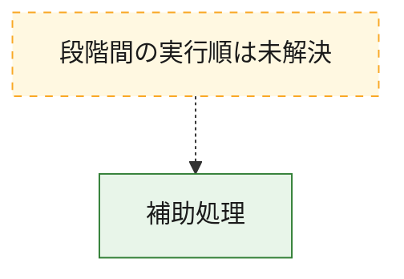
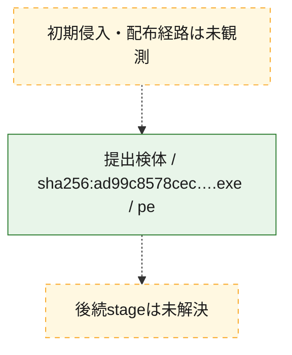
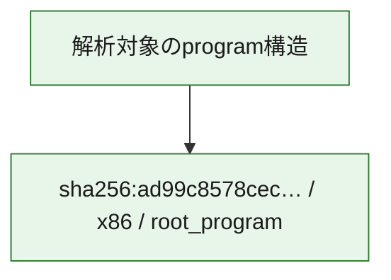

# 全体ロジック：ad99c8578cecc2b567ce3a5606ec30ff9b94b4bff3820fda262d5a098108ee2c

代表関数から主要なmalware処理段階を自動分類できませんでした。

## 読み方

- phaseの掲載順は解析上の整理順です。observed_call_edgesがない段階間の実行順を断定しません。
- 図の実線は静的に観測した関係、点線と黄色のノードは未観測・未解決の関係を示します。
- 図は静的な要約であり、動的実行を再現するものではありません。
- 詳細な関数解説とfingerprintは[STATIC-LOGIC.md](STATIC-LOGIC.md)を参照してください。

## 静的可視化

### 実行フロー

### 感染チェーン

### モジュール関係

## 処理段階

### 1. 補助処理

主要処理を支える一般内部関数またはlibrary処理を確認します。
確度: `confirmed_static_function_evidence_with_limits`

- `ad99c8578cecc2b567ce3a5606ec30ff9b94b4bff3820fda262d5a098108ee2c:ghidra:1400013c8` — 検体内部の一般処理を実装する関数です。 状態: `limited_bad_instruction_or_flow`、選定理由: `context_representative`, `reviewed_call_centrality:1`
- `ad99c8578cecc2b567ce3a5606ec30ff9b94b4bff3820fda262d5a098108ee2c:ghidra:140001578` — 検体内部の一般処理を実装する関数です。 状態: `limited_bad_instruction_or_flow`、選定理由: `context_representative`, `reviewed_call_centrality:1`
- `ad99c8578cecc2b567ce3a5606ec30ff9b94b4bff3820fda262d5a098108ee2c:ghidra:140001664` — 検体内部の一般処理を実装する関数です。 状態: `limited_bad_instruction_or_flow`、選定理由: `context_representative`, `reviewed_call_centrality:1`
- `ad99c8578cecc2b567ce3a5606ec30ff9b94b4bff3820fda262d5a098108ee2c:ghidra:1400018a8` — 検体内部の一般処理を実装する関数です。 状態: `limited_bad_instruction_or_flow`、選定理由: `context_representative`, `reviewed_call_centrality:1`
- `ad99c8578cecc2b567ce3a5606ec30ff9b94b4bff3820fda262d5a098108ee2c:ghidra:140001a8c` — 検体内部の一般処理を実装する関数です。 状態: `limited_bad_instruction_or_flow`、選定理由: `context_representative`, `reviewed_call_centrality:1`
- `ad99c8578cecc2b567ce3a5606ec30ff9b94b4bff3820fda262d5a098108ee2c:ghidra:1400021a0` — 検体内部の一般処理を実装する関数です。 状態: `limited_bad_instruction_or_flow`、選定理由: `context_representative`, `reviewed_call_centrality:1`
- `ad99c8578cecc2b567ce3a5606ec30ff9b94b4bff3820fda262d5a098108ee2c:ghidra:140002700` — 検体内部の一般処理を実装する関数です。 状態: `limited_bad_instruction_or_flow`、選定理由: `context_representative`, `reviewed_call_centrality:1`
- `ad99c8578cecc2b567ce3a5606ec30ff9b94b4bff3820fda262d5a098108ee2c:ghidra:140002a64` — 検体内部の一般処理を実装する関数です。 状態: `limited_bad_instruction_or_flow`、選定理由: `context_representative`, `reviewed_call_centrality:1`
- `ad99c8578cecc2b567ce3a5606ec30ff9b94b4bff3820fda262d5a098108ee2c:ghidra:140002b1c` — 検体内部の一般処理を実装する関数です。 状態: `limited_bad_instruction_or_flow`、選定理由: `context_representative`, `reviewed_call_centrality:1`
- `ad99c8578cecc2b567ce3a5606ec30ff9b94b4bff3820fda262d5a098108ee2c:ghidra:140002d38` — 検体内部の一般処理を実装する関数です。 状態: `limited_bad_instruction_or_flow`、選定理由: `context_representative`, `reviewed_call_centrality:1`
- `ad99c8578cecc2b567ce3a5606ec30ff9b94b4bff3820fda262d5a098108ee2c:ghidra:140002ec4` — 検体内部の一般処理を実装する関数です。 状態: `limited_bad_instruction_or_flow`、選定理由: `context_representative`, `reviewed_call_centrality:1`
- `ad99c8578cecc2b567ce3a5606ec30ff9b94b4bff3820fda262d5a098108ee2c:ghidra:1400030ac` — 検体内部の一般処理を実装する関数です。 状態: `limited_bad_instruction_or_flow`、選定理由: `context_representative`, `reviewed_call_centrality:1`
- `ad99c8578cecc2b567ce3a5606ec30ff9b94b4bff3820fda262d5a098108ee2c:ghidra:140003258` — 検体内部の一般処理を実装する関数です。 状態: `limited_bad_instruction_or_flow`、選定理由: `context_representative`, `reviewed_call_centrality:1`
- `ad99c8578cecc2b567ce3a5606ec30ff9b94b4bff3820fda262d5a098108ee2c:ghidra:1400038b0` — 検体内部の一般処理を実装する関数です。 状態: `limited_bad_instruction_or_flow`、選定理由: `context_representative`, `reviewed_call_centrality:1`
- `ad99c8578cecc2b567ce3a5606ec30ff9b94b4bff3820fda262d5a098108ee2c:ghidra:140003944` — 検体内部の一般処理を実装する関数です。 状態: `limited_bad_instruction_or_flow`、選定理由: `context_representative`, `reviewed_call_centrality:1`
- `ad99c8578cecc2b567ce3a5606ec30ff9b94b4bff3820fda262d5a098108ee2c:ghidra:1400039a0` — 検体内部の一般処理を実装する関数です。 状態: `limited_bad_instruction_or_flow`、選定理由: `context_representative`, `reviewed_call_centrality:1`
- `ad99c8578cecc2b567ce3a5606ec30ff9b94b4bff3820fda262d5a098108ee2c:ghidra:140003a84` — 検体内部の一般処理を実装する関数です。 状態: `limited_bad_instruction_or_flow`、選定理由: `context_representative`, `reviewed_call_centrality:1`
- `ad99c8578cecc2b567ce3a5606ec30ff9b94b4bff3820fda262d5a098108ee2c:ghidra:140003b0c` — 検体内部の一般処理を実装する関数です。 状態: `limited_bad_instruction_or_flow`、選定理由: `context_representative`, `reviewed_call_centrality:1`
- `ad99c8578cecc2b567ce3a5606ec30ff9b94b4bff3820fda262d5a098108ee2c:ghidra:140003b84` — 検体内部の一般処理を実装する関数です。 状態: `limited_bad_instruction_or_flow`、選定理由: `context_representative`, `reviewed_call_centrality:1`
- `ad99c8578cecc2b567ce3a5606ec30ff9b94b4bff3820fda262d5a098108ee2c:ghidra:140003c14` — 検体内部の一般処理を実装する関数です。 状態: `limited_bad_instruction_or_flow`、選定理由: `context_representative`, `reviewed_call_centrality:1`
- `ad99c8578cecc2b567ce3a5606ec30ff9b94b4bff3820fda262d5a098108ee2c:ghidra:140003ca4` — 検体内部の一般処理を実装する関数です。 状態: `limited_bad_instruction_or_flow`、選定理由: `context_representative`, `reviewed_call_centrality:1`
- `ad99c8578cecc2b567ce3a5606ec30ff9b94b4bff3820fda262d5a098108ee2c:ghidra:140003e28` — 検体内部の一般処理を実装する関数です。 状態: `limited_bad_instruction_or_flow`、選定理由: `context_representative`, `reviewed_call_centrality:1`
- `ad99c8578cecc2b567ce3a5606ec30ff9b94b4bff3820fda262d5a098108ee2c:ghidra:140004020` — 検体内部の一般処理を実装する関数です。 状態: `limited_bad_instruction_or_flow`、選定理由: `context_representative`, `reviewed_call_centrality:1`
- `ad99c8578cecc2b567ce3a5606ec30ff9b94b4bff3820fda262d5a098108ee2c:ghidra:14000453c` — 検体内部の一般処理を実装する関数です。 状態: `limited_bad_instruction_or_flow`、選定理由: `context_representative`, `reviewed_call_centrality:1`
- `ad99c8578cecc2b567ce3a5606ec30ff9b94b4bff3820fda262d5a098108ee2c:ghidra:1400047f0` — 検体内部の一般処理を実装する関数です。 状態: `limited_bad_instruction_or_flow`、選定理由: `context_representative`, `reviewed_call_centrality:1`
- `ad99c8578cecc2b567ce3a5606ec30ff9b94b4bff3820fda262d5a098108ee2c:ghidra:140004980` — 検体内部の一般処理を実装する関数です。 状態: `limited_bad_instruction_or_flow`、選定理由: `context_representative`, `reviewed_call_centrality:1`
- `ad99c8578cecc2b567ce3a5606ec30ff9b94b4bff3820fda262d5a098108ee2c:ghidra:140004ea4` — 検体内部の一般処理を実装する関数です。 状態: `limited_bad_instruction_or_flow`、選定理由: `context_representative`, `reviewed_call_centrality:1`
- `ad99c8578cecc2b567ce3a5606ec30ff9b94b4bff3820fda262d5a098108ee2c:ghidra:140004f10` — 検体内部の一般処理を実装する関数です。 状態: `limited_bad_instruction_or_flow`、選定理由: `context_representative`, `reviewed_call_centrality:1`
- `ad99c8578cecc2b567ce3a5606ec30ff9b94b4bff3820fda262d5a098108ee2c:ghidra:140004f5c` — 検体内部の一般処理を実装する関数です。 状態: `limited_bad_instruction_or_flow`、選定理由: `context_representative`, `reviewed_call_centrality:1`
- `ad99c8578cecc2b567ce3a5606ec30ff9b94b4bff3820fda262d5a098108ee2c:ghidra:140004fa8` — 検体内部の一般処理を実装する関数です。 状態: `limited_bad_instruction_or_flow`、選定理由: `context_representative`, `reviewed_call_centrality:1`
- `ad99c8578cecc2b567ce3a5606ec30ff9b94b4bff3820fda262d5a098108ee2c:ghidra:140005014` — 検体内部の一般処理を実装する関数です。 状態: `limited_bad_instruction_or_flow`、選定理由: `context_representative`, `reviewed_call_centrality:1`
- `ad99c8578cecc2b567ce3a5606ec30ff9b94b4bff3820fda262d5a098108ee2c:ghidra:140005060` — 検体内部の一般処理を実装する関数です。 状態: `limited_bad_instruction_or_flow`、選定理由: `context_representative`, `reviewed_call_centrality:1`

## 観測したcall関係

- `ghidra-function:06f771ebf5efe1c22707eac6` → `ghidra-external:823257a43259abb513ad835a` （`unclassified` → `unclassified`）
- `ghidra-function:10400a36c367ae39c56acdb7` → `ghidra-external:823257a43259abb513ad835a` （`unclassified` → `unclassified`）
- `ghidra-function:1043a4fbb49f0265b5fa2921` → `ghidra-external:823257a43259abb513ad835a` （`unclassified` → `unclassified`）
- `ghidra-function:178000529d193fc114054d6d` → `ghidra-external:823257a43259abb513ad835a` （`unclassified` → `unclassified`）
- `ghidra-function:46ed94f86f47dd42cd9f0d7f` → `ghidra-external:823257a43259abb513ad835a` （`unclassified` → `unclassified`）
- `ghidra-function:6161f5962164ba1498e91f59` → `ghidra-external:823257a43259abb513ad835a` （`unclassified` → `unclassified`）
- `ghidra-function:654c3580bf6ce7e29253e75d` → `ghidra-external:823257a43259abb513ad835a` （`unclassified` → `unclassified`）
- `ghidra-function:66f25b749830f08b32d3a262` → `ghidra-external:823257a43259abb513ad835a` （`unclassified` → `unclassified`）
- `ghidra-function:6b2d6e7dd8e23b195604d790` → `ghidra-external:823257a43259abb513ad835a` （`unclassified` → `unclassified`）
- `ghidra-function:6e3fdd9202ed6151a854ac2a` → `ghidra-external:823257a43259abb513ad835a` （`unclassified` → `unclassified`）
- `ghidra-function:6e4342d41c83cde64c74fa1e` → `ghidra-external:823257a43259abb513ad835a` （`unclassified` → `unclassified`）
- `ghidra-function:701da97edb23bf8da40fe676` → `ghidra-external:823257a43259abb513ad835a` （`unclassified` → `unclassified`）
- `ghidra-function:7a473136eb73ce933e0e4699` → `ghidra-external:823257a43259abb513ad835a` （`unclassified` → `unclassified`）
- `ghidra-function:7da892b4ed49f7ee6d2299f2` → `ghidra-external:823257a43259abb513ad835a` （`unclassified` → `unclassified`）
- `ghidra-function:8c694a1fdac0d376f1902291` → `ghidra-external:823257a43259abb513ad835a` （`unclassified` → `unclassified`）
- `ghidra-function:8c7c19dfeafde228de8eeb72` → `ghidra-external:823257a43259abb513ad835a` （`unclassified` → `unclassified`）
- `ghidra-function:90d09ef6a7fcfce7e5a0e699` → `ghidra-external:823257a43259abb513ad835a` （`unclassified` → `unclassified`）
- `ghidra-function:961ac42ceedd1c00ca2c8ff1` → `ghidra-external:823257a43259abb513ad835a` （`unclassified` → `unclassified`）
- `ghidra-function:963ecd3a2609feecd8216e8f` → `ghidra-external:823257a43259abb513ad835a` （`unclassified` → `unclassified`）
- `ghidra-function:b0c7c4167b2ea91559216861` → `ghidra-external:823257a43259abb513ad835a` （`unclassified` → `unclassified`）
- `ghidra-function:b5c4210602961c8a16bc14c2` → `ghidra-external:823257a43259abb513ad835a` （`unclassified` → `unclassified`）
- `ghidra-function:b7e7e409b3da0a9d95cb662c` → `ghidra-external:823257a43259abb513ad835a` （`unclassified` → `unclassified`）
- `ghidra-function:d384902961daa320b2194890` → `ghidra-external:823257a43259abb513ad835a` （`unclassified` → `unclassified`）
- `ghidra-function:dc29142a281e53c2ac06c13d` → `ghidra-external:823257a43259abb513ad835a` （`unclassified` → `unclassified`）
- `ghidra-function:def80b6ffef0f6b82d649526` → `ghidra-external:823257a43259abb513ad835a` （`unclassified` → `unclassified`）
- `ghidra-function:e1ed7191b9eaa68f68274b1f` → `ghidra-external:823257a43259abb513ad835a` （`unclassified` → `unclassified`）
- `ghidra-function:ece67067ae9c1b6af778d0ee` → `ghidra-external:823257a43259abb513ad835a` （`unclassified` → `unclassified`）
- `ghidra-function:ef5a90dbba9699489b7538c3` → `ghidra-external:823257a43259abb513ad835a` （`unclassified` → `unclassified`）
- `ghidra-function:efaefe6207db4e23c4f6c3f7` → `ghidra-external:823257a43259abb513ad835a` （`unclassified` → `unclassified`）
- `ghidra-function:f19a6faaf872ee15b54ed98b` → `ghidra-external:823257a43259abb513ad835a` （`unclassified` → `unclassified`）
- `ghidra-function:fb3baca87d651a59b7360d92` → `ghidra-external:823257a43259abb513ad835a` （`unclassified` → `unclassified`）
- `ghidra-function:fd96575375847c0134de9c80` → `ghidra-external:823257a43259abb513ad835a` （`unclassified` → `unclassified`）

## 解析範囲と制約

- 選定外関数は全体inventoryへ残しますが、関数本体の個別解説対象にはしていません。
- indirect call、難読化、packer、VM、壊れたcontrol flowによりcall関係が欠落する場合があります。
- 文書は静的解析に基づき、検体実行や外部通信による動的確認は行っていません。
