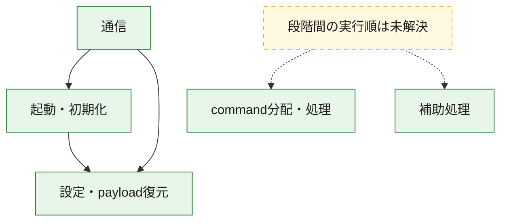
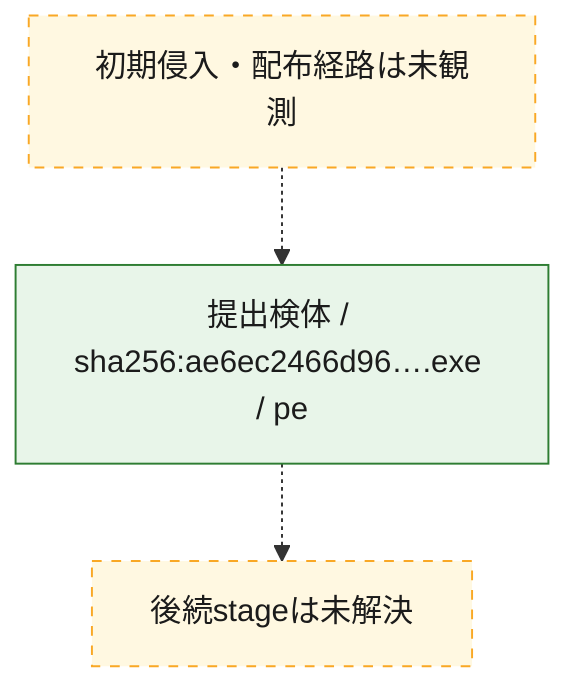
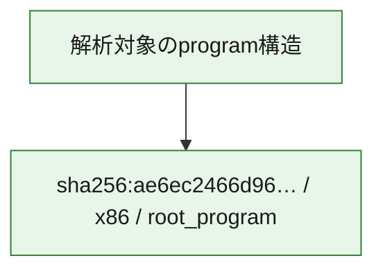

# 全体ロジック：ae6ec2466d965735cd9f1cab47a8e67b27bf4ab8337da3be8c019b79af0ceffc

代表関数の静的証跡から、起動・初期化、設定・payload復元、通信、command分配・処理の処理群を確認しました。

## 読み方

- phaseの掲載順は解析上の整理順です。observed_call_edgesがない段階間の実行順を断定しません。
- 図の実線は静的に観測した関係、点線と黄色のノードは未観測・未解決の関係を示します。
- 図は静的な要約であり、動的実行を再現するものではありません。
- 詳細な関数解説とfingerprintは[STATIC-LOGIC.md](STATIC-LOGIC.md)を参照してください。

## 静的可視化

### 実行フロー

### 感染チェーン

### モジュール関係

## 処理段階

### 1. 起動・初期化

entry pointから初期化と後続処理への移行を確認します。
確度: `confirmed_static_function_evidence`

- `ae6ec2466d965735cd9f1cab47a8e67b27bf4ab8337da3be8c019b79af0ceffc:ghidra:140009d17` — 初期化と主要処理への分岐を行う入口関数です。 状態: `succeeded`、選定理由: `entry_point`, `meaningful_symbol_name`, `reviewed_call_centrality:7`, `role:entrypoint`
- `ae6ec2466d965735cd9f1cab47a8e67b27bf4ab8337da3be8c019b79af0ceffc:ghidra:1400101b4` — 初期化と主要処理への分岐を行う入口関数です。 状態: `succeeded`、選定理由: `entry_point`, `meaningful_symbol_name`, `probable_go_main_user_code`, `reviewed_call_centrality:23`, `role:entrypoint`

### 2. 設定・payload復元

設定、resource、payload、暗号化データの復元・変換を確認します。
確度: `confirmed_static_function_evidence`

- `ae6ec2466d965735cd9f1cab47a8e67b27bf4ab8337da3be8c019b79af0ceffc:ghidra:1400016e1` — 設定、resource、payloadなどの解析・変換を行う関数です。 状態: `succeeded`、選定理由: `meaningful_symbol_name`, `reviewed_call_centrality:1`, `role:config_or_data_transform`
- `ae6ec2466d965735cd9f1cab47a8e67b27bf4ab8337da3be8c019b79af0ceffc:ghidra:140001c94` — 設定、resource、payloadなどの解析・変換を行う関数です。 状態: `succeeded`、選定理由: `meaningful_symbol_name`, `reviewed_call_centrality:1`, `role:config_or_data_transform`
- `ae6ec2466d965735cd9f1cab47a8e67b27bf4ab8337da3be8c019b79af0ceffc:ghidra:1400022ae` — 暗号、hash、encoding、または復号処理に関係する関数です。 状態: `succeeded`、選定理由: `meaningful_symbol_name`, `reviewed_call_centrality:4`, `role:cryptographic_transform`
- `ae6ec2466d965735cd9f1cab47a8e67b27bf4ab8337da3be8c019b79af0ceffc:ghidra:140002ecc` — 暗号、hash、encoding、または復号処理に関係する関数です。 状態: `succeeded`、選定理由: `meaningful_symbol_name`, `reviewed_call_centrality:4`, `role:cryptographic_transform`
- `ae6ec2466d965735cd9f1cab47a8e67b27bf4ab8337da3be8c019b79af0ceffc:ghidra:140002fb6` — 暗号、hash、encoding、または復号処理に関係する関数です。 状態: `succeeded`、選定理由: `meaningful_symbol_name`, `reviewed_call_centrality:12`, `role:cryptographic_transform`
- `ae6ec2466d965735cd9f1cab47a8e67b27bf4ab8337da3be8c019b79af0ceffc:ghidra:1400031e9` — 設定、resource、payloadなどの解析・変換を行う関数です。 状態: `succeeded`、選定理由: `meaningful_symbol_name`, `reviewed_call_centrality:13`, `role:config_or_data_transform`
- `ae6ec2466d965735cd9f1cab47a8e67b27bf4ab8337da3be8c019b79af0ceffc:ghidra:140003c95` — 設定、resource、payloadなどの解析・変換を行う関数です。 状態: `succeeded`、選定理由: `meaningful_symbol_name`, `reviewed_call_centrality:1`, `role:config_or_data_transform`
- `ae6ec2466d965735cd9f1cab47a8e67b27bf4ab8337da3be8c019b79af0ceffc:ghidra:140005261` — 設定、resource、payloadなどの解析・変換を行う関数です。 状態: `succeeded`、選定理由: `meaningful_symbol_name`, `reviewed_call_centrality:2`, `role:config_or_data_transform`
- `ae6ec2466d965735cd9f1cab47a8e67b27bf4ab8337da3be8c019b79af0ceffc:ghidra:140005dfb` — 暗号、hash、encoding、または復号処理に関係する関数です。 状態: `succeeded`、選定理由: `meaningful_symbol_name`, `reviewed_call_centrality:2`, `role:cryptographic_transform`
- `ae6ec2466d965735cd9f1cab47a8e67b27bf4ab8337da3be8c019b79af0ceffc:ghidra:140005f7d` — 設定、resource、payloadなどの解析・変換を行う関数です。 状態: `succeeded`、選定理由: `meaningful_symbol_name`, `reviewed_call_centrality:12`, `role:config_or_data_transform`
- `ae6ec2466d965735cd9f1cab47a8e67b27bf4ab8337da3be8c019b79af0ceffc:ghidra:1400064c3` — 設定、resource、payloadなどの解析・変換を行う関数です。 状態: `succeeded`、選定理由: `meaningful_symbol_name`, `reviewed_call_centrality:9`, `role:config_or_data_transform`
- `ae6ec2466d965735cd9f1cab47a8e67b27bf4ab8337da3be8c019b79af0ceffc:ghidra:140008467` — 設定、resource、payloadなどの解析・変換を行う関数です。 状態: `succeeded`、選定理由: `meaningful_symbol_name`, `reviewed_call_centrality:1`, `role:config_or_data_transform`
- `ae6ec2466d965735cd9f1cab47a8e67b27bf4ab8337da3be8c019b79af0ceffc:ghidra:14000a8ca` — 設定、resource、payloadなどの解析・変換を行う関数です。 状態: `succeeded`、選定理由: `meaningful_symbol_name`, `reviewed_call_centrality:7`, `role:config_or_data_transform`

### 3. 通信

通信初期化、endpoint処理、送受信の役割を確認します。
確度: `confirmed_static_function_evidence`

- `ae6ec2466d965735cd9f1cab47a8e67b27bf4ab8337da3be8c019b79af0ceffc:ghidra:140005b93` — 通信初期化、送受信、またはendpoint処理に関係する関数です。 状態: `succeeded`、選定理由: `meaningful_symbol_name`, `reviewed_call_centrality:3`, `role:network_communication`
- `ae6ec2466d965735cd9f1cab47a8e67b27bf4ab8337da3be8c019b79af0ceffc:ghidra:140006a82` — 通信初期化、送受信、またはendpoint処理に関係する関数です。 状態: `succeeded`、選定理由: `meaningful_symbol_name`, `reviewed_call_centrality:3`, `role:network_communication`
- `ae6ec2466d965735cd9f1cab47a8e67b27bf4ab8337da3be8c019b79af0ceffc:ghidra:14000782e` — 通信初期化、送受信、またはendpoint処理に関係する関数です。 状態: `succeeded`、選定理由: `meaningful_symbol_name`, `reviewed_call_centrality:3`, `role:network_communication`
- `ae6ec2466d965735cd9f1cab47a8e67b27bf4ab8337da3be8c019b79af0ceffc:ghidra:140009259` — 通信初期化、送受信、またはendpoint処理に関係する関数です。 状態: `succeeded`、選定理由: `meaningful_symbol_name`, `reviewed_call_centrality:20`, `role:network_communication`
- `ae6ec2466d965735cd9f1cab47a8e67b27bf4ab8337da3be8c019b79af0ceffc:ghidra:140009499` — 通信初期化、送受信、またはendpoint処理に関係する関数です。 状態: `succeeded`、選定理由: `meaningful_symbol_name`, `reviewed_call_centrality:5`, `role:network_communication`
- `ae6ec2466d965735cd9f1cab47a8e67b27bf4ab8337da3be8c019b79af0ceffc:ghidra:1400097f6` — 通信初期化、送受信、またはendpoint処理に関係する関数です。 状態: `succeeded`、選定理由: `meaningful_symbol_name`, `reviewed_call_centrality:3`, `role:network_communication`
- `ae6ec2466d965735cd9f1cab47a8e67b27bf4ab8337da3be8c019b79af0ceffc:ghidra:140009855` — 通信初期化、送受信、またはendpoint処理に関係する関数です。 状態: `succeeded`、選定理由: `meaningful_symbol_name`, `reviewed_call_centrality:4`, `role:network_communication`
- `ae6ec2466d965735cd9f1cab47a8e67b27bf4ab8337da3be8c019b79af0ceffc:ghidra:140009991` — 通信初期化、送受信、またはendpoint処理に関係する関数です。 状態: `succeeded`、選定理由: `meaningful_symbol_name`, `reviewed_call_centrality:9`, `role:network_communication`
- `ae6ec2466d965735cd9f1cab47a8e67b27bf4ab8337da3be8c019b79af0ceffc:ghidra:14000a105` — 通信初期化、送受信、またはendpoint処理に関係する関数です。 状態: `succeeded`、選定理由: `meaningful_symbol_name`, `reviewed_call_centrality:3`, `role:network_communication`
- `ae6ec2466d965735cd9f1cab47a8e67b27bf4ab8337da3be8c019b79af0ceffc:ghidra:14000a1f9` — 通信初期化、送受信、またはendpoint処理に関係する関数です。 状態: `succeeded`、選定理由: `meaningful_symbol_name`, `reviewed_call_centrality:15`, `role:network_communication`
- `ae6ec2466d965735cd9f1cab47a8e67b27bf4ab8337da3be8c019b79af0ceffc:ghidra:14000b767` — 通信初期化、送受信、またはendpoint処理に関係する関数です。 状態: `succeeded`、選定理由: `meaningful_symbol_name`, `reviewed_call_centrality:11`, `role:network_communication`

### 4. command分配・処理

受信commandやtaskの解釈、分配、個別handlerへの移行を確認します。
確度: `confirmed_static_function_evidence`

- `ae6ec2466d965735cd9f1cab47a8e67b27bf4ab8337da3be8c019b79af0ceffc:ghidra:14000b0a9` — commandの解釈、分配、または個別処理を担当する関数です。 状態: `succeeded`、選定理由: `meaningful_symbol_name`, `reviewed_call_centrality:5`, `role:command_dispatch_or_handler`
- `ae6ec2466d965735cd9f1cab47a8e67b27bf4ab8337da3be8c019b79af0ceffc:ghidra:14000b924` — commandの解釈、分配、または個別処理を担当する関数です。 状態: `succeeded`、選定理由: `meaningful_symbol_name`, `reviewed_call_centrality:5`, `role:command_dispatch_or_handler`
- `ae6ec2466d965735cd9f1cab47a8e67b27bf4ab8337da3be8c019b79af0ceffc:ghidra:14000bd2b` — commandの解釈、分配、または個別処理を担当する関数です。 状態: `succeeded`、選定理由: `meaningful_symbol_name`, `reviewed_call_centrality:7`, `role:command_dispatch_or_handler`

### 5. 補助処理

主要処理を支える一般内部関数またはlibrary処理を確認します。
確度: `confirmed_static_function_evidence`

- `ae6ec2466d965735cd9f1cab47a8e67b27bf4ab8337da3be8c019b79af0ceffc:ghidra:140001410` — 検体内部の一般処理を実装する関数です。 状態: `succeeded`、選定理由: `entry_point`, `meaningful_symbol_name`, `reviewed_call_centrality:1`
- `ae6ec2466d965735cd9f1cab47a8e67b27bf4ab8337da3be8c019b79af0ceffc:ghidra:140010950` — compiler生成処理または汎用library処理とみられる関数です。 状態: `succeeded`、選定理由: `entry_point`, `meaningful_symbol_name`, `reviewed_call_centrality:1`
- `ae6ec2466d965735cd9f1cab47a8e67b27bf4ab8337da3be8c019b79af0ceffc:ghidra:140010980` — compiler生成処理または汎用library処理とみられる関数です。 状態: `succeeded`、選定理由: `entry_point`, `meaningful_symbol_name`, `reviewed_call_centrality:2`

## 観測したcall関係

- `ae6ec2466d965735cd9f1cab47a8e67b27bf4ab8337da3be8c019b79af0ceffc:ghidra:140002fb6` → `ae6ec2466d965735cd9f1cab47a8e67b27bf4ab8337da3be8c019b79af0ceffc:ghidra:140002ecc` （`configuration` → `configuration`）
- `ae6ec2466d965735cd9f1cab47a8e67b27bf4ab8337da3be8c019b79af0ceffc:ghidra:1400031e9` → `ae6ec2466d965735cd9f1cab47a8e67b27bf4ab8337da3be8c019b79af0ceffc:ghidra:140002ecc` （`configuration` → `configuration`）
- `ae6ec2466d965735cd9f1cab47a8e67b27bf4ab8337da3be8c019b79af0ceffc:ghidra:140005dfb` → `ae6ec2466d965735cd9f1cab47a8e67b27bf4ab8337da3be8c019b79af0ceffc:ghidra:1400022ae` （`configuration` → `configuration`）
- `ae6ec2466d965735cd9f1cab47a8e67b27bf4ab8337da3be8c019b79af0ceffc:ghidra:1400064c3` → `ae6ec2466d965735cd9f1cab47a8e67b27bf4ab8337da3be8c019b79af0ceffc:ghidra:1400031e9` （`configuration` → `configuration`）
- `ae6ec2466d965735cd9f1cab47a8e67b27bf4ab8337da3be8c019b79af0ceffc:ghidra:1400064c3` → `ae6ec2466d965735cd9f1cab47a8e67b27bf4ab8337da3be8c019b79af0ceffc:ghidra:140005f7d` （`configuration` → `configuration`）
- `ae6ec2466d965735cd9f1cab47a8e67b27bf4ab8337da3be8c019b79af0ceffc:ghidra:140006a82` → `ae6ec2466d965735cd9f1cab47a8e67b27bf4ab8337da3be8c019b79af0ceffc:ghidra:140005b93` （`communication` → `communication`）
- `ae6ec2466d965735cd9f1cab47a8e67b27bf4ab8337da3be8c019b79af0ceffc:ghidra:140009499` → `ae6ec2466d965735cd9f1cab47a8e67b27bf4ab8337da3be8c019b79af0ceffc:ghidra:140009259` （`communication` → `communication`）
- `ae6ec2466d965735cd9f1cab47a8e67b27bf4ab8337da3be8c019b79af0ceffc:ghidra:140009991` → `ae6ec2466d965735cd9f1cab47a8e67b27bf4ab8337da3be8c019b79af0ceffc:ghidra:140002fb6` （`communication` → `configuration`）
- `ae6ec2466d965735cd9f1cab47a8e67b27bf4ab8337da3be8c019b79af0ceffc:ghidra:140009991` → `ae6ec2466d965735cd9f1cab47a8e67b27bf4ab8337da3be8c019b79af0ceffc:ghidra:1400097f6` （`communication` → `communication`）
- `ae6ec2466d965735cd9f1cab47a8e67b27bf4ab8337da3be8c019b79af0ceffc:ghidra:14000a1f9` → `ae6ec2466d965735cd9f1cab47a8e67b27bf4ab8337da3be8c019b79af0ceffc:ghidra:140009d17` （`communication` → `startup`）
- `ae6ec2466d965735cd9f1cab47a8e67b27bf4ab8337da3be8c019b79af0ceffc:ghidra:14000a1f9` → `ae6ec2466d965735cd9f1cab47a8e67b27bf4ab8337da3be8c019b79af0ceffc:ghidra:14000a105` （`communication` → `communication`）
- `ae6ec2466d965735cd9f1cab47a8e67b27bf4ab8337da3be8c019b79af0ceffc:ghidra:14000b767` → `ae6ec2466d965735cd9f1cab47a8e67b27bf4ab8337da3be8c019b79af0ceffc:ghidra:14000a1f9` （`communication` → `communication`）
- `ae6ec2466d965735cd9f1cab47a8e67b27bf4ab8337da3be8c019b79af0ceffc:ghidra:1400101b4` → `ae6ec2466d965735cd9f1cab47a8e67b27bf4ab8337da3be8c019b79af0ceffc:ghidra:1400064c3` （`startup` → `configuration`）
- `ghidra-function:0b44dcb829b4f896e0b66340` → `ghidra-external:1fc59e28f5d91cf3a23b9007` （`unclassified` → `unclassified`）
- `ghidra-function:0b44dcb829b4f896e0b66340` → `ghidra-external:280268d2cb6496b43e8eb61d` （`unclassified` → `unclassified`）
- `ghidra-function:0b44dcb829b4f896e0b66340` → `ghidra-external:8e5a8a3058fa306f4fcdd5d7` （`unclassified` → `unclassified`）
- `ghidra-function:0b44dcb829b4f896e0b66340` → `ghidra-external:9122d95538ea5aae4a792c18` （`unclassified` → `unclassified`）
- `ghidra-function:0b44dcb829b4f896e0b66340` → `ghidra-external:ab3ac0769d085effea6f4b24` （`unclassified` → `unclassified`）
- `ghidra-function:0b44dcb829b4f896e0b66340` → `ghidra-external:dd637b3372bbb9089576c2c3` （`unclassified` → `unclassified`）
- `ghidra-function:0b44dcb829b4f896e0b66340` → `ghidra-external:f1d665cea8b08c745c6b4152` （`unclassified` → `unclassified`）
- `ghidra-function:0b44dcb829b4f896e0b66340` → `ghidra-function:5232fab2b6a5b201c84576a0` （`unclassified` → `unclassified`）
- `ghidra-function:0b44dcb829b4f896e0b66340` → `ghidra-function:52bae61e41b9866ff4b8c82e` （`unclassified` → `unclassified`）
- `ghidra-function:0b44dcb829b4f896e0b66340` → `ghidra-function:6028f880a27ac268339839e9` （`unclassified` → `unclassified`）
- `ghidra-function:0b44dcb829b4f896e0b66340` → `ghidra-function:767997f1a899382b816bf6e4` （`unclassified` → `unclassified`）
- `ghidra-function:0b44dcb829b4f896e0b66340` → `ghidra-function:f54c19a39029721753576959` （`unclassified` → `unclassified`）
- `ghidra-function:13a3092308c823046adfc42b` → `ghidra-external:ccc6d415b32ebebdba5dd94e` （`unclassified` → `unclassified`）
- `ghidra-function:13a3092308c823046adfc42b` → `ghidra-function:5fa692853ea776701802eeb1` （`unclassified` → `unclassified`）
- `ghidra-function:169c13dd3f6ffc5361e4b9a2` → `ghidra-external:280268d2cb6496b43e8eb61d` （`unclassified` → `unclassified`）
- `ghidra-function:169c13dd3f6ffc5361e4b9a2` → `ghidra-external:67d140e36c1f865d24318fc3` （`unclassified` → `unclassified`）
- `ghidra-function:2903825fb9f71b96c526062f` → `ghidra-function:7f0bde4c47b0478b944beded` （`unclassified` → `unclassified`）
- `ghidra-function:3111367065c3760308f13dec` → `ghidra-external:11c01ef30457f34aa972ab36` （`unclassified` → `unclassified`）
- `ghidra-function:3111367065c3760308f13dec` → `ghidra-external:20f08371066760172a2726fb` （`unclassified` → `unclassified`）
- `ghidra-function:3111367065c3760308f13dec` → `ghidra-external:9fff227ee9aede3b86a8ff01` （`unclassified` → `unclassified`）
- `ghidra-function:3111367065c3760308f13dec` → `ghidra-external:de8be2fd2959ef899d68dc11` （`unclassified` → `unclassified`）
- `ghidra-function:3111367065c3760308f13dec` → `ghidra-function:1a63c3f756652e2be1848d67` （`unclassified` → `unclassified`）
- `ghidra-function:3111367065c3760308f13dec` → `ghidra-function:223922260cb6724b6b54ec3c` （`unclassified` → `unclassified`）
- `ghidra-function:3111367065c3760308f13dec` → `ghidra-function:41712a4afa7d85c647b6ea2d` （`unclassified` → `unclassified`）
- `ghidra-function:3111367065c3760308f13dec` → `ghidra-function:471c975d05902cad7ce799a8` （`unclassified` → `unclassified`）
- `ghidra-function:3111367065c3760308f13dec` → `ghidra-function:4d4240cf41b2e12b2a795f87` （`unclassified` → `unclassified`）
- `ghidra-function:3111367065c3760308f13dec` → `ghidra-function:537df2c01455493f8188492a` （`unclassified` → `unclassified`）
- `ghidra-function:3111367065c3760308f13dec` → `ghidra-function:566d5eed3601ace192c2a5fd` （`unclassified` → `unclassified`）
- `ghidra-function:3111367065c3760308f13dec` → `ghidra-function:5920f5b1f8bc47f493c1b964` （`unclassified` → `unclassified`）
- `ghidra-function:3111367065c3760308f13dec` → `ghidra-function:66ea19bf64363b77c0eab690` （`unclassified` → `unclassified`）
- `ghidra-function:3111367065c3760308f13dec` → `ghidra-function:6d18168dd7e9723c41f58682` （`unclassified` → `unclassified`）
- `ghidra-function:3111367065c3760308f13dec` → `ghidra-function:721f78ebc03fe1ae35eb4c91` （`unclassified` → `unclassified`）
- `ghidra-function:3111367065c3760308f13dec` → `ghidra-function:72fce0c78932f56579d41f02` （`unclassified` → `unclassified`）
- `ghidra-function:3111367065c3760308f13dec` → `ghidra-function:83ccb0e87f83c15c929fc3ee` （`unclassified` → `unclassified`）
- `ghidra-function:3111367065c3760308f13dec` → `ghidra-function:862d288d96ea9fd23418ee04` （`unclassified` → `unclassified`）
- `ghidra-function:3111367065c3760308f13dec` → `ghidra-function:a939288ea6dc0d7ce997ea94` （`unclassified` → `unclassified`）
- `ghidra-function:3111367065c3760308f13dec` → `ghidra-function:f85fc96b0afe4795318072b1` （`unclassified` → `unclassified`）
- `ghidra-function:33cec16937b8da05a9648291` → `ghidra-external:20f08371066760172a2726fb` （`unclassified` → `unclassified`）
- `ghidra-function:33cec16937b8da05a9648291` → `ghidra-external:280268d2cb6496b43e8eb61d` （`unclassified` → `unclassified`）
- `ghidra-function:33cec16937b8da05a9648291` → `ghidra-external:5836a784290818437144961c` （`unclassified` → `unclassified`）
- `ghidra-function:33cec16937b8da05a9648291` → `ghidra-external:a5a8c8c5c963bf1d19bac35c` （`unclassified` → `unclassified`）
- `ghidra-function:33cec16937b8da05a9648291` → `ghidra-external:bf2b58798315734eeae37d47` （`unclassified` → `unclassified`）
- `ghidra-function:33cec16937b8da05a9648291` → `ghidra-external:bfb676e8a2c509a100e0a1e4` （`unclassified` → `unclassified`）
- `ghidra-function:33cec16937b8da05a9648291` → `ghidra-external:f82c6fe1e313c43c404533d7` （`unclassified` → `unclassified`）
- `ghidra-function:38e2fc58845dd09ac1f0abdc` → `ghidra-external:280268d2cb6496b43e8eb61d` （`unclassified` → `unclassified`）
- `ghidra-function:38e2fc58845dd09ac1f0abdc` → `ghidra-external:8262a231bb2485bb70fe3f88` （`unclassified` → `unclassified`）
- `ghidra-function:38e2fc58845dd09ac1f0abdc` → `ghidra-function:3da6802da4ea677cf5a9b73c` （`unclassified` → `unclassified`）
- `ghidra-function:38e2fc58845dd09ac1f0abdc` → `ghidra-function:56cde89b079b5566665bf430` （`unclassified` → `unclassified`）
- `ghidra-function:38e2fc58845dd09ac1f0abdc` → `ghidra-function:ad230c77ad0a56803f3d3da3` （`unclassified` → `unclassified`）
- `ghidra-function:4ddf3aacea8e4748f6364db0` → `ghidra-external:0f1bd3b39fba1ef8735a4c28` （`unclassified` → `unclassified`）
- `ghidra-function:4ddf3aacea8e4748f6364db0` → `ghidra-external:20f08371066760172a2726fb` （`unclassified` → `unclassified`）
- `ghidra-function:4ddf3aacea8e4748f6364db0` → `ghidra-external:214233682ef16b0e3a28c794` （`unclassified` → `unclassified`）
- `ghidra-function:4ddf3aacea8e4748f6364db0` → `ghidra-external:5836a784290818437144961c` （`unclassified` → `unclassified`）
- `ghidra-function:4ddf3aacea8e4748f6364db0` → `ghidra-external:bf2b58798315734eeae37d47` （`unclassified` → `unclassified`）
- `ghidra-function:4ddf3aacea8e4748f6364db0` → `ghidra-function:04e29d7c4d5f2c8b29483eca` （`unclassified` → `unclassified`）
- `ghidra-function:4ddf3aacea8e4748f6364db0` → `ghidra-function:0537df6a5b64d82496baaa24` （`unclassified` → `unclassified`）
- `ghidra-function:4ddf3aacea8e4748f6364db0` → `ghidra-function:1168c6597bf17783d15705b5` （`unclassified` → `unclassified`）
- `ghidra-function:4ddf3aacea8e4748f6364db0` → `ghidra-function:3646463a80712cd940646bfb` （`unclassified` → `unclassified`）
- `ghidra-function:4ddf3aacea8e4748f6364db0` → `ghidra-function:4a81991aba6e0f631da06213` （`unclassified` → `unclassified`）
- `ghidra-function:4ddf3aacea8e4748f6364db0` → `ghidra-function:5ddcb40719fdac314db52c6c` （`unclassified` → `unclassified`）
- `ghidra-function:4ddf3aacea8e4748f6364db0` → `ghidra-function:bd6bf04ad9dcdb81be0fb9a7` （`unclassified` → `unclassified`）
- `ghidra-function:5232fab2b6a5b201c84576a0` → `ghidra-function:52bae61e41b9866ff4b8c82e` （`unclassified` → `unclassified`）
- `ghidra-function:5232fab2b6a5b201c84576a0` → `ghidra-function:767997f1a899382b816bf6e4` （`unclassified` → `unclassified`）
- `ghidra-function:5ec0a4253e5217ffc2ec5c6f` → `ghidra-function:800c18576d95d80b2f1c8629` （`unclassified` → `unclassified`）
- `ghidra-function:5ec0a4253e5217ffc2ec5c6f` → `ghidra-function:9eabe2cefb6cda364117f843` （`unclassified` → `unclassified`）
- `ghidra-function:66ea19bf64363b77c0eab690` → `ghidra-external:152a3463983bff2d76a685be` （`unclassified` → `unclassified`）
- `ghidra-function:66ea19bf64363b77c0eab690` → `ghidra-external:20f08371066760172a2726fb` （`unclassified` → `unclassified`）
- `ghidra-function:66ea19bf64363b77c0eab690` → `ghidra-external:214233682ef16b0e3a28c794` （`unclassified` → `unclassified`）
- `ghidra-function:66ea19bf64363b77c0eab690` → `ghidra-function:0b44dcb829b4f896e0b66340` （`unclassified` → `unclassified`）
- `ghidra-function:66ea19bf64363b77c0eab690` → `ghidra-function:155641760e55628cc1bc76a9` （`unclassified` → `unclassified`）
- `ghidra-function:66ea19bf64363b77c0eab690` → `ghidra-function:2fd24114ae66f91f433da675` （`unclassified` → `unclassified`）
- `ghidra-function:66ea19bf64363b77c0eab690` → `ghidra-function:82768344e6512804b13026a2` （`unclassified` → `unclassified`）
- `ghidra-function:68b31b36eed64810bd249611` → `ghidra-external:152a3463983bff2d76a685be` （`unclassified` → `unclassified`）
- `ghidra-function:68b31b36eed64810bd249611` → `ghidra-external:f1d665cea8b08c745c6b4152` （`unclassified` → `unclassified`）
- `ghidra-function:68b31b36eed64810bd249611` → `ghidra-external:fc1cad00044502e1dcacdb94` （`unclassified` → `unclassified`）
- `ghidra-function:68b31b36eed64810bd249611` → `ghidra-function:b1b8ab5253846d08ab505887` （`unclassified` → `unclassified`）
- `ghidra-function:6ca6599a11effaff22e3f9f6` → `ghidra-external:0bce28946fe0f9e5c09e83ee` （`unclassified` → `unclassified`）
- `ghidra-function:6ca6599a11effaff22e3f9f6` → `ghidra-function:476ef61f0822c2d3fbca8969` （`unclassified` → `unclassified`）
- `ghidra-function:6d0c31ae384e9b29a3f64ba7` → `ghidra-external:1bae53687b0c41326285805a` （`unclassified` → `unclassified`）
- `ghidra-function:6d0c31ae384e9b29a3f64ba7` → `ghidra-external:280268d2cb6496b43e8eb61d` （`unclassified` → `unclassified`）
- `ghidra-function:6d0c31ae384e9b29a3f64ba7` → `ghidra-external:67d140e36c1f865d24318fc3` （`unclassified` → `unclassified`）
- `ghidra-function:6d0c31ae384e9b29a3f64ba7` → `ghidra-external:ed2cfc3f34a9e165cff1ef1d` （`unclassified` → `unclassified`）
- `ghidra-function:6d0c31ae384e9b29a3f64ba7` → `ghidra-function:692dfa79acf0aa959ad5ae9f` （`unclassified` → `unclassified`）
- `ghidra-function:6d0c31ae384e9b29a3f64ba7` → `ghidra-function:88712b6de82b45faf5646467` （`unclassified` → `unclassified`）
- `ghidra-function:7679584a574a25dfa195efcc` → `ghidra-external:bfb676e8a2c509a100e0a1e4` （`unclassified` → `unclassified`）
- `ghidra-function:82768344e6512804b13026a2` → `ghidra-external:11c01ef30457f34aa972ab36` （`unclassified` → `unclassified`）
- `ghidra-function:82768344e6512804b13026a2` → `ghidra-external:20f08371066760172a2726fb` （`unclassified` → `unclassified`）
- `ghidra-function:82768344e6512804b13026a2` → `ghidra-external:280268d2cb6496b43e8eb61d` （`unclassified` → `unclassified`）
- `ghidra-function:82768344e6512804b13026a2` → `ghidra-external:8262a231bb2485bb70fe3f88` （`unclassified` → `unclassified`）
- `ghidra-function:82768344e6512804b13026a2` → `ghidra-external:9fff227ee9aede3b86a8ff01` （`unclassified` → `unclassified`）
- `ghidra-function:82768344e6512804b13026a2` → `ghidra-function:3da6802da4ea677cf5a9b73c` （`unclassified` → `unclassified`）
- `ghidra-function:82768344e6512804b13026a2` → `ghidra-function:56cde89b079b5566665bf430` （`unclassified` → `unclassified`）
- `ghidra-function:82768344e6512804b13026a2` → `ghidra-function:599a11159157a989d9479a4b` （`unclassified` → `unclassified`）
- `ghidra-function:82768344e6512804b13026a2` → `ghidra-function:aca200e399a79848096cc34a` （`unclassified` → `unclassified`）
- `ghidra-function:82768344e6512804b13026a2` → `ghidra-function:ad230c77ad0a56803f3d3da3` （`unclassified` → `unclassified`）
- `ghidra-function:82768344e6512804b13026a2` → `ghidra-function:b9a29575a7d4610559acfcf2` （`unclassified` → `unclassified`）
- `ghidra-function:857abf7078cdbf9585aa5249` → `ghidra-function:c8e8218972d81e34aef99615` （`unclassified` → `unclassified`）
- `ghidra-function:8ff8ee589cccaf6408e16ab5` → `ghidra-external:280268d2cb6496b43e8eb61d` （`unclassified` → `unclassified`）
- `ghidra-function:8ff8ee589cccaf6408e16ab5` → `ghidra-external:f1d665cea8b08c745c6b4152` （`unclassified` → `unclassified`）
- `ghidra-function:8ff8ee589cccaf6408e16ab5` → `ghidra-function:225de32f7ca39b89118b9daf` （`unclassified` → `unclassified`）
- `ghidra-function:90dd79ef382cfa0babb314a0` → `ghidra-external:20f08371066760172a2726fb` （`unclassified` → `unclassified`）
- `ghidra-function:90dd79ef382cfa0babb314a0` → `ghidra-function:155641760e55628cc1bc76a9` （`unclassified` → `unclassified`）
- `ghidra-function:90dd79ef382cfa0babb314a0` → `ghidra-function:2fd24114ae66f91f433da675` （`unclassified` → `unclassified`）
- `ghidra-function:90dd79ef382cfa0babb314a0` → `ghidra-function:4ddf3aacea8e4748f6364db0` （`unclassified` → `unclassified`）
- `ghidra-function:9323134a69d6f4b977a9e731` → `ghidra-function:2ef32f69a27eb7387b662111` （`unclassified` → `unclassified`）
- `ghidra-function:968b42a50d136ae8c113a57a` → `ghidra-external:280268d2cb6496b43e8eb61d` （`unclassified` → `unclassified`）
- `ghidra-function:968b42a50d136ae8c113a57a` → `ghidra-external:8262a231bb2485bb70fe3f88` （`unclassified` → `unclassified`）
- `ghidra-function:968b42a50d136ae8c113a57a` → `ghidra-function:3da6802da4ea677cf5a9b73c` （`unclassified` → `unclassified`）
- `ghidra-function:968b42a50d136ae8c113a57a` → `ghidra-function:599a11159157a989d9479a4b` （`unclassified` → `unclassified`）
- `ghidra-function:968b42a50d136ae8c113a57a` → `ghidra-function:ad230c77ad0a56803f3d3da3` （`unclassified` → `unclassified`）
- `ghidra-function:99c20afc4b5f6b8726cbaee9` → `ghidra-function:85331d57eb9c96d8ccd82167` （`unclassified` → `unclassified`）
- `ghidra-function:99c20afc4b5f6b8726cbaee9` → `ghidra-function:e83bae1456916b33d9a74c88` （`unclassified` → `unclassified`）
- `ghidra-function:afbc16aac087700cee38ef09` → `ghidra-function:0f5578b91b75dc6d0bcf87c5` （`unclassified` → `unclassified`）
- `ghidra-function:afbc16aac087700cee38ef09` → `ghidra-function:255a344eadaecf02df544c13` （`unclassified` → `unclassified`）
- `ghidra-function:afbc16aac087700cee38ef09` → `ghidra-function:2e4aff5b0c0d6b744d8891bb` （`unclassified` → `unclassified`）
- `ghidra-function:afbc16aac087700cee38ef09` → `ghidra-function:305ebb856d0e6fa7d4eb5732` （`unclassified` → `unclassified`）
- `ghidra-function:afbc16aac087700cee38ef09` → `ghidra-function:862d288d96ea9fd23418ee04` （`unclassified` → `unclassified`）
- `ghidra-function:afbc16aac087700cee38ef09` → `ghidra-function:9a86b20917458c2d6a0adff6` （`unclassified` → `unclassified`）
- `ghidra-function:afbc16aac087700cee38ef09` → `ghidra-function:a1435173234c5765e78ad8bc` （`unclassified` → `unclassified`）
- `ghidra-function:afbc16aac087700cee38ef09` → `ghidra-function:a8f491740bf67768d4cb1ca1` （`unclassified` → `unclassified`）
- `ghidra-function:afbc16aac087700cee38ef09` → `ghidra-function:b7641b13a65d9b85b7098c6b` （`unclassified` → `unclassified`）
- `ghidra-function:afbc16aac087700cee38ef09` → `ghidra-function:cd5431da942d7d6ec4f8d1e6` （`unclassified` → `unclassified`）
- `ghidra-function:afbc16aac087700cee38ef09` → `ghidra-function:f8966de4a2fb8ae053e5ec8a` （`unclassified` → `unclassified`）
- `ghidra-function:c1e7fb5e58320a222ac9c91b` → `ghidra-function:b16cfd09f29da992b282f648` （`unclassified` → `unclassified`）
- `ghidra-function:c4f7707f89e602e93e8fbabc` → `ghidra-function:476ef61f0822c2d3fbca8969` （`unclassified` → `unclassified`）
- `ghidra-function:c5c5523f1c91aca96dc907e0` → `ghidra-external:11c01ef30457f34aa972ab36` （`unclassified` → `unclassified`）
- `ghidra-function:c5c5523f1c91aca96dc907e0` → `ghidra-function:4ecc0956f5c5cb1cec249c3a` （`unclassified` → `unclassified`）
- `ghidra-function:c5c5523f1c91aca96dc907e0` → `ghidra-function:5ec0a4253e5217ffc2ec5c6f` （`unclassified` → `unclassified`）
- `ghidra-function:c67ec098584c99030fe831e6` → `ghidra-external:1fc59e28f5d91cf3a23b9007` （`unclassified` → `unclassified`）
- `ghidra-function:c67ec098584c99030fe831e6` → `ghidra-external:8e5a8a3058fa306f4fcdd5d7` （`unclassified` → `unclassified`）
- `ghidra-function:c67ec098584c99030fe831e6` → `ghidra-external:ab3ac0769d085effea6f4b24` （`unclassified` → `unclassified`）
- `ghidra-function:c67ec098584c99030fe831e6` → `ghidra-external:dd637b3372bbb9089576c2c3` （`unclassified` → `unclassified`）
- `ghidra-function:c67ec098584c99030fe831e6` → `ghidra-external:f1d665cea8b08c745c6b4152` （`unclassified` → `unclassified`）
- `ghidra-function:c67ec098584c99030fe831e6` → `ghidra-function:41712a4afa7d85c647b6ea2d` （`unclassified` → `unclassified`）
- `ghidra-function:c67ec098584c99030fe831e6` → `ghidra-function:5232fab2b6a5b201c84576a0` （`unclassified` → `unclassified`）
- `ghidra-function:c67ec098584c99030fe831e6` → `ghidra-function:52bae61e41b9866ff4b8c82e` （`unclassified` → `unclassified`）
- `ghidra-function:c67ec098584c99030fe831e6` → `ghidra-function:6028f880a27ac268339839e9` （`unclassified` → `unclassified`）
- `ghidra-function:c67ec098584c99030fe831e6` → `ghidra-function:767997f1a899382b816bf6e4` （`unclassified` → `unclassified`）
- `ghidra-function:c67ec098584c99030fe831e6` → `ghidra-function:f54c19a39029721753576959` （`unclassified` → `unclassified`）
- `ghidra-function:cd5431da942d7d6ec4f8d1e6` → `ghidra-external:152a3463983bff2d76a685be` （`unclassified` → `unclassified`）
- `ghidra-function:cd5431da942d7d6ec4f8d1e6` → `ghidra-external:20f08371066760172a2726fb` （`unclassified` → `unclassified`）
- `ghidra-function:cd5431da942d7d6ec4f8d1e6` → `ghidra-external:280268d2cb6496b43e8eb61d` （`unclassified` → `unclassified`）
- `ghidra-function:cd5431da942d7d6ec4f8d1e6` → `ghidra-external:9e12b672f851583f2f5ea8a5` （`unclassified` → `unclassified`）
- `ghidra-function:cd5431da942d7d6ec4f8d1e6` → `ghidra-external:b2101d4c81437b1b28599c67` （`unclassified` → `unclassified`）
- `ghidra-function:cd5431da942d7d6ec4f8d1e6` → `ghidra-external:d0777a284aba6ee90db8b6d6` （`unclassified` → `unclassified`）
- `ghidra-function:cd5431da942d7d6ec4f8d1e6` → `ghidra-external:eab0c8d037f1dbbd6e3ab66e` （`unclassified` → `unclassified`）
- `ghidra-function:cd5431da942d7d6ec4f8d1e6` → `ghidra-external:f1d665cea8b08c745c6b4152` （`unclassified` → `unclassified`）
- `ghidra-function:cd5431da942d7d6ec4f8d1e6` → `ghidra-function:11513443f059131aee9f3f6f` （`unclassified` → `unclassified`）
- `ghidra-function:cd5431da942d7d6ec4f8d1e6` → `ghidra-function:155641760e55628cc1bc76a9` （`unclassified` → `unclassified`）
- `ghidra-function:cd5431da942d7d6ec4f8d1e6` → `ghidra-function:6d0c31ae384e9b29a3f64ba7` （`unclassified` → `unclassified`）
- `ghidra-function:cd5431da942d7d6ec4f8d1e6` → `ghidra-function:b6dca988862f54e938d3652b` （`unclassified` → `unclassified`）
- `ghidra-function:cd5431da942d7d6ec4f8d1e6` → `ghidra-function:d82323899fd618eba1e889b9` （`unclassified` → `unclassified`）
- `ghidra-function:d82323899fd618eba1e889b9` → `ghidra-external:152a3463983bff2d76a685be` （`unclassified` → `unclassified`）
- `ghidra-function:d82323899fd618eba1e889b9` → `ghidra-external:214233682ef16b0e3a28c794` （`unclassified` → `unclassified`）
- `ghidra-function:de5f12f413a4b598a66eaa40` → `ghidra-external:152a3463983bff2d76a685be` （`unclassified` → `unclassified`）
- `ghidra-function:de5f12f413a4b598a66eaa40` → `ghidra-function:0b660d0ca828f9e8eeaf252e` （`unclassified` → `unclassified`）
- `ghidra-function:de5f12f413a4b598a66eaa40` → `ghidra-function:13a3092308c823046adfc42b` （`unclassified` → `unclassified`）
- `ghidra-function:de5f12f413a4b598a66eaa40` → `ghidra-function:305ebb856d0e6fa7d4eb5732` （`unclassified` → `unclassified`）
- `ghidra-function:de5f12f413a4b598a66eaa40` → `ghidra-function:862d288d96ea9fd23418ee04` （`unclassified` → `unclassified`）
- `ghidra-function:de5f12f413a4b598a66eaa40` → `ghidra-function:b7641b13a65d9b85b7098c6b` （`unclassified` → `unclassified`）
- `ghidra-function:de5f12f413a4b598a66eaa40` → `ghidra-function:c67ec098584c99030fe831e6` （`unclassified` → `unclassified`）
- `ghidra-function:de5f12f413a4b598a66eaa40` → `ghidra-function:dafffe5f2f587cf928eea412` （`unclassified` → `unclassified`）
- `ghidra-function:de5f12f413a4b598a66eaa40` → `ghidra-function:f8966de4a2fb8ae053e5ec8a` （`unclassified` → `unclassified`）
- `ghidra-function:e83bae1456916b33d9a74c88` → `ghidra-function:5db5315943bad578f1d26938` （`unclassified` → `unclassified`）
- `ghidra-function:e83bae1456916b33d9a74c88` → `ghidra-function:5e2202f4128ed6ec5edf7cac` （`unclassified` → `unclassified`）
- `ghidra-function:e83bae1456916b33d9a74c88` → `ghidra-function:e6b65a37914d67693fac7c97` （`unclassified` → `unclassified`）
- `ghidra-function:fb8654532459aeb31c1f77cc` → `ghidra-function:0f5578b91b75dc6d0bcf87c5` （`unclassified` → `unclassified`）
- `ghidra-function:fb8654532459aeb31c1f77cc` → `ghidra-function:255a344eadaecf02df544c13` （`unclassified` → `unclassified`）
- `ghidra-function:fb8654532459aeb31c1f77cc` → `ghidra-function:305ebb856d0e6fa7d4eb5732` （`unclassified` → `unclassified`）
- `ghidra-function:fb8654532459aeb31c1f77cc` → `ghidra-function:862d288d96ea9fd23418ee04` （`unclassified` → `unclassified`）
- `ghidra-function:fb8654532459aeb31c1f77cc` → `ghidra-function:b7641b13a65d9b85b7098c6b` （`unclassified` → `unclassified`）
- `ghidra-function:fb8654532459aeb31c1f77cc` → `ghidra-function:e01c3c692f47f95093d73ce1` （`unclassified` → `unclassified`）
- `ghidra-function:fb8654532459aeb31c1f77cc` → `ghidra-function:f8966de4a2fb8ae053e5ec8a` （`unclassified` → `unclassified`）

## 解析範囲と制約

- 選定外関数は全体inventoryへ残しますが、関数本体の個別解説対象にはしていません。
- indirect call、難読化、packer、VM、壊れたcontrol flowによりcall関係が欠落する場合があります。
- 文書は静的解析に基づき、検体実行や外部通信による動的確認は行っていません。
