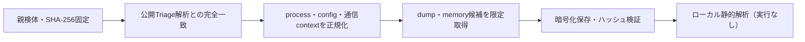

# Triage公開解析・後段取得証跡

## 完全ハッシュ一致

- [260924-ycjthazhjb](https://tria.ge/260924-ycjthazhjb): ファミリー候補 `blakcsee_stealer`、評価score `10`
- [260924-lcpzasad75](https://tria.ge/260924-lcpzasad75): ファミリー候補 `blakcsee_stealer`、評価score `10`

## プロセス・通信

- 観測process: `2026-09-23_4a7c94df0248fcb15670d7f31bad32a4_cobalt-strike_glassworm_icedid_luca-stealer_njrat_satacom_stealc.exe, chrome.exe, cx4slf5vu.exe, elevation_service.exe, msedge.exe`
- raw commandは保存せず、command SHA-256と処理patternだけをJSONへ保持します。
- sandbox background trafficは`context_only`であり、C2へ自動昇格しません。

- `2.26.126.50`（sandbox config候補）

## 後段取得物

- 取得できませんでした。

## 判定境界

Triage由来のfamily、process、config、通信は外部sandbox証跡です。Config extractorが返したendpointはC2候補として扱いますが、静的設定復元またはprocess帰属とprotocol応答が揃うまでは確認済みC2とはしません。取得成果物と検体は実行していません。
