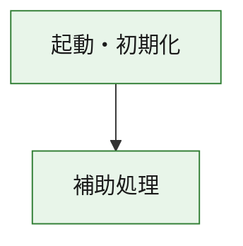
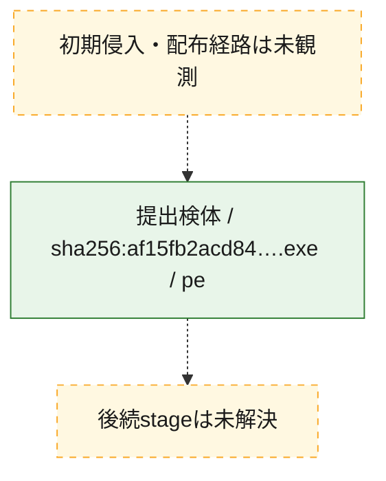
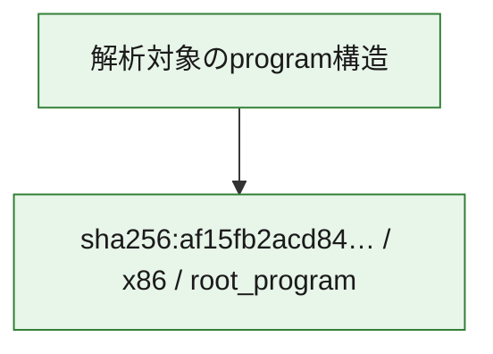

# 全体ロジック：af15fb2acd8409f51ceb6025ef3a1a8b1ec3d9f44dcf37a65dfdb9fbaf57a040

代表関数の静的証跡から、起動・初期化の処理群を確認しました。

## 読み方

- phaseの掲載順は解析上の整理順です。observed_call_edgesがない段階間の実行順を断定しません。
- 図の実線は静的に観測した関係、点線と黄色のノードは未観測・未解決の関係を示します。
- 図は静的な要約であり、動的実行を再現するものではありません。
- 詳細な関数解説とfingerprintは[STATIC-LOGIC.md](STATIC-LOGIC.md)を参照してください。

## 静的可視化

### 実行フロー

### 感染チェーン

### モジュール関係

## 処理段階

### 1. 起動・初期化

entry pointから初期化と後続処理への移行を確認します。
確度: `confirmed_static_function_evidence`

- `af15fb2acd8409f51ceb6025ef3a1a8b1ec3d9f44dcf37a65dfdb9fbaf57a040:ghidra:180001010` — 初期化と主要処理への分岐を行う入口関数です。 状態: `succeeded`、選定理由: `entry_point`, `meaningful_symbol_name`, `reviewed_call_centrality:22`, `role:entrypoint`, `small_program_complete_context`

### 2. 補助処理

主要処理を支える一般内部関数またはlibrary処理を確認します。
確度: `confirmed_static_function_evidence`

- `af15fb2acd8409f51ceb6025ef3a1a8b1ec3d9f44dcf37a65dfdb9fbaf57a040:ghidra:180001240` — 検体内部の一般処理を実装する関数です。 状態: `succeeded`、選定理由: `context_representative`, `reviewed_call_centrality:2`, `small_program_complete_context`
- `af15fb2acd8409f51ceb6025ef3a1a8b1ec3d9f44dcf37a65dfdb9fbaf57a040:ghidra:180001350` — 検体内部の一般処理を実装する関数です。 状態: `succeeded`、選定理由: `context_representative`, `reviewed_call_centrality:25`, `small_program_complete_context`
- `af15fb2acd8409f51ceb6025ef3a1a8b1ec3d9f44dcf37a65dfdb9fbaf57a040:ghidra:180003780` — 検体内部の一般処理を実装する関数です。 状態: `succeeded`、選定理由: `context_representative`, `reviewed_call_centrality:2`, `small_program_complete_context`
- `af15fb2acd8409f51ceb6025ef3a1a8b1ec3d9f44dcf37a65dfdb9fbaf57a040:ghidra:1800038e0` — 検体内部の一般処理を実装する関数です。 状態: `succeeded`、選定理由: `context_representative`, `reviewed_call_centrality:2`, `small_program_complete_context`

## 観測したcall関係

- `af15fb2acd8409f51ceb6025ef3a1a8b1ec3d9f44dcf37a65dfdb9fbaf57a040:ghidra:180001010` → `af15fb2acd8409f51ceb6025ef3a1a8b1ec3d9f44dcf37a65dfdb9fbaf57a040:ghidra:180001240` （`startup` → `support`）
- `af15fb2acd8409f51ceb6025ef3a1a8b1ec3d9f44dcf37a65dfdb9fbaf57a040:ghidra:180001010` → `af15fb2acd8409f51ceb6025ef3a1a8b1ec3d9f44dcf37a65dfdb9fbaf57a040:ghidra:180001350` （`startup` → `support`）
- `af15fb2acd8409f51ceb6025ef3a1a8b1ec3d9f44dcf37a65dfdb9fbaf57a040:ghidra:180001350` → `af15fb2acd8409f51ceb6025ef3a1a8b1ec3d9f44dcf37a65dfdb9fbaf57a040:ghidra:180001240` （`support` → `support`）
- `af15fb2acd8409f51ceb6025ef3a1a8b1ec3d9f44dcf37a65dfdb9fbaf57a040:ghidra:180001350` → `af15fb2acd8409f51ceb6025ef3a1a8b1ec3d9f44dcf37a65dfdb9fbaf57a040:ghidra:180003780` （`support` → `support`）
- `af15fb2acd8409f51ceb6025ef3a1a8b1ec3d9f44dcf37a65dfdb9fbaf57a040:ghidra:180001350` → `af15fb2acd8409f51ceb6025ef3a1a8b1ec3d9f44dcf37a65dfdb9fbaf57a040:ghidra:1800038e0` （`support` → `support`）
- `af15fb2acd8409f51ceb6025ef3a1a8b1ec3d9f44dcf37a65dfdb9fbaf57a040:ghidra:180003780` → `af15fb2acd8409f51ceb6025ef3a1a8b1ec3d9f44dcf37a65dfdb9fbaf57a040:ghidra:1800038e0` （`support` → `support`）
- `ghidra-function:2b57927d189303314008d6dc` → `ghidra-external:1969b123991347fbc6aa6529` （`unclassified` → `unclassified`）
- `ghidra-function:2b57927d189303314008d6dc` → `ghidra-external:1b1be5fc37749c058d67440b` （`unclassified` → `unclassified`）
- `ghidra-function:2b57927d189303314008d6dc` → `ghidra-external:1cbc04fd4f031e1f94bfc7f3` （`unclassified` → `unclassified`）
- `ghidra-function:2b57927d189303314008d6dc` → `ghidra-external:23f2c6dc90dff45edfe33e67` （`unclassified` → `unclassified`）
- `ghidra-function:2b57927d189303314008d6dc` → `ghidra-external:35a11d89ce280691d62f8f9d` （`unclassified` → `unclassified`）
- `ghidra-function:2b57927d189303314008d6dc` → `ghidra-external:69c2eea8ba18b99dc3d6b80a` （`unclassified` → `unclassified`）
- `ghidra-function:2b57927d189303314008d6dc` → `ghidra-external:70fe002e3a9d640c167fc0cf` （`unclassified` → `unclassified`）
- `ghidra-function:2b57927d189303314008d6dc` → `ghidra-external:7ac9a6b5bdf6ffac32651524` （`unclassified` → `unclassified`）
- `ghidra-function:2b57927d189303314008d6dc` → `ghidra-external:7d2b30104435a882c1897de2` （`unclassified` → `unclassified`）
- `ghidra-function:2b57927d189303314008d6dc` → `ghidra-external:85dbea4a431c3a0fb7c1df4d` （`unclassified` → `unclassified`）
- `ghidra-function:2b57927d189303314008d6dc` → `ghidra-external:86e7b66f523bea7b92d68932` （`unclassified` → `unclassified`）
- `ghidra-function:2b57927d189303314008d6dc` → `ghidra-external:9c3984b0ae1539cc8330afe3` （`unclassified` → `unclassified`）
- `ghidra-function:2b57927d189303314008d6dc` → `ghidra-external:b187e6f157047a7ac50b3876` （`unclassified` → `unclassified`）
- `ghidra-function:2b57927d189303314008d6dc` → `ghidra-external:b996a43582a606367fadbe68` （`unclassified` → `unclassified`）
- `ghidra-function:2b57927d189303314008d6dc` → `ghidra-external:ba51bb93a0c2b72979d8f2c7` （`unclassified` → `unclassified`）
- `ghidra-function:2b57927d189303314008d6dc` → `ghidra-external:bc80862af51daa2cf73ade3b` （`unclassified` → `unclassified`）
- `ghidra-function:2b57927d189303314008d6dc` → `ghidra-external:c5181dfff6dc6db5571695af` （`unclassified` → `unclassified`）
- `ghidra-function:2b57927d189303314008d6dc` → `ghidra-external:e792b7a84f59d121431f6bc8` （`unclassified` → `unclassified`）
- `ghidra-function:2b57927d189303314008d6dc` → `ghidra-external:e8ec8f28f8a582cd68d370b1` （`unclassified` → `unclassified`）
- `ghidra-function:2b57927d189303314008d6dc` → `ghidra-external:f217f9c05747acd11e2cd74c` （`unclassified` → `unclassified`）
- `ghidra-function:2b57927d189303314008d6dc` → `ghidra-external:f87d88dde02ca6f3ab88a2e5` （`unclassified` → `unclassified`）
- `ghidra-function:2b57927d189303314008d6dc` → `ghidra-function:470b83b8b3c071970db50e51` （`unclassified` → `unclassified`）
- `ghidra-function:2b57927d189303314008d6dc` → `ghidra-function:9061ec85e5626a5c4f3e1e1f` （`unclassified` → `unclassified`）
- `ghidra-function:2b57927d189303314008d6dc` → `ghidra-function:b6d71a0c5f6fd69704f78a25` （`unclassified` → `unclassified`）
- `ghidra-function:52d803c44d0435996fbf79b5` → `ghidra-function:01cee03816835e08e17af700` （`unclassified` → `unclassified`）
- `ghidra-function:52d803c44d0435996fbf79b5` → `ghidra-function:173f2c674676f4d95c817a5e` （`unclassified` → `unclassified`）
- `ghidra-function:52d803c44d0435996fbf79b5` → `ghidra-function:254c758ec2c6794367bed2c3` （`unclassified` → `unclassified`）
- `ghidra-function:52d803c44d0435996fbf79b5` → `ghidra-function:2b57927d189303314008d6dc` （`unclassified` → `unclassified`）
- `ghidra-function:52d803c44d0435996fbf79b5` → `ghidra-function:3f027d4c0d9a76f90d572c8f` （`unclassified` → `unclassified`）
- `ghidra-function:52d803c44d0435996fbf79b5` → `ghidra-function:46f61ea9b7694e6b51c13467` （`unclassified` → `unclassified`）
- `ghidra-function:52d803c44d0435996fbf79b5` → `ghidra-function:470b83b8b3c071970db50e51` （`unclassified` → `unclassified`）
- `ghidra-function:52d803c44d0435996fbf79b5` → `ghidra-function:4e5e40c64c2e115f0cae980b` （`unclassified` → `unclassified`）
- `ghidra-function:52d803c44d0435996fbf79b5` → `ghidra-function:4f5c2c657527d19e8429ae3d` （`unclassified` → `unclassified`）
- `ghidra-function:52d803c44d0435996fbf79b5` → `ghidra-function:8e1405eb6bb30315348b3ba2` （`unclassified` → `unclassified`）
- `ghidra-function:52d803c44d0435996fbf79b5` → `ghidra-function:98ecdfd3161db01c92e3f812` （`unclassified` → `unclassified`）
- `ghidra-function:52d803c44d0435996fbf79b5` → `ghidra-function:be9593b128a99a3e09d6ceff` （`unclassified` → `unclassified`）
- `ghidra-function:9061ec85e5626a5c4f3e1e1f` → `ghidra-function:b6d71a0c5f6fd69704f78a25` （`unclassified` → `unclassified`）

## 解析範囲と制約

- 選定外関数は全体inventoryへ残しますが、関数本体の個別解説対象にはしていません。
- indirect call、難読化、packer、VM、壊れたcontrol flowによりcall関係が欠落する場合があります。
- 文書は静的解析に基づき、検体実行や外部通信による動的確認は行っていません。
