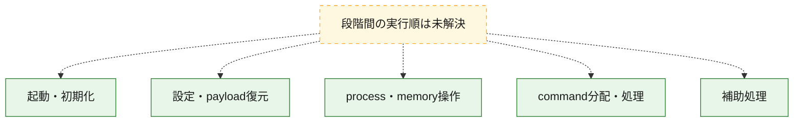
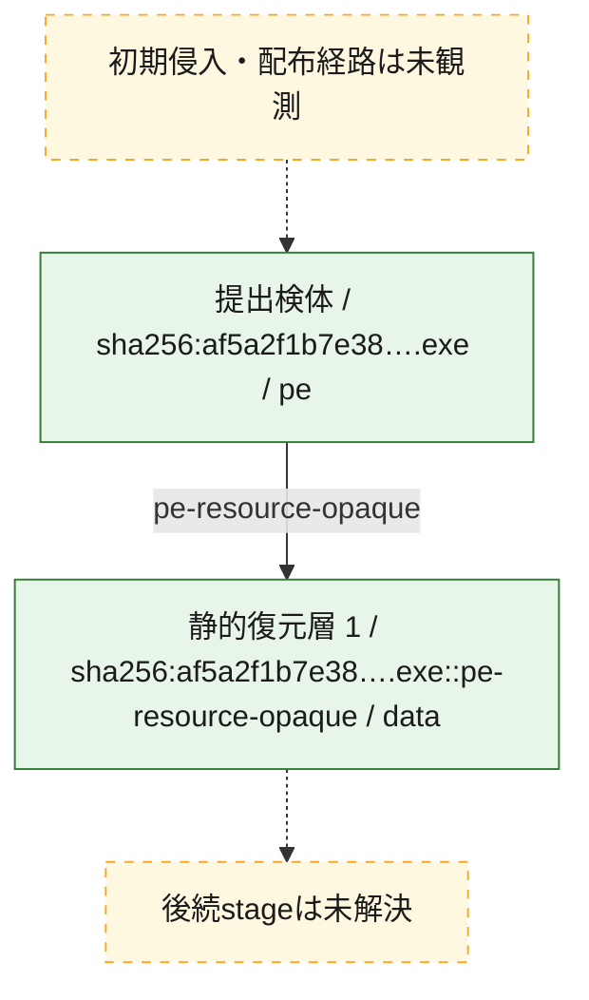
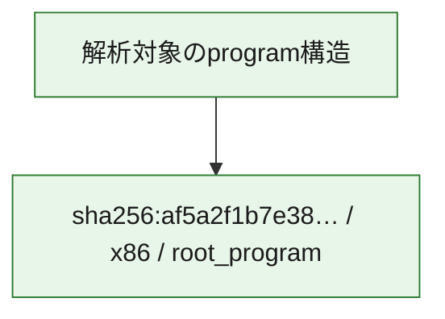

# 全体ロジック：af5a2f1b7e388d4fb49d72e8f453fda673472ad603bf72aee4869a34b37f535a

代表関数の静的証跡から、起動・初期化、設定・payload復元、process・memory操作、command分配・処理の処理群を確認しました。

## 読み方

- phaseの掲載順は解析上の整理順です。observed_call_edgesがない段階間の実行順を断定しません。
- 図の実線は静的に観測した関係、点線と黄色のノードは未観測・未解決の関係を示します。
- 図は静的な要約であり、動的実行を再現するものではありません。
- 詳細な関数解説とfingerprintは[STATIC-LOGIC.md](STATIC-LOGIC.md)を参照してください。

## 静的可視化

### 実行フロー

### 感染チェーン

### モジュール関係

## 処理段階

### 1. 起動・初期化

entry pointから初期化と後続処理への移行を確認します。
確度: `confirmed_static_function_evidence`

- `af5a2f1b7e388d4fb49d72e8f453fda673472ad603bf72aee4869a34b37f535a:ghidra:1800022c4` — 初期化と主要処理への分岐を行う入口関数です。 状態: `succeeded`、選定理由: `entry_point`, `meaningful_symbol_name`, `reviewed_call_centrality:5`, `role:entrypoint`

### 2. 設定・payload復元

設定、resource、payload、暗号化データの復元・変換を確認します。
確度: `confirmed_static_function_evidence`

- `af5a2f1b7e388d4fb49d72e8f453fda673472ad603bf72aee4869a34b37f535a:ghidra:180001020` — 設定、resource、payloadなどの解析・変換を行う関数です。 状態: `succeeded`、選定理由: `entry_point`, `meaningful_symbol_name`, `reviewed_call_centrality:38`, `role:config_or_data_transform`

### 3. process・memory操作

process、thread、module、memory操作と実行移行を確認します。
確度: `confirmed_static_function_evidence`

- `af5a2f1b7e388d4fb49d72e8f453fda673472ad603bf72aee4869a34b37f535a:ghidra:180001b30` — process、thread、module、またはmemory操作に関係する関数です。 状態: `succeeded`、選定理由: `context_representative`, `reviewed_call_centrality:14`, `role:process_or_memory_operation`
- `af5a2f1b7e388d4fb49d72e8f453fda673472ad603bf72aee4869a34b37f535a:ghidra:180001d20` — process、thread、module、またはmemory操作に関係する関数です。 状態: `succeeded`、選定理由: `context_representative`, `reviewed_call_centrality:14`, `role:process_or_memory_operation`
- `af5a2f1b7e388d4fb49d72e8f453fda673472ad603bf72aee4869a34b37f535a:ghidra:180002304` — process、thread、module、またはmemory操作に関係する関数です。 状態: `succeeded`、選定理由: `context_representative`, `reviewed_call_centrality:10`, `role:process_or_memory_operation`

### 4. command分配・処理

受信commandやtaskの解釈、分配、個別handlerへの移行を確認します。
確度: `confirmed_static_function_evidence_with_limits`

- `af5a2f1b7e388d4fb49d72e8f453fda673472ad603bf72aee4869a34b37f535a:ghidra:180001fb0` — commandの解釈、分配、または個別処理を担当する関数です。 状態: `succeeded`、選定理由: `context_representative`, `reviewed_call_centrality:25`, `role:command_dispatch_or_handler`
- `af5a2f1b7e388d4fb49d72e8f453fda673472ad603bf72aee4869a34b37f535a:ghidra:180002000` — commandの解釈、分配、または個別処理を担当する関数です。 状態: `succeeded`、選定理由: `context_representative`, `reviewed_call_centrality:15`, `role:command_dispatch_or_handler`
- `af5a2f1b7e388d4fb49d72e8f453fda673472ad603bf72aee4869a34b37f535a:ghidra:1800024bc` — commandの解釈、分配、または個別処理を担当する関数です。 状態: `succeeded`、選定理由: `context_representative`, `reviewed_call_centrality:4`, `role:command_dispatch_or_handler`
- `af5a2f1b7e388d4fb49d72e8f453fda673472ad603bf72aee4869a34b37f535a:ghidra:18000272c` — commandの解釈、分配、または個別処理を担当する関数です。 状態: `succeeded`、選定理由: `context_representative`, `reviewed_call_centrality:3`, `role:command_dispatch_or_handler`
- `af5a2f1b7e388d4fb49d72e8f453fda673472ad603bf72aee4869a34b37f535a:ghidra:1800140a0` — commandの解釈、分配、または個別処理を担当する関数です。 状態: `limited_bad_instruction_or_flow`、選定理由: `meaningful_symbol_name`, `reviewed_call_centrality:4`, `role:command_dispatch_or_handler`

### 5. 補助処理

主要処理を支える一般内部関数またはlibrary処理を確認します。
確度: `confirmed_static_function_evidence`

- `af5a2f1b7e388d4fb49d72e8f453fda673472ad603bf72aee4869a34b37f535a:ghidra:180001510` — 検体内部の一般処理を実装する関数です。 状態: `succeeded`、選定理由: `context_representative`, `reviewed_call_centrality:3`
- `af5a2f1b7e388d4fb49d72e8f453fda673472ad603bf72aee4869a34b37f535a:ghidra:180001580` — 検体内部の一般処理を実装する関数です。 状態: `succeeded`、選定理由: `context_representative`, `reviewed_call_centrality:3`
- `af5a2f1b7e388d4fb49d72e8f453fda673472ad603bf72aee4869a34b37f535a:ghidra:180001630` — 検体内部の一般処理を実装する関数です。 状態: `succeeded`、選定理由: `context_representative`, `reviewed_call_centrality:4`
- `af5a2f1b7e388d4fb49d72e8f453fda673472ad603bf72aee4869a34b37f535a:ghidra:1800018c0` — 検体内部の一般処理を実装する関数です。 状態: `succeeded`、選定理由: `context_representative`, `reviewed_call_centrality:8`
- `af5a2f1b7e388d4fb49d72e8f453fda673472ad603bf72aee4869a34b37f535a:ghidra:180001eb0` — 検体内部の一般処理を実装する関数です。 状態: `succeeded`、選定理由: `context_representative`, `reviewed_call_centrality:5`
- `af5a2f1b7e388d4fb49d72e8f453fda673472ad603bf72aee4869a34b37f535a:ghidra:180001f60` — 検体内部の一般処理を実装する関数です。 状態: `succeeded`、選定理由: `context_representative`, `reviewed_call_centrality:1`
- `af5a2f1b7e388d4fb49d72e8f453fda673472ad603bf72aee4869a34b37f535a:ghidra:180002118` — 検体内部の一般処理を実装する関数です。 状態: `succeeded`、選定理由: `context_representative`, `reviewed_call_centrality:11`
- `af5a2f1b7e388d4fb49d72e8f453fda673472ad603bf72aee4869a34b37f535a:ghidra:18000219c` — 検体内部の一般処理を実装する関数です。 状態: `succeeded`、選定理由: `context_representative`, `reviewed_call_centrality:4`
- `af5a2f1b7e388d4fb49d72e8f453fda673472ad603bf72aee4869a34b37f535a:ghidra:1800023d8` — 検体内部の一般処理を実装する関数です。 状態: `succeeded`、選定理由: `context_representative`, `reviewed_call_centrality:4`
- `af5a2f1b7e388d4fb49d72e8f453fda673472ad603bf72aee4869a34b37f535a:ghidra:1800023f4` — 検体内部の一般処理を実装する関数です。 状態: `succeeded`、選定理由: `context_representative`, `reviewed_call_centrality:6`
- `af5a2f1b7e388d4fb49d72e8f453fda673472ad603bf72aee4869a34b37f535a:ghidra:180002430` — 検体内部の一般処理を実装する関数です。 状態: `succeeded`、選定理由: `context_representative`, `reviewed_call_centrality:7`
- `af5a2f1b7e388d4fb49d72e8f453fda673472ad603bf72aee4869a34b37f535a:ghidra:180002464` — 検体内部の一般処理を実装する関数です。 状態: `succeeded`、選定理由: `context_representative`, `reviewed_call_centrality:3`
- `af5a2f1b7e388d4fb49d72e8f453fda673472ad603bf72aee4869a34b37f535a:ghidra:18000247c` — 検体内部の一般処理を実装する関数です。 状態: `succeeded`、選定理由: `context_representative`, `reviewed_call_centrality:4`
- `af5a2f1b7e388d4fb49d72e8f453fda673472ad603bf72aee4869a34b37f535a:ghidra:1800024a4` — 検体内部の一般処理を実装する関数です。 状態: `succeeded`、選定理由: `context_representative`, `reviewed_call_centrality:3`
- `af5a2f1b7e388d4fb49d72e8f453fda673472ad603bf72aee4869a34b37f535a:ghidra:18000251c` — 検体内部の一般処理を実装する関数です。 状態: `succeeded`、選定理由: `context_representative`, `reviewed_call_centrality:6`
- `af5a2f1b7e388d4fb49d72e8f453fda673472ad603bf72aee4869a34b37f535a:ghidra:18000254c` — 検体内部の一般処理を実装する関数です。 状態: `succeeded`、選定理由: `context_representative`, `reviewed_call_centrality:4`
- `af5a2f1b7e388d4fb49d72e8f453fda673472ad603bf72aee4869a34b37f535a:ghidra:180002560` — 検体内部の一般処理を実装する関数です。 状態: `succeeded`、選定理由: `context_representative`, `reviewed_call_centrality:6`
- `af5a2f1b7e388d4fb49d72e8f453fda673472ad603bf72aee4869a34b37f535a:ghidra:18000259c` — 検体内部の一般処理を実装する関数です。 状態: `succeeded`、選定理由: `context_representative`, `reviewed_call_centrality:5`
- `af5a2f1b7e388d4fb49d72e8f453fda673472ad603bf72aee4869a34b37f535a:ghidra:180002628` — 検体内部の一般処理を実装する関数です。 状態: `succeeded`、選定理由: `context_representative`, `reviewed_call_centrality:4`
- `af5a2f1b7e388d4fb49d72e8f453fda673472ad603bf72aee4869a34b37f535a:ghidra:1800026c0` — 検体内部の一般処理を実装する関数です。 状態: `succeeded`、選定理由: `context_representative`, `reviewed_call_centrality:6`
- `af5a2f1b7e388d4fb49d72e8f453fda673472ad603bf72aee4869a34b37f535a:ghidra:1800026e4` — 検体内部の一般処理を実装する関数です。 状態: `succeeded`、選定理由: `context_representative`, `reviewed_call_centrality:4`
- `af5a2f1b7e388d4fb49d72e8f453fda673472ad603bf72aee4869a34b37f535a:ghidra:1800027a4` — 検体内部の一般処理を実装する関数です。 状態: `succeeded`、選定理由: `meaningful_symbol_name`

## 観測したcall関係

- 代表関数間で直接解決できた呼出関係はありません。

## 解析範囲と制約

- 選定外関数は全体inventoryへ残しますが、関数本体の個別解説対象にはしていません。
- indirect call、難読化、packer、VM、壊れたcontrol flowによりcall関係が欠落する場合があります。
- 文書は静的解析に基づき、検体実行や外部通信による動的確認は行っていません。
