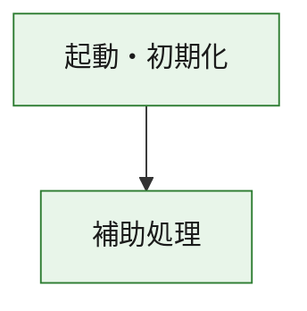
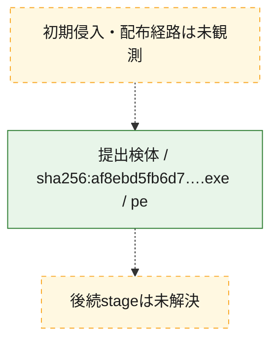
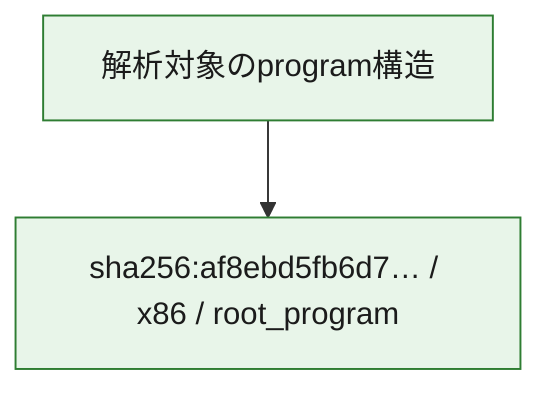

# 全体ロジック：af8ebd5fb6d7f7fe4542464aadb9c5ec32a81da587a744d0a8b93dddd3ad08ff

代表関数の静的証跡から、起動・初期化の処理群を確認しました。

## 読み方

- phaseの掲載順は解析上の整理順です。observed_call_edgesがない段階間の実行順を断定しません。
- 図の実線は静的に観測した関係、点線と黄色のノードは未観測・未解決の関係を示します。
- 図は静的な要約であり、動的実行を再現するものではありません。
- 詳細な関数解説とfingerprintは[STATIC-LOGIC.md](STATIC-LOGIC.md)を参照してください。

## 静的可視化

### 実行フロー

### 感染チェーン

### モジュール関係

## 処理段階

### 1. 起動・初期化

entry pointから初期化と後続処理への移行を確認します。
確度: `confirmed_static_function_evidence`

- `af8ebd5fb6d7f7fe4542464aadb9c5ec32a81da587a744d0a8b93dddd3ad08ff:ghidra:180001010` — 初期化と主要処理への分岐を行う入口関数です。 状態: `succeeded`、選定理由: `entry_point`, `meaningful_symbol_name`, `reviewed_call_centrality:22`, `role:entrypoint`, `small_program_complete_context`

### 2. 補助処理

主要処理を支える一般内部関数またはlibrary処理を確認します。
確度: `confirmed_static_function_evidence`

- `af8ebd5fb6d7f7fe4542464aadb9c5ec32a81da587a744d0a8b93dddd3ad08ff:ghidra:180001240` — 検体内部の一般処理を実装する関数です。 状態: `succeeded`、選定理由: `context_representative`, `reviewed_call_centrality:2`, `small_program_complete_context`
- `af8ebd5fb6d7f7fe4542464aadb9c5ec32a81da587a744d0a8b93dddd3ad08ff:ghidra:180001350` — 検体内部の一般処理を実装する関数です。 状態: `succeeded`、選定理由: `context_representative`, `reviewed_call_centrality:25`, `small_program_complete_context`
- `af8ebd5fb6d7f7fe4542464aadb9c5ec32a81da587a744d0a8b93dddd3ad08ff:ghidra:180003780` — 検体内部の一般処理を実装する関数です。 状態: `succeeded`、選定理由: `context_representative`, `reviewed_call_centrality:2`, `small_program_complete_context`
- `af8ebd5fb6d7f7fe4542464aadb9c5ec32a81da587a744d0a8b93dddd3ad08ff:ghidra:1800038e0` — 検体内部の一般処理を実装する関数です。 状態: `succeeded`、選定理由: `context_representative`, `reviewed_call_centrality:2`, `small_program_complete_context`

## 観測したcall関係

- `af8ebd5fb6d7f7fe4542464aadb9c5ec32a81da587a744d0a8b93dddd3ad08ff:ghidra:180001010` → `af8ebd5fb6d7f7fe4542464aadb9c5ec32a81da587a744d0a8b93dddd3ad08ff:ghidra:180001240` （`startup` → `support`）
- `af8ebd5fb6d7f7fe4542464aadb9c5ec32a81da587a744d0a8b93dddd3ad08ff:ghidra:180001010` → `af8ebd5fb6d7f7fe4542464aadb9c5ec32a81da587a744d0a8b93dddd3ad08ff:ghidra:180001350` （`startup` → `support`）
- `af8ebd5fb6d7f7fe4542464aadb9c5ec32a81da587a744d0a8b93dddd3ad08ff:ghidra:180001350` → `af8ebd5fb6d7f7fe4542464aadb9c5ec32a81da587a744d0a8b93dddd3ad08ff:ghidra:180001240` （`support` → `support`）
- `af8ebd5fb6d7f7fe4542464aadb9c5ec32a81da587a744d0a8b93dddd3ad08ff:ghidra:180001350` → `af8ebd5fb6d7f7fe4542464aadb9c5ec32a81da587a744d0a8b93dddd3ad08ff:ghidra:180003780` （`support` → `support`）
- `af8ebd5fb6d7f7fe4542464aadb9c5ec32a81da587a744d0a8b93dddd3ad08ff:ghidra:180001350` → `af8ebd5fb6d7f7fe4542464aadb9c5ec32a81da587a744d0a8b93dddd3ad08ff:ghidra:1800038e0` （`support` → `support`）
- `af8ebd5fb6d7f7fe4542464aadb9c5ec32a81da587a744d0a8b93dddd3ad08ff:ghidra:180003780` → `af8ebd5fb6d7f7fe4542464aadb9c5ec32a81da587a744d0a8b93dddd3ad08ff:ghidra:1800038e0` （`support` → `support`）
- `ghidra-function:224f18eff637f7f2aa015ed2` → `ghidra-function:1b1aa6519ad5bd2d6cf6a5e0` （`unclassified` → `unclassified`）
- `ghidra-function:224f18eff637f7f2aa015ed2` → `ghidra-function:386e23db03489ffabd705522` （`unclassified` → `unclassified`）
- `ghidra-function:224f18eff637f7f2aa015ed2` → `ghidra-function:4bc56538bf377970a86c42b9` （`unclassified` → `unclassified`）
- `ghidra-function:224f18eff637f7f2aa015ed2` → `ghidra-function:53bb31f3ff22e22b258f8f97` （`unclassified` → `unclassified`）
- `ghidra-function:224f18eff637f7f2aa015ed2` → `ghidra-function:7e6f47310390acbd8832f7e6` （`unclassified` → `unclassified`）
- `ghidra-function:224f18eff637f7f2aa015ed2` → `ghidra-function:86601fdd864983c940d25da6` （`unclassified` → `unclassified`）
- `ghidra-function:224f18eff637f7f2aa015ed2` → `ghidra-function:a9b0aef724daceb89b8082f6` （`unclassified` → `unclassified`）
- `ghidra-function:224f18eff637f7f2aa015ed2` → `ghidra-function:b4d6e904899fd6c9de67def6` （`unclassified` → `unclassified`）
- `ghidra-function:224f18eff637f7f2aa015ed2` → `ghidra-function:b6b6c67b50f0f43ec1a8c911` （`unclassified` → `unclassified`）
- `ghidra-function:224f18eff637f7f2aa015ed2` → `ghidra-function:cd929001f8d60d201ef96dcc` （`unclassified` → `unclassified`）
- `ghidra-function:224f18eff637f7f2aa015ed2` → `ghidra-function:d026d3b38c5137663e2ef7a5` （`unclassified` → `unclassified`）
- `ghidra-function:224f18eff637f7f2aa015ed2` → `ghidra-function:ffc52d18d2610ac4653cfbb9` （`unclassified` → `unclassified`）
- `ghidra-function:a9b0aef724daceb89b8082f6` → `ghidra-external:06a3cc72cfaf472c3fbf1cea` （`unclassified` → `unclassified`）
- `ghidra-function:a9b0aef724daceb89b8082f6` → `ghidra-external:0a2cedd36cb4eda066927874` （`unclassified` → `unclassified`）
- `ghidra-function:a9b0aef724daceb89b8082f6` → `ghidra-external:1fb0f3463f4947ca0041a3f1` （`unclassified` → `unclassified`）
- `ghidra-function:a9b0aef724daceb89b8082f6` → `ghidra-external:3430b5e5fa057720816008da` （`unclassified` → `unclassified`）
- `ghidra-function:a9b0aef724daceb89b8082f6` → `ghidra-external:3db8025b6c2936f084cbe13e` （`unclassified` → `unclassified`）
- `ghidra-function:a9b0aef724daceb89b8082f6` → `ghidra-external:3e4427337c80417c482dbbb6` （`unclassified` → `unclassified`）
- `ghidra-function:a9b0aef724daceb89b8082f6` → `ghidra-external:51d09beca815339b13d1c5e2` （`unclassified` → `unclassified`）
- `ghidra-function:a9b0aef724daceb89b8082f6` → `ghidra-external:58dc5acdc840208a84c1ebad` （`unclassified` → `unclassified`）
- `ghidra-function:a9b0aef724daceb89b8082f6` → `ghidra-external:5f88cd2f19d065314d840b5c` （`unclassified` → `unclassified`）
- `ghidra-function:a9b0aef724daceb89b8082f6` → `ghidra-external:658dfc334b03af5e4f3fd216` （`unclassified` → `unclassified`）
- `ghidra-function:a9b0aef724daceb89b8082f6` → `ghidra-external:85fbb7fcc8a0628cdb768b1f` （`unclassified` → `unclassified`）
- `ghidra-function:a9b0aef724daceb89b8082f6` → `ghidra-external:8916e91386e81a49ba258688` （`unclassified` → `unclassified`）
- `ghidra-function:a9b0aef724daceb89b8082f6` → `ghidra-external:8b7df22a06c7d4fef2226813` （`unclassified` → `unclassified`）
- `ghidra-function:a9b0aef724daceb89b8082f6` → `ghidra-external:8c895eaaf6bd5aba869722e9` （`unclassified` → `unclassified`）
- `ghidra-function:a9b0aef724daceb89b8082f6` → `ghidra-external:901455d1bbc4c614135ef8ce` （`unclassified` → `unclassified`）
- `ghidra-function:a9b0aef724daceb89b8082f6` → `ghidra-external:a1b01bbcf8fa7b777de77b4c` （`unclassified` → `unclassified`）
- `ghidra-function:a9b0aef724daceb89b8082f6` → `ghidra-external:c721513e1642dbd2be8b3ef9` （`unclassified` → `unclassified`）
- `ghidra-function:a9b0aef724daceb89b8082f6` → `ghidra-external:c9b56ec8ec111fdb2b93ca4d` （`unclassified` → `unclassified`）
- `ghidra-function:a9b0aef724daceb89b8082f6` → `ghidra-external:cbe9a3fb2a90d30019ba78fd` （`unclassified` → `unclassified`）
- `ghidra-function:a9b0aef724daceb89b8082f6` → `ghidra-external:e7e246e557118590a8f9e3ef` （`unclassified` → `unclassified`）
- `ghidra-function:a9b0aef724daceb89b8082f6` → `ghidra-external:e81e358a641b3f9bbe8506ed` （`unclassified` → `unclassified`）
- `ghidra-function:a9b0aef724daceb89b8082f6` → `ghidra-function:8e592817f213c2b2a999748b` （`unclassified` → `unclassified`）
- `ghidra-function:a9b0aef724daceb89b8082f6` → `ghidra-function:aca4d8edc8057b12a36fd29f` （`unclassified` → `unclassified`）
- `ghidra-function:a9b0aef724daceb89b8082f6` → `ghidra-function:b4d6e904899fd6c9de67def6` （`unclassified` → `unclassified`）
- `ghidra-function:aca4d8edc8057b12a36fd29f` → `ghidra-function:8e592817f213c2b2a999748b` （`unclassified` → `unclassified`）

## 解析範囲と制約

- 選定外関数は全体inventoryへ残しますが、関数本体の個別解説対象にはしていません。
- indirect call、難読化、packer、VM、壊れたcontrol flowによりcall関係が欠落する場合があります。
- 文書は静的解析に基づき、検体実行や外部通信による動的確認は行っていません。
