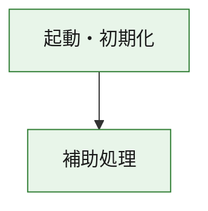
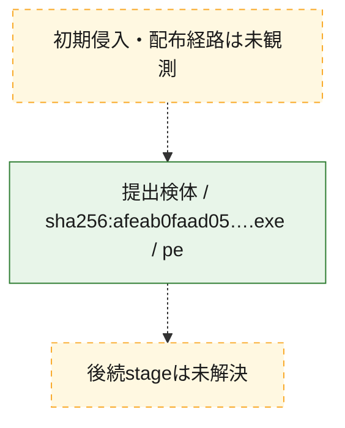
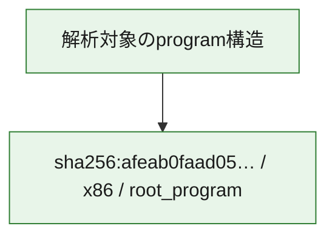

# 全体ロジック：afeab0faad05bdaafab882b1537df32cbd5a2e8b4cd78c617b155551f92e4a5b

代表関数の静的証跡から、起動・初期化の処理群を確認しました。

## 読み方

- phaseの掲載順は解析上の整理順です。observed_call_edgesがない段階間の実行順を断定しません。
- 図の実線は静的に観測した関係、点線と黄色のノードは未観測・未解決の関係を示します。
- 図は静的な要約であり、動的実行を再現するものではありません。
- 詳細な関数解説とfingerprintは[STATIC-LOGIC.md](STATIC-LOGIC.md)を参照してください。

## 静的可視化

### 実行フロー

### 感染チェーン

### モジュール関係

## 処理段階

### 1. 起動・初期化

entry pointから初期化と後続処理への移行を確認します。
確度: `confirmed_static_function_evidence`

- `afeab0faad05bdaafab882b1537df32cbd5a2e8b4cd78c617b155551f92e4a5b:ghidra:180001010` — 初期化と主要処理への分岐を行う入口関数です。 状態: `succeeded`、選定理由: `entry_point`, `meaningful_symbol_name`, `reviewed_call_centrality:22`, `role:entrypoint`, `small_program_complete_context`

### 2. 補助処理

主要処理を支える一般内部関数またはlibrary処理を確認します。
確度: `confirmed_static_function_evidence`

- `afeab0faad05bdaafab882b1537df32cbd5a2e8b4cd78c617b155551f92e4a5b:ghidra:180001240` — 検体内部の一般処理を実装する関数です。 状態: `succeeded`、選定理由: `context_representative`, `reviewed_call_centrality:2`, `small_program_complete_context`
- `afeab0faad05bdaafab882b1537df32cbd5a2e8b4cd78c617b155551f92e4a5b:ghidra:180001350` — 検体内部の一般処理を実装する関数です。 状態: `succeeded`、選定理由: `context_representative`, `reviewed_call_centrality:25`, `small_program_complete_context`
- `afeab0faad05bdaafab882b1537df32cbd5a2e8b4cd78c617b155551f92e4a5b:ghidra:180003780` — 検体内部の一般処理を実装する関数です。 状態: `succeeded`、選定理由: `context_representative`, `reviewed_call_centrality:2`, `small_program_complete_context`
- `afeab0faad05bdaafab882b1537df32cbd5a2e8b4cd78c617b155551f92e4a5b:ghidra:1800038e0` — 検体内部の一般処理を実装する関数です。 状態: `succeeded`、選定理由: `context_representative`, `reviewed_call_centrality:2`, `small_program_complete_context`

## 観測したcall関係

- `afeab0faad05bdaafab882b1537df32cbd5a2e8b4cd78c617b155551f92e4a5b:ghidra:180001010` → `afeab0faad05bdaafab882b1537df32cbd5a2e8b4cd78c617b155551f92e4a5b:ghidra:180001240` （`startup` → `support`）
- `afeab0faad05bdaafab882b1537df32cbd5a2e8b4cd78c617b155551f92e4a5b:ghidra:180001010` → `afeab0faad05bdaafab882b1537df32cbd5a2e8b4cd78c617b155551f92e4a5b:ghidra:180001350` （`startup` → `support`）
- `afeab0faad05bdaafab882b1537df32cbd5a2e8b4cd78c617b155551f92e4a5b:ghidra:180001350` → `afeab0faad05bdaafab882b1537df32cbd5a2e8b4cd78c617b155551f92e4a5b:ghidra:180001240` （`support` → `support`）
- `afeab0faad05bdaafab882b1537df32cbd5a2e8b4cd78c617b155551f92e4a5b:ghidra:180001350` → `afeab0faad05bdaafab882b1537df32cbd5a2e8b4cd78c617b155551f92e4a5b:ghidra:180003780` （`support` → `support`）
- `afeab0faad05bdaafab882b1537df32cbd5a2e8b4cd78c617b155551f92e4a5b:ghidra:180001350` → `afeab0faad05bdaafab882b1537df32cbd5a2e8b4cd78c617b155551f92e4a5b:ghidra:1800038e0` （`support` → `support`）
- `afeab0faad05bdaafab882b1537df32cbd5a2e8b4cd78c617b155551f92e4a5b:ghidra:180003780` → `afeab0faad05bdaafab882b1537df32cbd5a2e8b4cd78c617b155551f92e4a5b:ghidra:1800038e0` （`support` → `support`）
- `ghidra-function:12f692d5c8b8990e6da8d845` → `ghidra-external:01d803f8e78bbcf637929e26` （`unclassified` → `unclassified`）
- `ghidra-function:12f692d5c8b8990e6da8d845` → `ghidra-external:045d40d53b144bcc128becdb` （`unclassified` → `unclassified`）
- `ghidra-function:12f692d5c8b8990e6da8d845` → `ghidra-external:08b5861a3cbf103295095913` （`unclassified` → `unclassified`）
- `ghidra-function:12f692d5c8b8990e6da8d845` → `ghidra-external:38be03c8a280bd9ae88af804` （`unclassified` → `unclassified`）
- `ghidra-function:12f692d5c8b8990e6da8d845` → `ghidra-external:3d5c919ffdd038653ea2b2b3` （`unclassified` → `unclassified`）
- `ghidra-function:12f692d5c8b8990e6da8d845` → `ghidra-external:3e4c4c304e281948ede0a765` （`unclassified` → `unclassified`）
- `ghidra-function:12f692d5c8b8990e6da8d845` → `ghidra-external:3ffd02f6a5f54a79a5ec5ff3` （`unclassified` → `unclassified`）
- `ghidra-function:12f692d5c8b8990e6da8d845` → `ghidra-external:6c2d3fc66e61db195e6c4e6c` （`unclassified` → `unclassified`）
- `ghidra-function:12f692d5c8b8990e6da8d845` → `ghidra-external:6e066ff2e2d2358e0dbcfe66` （`unclassified` → `unclassified`）
- `ghidra-function:12f692d5c8b8990e6da8d845` → `ghidra-external:77d40edc4bbd73fa366be453` （`unclassified` → `unclassified`）
- `ghidra-function:12f692d5c8b8990e6da8d845` → `ghidra-external:7c768a5bc3e7081f94b732f0` （`unclassified` → `unclassified`）
- `ghidra-function:12f692d5c8b8990e6da8d845` → `ghidra-external:b6e21ba510aee288f9da0eb9` （`unclassified` → `unclassified`）
- `ghidra-function:12f692d5c8b8990e6da8d845` → `ghidra-external:bfa44e7ec3385c62ae45e194` （`unclassified` → `unclassified`）
- `ghidra-function:12f692d5c8b8990e6da8d845` → `ghidra-external:c37c74bdd569c5516df49b73` （`unclassified` → `unclassified`）
- `ghidra-function:12f692d5c8b8990e6da8d845` → `ghidra-external:c7754d6070b67edd1b4b29fb` （`unclassified` → `unclassified`）
- `ghidra-function:12f692d5c8b8990e6da8d845` → `ghidra-external:ca6da94bd090055f29d728de` （`unclassified` → `unclassified`）
- `ghidra-function:12f692d5c8b8990e6da8d845` → `ghidra-external:cc1ae9e78193b1777b92326d` （`unclassified` → `unclassified`）
- `ghidra-function:12f692d5c8b8990e6da8d845` → `ghidra-external:d0734a8d7c1b497ae7791bdf` （`unclassified` → `unclassified`）
- `ghidra-function:12f692d5c8b8990e6da8d845` → `ghidra-external:de83c56268cb67eca53c77d3` （`unclassified` → `unclassified`）
- `ghidra-function:12f692d5c8b8990e6da8d845` → `ghidra-external:e4581a92271b3e8b68e0116a` （`unclassified` → `unclassified`）
- `ghidra-function:12f692d5c8b8990e6da8d845` → `ghidra-external:f6c12cd7aefa672729830ef2` （`unclassified` → `unclassified`）
- `ghidra-function:12f692d5c8b8990e6da8d845` → `ghidra-function:5158be99b89d049b6586aa6d` （`unclassified` → `unclassified`）
- `ghidra-function:12f692d5c8b8990e6da8d845` → `ghidra-function:d43fa40ae5ee5d1a41bc8186` （`unclassified` → `unclassified`）
- `ghidra-function:12f692d5c8b8990e6da8d845` → `ghidra-function:ddaf98f994d9fc4841eb48bc` （`unclassified` → `unclassified`）
- `ghidra-function:27299edd04ef2eddf1d756c6` → `ghidra-function:0ae80e19db6b4fc0a05f4526` （`unclassified` → `unclassified`）
- `ghidra-function:27299edd04ef2eddf1d756c6` → `ghidra-function:12f692d5c8b8990e6da8d845` （`unclassified` → `unclassified`）
- `ghidra-function:27299edd04ef2eddf1d756c6` → `ghidra-function:140e81133a0211f660246c53` （`unclassified` → `unclassified`）
- `ghidra-function:27299edd04ef2eddf1d756c6` → `ghidra-function:2a9838c7f584a7c75e3b1183` （`unclassified` → `unclassified`）
- `ghidra-function:27299edd04ef2eddf1d756c6` → `ghidra-function:2cf5106bf0e45533c3b76d95` （`unclassified` → `unclassified`）
- `ghidra-function:27299edd04ef2eddf1d756c6` → `ghidra-function:4105448236d5fb4d6f1bac29` （`unclassified` → `unclassified`）
- `ghidra-function:27299edd04ef2eddf1d756c6` → `ghidra-function:49c9b5707e899c8798b239da` （`unclassified` → `unclassified`）
- `ghidra-function:27299edd04ef2eddf1d756c6` → `ghidra-function:5158be99b89d049b6586aa6d` （`unclassified` → `unclassified`）
- `ghidra-function:27299edd04ef2eddf1d756c6` → `ghidra-function:a862ab66033019564399345a` （`unclassified` → `unclassified`）
- `ghidra-function:27299edd04ef2eddf1d756c6` → `ghidra-function:b053e3981bd96b8ba305d49c` （`unclassified` → `unclassified`）
- `ghidra-function:27299edd04ef2eddf1d756c6` → `ghidra-function:b1a3a65b77630749e2de5402` （`unclassified` → `unclassified`）
- `ghidra-function:27299edd04ef2eddf1d756c6` → `ghidra-function:cb0310fe704c2e34a6901d72` （`unclassified` → `unclassified`）
- `ghidra-function:d43fa40ae5ee5d1a41bc8186` → `ghidra-function:ddaf98f994d9fc4841eb48bc` （`unclassified` → `unclassified`）

## 解析範囲と制約

- 選定外関数は全体inventoryへ残しますが、関数本体の個別解説対象にはしていません。
- indirect call、難読化、packer、VM、壊れたcontrol flowによりcall関係が欠落する場合があります。
- 文書は静的解析に基づき、検体実行や外部通信による動的確認は行っていません。
