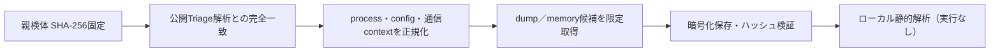

# Triage公開解析・後段取得証跡

## 完全ハッシュ一致

- [260802-leew4sgb83](https://tria.ge/260802-leew4sgb83): ファミリー候補 `neshta`、評価score `10`
- [260712-1jejgabs3v](https://tria.ge/260712-1jejgabs3v): ファミリー候補 `neshta`、評価score `10`

## プロセス・通信

- 観測process: `2026-07-12_f75568d900a96c55b60e19d0e7670dcf_cobalt-strike_elex_icedid_luca-stealer_neshta_njrat.exe, b0171c900fcc422ebb4bae4807728717a9f7fd9dce2f6c3735a83196905a2105.exe`
- raw commandは保存せず、command SHA-256と処理patternだけをJSONへ保持しています。
- sandbox background trafficは`context_only`であり、C2へ自動昇格しません。

- 取得できませんでした。

## 二段目成果物

- 取得できませんでした。

## 判定境界

Triage由来のfamily、process、config、通信は外部sandbox証跡です。config extractorが返したendpointはC2候補として扱えますが、
静的設定復元またはprocess帰属とprotocol応答が揃うまでは確認済みC2とはしません。取得成果物と検体は実行していません。
